## NLP 简介与课程安排
讲座首先概述了本课程，重点讲解自然语言处理(Natural Language Processing)的基础知识。讲师列出了课程大纲，涵盖 NLP 的定义、发展动因、核心挑战以及课程安排。简短的教务说明指出，本次课程将录制并上传至 YouTube。录制时会尽量避免拍摄学生画面，但讨论环节的音频可能会被保留，以供远程听众收听。

## NLP 的定义及其核心组件
当被要求界定 NLP 时，学生们准确地将其概括为一种帮助机器理解人类语言、进而实现人机交互的技术。讲师对此进行了延伸，强调了 NLP 的两大支柱：自然语言理解(Natural Language Understanding)和自然语言生成(Natural Language Generation)。这两大核心组件共同奠定了利用计算工具处理人类语言的基础。

## NLP 技术的广泛应用
NLP 技术涵盖多个关键应用领域。它通过问答系统(Question Answering)、对话系统(Conversational Systems)和可执行代码生成(Executable Code Generation)来辅助人机交互。同时，它也通过机器翻译(Machine Translation)、拼写检查与辅助写作来促进人际交流。除直接的通信功能外，NLP 还能执行句法分析(Syntax Analysis)、文本分类(Text Classification)和实体识别(Entity Recognition)等语言分析任务。这些分析能力对于在大规模数据集中提取与整合信息、以支持科学研究及其他分析目标至关重要。

## 日常工具与大语言模型表现
现代 NLP 已深度融入日常工作流程，通常在 Google Docs 等应用程序后台静默运行，提供实时拼写与语法检查。讲座展示了 ChatGPT 等大型语言模型(Large Language Models)的能力，演示了其如何准确回答事实性问题（例如，报出卡内基梅隆大学校长的姓名）。然而，讲师也着重强调了模型的“幻觉”(Hallucination)倾向，并以一个关于 GPT-3.5 Turbo 模型架构的问答为例：该回复看似合理，实则完全错误。

## 跨语言翻译能力
机器翻译直观地展现了 NLP 在不同语种上的性能差异。对于日语等广泛使用的语言，翻译结果已高度准确且流畅自然；但库尔德语等低资源语言(Low-resource Languages)仍面临巨大挑战。实例显示，模型常出现表达生硬及术语误译（例如，将“古生物学家”直译为“化石科学家”，或将“蜥蜴”误译为“蜗牛”）。近期研究表明，与专用的翻译系统相比，即便是 GPT 等先进模型在处理低资源语言时，也会出现更为显著的性能衰减。

## NLP 在科学与社会分析中的应用
语言分析工具是计算社会科学(Computational Social Science)的重要助力，使研究人员能够利用观测数据探究社会性问题。例如，通过分析电影剧本，可以判断男性与女性角色中哪一方被赋予了更多的权力或能动性。通过从文本中自动抽取“施事者”(Agents，执行动作的主体)与“受事者”(Patients，承受动作的客体)，研究人员能够高效整合数据，进而揭示出在电影剧本的历史演变中，男性角色通常被赋予了更高的能动性。

## 基础 NLP 任务的局限性
尽管近年来取得了显著进展，NLP 工具在处理某些基础任务时仍会频频出错。在使用斯坦福 NLP(Stanford NLP)和 spaCy 等广泛应用的命名实体识别(Named Entity Recognition)系统测试《纽约时报》的标准新闻报道时，系统迅速暴露出错漏。常见的错误包括将人名或常见短语误判为组织机构，这表明即便是基础的 NLP 模块，仍需经过严谨的评估与持续优化。

## 课程目标与现代更新
本课程旨在探讨三个核心问题：构建最先进(State-of-the-art)的 NLP 系统需要哪些关键要素？现有系统在哪些场景下容易失效？我们应如何针对性地进行改进以达成特定的 NLP 目标？尽管这些核心议题保持不变，但随着大型语言模型的崛起，该领域的技术格局已发生深刻变革。因此，课程资料已全面更新，以反映最新的学术进展，并契合人工智能驱动的语言技术快速演进的时代背景。

## NLP 系统的高层框架
在导论概述的尾声，讲师提出了一个用于理解 NLP 系统开发的宏观框架(High-level Framework)。其核心观点在于，NLP 系统本质上是一种映射机制(Mapping Mechanism)，负责将输入 `X` 转换为输出 `Y`，且其中至少有一个变量包含语言数据。这一概念模型为课程后续深入探讨具体任务、系统架构与评估方法奠定了坚实基础。

---

## NLP 任务定义与评估标准
讲座首先从翻译这一基础自然语言处理(Natural Language Processing)任务开始探讨。其输入为一种语言的文本，输出为另一种语言的文本。高质量的翻译不仅需准确传达原文语义，还须在目标语言中保持表达流畅。随后，讨论转向多项选择题(Multiple Choice Questions)，其输入为题目背景与选项，输出为正确答案。值得注意的是，尽管大语言模型(Large Language Model)的评估高度依赖此类题型，但在实际应用中却极少采用该格式，这凸显了当前评估实践与实际应用场景之间存在显著脱节。向量搜索(Vector Search)是另一项关键任务：输入包含查询词与文档集合，输出为相关文档或索引。评估搜索性能依赖于可靠的相似度度量指标与合理的阈值设定，以实现对结果的有效过滤。

## NLP 的广泛范畴与项目指南
NLP 涵盖的任务远不止简单的文本到文本映射。这些任务包括语言建模(Language Modeling，如文本续写预测)、文本分类(Text Classification)、信息抽取(Information Extraction)、图像描述(Image Captioning，即图像到文本生成)以及语音识别(Speech Recognition，即语音到文本转换)。从广义上讲，任何以某种形式处理或操纵语言的任务，均可归属于自然语言处理的范畴。 

这一定义对课程项目至关重要：只要项目涉及有意义的语言交互，通常即符合要求。然而，纯粹的代码到代码转换(Code-to-Code Translation)则处于模糊地带，因为代码被视为形式语言(Formal Language)而非自然语言，此类项目可能需要与授课教师进一步确认。

## 构建 NLP 系统的核心范式
2024 年构建 NLP 系统主要遵循三种范式。第一种是基于规则的系统(Rule-based System)，其依赖于人工设计的逻辑（例如通过匹配特定关键词对文本进行分类）。此类系统开发迅速，但性能上限较低，仅适用于简单且边界清晰的任务。第二种是提示(Prompting)，即通过构造直接的问题或指令来调用大语言模型(LLM)。该方法已迅速成为当前的主流范式。 

第三种是微调(Fine-tuning)，即利用成对的训练数据对模型进行进一步训练或适配，使其能够从示例中习得复杂的模式与映射关系。微调通常以预训练模型(Pre-trained Model)或已通过提示调优的基线模型为起点。

## 数据需求与评估策略
系统构建方法的选择在很大程度上决定了其数据需求。基于规则的系统与零样本提示(Zero-shot Prompting)无需初始训练数据，允许开发者完全基于直觉快速构建原型。 

然而，缺乏数据便无法对性能进行严格评估。接下来的步骤是进行定性抽样检查：在相关数据上运行系统，分析错误案例，并据此迭代优化提示词或规则。对于达到专业级标准的开发，严格的评估不可或缺。这要求构建专用的开发集(Development Set)与测试集(Test Set)（通常包含 200 至 2000 个样本），并采用成熟的评估指标来系统性地追踪模型准确率。

## 数据规模扩展与性能权衡
当进入微调阶段时，则需要规模大得多的训练数据集。 

机器学习(Machine Learning)中的一个普遍规律是：成倍增加训练数据规模初期会带来稳定的性能提升。即使仅从零样本提示起步，引入少量标注数据(Annotated Data)也能实现准确率的显著跃升。然而，此类收益遵循边际收益递减(Diminishing Marginal Returns)规律：随着数据集规模的持续扩大，性能增益逐渐收窄，而数据标注的时间与成本却大幅增加。 

因此，从业者必须在边际性能收益与数据收集、标注的实际成本限制之间进行审慎权衡。

---

## NLP 课程的演进与实践重心的转变
讲师在开场答疑环节，重点指出了自上期课程以来，自然语言处理(Natural Language Processing)实践领域发生的重大转变。过去，对于致力于构建实用系统的开发者而言，模型微调(Fine-tuning)曾是必不可少的环节；而如今，它已在很大程度上转变为可选步骤。这一观察源于实际工程经验，反映了当前业界的主流工作流(Workflow)：从业者正将重心前移至数据处理流水线(Data Pipeline)的早期阶段。尽管探讨这一趋势的学术文献可能尚不充分，讲师仍鼓励学生在课程的 Piazza 讨论区分享相关论文或见解，以促进协作交流。
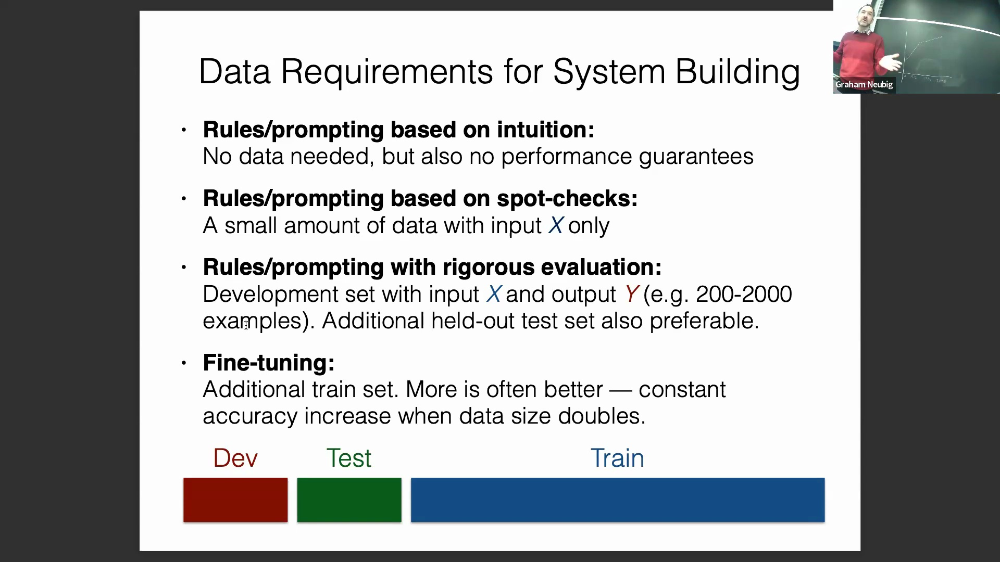
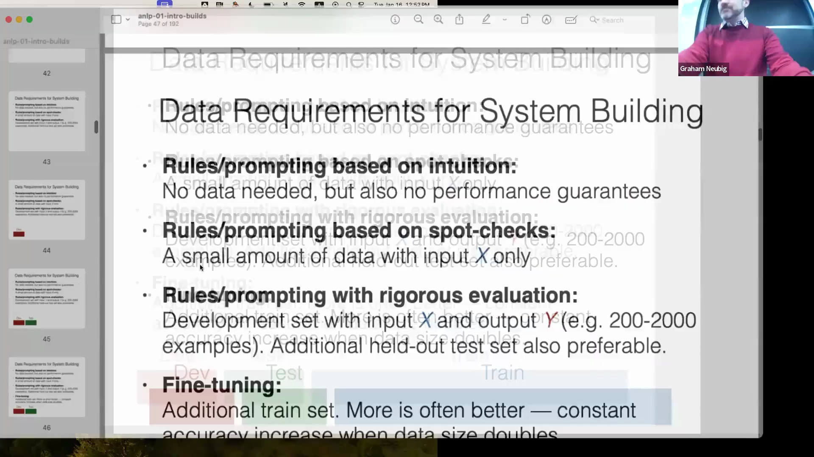
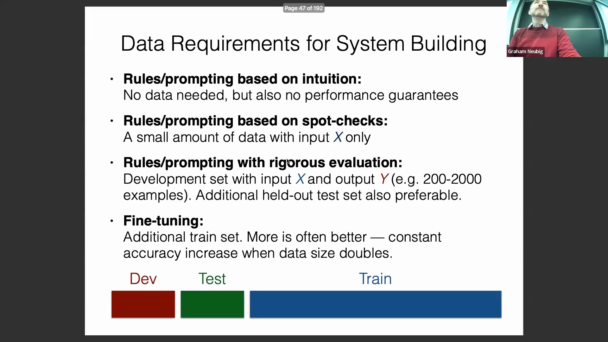

## 引入基于规则的情感分析
随后，课程进入构建基于规则的情感分析(Sentiment Analysis)系统环节。讲师特意将这种方法形容为实际生产环境(Production Environment)中的“糟糕主意”，并以此作为教学切入点，旨在在引入机器学习(Machine Learning)方案之前，充分暴露基于规则的方法所固有的局限性与复杂性。课程强调，针对客户评论的情感分析是现代 NLP 中最具价值的任务之一，可直接赋能产品开发、客户满意度追踪以及社交媒体监控。该任务被正式定义为一个句子级分类(Sentence-level Classification)问题，旨在将文本输入映射为三类输出标签(Output Labels)：正面、中性或负面。
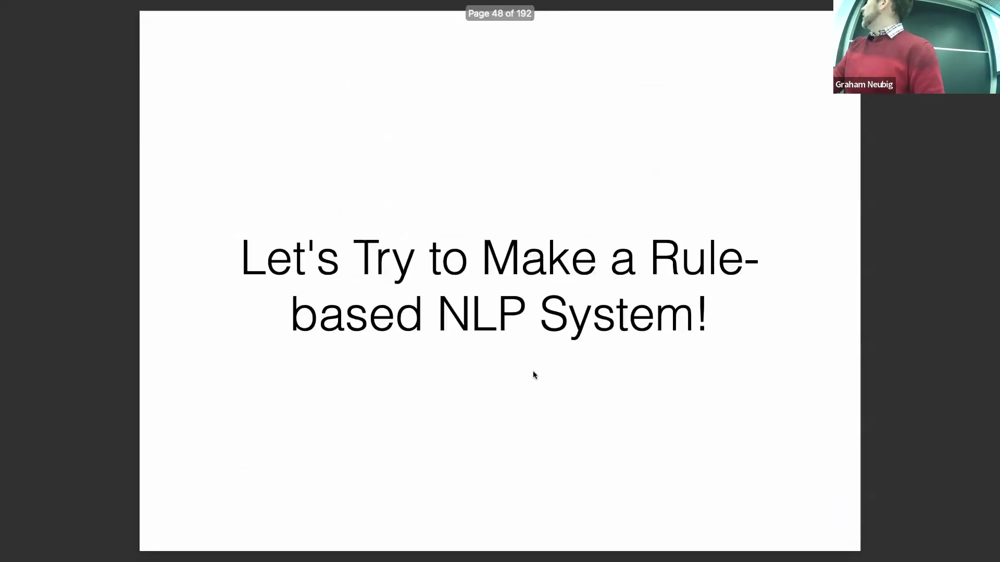

## 理论框架：特征、打分与决策规则
任何分类模型(Classification Model)的架构均依赖于三个按序执行的组件：特征提取(Feature Extraction)、得分计算(Scoring)与决策函数(Decision Function)。特征提取负责从输入文本中抽取出显著属性。得分计算则通过数学运算实现，通常表现为计算特征向量(Feature Vector)与权重向量(Weight Vector)（针对二分类任务(Binary Classification)）或权重矩阵(Weight Matrix)（针对多分类任务(Multi-class Classification)）之间的点积(Dot Product)。最后，决策规则将这些得分映射为最终输出。标准决策规则包括：针对二分类任务的基于阈值的分类(Threshold-based Classification)（针对置信度较低的模糊得分可设置弃权机制(Abstention Mechanism)），以及针对多分类任务的选取最高得分类别(argmax)。讲师指出，诸如自一致性(Self-consistency)和最小贝叶斯风险(Minimum Bayes Risk)等更为复杂的决策机制，将在后续讲解文本生成(Text Generation)时进行深入探讨。
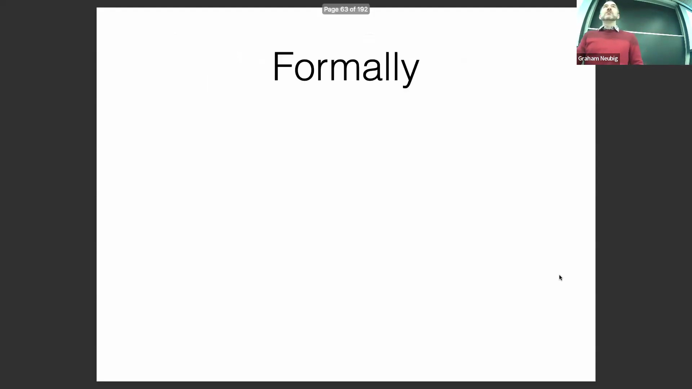

## 代码演示：特征提取与权重分配
进入实操演示环节，讲师在 VS Code 环境中编写并实现了该基于规则的分类器(Rule-based Classifier)。代码从特征提取开始，使用了硬编码(Hard-coded)的正面（如“good”）与负面（如“bad”）词表(Lexicon)。系统仅统计这些词汇在每条输入句子中出现的频次(Frequency)。为完善特征表示(Feature Representation)，代码追加了一个固定值为 1 的偏置(Bias)特征，最终生成一个三维特征向量：`[count_good, count_bad, bias]`。该结构化向量为后续的打分阶段做好了数据准备，并构建了一个清晰且具备可解释性(Interpretability)的特征空间(Feature Space)。
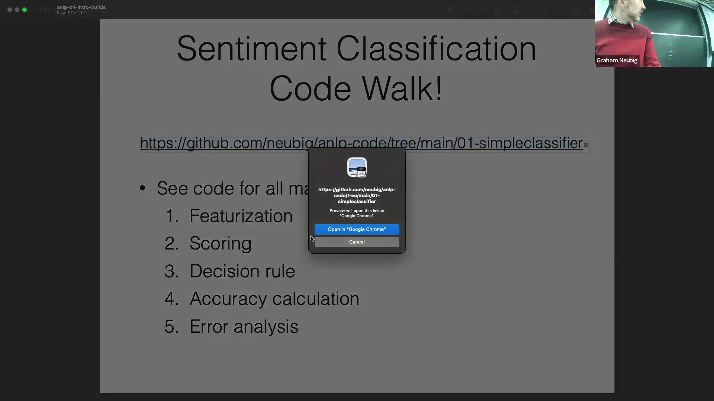
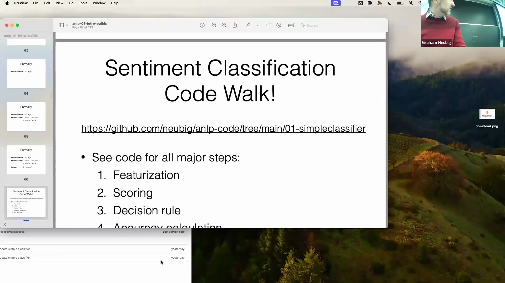

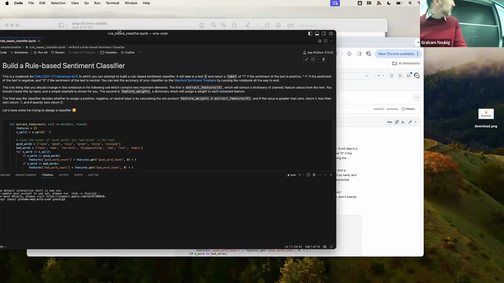
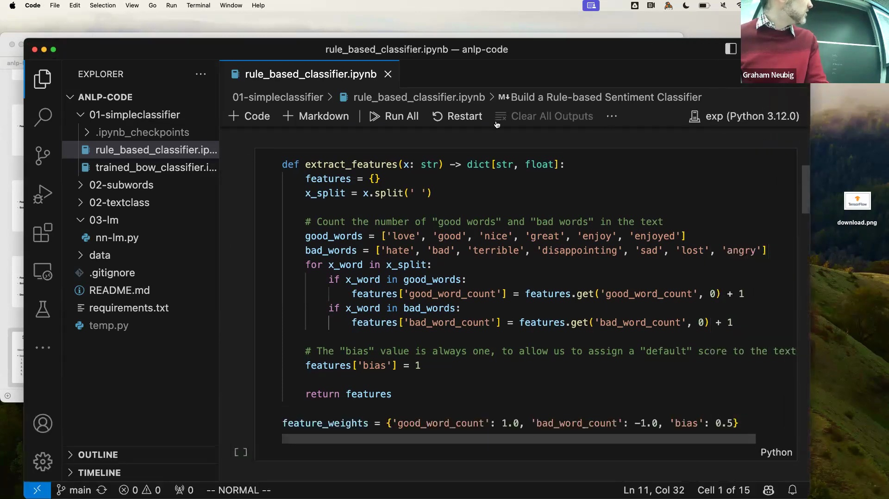

## 打分执行与决策逻辑实现
讲师设定了明确的特征权重(Feature Weights)以计算最终分类得分：每个正面词计 +1 分，每个负面词计 -1 分，偏置项计 -0.5 分。得分通过特征向量与权重向量之间的点积运算得出。随后应用基于阈值的决策规则：得分大于零判定为正面（标签 1），小于零判定为负面（标签 -1），等于零则判定为中性（标签 0）。将该分类器应用于电影评论数据集(Movie Review Dataset)进行测试（数据集中包含一条明显正面、赞扬演员潜力的评论）后，程序顺利执行。然而，最终准确率(Accuracy)仅徘徊在 43% 左右，直接暴露出这种朴素方法(Naive Approach)的显著缺陷。
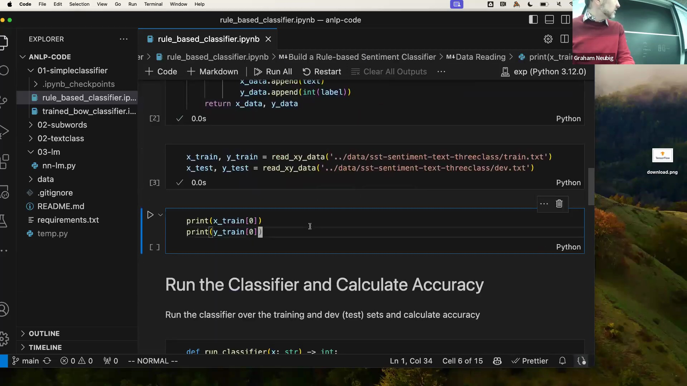
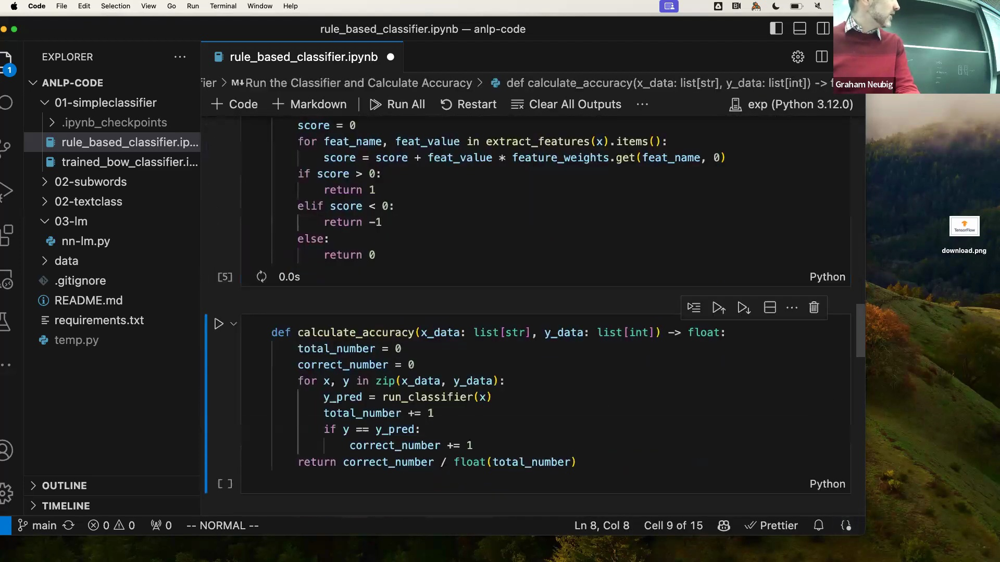

## 错误分析的关键作用
在本节末尾，讲师着重强调了 NLP 工程中的一项基础最佳实践(Best Practice)：全面的错误分析(Error Analysis)。在针对特定任务优化系统时，系统性地审查失败案例往往是实现性能提升的最有效途径。演示中展示了一个基础的错误分析流程，该流程会随机采样预测正确与错误的样本，并将真实标签(Ground Truth)与模型输出(Model Predictions)进行比对。通过人工检视这些误分类(Misclassification)样本，开发者能够识别出僵化的基于规则的系统所无法捕捉的语言模式、上下文歧义(Contextual Ambiguity)或特征缺失，从而为构建更稳健、数据驱动(Data-driven)的解决方案奠定基础。
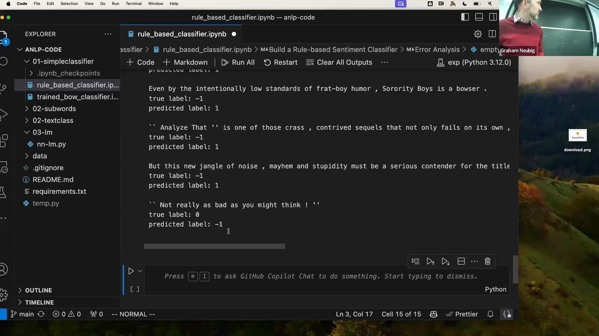

---

## 手动词典扩展与启发式方法的局限
课程伊始，讲师分析了一篇措辞微妙的电影评论。该评论未使用明显的正面或负面关键词，却传达了中性情感(Sentiment)。为展示基于规则系统(Rule-based System)的脆弱性，讲师尝试通过向情感词典(Sentiment Lexicon)中迭代添加“crass”（粗俗）和“engaging”（引人入胜）等特定词汇，来手动修补分类器。在训练集(Training Set)和开发集(Development Set)上评估更新后的模型后，准确率仅实现微幅提升。这一练习凸显了人工维护词表的繁琐与低效，证明迭代式的词典修补并非解决现实自然语言处理(Natural Language Processing, NLP)任务的可扩展方案(Scalable Solution)。

## 情感分析中的核心语言学挑战
讲师系统性地归纳了僵化的基于规则方法在处理复杂文本时失效的根本原因。**低频词(Low-frequency Words)**（例如“purport”或“mucking up”等生僻短语）极易绕过简单的词表匹配，这要求系统整合海量的外部情感资源。**词形变化与形态学(Inflection and Morphology)**构成了另一道障碍；若缺乏专门的词干提取(Stemming)或词形还原(Lemmatization)流水线(Pipeline)，能够匹配“magnificence”（宏伟）的系统将无法识别其派生词“magnificently”（宏伟地）。**否定表达(Negation)**会彻底反转语义极性(Semantic Polarity)（例如“not nearly as dreadful”[远没那么可怕] 或“not serving up laughs”[未能带来欢笑]），这需要复杂的句法解析(Syntactic Parsing)或语义解析(Semantic Parsing)才能正确理解。此外，**隐喻与类比(Metaphor and Analogy)**（如“has all the depth of a wading pool”[像涉水池一样毫无深度]，或暗示导演会为下一部电影“rob people”[坑骗观众]）高度依赖文化背景与隐含意义，这是基础词法规则(Lexical Rules)无法捕捉的。最后，处理**多语言内容(Multilingual Content)**暴露出该方法完全缺乏可扩展性(Scalability)，因为每引入一门新语言都需要从零开始定制一套全新的规则集。

## 基于规则原型的诊断价值与向机器学习的过渡
尽管存在上述严重局限，讲师仍强调基于规则的系统在教学与实际工程中具有重要价值。在项目初期构建一个简单的启发式模型(Heuristic Model)可作为快速诊断工具，帮助工程师清晰识别哪些语言现象增加了任务难度，以及手动规则工程(Rule Engineering)在何处遭遇瓶颈。在明确这些系统边界后，课程正式转向机器学习范式(Machine Learning Paradigm)。该方法从手工设计规则转向数据驱动优化(Data-driven Optimization)，并严格采用训练集、开发集与测试集(Test Set)的独立划分。模型通过标准学习算法，联合优化特征表示与权重参数，并自动学习决策规则(Decision Rules)。

## 作为机器学习基线的词袋模型
课程介绍的首个机器学习基线模型(Baseline Model)是**词袋模型（Bag-of-Words, BoW）**。在该架构中，每个词被映射为独热向量(One-hot Vector)，这些向量在句子层面进行累加，从而生成词频向量(Term Frequency Vector)。随后，该向量与学习到的权重向量(Weight Vector)进行点积运算，以计算分类得分(Classification Score)。关键在于，尽管 BoW 的特征提取(Feature Extraction)过程是固定的（即非数据驱动学习），但其权重会在训练过程中自动优化。讲师引导全班思考：前述的语言学挑战（低频词、词形变化、否定或隐喻）中，哪些可以通过这种基于学习的方法(Learning-based Approach)得到缓解。讨论指出，尽管 BoW 能够凭借数据覆盖自然适应词汇变体与频率分布，但诸如否定和隐喻等更深层次的句法结构与上下文依赖(Contextual Dependency)问题，对于简单的固定特征模型(Fixed-feature Model)而言依然充满挑战。

---

## 词形变化、数据集规模与权重向量解读
课程首先探讨了词袋模型(Bag-of-Words, BoW)如何处理词形变化(Inflection)等语言变体。尽管将不同词形映射至相似的向量空间位置可能部分缓解该问题，但模型本质上依赖的是数据记忆(Data Memorization)而非对形态学(Morphology)的真正理解。借助规模足够庞大的训练数据集(Training Dataset)，模型能够接触到各类词形变体与低频词(Low-frequency Words)，从而降低部分错误率；但若缺乏显式预处理(Explicit Preprocessing)，仍无法彻底解决这些问题。同样，该模型的多语言支持能力(Multilingual Capability)完全取决于目标语言是否具备带标注的训练数据(Labeled Training Data)。为剖析模型的内部机制，讲师详细解释了学习到的权重结构(Learned Weight Structure)：在二分类任务(Binary Classification)中，正权重(Positive Weights)通常与表达正面情感的词汇相关联；而在多分类场景(Multi-class Scenario)中，权重矩阵(Weight Matrix)负责将词频映射至特定的类别标签(Class Labels)，较高的权重值意味着更强的预测相关性(Predictive Relevance)。

## 感知机式训练算法
该 BoW 分类器的核心训练机制(Training Mechanism)异常简洁，仅用单张幻灯片即可概括。算法首先初始化权重向量(Weight Vector)，随后遍历训练数据集，通过简单的分词(Splitting/Tokenization)与词频统计来提取特征。接着运行分类器，并将预测结果(Predictions)与真实标签(Ground Truth Labels)进行比对。一旦发现误分类(Misclassification)，算法会立即执行权重更新(Weight Update)：若真实标签为正类，则按特征向量(Feature Vector)的数值成比例地增加对应特征的权重；若为负类，则相应降低权重。这种增量式更新规则(Incremental Update Rule)使得训练过程高度透明且计算开销(Computational Overhead)极小，是训练线性文本分类器(Linear Text Classifier)最基础、最直观的算法之一（如感知机算法(Perceptron Algorithm)）。

## 代码实现、数据打乱与性能评估
一段实时代码演示(Live Coding Demo)展示了训练好的 BoW 分类器的运行流程。讲师强调了一项关键的预处理步骤：数据打乱(Data Shuffling)。若不进行打乱，模型在按类别顺序排列的数据（如全部正面样本后接全部负面样本）上进行增量更新时，将遭受严重的顺序偏差(Order Bias)，最终可能退化为仅预测单一类别的退化模型(Degenerate Predictor)。在打乱数据并完成五个训练轮次(Training Epochs)后，模型在训练集上的准确率(Accuracy)达到 75%，而在开发集(Development Set)上仅为 56%。相较于手动基于规则系统(Rule-based System) 42% 的基线性能(Baseline Performance)，这是一次显著提升，有力证明了引入机器学习(Machine Learning)的必要性。然而，训练准确率与验证准确率(Validation Accuracy)之间的显著差距明确指向了过拟合(Overfitting)问题，这也是简单线性模型(Linear Models)常见的挑战。

## 稀疏词袋模型的固有局限
尽管较基于规则的方法有所改进，BoW 模型仍存在根本性的架构缺陷(Architectural Flaws)。它将每个词汇视为独立的原子单元(Atomic Units)，完全忽略了词汇间的语义相似性(Semantic Similarity)（例如，“love”与“adore”在向量空间中会被映射为完全正交的无关维度）。该模型也难以有效处理组合特征(Compositional Features)与否定表达(Negation)。诸如“don't love”与“don't hate”等短语蕴含着微妙且反转的语义极性(Semantic Polarity)，而简单的词频统计无法捕捉这种语境交互，因为否定修饰词(Negation Modifiers)会与其所修饰的动词产生复杂的上下文依赖关系。此外，模型对“but”等转折连词(Conjunctions)的建模能力薄弱；在自然语言中，“but”通常暗示需弱化前半句语义，而将重心转移至后半句的情感倾向。这种复杂的逻辑运算(Logical Operations)是稀疏频率向量(Sparse Frequency Vectors)天生无法实现的。讲师指出，此处的权重更新方法与神经网络优化(Neural Network Optimization)共享底层数学原理，为后续深入探讨模型架构奠定了基础。

## 向神经网络与稠密嵌入的演进
为克服稀疏表示(Sparse Representations)的僵化问题，课程引入神经网络(Neural Networks)作为现代解决方案。现代架构不再依赖高维独热向量(High-dimensional One-hot Vectors)，而是采用稠密词嵌入(Dense Word Embeddings)，将词汇映射至连续的低维向量空间(Continuous Low-dimensional Vector Space)，从而有效捕捉深层的语义关系(Semantic Relations)。在最终得分计算(Scoring)之前，这些嵌入向量会经过复杂的非线性激活函数(Non-linear Activation Functions)进行处理，以提取分层特征(Hierarchical Features)。讲师指出，这一基础前向传播流程(Forward Pass)不仅是传统文本分类器的核心，也支撑着现代大语言模型(Large Language Models, LLMs)的提示推理机制(Prompting Mechanism)，因为两者的底层目标均是计算目标标签或下一个词元(Next Token)的预测得分。此外，课程强调了神经网络的理论表征容量(Representational Capacity)：依据通用近似定理(Universal Approximation Theorem)，只要具备足够的深度(Depth)与宽度(Width)，神经网络即可作为通用函数逼近器(Universal Function Approximator)来拟合任意可计算任务。当然，其实际性能(Actual Performance)仍受限于数据可用性(Data Availability)与优化过程中的挑战(Optimization Challenges)。

## 课程路线与后续主题
本节最后概述了课程剩余部分的教学大纲(Course Roadmap)。整个课程体系将系统性地构建于上述基础概念之上，首先从语言建模(Language Modeling)基础讲起。内容将涵盖用于预测序列中下一个词元(Next Token)的自回归模型(Autoregressive Models)，以及基于输入上下文生成响应的提示条件模型(Prompt-conditioned Models)。后续教学模块将深入探讨表示学习(Representation Learning)，重点研究如何提取鲁棒的词嵌入(Robust Word Embeddings)、子词分词算法(Subword Tokenization)的底层工作原理，以及其他现代自然语言处理(NLP)系统所必需的高级预处理范式(Advanced Preprocessing Paradigms)。

---

## 课程大纲与核心架构基础
课程概述了本学期的完整教学路线图(Course Roadmap)，从语言建模(Language Modeling)基础讲起，涵盖词元预测(Token Prediction)与基于提示的生成(Prompt-based Generation)。随后课程过渡至序列建模(Sequence Modeling)部分，在深入剖析 Transformer 架构及其自注意力机制(Self-Attention Mechanism)之前，将简要概述卷积神经网络(Convolutional Neural Networks, CNN)与循环神经网络(Recurrent Neural Networks, RNN)。讲师指出，自 2017 年问世以来，Transformer 的具体实现已发生显著演进(Significant Evolution)，这些现代改进(Modern Improvements)将构成课程的核心重点。课程还将投入大量课时讲解训练与推理(Training and Inference)方法，涵盖文本生成算法(Text Generation Algorithms)、高级提示工程(Advanced Prompt Engineering)、面向多任务适应(Multi-Task Adaptation)的指令微调(Instruction Fine-Tuning)，以及用于输出评估与模型优化(Model Optimization)的强化学习(Reinforcement Learning, RL)框架。

## 实验设计、模型伦理与高级架构
课程大纲的一个重要模块聚焦于实验设计(Experimental Design)与高质量数据标注(Quality Data Annotation)。讲师强调，随着模型性能逐渐超越普通人类标注员(Human Annotators)的水平，获取可靠的人工标签(Human Annotations)正变得愈发困难。讲师指出，稳健的系统调试(Robust Debugging)、自动化可解释性技术(Automated Interpretability Techniques)以及严格的偏见与公平性评估(Bias and Fairness Evaluation)至关重要，尤其是在将 NLP 系统部署至可能引发实际危害的生产环境(Production Environments)时。高级模型架构(Advanced Model Architectures)主题将涵盖模型蒸馏(Model Distillation)与量化(Quantization)技术，旨在构建紧凑且易于部署(Compact and Deployable)的语言模型（例如适用于移动端或本地部署），同时还将探讨模型集成(Model Ensembling)与混合专家(Mixture of Experts, MoE)策略。此外，课程还将深入讲解检索增强生成(Retrieval-Augmented Generation, RAG)、长上下文序列建模(Long-Context Sequence Modeling)，以及复杂推理(Complex Reasoning)、代码生成(Code Generation)、语言智能体(Language Agents)和信息提取(Information Extraction)等高影响力应用(High-Impact Applications)，其中 RAG 与代码生成已被业界列为核心优先方向。

## 语言学基础与研究生级研究导向
尽管现代前沿模型(Frontier Models)已较少依赖显式的语言学规则(Explicit Linguistic Rules)，课程仍将系统探讨语言学基础(Linguistic Foundations)与多语言特性(Multilingual Properties)。深入理解这些核心概念，对于在跨语言任务(Cross-Lingual Tasks)与新型模型架构(Novel Model Architectures)中实现稳健的泛化能力(Robust Generalization)依然至关重要。讲师鼓励学生提交建议，以填补剩余的客座讲座(Guest Lectures)名额，从而使课程内容更契合班级的研究兴趣。作为一门面向研究生的 700 级别高级课程(700-Level Graduate Course)，其核心目标在于培养研究创新能力(Research Innovation)，而非单纯复现(Reproduction)已有工作。课程期望学生能够开发新颖的方法论(Novel Methodologies)，或将成熟技术(Mature Techniques)应用于未探索的领域(Unexplored Domains)，亦或将现有系统扩展至新语种，从而确保教学内容与前沿学术研究(Academic Research)及工业界高阶发展(Advanced Industry Trends)保持同步。

## 教学方法与问题解决框架
本课程的学习框架旨在使学生全面掌握应用于 NLP 的高级机器学习方法(Advanced Machine Learning Methods)、核心语言学知识(Core Linguistics)以及实际案例剖析能力(Case Study Analysis)。讲师明确指出，尽管课程无法穷尽所有 NLP 应用场景，但教学重点将置于培养学生如何解构特定应用(Deconstruct Specific Applications)、识别其独特的计算挑战(Computational Challenges)，并将解决方案的方法论(Methodologies)抽象迁移(Abstract Transfer)至其各自的研究领域。教学方法的另一大核心是系统调试与诊断性评估(Debugging and Diagnostic Evaluation)。准确剖析模型失败的原因与环节(Pinpoint Failure Modes)被视为驱动性能提升的最有效策略，课程将投入大量精力着重培养此项关键分析能力(Critical Analytical Skills)。

## 课程安排、辅导课与考核结构
课程采用推荐的课前阅读材料(Pre-class Readings)（可选但强烈建议）与互动式讲座(Interactive Lectures)及课堂讨论相结合的形式。为强化实践技能，助教(Teaching Assistants, TAs)将在答疑时段主持辅导课(Tutorial Sessions)以及代码调试与数据管道实战(Code and Data Walkthroughs)。这些环节将全面覆盖 Hugging Face、SentencePiece、vLLM、OpenAI API 以及 LightLLM 等行业标准工具库(Industry-Standard Toolkits)。每次讲座结束后，学生需完成一份包含三道题目的简短课后测验(Post-lecture Quizzes)。测验将于讲座当日发布，并于次日截止。该设计旨在不增加学生额外时间负担的前提下，有效检验其对核心概念(Core Concepts)的掌握程度。

## 实践作业与算力可及性
课程的实践环节包含两项核心作业(Core Assignments)。作业一要求学生完成 LLaMA 架构(LLaMA Architecture)的部分代码实现，并在规模较小的数据集上训练一个精简版模型(Scaled-down Model)，从而有效规避官方 70 亿参数(7B Parameter)模型对算力的巨大需求(Compute Requirements)。作业二则要求学生从零构建一个端到端的 NLP 评估流水线(End-to-End NLP Evaluation Pipeline)，在缺乏现成数据集的情况下，独立完成针对特定任务的数据构建(Data Curation)、模型训练与评估工作。为确保算力资源的公平获取(Equitable Access to Compute)，所有作业均严格限制模型参数量或运行成本，并经过专门优化以在消费级标准硬件(Consumer-grade Standard Hardware)上高效运行，例如搭载 Apple Silicon (M1/M2) 的 MacBook 或免费版的 Google Colab 环境。

---

## 计算资源与模型训练限制
讲师探讨了本课程算力分配(Compute Allocation)的实际情况，强调所有作业均经过精心设计，以确保能在搭载 Apple Silicon (M1/M2) 的 MacBook 或免费版 Google Colab 等易于获取的硬件上高效运行。为应对计算负载稍重的任务，课程为每位学生提供 50 美元的 Google Cloud 云额度(Cloud Credits)，但受限于云服务商(Cloud Service Providers)日益收紧的政策，获取额外算力资金仍具挑战。鉴于这些固有的资源限制(Resource Constraints)，课程将对模型训练规模(Model Training Scale)实施严格上限。因此，强烈建议学生基于预训练模型(Pre-trained Models)进行二次开发，而非尝试从零训练(Training from Scratch)大型架构。此举旨在确保所有项目在算力上可行(Computationally Feasible)，并将研究重心聚焦于模型架构与算法创新(Algorithmic Innovation)。

## 高阶作业与期末项目要求
作业 3(Assignment 3)要求学生针对前沿自然语言处理(Natural Language Processing, NLP)研究进行定向文献调研(Literature Review)，随后严格遵循算力可行性指南，对所选方法完成一次完整的功能性复现(Functional Reproduction)。期末项目(Final Project)进一步提高了要求，强调必须具备实质性的学术新颖性(Academic Novelty)与研究贡献。学生需在准确率(Accuracy)、计算效率(Computational Efficiency)或模型可解释性(Model Interpretability)等方面切实提升现有基准表现(Baseline Performance)（需明确定义评估指标 Evaluation Metrics），或成功将成熟技术迁移至未充分探索的任务或低资源语言(Low-Resource Languages)。课程的总体目标是在 NLP 领域产出新知识，推动学生从简单的代码复现向能够带来可验证进展(Verifiable Progress)的原创性研究(Original Research)转变。

## 讲师与助教团队介绍
为营造协作高效的学习环境，课程正式进入教学团队(Teaching Staff)介绍环节。本课程配备七名助教(Teaching Assistants, TAs)，其研究专长涵盖多个领域，包括语言歧义(Linguistic Ambiguity)、社交计算(Social Computing)、软件开发自动化(Software Development Automation)以及多模态计算机视觉融合(Multimodal Computer Vision Integration)。此项介绍具有明确的实用目的：便于学生快速定位适合特定技术咨询(Technical Consultation)的助教，并基于共同的学术兴趣构建同侪交流网络(Peer Networking)。讲师同时鼓励学生分享各自的研究方向(Research Interests)，以构建一个能高效匹配专业知识与项目需求的学术社区(Academic Community)。另有两名因公出差的助教将在后续讲座中补充介绍。

## 课程安排、答疑时间与沟通渠道
讲座末尾概述了必要的课程行政管理(Administrative Guidelines)与沟通规范(Communication Protocols)。讲师与全体助教将定期开放答疑时间(Office Hours)，完整的每周排班表(Weekly Schedule)将不久后发布于课程官方网站。鼓励学生充分利用该时段获取项目指导(Project Guidance)、厘清概念疑问(Conceptual Clarifications)或展开更广泛的研究探讨。但在咨询高峰期，教学团队将优先处理与课程直接相关的核心问题。针对非实时咨询(Asynchronous Communication)，Piazza 将作为官方集中讨论平台，教学团队承诺在工作日(Weekdays) 24 小时内回复所有帖子。课程以最后一次答疑邀请作结，标志着本阶段的教学大纲导览(Syllabus Overview)环节正式结束。
