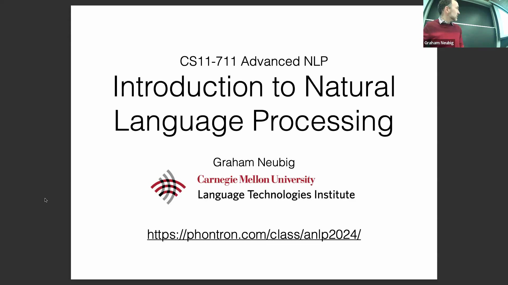
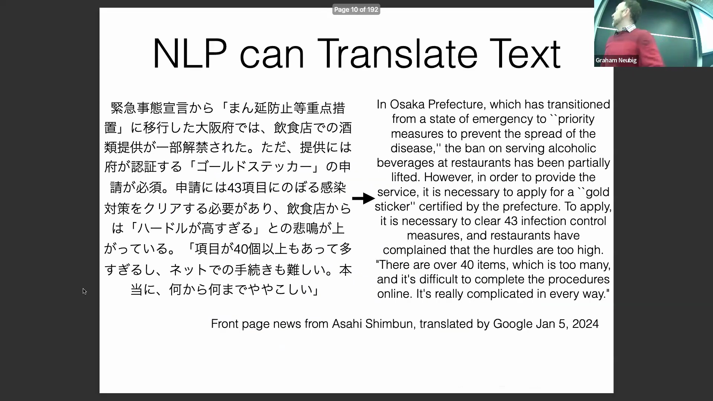
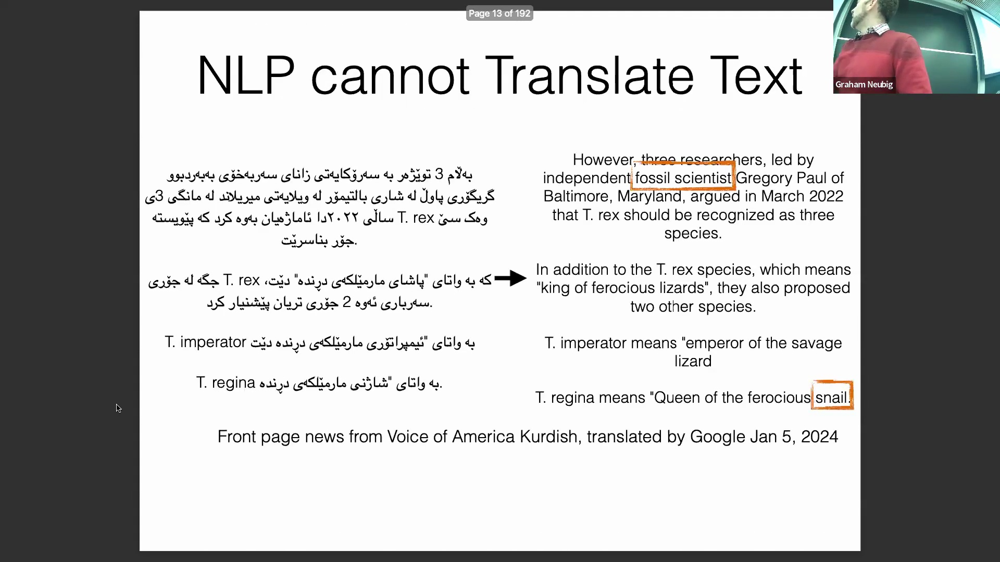
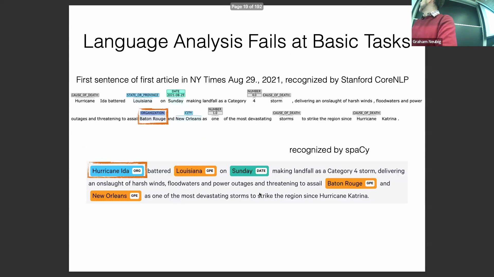
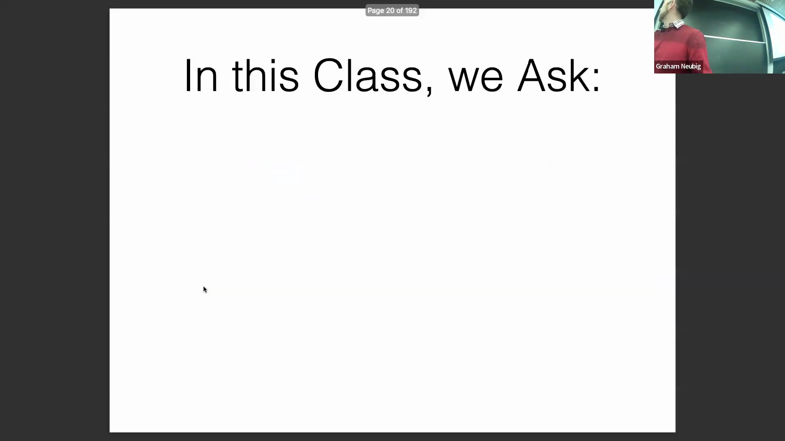
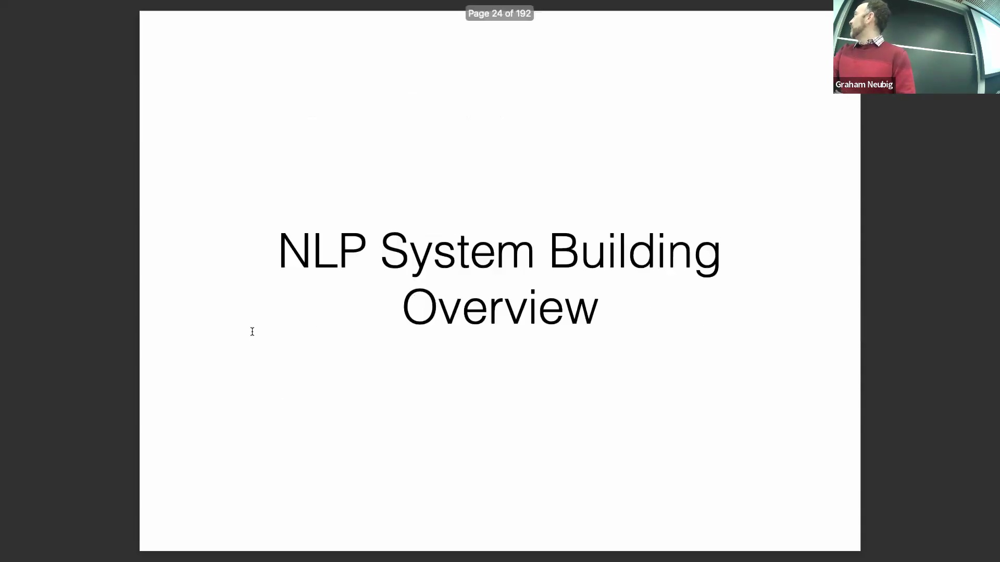

## NLP 简介与课程安排
讲座首先概述了本课程，重点讲解自然语言处理(Natural Language Processing)的基础知识。讲师列出了课程大纲，涵盖 NLP 的定义、发展动因、核心挑战以及课程安排。简短的教务说明指出，本次课程将录制并上传至 YouTube。录制时会尽量避免拍摄学生画面，但讨论环节的音频可能会被保留，以供远程听众收听。

## NLP 的定义及其核心组件
当被要求界定 NLP 时，学生们准确地将其概括为一种帮助机器理解人类语言、进而实现人机交互的技术。讲师对此进行了延伸，强调了 NLP 的两大支柱：自然语言理解(Natural Language Understanding)和自然语言生成(Natural Language Generation)。这两大核心组件共同奠定了利用计算工具处理人类语言的基础。

## NLP 技术的广泛应用
NLP 技术涵盖多个关键应用领域。它通过问答系统(Question Answering)、对话系统(Conversational Systems)和可执行代码生成(Executable Code Generation)来辅助人机交互。同时，它也通过机器翻译(Machine Translation)、拼写检查与辅助写作来促进人际交流。除直接的通信功能外，NLP 还能执行句法分析(Syntax Analysis)、文本分类(Text Classification)和实体识别(Entity Recognition)等语言分析任务。这些分析能力对于在大规模数据集中提取与整合信息、以支持科学研究及其他分析目标至关重要。

## 日常工具与大语言模型表现
现代 NLP 已深度融入日常工作流程，通常在 Google Docs 等应用程序后台静默运行，提供实时拼写与语法检查。讲座展示了 ChatGPT 等大型语言模型(Large Language Models)的能力，演示了其如何准确回答事实性问题（例如，报出卡内基梅隆大学校长的姓名）。然而，讲师也着重强调了模型的“幻觉”(Hallucination)倾向，并以一个关于 GPT-3.5 Turbo 模型架构的问答为例：该回复看似合理，实则完全错误。

## 跨语言翻译能力
机器翻译直观地展现了 NLP 在不同语种上的性能差异。对于日语等广泛使用的语言，翻译结果已高度准确且流畅自然；但库尔德语等低资源语言(Low-resource Languages)仍面临巨大挑战。实例显示，模型常出现表达生硬及术语误译（例如，将“古生物学家”直译为“化石科学家”，或将“蜥蜴”误译为“蜗牛”）。近期研究表明，与专用的翻译系统相比，即便是 GPT 等先进模型在处理低资源语言时，也会出现更为显著的性能衰减。

## NLP 在科学与社会分析中的应用
语言分析工具是计算社会科学(Computational Social Science)的重要助力，使研究人员能够利用观测数据探究社会性问题。例如，通过分析电影剧本，可以判断男性与女性角色中哪一方被赋予了更多的权力或能动性。通过从文本中自动抽取“施事者”(Agents，执行动作的主体)与“受事者”(Patients，承受动作的客体)，研究人员能够高效整合数据，进而揭示出在电影剧本的历史演变中，男性角色通常被赋予了更高的能动性。

## 基础 NLP 任务的局限性
尽管近年来取得了显著进展，NLP 工具在处理某些基础任务时仍会频频出错。在使用斯坦福 NLP(Stanford NLP)和 spaCy 等广泛应用的命名实体识别(Named Entity Recognition)系统测试《纽约时报》的标准新闻报道时，系统迅速暴露出错漏。常见的错误包括将人名或常见短语误判为组织机构，这表明即便是基础的 NLP 模块，仍需经过严谨的评估与持续优化。

## 课程目标与现代更新
本课程旨在探讨三个核心问题：构建最先进(State-of-the-art)的 NLP 系统需要哪些关键要素？现有系统在哪些场景下容易失效？我们应如何针对性地进行改进以达成特定的 NLP 目标？尽管这些核心议题保持不变，但随着大型语言模型的崛起，该领域的技术格局已发生深刻变革。因此，课程资料已全面更新，以反映最新的学术进展，并契合人工智能驱动的语言技术快速演进的时代背景。

## NLP 系统的高层框架
在导论概述的尾声，讲师提出了一个用于理解 NLP 系统开发的宏观框架(High-level Framework)。其核心观点在于，NLP 系统本质上是一种映射机制(Mapping Mechanism)，负责将输入 `X` 转换为输出 `Y`，且其中至少有一个变量包含语言数据。这一概念模型为课程后续深入探讨具体任务、系统架构与评估方法奠定了坚实基础。