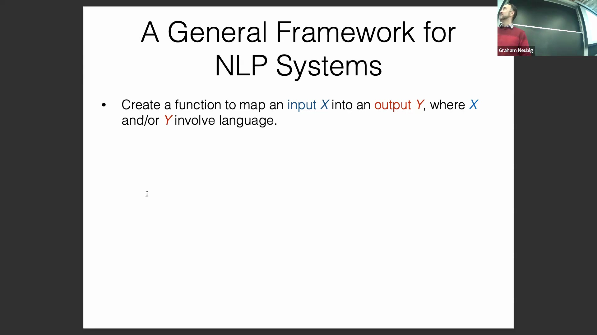
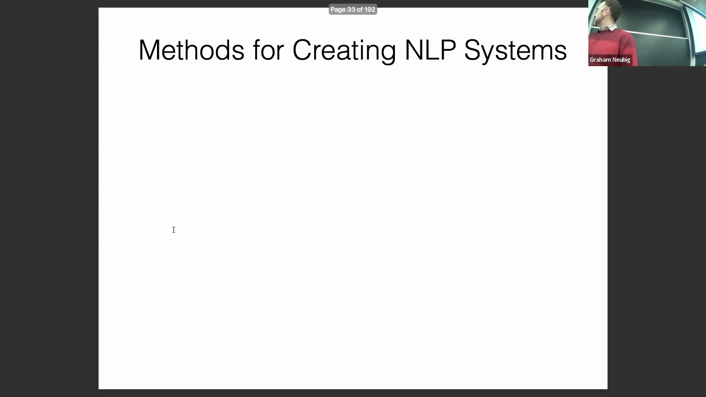
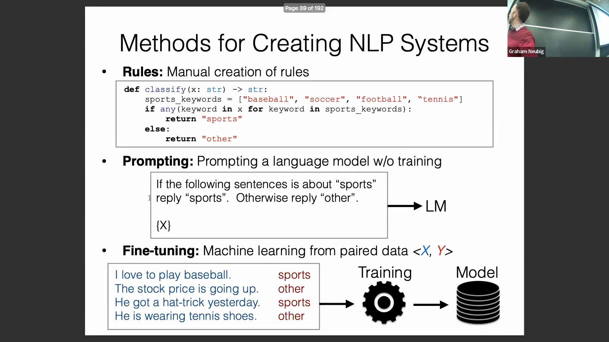
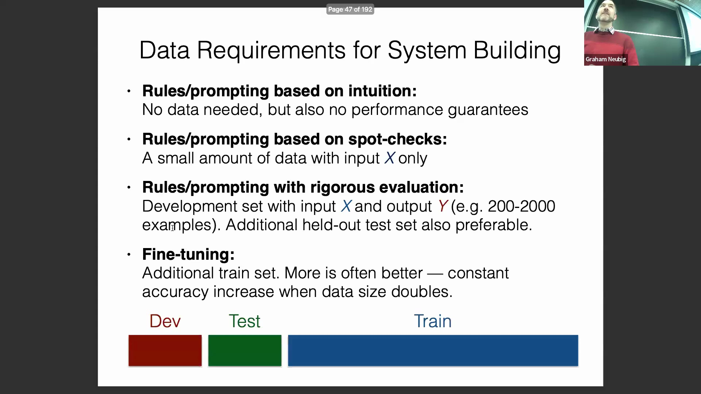
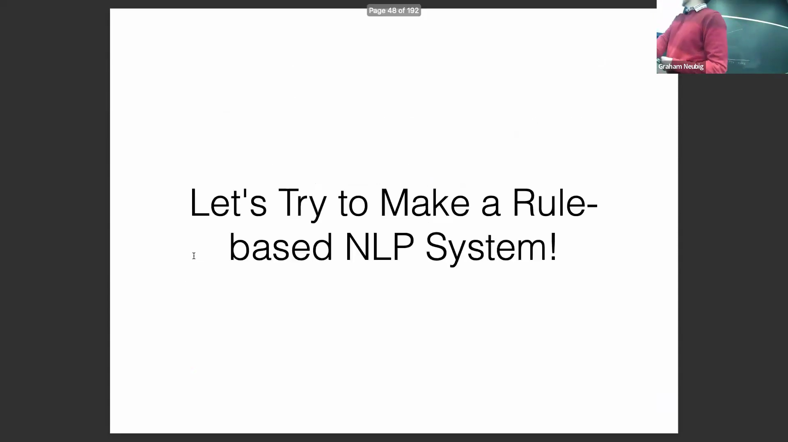

## NLP 任务定义与评估标准
讲座首先从翻译这一基础自然语言处理(Natural Language Processing)任务开始探讨。其输入为一种语言的文本，输出为另一种语言的文本。高质量的翻译不仅需准确传达原文语义，还须在目标语言中保持表达流畅。随后，讨论转向多项选择题(Multiple Choice Questions)，其输入为题目背景与选项，输出为正确答案。值得注意的是，尽管大语言模型(Large Language Model)的评估高度依赖此类题型，但在实际应用中却极少采用该格式，这凸显了当前评估实践与实际应用场景之间存在显著脱节。向量搜索(Vector Search)是另一项关键任务：输入包含查询词与文档集合，输出为相关文档或索引。评估搜索性能依赖于可靠的相似度度量指标与合理的阈值设定，以实现对结果的有效过滤。

## NLP 的广泛范畴与项目指南
NLP 涵盖的任务远不止简单的文本到文本映射。这些任务包括语言建模(Language Modeling，如文本续写预测)、文本分类(Text Classification)、信息抽取(Information Extraction)、图像描述(Image Captioning，即图像到文本生成)以及语音识别(Speech Recognition，即语音到文本转换)。从广义上讲，任何以某种形式处理或操纵语言的任务，均可归属于自然语言处理的范畴。 

这一定义对课程项目至关重要：只要项目涉及有意义的语言交互，通常即符合要求。然而，纯粹的代码到代码转换(Code-to-Code Translation)则处于模糊地带，因为代码被视为形式语言(Formal Language)而非自然语言，此类项目可能需要与授课教师进一步确认。

## 构建 NLP 系统的核心范式
2024 年构建 NLP 系统主要遵循三种范式。第一种是基于规则的系统(Rule-based System)，其依赖于人工设计的逻辑（例如通过匹配特定关键词对文本进行分类）。此类系统开发迅速，但性能上限较低，仅适用于简单且边界清晰的任务。第二种是提示(Prompting)，即通过构造直接的问题或指令来调用大语言模型(LLM)。该方法已迅速成为当前的主流范式。 

第三种是微调(Fine-tuning)，即利用成对的训练数据对模型进行进一步训练或适配，使其能够从示例中习得复杂的模式与映射关系。微调通常以预训练模型(Pre-trained Model)或已通过提示调优的基线模型为起点。

## 数据需求与评估策略
系统构建方法的选择在很大程度上决定了其数据需求。基于规则的系统与零样本提示(Zero-shot Prompting)无需初始训练数据，允许开发者完全基于直觉快速构建原型。 

然而，缺乏数据便无法对性能进行严格评估。接下来的步骤是进行定性抽样检查：在相关数据上运行系统，分析错误案例，并据此迭代优化提示词或规则。对于达到专业级标准的开发，严格的评估不可或缺。这要求构建专用的开发集(Development Set)与测试集(Test Set)（通常包含 200 至 2000 个样本），并采用成熟的评估指标来系统性地追踪模型准确率。

## 数据规模扩展与性能权衡
当进入微调阶段时，则需要规模大得多的训练数据集。 

机器学习(Machine Learning)中的一个普遍规律是：成倍增加训练数据规模初期会带来稳定的性能提升。即使仅从零样本提示起步，引入少量标注数据(Annotated Data)也能实现准确率的显著跃升。然而，此类收益遵循边际收益递减(Diminishing Marginal Returns)规律：随着数据集规模的持续扩大，性能增益逐渐收窄，而数据标注的时间与成本却大幅增加。 

因此，从业者必须在边际性能收益与数据收集、标注的实际成本限制之间进行审慎权衡。