## 词形变化、数据集规模与权重向量解读
课程首先探讨了词袋模型(Bag-of-Words, BoW)如何处理词形变化(Inflection)等语言变体。尽管将不同词形映射至相似的向量空间位置可能部分缓解该问题，但模型本质上依赖的是数据记忆(Data Memorization)而非对形态学(Morphology)的真正理解。借助规模足够庞大的训练数据集(Training Dataset)，模型能够接触到各类词形变体与低频词(Low-frequency Words)，从而降低部分错误率；但若缺乏显式预处理(Explicit Preprocessing)，仍无法彻底解决这些问题。同样，该模型的多语言支持能力(Multilingual Capability)完全取决于目标语言是否具备带标注的训练数据(Labeled Training Data)。为剖析模型的内部机制，讲师详细解释了学习到的权重结构(Learned Weight Structure)：在二分类任务(Binary Classification)中，正权重(Positive Weights)通常与表达正面情感的词汇相关联；而在多分类场景(Multi-class Scenario)中，权重矩阵(Weight Matrix)负责将词频映射至特定的类别标签(Class Labels)，较高的权重值意味着更强的预测相关性(Predictive Relevance)。
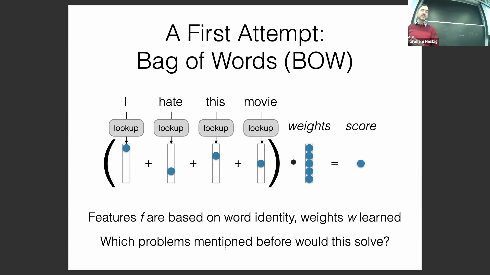
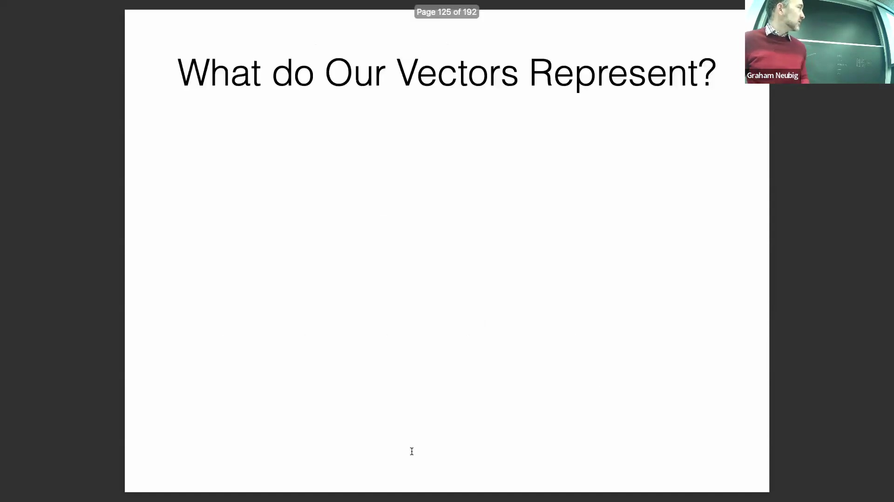

## 感知机式训练算法
该 BoW 分类器的核心训练机制(Training Mechanism)异常简洁，仅用单张幻灯片即可概括。算法首先初始化权重向量(Weight Vector)，随后遍历训练数据集，通过简单的分词(Splitting/Tokenization)与词频统计来提取特征。接着运行分类器，并将预测结果(Predictions)与真实标签(Ground Truth Labels)进行比对。一旦发现误分类(Misclassification)，算法会立即执行权重更新(Weight Update)：若真实标签为正类，则按特征向量(Feature Vector)的数值成比例地增加对应特征的权重；若为负类，则相应降低权重。这种增量式更新规则(Incremental Update Rule)使得训练过程高度透明且计算开销(Computational Overhead)极小，是训练线性文本分类器(Linear Text Classifier)最基础、最直观的算法之一（如感知机算法(Perceptron Algorithm)）。
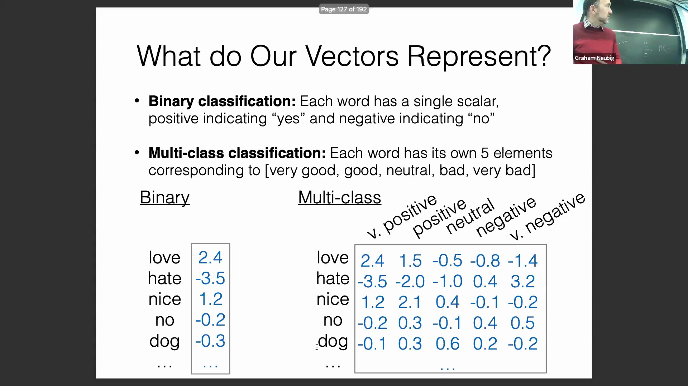

## 代码实现、数据打乱与性能评估
一段实时代码演示(Live Coding Demo)展示了训练好的 BoW 分类器的运行流程。讲师强调了一项关键的预处理步骤：数据打乱(Data Shuffling)。若不进行打乱，模型在按类别顺序排列的数据（如全部正面样本后接全部负面样本）上进行增量更新时，将遭受严重的顺序偏差(Order Bias)，最终可能退化为仅预测单一类别的退化模型(Degenerate Predictor)。在打乱数据并完成五个训练轮次(Training Epochs)后，模型在训练集上的准确率(Accuracy)达到 75%，而在开发集(Development Set)上仅为 56%。相较于手动基于规则系统(Rule-based System) 42% 的基线性能(Baseline Performance)，这是一次显著提升，有力证明了引入机器学习(Machine Learning)的必要性。然而，训练准确率与验证准确率(Validation Accuracy)之间的显著差距明确指向了过拟合(Overfitting)问题，这也是简单线性模型(Linear Models)常见的挑战。
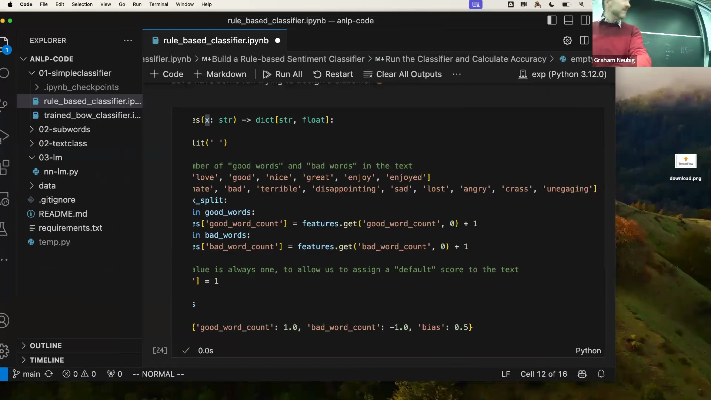
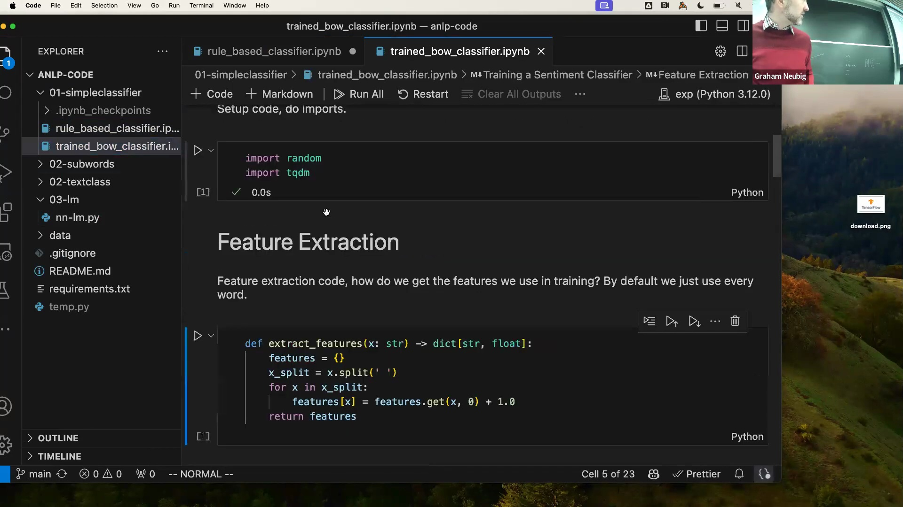
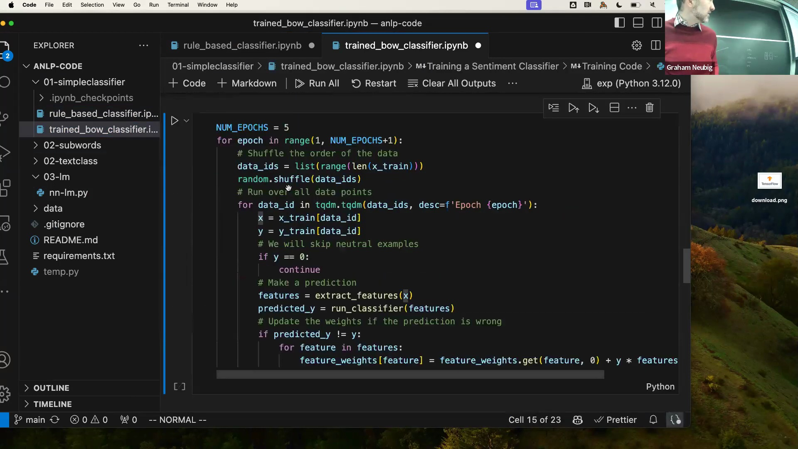
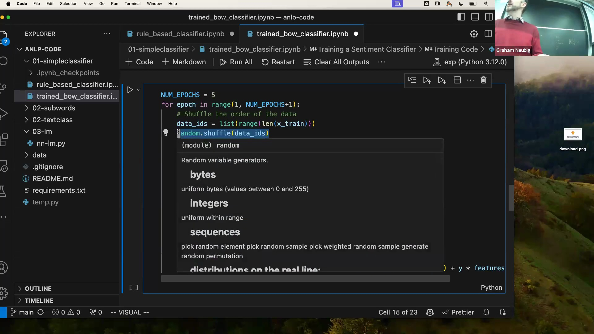

## 稀疏词袋模型的固有局限
尽管较基于规则的方法有所改进，BoW 模型仍存在根本性的架构缺陷(Architectural Flaws)。它将每个词汇视为独立的原子单元(Atomic Units)，完全忽略了词汇间的语义相似性(Semantic Similarity)（例如，“love”与“adore”在向量空间中会被映射为完全正交的无关维度）。该模型也难以有效处理组合特征(Compositional Features)与否定表达(Negation)。诸如“don't love”与“don't hate”等短语蕴含着微妙且反转的语义极性(Semantic Polarity)，而简单的词频统计无法捕捉这种语境交互，因为否定修饰词(Negation Modifiers)会与其所修饰的动词产生复杂的上下文依赖关系。此外，模型对“but”等转折连词(Conjunctions)的建模能力薄弱；在自然语言中，“but”通常暗示需弱化前半句语义，而将重心转移至后半句的情感倾向。这种复杂的逻辑运算(Logical Operations)是稀疏频率向量(Sparse Frequency Vectors)天生无法实现的。讲师指出，此处的权重更新方法与神经网络优化(Neural Network Optimization)共享底层数学原理，为后续深入探讨模型架构奠定了基础。
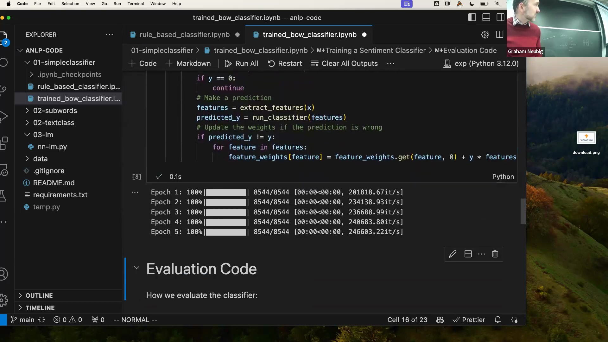
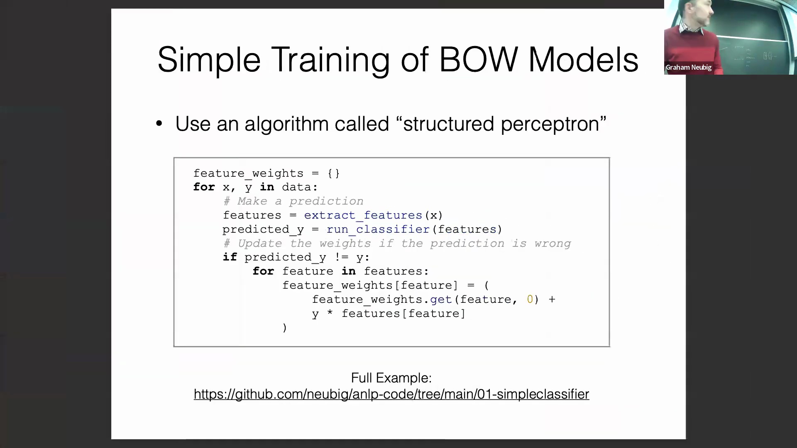

## 向神经网络与稠密嵌入的演进
为克服稀疏表示(Sparse Representations)的僵化问题，课程引入神经网络(Neural Networks)作为现代解决方案。现代架构不再依赖高维独热向量(High-dimensional One-hot Vectors)，而是采用稠密词嵌入(Dense Word Embeddings)，将词汇映射至连续的低维向量空间(Continuous Low-dimensional Vector Space)，从而有效捕捉深层的语义关系(Semantic Relations)。在最终得分计算(Scoring)之前，这些嵌入向量会经过复杂的非线性激活函数(Non-linear Activation Functions)进行处理，以提取分层特征(Hierarchical Features)。讲师指出，这一基础前向传播流程(Forward Pass)不仅是传统文本分类器的核心，也支撑着现代大语言模型(Large Language Models, LLMs)的提示推理机制(Prompting Mechanism)，因为两者的底层目标均是计算目标标签或下一个词元(Next Token)的预测得分。此外，课程强调了神经网络的理论表征容量(Representational Capacity)：依据通用近似定理(Universal Approximation Theorem)，只要具备足够的深度(Depth)与宽度(Width)，神经网络即可作为通用函数逼近器(Universal Function Approximator)来拟合任意可计算任务。当然，其实际性能(Actual Performance)仍受限于数据可用性(Data Availability)与优化过程中的挑战(Optimization Challenges)。

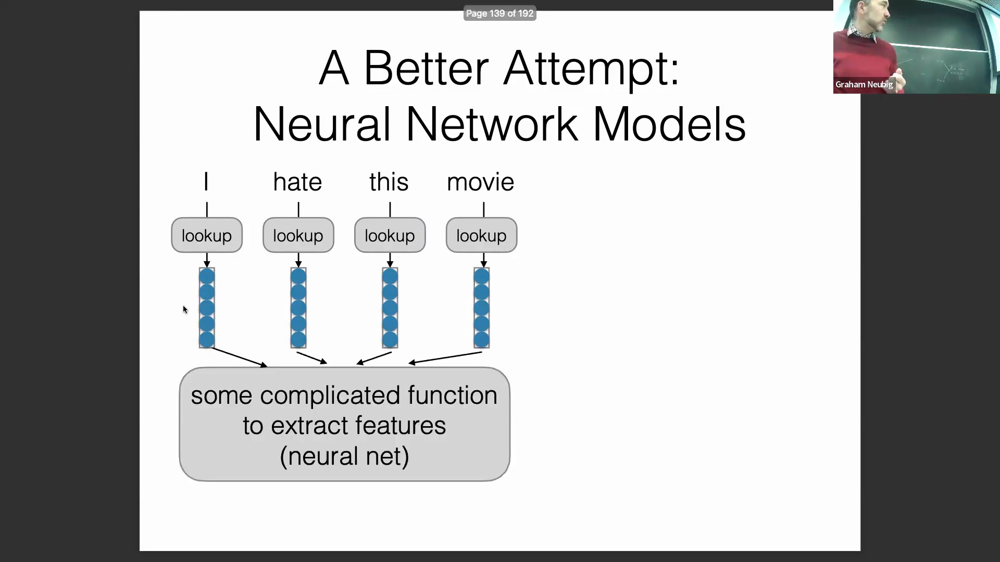

## 课程路线与后续主题
本节最后概述了课程剩余部分的教学大纲(Course Roadmap)。整个课程体系将系统性地构建于上述基础概念之上，首先从语言建模(Language Modeling)基础讲起。内容将涵盖用于预测序列中下一个词元(Next Token)的自回归模型(Autoregressive Models)，以及基于输入上下文生成响应的提示条件模型(Prompt-conditioned Models)。后续教学模块将深入探讨表示学习(Representation Learning)，重点研究如何提取鲁棒的词嵌入(Robust Word Embeddings)、子词分词算法(Subword Tokenization)的底层工作原理，以及其他现代自然语言处理(NLP)系统所必需的高级预处理范式(Advanced Preprocessing Paradigms)。

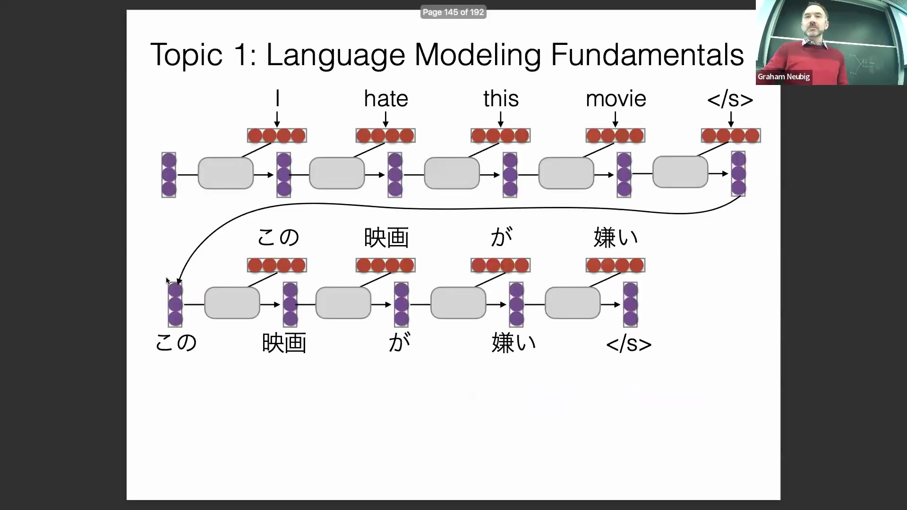