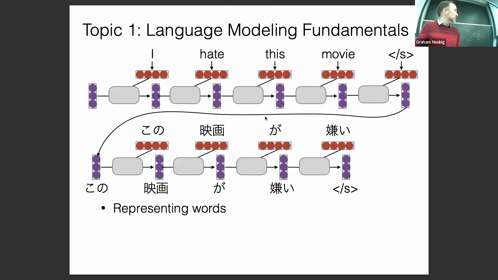
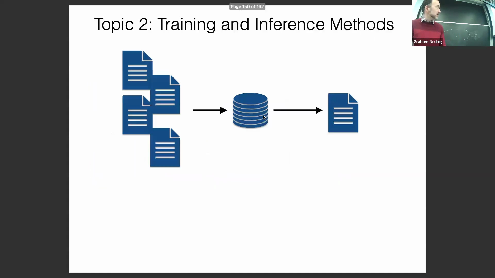
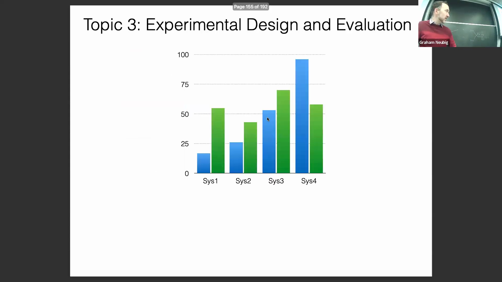
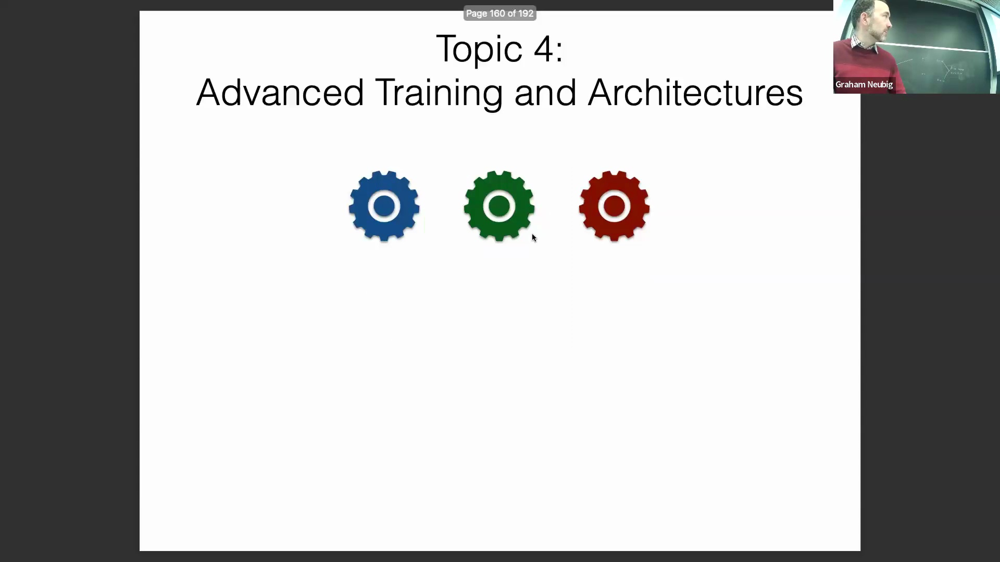
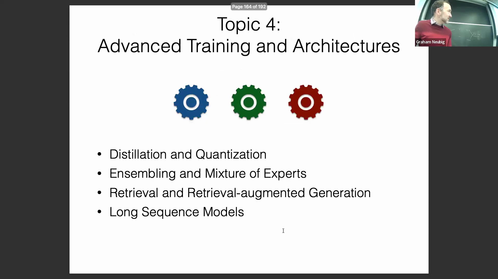
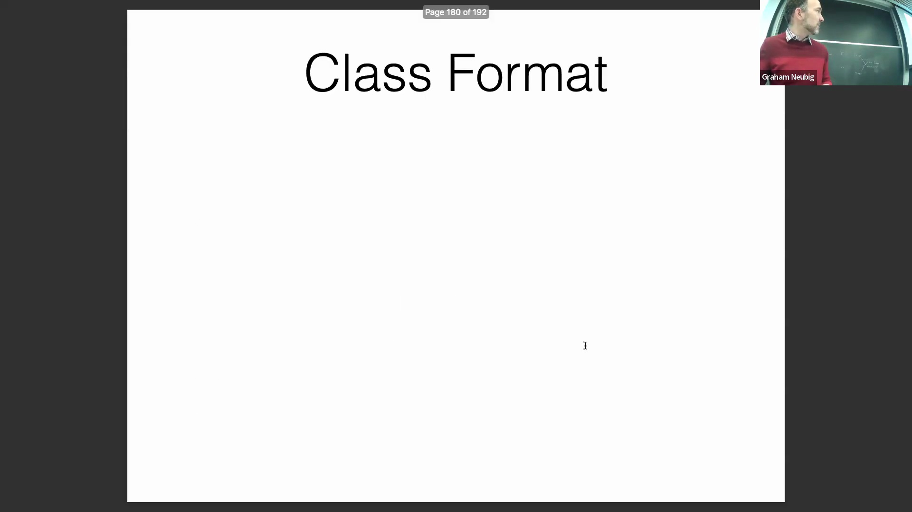
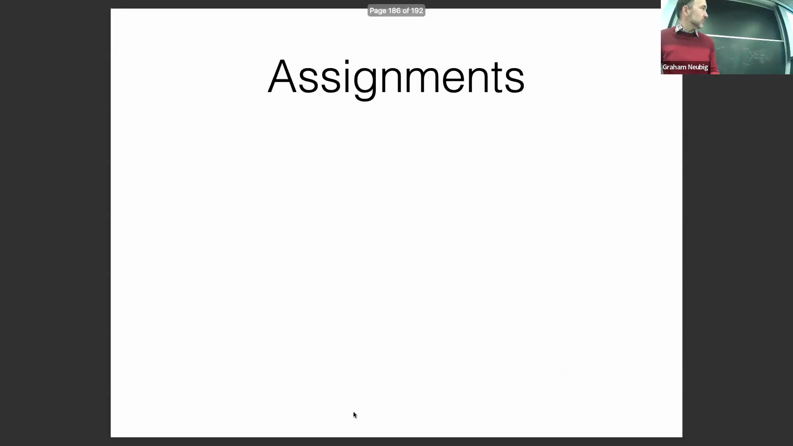

## 课程大纲与核心架构基础
课程概述了本学期的完整教学路线图(Course Roadmap)，从语言建模(Language Modeling)基础讲起，涵盖词元预测(Token Prediction)与基于提示的生成(Prompt-based Generation)。随后课程过渡至序列建模(Sequence Modeling)部分，在深入剖析 Transformer 架构及其自注意力机制(Self-Attention Mechanism)之前，将简要概述卷积神经网络(Convolutional Neural Networks, CNN)与循环神经网络(Recurrent Neural Networks, RNN)。讲师指出，自 2017 年问世以来，Transformer 的具体实现已发生显著演进(Significant Evolution)，这些现代改进(Modern Improvements)将构成课程的核心重点。课程还将投入大量课时讲解训练与推理(Training and Inference)方法，涵盖文本生成算法(Text Generation Algorithms)、高级提示工程(Advanced Prompt Engineering)、面向多任务适应(Multi-Task Adaptation)的指令微调(Instruction Fine-Tuning)，以及用于输出评估与模型优化(Model Optimization)的强化学习(Reinforcement Learning, RL)框架。

## 实验设计、模型伦理与高级架构
课程大纲的一个重要模块聚焦于实验设计(Experimental Design)与高质量数据标注(Quality Data Annotation)。讲师强调，随着模型性能逐渐超越普通人类标注员(Human Annotators)的水平，获取可靠的人工标签(Human Annotations)正变得愈发困难。讲师指出，稳健的系统调试(Robust Debugging)、自动化可解释性技术(Automated Interpretability Techniques)以及严格的偏见与公平性评估(Bias and Fairness Evaluation)至关重要，尤其是在将 NLP 系统部署至可能引发实际危害的生产环境(Production Environments)时。高级模型架构(Advanced Model Architectures)主题将涵盖模型蒸馏(Model Distillation)与量化(Quantization)技术，旨在构建紧凑且易于部署(Compact and Deployable)的语言模型（例如适用于移动端或本地部署），同时还将探讨模型集成(Model Ensembling)与混合专家(Mixture of Experts, MoE)策略。此外，课程还将深入讲解检索增强生成(Retrieval-Augmented Generation, RAG)、长上下文序列建模(Long-Context Sequence Modeling)，以及复杂推理(Complex Reasoning)、代码生成(Code Generation)、语言智能体(Language Agents)和信息提取(Information Extraction)等高影响力应用(High-Impact Applications)，其中 RAG 与代码生成已被业界列为核心优先方向。

## 语言学基础与研究生级研究导向
尽管现代前沿模型(Frontier Models)已较少依赖显式的语言学规则(Explicit Linguistic Rules)，课程仍将系统探讨语言学基础(Linguistic Foundations)与多语言特性(Multilingual Properties)。深入理解这些核心概念，对于在跨语言任务(Cross-Lingual Tasks)与新型模型架构(Novel Model Architectures)中实现稳健的泛化能力(Robust Generalization)依然至关重要。讲师鼓励学生提交建议，以填补剩余的客座讲座(Guest Lectures)名额，从而使课程内容更契合班级的研究兴趣。作为一门面向研究生的 700 级别高级课程(700-Level Graduate Course)，其核心目标在于培养研究创新能力(Research Innovation)，而非单纯复现(Reproduction)已有工作。课程期望学生能够开发新颖的方法论(Novel Methodologies)，或将成熟技术(Mature Techniques)应用于未探索的领域(Unexplored Domains)，亦或将现有系统扩展至新语种，从而确保教学内容与前沿学术研究(Academic Research)及工业界高阶发展(Advanced Industry Trends)保持同步。

## 教学方法与问题解决框架
本课程的学习框架旨在使学生全面掌握应用于 NLP 的高级机器学习方法(Advanced Machine Learning Methods)、核心语言学知识(Core Linguistics)以及实际案例剖析能力(Case Study Analysis)。讲师明确指出，尽管课程无法穷尽所有 NLP 应用场景，但教学重点将置于培养学生如何解构特定应用(Deconstruct Specific Applications)、识别其独特的计算挑战(Computational Challenges)，并将解决方案的方法论(Methodologies)抽象迁移(Abstract Transfer)至其各自的研究领域。教学方法的另一大核心是系统调试与诊断性评估(Debugging and Diagnostic Evaluation)。准确剖析模型失败的原因与环节(Pinpoint Failure Modes)被视为驱动性能提升的最有效策略，课程将投入大量精力着重培养此项关键分析能力(Critical Analytical Skills)。

## 课程安排、辅导课与考核结构
课程采用推荐的课前阅读材料(Pre-class Readings)（可选但强烈建议）与互动式讲座(Interactive Lectures)及课堂讨论相结合的形式。为强化实践技能，助教(Teaching Assistants, TAs)将在答疑时段主持辅导课(Tutorial Sessions)以及代码调试与数据管道实战(Code and Data Walkthroughs)。这些环节将全面覆盖 Hugging Face、SentencePiece、vLLM、OpenAI API 以及 LightLLM 等行业标准工具库(Industry-Standard Toolkits)。每次讲座结束后，学生需完成一份包含三道题目的简短课后测验(Post-lecture Quizzes)。测验将于讲座当日发布，并于次日截止。该设计旨在不增加学生额外时间负担的前提下，有效检验其对核心概念(Core Concepts)的掌握程度。

## 实践作业与算力可及性
课程的实践环节包含两项核心作业(Core Assignments)。作业一要求学生完成 LLaMA 架构(LLaMA Architecture)的部分代码实现，并在规模较小的数据集上训练一个精简版模型(Scaled-down Model)，从而有效规避官方 70 亿参数(7B Parameter)模型对算力的巨大需求(Compute Requirements)。作业二则要求学生从零构建一个端到端的 NLP 评估流水线(End-to-End NLP Evaluation Pipeline)，在缺乏现成数据集的情况下，独立完成针对特定任务的数据构建(Data Curation)、模型训练与评估工作。为确保算力资源的公平获取(Equitable Access to Compute)，所有作业均严格限制模型参数量或运行成本，并经过专门优化以在消费级标准硬件(Consumer-grade Standard Hardware)上高效运行，例如搭载 Apple Silicon (M1/M2) 的 MacBook 或免费版的 Google Colab 环境。