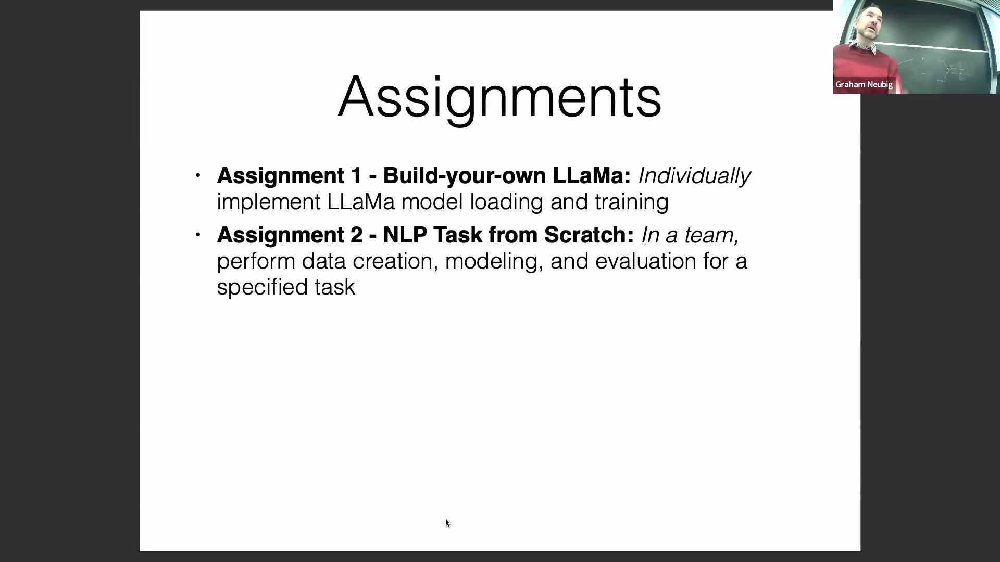
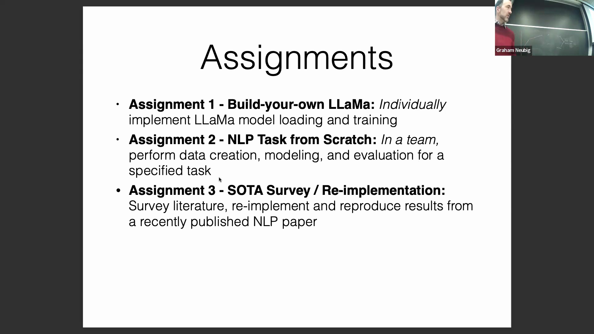
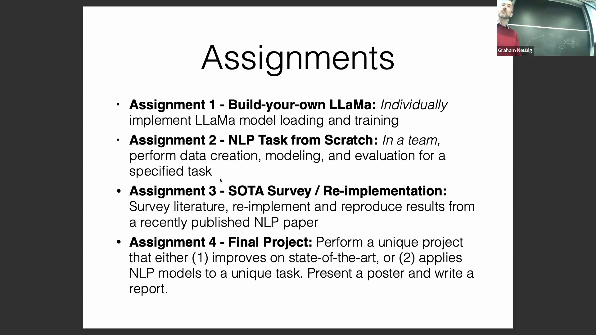
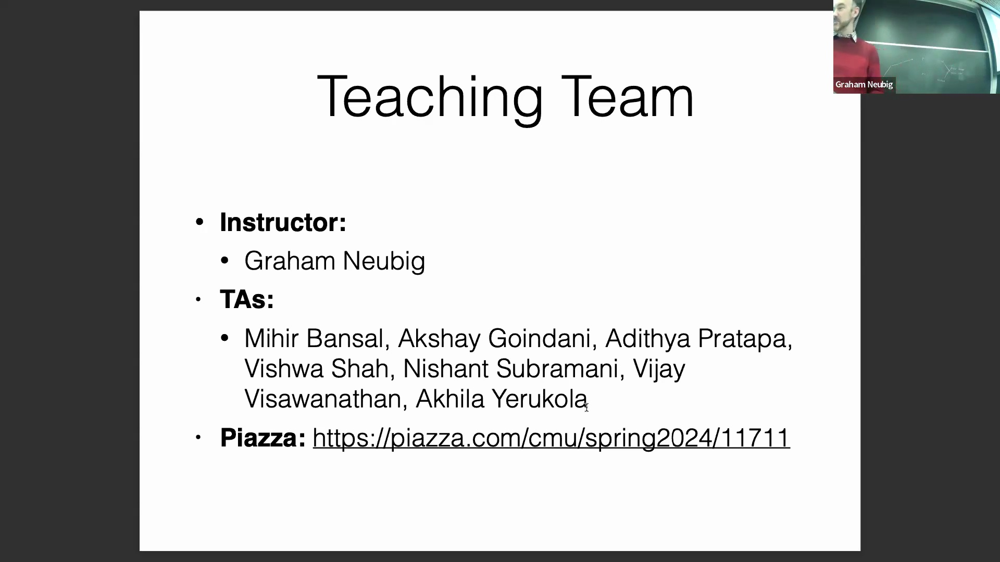

## 计算资源与模型训练限制
讲师探讨了本课程算力分配(Compute Allocation)的实际情况，强调所有作业均经过精心设计，以确保能在搭载 Apple Silicon (M1/M2) 的 MacBook 或免费版 Google Colab 等易于获取的硬件上高效运行。为应对计算负载稍重的任务，课程为每位学生提供 50 美元的 Google Cloud 云额度(Cloud Credits)，但受限于云服务商(Cloud Service Providers)日益收紧的政策，获取额外算力资金仍具挑战。鉴于这些固有的资源限制(Resource Constraints)，课程将对模型训练规模(Model Training Scale)实施严格上限。因此，强烈建议学生基于预训练模型(Pre-trained Models)进行二次开发，而非尝试从零训练(Training from Scratch)大型架构。此举旨在确保所有项目在算力上可行(Computationally Feasible)，并将研究重心聚焦于模型架构与算法创新(Algorithmic Innovation)。

## 高阶作业与期末项目要求
作业 3(Assignment 3)要求学生针对前沿自然语言处理(Natural Language Processing, NLP)研究进行定向文献调研(Literature Review)，随后严格遵循算力可行性指南，对所选方法完成一次完整的功能性复现(Functional Reproduction)。期末项目(Final Project)进一步提高了要求，强调必须具备实质性的学术新颖性(Academic Novelty)与研究贡献。学生需在准确率(Accuracy)、计算效率(Computational Efficiency)或模型可解释性(Model Interpretability)等方面切实提升现有基准表现(Baseline Performance)（需明确定义评估指标 Evaluation Metrics），或成功将成熟技术迁移至未充分探索的任务或低资源语言(Low-Resource Languages)。课程的总体目标是在 NLP 领域产出新知识，推动学生从简单的代码复现向能够带来可验证进展(Verifiable Progress)的原创性研究(Original Research)转变。

## 讲师与助教团队介绍
为营造协作高效的学习环境，课程正式进入教学团队(Teaching Staff)介绍环节。本课程配备七名助教(Teaching Assistants, TAs)，其研究专长涵盖多个领域，包括语言歧义(Linguistic Ambiguity)、社交计算(Social Computing)、软件开发自动化(Software Development Automation)以及多模态计算机视觉融合(Multimodal Computer Vision Integration)。此项介绍具有明确的实用目的：便于学生快速定位适合特定技术咨询(Technical Consultation)的助教，并基于共同的学术兴趣构建同侪交流网络(Peer Networking)。讲师同时鼓励学生分享各自的研究方向(Research Interests)，以构建一个能高效匹配专业知识与项目需求的学术社区(Academic Community)。另有两名因公出差的助教将在后续讲座中补充介绍。

## 课程安排、答疑时间与沟通渠道
讲座末尾概述了必要的课程行政管理(Administrative Guidelines)与沟通规范(Communication Protocols)。讲师与全体助教将定期开放答疑时间(Office Hours)，完整的每周排班表(Weekly Schedule)将不久后发布于课程官方网站。鼓励学生充分利用该时段获取项目指导(Project Guidance)、厘清概念疑问(Conceptual Clarifications)或展开更广泛的研究探讨。但在咨询高峰期，教学团队将优先处理与课程直接相关的核心问题。针对非实时咨询(Asynchronous Communication)，Piazza 将作为官方集中讨论平台，教学团队承诺在工作日(Weekdays) 24 小时内回复所有帖子。课程以最后一次答疑邀请作结，标志着本阶段的教学大纲导览(Syllabus Overview)环节正式结束。
