## 标准提示词(Prompt)简介与初期挑战
今天我将讲解检索(Retrieval)与检索增强生成(Retrieval-Augmented Generation, RAG)。
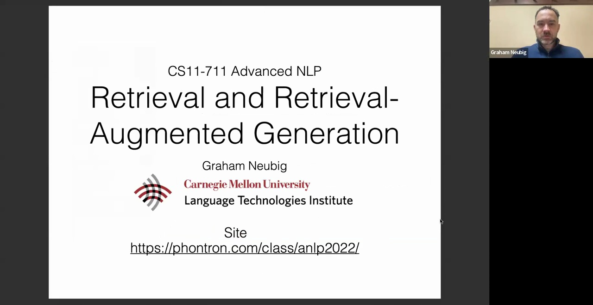
如果我们观察标准的提示词(Prompt)流程，通常的做法是将提示词与用户输入相结合。例如，如果我们提问：“请回答这个问题：我记得范·迪塞尔(Vin Diesel)曾为几部电视剧中的角色配音。你知道它们的名字吗？”语言模型(Language Model)会生成回复，但这种做法存在几个问题。 
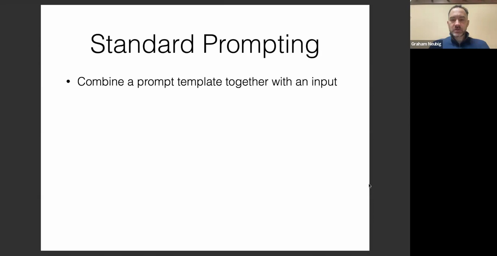
首先是知识时效性问题。模型通常存在知识截止日期(Knowledge Cutoff)，其参数(Parameter)仅更新至某个特定时间点。例如，若范·迪塞尔主演的新剧上线，训练数据截止于该时间点之前的模型将无法获取任何相关信息。

## 数据隐私、学习失效(Memorization Failure)与可验证性(Verifiability)
此外，还存在私有数据(Private Data)问题。存储在私有文本或数据仓库中的数据出于多种原因并不适合直接用于模型训练。首先，这些数据通常对特定的语言模型(Language Model)训练提供商（如 OpenAI、Google 等）不可获取。其次是访问控制(Access Control)问题。即使所在机构拥有海量私有数据并可用其训练语言模型，机构内部人员的权限也可能存在差异，某些人只能访问特定类型的数据。因此，这不仅是第三方提供商的限制，更是机构层面通用的访问控制难题。此外，模型还可能出现学习失效的情况。即便数据曾用于训练，模型也未必能确保输出正确答案。在训练数据集极其庞大且模型规模适中的情况下，这一问题尤为突出，因为模型往往难以仅凭单次接触就牢固记忆特定事实或其他信息，尤其是在训练的早期阶段。最后，模型生成的答案即使正确，也可能缺乏可验证性。为了确保答案的准确性，通常需要人工回溯至原始数据源进行核实。

## 检索增强生成(Retrieval-Augmented Generation, RAG)解决方案
为了解决上述问题，业界提出了一种名为检索增强生成(RAG)的方法，这也将成为我们第二次作业(Assignment)的主题。 
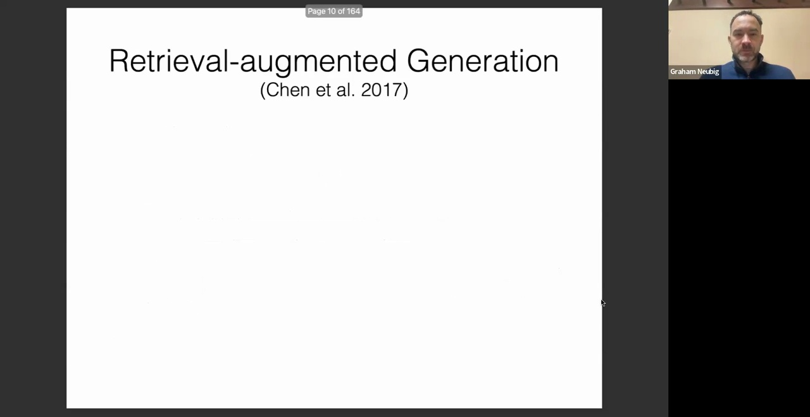
其核心工作原理是：高效检索与查询(Query)相关且包含答案信息的文本段落，随后模型阅读这些上下文(Context)以生成回答。 
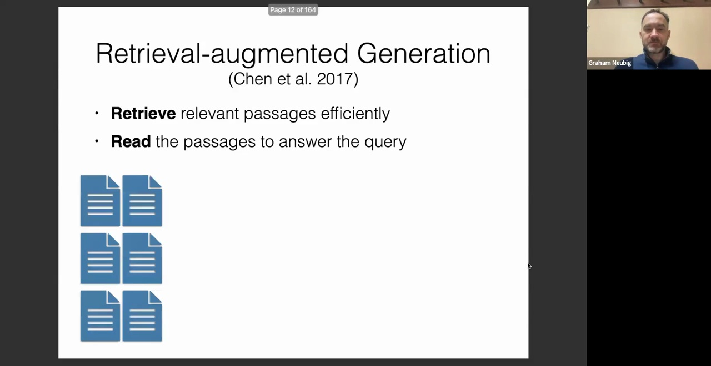
假设我们拥有这样的文档库。基于查询进行检索后，系统会返回大量相关段落。模型通过阅读这些段落，最终生成答案。

## 现实世界中的 RAG 实现与模型局限性(Limitations)
因此，该技术已被众多（甚至绝大多数）语言模型提供商（包括 OpenAI）实际部署。以我刚才询问的关于范·迪塞尔配音电视剧的问题为例，ChatGPT 给出了回答，你可以看到其回复中包含多处引用标记，即那些蓝色的小引号图标。
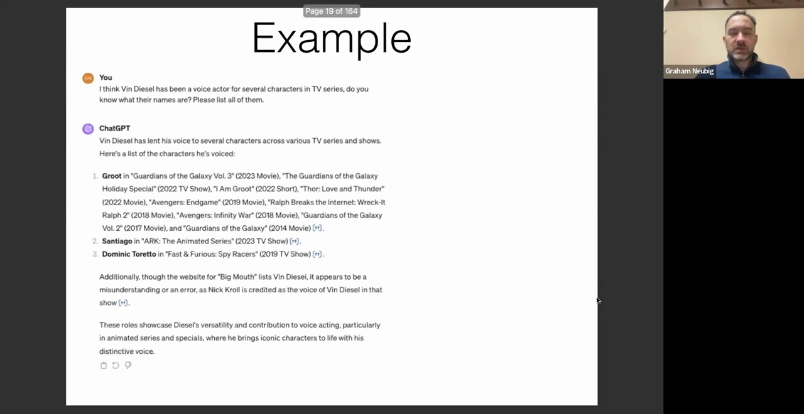
点击这些引号图标，即可查看信息来源。例如，此处显示信息来源于“Behind The Voice Actors”网站，指向范·迪塞尔的词条，该网站列出了他在《大嘴巴》(Big Mouth)等剧集中的配音作品。然而，若仔细审视该回答，会发现即便系统执行了检索增强生成(RAG)，结果仍非完美。例如，我仅询问了电视剧相关内容，模型却混杂了大量电影信息，如指出其在2023年电影《银河护卫队3》中为“格鲁特”配音。这显然混淆了影视剧类型，属于准确性错误。此外，回答中还提到：“此外，虽然《大嘴巴》官网显示范·迪塞尔似乎是个误解或错误，因为尼克·克罗尔(Nick Kroll)在该剧中为范·迪塞尔（角色）配音。”实际上，剧中是由尼克·克罗尔为“范·迪塞尔”这一动画角色配音，但生成模型在此处产生了误读。不过，整体意图尚可理解。由此可见，即便是 GPT-4 这样强大的大语言模型(Large Language Model, LLM)，其表现也并非完美无缺。

## 检索方法(Retrieval Methods)概述
接下来，我将深入探讨实际应用中采用的检索方法。目前，检索技术有多种实现路径，我将逐一介绍：稀疏检索(Sparse Retrieval)、文档级稠密检索(Document-level Dense Retrieval)、词元级稠密检索(Token-level Dense Retrieval)、交叉编码器重排序(Cross-Encoder Reranking)以及黑盒检索(Black-box Retrieval)。
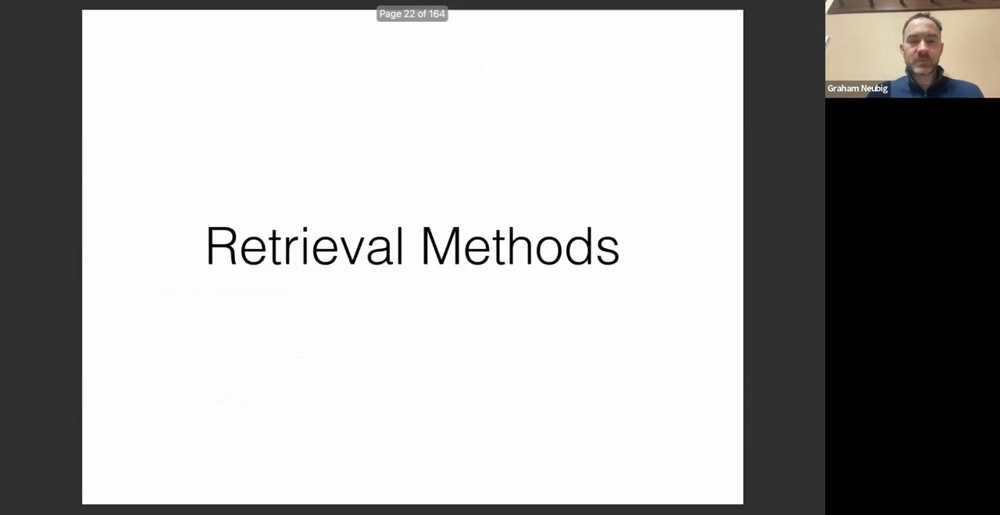
关于黑盒检索，此处不作过多展开。其基本原理是直接向黑盒搜索引擎发送请求以检索相关上下文，并获取排名靠前的若干结果。尽管如此，若需在互联网海量公开数据中进行搜索，这依然是一种极为合理且高效的方法。事实上，ChatGPT 的联网搜索功能正是采用此机制：通过向 Bing 搜索引擎生成查询(Query)来提取信息。

## 稀疏检索(Sparse Retrieval)与基于向量的相似度(Vector-based Similarity)
接下来，让我们探讨可自行开发与控制的具体检索方法。第一种是稀疏检索。其工作原理是将查询和文档表示为稀疏的词频向量(Term Frequency Vector)，并通常按向量长度进行归一化(Normalization)。例如，若查询词为“什么是 NLP”，系统将生成一个向量，其中每个维度对应一个不同的词元(Token)。由于查询包含“什么”、“是”、“NLP”，这些词元对应的位置将赋予非零值，其余位置则为零。随后，向量会按长度进行归一化处理，得到类似 0.33 的数值。假设我们有一批文档：第一个文档内容为“什么是生活？糖果就是生活。有人真的很喜欢糖果。”；第二个文档为“NLP 是自然语言处理的缩写”，这显然是对问题的优质回答；第三个文档为“我喜欢在 NLP 领域做好研究”，虽然情感倾向积极，但并非对问题的恰当回答。若观察向量表示，会发现第一个文档中“什么”、“糖果”和“是”的权重较高。而在第二个文档中，“NLP”和“是”的得分较高，且“NLP”具有非零值。基于此，我们需要在文档集合中寻找与查询向量具有最高内积(Inner Product)或余弦相似度(Cosine Similarity)的文档。若计算向量间的内积，结果可能会显示第一个文档得分最高，原因在于“什么”和“是”这两个词的匹配数值较高。由此可见，诸如“什么”和“是”这类高频词，无论文档主题是否高度相关，都可能获得较高的相似度分数。
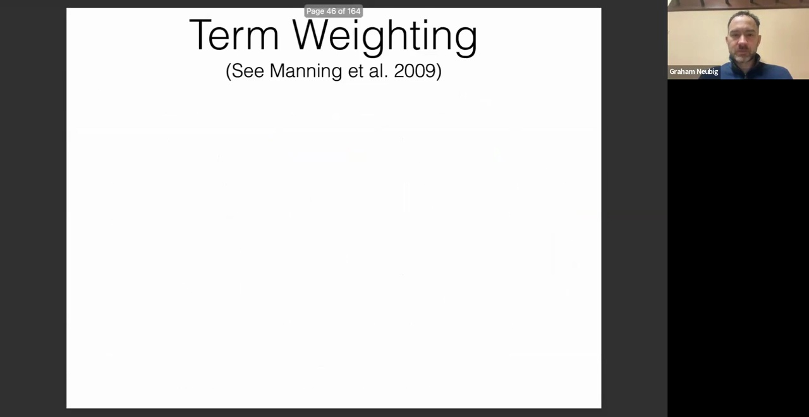

## 词项加权(Term Weighting)与 TF-IDF 机制
为解决上述问题，我们可以采用词项加权技术。其核心原理是：在计算特定文档的词频向量之外，引入逆文档频率(Inverse Document Frequency, IDF)加权项，以赋予低频词更高的权重。这是因为像“NLP”这类低频词，通常比“什么”、“是”等高频词更能指示文档的相关性，而高频词的出现往往与文档的具体主题关联甚微。该机制中最广泛使用且易于理解的版本是 TF-IDF（词频-逆文档频率, Term Frequency-Inverse Document Frequency）。词频(Term Frequency, TF)的定义如前所述，即词元 T 在文档 D 中出现的次数除以文档的总词元数（详见上一张幻灯片）。而逆文档频率(IDF)的计算则相对复杂，其基本原理是：取语料库(Corpus)中文档总数的对数，除以包含该词 T 的文档数量。因此，若某个词在众多文档中频繁出现，其 IDF 分数将很低（趋近于零）；反之，若该词极为罕见，其 IDF 分数则会很高。本质上，这正是对稀有词进行重要性加权。在 TF-IDF 算法中，我们将 TF 与 IDF 相乘，从而有效提升区分度高的低频词权重。此外，该机制还有一个广泛使用的改进变体，即 BM25(Best Matching 25) 算法。
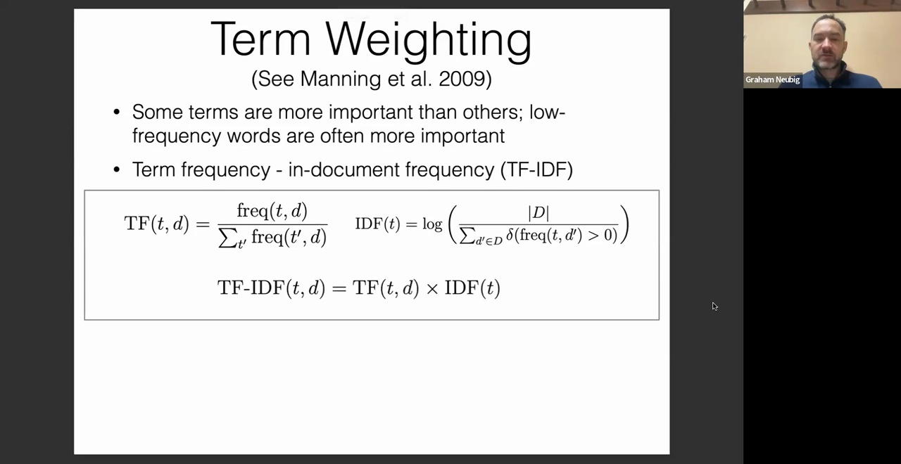

---

## BM25 平滑处理(Smoothing)与倒排索引(Inverted Index)实现
……（BM25）已被广泛使用。这部分内容略微复杂，此处不作深入探讨。但基本概念是：如果你还记得“基于计数的语言模型(Count-based Language Model)”相关课程，我们为这类模型设计了许多平滑技术(Smoothing Techniques)。BM25 采用了一种结合加性与乘性思想的平滑项来调整权重，而非直接使用原始词频(Term Frequency)。其具体公式包含参数 $k_1$ 和 $b$，其中 $\text{avgDL}$ 表示平均文档长度(Average Document Length)。这些数学细节并非核心，你只需掌握 BM25 本质上是对词频进行了平滑处理即可。如有兴趣，可自行查阅相关文献。
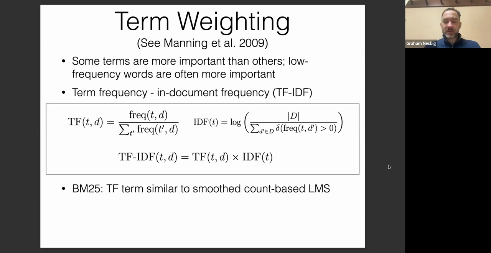
既然已生成基于词项的稀疏向量(Sparse Vector)，下一步便是利用它在文档集合(Document Collection)中快速检索相关文档。由于文档集合可能极其庞大（甚至如互联网般规模庞大，类似谷歌搜索的场景），我们需要一种支持高效稀疏向量检索的数据结构。假设我们拥有一组稀疏向量，可将其转化为索引(Index)。该索引类似于 Python 中的字典/映射(Dictionary/Map)，其中键(Key)为待检索的词元，值为包含该词元的文档标识符或位置索引。例如，“what”仅出现在文档一中，索引便指向文档一；“candy”同样指向文档一；而“NLP”则同时出现在文档二和三中。通过这种方式构建的索引即为倒排索引(Inverted Index)。这是信息检索领域极为重要的基础设施。业界已有诸多成熟工具，其中最经典的是 Apache Lucene。若你想基于稀疏索引构建大规模检索系统，建议深入研究 Lucene。
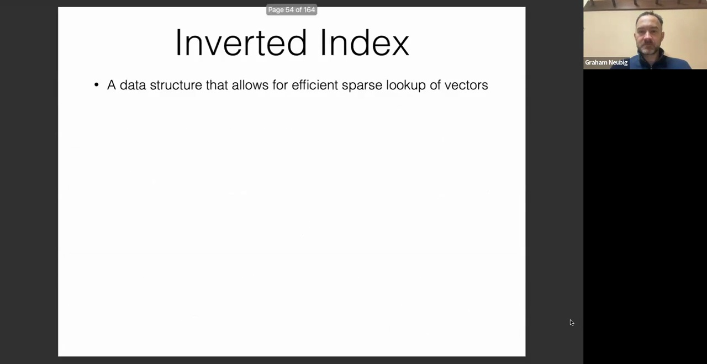

## 稠密检索(Dense Retrieval)与嵌入模型(Embedding Model)挑战
接下来讲解稠密检索(Dense Retrieval)。其核心原理是将文档和查询(Query)编码为稠密向量(Dense Vector)，随后通过计算寻找最近邻(Nearest Neighbor)。实现编码的方式有多种：既可直接使用现成的通用嵌入模型，也可采用专为检索任务训练的嵌入模型。具体流程为：首先获取所有文档，利用选定的嵌入方法将其转换为向量表示；接着接收用户查询，同样将其编码为向量；最后在向量空间中计算相似度，匹配出最近邻文档。
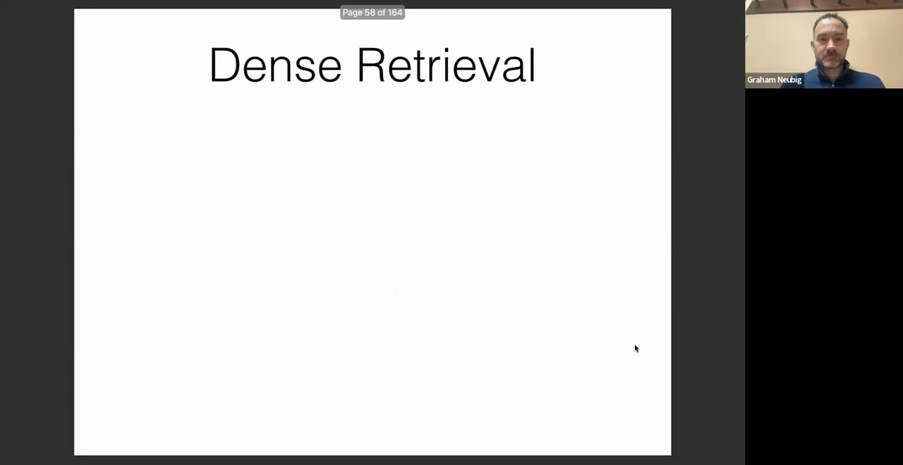
若仅使用现成的通用嵌入模型，无需进行针对性调整。你可以直接选用 Sentence-BERT 或 OpenAI 的 text-embedding-ada 等模型。然而，检索任务所需的向量表示具有高度特异性。因此，若追求高质量的检索效果，采用专为检索定制(Tailored)的嵌入模型至关重要。原因有多方面：最直观的解释可回顾 TF-IDF 的机制——它会对实义词(Content Words)和稀有词赋予极高权重。而随机获取的通用嵌入模型往往无法保证这一点。例如，若简单地对序列中所有词嵌入(Word Embedding)求平均，输出向量中各词元将获得均等权重。事实上，常见词的向量范数(Vector Norm)通常略高于低频词，这反而会错误地提升常见词的权重，与检索优化的目标背道而驰。

## 训练面向检索的嵌入模型(Embedding Model)
那么，如何训练面向检索的嵌入模型呢？标准做法是构建正例文档(Positive Document)与负例文档(Negative Document)对，并使用对比损失(Contrastive Loss)进行优化。举例而言：给定一个查询，我们已知其对应的正例文档和若干负例文档。随后构建铰链损失(Hinge Loss)或类似铰链损失的概率型损失函数，并以此对嵌入模型进行微调(Fine-tuning)。
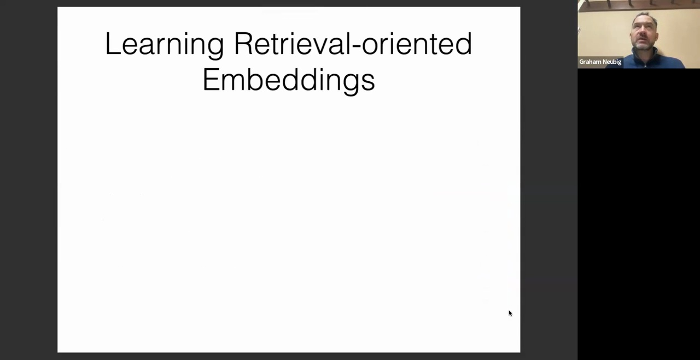
若拥有高质量标注的正例文档(Gold Standard)，训练过程将相对简单：只需正例样本，并通过多种策略采样负例。构建负例的常见方法是利用数据批次(Batch)。在给定批次中，可将其他查询对应的正例文档作为当前查询的负例。例如，采样 32 个“查询-文档”对，将正确匹配的作为正例，其余 31 个作为负例。该方法高效且有效，因为在现代深度学习框架中，可并行计算并更新这些样本的梯度。然而，此法常显不足，因为采样出的负例往往过于简单（与当前查询主题完全无关），模型极易通过浅层词重叠(Term Overlap)将其区分。因此，训练中常引入“困难负例(Hard Negatives)”。困难负例指语义相关或表面相似，但实际不包含正确答案的文档。著名的 DPR(Dense Passage Retrieval) 模型便同时采用了前述的批次内负例(In-batch Negatives)与通过 BM25 检索生成的困难负例来训练编码器。BM25 召回的文档在关键词匹配上高度相似，但可能缺乏精确答案，从而提供更强的判别信号。此外，利用无监督数据(Unsupervised Data)学习检索器也是重要方向。若完全依赖人工标注数据或点击日志，数据获取成本往往成为训练瓶颈。为此，Contriever 提出了一种自监督策略：将同一文档内的两个随机片段视为正例对，将不同文档间的随机片段视为负例对。该方法可用于模型的大规模初始预训练(Pre-training)。完成预训练后，再使用高质量标注数据进行微调，可显著提升检索性能。

## 近似最近邻搜索(Approximate Nearest Neighbor Search, ANN)与局部敏感哈希(Locality Sensitive Hashing, LSH)
至此，我们已探讨了稠密检索模型的训练机制，其核心在于优化稠密嵌入(Dense Embedding)的相似度或寻找最近邻。然而，实际部署面临一大挑战：文档库规模极其庞大。若将查询与库中所有文档逐一进行内积(Inner Product)计算，计算成本将高得难以承受。为此，近似最近邻搜索(Approximate Nearest Neighbor Search, ANN)技术应运而生。该类算法能够在近似线性时间复杂度内，高效检索出与查询向量内积最大的候选嵌入。由于目标是最大化内积值，该问题在学术界通常被称为最大内积搜索(Maximum Inner Product Search, MIPS)。

接下来，我将从宏观角度简要介绍两种主流的实现方案。第一种是局部敏感哈希(Locality Sensitive Hashing, LSH)，其本质可视为一种几何空间上的倒排索引。具体原理是对连续向量空间进行划分，并采用类似倒排索引的结构进行检索。假设我们拥有一组嵌入向量，此处以二维向量为例进行演示（实际应用中，词嵌入或查询/文档的嵌入空间维度通常高达 512、1024 或更高）。我们需要定义一系列超平面(Hyperplane)，将空间中的向量点划分至不同的子空间(Subspace)中。例如，若引入第一个超平面，位于该平面上方的所有向量点将被分配至……

---

## 局部敏感哈希(Locality Sensitive Hashing, LSH)与稀疏向量查找
位于超平面(Hyperplane)分割平面上方的数据点在该分区会被标记为 1，下方则标记为 0。通过生成多个随机超平面，我们可以根据数据点的空间位置为其分配稀疏的二进制向量(Sparse Binary Vector)（例如 `1,0,0` 或 `1,0,1`）。转换为这些离散向量后，我们便能像处理传统倒排索引(Inverted Index)一样，高效检索相关数据点。该技术巧妙地将连续的嵌入空间(Embedding Space)与高效的哈希查找结构(Hash-based Lookup Structure)连接起来。

## 基于图的搜索(Graph-based Search)与向量数据库(Vector Database)工具
另一种高效的近似最近邻搜索(Approximate Nearest Neighbor Search, ANN)方法依赖于基于图的搜索算法。其核心思想是构建“枢纽节点(Hubs)”，这些节点在嵌入空间中充当聚类中心(Clustering Center)或邻近数据点的代表。通过优先定位最近的枢纽节点，可大幅剪枝(Prune)搜索空间，随后在连通的节点间执行精细的局部搜索。此类分层(Hierarchical)或图遍历策略亦可扩展为树状结构。除非需从零实现底层算法，否则强烈推荐使用高度优化的开源库。例如 FAIR/Meta 开发的 Faiss(Facebook AI Similarity Search) 以及 AI 原生向量数据库 ChromaDB，均为行业标准工具，能够高效支撑复杂的索引构建与检索任务。

## 稠密检索的局限性与交叉编码器(Cross-Encoder)重排序

即便采用训练良好的稠密嵌入(Dense Embedding)模型，仍面临显著挑战。其主要局限在于信息损失(Information Loss)：将冗长文档压缩为单一固定维度的向量，会迫使模型受限于表征容量而丢弃潜在的相关细节。这通常导致在处理细粒度或复杂查询时检索性能下降。为克服该瓶颈，可从双塔架构(Bi-Encoder Architecture)切换至交叉编码器(Cross-Encoder)。交叉编码器将查询(Query)与文档(Document)拼接后共同输入 Transformer 模型，直接输出相关性评分。该机制使模型能够充分调用自注意力机制(Self-Attention Mechanism)，以捕获深层的语义交互。

然而，其代价是高昂的计算开销。由于交叉编码器涉及复杂的非线性计算，无法预先构建索引(Index)以支持快速的近似最近邻搜索。尽管不适合作为首轮大规模检索的候选生成器，但作为第二轮重排序器(Re-ranker)却极为强大。将交叉编码器应用于头部候选文档(Top-K Candidates)列表，可通过有效过滤假阳性(False Positives)结果，显著提升最终检索准确率。

## 基于 ColBERT 的词元级稠密检索(Token-level Dense Retrieval)

一种高效的折中方案是词元级稠密检索，其标志性实现为 ColBERT 架构（亦称延迟交互/Late Interaction）。与将整篇文档压缩为单一向量不同，ColBERT 为每个独立词元(Token)保留上下文感知的嵌入(Context-aware Embedding)。文档在离线阶段(Offline Phase)按词元级别进行预索引。在查询阶段，每个查询词元通过高效的最大内积搜索(Maximum Inner Product Search, MIPS)独立匹配所有文档词元，并对最高匹配得分进行聚合。该设计在维持细粒度词汇与语义匹配的同时，仍具备扩展至大规模语料库的能力。其主要瓶颈在于存储开销：向量索引的体积随文档词元总数呈线性增长，而非随文档数量增长。尽管可采用量化等压缩技术(Compression Techniques)，其内存占用与计算资源需求仍显著高于标准双塔架构。

## 假设文档嵌入(Hypothetical Document Embeddings, HyDE)
卡内基梅隆大学(CMU)提出的一项创新方案为假设文档嵌入。该方法旨在解决短小、碎片化的用户查询与长篇、结构严谨的目标文档之间存在的表征失配问题。HyDE 并不直接对原始查询进行嵌入，而是通过提示大语言模型(Large Language Model, LLM)生成一篇能够理想解答该问题的假设性文档。生成文本在行文风格、篇幅长度及专业词汇上会自然与目标语料库(Target Corpus)对齐。随后，对该假设性文档进行向量化并检索相似的真实文档，可大幅提升召回准确率，尤其在跨域任务(Cross-domain Tasks)或使用未经特定领域微调的通用嵌入模型时效果显著。

## 方法选择与实践建议

在制定检索策略时，需在鲁棒性(Robustness)、准确率(Accuracy)与计算效率(Computational Efficiency)之间寻求平衡。作为可靠的初始方案，BM25（稀疏检索）是极佳的基线方法(Baseline Method)。其无需模型训练，具备高度可解释性(Interpretability)，且在面对新领域或分布外数据时仍能保持优异的稳定性。基于嵌入的模型在匹配精度上通常显著优于 BM25，但若目标领域与预训练数据分布差异较大，其性能易出现显著衰减。若追求极致准确率且计算资源充裕，采用经过领域微调的稠密嵌入，并结合词元级匹配（如 ColBERT）或交叉编码器重排序，往往能取得最优效果。工程实践中，混合流水线(Hybrid Pipeline)通常为最佳实践：先利用轻量级、高召回的检索器（如 BM25 或标准稠密模型）快速生成候选文档集，再交由计算密集但高精度的重排序器进行精细筛选，以最终确定注入模型的最佳上下文。

---

## 向量数据库(Vector Database)支持与双塔(Bi-Encoder)基线模型
（在特定配置下）模型仍能取得不错的准确率。然而，FAISS 和 Chroma 等标准向量数据库对双塔(Bi-Encoder)架构提供了更完善的原生支持。因此，若你倾向于采用更简洁、易于快速上手的方案，选择双塔模型通常是最佳路径。
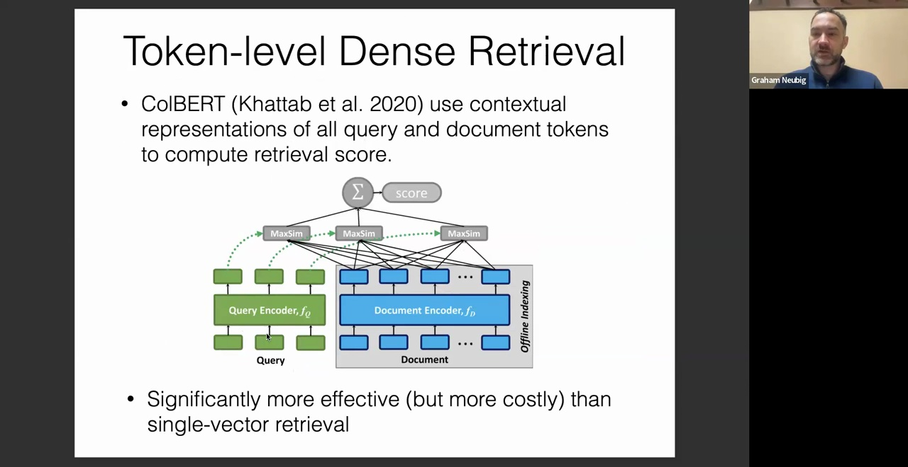

## 基础的检索器-阅读器(Retriever-Reader)串联
接下来，我们将深入探讨实际的检索增强生成(Retrieval-Augmented Generation, RAG)模型架构。该架构通常采用检索器-阅读器范式。其核心原理非常直观：最基础的实现方式是将检索(Retrieval)与阅读/生成模块直接串联。具体而言，你可以使用开箱即用(Off-the-shelf)的检索器与阅读器模型。当接收到用户查询(Query)时，系统首先在外部数据源（如搜索引擎）中检索相关段落，随后将这些上下文片段输入至大语言模型(Large Language Model, LLM)（如 GPT 系列）中，最终生成答案。
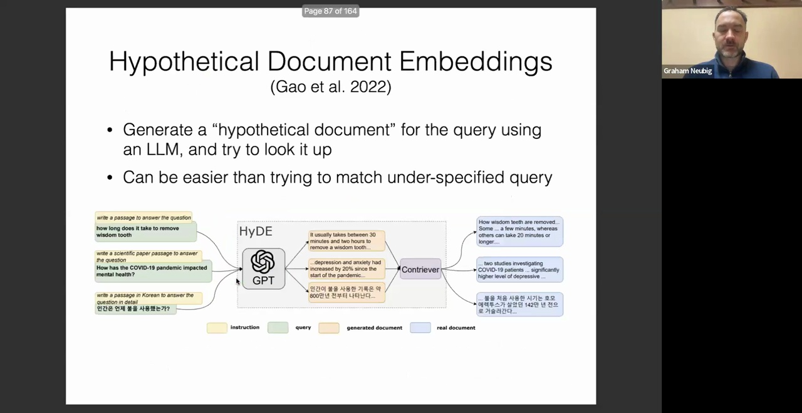
总体而言，该方案高效且实用。它易于部署并能取得可观的效果，极具应用价值。鉴于本课程要求仅使用公开模型或开源实现，你们完全可以利用 Apache Lucene 构建检索器，并搭配任意主流大语言模型，例如 Llama、ChatGLM、Mistral 或 Mixtral。这种灵活组合可供你们自由探索。当然，检索到的文本片段需拼接至提示词上下文中，这会导致上下文长度显著增加并带来较高的计算开销(Computational Overhead)，但这是应用 RAG 架构时必须权衡的客观现实。
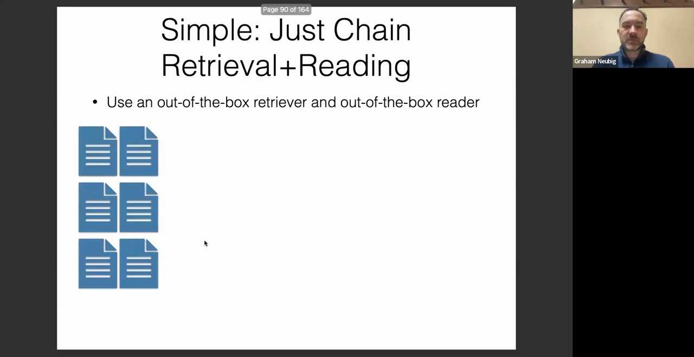
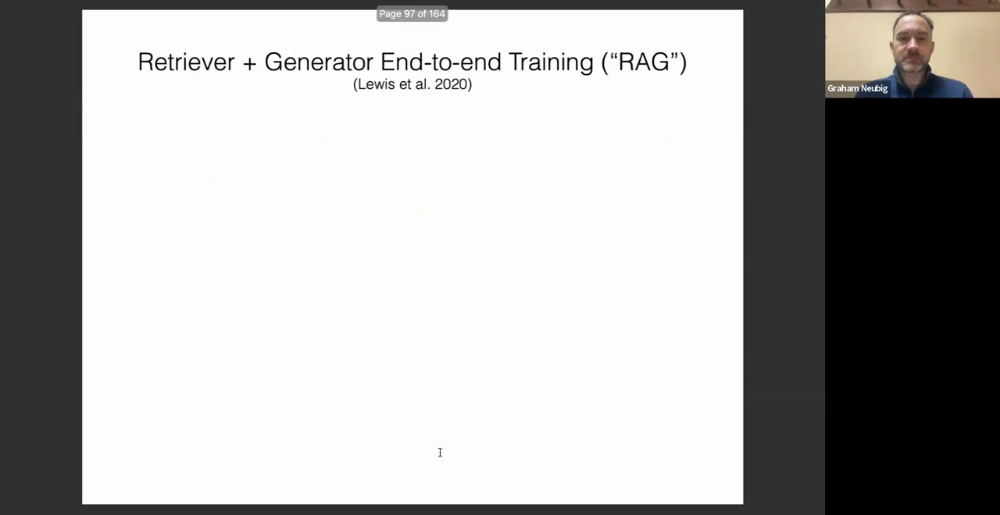

## 端到端训练(End-to-End Training)与 RAG 混合模型
此外，业界也提出了针对检索器与生成器进行联合训练的方法。事实上，“RAG”这一术语正是源自 Lewis 等人发表的开创性论文。此处仅以该工作为例，但多项研究均表明，联合优化检索器与阅读器能显著提升系统准确率。在 Lewis 等人的 RAG 架构中，阅读器(Reader)的训练目标是在给定单一检索文档的条件下最大化条件生成似然(Conditional Generation Likelihood)；而检索器则通过优化文档的后验概率分布（混合权重），以最大化整体序列的边际似然(Marginal Likelihood)。
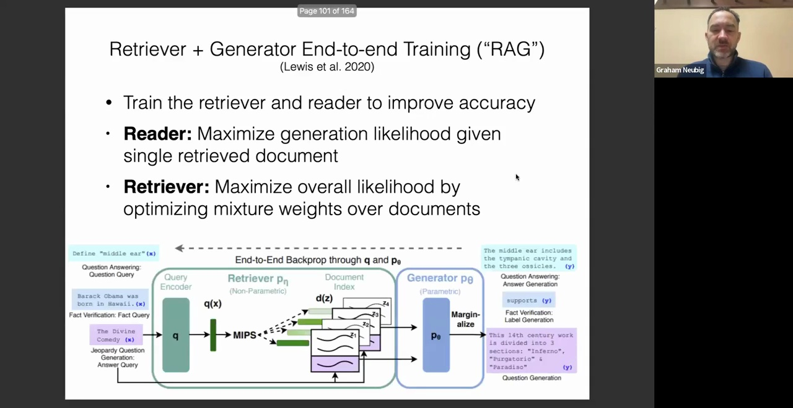
如下图所示：输入查询后，检索器通过最大内积搜索(Maximum Inner Product Search, MIPS)返回 Top-K 候选文档及其相关性得分。随后，系统将每个文档作为独立上下文输入生成器进行文本生成，并对各路径的概率进行加权求和。此处列出具体数学公式，以便更直观地理解。该生成过程本质上是一个混合模型(Mixture Model)：系统隐式地采样一个文档并基于其生成内容。公式中，$P(d_k|x)$ 表示给定查询 $x$ 时检索到文档 $d_k$ 的概率；$P_\theta(y_k|x, d_k, z_{<k})$ 则表示在给定查询、特定文档 $d_k$ 及历史生成序列 $z_{<k}$ 的条件下，预测下一个词元(Token)的概率。整体而言，这实质上是对多个文档上下文进行的概率插值。
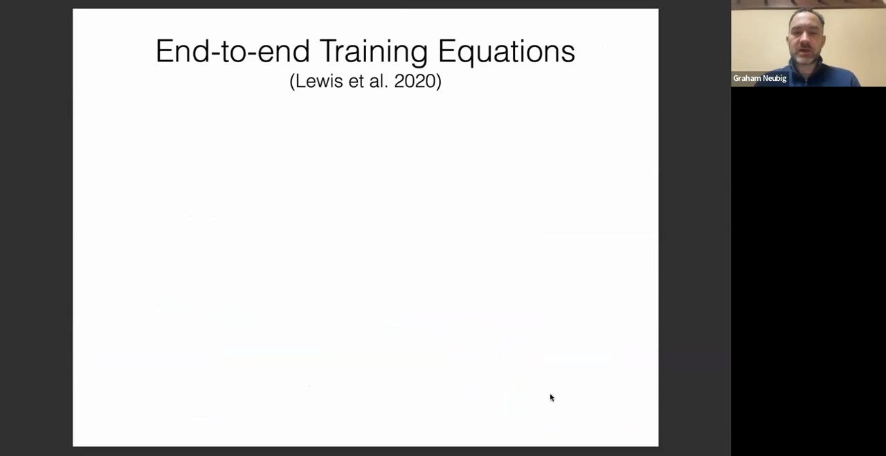

## 可微检索(Differentiable Retrieval)与梯度传播
深入剖析该架构，可将其视为检索器与生成器（或阅读器）的深度耦合。实现端到端训练的关键在于：检索器的概率计算完全基于可微的嵌入向量(Embedding)。具体而言，文档与查询被分别编码为稠密向量，其匹配概率与向量内积(Inner Product)呈正相关。系统本质上对检索得分执行了 Softmax 归一化操作。这种可微性使得检索器能够通过梯度下降自我优化，从而为更具信息量的文档分配更高的相似度得分。由于检索概率被无缝整合进端到端的联合似然函数中，训练过程无需依赖“相关文档”的人工标注数据。模型可直接通过反向传播算法(Backpropagation)自动更新检索器参数。
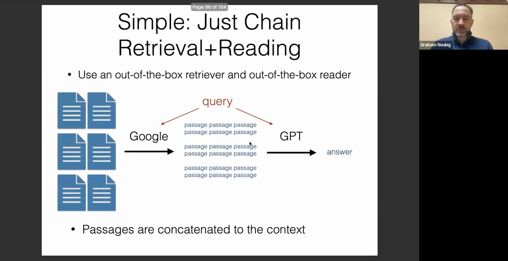

## 固定索引约束与检索时机(Retrieval Timing)
训练此类模型面临的一个核心挑战是：搜索索引的更新成本极其高昂。具体而言，回顾前文对稠密检索的讨论，构建右侧所示的向量搜索索引计算开销巨大。假设某大型搜索引擎需对百万乃至十亿级文档进行向量化嵌入，索引构建过程将极为耗时。相比之下，基于近似最近邻(Approximate Nearest Neighbor, ANN)的查询操作具有次线性(Sub-linear)甚至对数级时间复杂度，执行速度极快。因此，在静态索引上进行检索完全可行；但若频繁更新文档嵌入向量并重建索引，将引发不可接受的计算瓶颈。
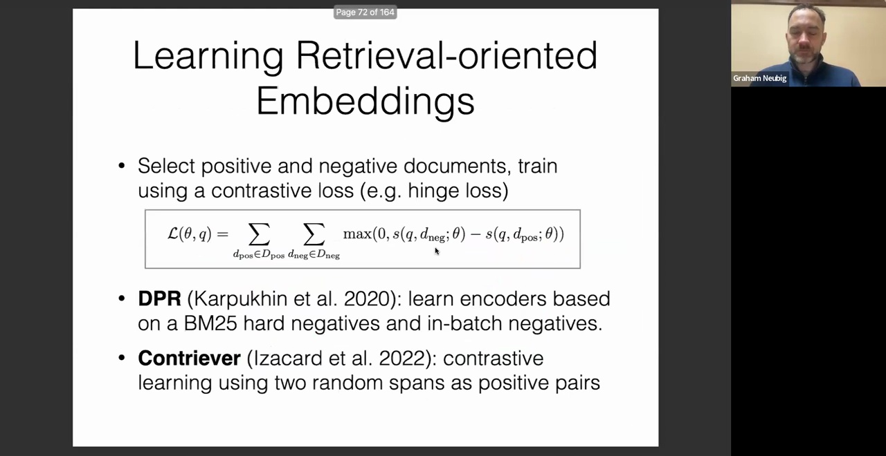
为此，Lewis 等人在 RAG 论文中提出了一种高效策略：仅优化查询的嵌入表示，而将文档库的嵌入向量保持固定(Frozen)。当然，学界亦存在替代方案，例如检索增强预训练模型 REALM，其采用异步进程(Asynchronous Process)，在训练期间持续利用最新的文档编码器重建搜索索引。然而，该方案的计算负载极为沉重。因此，工业界与学术界更普遍的做法是冻结文档嵌入，仅对查询编码器进行微调。
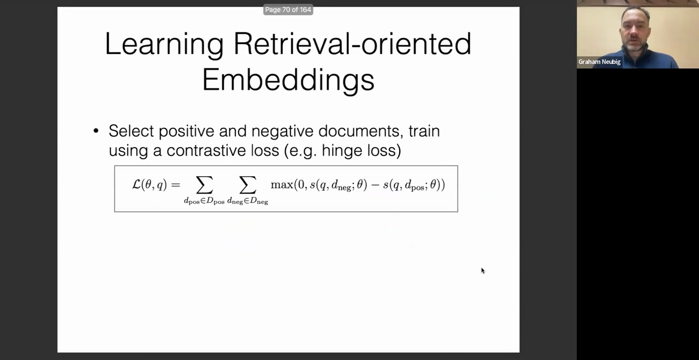
另一个关键设计决策是：检索时机应如何设定？目前存在多种范式。前述经典 RAG 论文采用“检索-单次生成”模式，即在序列生成初始阶段执行一次检索，获取单一（或少数）文档后生成完整输出。这也是当前多数系统的默认配置。然而，动态检索策略提供了更多可能性。系统可在生成过程中按需触发多次检索：例如，模型可输出特定的“检索触发词元”以主动调用外部搜索，或在预测置信度较低时自动触发检索。更极端的方案是逐词元检索，即每生成一个词元便执行一次检索。此类方法可通过计算相似上下文向量来调制生成概率，或利用最近邻检索近似自注意力(Self-Attention)机制。

## 词元触发的工具调用(Tool Calling)：Toolformer
接下来，我将逐一详解上述检索触发机制。首先介绍基于词元触发的工具调用，其代表性工作为 Toolformer（Schick 等人）。该架构的核心在于：语言模型能够自主生成特殊控制词元(Special Control Token)以激活检索器或其他外部工具。在 Toolformer 的设定中，模型可无缝接入问答系统、计算器或机器翻译引擎等多种工具。具体到检索增强生成场景，模型相当于内嵌了维基百科搜索功能，可先主动检索相关知识片段，随后将这些外部信息融入上下文，以调制后续的生成概率分布。

其训练流程采用迭代式自监督策略：模型首先生成潜在的函数调用轨迹，若引入工具调用能显著提升后续文本的生成概率，该轨迹即被标记为正例(Positive Example)，并用于模型的进一步微调。该范式影响深远。事实上，当前 ChatGPT 的插件与工具调用机制正是沿袭此思路。如今，此类能力已不仅限于信息检索，更广泛扩展至代码生成、图像合成等多模态工具调用领域。
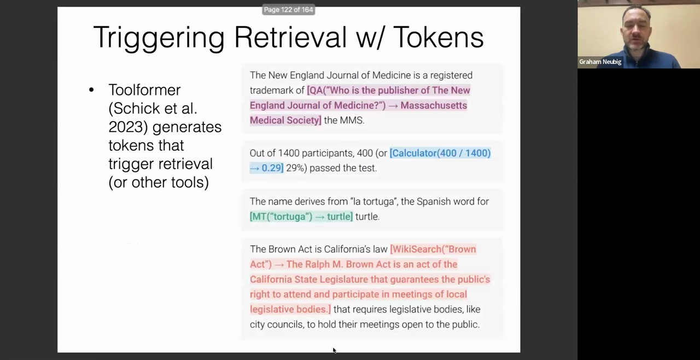
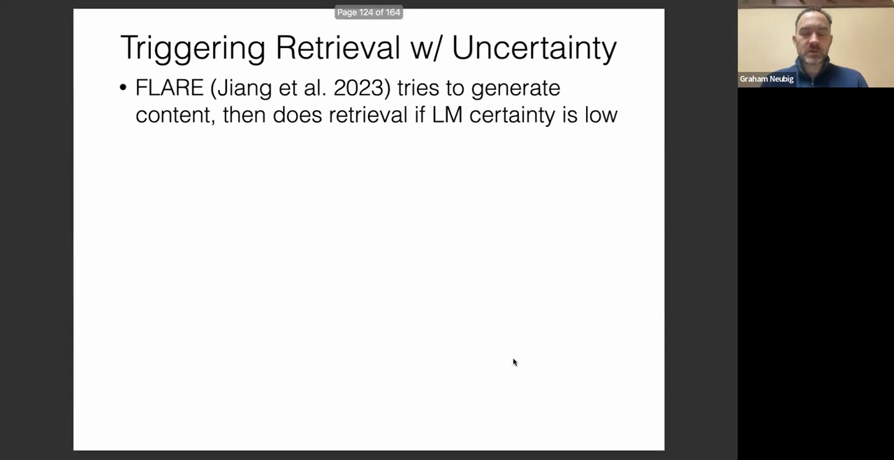

## 不确定性估计(Uncertainty Estimation)驱动的检索
另一种主流方案是基于不确定性估计触发动态检索。值得一提的是，此项工作由我的学生 Shohbo Shon 等人共同完成。在该研究中，我们设计了一种自适应机制：模型首先尝试自主生成文本，当语言模型的预测置信度(Confidence Score)低于预设阈值时，系统自动触发外部检索以获取补充知识。其核心架构如下图所示。
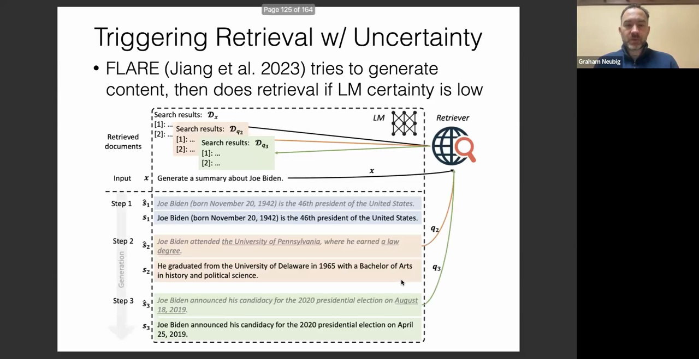

---

## 不确定性驱动(Uncertainty-Driven)的检索策略
下图展示了该机制的工作原理。假设系统已检索到若干相关文档，例如要求生成关于乔·拜登(Joe Biden)的摘要。在生成首个词元时，若语言模型输出的置信度(Confidence)较高，则直接生成该词元，无需触发检索。

然而在后续生成步骤中，模型可能输出类似“乔·拜登毕业于宾夕法尼亚大学法学院”的内容。若模型对该部分内容的预测概率较低（即置信度不足），系统将自动构建检索查询：具体而言，将低置信度部分进行掩码(Mask)处理，并执行外部搜索。该机制与假设文档嵌入(Hypothetical Document Embeddings, HyDE)思路相近，即通过构造与目标文档高度相似的查询文本来获取检索结果，随后基于检索结果继续生成。该过程循环进行：当模型输出高置信度内容时，直接依赖内部参数生成；一旦出现低置信度词元，则触发检索并融合外部知识。我认为这是一种极具潜力的架构。其主要缺点在于可能增加计算延迟：系统需先生成初步输出以识别低置信度片段，再进行二次生成。但若对输出质量有极高要求，这种权衡是完全合理的。

## 基于 kNN-LM 的逐词元检索(Token-by-Token Retrieval)
接下来，我们探讨逐词元检索方法。在该方向上，最具代表性的开创性工作之一是 kNN-LM(k-Nearest Neighbor Language Model)。

其核心原理是检索相似的上下文示例，并利用这些示例中的后续词元进行预测。这在某种程度上可视为一种极其强大的基于计数的词对模型(Bigram Model)。回顾传统的词对模型：其通过统计前序词元的共现频率，计算条件概率分布。kNN-LM 的工作流程如下：给定当前文本上下文 $x$ 及目标输出，系统首先遍历训练数据中的所有历史上下文。通过提取模型倒数第二层(或最后一层)的隐藏表示(Hidden Representation)，将这些训练上下文编码为向量，并记录每个上下文对应的后续词元，从而构建一个“上下文向量-后续词元”键值对数据库。在推理阶段，计算当前上下文的向量表示与数据库中所有历史上下文的距离，检索出最近的 $K$ 个邻居(Nearest Neighbors)。例如，检索到的前 $K$ 个示例的后续词元可能包含多个“Hawaii”和“Illinois”。随后，基于距离度量进行归一化(Normalization)，得到候选词元的概率分布。若同一词元多次出现，则聚合其概率（如 Hawaii 累计概率为 0.8，Illinois 为 0.2）。最后，引入插值系数 $\lambda$，将该检索概率与原始语言模型(Language Model)的参数化概率进行线性插值(Linear Interpolation)，得出最终的预测概率。

该方法的优势在于，模型输出显式地依赖于具体训练实例，从而显著优化概率分布，有效改善机器翻译(Machine Translation)及其他生成任务的质量。然而，其缺点是为推理管线引入了额外的非参数组件，并新增了如插值系数 $\lambda$ 等超参数(Hyperparameter)。这在一定程度上增加了系统复杂度与调参成本，且并非在所有应用场景中都能带来收益。

## 基于 Llamaformer 的注意力检索(Attention-based Retrieval)
另一种创新架构是 Llamaformer，该方法由本课程此前讲解生成模型的 Manapurch 等人提出。Llamaformer 的核心洞察在于：自注意力机制(Self-Attention Mechanism)本质上可视为一种内积搜索(Inner Product Search)。基于此，该模型引入了 Top-K 注意力(Top-K Attention)策略。具体实现上，系统首先通过滑动窗口(Sliding Window)处理输入序列，随后利用向量索引(Vector Index)加速注意力计算。面对超长输入时，模型采用分块编码(Chunk-based Encoding)策略：例如依次编码 AB、CD、EF 等文本块，并将各块的隐藏状态拼接，构建出长序列的全局索引。该思路与 kNN-LM 有相似之处，均涉及向量索引的构建。但关键差异在于：Llamaformer 直接对注意力机制中的值向量(Values)进行操作，而非仅作用于模型的最终输出层。

值得注意的是，构建该长序列索引后，在执行下一轮注意力计算时，系统将基于查询向量(Query Vector)发起 kNN 搜索，检索出匹配的隐藏状态(Hidden States)，并直接在这些状态上计算注意力权重。该架构的一大优势在于其理论上的完备性：在理想边界条件下，它无需修改模型结构。例如，若输入序列极短，仅需单块编码；且若对块内所有嵌入执行精确的 kNN 搜索，则该机制将严格退化为标准的全局注意力机制。然而，实际部署中不可避免地引入了近似计算(Approximation)：一方面，分块独立编码可能损失跨块的上下文交互信息；另一方面，系统会动态截断内积得分较低的注意力项以降低计算开销。尽管存在近似误差，但在无近似假设下该模型与原架构完全等价。经验表明，该方法在处理长距离依赖(Long-Range Dependencies)时表现优异。未来通过优化近似策略，其性能仍有巨大提升空间。总体而言，这是一项极具学术价值与工程潜力的研究方向。

## 长上下文 Transformer(Long-Context Transformer) 与循环神经网络(RNN)的对比
最后，我们将探讨长上下文 Transformer。此类模型经过专项训练，旨在高效捕捉超长文本中的依赖关系。构建长上下文模型最直观的方法是将文本序列直接拼接。事实上，在 Transformer 架构提出不久后，Voita 等人的研究便证实，该策略能使模型自发学习文档级(Document-level)语言现象。例如，模型可准确执行共指消解(Coreference Resolution)，即识别不同词元是否指向同一实体，并掌握其他复杂的篇章级语义关联。

然而，Transformer 架构的固有缺陷在于其计算复杂度(Computational Complexity)与序列长度呈二次方关系($O(N^2)$)。这是由于自注意力机制需计算所有查询向量(Query Vectors)与键向量(Key Vectors)的点积矩阵。当序列长度急剧增加时，该操作将引发严重的计算与内存瓶颈。

相比之下，课程初期介绍的循环神经网络(Recurrent Neural Network, RNN)则不存在该问题，因其计算复杂度与序列长度呈线性关系($O(N)$)。RNN 仅需在时间步(Time Step)间递归传递隐藏状态，并执行恒定的状态更新操作，从而彻底避免了二次方计算开销。此外，在 RNN 的前向传播(Forward Propagation)过程中，理论上可无限延展序列：系统只需计算并保留当前隐藏状态，即可安全释放历史计算图(Computational Graph)所占用的内存。该过程完全精确，无需任何近似处理。因此，与前述需引入近似策略的 Llamaformer 不同，RNN 在长序列推理中具有天然优势。然而，RNN 在反向传播(Backpropagation)阶段面临严峻挑战，因为……

---

## 截断反向传播(Truncated Backpropagation)与序列模型的局限性
因为在进行反向传播(Backpropagation)时，通常需要维护完整计算图(Computational Graph)的状态。解决此问题的常用策略是：仅传递前一序列片段的循环神经网络(Recurrent Neural Network, RNN)隐藏状态，而切断对其历史片段的梯度回传。该机制被称为截断反向传播(Truncated Backpropagation)或随时间截断的反向传播(Truncated Backpropagation Through Time, TBPTT)。

这使得我们原则上能够训练支持极长（乃至理论上无限）上下文的模型，即便不向历史片段回传梯度。当然，在长上下文应用场景中，该方法仍面临挑战：受限于严格的时序依赖(Temporal Dependency)，传统 RNN 的串行计算特性导致其运行效率较低，难以在 GPU 等硬件上实现高效并行。近期涌现的 Mamba 与 RWKV 等架构则有效克服了这一瓶颈，它们在保持线性时间复杂度(Linear Time Complexity)的同时，高度适配 GPU 并行训练。我将在后续课程中对此展开深入探讨。

## Transformer-XL 与滑动窗口注意力(Sliding Window Attention)机制
实际上，将随时间截断反向传播的思想迁移至 Transformer 架构同样可行。一篇极具影响力的论文提出了 Transformer-XL，该工作由曾在卡内基梅隆大学(CMU)任教的戴志航(Zihang Dai)等人主导完成。

其核心机制是缓存(Cache)历史片段的隐藏状态。在标准 Transformer 中，自注意力(Self-Attention)仅作用于当前上下文内的词元。而 Transformer-XL 的创新在于：当输入新的文本片段时，模型不仅关注当前片段，还会将前一片段的隐藏状态作为扩展上下文进行注意力计算，但梯度仅在当前片段内传播，不更新历史状态。这本质上实现了 Transformer 架构下的随时间截断反向传播。该设计极为巧妙，使模型能够跨越多层网络追溯更早的信息。具体而言，顶层网络可直接关注前一上下文窗口；而底层网络通过状态传递，其感受野(Receptive Field)可覆盖更早的历史窗口。逐层叠加后，有效上下文范围呈近似指数级增长，使模型得以高效建模超长序列。

近年来广受瞩目的 Mistral 模型，其核心采用的滑动窗口注意力机制，在理念上与 Transformer-XL 一脉相承。由此可见，该类基于窗口与状态复用的策略至今仍在工业界系统中得到广泛应用。

## 稀疏 Transformer(Sparse Transformer)与压缩 Transformer(Compressive Transformer)
该领域的另一篇里程碑式论文提出了稀疏 Transformer。

稀疏 Transformer 的核心原理是：摒弃全量注意力计算，转而采用稀疏连接模式，例如仅对局部邻近词元及固定步长(Strided)的远程词元进行注意力计算。这使其结构类似于步长卷积(Strided Convolutions)或特定设计的循环网络。具体而言，对于目标词元，模型会同时关注局部窗口内的所有词元，以及跨越历史片段的稀疏采样点。这种局部注意力(Local Attention)与全局注意力(Global Attention)的融合设计极为高效，仅需极小的计算复杂度增量，即可显著扩大模型的有效上下文跨度。

另一项理念相近但实现路径不同的工作称为压缩 Transformer。

该架构同样维护局部记忆与长期压缩记忆(Compressed Memory)。其独特之处在于引入了显式的记忆压缩(Memory Compression)模块，通过辅助网络将历史激活状态压缩为紧凑的记忆向量。这种设计提供了更高的灵活性，允许模型动态提取并压缩局部上下文中的关键信息。该思路为长程建模提供了极具价值的参考方向。

## 注意力机制的低秩近似(Low-Rank Approximation)
最后，我们探讨几类针对 Transformer 注意力机制的低秩近似方法。

标准注意力矩阵的计算成本高昂，但其本质为矩阵运算，因此可采用低秩分解进行近似。目前已有多种实现路径：其一是线性 Transformer(Linear Transformer)，它通过引入特定的核函数映射(Feature Map)，将 Softmax 注意力转化为线性计算复杂度；其二是 Nyström Transformer，该方法基于 Nyström 近似法，通过采样锚点(Landmark Points)构建低秩注意力矩阵。核心思想在于：传统方法需对超长序列进行完整的 Softmax 归一化，而低秩近似技术（其思想与 LoRA 中的矩阵分解有异曲同工之妙）可利用低秩基底高效逼近 Softmax 运算结果。这使得模型在免除非线性全量计算的同时，仍能精准捕获注意力权重分布。

## 长上下文评估基准(Benchmarks)
课程主体内容已接近尾声。最后，我们来探讨长上下文模型的评估基准。目前业界已建立多个专用评测集。

其中最为知名的当属 Long Range Arena(LRA)。该综合性基准主要涵盖非自然语言处理任务（如图像分类、形式语言等）。尽管它被广泛用于长序列建模评估，但其在 LRA 上的表现往往与实际长程语言建模任务的相关性有限。因此，我更为推荐 SCROLLS 基准。该数据集专门针对自然语言处理设计，整合了大量依赖极长上下文的问答与摘要任务，涵盖小说文本、学术专著、政府报告等真实语料。若你致力于长上下文模型的研究，SCROLLS 将是极具参考价值的评测平台。

## “中间迷失”(Lost in the Middle)现象与上下文过滤(Context Filtering)
最后，我想抛出一个关键问题：当前我们已具备强大的检索器(Retriever)与阅读器(Reader)，甚至拥有了能够有效处理极长上下文的生成模型。那么，在实际系统中，我们应如何高效协同并利用这些组件？

斯坦福大学 Nelson Liu 等人的研究揭示了一个名为“中间迷失”的关键现象。实验表明，多数主流模型（含最先进架构）均存在显著的位置偏置(Positional Bias)，对长上下文窗口中段内容的注意力权重较低。若将关键信息置于输入序列的开头或末尾，模型往往能准确捕获；而置于中部时，信息则极易被忽略，即“迷失于中间”。在检索增强生成(RAG)场景中，若仅将高相关度文档置顶，此问题尚可缓解；但若直接拼接大量检索结果，或要求模型在不依赖显式排序的情况下综合极长文档，该缺陷将严重制约性能。加之检索器本身存在召回误差，模型必须具备更强的长文本容错与信息提取能力。

为此，学界与工业界提出了多种优化策略以确保上下文的高效利用。直观而言，升级检索器可提升召回质量；引入重排序(Re-ranking)模块能精准筛选高相关片段；此外，针对阅读器架构的专项优化亦是常见路径。

另一方面，亦可通过上下文过滤机制动态决定信息的取舍。我们近期提出了一种名为 FILCo 的架构，专门用于段落过滤与精准检索。该模型能够自动剔除冗余噪声，仅保留与查询高度契合的核心上下文。经 FILCo 预处理后的精炼文本输入至生成器，可显著提升最终输出质量。

以上即为本次讲座的全部内容。

---

## 结语与问答
感谢大家观看本次课程视频。选修本课程的同学如有疑问，欢迎在 Piazza 问答平台(Piazza)或办公时间(Office Hours)与我交流答疑。期待与大家进一步探讨。非常感谢！
