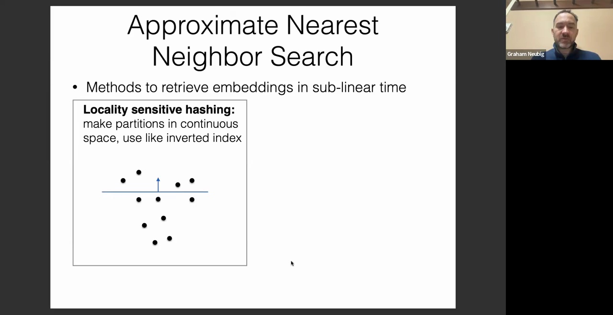
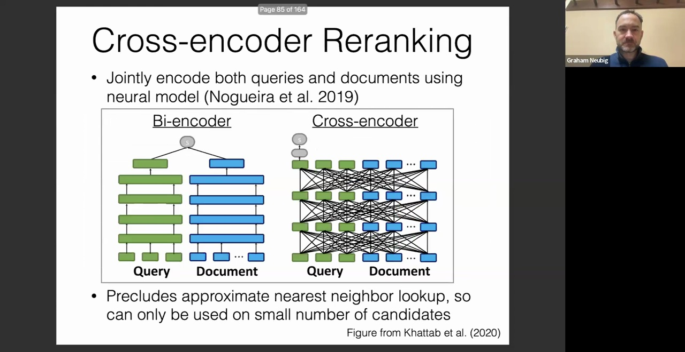
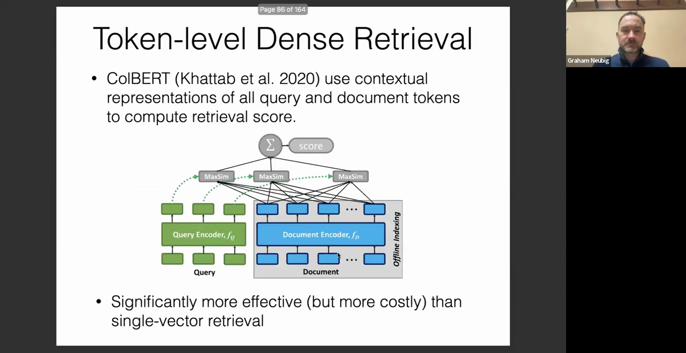
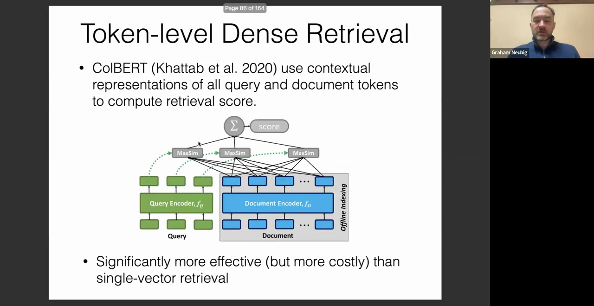
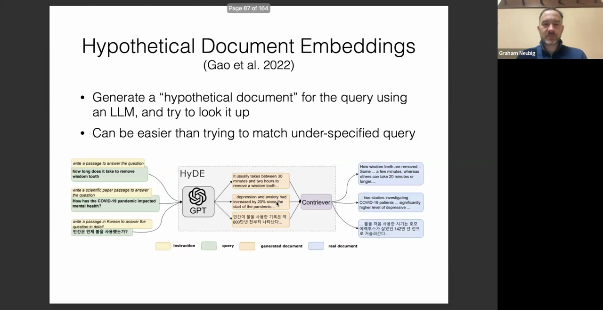
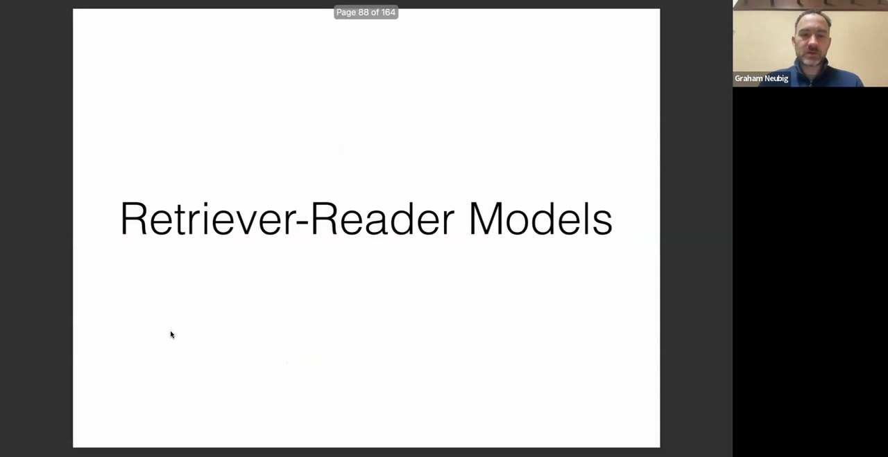

## 局部敏感哈希(Locality Sensitive Hashing, LSH)与稀疏向量查找
位于超平面(Hyperplane)分割平面上方的数据点在该分区会被标记为 1，下方则标记为 0。通过生成多个随机超平面，我们可以根据数据点的空间位置为其分配稀疏的二进制向量(Sparse Binary Vector)（例如 `1,0,0` 或 `1,0,1`）。转换为这些离散向量后，我们便能像处理传统倒排索引(Inverted Index)一样，高效检索相关数据点。该技术巧妙地将连续的嵌入空间(Embedding Space)与高效的哈希查找结构(Hash-based Lookup Structure)连接起来。

## 基于图的搜索(Graph-based Search)与向量数据库(Vector Database)工具
另一种高效的近似最近邻搜索(Approximate Nearest Neighbor Search, ANN)方法依赖于基于图的搜索算法。其核心思想是构建“枢纽节点(Hubs)”，这些节点在嵌入空间中充当聚类中心(Clustering Center)或邻近数据点的代表。通过优先定位最近的枢纽节点，可大幅剪枝(Prune)搜索空间，随后在连通的节点间执行精细的局部搜索。此类分层(Hierarchical)或图遍历策略亦可扩展为树状结构。除非需从零实现底层算法，否则强烈推荐使用高度优化的开源库。例如 FAIR/Meta 开发的 Faiss(Facebook AI Similarity Search) 以及 AI 原生向量数据库 ChromaDB，均为行业标准工具，能够高效支撑复杂的索引构建与检索任务。

## 稠密检索的局限性与交叉编码器(Cross-Encoder)重排序

即便采用训练良好的稠密嵌入(Dense Embedding)模型，仍面临显著挑战。其主要局限在于信息损失(Information Loss)：将冗长文档压缩为单一固定维度的向量，会迫使模型受限于表征容量而丢弃潜在的相关细节。这通常导致在处理细粒度或复杂查询时检索性能下降。为克服该瓶颈，可从双塔架构(Bi-Encoder Architecture)切换至交叉编码器(Cross-Encoder)。交叉编码器将查询(Query)与文档(Document)拼接后共同输入 Transformer 模型，直接输出相关性评分。该机制使模型能够充分调用自注意力机制(Self-Attention Mechanism)，以捕获深层的语义交互。

然而，其代价是高昂的计算开销。由于交叉编码器涉及复杂的非线性计算，无法预先构建索引(Index)以支持快速的近似最近邻搜索。尽管不适合作为首轮大规模检索的候选生成器，但作为第二轮重排序器(Re-ranker)却极为强大。将交叉编码器应用于头部候选文档(Top-K Candidates)列表，可通过有效过滤假阳性(False Positives)结果，显著提升最终检索准确率。

## 基于 ColBERT 的词元级稠密检索(Token-level Dense Retrieval)

一种高效的折中方案是词元级稠密检索，其标志性实现为 ColBERT 架构（亦称延迟交互/Late Interaction）。与将整篇文档压缩为单一向量不同，ColBERT 为每个独立词元(Token)保留上下文感知的嵌入(Context-aware Embedding)。文档在离线阶段(Offline Phase)按词元级别进行预索引。在查询阶段，每个查询词元通过高效的最大内积搜索(Maximum Inner Product Search, MIPS)独立匹配所有文档词元，并对最高匹配得分进行聚合。该设计在维持细粒度词汇与语义匹配的同时，仍具备扩展至大规模语料库的能力。其主要瓶颈在于存储开销：向量索引的体积随文档词元总数呈线性增长，而非随文档数量增长。尽管可采用量化等压缩技术(Compression Techniques)，其内存占用与计算资源需求仍显著高于标准双塔架构。

## 假设文档嵌入(Hypothetical Document Embeddings, HyDE)
卡内基梅隆大学(CMU)提出的一项创新方案为假设文档嵌入。该方法旨在解决短小、碎片化的用户查询与长篇、结构严谨的目标文档之间存在的表征失配问题。HyDE 并不直接对原始查询进行嵌入，而是通过提示大语言模型(Large Language Model, LLM)生成一篇能够理想解答该问题的假设性文档。生成文本在行文风格、篇幅长度及专业词汇上会自然与目标语料库(Target Corpus)对齐。随后，对该假设性文档进行向量化并检索相似的真实文档，可大幅提升召回准确率，尤其在跨域任务(Cross-domain Tasks)或使用未经特定领域微调的通用嵌入模型时效果显著。

## 方法选择与实践建议

在制定检索策略时，需在鲁棒性(Robustness)、准确率(Accuracy)与计算效率(Computational Efficiency)之间寻求平衡。作为可靠的初始方案，BM25（稀疏检索）是极佳的基线方法(Baseline Method)。其无需模型训练，具备高度可解释性(Interpretability)，且在面对新领域或分布外数据时仍能保持优异的稳定性。基于嵌入的模型在匹配精度上通常显著优于 BM25，但若目标领域与预训练数据分布差异较大，其性能易出现显著衰减。若追求极致准确率且计算资源充裕，采用经过领域微调的稠密嵌入，并结合词元级匹配（如 ColBERT）或交叉编码器重排序，往往能取得最优效果。工程实践中，混合流水线(Hybrid Pipeline)通常为最佳实践：先利用轻量级、高召回的检索器（如 BM25 或标准稠密模型）快速生成候选文档集，再交由计算密集但高精度的重排序器进行精细筛选，以最终确定注入模型的最佳上下文。