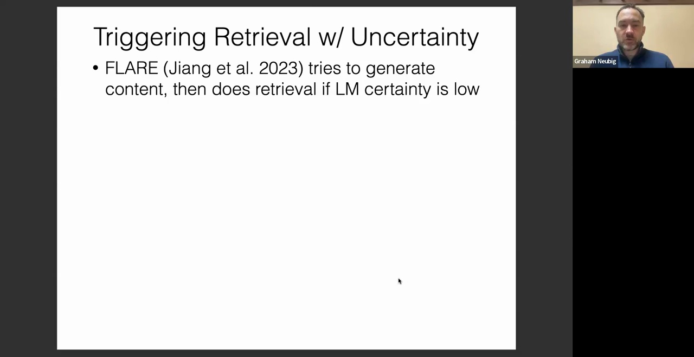
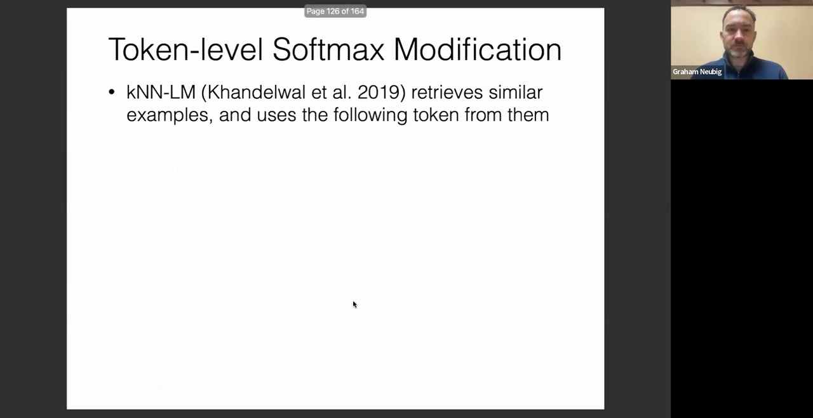
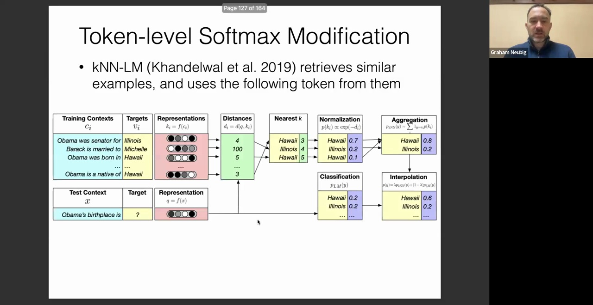
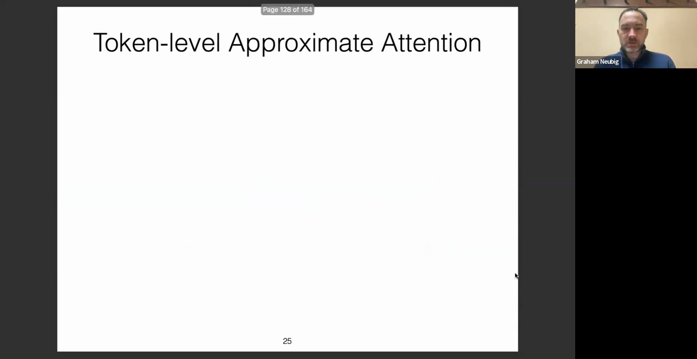
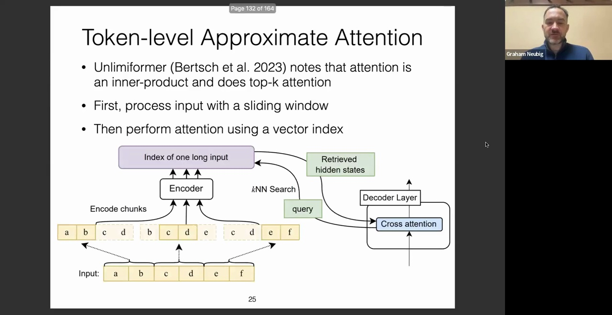
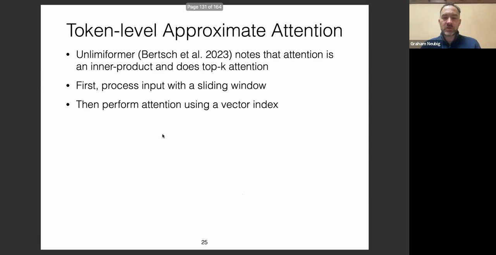
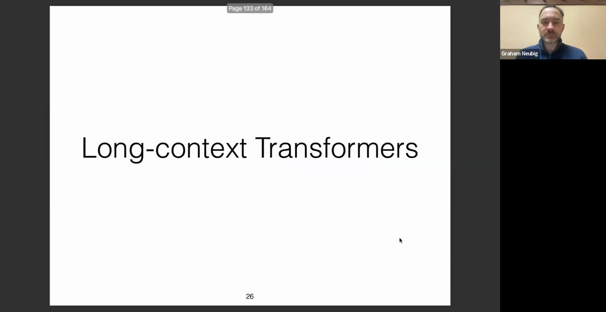
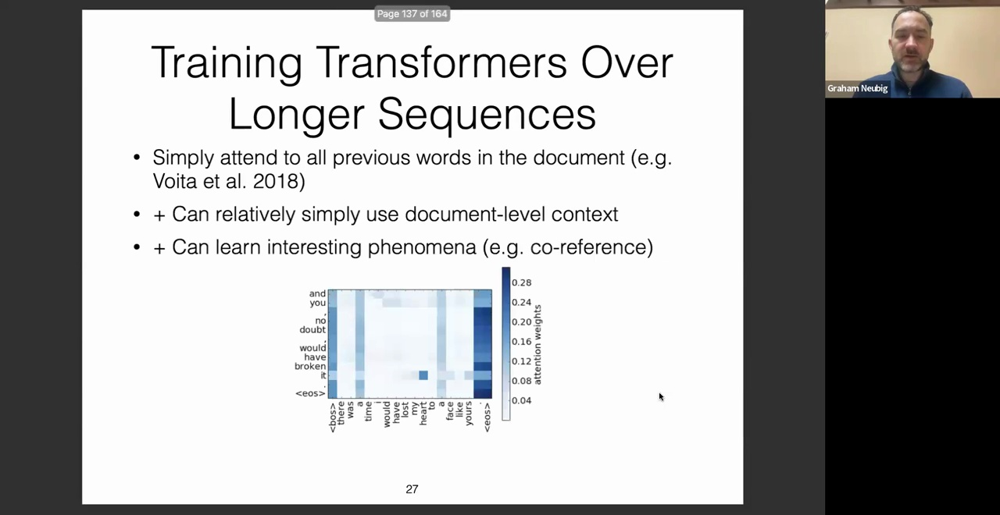
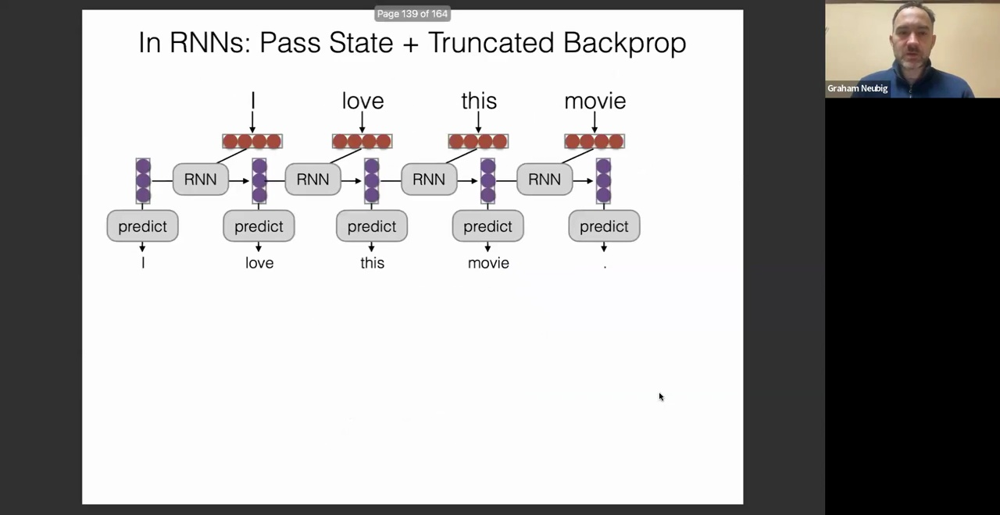
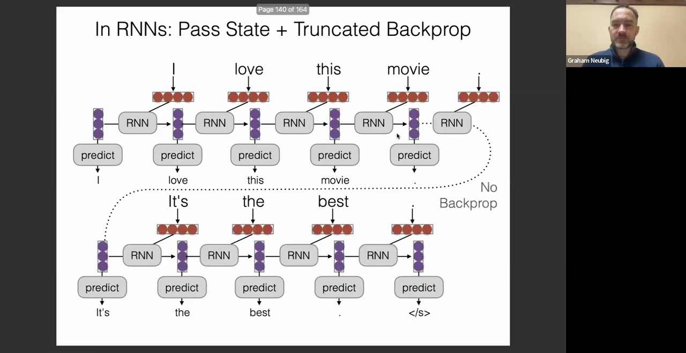

## 不确定性驱动(Uncertainty-Driven)的检索策略
下图展示了该机制的工作原理。假设系统已检索到若干相关文档，例如要求生成关于乔·拜登(Joe Biden)的摘要。在生成首个词元时，若语言模型输出的置信度(Confidence)较高，则直接生成该词元，无需触发检索。

然而在后续生成步骤中，模型可能输出类似“乔·拜登毕业于宾夕法尼亚大学法学院”的内容。若模型对该部分内容的预测概率较低（即置信度不足），系统将自动构建检索查询：具体而言，将低置信度部分进行掩码(Mask)处理，并执行外部搜索。该机制与假设文档嵌入(Hypothetical Document Embeddings, HyDE)思路相近，即通过构造与目标文档高度相似的查询文本来获取检索结果，随后基于检索结果继续生成。该过程循环进行：当模型输出高置信度内容时，直接依赖内部参数生成；一旦出现低置信度词元，则触发检索并融合外部知识。我认为这是一种极具潜力的架构。其主要缺点在于可能增加计算延迟：系统需先生成初步输出以识别低置信度片段，再进行二次生成。但若对输出质量有极高要求，这种权衡是完全合理的。

## 基于 kNN-LM 的逐词元检索(Token-by-Token Retrieval)
接下来，我们探讨逐词元检索方法。在该方向上，最具代表性的开创性工作之一是 kNN-LM(k-Nearest Neighbor Language Model)。

其核心原理是检索相似的上下文示例，并利用这些示例中的后续词元进行预测。这在某种程度上可视为一种极其强大的基于计数的词对模型(Bigram Model)。回顾传统的词对模型：其通过统计前序词元的共现频率，计算条件概率分布。kNN-LM 的工作流程如下：给定当前文本上下文 $x$ 及目标输出，系统首先遍历训练数据中的所有历史上下文。通过提取模型倒数第二层(或最后一层)的隐藏表示(Hidden Representation)，将这些训练上下文编码为向量，并记录每个上下文对应的后续词元，从而构建一个“上下文向量-后续词元”键值对数据库。在推理阶段，计算当前上下文的向量表示与数据库中所有历史上下文的距离，检索出最近的 $K$ 个邻居(Nearest Neighbors)。例如，检索到的前 $K$ 个示例的后续词元可能包含多个“Hawaii”和“Illinois”。随后，基于距离度量进行归一化(Normalization)，得到候选词元的概率分布。若同一词元多次出现，则聚合其概率（如 Hawaii 累计概率为 0.8，Illinois 为 0.2）。最后，引入插值系数 $\lambda$，将该检索概率与原始语言模型(Language Model)的参数化概率进行线性插值(Linear Interpolation)，得出最终的预测概率。

该方法的优势在于，模型输出显式地依赖于具体训练实例，从而显著优化概率分布，有效改善机器翻译(Machine Translation)及其他生成任务的质量。然而，其缺点是为推理管线引入了额外的非参数组件，并新增了如插值系数 $\lambda$ 等超参数(Hyperparameter)。这在一定程度上增加了系统复杂度与调参成本，且并非在所有应用场景中都能带来收益。

## 基于 Llamaformer 的注意力检索(Attention-based Retrieval)
另一种创新架构是 Llamaformer，该方法由本课程此前讲解生成模型的 Manapurch 等人提出。Llamaformer 的核心洞察在于：自注意力机制(Self-Attention Mechanism)本质上可视为一种内积搜索(Inner Product Search)。基于此，该模型引入了 Top-K 注意力(Top-K Attention)策略。具体实现上，系统首先通过滑动窗口(Sliding Window)处理输入序列，随后利用向量索引(Vector Index)加速注意力计算。面对超长输入时，模型采用分块编码(Chunk-based Encoding)策略：例如依次编码 AB、CD、EF 等文本块，并将各块的隐藏状态拼接，构建出长序列的全局索引。该思路与 kNN-LM 有相似之处，均涉及向量索引的构建。但关键差异在于：Llamaformer 直接对注意力机制中的值向量(Values)进行操作，而非仅作用于模型的最终输出层。

值得注意的是，构建该长序列索引后，在执行下一轮注意力计算时，系统将基于查询向量(Query Vector)发起 kNN 搜索，检索出匹配的隐藏状态(Hidden States)，并直接在这些状态上计算注意力权重。该架构的一大优势在于其理论上的完备性：在理想边界条件下，它无需修改模型结构。例如，若输入序列极短，仅需单块编码；且若对块内所有嵌入执行精确的 kNN 搜索，则该机制将严格退化为标准的全局注意力机制。然而，实际部署中不可避免地引入了近似计算(Approximation)：一方面，分块独立编码可能损失跨块的上下文交互信息；另一方面，系统会动态截断内积得分较低的注意力项以降低计算开销。尽管存在近似误差，但在无近似假设下该模型与原架构完全等价。经验表明，该方法在处理长距离依赖(Long-Range Dependencies)时表现优异。未来通过优化近似策略，其性能仍有巨大提升空间。总体而言，这是一项极具学术价值与工程潜力的研究方向。

## 长上下文 Transformer(Long-Context Transformer) 与循环神经网络(RNN)的对比
最后，我们将探讨长上下文 Transformer。此类模型经过专项训练，旨在高效捕捉超长文本中的依赖关系。构建长上下文模型最直观的方法是将文本序列直接拼接。事实上，在 Transformer 架构提出不久后，Voita 等人的研究便证实，该策略能使模型自发学习文档级(Document-level)语言现象。例如，模型可准确执行共指消解(Coreference Resolution)，即识别不同词元是否指向同一实体，并掌握其他复杂的篇章级语义关联。

然而，Transformer 架构的固有缺陷在于其计算复杂度(Computational Complexity)与序列长度呈二次方关系($O(N^2)$)。这是由于自注意力机制需计算所有查询向量(Query Vectors)与键向量(Key Vectors)的点积矩阵。当序列长度急剧增加时，该操作将引发严重的计算与内存瓶颈。

相比之下，课程初期介绍的循环神经网络(Recurrent Neural Network, RNN)则不存在该问题，因其计算复杂度与序列长度呈线性关系($O(N)$)。RNN 仅需在时间步(Time Step)间递归传递隐藏状态，并执行恒定的状态更新操作，从而彻底避免了二次方计算开销。此外，在 RNN 的前向传播(Forward Propagation)过程中，理论上可无限延展序列：系统只需计算并保留当前隐藏状态，即可安全释放历史计算图(Computational Graph)所占用的内存。该过程完全精确，无需任何近似处理。因此，与前述需引入近似策略的 Llamaformer 不同，RNN 在长序列推理中具有天然优势。然而，RNN 在反向传播(Backpropagation)阶段面临严峻挑战，因为……
