## 截断反向传播(Truncated Backpropagation)与序列模型的局限性
因为在进行反向传播(Backpropagation)时，通常需要维护完整计算图(Computational Graph)的状态。解决此问题的常用策略是：仅传递前一序列片段的循环神经网络(Recurrent Neural Network, RNN)隐藏状态，而切断对其历史片段的梯度回传。该机制被称为截断反向传播(Truncated Backpropagation)或随时间截断的反向传播(Truncated Backpropagation Through Time, TBPTT)。
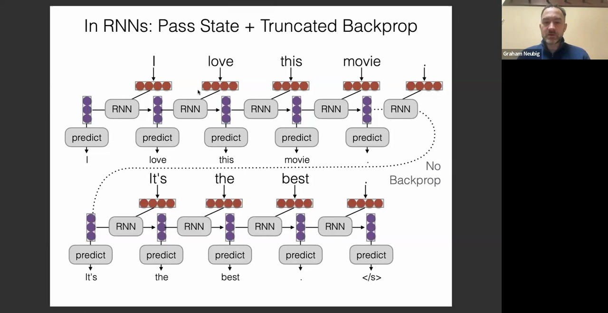
这使得我们原则上能够训练支持极长（乃至理论上无限）上下文的模型，即便不向历史片段回传梯度。当然，在长上下文应用场景中，该方法仍面临挑战：受限于严格的时序依赖(Temporal Dependency)，传统 RNN 的串行计算特性导致其运行效率较低，难以在 GPU 等硬件上实现高效并行。近期涌现的 Mamba 与 RWKV 等架构则有效克服了这一瓶颈，它们在保持线性时间复杂度(Linear Time Complexity)的同时，高度适配 GPU 并行训练。我将在后续课程中对此展开深入探讨。

## Transformer-XL 与滑动窗口注意力(Sliding Window Attention)机制
实际上，将随时间截断反向传播的思想迁移至 Transformer 架构同样可行。一篇极具影响力的论文提出了 Transformer-XL，该工作由曾在卡内基梅隆大学(CMU)任教的戴志航(Zihang Dai)等人主导完成。
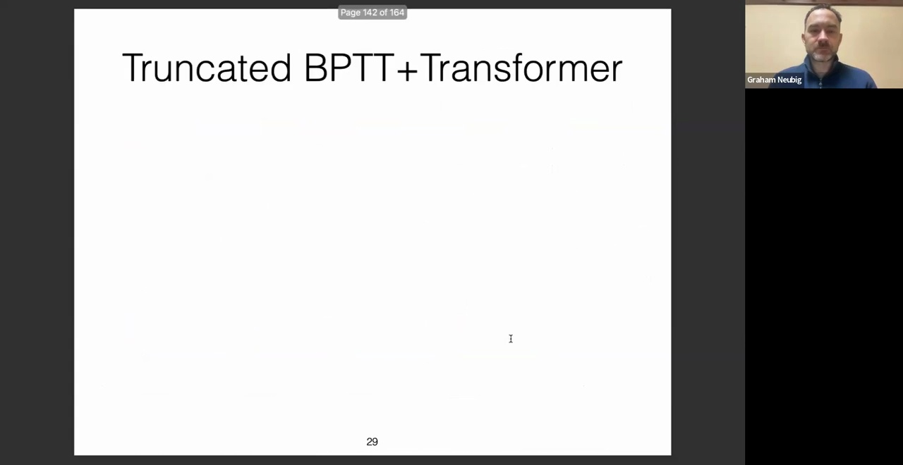
其核心机制是缓存(Cache)历史片段的隐藏状态。在标准 Transformer 中，自注意力(Self-Attention)仅作用于当前上下文内的词元。而 Transformer-XL 的创新在于：当输入新的文本片段时，模型不仅关注当前片段，还会将前一片段的隐藏状态作为扩展上下文进行注意力计算，但梯度仅在当前片段内传播，不更新历史状态。这本质上实现了 Transformer 架构下的随时间截断反向传播。该设计极为巧妙，使模型能够跨越多层网络追溯更早的信息。具体而言，顶层网络可直接关注前一上下文窗口；而底层网络通过状态传递，其感受野(Receptive Field)可覆盖更早的历史窗口。逐层叠加后，有效上下文范围呈近似指数级增长，使模型得以高效建模超长序列。
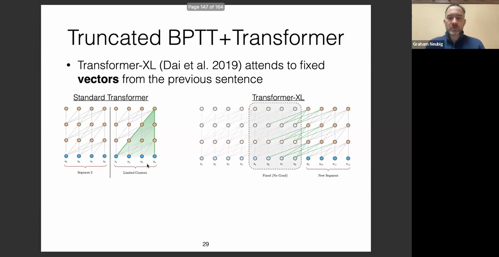
近年来广受瞩目的 Mistral 模型，其核心采用的滑动窗口注意力机制，在理念上与 Transformer-XL 一脉相承。由此可见，该类基于窗口与状态复用的策略至今仍在工业界系统中得到广泛应用。

## 稀疏 Transformer(Sparse Transformer)与压缩 Transformer(Compressive Transformer)
该领域的另一篇里程碑式论文提出了稀疏 Transformer。
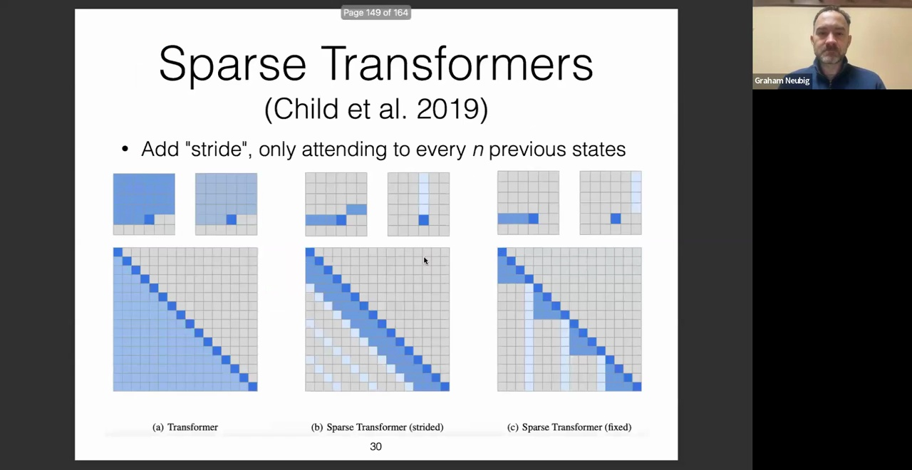
稀疏 Transformer 的核心原理是：摒弃全量注意力计算，转而采用稀疏连接模式，例如仅对局部邻近词元及固定步长(Strided)的远程词元进行注意力计算。这使其结构类似于步长卷积(Strided Convolutions)或特定设计的循环网络。具体而言，对于目标词元，模型会同时关注局部窗口内的所有词元，以及跨越历史片段的稀疏采样点。这种局部注意力(Local Attention)与全局注意力(Global Attention)的融合设计极为高效，仅需极小的计算复杂度增量，即可显著扩大模型的有效上下文跨度。

另一项理念相近但实现路径不同的工作称为压缩 Transformer。
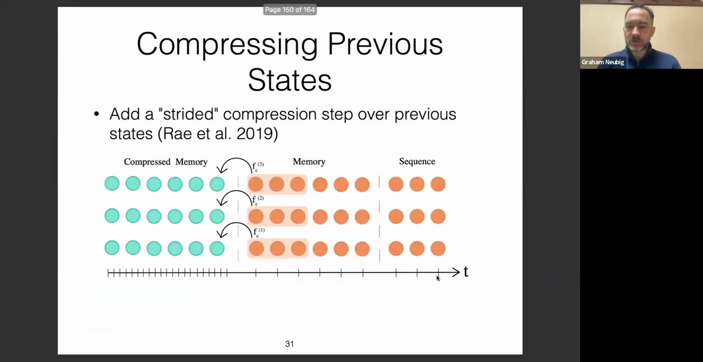
该架构同样维护局部记忆与长期压缩记忆(Compressed Memory)。其独特之处在于引入了显式的记忆压缩(Memory Compression)模块，通过辅助网络将历史激活状态压缩为紧凑的记忆向量。这种设计提供了更高的灵活性，允许模型动态提取并压缩局部上下文中的关键信息。该思路为长程建模提供了极具价值的参考方向。
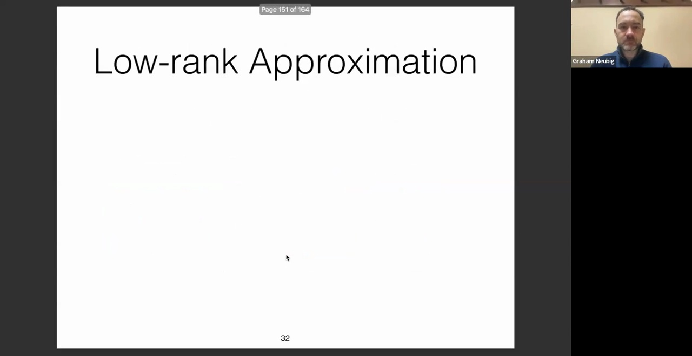

## 注意力机制的低秩近似(Low-Rank Approximation)
最后，我们探讨几类针对 Transformer 注意力机制的低秩近似方法。
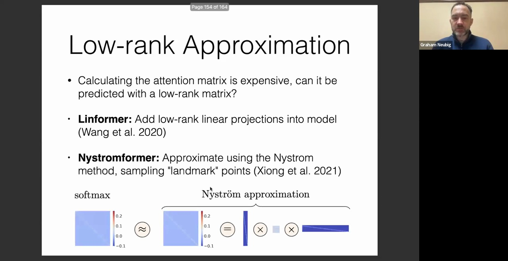
标准注意力矩阵的计算成本高昂，但其本质为矩阵运算，因此可采用低秩分解进行近似。目前已有多种实现路径：其一是线性 Transformer(Linear Transformer)，它通过引入特定的核函数映射(Feature Map)，将 Softmax 注意力转化为线性计算复杂度；其二是 Nyström Transformer，该方法基于 Nyström 近似法，通过采样锚点(Landmark Points)构建低秩注意力矩阵。核心思想在于：传统方法需对超长序列进行完整的 Softmax 归一化，而低秩近似技术（其思想与 LoRA 中的矩阵分解有异曲同工之妙）可利用低秩基底高效逼近 Softmax 运算结果。这使得模型在免除非线性全量计算的同时，仍能精准捕获注意力权重分布。
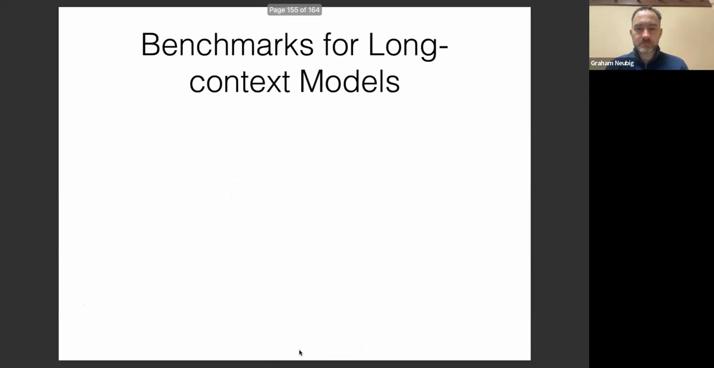

## 长上下文评估基准(Benchmarks)
课程主体内容已接近尾声。最后，我们来探讨长上下文模型的评估基准。目前业界已建立多个专用评测集。
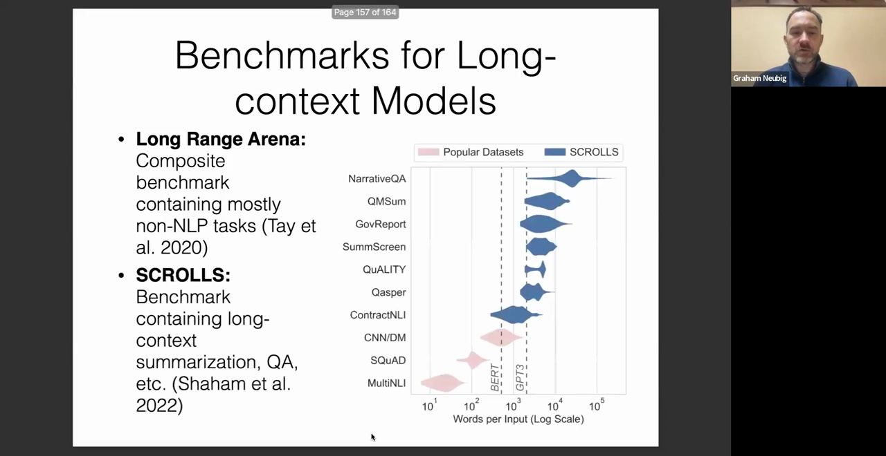
其中最为知名的当属 Long Range Arena(LRA)。该综合性基准主要涵盖非自然语言处理任务（如图像分类、形式语言等）。尽管它被广泛用于长序列建模评估，但其在 LRA 上的表现往往与实际长程语言建模任务的相关性有限。因此，我更为推荐 SCROLLS 基准。该数据集专门针对自然语言处理设计，整合了大量依赖极长上下文的问答与摘要任务，涵盖小说文本、学术专著、政府报告等真实语料。若你致力于长上下文模型的研究，SCROLLS 将是极具参考价值的评测平台。
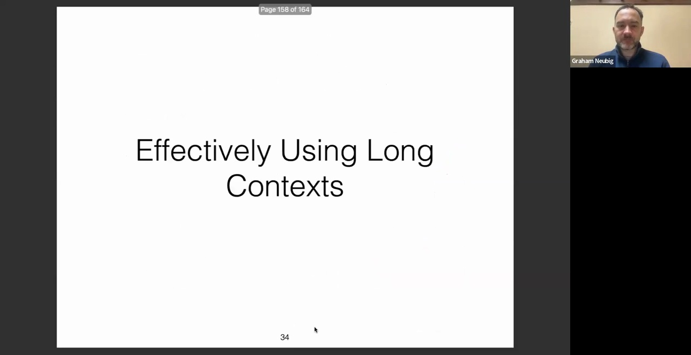

## “中间迷失”(Lost in the Middle)现象与上下文过滤(Context Filtering)
最后，我想抛出一个关键问题：当前我们已具备强大的检索器(Retriever)与阅读器(Reader)，甚至拥有了能够有效处理极长上下文的生成模型。那么，在实际系统中，我们应如何高效协同并利用这些组件？
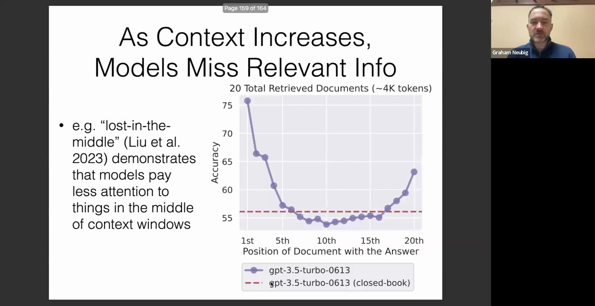
斯坦福大学 Nelson Liu 等人的研究揭示了一个名为“中间迷失”的关键现象。实验表明，多数主流模型（含最先进架构）均存在显著的位置偏置(Positional Bias)，对长上下文窗口中段内容的注意力权重较低。若将关键信息置于输入序列的开头或末尾，模型往往能准确捕获；而置于中部时，信息则极易被忽略，即“迷失于中间”。在检索增强生成(RAG)场景中，若仅将高相关度文档置顶，此问题尚可缓解；但若直接拼接大量检索结果，或要求模型在不依赖显式排序的情况下综合极长文档，该缺陷将严重制约性能。加之检索器本身存在召回误差，模型必须具备更强的长文本容错与信息提取能力。

为此，学界与工业界提出了多种优化策略以确保上下文的高效利用。直观而言，升级检索器可提升召回质量；引入重排序(Re-ranking)模块能精准筛选高相关片段；此外，针对阅读器架构的专项优化亦是常见路径。
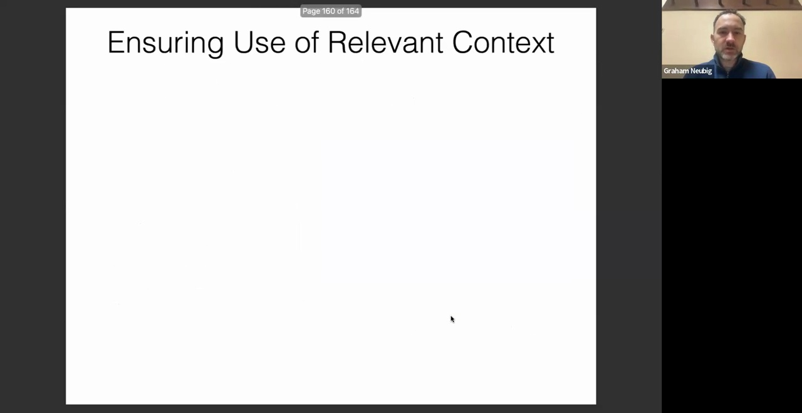
另一方面，亦可通过上下文过滤机制动态决定信息的取舍。我们近期提出了一种名为 FILCo 的架构，专门用于段落过滤与精准检索。该模型能够自动剔除冗余噪声，仅保留与查询高度契合的核心上下文。经 FILCo 预处理后的精炼文本输入至生成器，可显著提升最终输出质量。
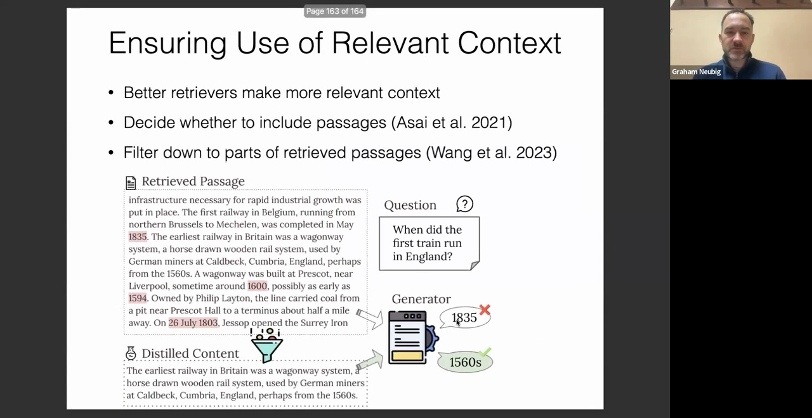
以上即为本次讲座的全部内容。
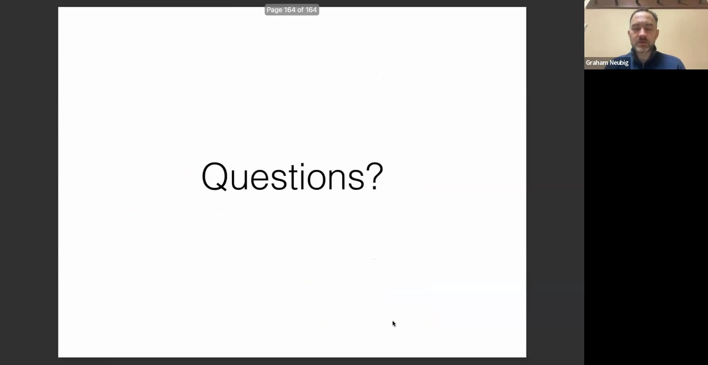