## 自然语言处理(NLP)部署与推理(Inference)成本简介

讲座首先探讨了当前自然语言处理(NLP)模型的现状，这些模型如今已实现大规模部署。尽管业界普遍认知到训练大型深度网络(Deep Networks)成本高昂且高度依赖图形处理器(GPU, Graphics Processing Unit)资源，但一个关键方面却常被忽视：推理(Inference)成本。 

模型训练完成后，将其部署并为用户生成预测的成本，实际上甚至高于初始训练成本。分析表明，在模型投入使用后的短短一周内，其累计运营成本就可能超过一次性训练费用。若模型在数月或数年内被海量用户持续调用，其推理成本将远超初始投资。

这一高昂的资金门槛直接阻碍了让人工智能(Artificial Intelligence, AI)系统惠及更广泛、更多样化受众（包括计算资源有限的群体）的目标。随着模型规模持续扩大的趋势，模型架构通常扩展至数十亿(Billions)乃至更多参数，这导致其服务成本天然居高不下，进一步加剧了该挑战。

## 核心问题与模型压缩(Model Compression)策略
本讲座的核心目标是解决一项根本性挑战：如何在不牺牲性能(Performance)的前提下，以低成本、高效率且公平的方式部署NLP系统？明确的解决路径是模型压缩(Model Compression)，即在部署前对已充分训练的模型进行体积缩减。 

实现这一目标主要有三种高级技术：
* **量化(Quantization)：** 保持模型架构不变，将模型参数的数值精度降低至特定位数，实质上舍弃了多余的精度信息。
* **剪枝(Pruning)：** 从模型中直接移除冗余参数或整个网络组件。
* **蒸馏(Distillation)：** 将大型模型（教师模型(Teacher Model)）的知识迁移并压缩至较小的架构（学生模型(Student Model)）中，该小模型通常需经过重新训练以拟合原始模型的行为。

## 压缩为何有效：过参数化(Overparameterization)理论
模型压缩的优势看似显而易见，但这自然引出了两个问题：为何不一开始就训练一个小型模型？以及，在不降低准确率(Accuracy)的前提下，如何能够安全地丢弃大模型的部分参数？答案在于“过参数化(Overparameterization)”这一概念。

过参数化(Overparameterization)指的是模型所包含的参数数量远超传统统计机器学习(Statistical Machine Learning)理论所认为的必要水平，例如拥有1750亿参数的GPT-3。机器学习理论表明，这类高度参数化的模型在优化过程中实际上更容易训练。 

训练深度神经网络(Deep Neural Networks)涉及优化一个非凸目标函数(Non-convex Objective Function)，该过程无法保证找到全局最优解(Global Optimum)。充足的参数使得优化算法能够有效绕过鞍点(Saddle Points)和次优的局部极小值(Local Minima)，从而在复杂的优化地形(Optimization Landscape)中更顺利地收敛。最终，这些冗余参数在训练阶段发挥了关键作用，但在推理阶段并非绝对必需，这使得训练后的模型压缩极为有效。

## 量化(Quantization)与显存(VRAM)优化
首先探讨的技术是训练后量化(Post-training Quantization)。在模型以满精度(Full Precision)训练完成后，系统性地降低其权重(Weights)的数值精度。例如，以标准的32位浮点数(FP32)精度加载像Llama 2这样拥有700亿参数的模型，大约需要260 GB的GPU显存(VRAM)，这超出了大多数商用单卡GPU的容量上限。

随着权重精度的降低，显存需求呈线性下降。在极端情况下，使用1位(1-bit)二进制表示替换32位浮点数，可将模型体积压缩至约8 GB，使其能够在标准消费级硬件上部署。这为大幅降低模型服务成本提供了极具吸引力的解决方案。

## 浮点数表示与精度限制
为深入理解量化的技术基础，有必要简要回顾计算机系统中的数值表示方法。神经网络传统上采用IEEE 754标准浮点数(IEEE 754 Floating-Point)来表示权重，以适应广泛的动态范围(Dynamic Range)。一个标准浮点数由三部分组成：符号位(Sign Bit，表示正负)、尾数(Mantissa，决定数值精度与有效范围)以及指数(Exponent，用于缩放数量级)。

以Float16(FP16)为例，它为尾数分配了10位，为指数分配了5位。尽管FP16被广泛使用，但其精度通常不足以支撑复杂神经网络的完整训练。在处理优化过程中自然产生的极小或极大梯度(Gradients)值时，其受限的动态范围极易引发数值下溢(Underflow)或上溢(Overflow)问题，因此需要采用更稳健的数据类型(Data Types)解决方案。

---

## 面向机器学习的高级浮点数格式
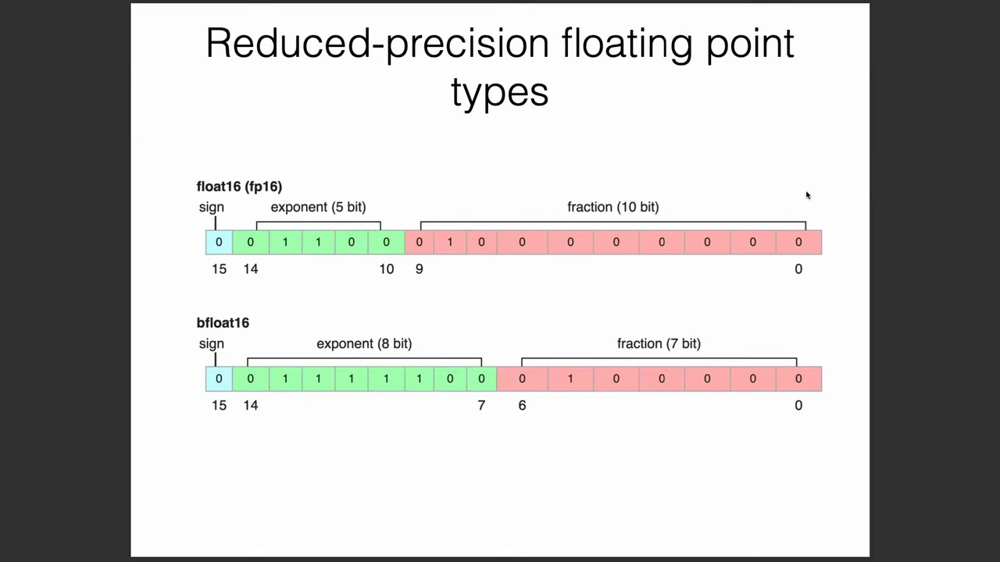
为解决神经网络训练(Neural Network Training)中常见的数值下溢(Underflow)与上溢(Overflow)问题，业界专门开发了诸如BFloat16等面向机器学习(Machine Learning)的专用浮点数格式。该格式通过将尾数(Mantissa)的比特位重新分配给指数(Exponent)，以牺牲少量精度为代价，换取了显著扩大的动态范围(Dynamic Range)。这种权衡(Trade-off)能有效处理优化过程中出现的极大或极小梯度(Gradient)值，使其成为深度学习(Deep Learning)工作负载中极为实用的数据类型，尽管其能表示的唯一数值总数相对较少。

## 整数量化与绝对最大值（Abs Max）方法
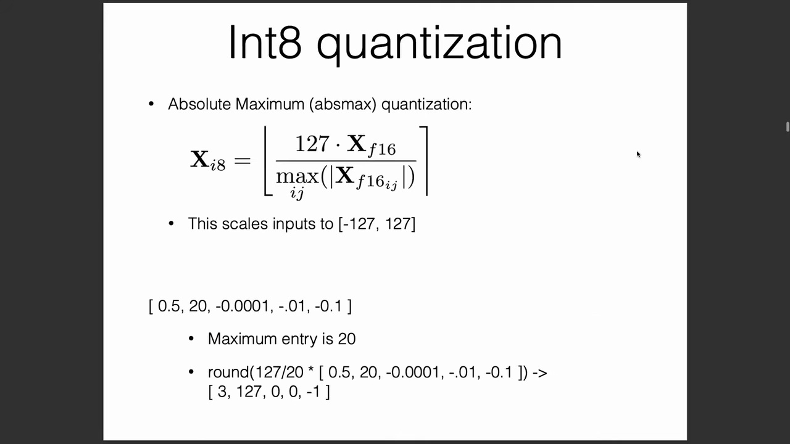
为大幅降低模型的显存(VRAM)占用，业界流行的一种方法是将浮点权重(Floating-point Weights)量化为整数(Integer)。实现此目标的一项基础技术是绝对最大值(Abs Max)量化。该方法通过识别浮点数序列中绝对值最大的元素，将其线性映射至目标整数范围的最大值（例如，在8位整数(INT8)中映射为127）。 
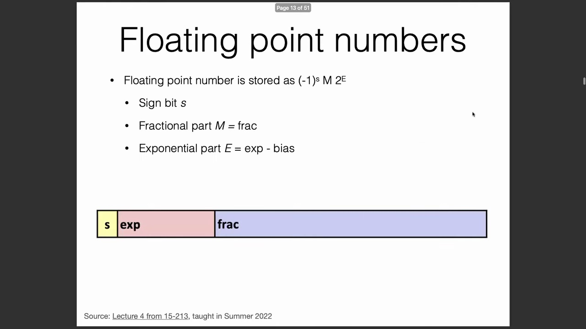
随后，其余所有权重按相同比例缩放，并四舍五入(Rounding)至最邻近的整数。例如，若数据集中的最大浮点值为20，则映射为127；值为0.5的权重（即20的1/40）将映射为约3（即127的1/40）。这种线性缩放(Linear Scaling)机制使得连续的浮点参数能够高效、紧凑地存储为离散整数(Discrete Integers)。

## 朴素二值量化的陷阱
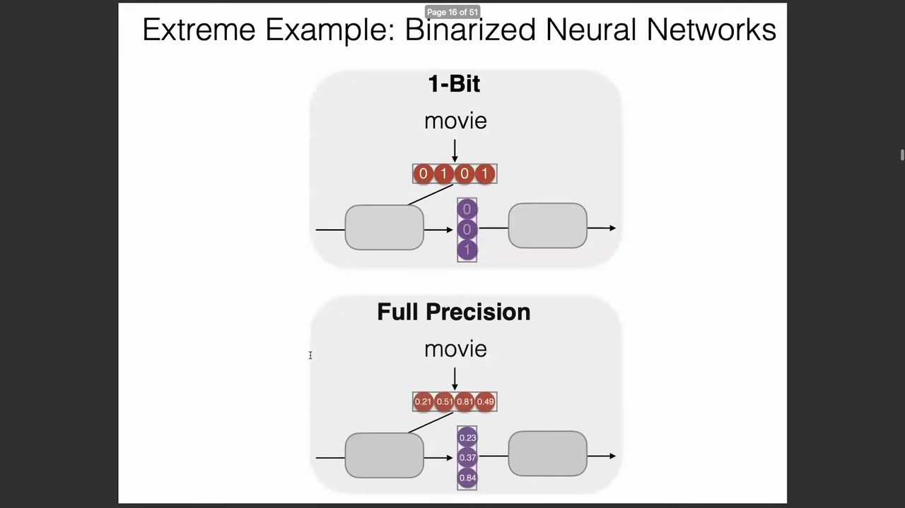
尽管极致量化(Extreme Quantization)（例如将每个参数压缩至1比特(Bit)，即0或1）在最小化存储开销方面极具吸引力，但其在推理(Inference)阶段往往会导致灾难性失效。若简单地将高精度(High-precision)的隐藏状态(Hidden States)与激活值(Activations)直接舍入为二值，将严重破坏模型的关键表征能力(Representational Capacity)。
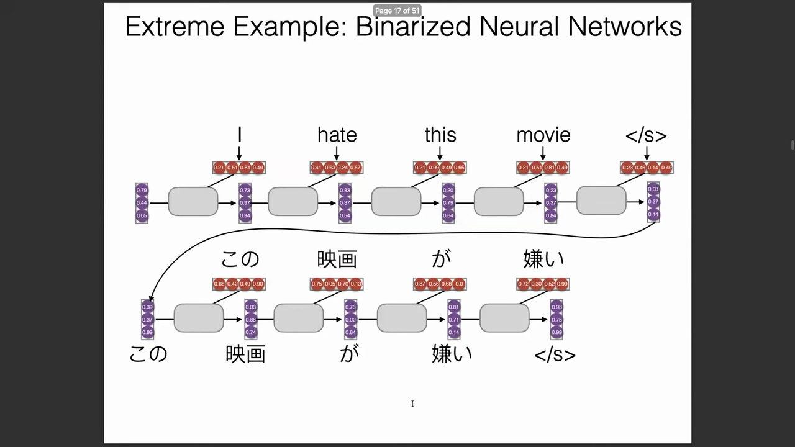
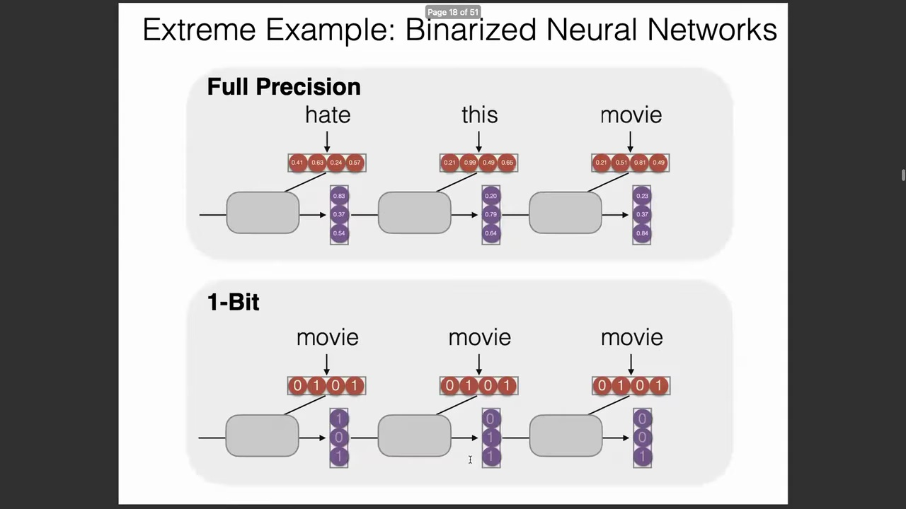
在机器翻译(Machine Translation)等实际应用场景中，原本在高维空间(High-dimensional Space)中位置迥异、特征鲜明的浮点嵌入向量(Embedding Vectors)，在经过朴素舍入(Naive Rounding)后可能坍缩(Collapse)为完全相同的二值序列。这种区分度(Discriminative Power)的丧失会严重损害模型性能，这表明若不引入更复杂的量化策略，直接应用训练后二值量化(Post-training Binary Quantization)是无效的。

## 模型感知量化与异常值管理
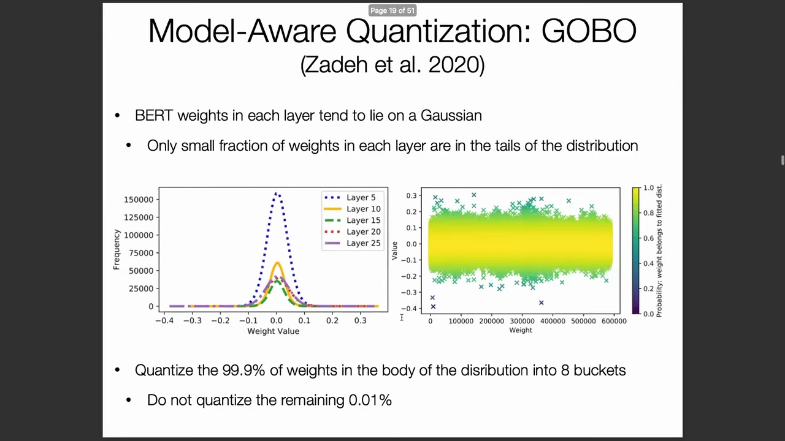
为克服均匀缩放(Uniform Scaling)的局限性，模型感知量化(Model-aware Quantization)技术会深入分析模型每一层(Layer)内权重的统计分布(Statistical Distribution)。在BERT等架构中，权重通常遵循高斯分布(Gaussian Distribution)，紧密聚集在均值(Mean)附近，仅有极少数异常值(Outliers)分布在统计分布的尾部(Tails)。若直接应用标准的Abs Max量化，这些极端异常值会迫使量化范围(Quantization Range)过度扩张，导致绝大多数密集分布的权重被映射至相同的整数区间(Integer Bins)，从而丧失区分度。更优的策略是将这些异常值剥离并保留其全精度(Full Precision)，同时将主体权重量化至低精度(Low-precision)空间。该策略在保留关键语义信息的同时，依然实现了显著的显存压缩。

## 细粒度量化：LLM.int8()
基于异常值管理(Outlier Management)理念，LLM.int8() 等方法突破了传统的均匀逐层量化(Layer-wise Quantization)范式，将这一概念推向深入。LLM.int8() 不再为整个网络层应用单一的缩放因子(Scaling Factor)，而是针对权重矩阵(Weight Matrix)的每一行或每一列独立执行量化操作。这种细粒度量化(Fine-grained Quantization)方法与Transformer架构完美契合，因为Transformer中的核心运算均涉及矩阵乘法(Matrix Multiplication)，从而允许为每个计算向量(Computational Vector)动态设定更精确的数值范围(Numerical Range)。此外，随着网络层数加深，模型会自然累积更多高幅值(High-magnitude)的异常值，这使得逐向量量化(Vector-wise Quantization)成为维持模型精度的关键。尽管该方法会在推理阶段引入轻微的反量化(Dequantization)开销（计算时需将整数临时转换回浮点数），但这种权衡(Trade-off)对大语言模型(LLMs)极为有利。它通常能使推理速度提升近一倍，并使加载原本会超出GPU显存(VRAM)上限的超大规模模型成为可能。
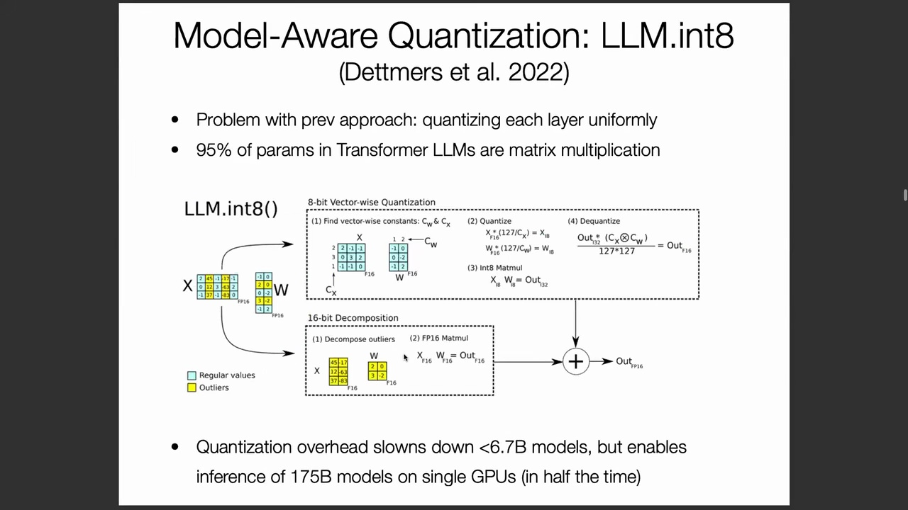

## 性能权衡与硬件限制
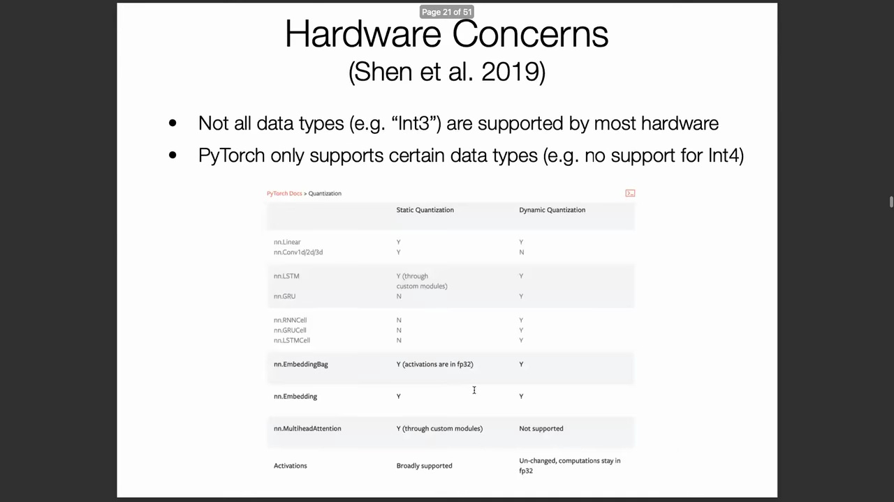
量化技术的实际落地效果在很大程度上受限于底层硬件(Hardware)与软件框架(Software Frameworks)（如PyTorch）的生态支持。尽管算法研究不断提出创新的位宽缩减(Bit-width Reduction)方案，但现代处理器极少原生支持非标准数据类型。例如，理论上极具效率的3位整数量化(3-bit Integer Quantization)在实际硬件中常被自动填充(Padding)至4位，从而完全抵消预期的计算加速或显存节省收益。因此，成功的模型部署策略必须严格对齐目标GPU架构及服务框架官方支持的特定量化指令集(Quantization Primitives)与数据类型。

---

## 硬件限制(Hardware Limitations)与框架兼容性(Framework Compatibility)
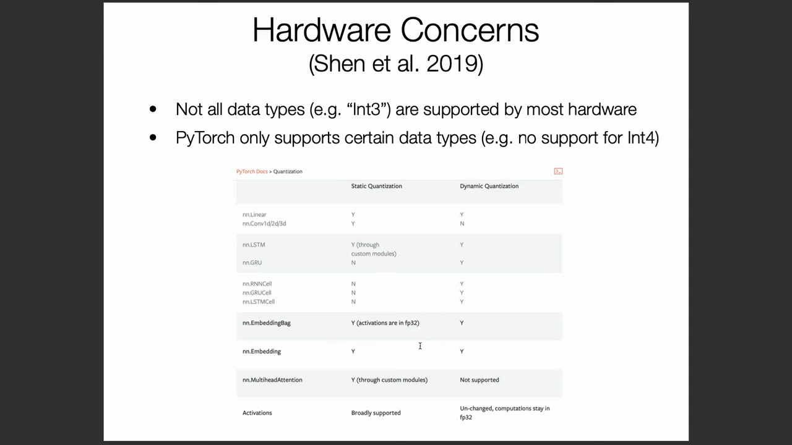
尽管量化(Quantization)在理论上能带来显著的显存(VRAM)节省与推理速度提升，但其实际落地严重受制于底层硬件(Hardware)与软件生态(Software Ecosystem)。许多处理器缺乏对非标准位宽(Bit-width)（如 3-bit 整数）的原生支持(Native Support)，导致计算时默认回退(Fallback)至 4-bit 处理，从而完全抵消了预期的加速收益。此外，PyTorch 等深度学习框架(Deep Learning Frameworks)对原生量化的支持参差不齐；部分网络架构（如循环神经网络(Recurrent Neural Networks, RNN)）或特定算子可能完全不支持量化操作。因此，算法工程师在生产环境(Production Environment)部署压缩模型前，必须严格验证 GPU 硬件能力、框架兼容性(Framework Compatibility)以及自定义加速器(Custom Accelerators)的特定要求。

## 量化感知训练(Quantization-Aware Training, QAT)与二值网络(Binary Networks)
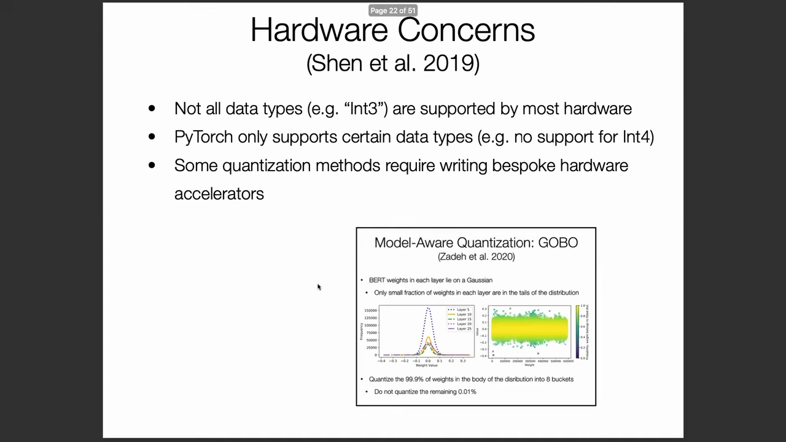
为缓解训练后量化(Post-training Quantization)固有的精度损失(Precision Loss)，量化感知训练(Quantization-Aware Training, QAT)将量化约束(Quantization Constraints)直接嵌入至训练循环(Training Loop)中。即便在极端二值化(Extreme Binarization)场景下（即所有权值(Weights)与激活值(Activations)被严格限制为 -1 或 1），该方法仍展现出显著成效。通过引入特定的梯度近似技术(Gradient Approximation Techniques)以处理反向传播(Backpropagation)过程中的离散梯度(Discrete Gradients)，研究证实完全二值化的网络同样能达到当时的最先进水平(State-of-the-Art, SOTA)。例如，在 CIFAR-10 数据集上实现了约 10% 的测试误差(Test Error)，有效匹配甚至超越了同期的全精度模型(Full-precision Models)。这一结果构成了强有力的概念验证(Proof of Concept)，表明在训练阶段充分纳入精度约束，能在大幅压缩模型体积的同时，完好保留其表征能力(Representational Capacity)。

## 用于量化的逐层蒸馏(Layer-wise Distillation)
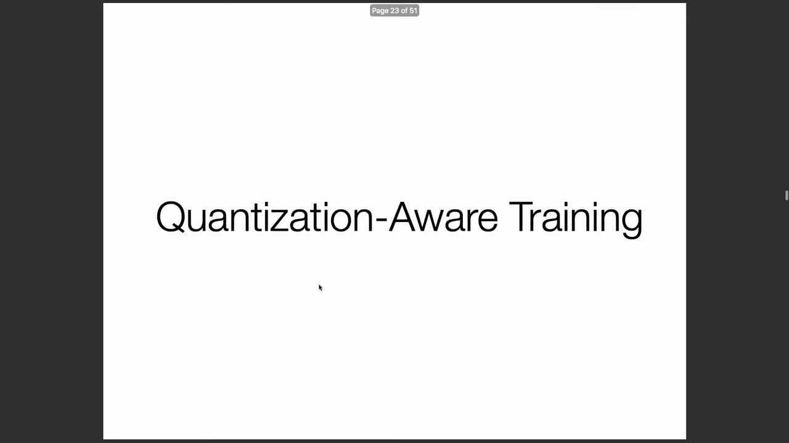
另一种先进的压缩策略是采用逐层顺序训练(Layer-by-Layer Sequential Training)的方式对量化模型进行优化，以拟合其全精度对应模型(Full-precision Counterpart)的行为。该方法不单纯依赖最终输出进行端到端优化(End-to-End Optimization)，而是直接提取原始模型各层的隐藏状态(Hidden States)与未归一化预测值(Logits)作为监督目标(Supervision Targets)。通过逐步将量化层的输出与完整模型精确的中间表示(Intermediate Representations)及数据流(Data Flow)对齐，这种逐层蒸馏技术能够有效捕获训练过程中可能丢失的细微特征，进而构建出更稳健、更精准的压缩模型架构。

## 现代参数高效量化(Parameter-Efficient Quantization)：QLoRA(Quantized Low-Rank Adaptation)
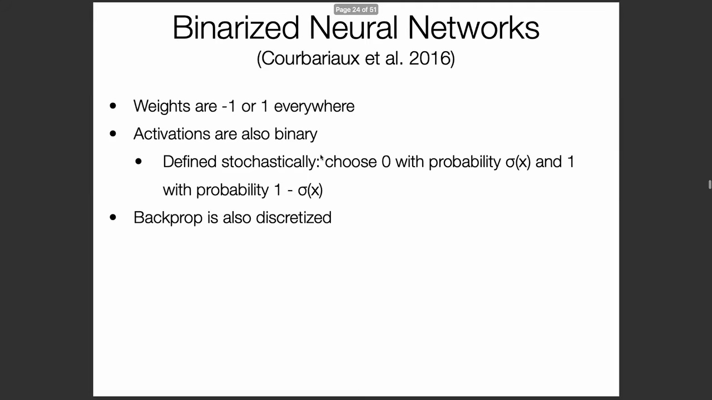
基于上述基础技术，QLoRA(Quantized Low-Rank Adaptation)等近期突破彻底革新了大型语言模型(Large Language Models, LLMs)的实际部署范式(Deployment Paradigm)。通过将参数高效微调(Parameter-Efficient Fine-Tuning, PEFT)技术与高度量化（通常为 4-bit）的基础模型(Base Model)相结合，QLoRA 使得在消费级硬件(Consumer-grade Hardware)上微调超大规模网络成为现实，且精度损失(Precision Loss)微乎其微。凭借其卓越的计算效率(Computational Efficiency)、极高的社区采纳率(Community Adoption Rate)以及稳健的经验性能(Empirical Performance)，QLoRA 已成为当前现代 NLP 应用中最受推荐且最具实用价值的量化微调方案之一。

## 模型剪枝(Model Pruning)简介
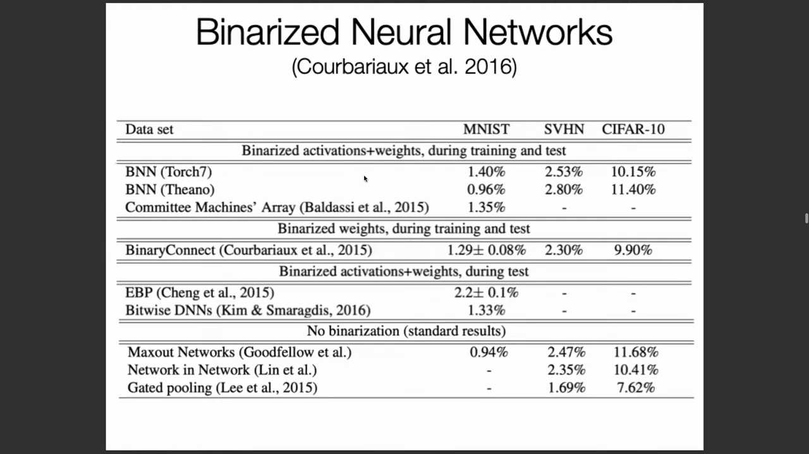
与量化不同，模型剪枝(Model Pruning)在模型压缩(Model Compression)领域采取了截然不同的技术路径。它并非均匀降低所有参数的数值精度，而是通过将特定权重精确置零(Zeroing out)来实现选择性剔除，其余参数则保持原始精度不变。最直观的策略是幅值剪枝(Magnitude Pruning)，即按照预设比例，将绝对值最小的权重直接置零。在机器翻译(Machine Translation)等领域的实证研究(Empirical Studies)表明，模型近半数的参数均可被安全剪除，且对下游任务性能(Downstream Performance)几乎无负面影响。这一现象进一步印证了深度神经网络(Deep Neural Networks)在训练阶段存在显著的过参数化(Overparameterization)特性，而在实际推理(Inference)阶段，维持模型功能所需的活跃权重(Active Weights)实际上远少于总参数量。

## 彩票假说(Lottery Ticket Hypothesis)
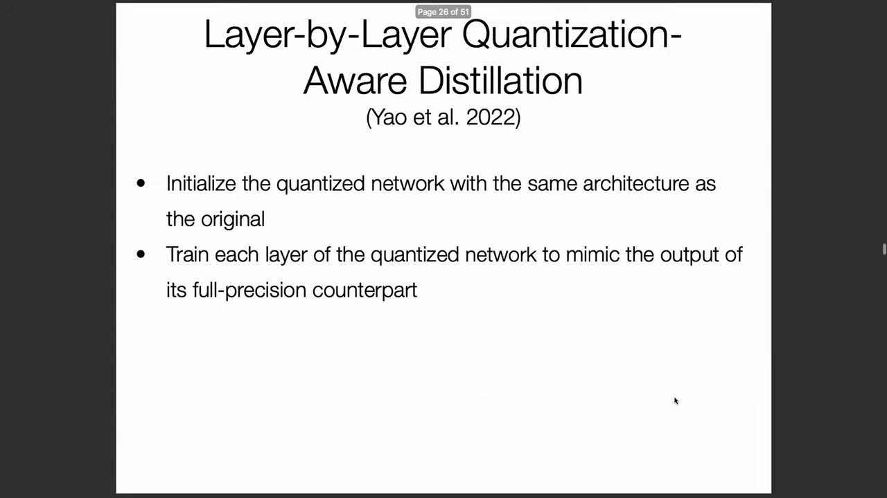
非结构化剪枝(Unstructured Pruning)与著名的“彩票假说(Lottery Ticket Hypothesis)”密切相关。该假说提出，在大型随机初始化(Random Initialization)的神经网络内部，天然隐藏着更适合优化过程(Optimization Process)的稀疏子网络(Sparse Subnetworks)（即所谓的“中奖彩票(Winning Lottery Ticket)”）。引人注目的是，当一个稠密模型(Dense Model)被剪枝至原始规模的一小部分（例如保留 20%），并恢复至其初始随机权重进行重新训练(Retraining)时，其最终性能有时反而能获得更优的泛化能力(Generalization Ability)，甚至超越原始未剪枝网络。尽管剪枝的核心目标在于提升计算效率与缩减模型体积，而非单纯追求精度超越，但策略性地识别并重训这些关键子网络充分表明：稠密模型往往包含大量非必要冗余，而定向的稀疏化(Sparsification)策略能够更有效地释放模型的表征潜力。

## 激活感知剪枝(Activation-aware Pruning)：Wanda 方法
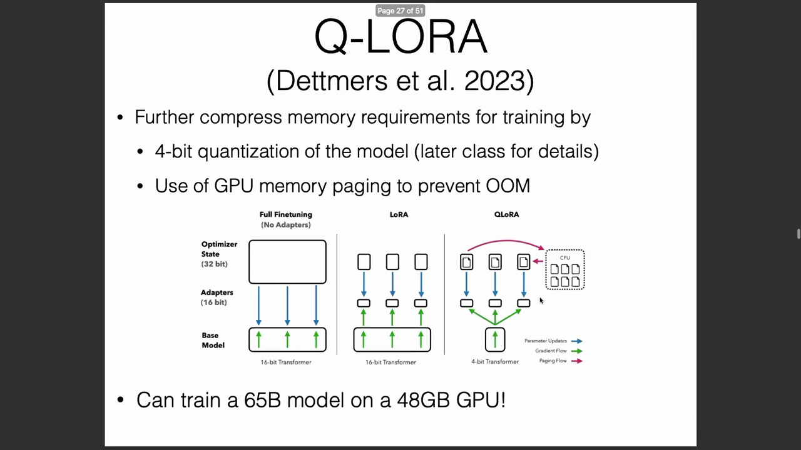
由卡内基梅隆大学(Carnegie Mellon University, CMU)近期提出的 Wanda(Weight and Activation)方法等研究，对传统基于幅值的剪枝(Magnitude-based Pruning)逻辑提出了有力挑战。传统方法通常假设权重(Weights)的重要性仅取决于其自身绝对值，却完全忽略了与之相乘的输入激活值(Input Activations)的幅值规模。 
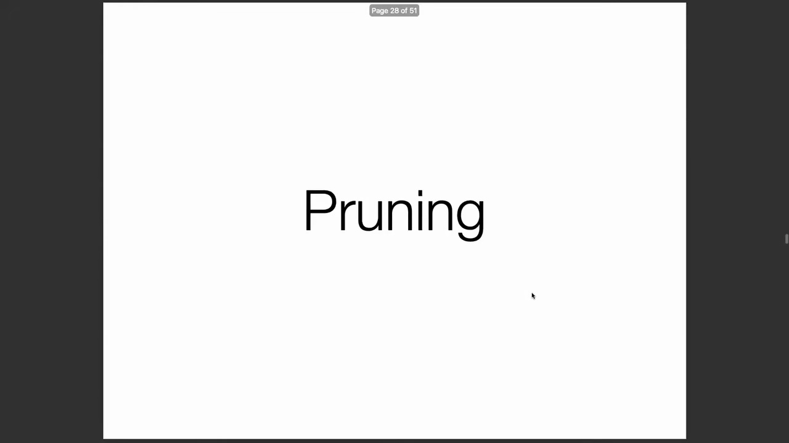
Wanda 算法通过将权重幅值(Weight Magnitude)与对应输入激活范数(Input Activation Norm)相乘，以此作为评估权重重要性(Weight Importance)的新指标，从而有效弥补了这一评估盲区。 
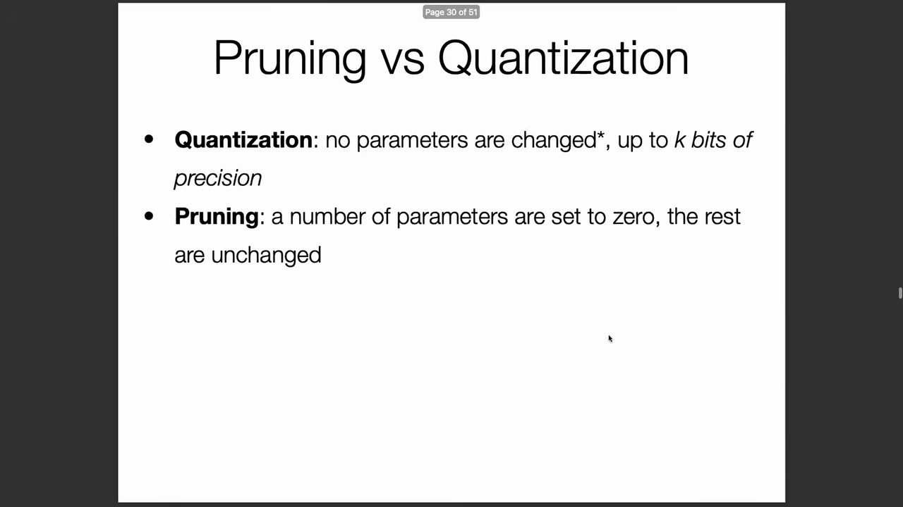
这种激活感知策略(Activation-aware Strategy)的核心洞察在于：连接至高活跃神经元(Highly Active Neurons)的小权重，其对最终输出的贡献往往远大于连接至休眠神经元(Dormant Neurons)的大权重。通过充分考量输入激活规模的系统性差异，Wanda 实现了更优的稀疏化效果，且完全免去了传统剪枝中为恢复模型精度而必须执行的、计算成本高昂的重训练(Retraining)过程。
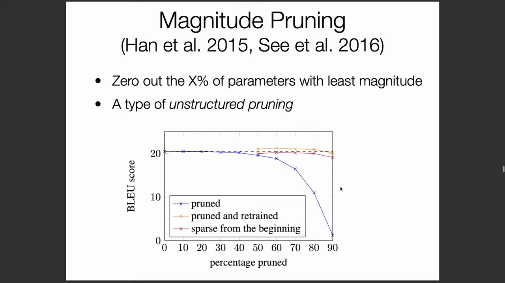
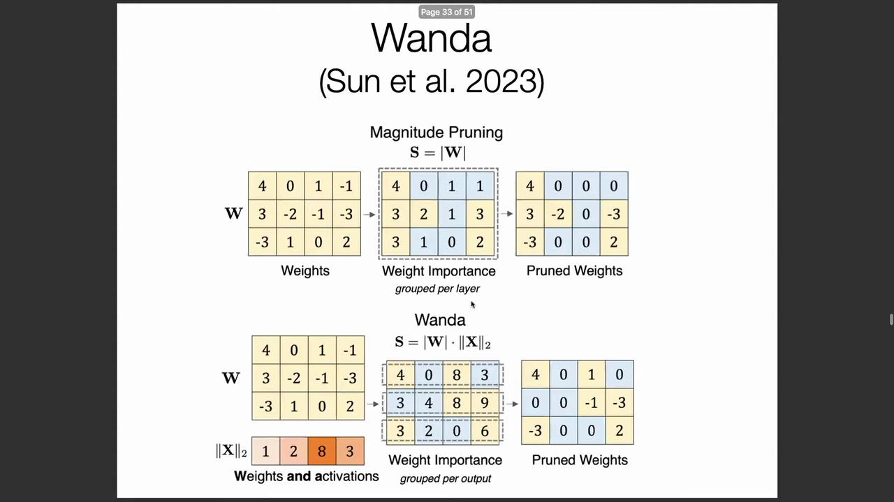

---

## 幅值剪枝(Magnitude Pruning)与 WANDA(Weights and Activation based pruning) 方法

考虑一个具有输入 $x$、$y$ 与权重 $a$、$b$ 的基础双参数模型。传统的幅值剪枝基于如下假设：若权重 $a$ 的幅值显著大于 $b$，则可直接将 $b$ 置零。在此前提下，模型假设幅值较大的权重主导输出，而幅值较小的权重属于冗余部分，因此模型可简化为 $a \times x$。然而，该方法忽略了输入激活值(Activation)的尺度。若输入 $y$ 的平均幅值显著大于 $x$（例如比例为 1000:1），较小的权重 $b$ 实际处理的输入数值更大，从而会对最终输出产生不成比例的巨大影响。这一缺陷催生了 **WANDA** 方法。该方法通过同时评估权重本身的幅值与流入该层的输入激活幅值，来优化剪枝决策。WANDA 利用校准数据(Calibration Data)估算平均输入幅值，从而更精准地识别出真正不重要的参数。

## 非结构化剪枝(Unstructured Pruning)的硬件局限性
尽管非结构化剪枝能够成功生成稀疏权重矩阵(Sparse Weight Matrix)，但其在实际部署中往往无法带来预期的推理加速。根本原因在于硬件支持不足：主流的机器学习加速器(Machine Learning Accelerator)与矩阵乘法库均针对密集计算(Dense Computation)进行了高度优化。若底层硬件不支持原生稀疏性计算，涉及零权重的运算仍会消耗与处理非零权重相同的时钟周期。因此，仅将分散的参数置零无法转化为实际的运行时加速收益。鉴于当前硬件生态难以高效处理稀疏数据结构，非结构化剪枝在很大程度上仍停留在理论层面，难以直接部署，这也凸显了开发硬件友好型替代方案的迫切需求。

## 结构化剪枝(Structured Pruning)：移除完整组件

为克服上述硬件效率瓶颈，**结构化剪枝**作为一种高效替代方案应运而生。该技术并非在模型中逐个剔除孤立权重，而是直接移除完整的架构组件，例如整个网络层或注意力头(Attention Head)。针对 BERT 与 Llama 等 Transformer 模型的研究表明，大量注意力头存在冗余；即便移除其中一半，通常也仅会导致可忽略的性能损失，同时却能立即降低推理延迟与内存占用。与非结构化剪枝不同，结构化剪枝以可预测且硬件友好的方式重塑模型架构。即使被移除的组件中包含高幅值权重，将其作为整体单元剔除仍能保证获得显著的推理加速，且无需依赖专用的稀疏计算硬件。

## 粗粒度掩码(Coarse-grained Mask)与细粒度掩码(Fine-grained Mask)策略

近期研究通过分层掩码框架(Hierarchical Masking Framework)将结构化剪枝进行了形式化定义。一种主流方案采用双层掩码系统：**粗粒度掩码**与**细粒度掩码**。粗粒度掩码作用于宏观组件（如整个自注意力层(Self-Attention Layer)或前馈网络(Feed-Forward Network)），这些组件可通过乘以单位矩阵(Identity Matrix)实现计算旁路。细粒度掩码则在更微观的层面运作，用于精确控制单个注意力头或动态缩减隐藏状态(Hidden State)的维度（例如将 512 维压缩至 200 维）。这种多层级粒度设计实现了对模型架构的精细控制。掩码参数通常利用预留的验证数据(Validation Data)进行优化学习，以确定在维持模型精度的前提下可安全禁用的组件。然而，此类基于梯度(Gradient-based)的优化计算成本极高，往往需要消耗与预训练原始模型相当的 GPU 显存与计算预算。

## 基于随机采样与回归的无梯度剪枝(Gradient-free Pruning)
鉴于基于梯度的掩码学习开销巨大，近期研究探索了完全无需反向传播(Backpropagation)的剪枝技术。该方法通过随机掩蔽(Random Masking)不同的网络模块，生成大量受扰动的模型变体。在评估这些变体的性能后，研究人员训练一个回归模型(Regression Model)来预测各独立模块对整体系统的贡献度。随后，所得的回归系数将直接指导剪枝过程，精准识别出可在极小性能损失下安全移除的模块。这种无梯度策略仅需前向推理的计算资源，而无需重新训练，使研究者能够对 Llama-70B 等超大规模模型实施剪枝，大幅降低了大模型压缩的门槛。

## 问答：阐明剪枝机制与搜索策略

在技术讨论环节，针对上述剪枝技术的实现细节与优化路径进行了深入澄清。对于自注意力头或前馈层等组件的结构化剪枝，其数学本质是将模块的计算路径乘以单位矩阵，从而实现计算过程的有效旁路。基于回归的剪枝方法专门致力于解决评估所有可能掩码配置时固有的组合爆炸(Combinatorial Explosion)难题。由于穷举测试所有子模块组合在计算上不可行，研究者采用随机采样(Random Sampling)探索搜索空间，并结合回归分析或贝叶斯优化(Bayesian Optimization)等高级算法，基于观测样本预测模块间的交互效应(Interaction Effects)。这种结构化探索策略在高效搜索与性能保留之间取得了平衡，确保无需穷举评估即可做出最优的剪枝决策。

---

## 彩票假说(Lottery Ticket Hypothesis)与权重初始化(Weight Initialization)
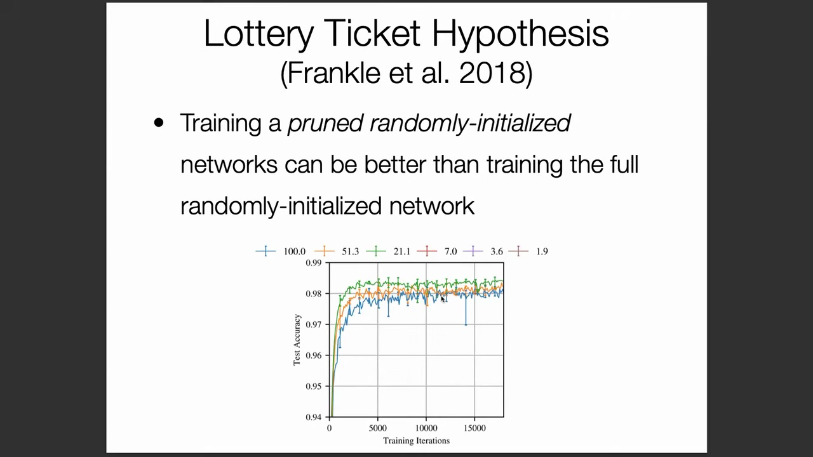
剪枝研究揭示了神经网络训练动态(Training Dynamics)中的一个反直觉现象。在模型充分训练后，研究人员可对其进行剪枝，以提取出一个高度有效的稀疏子网络(Sparse Subnetwork)。值得注意的是，若将该子网络的权重重置为其原始的随机初始化状态（即未经任何梯度更新前的状态），并从头开始重新训练，其最终性能往往优于直接使用训练后权重的版本。这一概念被称为“彩票假说”(Lottery Ticket Hypothesis)，它凸显了权重初始化与优化路径(Optimization Trajectory)在深度学习中的深远影响。该假说表明，模型训练的成功在很大程度上取决于能否“抽中”一组特定的初始权重组合，这些权重在初始状态下便天然具备学习目标任务的优势。

## 剪枝(Pruning)与 Dropout：机制与目标
尽管这两种技术均涉及屏蔽网络组件，但剪枝与 Dropout 基于截然不同的原理运作，且服务于不同的目标。Dropout 可被视为一种在每次优化步(Optimization Step)中动态执行的随机掩码机制。活跃的网络拓扑结构随训练步不断变化，其核心目标是正则化(Regularization)：防止神经元之间产生过度协同适应(Co-adaptation)，从而抑制过拟合(Overfitting)。相比之下，标准剪枝通常作为静态操作执行（往往仅在训练后或特定阶段进行一次），旨在永久剔除冗余参数。其目标纯粹由效率优化(Efficiency Optimization)驱动，致力于永久降低模型的计算开销(Computational Overhead)与内存占用(Memory Footprint)，而不改变模型原有的训练目标。

## 硬件现实：非结构化剪枝(Unstructured Pruning)与结构化剪枝(Structured Pruning)
若仅以参数量缩减比例来衡量压缩技术，像 WANDA 这类非结构化剪枝方法在纸面上似乎与结构化剪枝效果相当。然而，实际部署揭示了二者在推理效率上的显著差异。非结构化剪枝产生的零权重会零散分布于权重矩阵中，而现代硬件加速器(Hardware Accelerator)对此类稀疏模式的处理能力较差。由于标准的矩阵乘法库(Matrix Multiplication Library)已针对密集计算(Dense Computation)进行了底层优化，非结构化剪枝在实际应用中往往只能带来微乎其微、甚至为负的加速收益。
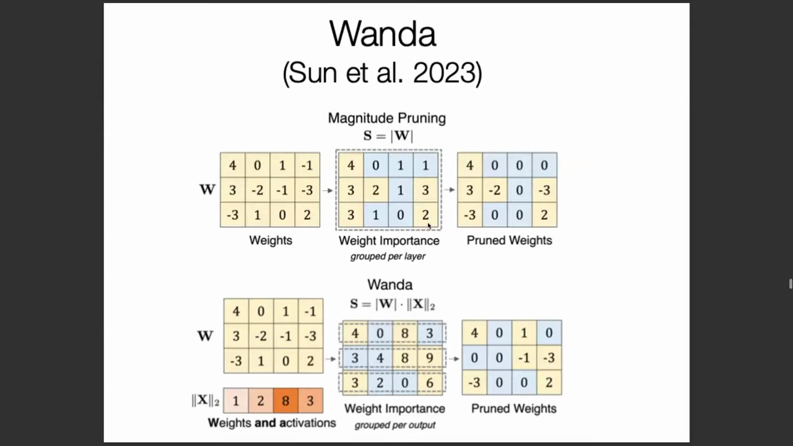
相比之下，结构化剪枝直接移除完整的架构模块，例如整个注意力头(Attention Head)或完整的网络层。这种设计与现代硬件的内存访问模式完美契合，使推理过程能够彻底跳过被剪枝部分的计算。即便两种方法最终削减的参数量完全相同，结构化剪枝仍能带来显著的运行时加速(Runtime Acceleration)（例如 50% 的推理提速）。这充分证明，硬件感知(Hardware-Aware)的架构调整在实现实际模型加速方面，远比单纯引入非结构化稀疏性(Unstructured Sparsity)更为高效。
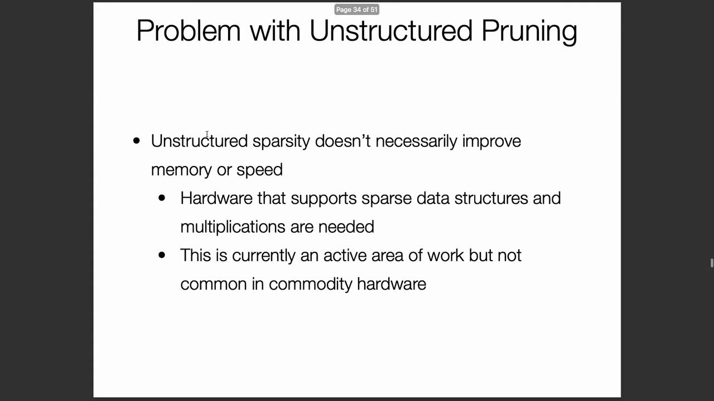
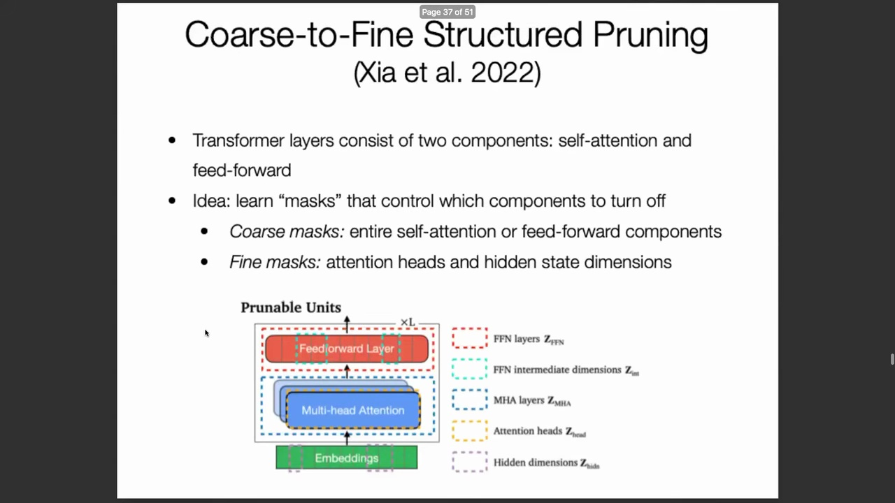

## 知识蒸馏(Knowledge Distillation)简介
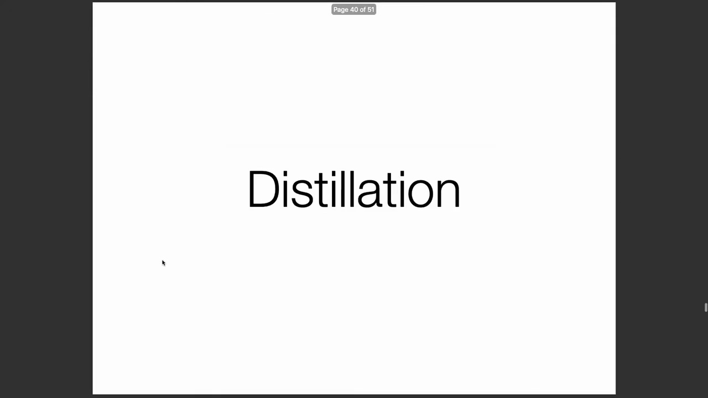
与直接剔除参数不同，知识蒸馏采用了一种范式迥异的模型压缩路径。该方法并非简单地保留原有权重或将参数置零，而是从头训练一个参数量更少的“学生模型”(Student Model)，使其行为模式高度拟合一个更大且已预训练的“教师模型”(Teacher Model)。在此过程中，学生网络的所有参数均会被更新，且学生模型甚至可采用与教师完全不同的网络架构。其核心策略在于将高维复杂的知识迁移至紧凑模型中。通过主动重学习特征表示(Feature Representation)而非静态修改权重，知识蒸馏在机制上从根本上区别于量化(Quantization)或剪枝。

## 弱监督(Weak Supervision)与伪标签(Pseudo-labels)生成
知识蒸馏的理论根基可追溯至经典的弱监督范式，该范式利用自动生成的伪标签替代高昂的人工标注(Human Annotation)。具体而言，教师模型会对大量符合目标领域分布的无标注语料(Unlabeled Corpus)进行推理并生成预测，这些预测随后转化为学生模型的训练目标。这一机制类似于自训练(Self-training)技术——模型利用自身预测迭代地为数据打标签以实现性能提升；也与 Snorkel 等数据编程框架相似，后者利用启发式规则(Heuristic Rules)构建含噪训练集。成功实施蒸馏的关键在于获取充足且领域匹配的无标注数据，使教师的输出能够充当高质量的软监督信号，从而编码丰富的任务特定知识(Task-Specific Knowledge)。
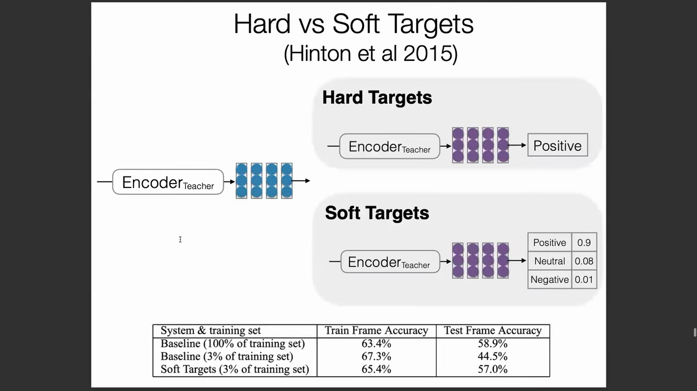

## 硬目标蒸馏(Hard Target Distillation)与软目标蒸馏(Soft Target Distillation)
利用教师模型输出指导学生训练主要存在两种策略。第一种是**硬目标蒸馏**，其机制较为直接：将教师的离散预测结果（例如将文本评论硬性分类为“正面”）视作确定的真实标签(Ground Truth)，并采用标准监督学习流程训练学生模型。尽管该方法直观易懂，但它不可避免地丢弃了教师模型中蕴含的宝贵暗知识(Dark Knowledge)。第二种，也是实践中更为有效的策略，是**软目标蒸馏**。在此模式下，学生模型不再仅拟合单一的类别标签，而是致力于学习教师模型在所有类别上输出的完整概率分布(Probability Distribution)。通过捕捉教师输出的相对置信度(Relative Confidence)以及类别间的隐含关联，软目标(Soft Targets)提供了信息量更为丰富的监督信号，从而使学生模型获得更卓越的泛化能力(Generalization Ability)与最终性能。

---

## 软目标(Soft Targets)分布的优势

传统的监督学习(Supervised Learning)依赖于硬目标(Hard Targets)，即人工标注者仅提供一个明确的类别标签，而不传递模型的不确定性或指示其他潜在可能性。软目标蒸馏(Soft Target Distillation)从根本上改变了这一范式，它训练学生模型(Student Model)去拟合教师模型(Teacher Model)在所有潜在标签上的完整概率分布(Probability Distribution)。损失函数(Loss Function)不再仅优化正确类别的预测概率，而是致力于最小化教师与学生输出分布之间的散度(Divergence)。这种方法实现了更为丰富的知识迁移(Knowledge Transfer)机制，因为教师模型本质上会输出其置信度水平(Confidence Level)、预测不确定性(Predictive Uncertainty)以及类别间相对的语义相似性(Semantic Similarity)——这些细微信息是标准人工标注无法捕捉的。

## 语音识别(Speech Recognition)中的数据效率

软目标的实际优势在 Hinton 等人针对语音识别任务的基础研究中得到了充分体现。实验结果表明，尽管在使用大规模标注数据集(Labeled Dataset)时，硬目标训练能取得优异的性能，但在数据稀缺(Data Scarcity)的场景下，软目标的效果显著更优。在处理有限的音频语料时，通过使学生模型与教师的完整输出分布对齐，模型能够从每个样本中提取出更密集的学习信号(Learning Signal)，从而取得优于传统硬标签蒸馏(Hard Label Distillation)的识别准确率。

## 自蒸馏(Self-Distillation)与迭代改进
该领域一项反直觉但极为有效的进展是自蒸馏，即模型利用软目标反复对自身进行知识蒸馏。在初始监督训练完成后，模型在数据集上生成自身的概率分布预测，随后通过重新训练来拟合这些自生成的输出。尽管该过程看似冗余，但实验表明其迭代优化能持续提升模型性能。其内在机理在于，软目标充当了强大的正则化器(Regularizer)，能够有效平滑模型的决策边界(Decision Boundary)，并提供比原始硬标签训练范式更丰富、结构更清晰的优化空间(Optimization Landscape)。

## 神经网络对标签噪声(Label Noise)的鲁棒性(Robustness)

蒸馏技术的成功，尤其是在使用不完美或自生成目标时，与深度神经网络对标签噪声的显著鲁棒性密切相关。研究表明，只要噪声遵循均匀分布(Uniform Distribution)，即使高达 99% 的训练标签被随机破坏，深度架构仍然能够学习到有意义的特征表示(Feature Representation)。这种极高的容错率解释了为何即使教师模型产生次优或带有“噪声”的概率估计，蒸馏依然有效。只要教师的输出保留了略高于纯随机性的微弱有效信号，学生网络便能借助软目标机制提取出有价值的结构模式(Structural Patterns)。

## 噪声分布类型的关键区别
必须强调的是，模型对噪声的容忍度高度依赖于噪声的分布特性。文献中记载的模型对极端标签翻转(Label Flipping)的鲁棒性，特指*均匀*随机噪声。若注入的噪声是有偏的(Biased)或非均匀的(Non-uniform)——即错误标签引入了系统性偏差(Systematic Bias)——网络会迅速拟合这些错误模式，严重削弱其学习准确映射(Accurate Mapping)的能力。这一关键区别表明：尽管蒸馏技术能够容忍不完美的教师信号并有效运作，但底层噪声必须保持无偏(Unbiased)，以防止学生网络吸收有害的系统性误差(Systematic Error)。

## 将蒸馏扩展至序列任务(Sequence Tasks)

尽管传统的知识蒸馏框架最初是为静态的单标签分类任务设计的，但现代应用正日益聚焦于序列数据(Sequence Data)与自然语言生成(Natural Language Generation, NLG)。将蒸馏技术扩展至序列到序列模型(Sequence-to-Sequence Model)，需要调整优化目标(Optimization Objective)以妥善处理逐步的词元预测(Token Prediction)、变长输出(Variable-length Output)以及长程上下文依赖(Long-range Contextual Dependency)。从静态分类任务过渡到动态文本生成(Dynamic Text Generation)，在跨整个序列对齐师生分布方面引入了新的算法挑战，从而推动了序列级知识迁移(Sequence-level Knowledge Transfer)专用技术的快速发展。

---

## 将蒸馏扩展至序列生成(Sequence Generation)
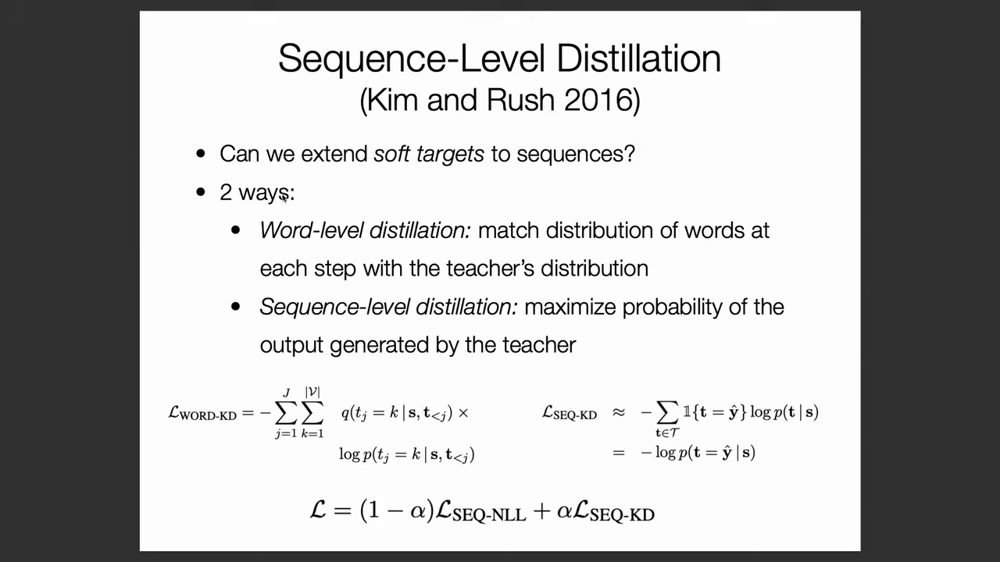
将知识蒸馏(Knowledge Distillation)应用于序列标注(Sequence Labeling)和文本生成(Text Generation)时，需对传统的单标签框架进行调整，以适配自回归输出(Autoregressive Output)的特性。为应对这一挑战，主要采用两种策略。其一是词级软目标蒸馏(Token-level Soft Target Distillation)，即要求学生模型在每个生成步中拟合教师模型在整个词汇表(Vocabulary)上的概率分布。然而，该方法易受“曝光偏差”(Exposure Bias)影响。随着生成长度的增加，学生模型自主生成的上下文前缀不可避免地会偏离教师模型的连贯生成轨迹。为克服此缺陷，研究引入了序列级蒸馏(Sequence-level Distillation)。在此范式下，教师模型生成完整的硬目标(Hard Target)输出句子，学生模型则通过训练来最大化这些伪标签序列(Pseudo-labeled Sequences)的似然度(Likelihood)。研究表明，融合词级软目标与序列级硬目标可构建出高度鲁棒的复合优化目标(Composite Optimization Objective)，这现已成为蒸馏序列到序列模型(Sequence-to-Sequence Models)的标准实践。

## 案例研究：DistilBERT 的架构
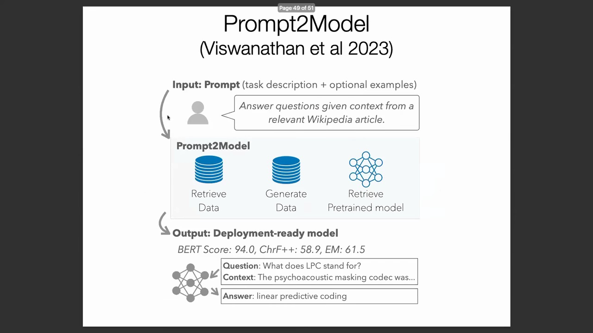
这些原则的标志性应用当属 DistilBERT。该模型成功将原始 BERT 的参数量压缩了 50%，同时在各类自然语言处理(NLP)基准测试(Benchmarks)中保持了近乎一致的性能。其压缩策略采用层剔除法，仅保留教师模型中每隔一层的网络结构，并直接复用 BERT 的预训练权重(Pre-trained Weights)进行初始化，而非采用随机初始化(Random Initialization)。训练过程高度依赖软目标蒸馏。值得注意的是，实验发现将其与标准的监督式掩码语言建模(Masked Language Modeling, MLM)损失相结合，带来的性能增益微乎其微。这表明，仅凭强大教师模型输出的软目标，已能提供极为充分的监督信号。为进一步对齐表征空间，作者引入了一种损失函数，专门用于匹配学生模型与教师模型在隐藏状态嵌入空间(Embedding Space)中的几何结构。最终得到的架构兼具高效性与广泛的适用性，充分证明在维持模型核心能力的前提下，实现大规模参数缩减(Parameter Reduction)完全可行。

## 现代蒸馏中的架构灵活性(Architectural Flexibility)
与剪枝(Pruning)等依赖特定架构的刚性压缩技术不同，知识蒸馏展现出卓越的架构灵活性。尽管经验表明，当师生模型共享相似的底层架构设计时（例如均采用自回归 Transformer 架构），蒸馏性能可达最优，但该框架本身并不受此严格限制。在进行基于生成序列的硬目标蒸馏时，教师模型的输出可直接视为标准的带标注训练数据(Labeled Training Data)。这种抽象化处理使研究人员能够在伪标注语料上训练架构迥异的学生模型，从而实现跨范式的知识迁移(Cross-paradigm Knowledge Transfer)，大幅拓宽了蒸馏技术在不同模型家族(Model Families)间的适用范围。

## Self-Instruct 与逆向数据生成策略
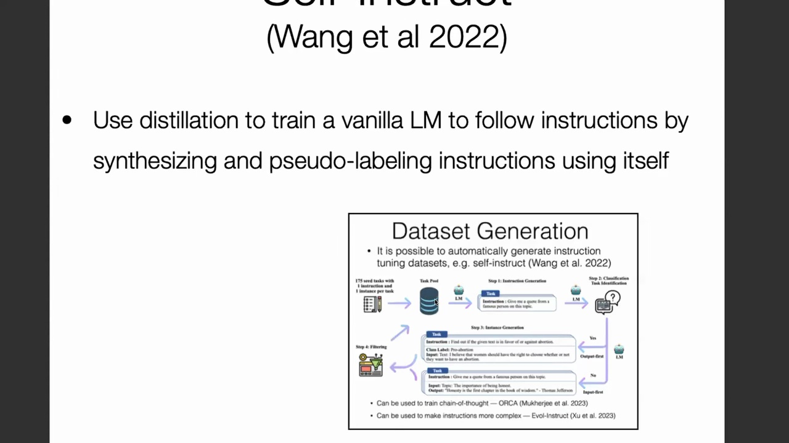
知识蒸馏已从单纯的模型压缩效率工具，演变为激发模型新能力的核心机制，Self-Instruct 框架便是其中的杰出代表。该方法驱动基础语言模型(Base Language Model)自主生成训练数据，并通过自蒸馏(Self-Distillation)机制赋予其指令遵循能力(Instruction-following Capability)。推动该方法成功的关键洞见在于“逆向数据生成策略”(Reverse Data Generation Strategy)。传统的数据合成通常遵循正向线性路径：先生成输入文本，再由模型预测对应标签。这种范式往往易产生低质量或带有系统性偏差(Systematic Bias)的样本。通过反转该流程——即首先生成目标类别或指令，再条件化生成(Conditionally Generate)对应的输入文本——模型能够构建出高保真(High-fidelity)的合成数据集。该策略充分利用了大模型的生成先验优势，所构建的数据集比传统前向预测产生的训练信号更为清晰、可靠。

## 利用任务不对称性(Task Asymmetry)生成合成数据
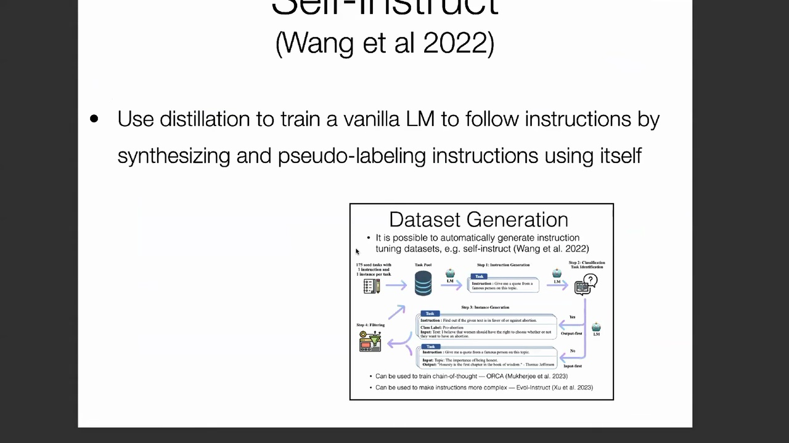
这一逆向生成原则与“任务不对称性”概念高度契合。在众多任务中，从输入 X 到输出 Y 的正向映射往往极其困难，而从 Y 到 X 的逆向推导却相对直观。利用这种不对称性，研究人员能够为复杂的下游任务(Downstream Tasks)构建高质量的合成训练数据。以信息抽取(Information Extraction)任务为例，将非结构化自然文本解析为结构化的关系三元组(Relational Triples)极具挑战性。然而，对于现代语言模型而言，基于给定的实体与三元组生成连贯的自然语言句子则显得轻而易举。通过“由结构化数据合成文本，随后翻转输入输出对”的策略，模型得以利用高质量且经算法验证的数据，对原本困难的正向任务进行有效训练。
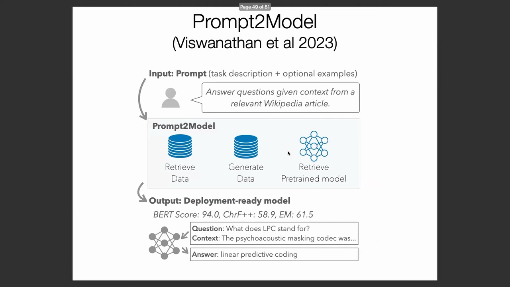
在信息抽取任务中应用该策略的实验表明，模型性能可达到以往最先进(State-of-the-Art, SOTA)系统的两倍。这凸显了现代机器学习的一项根本性范式转变(Paradigm Shift)：研究重心已从单纯依赖稀缺的人工标注语料(Manually Annotated Corpora)，转向利用任务不对称性策略性地生成、重构与蒸馏合成数据(Synthetic Data)，从而释放出前所未有的模型性能与鲁棒性(Robustness)。

---

## 超越压缩：用于能力增强(Capability Enhancement)的蒸馏技术

尽管模型蒸馏(Model Distillation)传统上被视为一种旨在提升推理效率(Inference Efficiency)的压缩技术，但近期研究已将其重新构想为一种强大的数据生成引擎，能够解锁全新的模型能力。诸如“Prompt 模型”(Prompt-based Models)等框架提出，蒸馏不应仅被视为缩减网络规模的手段，更应作为一种灵活的数据合成流水线(Data Synthesis Pipeline)。其核心洞见在于，通过战略性地融合多种训练信号(Training Signals)，而非依赖单一范式，能够取得更为卓越的性能。

## Prompt 模型框架：检索与生成的结合
在该框架中，用户通过自然语言提示(Natural Language Prompt)定义目标任务，并可选择性提供少量示例(Few-shot Examples)。系统首先执行基于文本的数据集检索(Dataset Retrieval)，以定位与提示高度相关的高质量现有语料（例如，针对生物医学查询检索 BioASQ 数据集）。尽管检索数据具有高可靠性，但往往难以与用户的具体意图精确对齐(Align)。为弥补这一不足，该流水线引入由大型语言模型(LLM)生成的合成数据(Synthetic Data)作为补充。尽管 LLM 生成的数据可能包含一定噪声(Noise)，但其能高度契合提示的具体需求。研究人员通过选择性集成领域特定的预训练模型(Domain-specific Pre-trained Models)，并在此混合数据集上微调较小的学生网络(Student Network)，证明了蒸馏后的模型往往能够超越用于生成数据的教师模型(如 GPT-3)。这一结果证实，通过智能的数据筛选与整合，能够有效实现“超越教师”(Surpassing the Teacher)。

## 合成数据生成(Synthetic Data Generation)的兴起

这一范式转变(Paradigm Shift)标志着知识蒸馏正广泛演进为如今备受瞩目的“合成数据生成”范式。现代研究的重心已不再局限于参数缩减(Parameter Reduction)，而是转向将 LLM 视为强大且可扩展的数据合成工具。该方法已迅速成为自然语言处理(NLP)领域的前沿研究方向之一。其本质可视为一种高级形态的硬目标蒸馏(Hard Target Distillation)，即直接利用生成的序列作为高质量的训练标签(Training Labels)。

## 合成数据流水线的标准化

为将合成数据生成从实验性研究转化为成熟的工程实践，新型标准化开发工具包(Development Toolkits)正不断涌现。这些类 PyTorch 框架为完整的数据生命周期(Data Lifecycle)定义了模块化的基础操作(Primitive Operations)，涵盖基于提示(Prompt-based)或检索增强生成(RAG, Retrieval-Augmented Generation)驱动的数据生成、上下文检索(Context Retrieval)、样本过滤与重排序(Filtering & Reranking)，以及利用独立裁判模型(Judge Models)进行的自动化质量评估。其核心优势在于，这些工具包将模型训练循环(Training Loop)无缝集成至数据生成流程中，构建出高度可控且可复现的闭环流水线(Closed-loop Pipeline)。

这种模块化设计将数据合成转化为结构化的工程问题，为研究人员与从业者提供了一条可扩展且具备生产就绪能力(Production-ready)的路径，以构建高性能模型。探索此类集成化的合成数据流水线是极具前景的未来研究方向。它充分展示了智能自动化如何在不单纯依赖人工标注数据集(Human-annotated Datasets)的情况下，持续拓展模型能力的边界。