## 自然语言处理(NLP)部署与推理(Inference)成本简介
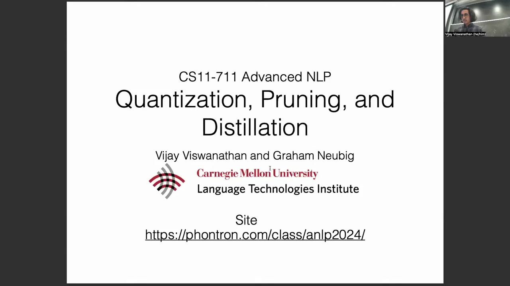
讲座首先探讨了当前自然语言处理(NLP)模型的现状，这些模型如今已实现大规模部署。尽管业界普遍认知到训练大型深度网络(Deep Networks)成本高昂且高度依赖图形处理器(GPU, Graphics Processing Unit)资源，但一个关键方面却常被忽视：推理(Inference)成本。 
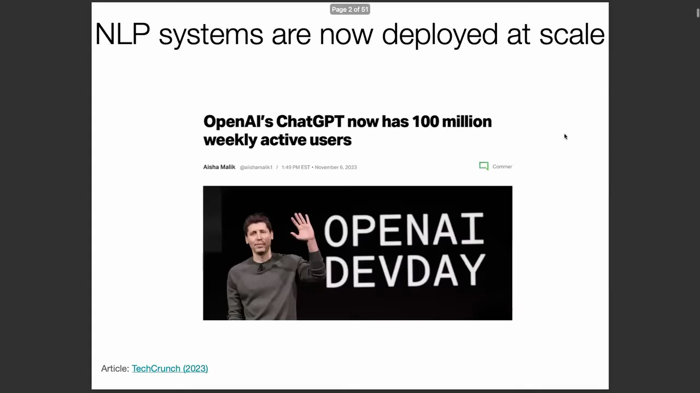
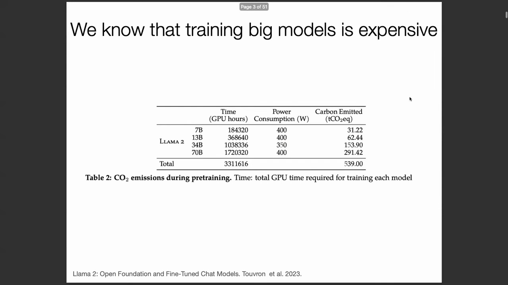
模型训练完成后，将其部署并为用户生成预测的成本，实际上甚至高于初始训练成本。分析表明，在模型投入使用后的短短一周内，其累计运营成本就可能超过一次性训练费用。若模型在数月或数年内被海量用户持续调用，其推理成本将远超初始投资。
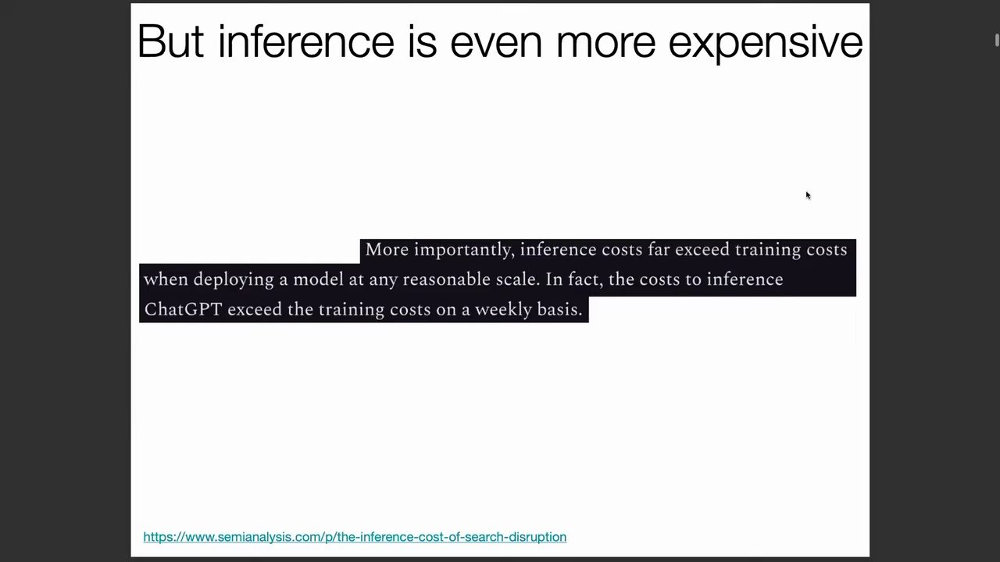
这一高昂的资金门槛直接阻碍了让人工智能(Artificial Intelligence, AI)系统惠及更广泛、更多样化受众（包括计算资源有限的群体）的目标。随着模型规模持续扩大的趋势，模型架构通常扩展至数十亿(Billions)乃至更多参数，这导致其服务成本天然居高不下，进一步加剧了该挑战。
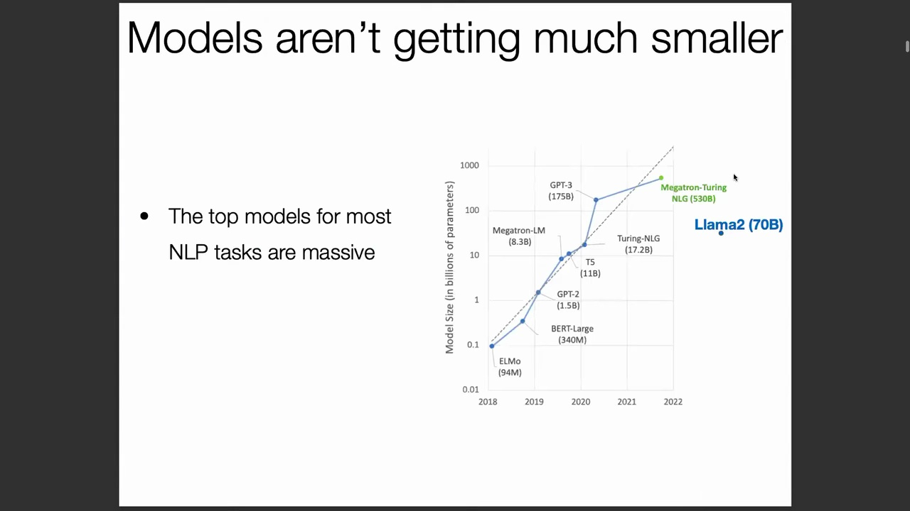

## 核心问题与模型压缩(Model Compression)策略
本讲座的核心目标是解决一项根本性挑战：如何在不牺牲性能(Performance)的前提下，以低成本、高效率且公平的方式部署NLP系统？明确的解决路径是模型压缩(Model Compression)，即在部署前对已充分训练的模型进行体积缩减。 
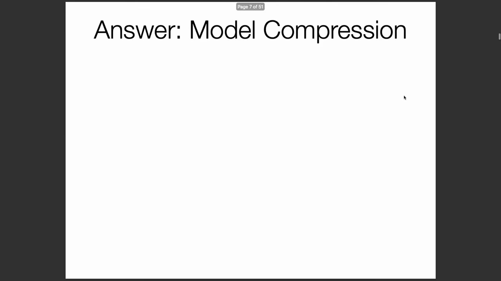
实现这一目标主要有三种高级技术：
* **量化(Quantization)：** 保持模型架构不变，将模型参数的数值精度降低至特定位数，实质上舍弃了多余的精度信息。
* **剪枝(Pruning)：** 从模型中直接移除冗余参数或整个网络组件。
* **蒸馏(Distillation)：** 将大型模型（教师模型(Teacher Model)）的知识迁移并压缩至较小的架构（学生模型(Student Model)）中，该小模型通常需经过重新训练以拟合原始模型的行为。

## 压缩为何有效：过参数化(Overparameterization)理论
模型压缩的优势看似显而易见，但这自然引出了两个问题：为何不一开始就训练一个小型模型？以及，在不降低准确率(Accuracy)的前提下，如何能够安全地丢弃大模型的部分参数？答案在于“过参数化(Overparameterization)”这一概念。
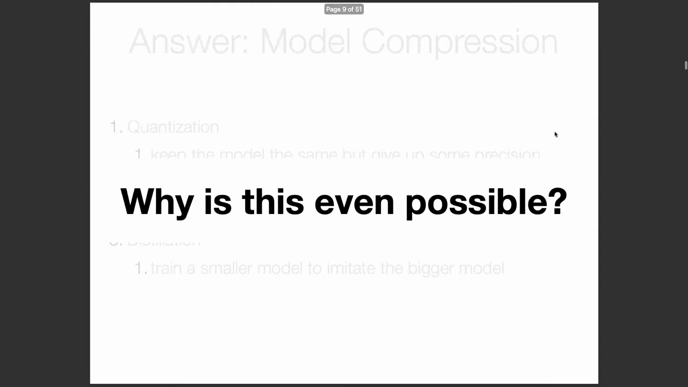
过参数化(Overparameterization)指的是模型所包含的参数数量远超传统统计机器学习(Statistical Machine Learning)理论所认为的必要水平，例如拥有1750亿参数的GPT-3。机器学习理论表明，这类高度参数化的模型在优化过程中实际上更容易训练。 
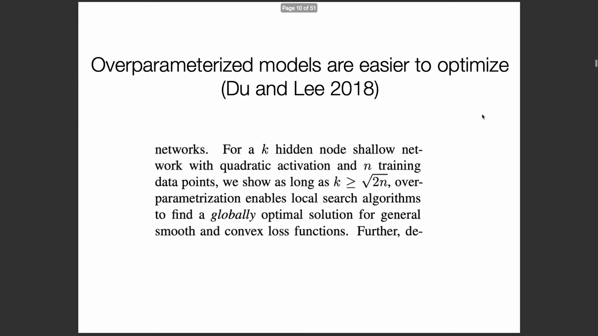
训练深度神经网络(Deep Neural Networks)涉及优化一个非凸目标函数(Non-convex Objective Function)，该过程无法保证找到全局最优解(Global Optimum)。充足的参数使得优化算法能够有效绕过鞍点(Saddle Points)和次优的局部极小值(Local Minima)，从而在复杂的优化地形(Optimization Landscape)中更顺利地收敛。最终，这些冗余参数在训练阶段发挥了关键作用，但在推理阶段并非绝对必需，这使得训练后的模型压缩极为有效。
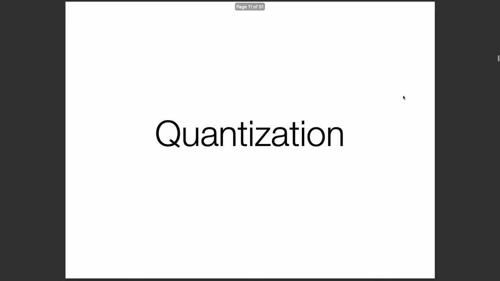

## 量化(Quantization)与显存(VRAM)优化
首先探讨的技术是训练后量化(Post-training Quantization)。在模型以满精度(Full Precision)训练完成后，系统性地降低其权重(Weights)的数值精度。例如，以标准的32位浮点数(FP32)精度加载像Llama 2这样拥有700亿参数的模型，大约需要260 GB的GPU显存(VRAM)，这超出了大多数商用单卡GPU的容量上限。
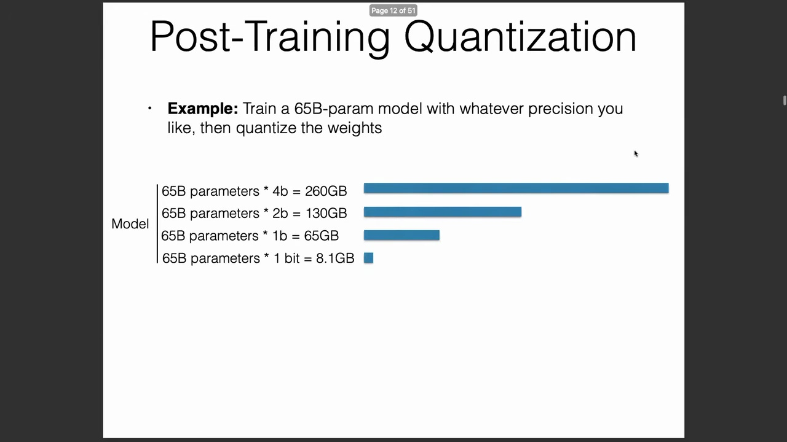
随着权重精度的降低，显存需求呈线性下降。在极端情况下，使用1位(1-bit)二进制表示替换32位浮点数，可将模型体积压缩至约8 GB，使其能够在标准消费级硬件上部署。这为大幅降低模型服务成本提供了极具吸引力的解决方案。
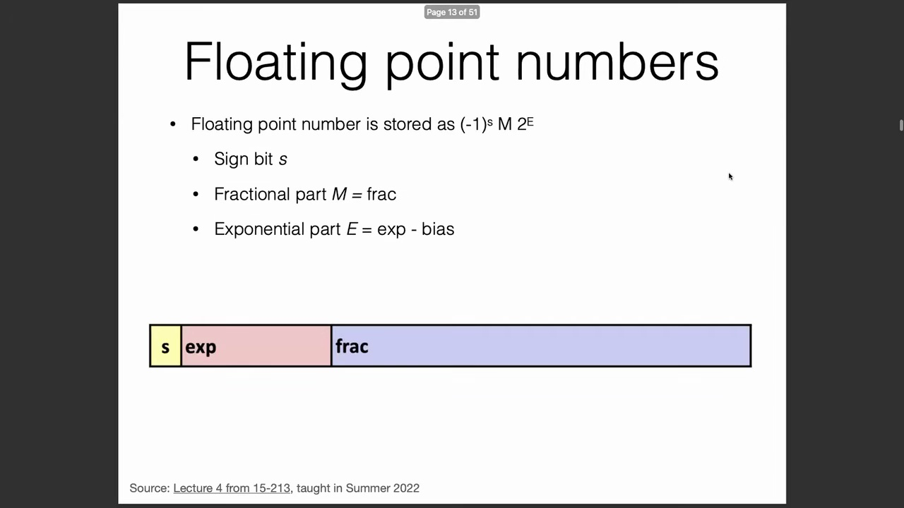

## 浮点数表示与精度限制
为深入理解量化的技术基础，有必要简要回顾计算机系统中的数值表示方法。神经网络传统上采用IEEE 754标准浮点数(IEEE 754 Floating-Point)来表示权重，以适应广泛的动态范围(Dynamic Range)。一个标准浮点数由三部分组成：符号位(Sign Bit，表示正负)、尾数(Mantissa，决定数值精度与有效范围)以及指数(Exponent，用于缩放数量级)。
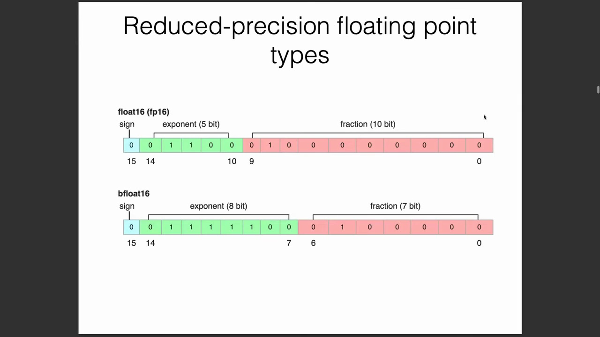
以Float16(FP16)为例，它为尾数分配了10位，为指数分配了5位。尽管FP16被广泛使用，但其精度通常不足以支撑复杂神经网络的完整训练。在处理优化过程中自然产生的极小或极大梯度(Gradients)值时，其受限的动态范围极易引发数值下溢(Underflow)或上溢(Overflow)问题，因此需要采用更稳健的数据类型(Data Types)解决方案。
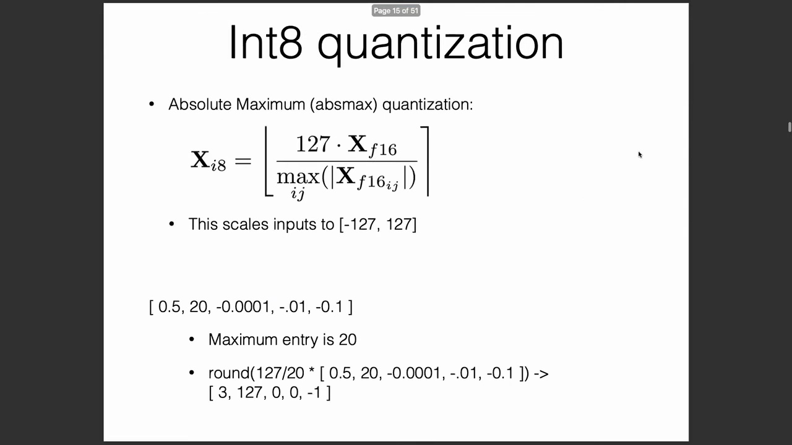