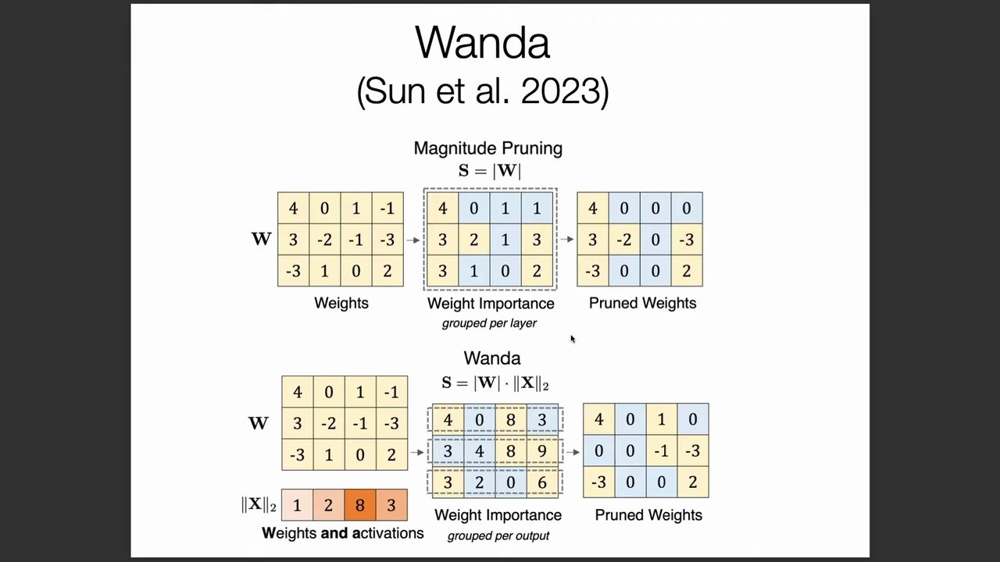
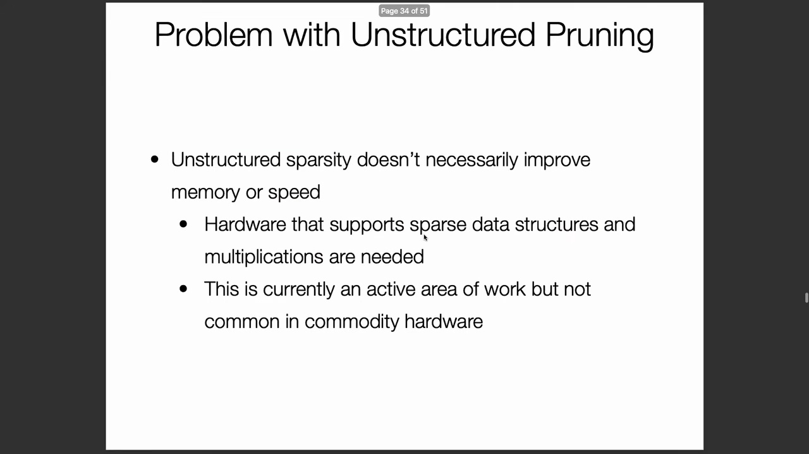
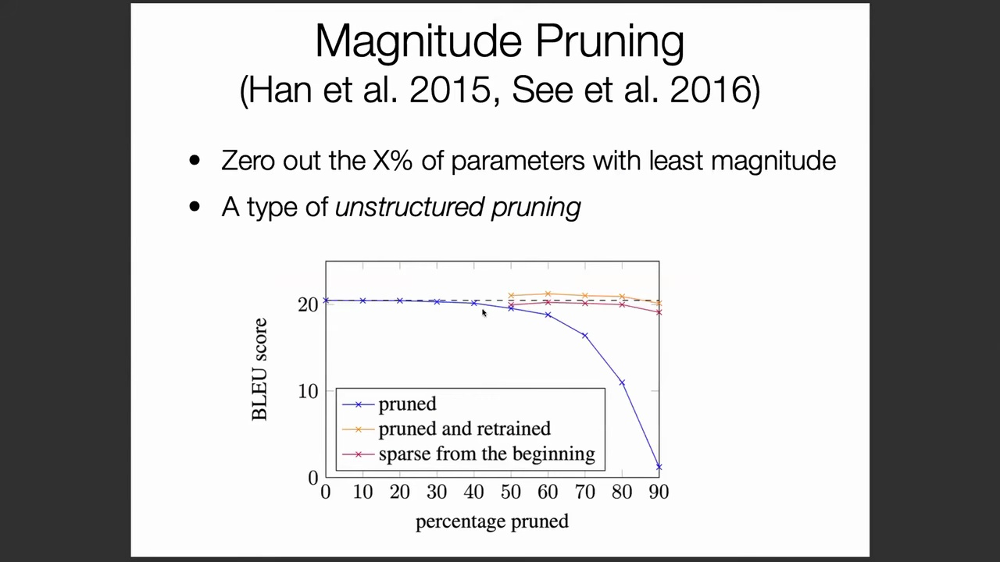
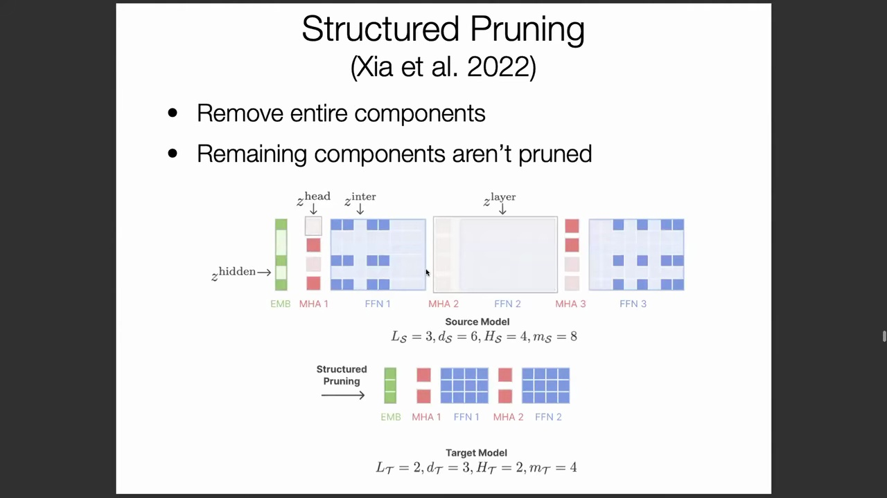
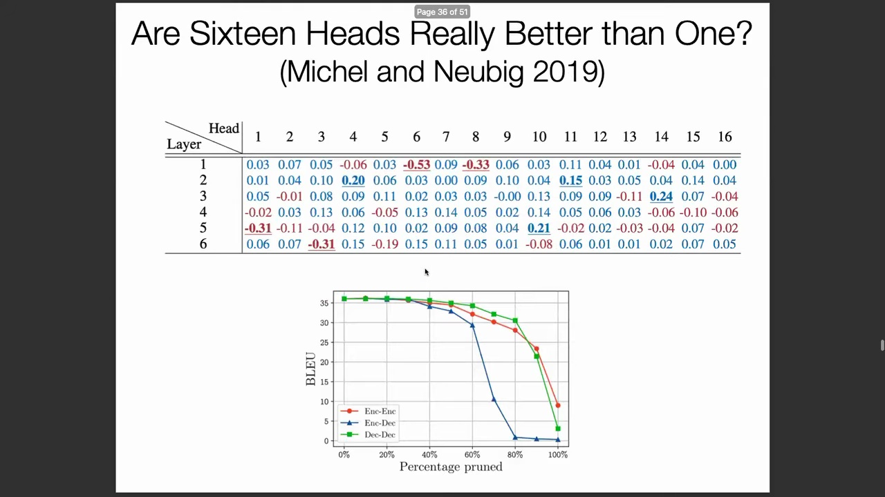
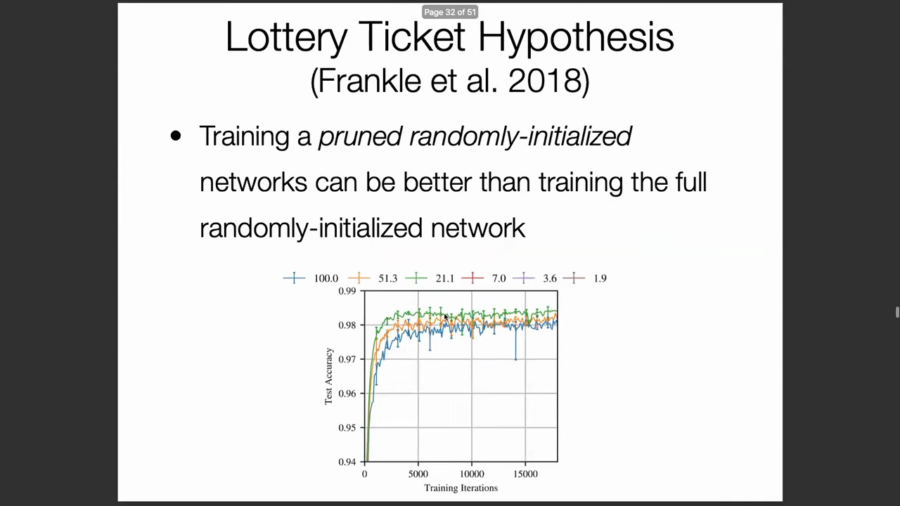
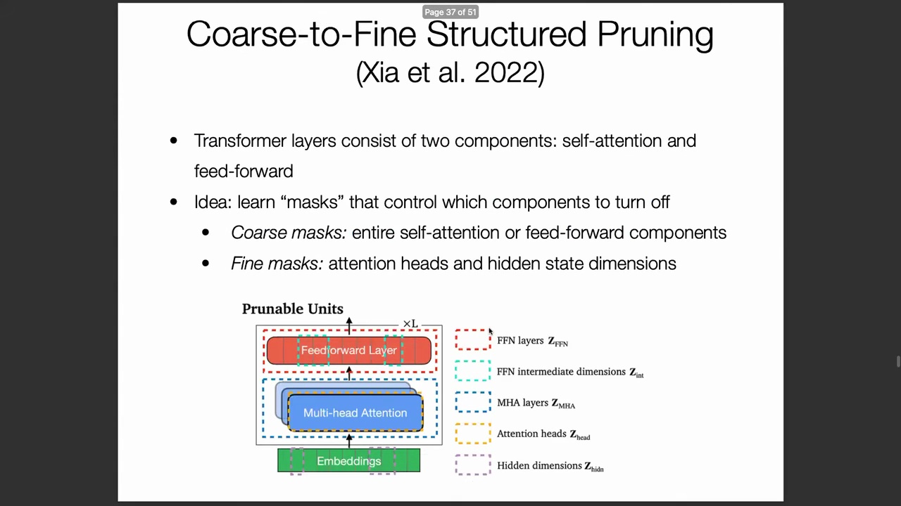
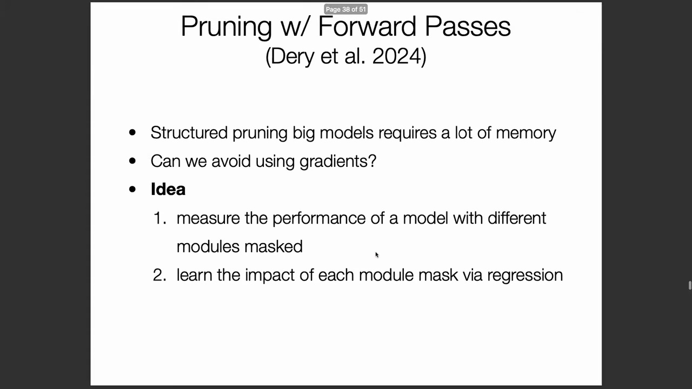
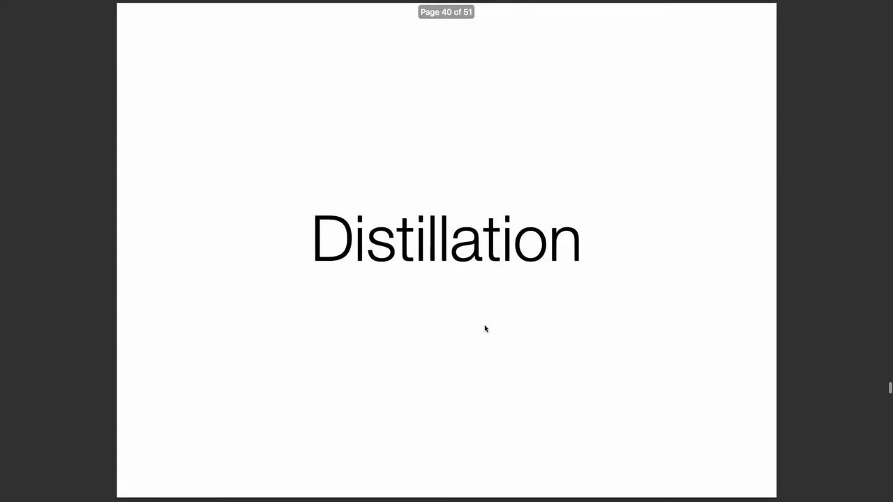

## 幅值剪枝(Magnitude Pruning)与 WANDA(Weights and Activation based pruning) 方法

考虑一个具有输入 $x$、$y$ 与权重 $a$、$b$ 的基础双参数模型。传统的幅值剪枝基于如下假设：若权重 $a$ 的幅值显著大于 $b$，则可直接将 $b$ 置零。在此前提下，模型假设幅值较大的权重主导输出，而幅值较小的权重属于冗余部分，因此模型可简化为 $a \times x$。然而，该方法忽略了输入激活值(Activation)的尺度。若输入 $y$ 的平均幅值显著大于 $x$（例如比例为 1000:1），较小的权重 $b$ 实际处理的输入数值更大，从而会对最终输出产生不成比例的巨大影响。这一缺陷催生了 **WANDA** 方法。该方法通过同时评估权重本身的幅值与流入该层的输入激活幅值，来优化剪枝决策。WANDA 利用校准数据(Calibration Data)估算平均输入幅值，从而更精准地识别出真正不重要的参数。

## 非结构化剪枝(Unstructured Pruning)的硬件局限性
尽管非结构化剪枝能够成功生成稀疏权重矩阵(Sparse Weight Matrix)，但其在实际部署中往往无法带来预期的推理加速。根本原因在于硬件支持不足：主流的机器学习加速器(Machine Learning Accelerator)与矩阵乘法库均针对密集计算(Dense Computation)进行了高度优化。若底层硬件不支持原生稀疏性计算，涉及零权重的运算仍会消耗与处理非零权重相同的时钟周期。因此，仅将分散的参数置零无法转化为实际的运行时加速收益。鉴于当前硬件生态难以高效处理稀疏数据结构，非结构化剪枝在很大程度上仍停留在理论层面，难以直接部署，这也凸显了开发硬件友好型替代方案的迫切需求。

## 结构化剪枝(Structured Pruning)：移除完整组件

为克服上述硬件效率瓶颈，**结构化剪枝**作为一种高效替代方案应运而生。该技术并非在模型中逐个剔除孤立权重，而是直接移除完整的架构组件，例如整个网络层或注意力头(Attention Head)。针对 BERT 与 Llama 等 Transformer 模型的研究表明，大量注意力头存在冗余；即便移除其中一半，通常也仅会导致可忽略的性能损失，同时却能立即降低推理延迟与内存占用。与非结构化剪枝不同，结构化剪枝以可预测且硬件友好的方式重塑模型架构。即使被移除的组件中包含高幅值权重，将其作为整体单元剔除仍能保证获得显著的推理加速，且无需依赖专用的稀疏计算硬件。

## 粗粒度掩码(Coarse-grained Mask)与细粒度掩码(Fine-grained Mask)策略

近期研究通过分层掩码框架(Hierarchical Masking Framework)将结构化剪枝进行了形式化定义。一种主流方案采用双层掩码系统：**粗粒度掩码**与**细粒度掩码**。粗粒度掩码作用于宏观组件（如整个自注意力层(Self-Attention Layer)或前馈网络(Feed-Forward Network)），这些组件可通过乘以单位矩阵(Identity Matrix)实现计算旁路。细粒度掩码则在更微观的层面运作，用于精确控制单个注意力头或动态缩减隐藏状态(Hidden State)的维度（例如将 512 维压缩至 200 维）。这种多层级粒度设计实现了对模型架构的精细控制。掩码参数通常利用预留的验证数据(Validation Data)进行优化学习，以确定在维持模型精度的前提下可安全禁用的组件。然而，此类基于梯度(Gradient-based)的优化计算成本极高，往往需要消耗与预训练原始模型相当的 GPU 显存与计算预算。

## 基于随机采样与回归的无梯度剪枝(Gradient-free Pruning)
鉴于基于梯度的掩码学习开销巨大，近期研究探索了完全无需反向传播(Backpropagation)的剪枝技术。该方法通过随机掩蔽(Random Masking)不同的网络模块，生成大量受扰动的模型变体。在评估这些变体的性能后，研究人员训练一个回归模型(Regression Model)来预测各独立模块对整体系统的贡献度。随后，所得的回归系数将直接指导剪枝过程，精准识别出可在极小性能损失下安全移除的模块。这种无梯度策略仅需前向推理的计算资源，而无需重新训练，使研究者能够对 Llama-70B 等超大规模模型实施剪枝，大幅降低了大模型压缩的门槛。

## 问答：阐明剪枝机制与搜索策略

在技术讨论环节，针对上述剪枝技术的实现细节与优化路径进行了深入澄清。对于自注意力头或前馈层等组件的结构化剪枝，其数学本质是将模块的计算路径乘以单位矩阵，从而实现计算过程的有效旁路。基于回归的剪枝方法专门致力于解决评估所有可能掩码配置时固有的组合爆炸(Combinatorial Explosion)难题。由于穷举测试所有子模块组合在计算上不可行，研究者采用随机采样(Random Sampling)探索搜索空间，并结合回归分析或贝叶斯优化(Bayesian Optimization)等高级算法，基于观测样本预测模块间的交互效应(Interaction Effects)。这种结构化探索策略在高效搜索与性能保留之间取得了平衡，确保无需穷举评估即可做出最优的剪枝决策。