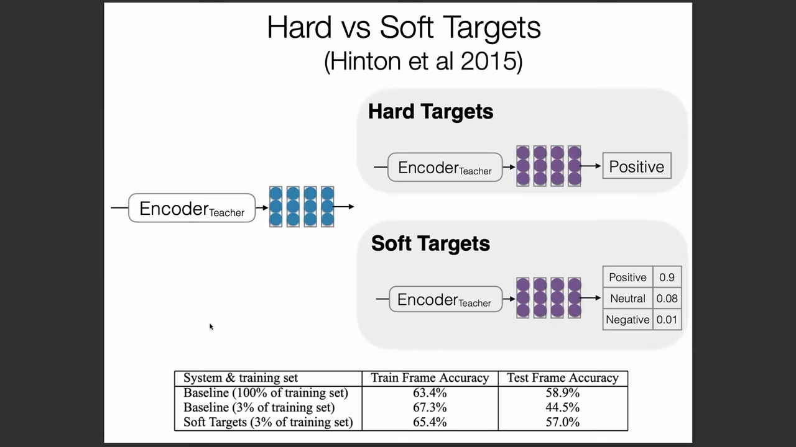
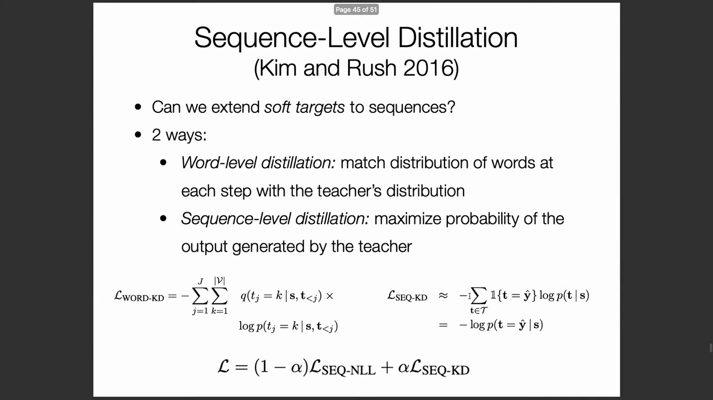
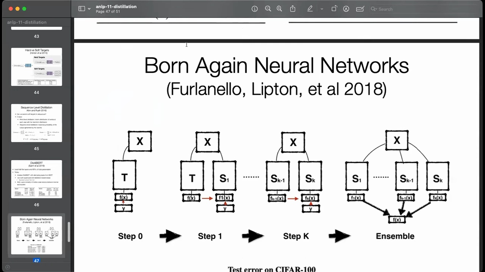
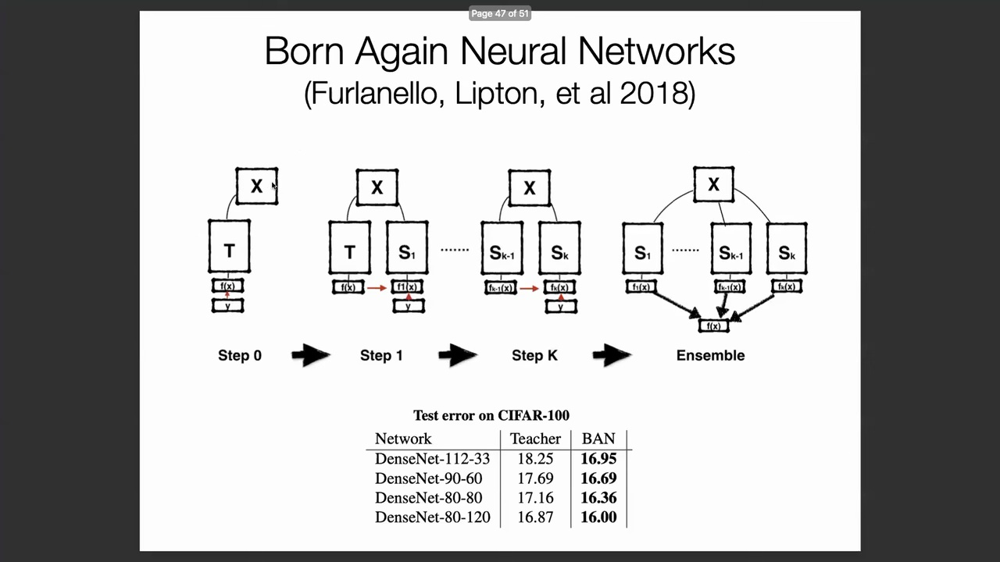
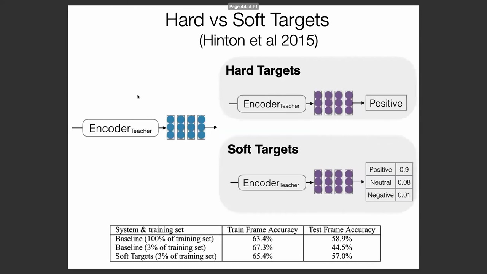
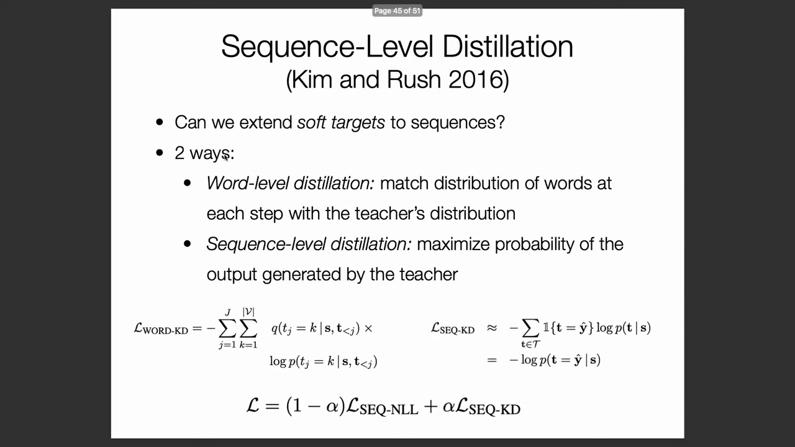

## 软目标(Soft Targets)分布的优势

传统的监督学习(Supervised Learning)依赖于硬目标(Hard Targets)，即人工标注者仅提供一个明确的类别标签，而不传递模型的不确定性或指示其他潜在可能性。软目标蒸馏(Soft Target Distillation)从根本上改变了这一范式，它训练学生模型(Student Model)去拟合教师模型(Teacher Model)在所有潜在标签上的完整概率分布(Probability Distribution)。损失函数(Loss Function)不再仅优化正确类别的预测概率，而是致力于最小化教师与学生输出分布之间的散度(Divergence)。这种方法实现了更为丰富的知识迁移(Knowledge Transfer)机制，因为教师模型本质上会输出其置信度水平(Confidence Level)、预测不确定性(Predictive Uncertainty)以及类别间相对的语义相似性(Semantic Similarity)——这些细微信息是标准人工标注无法捕捉的。

## 语音识别(Speech Recognition)中的数据效率

软目标的实际优势在 Hinton 等人针对语音识别任务的基础研究中得到了充分体现。实验结果表明，尽管在使用大规模标注数据集(Labeled Dataset)时，硬目标训练能取得优异的性能，但在数据稀缺(Data Scarcity)的场景下，软目标的效果显著更优。在处理有限的音频语料时，通过使学生模型与教师的完整输出分布对齐，模型能够从每个样本中提取出更密集的学习信号(Learning Signal)，从而取得优于传统硬标签蒸馏(Hard Label Distillation)的识别准确率。

## 自蒸馏(Self-Distillation)与迭代改进
该领域一项反直觉但极为有效的进展是自蒸馏，即模型利用软目标反复对自身进行知识蒸馏。在初始监督训练完成后，模型在数据集上生成自身的概率分布预测，随后通过重新训练来拟合这些自生成的输出。尽管该过程看似冗余，但实验表明其迭代优化能持续提升模型性能。其内在机理在于，软目标充当了强大的正则化器(Regularizer)，能够有效平滑模型的决策边界(Decision Boundary)，并提供比原始硬标签训练范式更丰富、结构更清晰的优化空间(Optimization Landscape)。

## 神经网络对标签噪声(Label Noise)的鲁棒性(Robustness)

蒸馏技术的成功，尤其是在使用不完美或自生成目标时，与深度神经网络对标签噪声的显著鲁棒性密切相关。研究表明，只要噪声遵循均匀分布(Uniform Distribution)，即使高达 99% 的训练标签被随机破坏，深度架构仍然能够学习到有意义的特征表示(Feature Representation)。这种极高的容错率解释了为何即使教师模型产生次优或带有“噪声”的概率估计，蒸馏依然有效。只要教师的输出保留了略高于纯随机性的微弱有效信号，学生网络便能借助软目标机制提取出有价值的结构模式(Structural Patterns)。

## 噪声分布类型的关键区别
必须强调的是，模型对噪声的容忍度高度依赖于噪声的分布特性。文献中记载的模型对极端标签翻转(Label Flipping)的鲁棒性，特指*均匀*随机噪声。若注入的噪声是有偏的(Biased)或非均匀的(Non-uniform)——即错误标签引入了系统性偏差(Systematic Bias)——网络会迅速拟合这些错误模式，严重削弱其学习准确映射(Accurate Mapping)的能力。这一关键区别表明：尽管蒸馏技术能够容忍不完美的教师信号并有效运作，但底层噪声必须保持无偏(Unbiased)，以防止学生网络吸收有害的系统性误差(Systematic Error)。

## 将蒸馏扩展至序列任务(Sequence Tasks)

尽管传统的知识蒸馏框架最初是为静态的单标签分类任务设计的，但现代应用正日益聚焦于序列数据(Sequence Data)与自然语言生成(Natural Language Generation, NLG)。将蒸馏技术扩展至序列到序列模型(Sequence-to-Sequence Model)，需要调整优化目标(Optimization Objective)以妥善处理逐步的词元预测(Token Prediction)、变长输出(Variable-length Output)以及长程上下文依赖(Long-range Contextual Dependency)。从静态分类任务过渡到动态文本生成(Dynamic Text Generation)，在跨整个序列对齐师生分布方面引入了新的算法挑战，从而推动了序列级知识迁移(Sequence-level Knowledge Transfer)专用技术的快速发展。