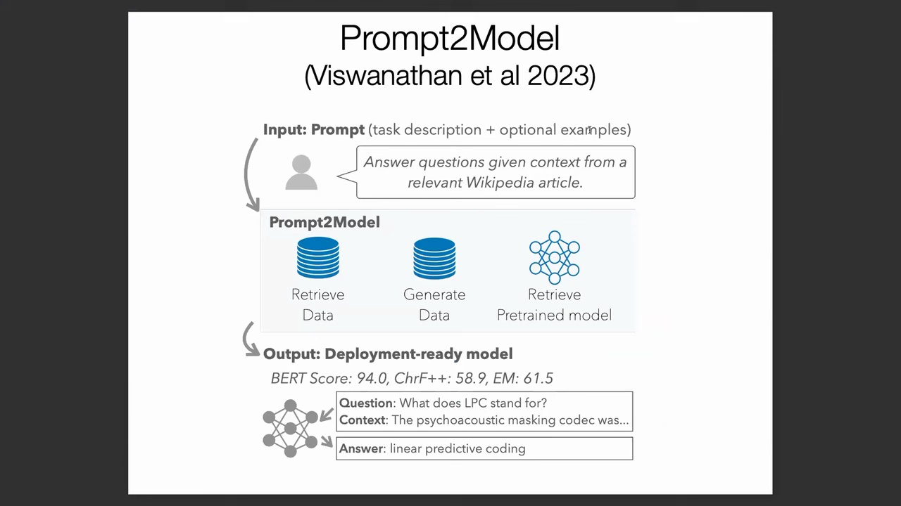
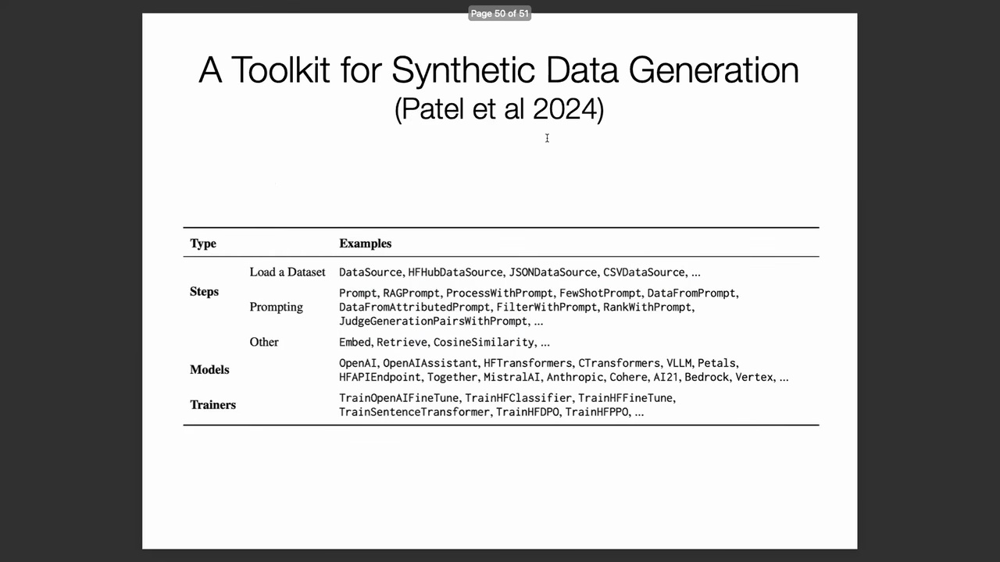

## 超越压缩：用于能力增强(Capability Enhancement)的蒸馏技术

尽管模型蒸馏(Model Distillation)传统上被视为一种旨在提升推理效率(Inference Efficiency)的压缩技术，但近期研究已将其重新构想为一种强大的数据生成引擎，能够解锁全新的模型能力。诸如“Prompt 模型”(Prompt-based Models)等框架提出，蒸馏不应仅被视为缩减网络规模的手段，更应作为一种灵活的数据合成流水线(Data Synthesis Pipeline)。其核心洞见在于，通过战略性地融合多种训练信号(Training Signals)，而非依赖单一范式，能够取得更为卓越的性能。

## Prompt 模型框架：检索与生成的结合
在该框架中，用户通过自然语言提示(Natural Language Prompt)定义目标任务，并可选择性提供少量示例(Few-shot Examples)。系统首先执行基于文本的数据集检索(Dataset Retrieval)，以定位与提示高度相关的高质量现有语料（例如，针对生物医学查询检索 BioASQ 数据集）。尽管检索数据具有高可靠性，但往往难以与用户的具体意图精确对齐(Align)。为弥补这一不足，该流水线引入由大型语言模型(LLM)生成的合成数据(Synthetic Data)作为补充。尽管 LLM 生成的数据可能包含一定噪声(Noise)，但其能高度契合提示的具体需求。研究人员通过选择性集成领域特定的预训练模型(Domain-specific Pre-trained Models)，并在此混合数据集上微调较小的学生网络(Student Network)，证明了蒸馏后的模型往往能够超越用于生成数据的教师模型(如 GPT-3)。这一结果证实，通过智能的数据筛选与整合，能够有效实现“超越教师”(Surpassing the Teacher)。

## 合成数据生成(Synthetic Data Generation)的兴起

这一范式转变(Paradigm Shift)标志着知识蒸馏正广泛演进为如今备受瞩目的“合成数据生成”范式。现代研究的重心已不再局限于参数缩减(Parameter Reduction)，而是转向将 LLM 视为强大且可扩展的数据合成工具。该方法已迅速成为自然语言处理(NLP)领域的前沿研究方向之一。其本质可视为一种高级形态的硬目标蒸馏(Hard Target Distillation)，即直接利用生成的序列作为高质量的训练标签(Training Labels)。

## 合成数据流水线的标准化

为将合成数据生成从实验性研究转化为成熟的工程实践，新型标准化开发工具包(Development Toolkits)正不断涌现。这些类 PyTorch 框架为完整的数据生命周期(Data Lifecycle)定义了模块化的基础操作(Primitive Operations)，涵盖基于提示(Prompt-based)或检索增强生成(RAG, Retrieval-Augmented Generation)驱动的数据生成、上下文检索(Context Retrieval)、样本过滤与重排序(Filtering & Reranking)，以及利用独立裁判模型(Judge Models)进行的自动化质量评估。其核心优势在于，这些工具包将模型训练循环(Training Loop)无缝集成至数据生成流程中，构建出高度可控且可复现的闭环流水线(Closed-loop Pipeline)。

这种模块化设计将数据合成转化为结构化的工程问题，为研究人员与从业者提供了一条可扩展且具备生产就绪能力(Production-ready)的路径，以构建高性能模型。探索此类集成化的合成数据流水线是极具前景的未来研究方向。它充分展示了智能自动化如何在不单纯依赖人工标注数据集(Human-annotated Datasets)的情况下，持续拓展模型能力的边界。