## 人类反馈学习(Learning from Human Feedback)简介

本节首先概述了从人类反馈中学习的宏观图景。尽管基于人类反馈的强化学习(Reinforcement Learning from Human Feedback, RLHF)在当前讨论中占据主导地位，但它仅是众多方法中的一种。在深入探讨模型如何有效利用反馈信号进行训练之前，本文将首先详细介绍专为生成任务(Generation Tasks)量身定制的人类反馈收集方法，此类任务的复杂度远高于标准的分类问题。

## 最大似然估计(Maximum Likelihood Estimation, MLE)的局限性
历史上，语言模型一直采用最大似然估计(Maximum Likelihood Estimation, MLE)进行训练，该方法旨在最大化给定上文语境下预测下一个正确词元(Token)的概率。然而，MLE 本质上对所有词元级错误施加同等程度的惩罚，未能区分不同错误在实际语义或语用后果上的严重性差异。例如，轻微的语法失误，其危害远小于篡改关键实体（如将目的地从“匹兹堡”改为“东京”）或将礼貌用语替换为不当言辞。MLE 这种对错误统一加权的方式，使其难以胜任那些需要精细调控且容错率极低的高风险生成任务。
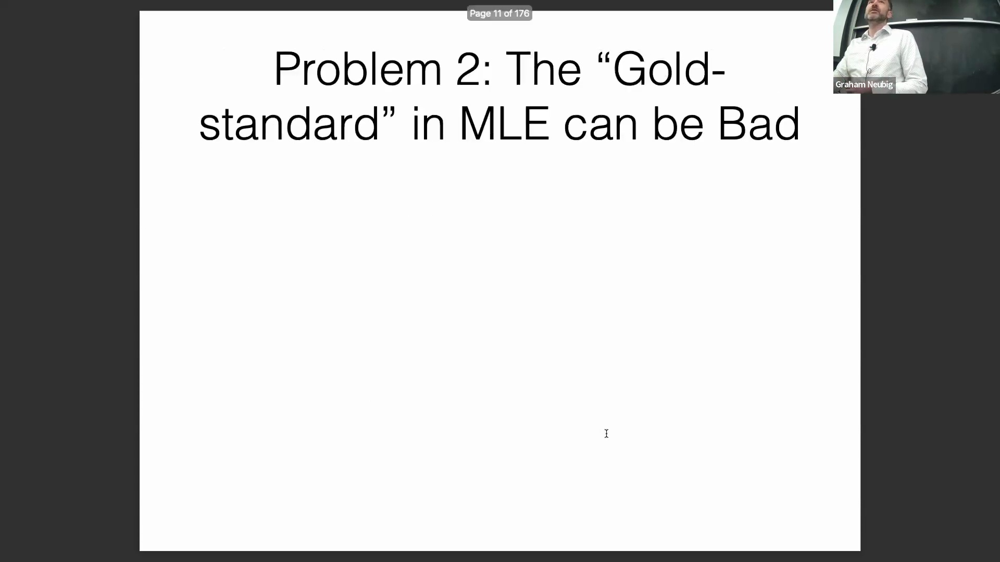

## 有缺陷的黄金标准数据(Gold Standard Data)问题
MLE 的另一大缺陷在于其高度依赖往往不完美或含有噪声的参考数据集。训练语料库中常混杂着有害评论、虚假信息或低质量的机器生成文本（例如早期模型的过时自动翻译结果）。当模型严格从这些存在缺陷的“黄金标准”中学习时，不可避免地会内化并复现不良的语言模式。这凸显了引入高质量纯净数据，或转向依赖反馈驱动(Feedback-driven)训练信号的必要性。
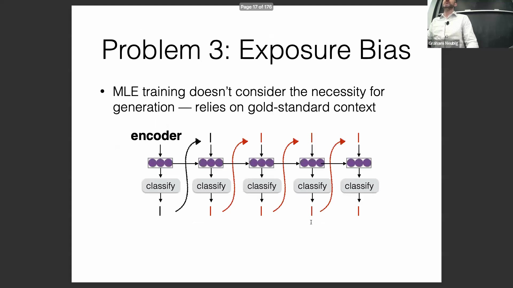

## 曝光偏差(Exposure Bias)与生成质量退化
MLE 训练还面临曝光偏差(Exposure Bias)问题，即训练阶段与推理阶段的输入条件存在不匹配。在训练过程中，模型始终接收完美的真实前序词元(Ground-truth Tokens)作为输入（即教师强制机制），这意味着它们从未学习过如何从自身生成的错误中恢复。这常导致推理阶段的性能退化，尤其是出现重复循环现象(Repetition Loops)（例如无休止地重复“我要去匹兹堡”）。引入生成完整序列、对其进行打分并对劣质输出施加惩罚的替代性训练范式，有助于提升模型对自身生成错误的鲁棒性(Robustness)。
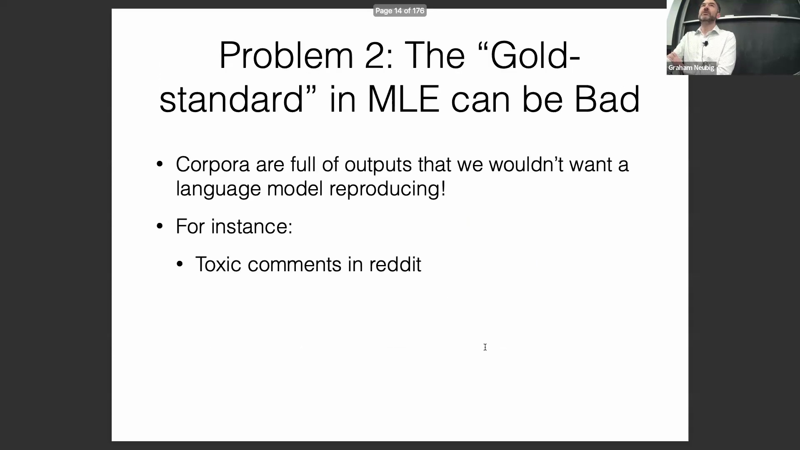

## 评估输出质量的方法
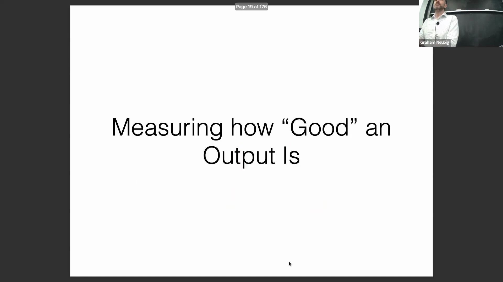
要突破 MLE 的局限，必须建立可靠的方法来评估模型输出。现有的评估策略通常可划分为四类：客观评估(Objective Evaluation)、人类主观标注(Human Annotation)、基于机器预测的偏好建模(Machine-Predicted Preference Modeling)以及下游任务效用(Downstream Task Utility)。对于具有明确标准答案的任务（如数学求解或文本分类），客观评估极为有效，因为此类任务的评判标准通常是二值化(Binary)且易于验证的。
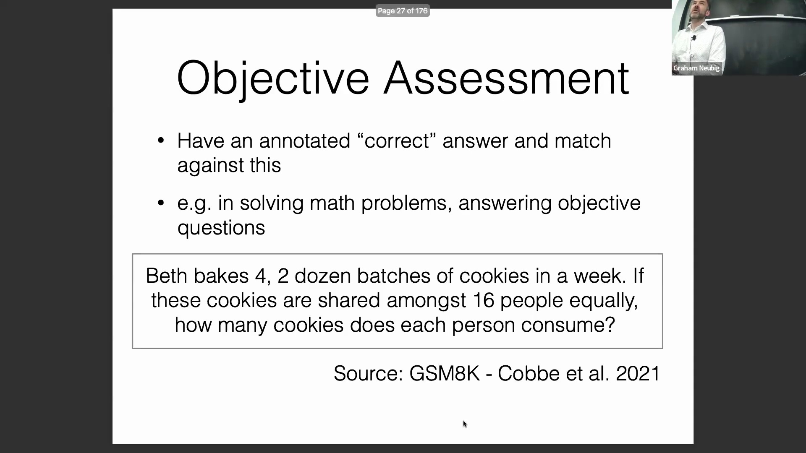

## 人类评估(Human Evaluation)与直接评估法(Direct Assessment, DA)的挑战
对于缺乏单一标准答案的开放式生成任务，人类评估(Human Evaluation)是主要的基准方法。其中广泛应用的一种技术是直接评估法(Direct Assessment, DA)，即由标注者为生成输出的整体质量分配一个标量分数(Scalar Score)（例如 1-10 分）。尽管该方法概念直观，但在保证标注者间一致性(Inter-annotator Agreement)和规避主观解读偏差方面面临显著困难。在实践中，若缺乏高度标准化的评分细则(Rubrics)与专家级评估人员，想要获得可靠且一致的数值评分极具挑战性。
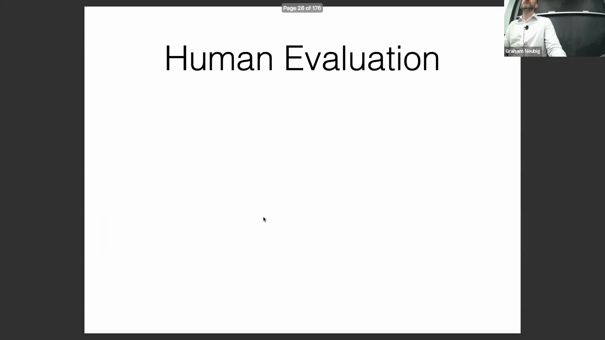
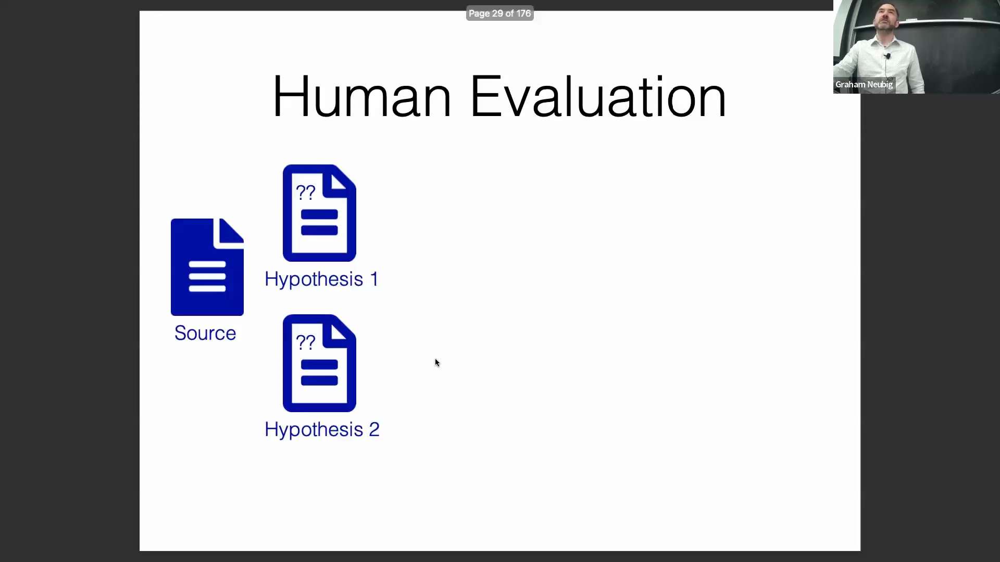

## 多维度特征评估(Multi-dimensional Feature Evaluation)
为克服整体评分的局限性，现代评估框架将生成质量拆解为具体、可量化的特征维度。常见的评估维度包括：流畅度(Fluency，指语言表达的自然程度)、充分性(Adequacy，指对源输入语义的忠实度)、事实性(Factuality，指基于给定语境或常识的准确程度)以及连贯性(Coherence，指上下文逻辑的连贯与通顺程度)。这些特征维度的相关性与权重高度依赖于具体应用场景，在机器翻译(Machine Translation)、对话式人工智能(Conversational AI)与文本摘要(Text Summarization)等任务中存在显著差异。

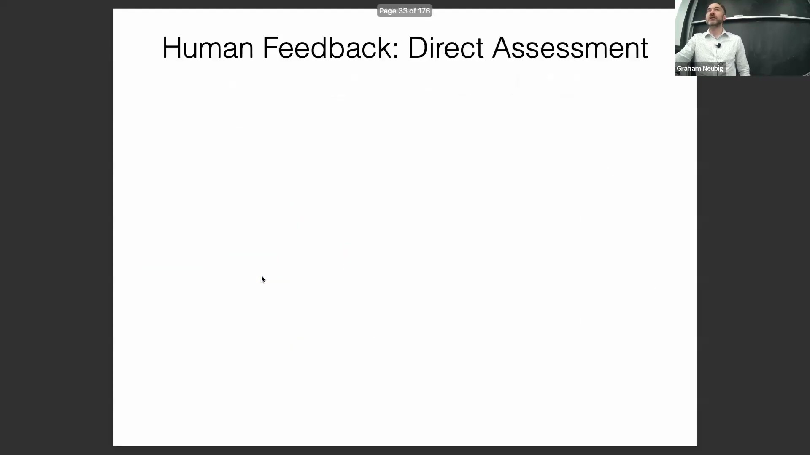

## 实施的最佳实践(Best Practices)
强烈建议研究开发者在设计自定义评估指标(Custom Evaluation Metrics)前，优先参考目标领域内成熟的评估文献。通过采用经过实证检验且贴合特定任务的评估框架，开发者能够确保为模型训练构建更具一致性且可操作的反馈闭环(Feedback Loop)。本节内容至此告一段落，欢迎就反馈收集、训练算法及评估设计等议题展开提问与交流。
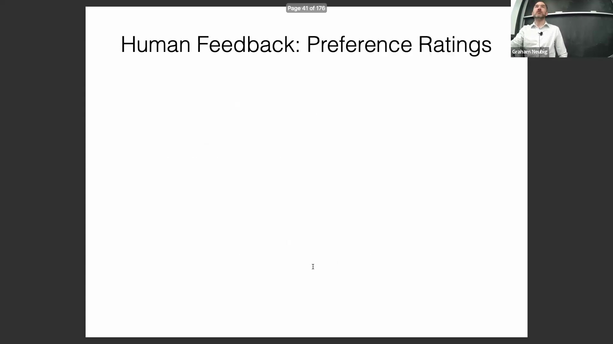

---

## 偏好评分：比较反馈与局限性
下一类反馈依赖于偏好评分(Preference Rating)，标注员需比较两个或多个模型输出，判定孰优孰劣，或判断其质量是否相当。例如，面对“寄送包裹到东京”这一请求的几种略有差异的表述时，人类通常能轻易达成共识，选出更优版本，即便两者均非完美。相较于绝对评分(Absolute Scoring)，这种比较法通常更易于保持标注的一致性。然而，它存在一个关键缺陷：无法评估模型本身的绝对质量。即便对两个表现欠佳的系统进行排序，仍会得出一个“胜者”，但这并不意味着该模型已具备实际部署的条件。同样，若比较两个能力俱佳的系统，可能仅会凸显出流畅度上的细微差异，导致难以据此做出实质性决策。

## 用于细粒度偏好的并列评估
为兼顾直接评分与相对偏好的优势，可采用并列评估(Tie-breaking Evaluation)方法。在该方法中，标注员需独立为每个输出分配带小数的分数，且被强制要求不得打出相同分数。此举强制引入了细微的偏好差异（例如，在5分制下打出5.00与4.99），同时仍能保留对绝对质量的判断。这种混合策略有助于克服严格偏好评分(Strict Preference Rating)或分数并列(Tied Scores)的局限性。

## 使用 Elo 和 TrueSkill 排名扩展比较规模
偏好评分面临的主要挑战之一是人类认知负荷(Cognitive Load)：人们难以可靠地同时比较数十个系统。为解决这一问题，Chatbot Arena等评估框架引入了Elo或TrueSkill等排名算法(Ranking Algorithms)。此类算法最初专为国际象棋等竞技博弈设计，其核心依赖于成对比较(Pairwise Comparison)。将所有对战胜负结果输入算法后，系统即可为每个模型计算出全局排名分数。这使得研究人员仅需借助易于管理的人工成对评估，即可推导出全面的模型性能排行榜(Model Leaderboard)。

## 错误标注与多维质量指标（MQM）
作为整体评分(Holistic Scoring)的替代方案，错误标注(Error Annotation)旨在识别并归类输出中的具体错误。多维质量指标(Multidimensional Quality Metrics, MQM)借鉴了成熟的机器翻译(Machine Translation)实践，是该领域的一个标杆性框架。标注员需标记特定文本片段，指定错误类型（如准确性错误(Accuracy Errors)、语言规范违规(Convention Violations)），并评定严重程度（轻微、严重或关键）。该方法能够提供细粒度、可操作的反馈，并显著提升标注者间一致性(Inter-annotator Agreement)，因为评判单个词或短语的主观性远低于对整段文本进行整体打分。其主要缺点在于极其耗时，尤其在处理长文本输出时更为明显。

## 自动评估与奖励模型
作为人类反馈(Human Feedback)的高可扩展替代方案，自动评估(Automatic Evaluation)利用算法来预测人类偏好或评分。其典型设置包含源输入(Source Input)、候选模型输出(Candidate Output)，以及可选的人工编写参考文本（即黄金标准/Gold Standard）。尽管人类评判仍是质量评估的标杆，但自动指标对于模型快速迭代至关重要。依据应用领域不同，这些系统通常被称为自动评估指标（应用于机器翻译与文本摘要(Text Summarization)）或奖励模型(Reward Model)（应用于强化学习(Reinforcement Learning)与大语言模型(Large Language Model)微调）。尽管术语各异，但其核心目标一致：预测模型输出与人类期望的契合度，并为模型生成合适的奖励信号(Reward Signal)。

## 基于嵌入的评估与 BERTScore
自动评估的一个主流范式是基于嵌入(Embedding-based)的相似度计算，以BERTScore为代表。该无监督方法(Unsupervised Method)通过计算参考文本与候选输出中词元(Tokens)嵌入向量间的相似度来评估质量。通过构建两两余弦相似度矩阵(Pairwise Cosine Similarity Matrix)，该指标能够在语义层面(Semantic Level)评估文本对齐情况。取行（参考词元）的最大相似度用于计算召回率(Recall)，反映模型捕获了多少参考文本中的概念。取列（候选词元）的最大相似度用于计算精确率(Precision)，体现生成的概念中有多少与参考文本相匹配。最终，这些精确率与召回率值可综合为F值(F-measure)或类似指标，从而得出最终的质量评分。

---

## 基于嵌入的评估：BERTScore 与 TF-IDF 加权
在基于嵌入的指标(Embedding-based Metrics)基础上，评估者可计算结合TF-IDF加权的F值(F-measure)，以突出低频且富含信息的词汇(Content-rich Words)。该方法能确保关键语义错误（如专有名词误译(Proper Noun Mistranslation)）受到的惩罚远大于轻微的文体差异(Stylistic Variations)。此方法与检索增强生成(Retrieval-Augmented Generation, RAG)语境中探讨的冷启动检索(Cold-start Retrieval)目标高度契合，表明自然语言处理评估子领域的发展正呈现出趋同态势。BERTScore 依然是一个高度易用、开箱即用(Off-the-shelf)的指标，其代码库对开发者友好，便于在实际场景中部署。

## 基于监督回归的指标
基于回归的评估(Regression-based Evaluation)在监督学习(Supervised Learning)框架下运行，依赖大量人工标注的判断数据。依据反馈形式是直接数值分数(Numeric Scores)还是成对偏好(Pairwise Preferences)，模型将采用均方误差(Mean Squared Error, MSE)或基于排名的损失函数(Ranking-based Loss Functions)等目标函数进行训练。一个典型代表是COMET，该指标在机器翻译(Machine Translation)评估领域长期保持最先进(SOTA)水平。其卓越性能得益于数十年来积累的海量机器翻译评估数据，这些数据为监督训练提供了坚实基础。然而，该方法具有强烈的数据依赖性，在缺乏高质量标注评估数据的新型自然语言处理(NLP)任务中往往难以适用。

## 大语言模型驱动的评估与固有偏见
当前领域正日益采用基于问答(Question-Answering, QA)的评估方法，即通过设计提示词(Prompt)，引导强大的大语言模型(Large Language Model, 如GPT-4)直接对候选输出进行评分。GEMBA等框架便是该方法的典型应用，它要求大语言模型参照人工参考译文(Reference Translation)，以连续刻度(Continuous Scale)的形式对翻译质量进行打分。尽管先进模型能产出具有竞争力的评估结果，但其表现往往高度不可预测，且对提示词工程(Prompt Engineering)极为敏感。一个主要的局限在于其固有的自我偏见(Self-bias)：大语言模型倾向于给自身生成的内容打出更高分数。此外，古德哈特定律(Goodhart's Law)在此同样适用：若针对基于大语言模型的评估指标（尤其是无参考变体(Reference-free Variants)）进行显式优化，会迅速削弱该指标的有效性，因为模型将学会“迎合”或“钻营”评分模式，而非真正提升输出质量。

## 利用大语言模型进行细粒度错误识别
为缓解大语言模型在整体评分(Holistic Scoring)中的不一致性问题，研究重心已逐渐转向细粒度错误识别(Fine-grained Error Detection)。提示词设计不再要求模型给出单一的整体质量分数，而是强制其明确指出文本中的具体错误并进行分类。实证研究(Empirical Studies)表明，这种针对性方法能显著提升评估结果的一致性。有趣的是，这一现象与人工标注(Manual Annotation)的特性高度吻合：指导标注员识别离散错误(Discrete Errors)而非分配抽象分数，同样能大幅提高标注者间一致性(Inter-annotator Agreement)。这表明，无论是对于人类还是模型而言，细粒度反馈(Fine-grained Feedback)在本质上均更为可靠。

## 理解评估中的模型自我偏见
大语言模型倾向于高估自身输出这一已被广泛记录的现象，可通过概率空间动态(Probability Space Dynamics)机制加以解释。模型天然倾向于生成落入其内部嵌入空间(Embedding Space)高概率区域的序列。这些高概率区域通常与更高的输出质量正相关，因为模型在此类区域生成的文本具有更高的置信度(Confidence)，且更贴合其训练数据分布(Training Distribution)。当大语言模型评估外部文本时，若识别出文本序列落入其熟悉的“高概率片段”，统计上会更倾向于给出正面评价。由于模型在架构设计上本就倾向于生成高概率文本，这便形成了一种系统性的评估偏见(Systematic Evaluation Bias)，导致其在评估时相较于其他模型的输出，会更偏袒自身生成的内容。

## 元评估：关联自动评分与人工评分
为验证自动评估指标(Automatic Evaluation Metrics)或奖励模型(Reward Model)的可靠性，研究人员引入了元评估(Meta-evaluation)——即对“评估方法本身”进行有效性检验。该过程系统地将自动指标的预测结果与既定的人工判断(Ground Truth Human Judgments)进行对比。两者的一致性通常通过统计秩相关性(Statistical Rank Correlation)进行量化，常用指标包括皮尔逊相关系数(Pearson Correlation Coefficient)或肯德尔等级相关系数(Kendall's Rank Correlation Coefficient)。较高的相关系数表明该自动指标能可靠地模拟人类偏好，从而验证了其作为模型训练与基准测试(Benchmarking)流水线中可扩展的人类评估替代方案的有效性。

---

## 元评估与指标验证
为验证自动评估指标(Automatic Evaluation Metrics)的可靠性，研究人员会开展元评估(Meta-evaluation)，将指标的预测输出与人工判断(Human Judgments)进行对比。针对成对偏好数据(Pairwise Preferences)，可计算简单的准确率(Accuracy)；而对于直接评分(Direct Scoring)，则通常测量绝对误差(Absolute Error)。若新指标的提出方未报告此类元评估结果，则应对其可靠性持审慎态度。可靠的验证通常依赖大规模、标准化的数据集，例如WMT机器翻译研讨会(Workshop on Machine Translation)共享任务提供的数据集。这是因为小规模数据集往往缺乏评估指标性能所需的统计功效(Statistical Power)。

## 内在评估与外在评估
评估策略通常可划分为两类：内在评估(Intrinsic Evaluation)与外在评估(Extrinsic Evaluation)。内在评估旨在衡量生成文本本身的固有质量，通常通过人工直接评分(Direct Human Scoring)来实现。外在评估则侧重于衡量模型输出在下游任务(Downstream Tasks)中的实际效用。例如，可将大语言模型(Large Language Model, LLM)生成的摘要输入问答系统(Question-Answering System)并测量答案准确率(Accuracy)；亦可通过评估其对现实世界结果（如招聘决策或医疗诊断）的预测能力来进行验证。尽管外在评估通常能提供清晰、客观的基准真值(Ground Truth)，但其评估路径具有高度间接性：很难明确区分下游性能(Downstream Performance)的下降究竟源于大语言模型摘要质量不佳，还是下游模型本身存在缺陷。因此，业界通常建议将内在评估与外在评估结合使用，以获得更全面的性能画像。

## 人工标注分数的标准化
在汇总人工评估结果时，必须解决标注者间偏差(Annotator Bias)问题（例如，部分评分者习惯性偏严或偏宽）。WMT等框架常用的一种解决方案是Z分数标准化(Z-score Normalization)。该方法将每位标注者的原始分数转换为均值为零、方差为一的分布，从而在跨评分者计算平均值前有效消除个体偏差(Individual Bias)。此外，标注者间分歧(Inter-annotator Disagreement)极大的样本通常会被过滤剔除。因为在人类自身都无法达成共识的情况下，要求评估指标给出公平合理的预测是不切实际的。

## 代码生成领域的评估范式
在代码生成(Code Generation)领域，评估范式高度倾向于采用基于执行结果的外在指标。系统通常依据生成代码能否通过预定义的单元测试(Unit Tests)来进行评判。尽管这种二元的通过/失败(Pass/Fail)信号极具实用性且应用广泛，但它往往忽略了关键的内在质量维度，如代码可读性(Readability)、可维护性(Maintainability)、对编程规范(Programming Guidelines/Style Guides)的遵循程度，以及代码架构的优雅性。因此，全面的代码生成评估策略应在代码执行成功率(Execution Success Rate)与这些常被忽视的定性维度(Qualitative Dimensions)之间取得平衡。

## 基于误差与风险目标的训练
从评估阶段过渡到模型训练(Model Training)，优化过程的核心在于最小化“误差”(Error)，即衡量生成输出的劣质程度（例如计算 `1 - quality_score`）。模型部署的最终目标是最小化系统实际生成的单一输出(Single Output)所对应的误差。然而，直接通过梯度下降(Gradient Descent)优化该误差并不可行，因为文本生成过程涉及 `argmax`（取最大值）或随机采样(Random Sampling)等离散且不可微(Non-differentiable)的操作。为克服这一障碍，训练过程引入了“风险”(Risk，特指最小贝叶斯风险 Minimum Bayes Risk, MBR)概念，用于计算所有可能候选输出的*期望误差*(Expected Error)。通过对潜在输出按其生成概率进行加权，风险函数构建了一个可微的目标函数(Differentiable Objective Function)。这使得基于梯度的优化方法能够在训练期间有效驱动模型，使其输出与目标评估指标实现对齐(Alignment)。

---

## 文本生成中的可微性与组合挑战
模型本质上是可微的(Differentiable)，这使得基于梯度的优化(Gradient-based Optimization)变得直接明了。然而，将其直接应用于文本生成会带来巨大的计算障碍：对输出空间中的所有潜在序列进行求和在数学上是难解的(Intractable)。例如，当序列长度(Sequence Length)仅为 50、词表大小(Vocabulary Size)为 30,000 时，模型将面临 $30,000^{50}$ 种可能的组合，这使得在整个输出空间上计算精确的数学期望变得不可能。

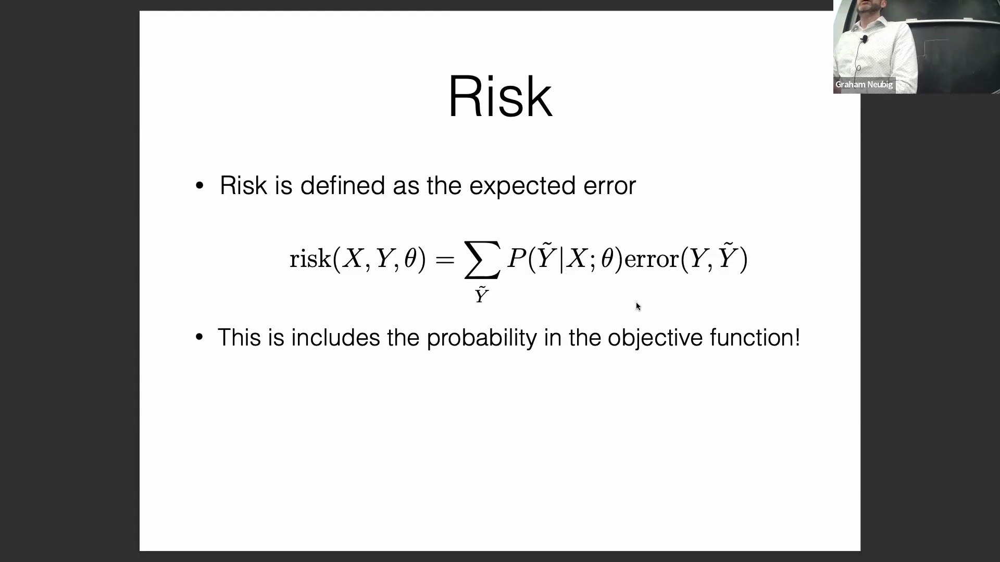

## 最小风险训练及其与强化学习的联系
最小风险训练(Minimum Risk Training)被引入为一个旨在显式最小化期望风险(Expected Risk)的框架。这一概念与强化学习(Reinforcement Learning)天然契合，因为许多现代强化学习方法（尤其是策略梯度方法(Policy Gradient)）都共享相同的最小化风险目标。在探讨当今更为复杂的强化学习算法之前，首先从风险最小化的角度切入，能够提供一个逻辑清晰且易于理解的基础。

## 使用采样技术近似风险
为使风险优化在计算上可行，采样(Sampling)被用作一种实用的近似手段。模型不再对所有可能的输出进行求和，而是从假设空间中抽取一小部分子集，将其概率重新归一化，并基于这个规模可控的集合进行优化。尽管祖先采样(Ancestral Sampling)在理论上成立，但将采样温度(Sampling Temperature)设为 1 通常会导致模型探索大量低质量输出区域，从而降低生成质量。因此，从业者通常倾向于使用集束搜索(Beam Search)或调整温度参数来生成更高质量的候选序列。关键在于，采样过程必须进行去重或采用无放回抽样(Sampling without replacement)，以避免重复输出干扰概率归一化。

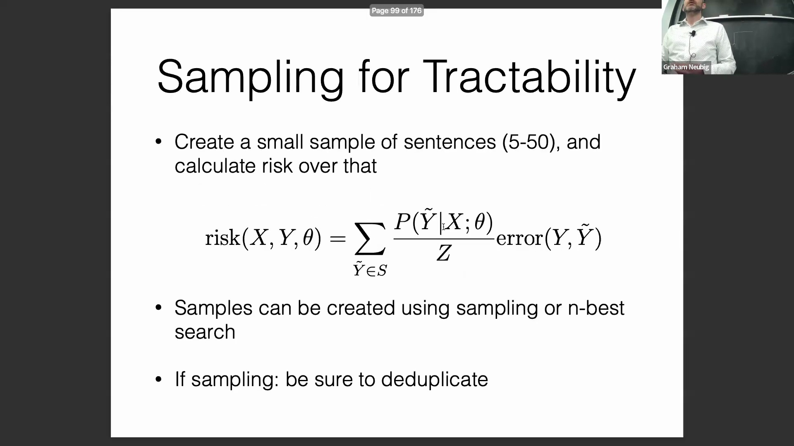

## 面向自然语言处理的强化学习定义
强化学习(Reinforcement Learning)的运行依赖于一个环境(Environment)，智能体(Agent)在其中观察状态(State, $X$)，采取动作(Action, $A$)，并获得延迟奖励(Delayed Reward, $R$)。以经典的 Pong 游戏为例：$X$ 为屏幕图像，$A$ 代表控制球拍向上或向下移动，$R$ 则是最终的胜负信号。在自然语言处理(Natural Language Processing)的语境下，该框架可被直观地映射：$X$ 转化为对话历史或输入上下文，$A$ 对应下一个词元(Token)的生成，而 $R$ 则是一个反馈信号，它通常在序列生成的后期才会出现，而非在每个词元生成后立即给出。

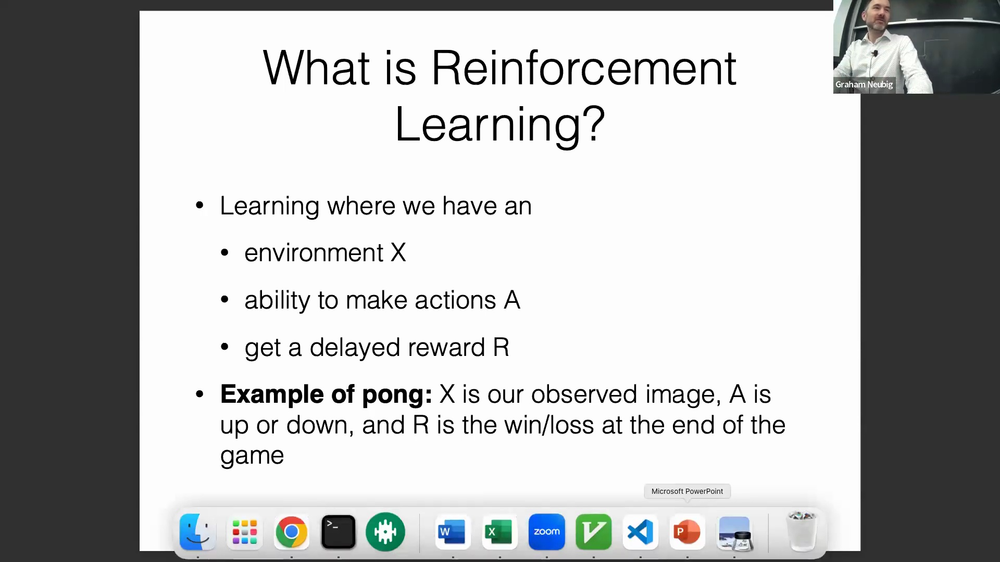

## 实际应用：上下文、动作与奖励
将该框架应用于代码生成(Code Generation)等任务时，充分凸显了强化学习奖励设计的灵活性。在此场景下，$X$ 涵盖编译器环境与周围的代码上下文，$A$ 仍为每个代码词元(Code Token)的生成，而 $R$ 则可来自多个维度：代码是否编译成功、可读性评分或执行效率。这种灵活的奖励设计使模型能够直接针对实际效用和特定质量指标进行优化，展现出标准最大似然估计(Maximum Likelihood Estimation, MLE)难以企及的优势。

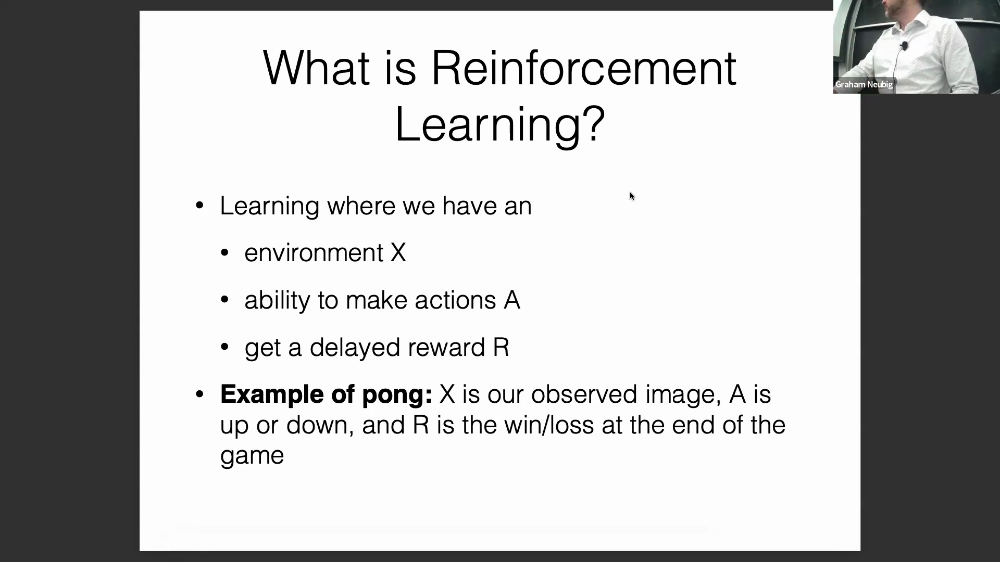

## 自然语言处理中强化学习的三个核心场景
在自然语言处理中，强化学习在以下三个主要场景中极具价值：
1. **延迟的人类反馈(Delayed Human Feedback)：** 对话系统(Conversational Systems)天然契合强化学习，因为奖励信号（如用户的点赞/点踩或呼叫中心任务是否成功达成）是在多轮交互结束后才获得的，而非针对每个词元实时给出。
2. **隐变量(Latent Variables)与思维链(Chain-of-Thought)：** 在思维链提示(Chain-of-Thought Prompting)中，中间的推理步骤属于隐变量。由于最终答案正确并不代表推理过程严谨，强化学习可基于最终的任务表现，反向优化底层的推理逻辑。
3. **序列级评估指标(Sequence-level Evaluation Metrics)：** 许多标准的 NLP 评估指标要求先生成完整的输出序列后才能计算得分。在缺乏强化学习的延迟奖励结构时，传统的词元级监督(Token-level Supervision)往往难以直接优化这些序列级目标。

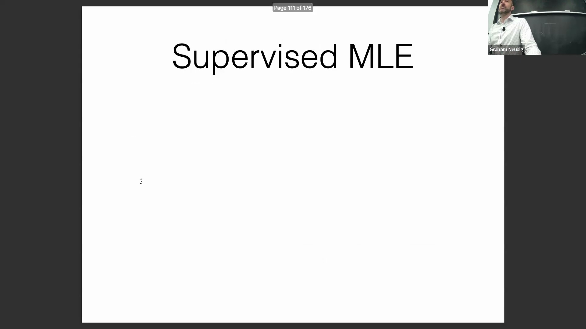

## 将强化学习与监督 MLE 损失相衔接
在明确了强化学习在自然语言处理中的应用动机与结构映射后，论述回归至基础概念。标准的监督最大似然估计(Supervised Maximum Likelihood Estimation)损失被重新审视，并在强化学习范式下进行了形式化重构，这为后续推导策略梯度(Policy Gradient)优化算法奠定了理论基础。

---

## 模仿学习与自训练基础
在强化学习(Reinforcement Learning)的语境下，标准的监督最大似然估计(Supervised Maximum Likelihood Estimation, MLE)通常被视作**模仿学习(Imitation Learning)**，即模型通过模仿教师演示(teacher demonstrations)来学习如何执行动作。其直接延伸是**自训练(Self-Training)**，该方法涉及从当前模型自身的分布中进行采样(Sampling)或取最大值(argmax)，随后最大化这些自生成输出的似然(Likelihood)。尽管在缺乏外部质量信号的情况下，这种方法存在放大模型自身错误的风险，但它仍能带来一定程度的准确率提升。如果模型本身的预测在大多数情况下是正确的，那么以自身输出为优化目标——并辅以早停(Early Stopping)等隐式正则化(Implicit Regularization)技术——可以将模型参数引导至更优的方向。

## 通过协同训练与输入噪声增强自训练
为克服纯自训练的局限性，研究人员开发了多种改进策略。**协同训练(Co-Training)**最初由卡内基梅隆大学(Carnegie Mellon University, CMU)提出，该方法利用多个模型进行交叉验证，且仅在模型间达成共识时才将生成的样本纳入训练集，从而进一步提升整体准确率。另一种有效的替代方案是在输入端注入噪声（例如词级 Dropout），使其分布更好地与模型生成输出时的噪声分布相契合。尽管这些方法颇具成效，但它们最终仍被引入显式奖励函数(Explicit Reward Function)的方法所超越。

## REINFORCE 算法与策略梯度
将奖励信号整合进训练过程的最直接方法是 **REINFORCE** 算法，这是一种基础的策略梯度(Policy Gradient)技术。REINFORCE 并非盲目地最大化自生成文本的似然，而是利用外部奖励信号(External Reward Signal)对标准损失函数(Loss Function)进行加权缩放。这种修改能够自然地提升高奖励序列的生成概率，同时抑制低奖励输出的出现，从而有效引导模型生成更高质量的内容。

## 与最大似然估计的等价性
此处引出了一个关键的理论问题：在何种条件下，REINFORCE 算法会退化为等价于标准的 MLE？当采用严格的 **0/1 损失函数(0/1 Loss Function)**（即精确匹配奖励(Exact Match Reward)）时，这种等价关系成立。在此设定下，仅当生成序列与目标序列完全匹配时奖励值为 1，否则为 0。然而，REINFORCE 的核心优势在于其高度的灵活性。与单一的精确匹配监督不同，该算法能够轻松兼容连续的奖励分数(Continuous Reward Scores)、部分得分(Partial Scores)以及对多个有效参考输出的加权处理。

## 序列生成中的信用分配问题
将策略梯度应用于自然语言处理(Natural Language Processing)时面临的一个根本性挑战是**信用分配(Credit Assignment)**：即确定序列中究竟是哪个词元(Token)或具体动作促成了最终获得的奖励。尽管理想情况下可以在每个词元生成后提供即时反馈，但这在实际应用中往往不可行。奖励信号通常只有在完整的生成轨迹(Generation Rollout)结束后才能获取。目前最常见的变通策略是简单地将**最终奖励(Final Reward)平均分配给序列中的每一个词元**，依赖优化算法隐式地完成信用分配。此外，开发者也可采用**衰减奖励(Discounted Reward)**（即引入折扣因子 Discount Factor）机制，使靠近序列末尾的词元获得比早期词元更高的权重，这符合“近期动作对最终结果影响更直接”的直观逻辑。

## 奖励来源与训练稳定性
奖励信号可源自多种渠道：直接的人类反馈(Human Feedback)（如点赞/点踩）、**预训练奖励模型(Pre-trained Reward Model)**的评估打分，或是与策略网络协同优化的奖励模型（如直接偏好优化 Direct Preference Optimization, DPO 等方法）。尽管在数学层面实现基础的 REINFORCE 目标函数十分直观，但强化学习在实际训练中却以极高的不稳定性著称。为实现模型的可靠收敛，通常需要进行细致的超参数调优(Hyperparameter Tuning)，并引入额外的稳定化技术，以防止训练发散或陷入模式崩溃(Mode Collapse)。在早期实践中，指数衰减(Exponential Discounting)曾是标准配置，但现代算法实现通常已对其进行了简化或替代。

---

## 对话中的上下文奖励分配
一种常见的实践做法是为当前话语(Utterance)中的所有词元(Token)分配相同的奖励，而对历史对话轮次给予零奖励。不过，具体的实现细节在不同的研究与工程流水线(Pipeline)中可能有所差异。

## 强化学习稳定性的核心挑战
自然语言处理(Natural Language Processing, NLP)中的强化学习面临显著的训练不稳定性，主要原因有二。首先，与最大似然估计(Maximum Likelihood Estimation, MLE)将参考文本与整个理论输出空间进行对比不同，强化学习仅基于单次采样输出进行优化。这会导致高方差(High Variance)，尤其是在庞大的词表空间(Vocabulary Space)中。其次，使用负奖励(Negative Reward)会带来严重风险。尽管惩罚不良输出（例如含有毒性(Toxicity)的文本）是必要的，但无意义序列的组合爆炸(Combinatorial Explosion)问题意味着，过度压低特定输出的权重极易导致模型完全偏离其预训练的语言建模(Language Modeling)基础分布。

## 稳定化策略 1：MLE 预训练
最基础的稳定化策略是在引入强化学习之前，先使用最大似然估计(MLE)进行预训练(Pre-training)。这为模型奠定了坚实的语言生成基线。然而，该方法存在明显局限性：它高度依赖目标领域的监督数据(Supervised Data)。当模型需要探索未知的状态空间(State Space)或处理动态上下文时，该方法往往难以奏效。例如，若客服聊天机器人(Chatbot)需在非检索增强生成(Retrieval-Augmented Generation, RAG)的条件下引用专有产品目录，仅靠 MLE 预训练便显得力不从心。

## 稳定化策略 2：KL 散度正则化
为防止训练过程中的灾难性分布偏移(Catastrophic Distribution Shift)，通常会引入正则化项，约束更新后的模型尽可能贴近参考语言模型(Reference Language Model)。其中主流的方法是 KL 散度正则化(KL Divergence Regularization)。其目标函数(Objective Function)由两部分组成：主项用于最大化高质量序列的奖励，辅助的 KL 正则项则用于惩罚新策略分布与参考模型分布之间的显著偏差。超参数 `beta` 用于控制两者的权衡(Trade-off)，决定了模型在优化外部奖励时，需在多大程度上保留原有的语言生成先验(Language Generation Prior)。

## 稳定化策略 3：近端策略优化（PPO）
**近端策略优化(Proximal Policy Optimization, PPO)** 提供了一种基于截断(Clipping)机制的替代性稳定方案。该算法通过计算给定输出在新旧策略下的概率比(Probability Ratio)来进行优化。通过将该比率约束在特定的信任域(Trust Region)内（具体实现对截断与未截断的目标函数取 `min` 操作），PPO 能够有效限制策略更新步幅，从而避免性能骤降。其核心逻辑在于最大化目标函数：若新策略的表现不及参考基线，或偏离原分布过远，截断机制会自动将优化梯度拉回稳健的原始策略方向。尽管 PPO 曾在业界广泛流行，但近年来的趋势显示，研究正逐渐转向实现更简捷的 KL 散度正则化方法，不过两者目前仍在实际应用中并存。

## 实际实现与工具库
实现上述复杂的强化学习稳定技术无需从零构建。诸如 Hugging Face 的 `trl`（Transformer Reinforcement Learning）等现代开源库，已提供成熟且开箱即用(Out-of-the-box)的 MLE 预训练流程、KL 正则化及 PPO 实现，极大地简化了 NLP 算法研究与工程部署(Engineering Deployment)的复杂度。

## 稳定化策略 4：基线减法（奖励归一化）
管理奖励方差(Reward Variance)的一项关键技术是引入基线(Baseline)。若忽视输入样本的难度差异，原始奖励分数极易产生误导。例如，翻译简单句子可能获得 `0.8` 的奖励，而翻译高度复杂或充满歧义的句子（如经典的“Buffalo buffalo Buffalo buffalo buffalo buffalo Buffalo buffalo”）可能仅得 `0.3`。若缺乏基线校准，模型会错误地惩罚高难度任务。通过从实际奖励中减去期望基线值（`reward - baseline`），算法可计算出相对优势信号(Advantage Signal)。这一机制能够准确捕捉“较低的绝对分数在特定难度下实则代表显著性能提升”的情形，确保优化过程充分考量任务难度差异，从而避免误导性的策略更新(Policy Update)。

---

## 预测样本难度与基线概念
为在训练过程中有效校准奖励，模型可*预先*预测输入样本的固有难度，并据此对奖励信号进行归一化(Normalization)。这引出了**基线模型(Baseline Model)**的核心概念。引入基线的根本目的并非改变策略梯度的期望值(Expected Policy Gradient)，而是显著降低奖励信号的方差(Variance)，从而提升强化学习(Reinforcement Learning)训练过程的稳定性与可靠性。
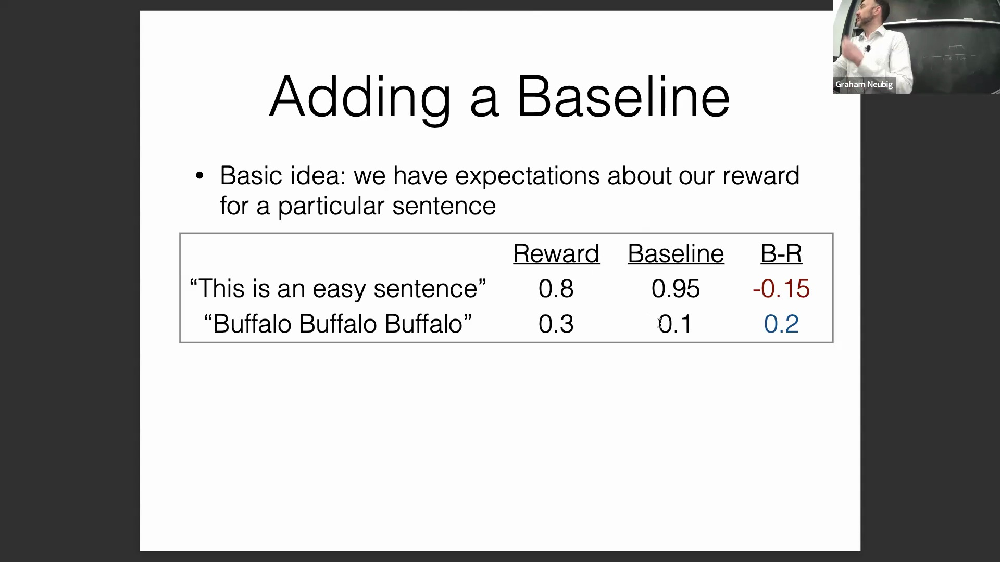

## 基线的实现：回归模型与批次平均
实现基线计算主要有两种广泛采用的方法。其一是训练一个独立的回归模型(Regression Model)，严格依据输入提示(Prompt)或解码器(Decoder)的隐藏状态来预估最终奖励。关键在于，该基线模型**绝不能**窥探策略模型实际生成的输出，否则将破坏基线估计的理论有效性。此方法既可在全局句子层面应用，也可在局部解码步长(Decoding Step)中实施。其二更为简便，即直接计算当前训练批次(Training Batch)的平均奖励，并从每个独立样本的奖励中扣除该均值，从而实现反馈信号的零中心化(Zero-centering)。

## 成对偏好学习与 DPO
基线建模的一种进阶扩展是针对同一输入对比成对输出(Pairwise Outputs)。通过直接引入成对人类偏好(Pairwise Human Preferences)，训练过程本质上趋于稳定，因为回复的相对质量得到了明确量化。这一原则构成了**直接偏好优化(Direct Preference Optimization, DPO)**的基石。DPO 作为一种主流方法，有效绕过了传统强化学习中计算密集的奖励建模(Reward Modeling)循环，大幅简化了模型对齐(Model Alignment)流程。其主要代价在于，DPO 强依赖高质量整理的配对数据集，其中需明确标注被偏好(Chosen)与被拒绝(Rejected)的输出。
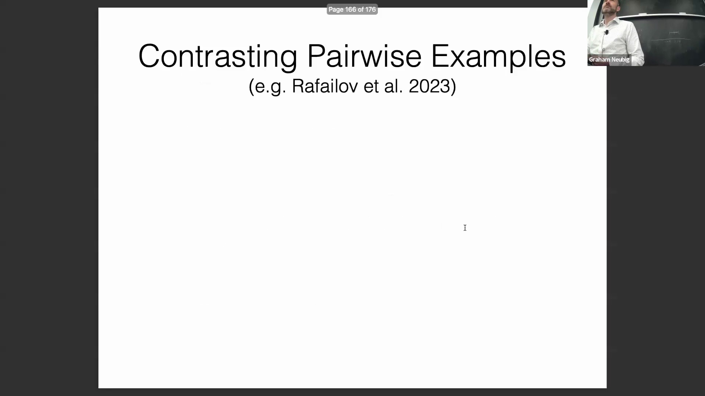

## 直接偏好优化的机制
DPO 的核心机制在于计算新策略与参考模型(Reference Model)针对每个生成序列的概率比(Probability Ratio)。其目标函数(Objective Function)旨在明确提升偏好（“更优”）输出的似然(Likelihood)，同时抑制被拒绝（“较差”）输出的似然。通过基于 Sigmoid 的损失函数直接优化该比率，DPO 能够实现与 PPO 或基于 KL 散度正则化的强化学习相媲美的对齐效果，且其优化地形(Optimization Landscape)更为简洁平稳。
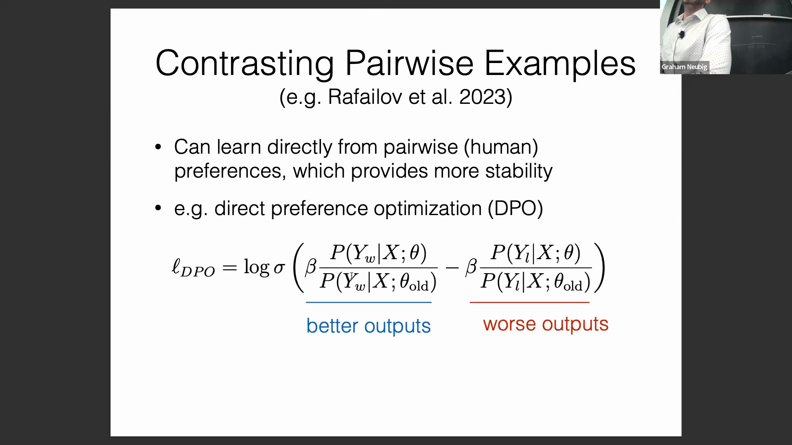

## Beta 超参数与 KL 正则化的作用
DPO 的目标函数高度依赖于 `beta` 超参数(Hyperparameter)，它在此充当缩放因子与温度参数的角色。`Beta` 值直接调节作用于对数概率比(Log Probability Ratio)的 Sigmoid 函数的陡峭度(Steepness)。较高的 `beta` 值会放大细微的概率差异，进而控制梯度更新的步幅。从理论层面看，该项衍生自标准 RLHF(Reinforcement Learning from Human Feedback) 中的 KL 散度正则化(KL Divergence Regularization)约束，旨在确保模型在拟合人类偏好的过程中，不会灾难性地偏离其原始的语言建模(Language Modeling)先验分布。
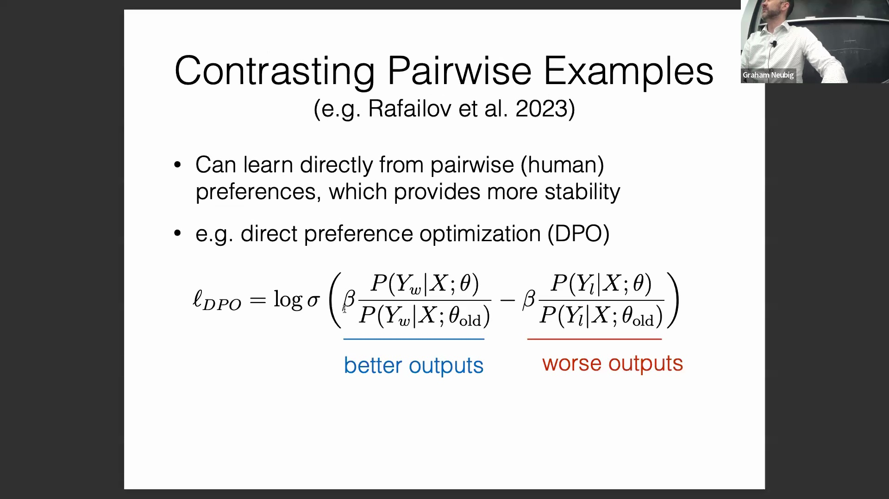
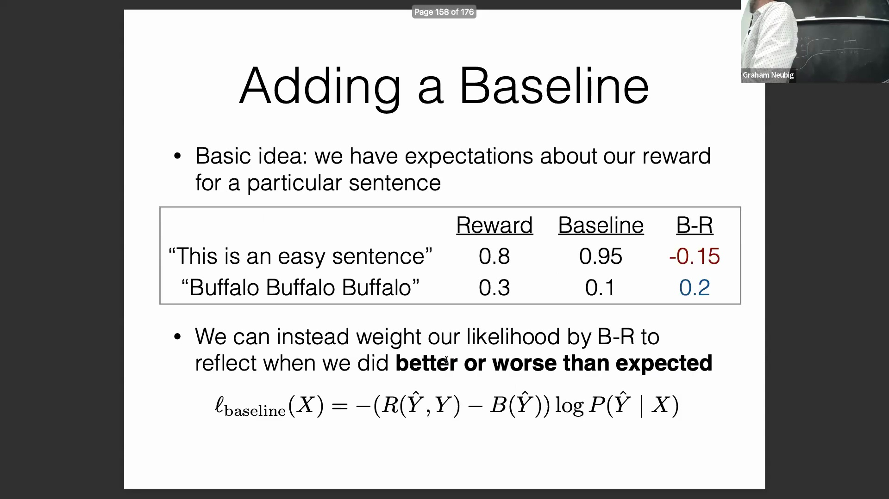
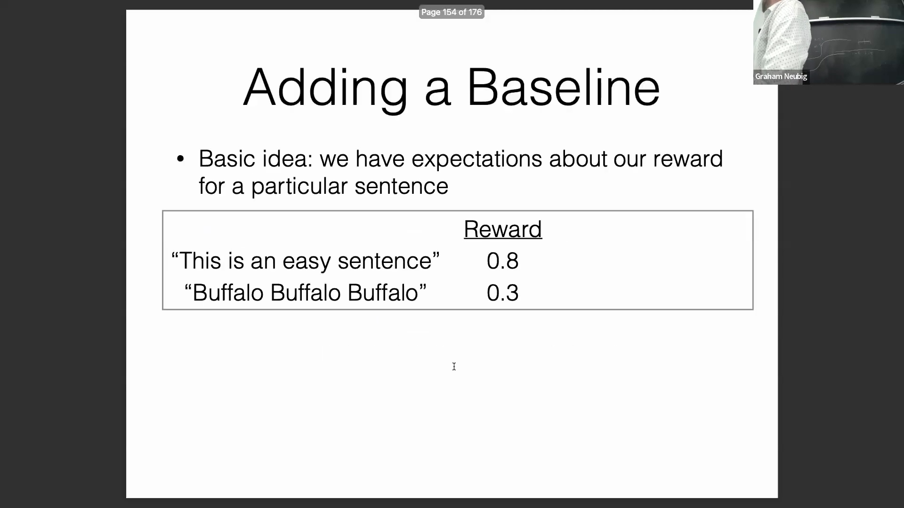

## 通过增大批次大小来降低方差
受强化学习固有的随机采样(Stochastic Sampling)特性影响，其训练过程表现出远高于标准最大似然估计(Maximum Likelihood Estimation, MLE)的方差。一种直接且高效的缓解策略是增大批次大小(Batch Size)或增加每次参数更新所执行的轨迹采样(Rollout)数量。若在引入基线或正则化项后仍面临稳定性瓶颈，单纯提升单步采样规模通常即可有效抑制梯度噪声(Gradient Noise)并改善模型收敛(Convergence)。
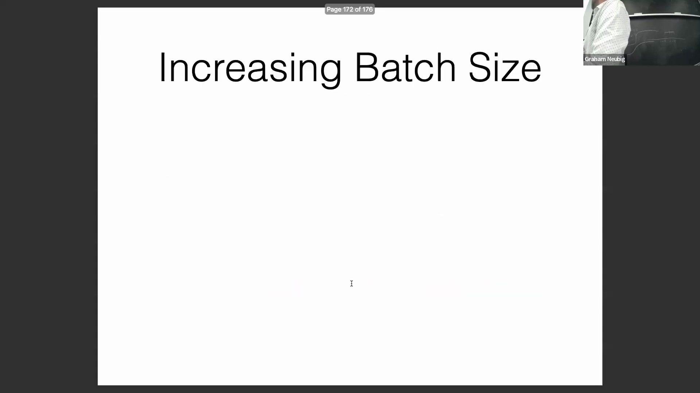
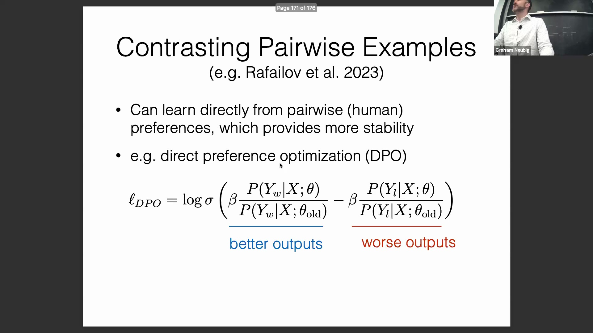

## 利用 Rollout 缓存提升效率
在强化学习流水线(Reinforcement Learning Pipeline)中，实时生成 Rollout 并收集奖励信号的计算开销极高。为最大化训练效率，开发者通常会对历史生成结果进行缓存(Caching)。通过在多个训练迭代中复用这些已保存的 Rollout，模型能够在免除持续实时生成成本的前提下，构造出更大的有效批次大小(Effective Batch Size)，进而实现更平滑、数据利用率更高(Data-Efficient)且资源节约的优化过程。

## 结语与问答
至此，关于自然语言处理(Natural Language Processing, NLP)中强化学习技术的概述暂告一段落。尽管强化学习为优化复杂的不可微目标(Non-differentiable Objectives)及推动模型与人类偏好对齐提供了强大范式，但其成功落地高度依赖于方差缩减(Variance Reduction)技术、精细的正则化(Regularization)策略以及高效的数据处理流程。
