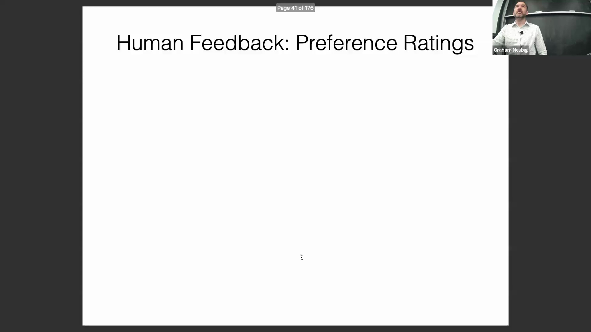
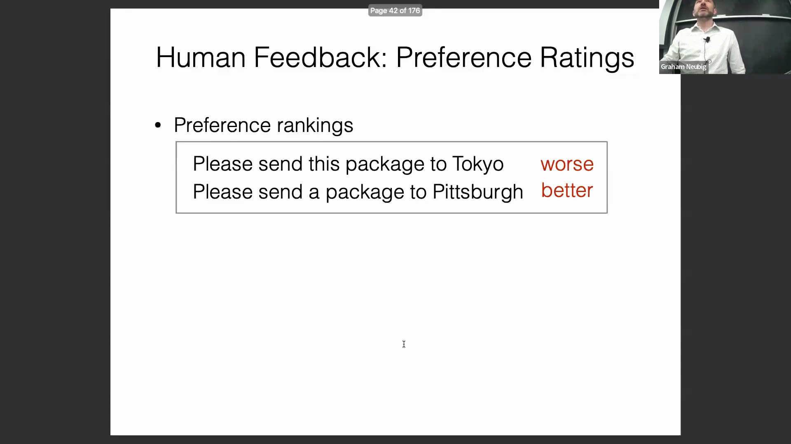
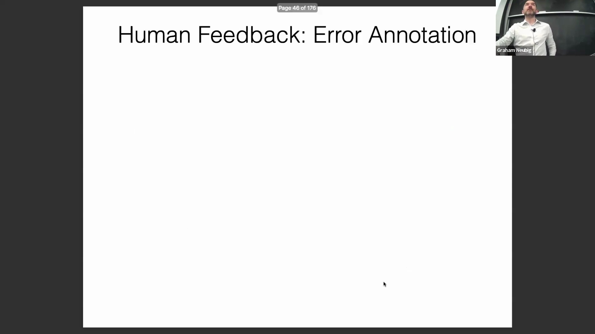
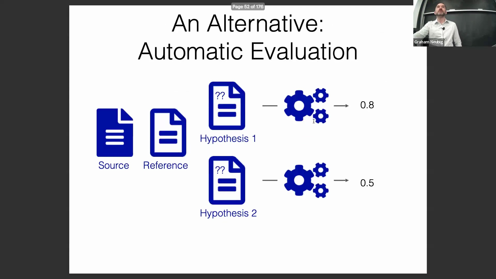
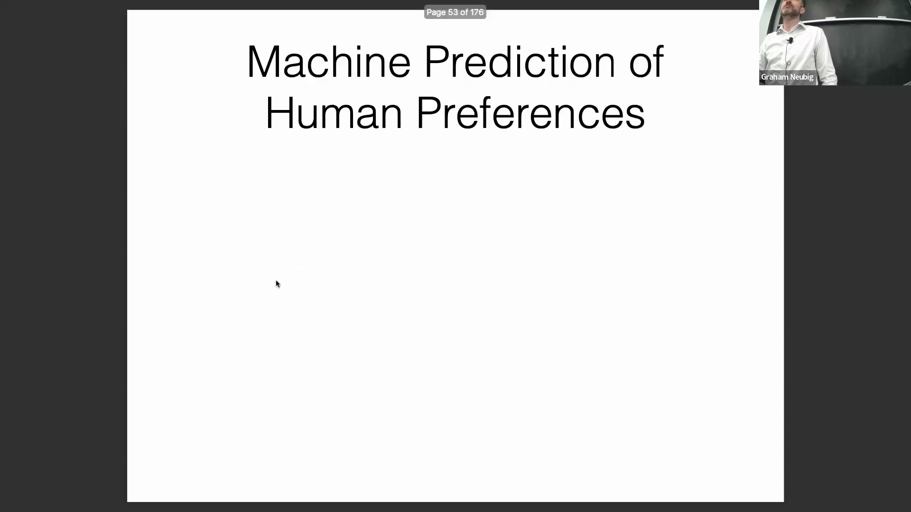
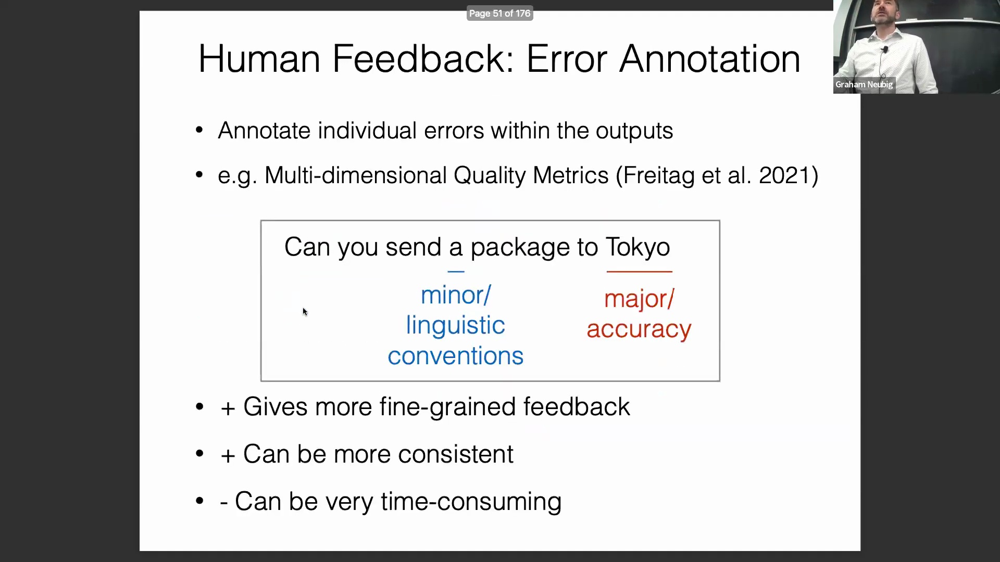
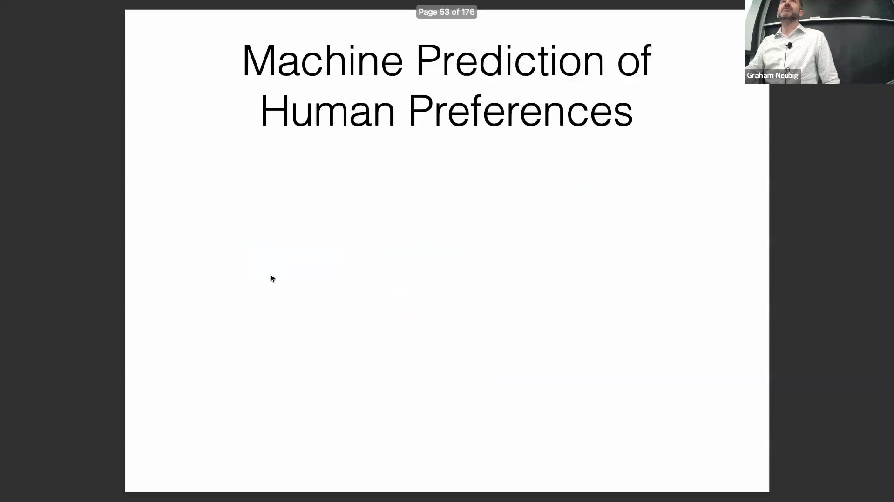

## 偏好评分：比较反馈与局限性
下一类反馈依赖于偏好评分(Preference Rating)，标注员需比较两个或多个模型输出，判定孰优孰劣，或判断其质量是否相当。例如，面对“寄送包裹到东京”这一请求的几种略有差异的表述时，人类通常能轻易达成共识，选出更优版本，即便两者均非完美。相较于绝对评分(Absolute Scoring)，这种比较法通常更易于保持标注的一致性。然而，它存在一个关键缺陷：无法评估模型本身的绝对质量。即便对两个表现欠佳的系统进行排序，仍会得出一个“胜者”，但这并不意味着该模型已具备实际部署的条件。同样，若比较两个能力俱佳的系统，可能仅会凸显出流畅度上的细微差异，导致难以据此做出实质性决策。

## 用于细粒度偏好的并列评估
为兼顾直接评分与相对偏好的优势，可采用并列评估(Tie-breaking Evaluation)方法。在该方法中，标注员需独立为每个输出分配带小数的分数，且被强制要求不得打出相同分数。此举强制引入了细微的偏好差异（例如，在5分制下打出5.00与4.99），同时仍能保留对绝对质量的判断。这种混合策略有助于克服严格偏好评分(Strict Preference Rating)或分数并列(Tied Scores)的局限性。

## 使用 Elo 和 TrueSkill 排名扩展比较规模
偏好评分面临的主要挑战之一是人类认知负荷(Cognitive Load)：人们难以可靠地同时比较数十个系统。为解决这一问题，Chatbot Arena等评估框架引入了Elo或TrueSkill等排名算法(Ranking Algorithms)。此类算法最初专为国际象棋等竞技博弈设计，其核心依赖于成对比较(Pairwise Comparison)。将所有对战胜负结果输入算法后，系统即可为每个模型计算出全局排名分数。这使得研究人员仅需借助易于管理的人工成对评估，即可推导出全面的模型性能排行榜(Model Leaderboard)。

## 错误标注与多维质量指标（MQM）
作为整体评分(Holistic Scoring)的替代方案，错误标注(Error Annotation)旨在识别并归类输出中的具体错误。多维质量指标(Multidimensional Quality Metrics, MQM)借鉴了成熟的机器翻译(Machine Translation)实践，是该领域的一个标杆性框架。标注员需标记特定文本片段，指定错误类型（如准确性错误(Accuracy Errors)、语言规范违规(Convention Violations)），并评定严重程度（轻微、严重或关键）。该方法能够提供细粒度、可操作的反馈，并显著提升标注者间一致性(Inter-annotator Agreement)，因为评判单个词或短语的主观性远低于对整段文本进行整体打分。其主要缺点在于极其耗时，尤其在处理长文本输出时更为明显。

## 自动评估与奖励模型
作为人类反馈(Human Feedback)的高可扩展替代方案，自动评估(Automatic Evaluation)利用算法来预测人类偏好或评分。其典型设置包含源输入(Source Input)、候选模型输出(Candidate Output)，以及可选的人工编写参考文本（即黄金标准/Gold Standard）。尽管人类评判仍是质量评估的标杆，但自动指标对于模型快速迭代至关重要。依据应用领域不同，这些系统通常被称为自动评估指标（应用于机器翻译与文本摘要(Text Summarization)）或奖励模型(Reward Model)（应用于强化学习(Reinforcement Learning)与大语言模型(Large Language Model)微调）。尽管术语各异，但其核心目标一致：预测模型输出与人类期望的契合度，并为模型生成合适的奖励信号(Reward Signal)。

## 基于嵌入的评估与 BERTScore
自动评估的一个主流范式是基于嵌入(Embedding-based)的相似度计算，以BERTScore为代表。该无监督方法(Unsupervised Method)通过计算参考文本与候选输出中词元(Tokens)嵌入向量间的相似度来评估质量。通过构建两两余弦相似度矩阵(Pairwise Cosine Similarity Matrix)，该指标能够在语义层面(Semantic Level)评估文本对齐情况。取行（参考词元）的最大相似度用于计算召回率(Recall)，反映模型捕获了多少参考文本中的概念。取列（候选词元）的最大相似度用于计算精确率(Precision)，体现生成的概念中有多少与参考文本相匹配。最终，这些精确率与召回率值可综合为F值(F-measure)或类似指标，从而得出最终的质量评分。