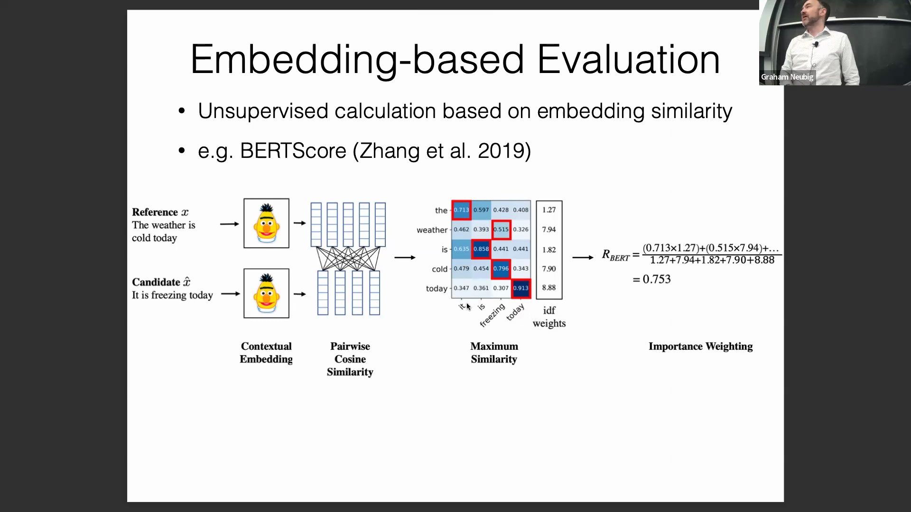
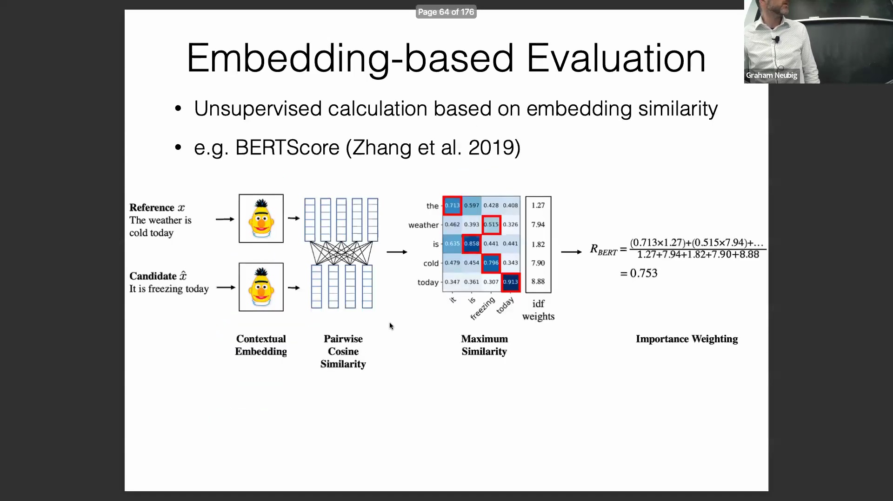
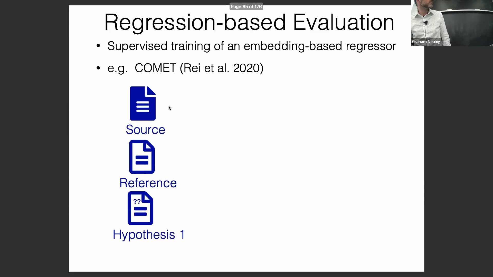
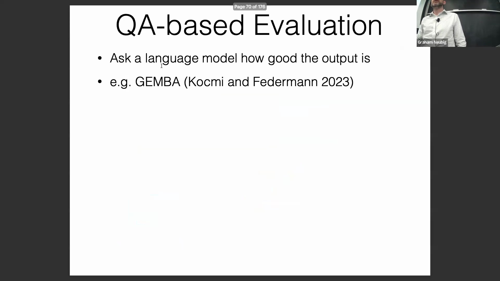
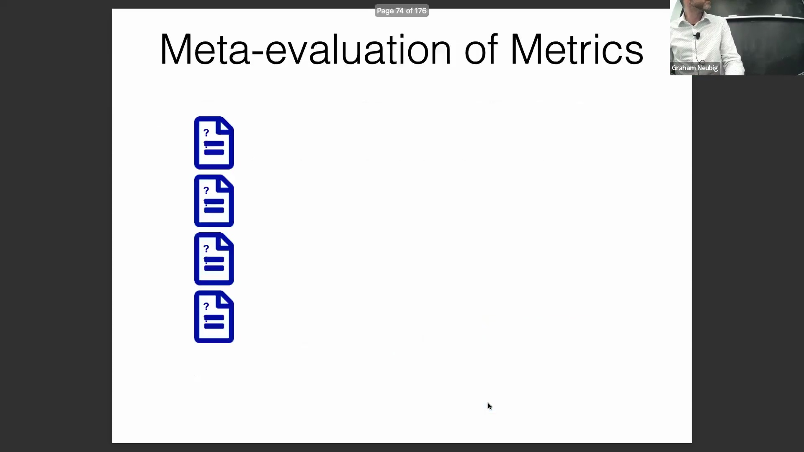
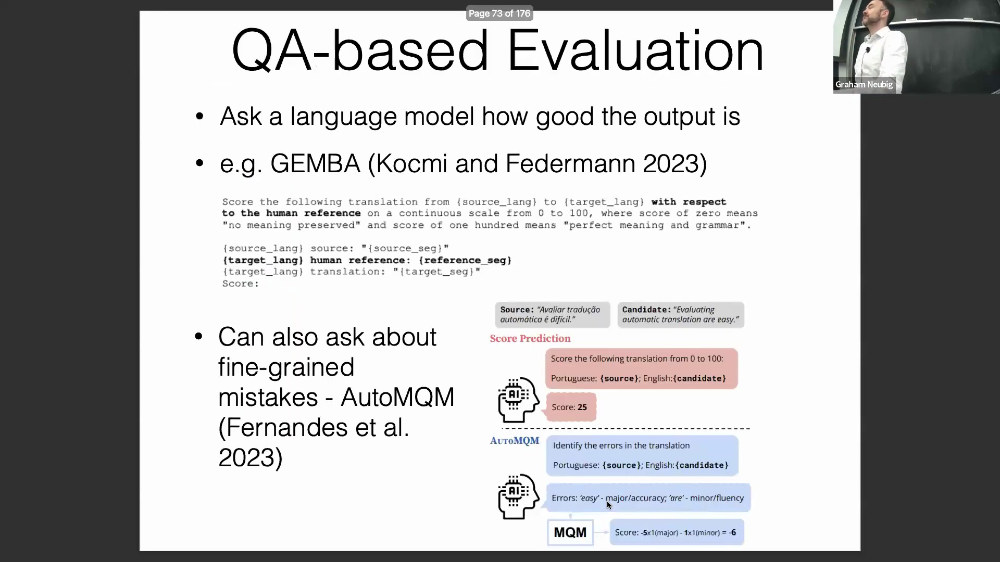

## 基于嵌入的评估：BERTScore 与 TF-IDF 加权
在基于嵌入的指标(Embedding-based Metrics)基础上，评估者可计算结合TF-IDF加权的F值(F-measure)，以突出低频且富含信息的词汇(Content-rich Words)。该方法能确保关键语义错误（如专有名词误译(Proper Noun Mistranslation)）受到的惩罚远大于轻微的文体差异(Stylistic Variations)。此方法与检索增强生成(Retrieval-Augmented Generation, RAG)语境中探讨的冷启动检索(Cold-start Retrieval)目标高度契合，表明自然语言处理评估子领域的发展正呈现出趋同态势。BERTScore 依然是一个高度易用、开箱即用(Off-the-shelf)的指标，其代码库对开发者友好，便于在实际场景中部署。

## 基于监督回归的指标
基于回归的评估(Regression-based Evaluation)在监督学习(Supervised Learning)框架下运行，依赖大量人工标注的判断数据。依据反馈形式是直接数值分数(Numeric Scores)还是成对偏好(Pairwise Preferences)，模型将采用均方误差(Mean Squared Error, MSE)或基于排名的损失函数(Ranking-based Loss Functions)等目标函数进行训练。一个典型代表是COMET，该指标在机器翻译(Machine Translation)评估领域长期保持最先进(SOTA)水平。其卓越性能得益于数十年来积累的海量机器翻译评估数据，这些数据为监督训练提供了坚实基础。然而，该方法具有强烈的数据依赖性，在缺乏高质量标注评估数据的新型自然语言处理(NLP)任务中往往难以适用。

## 大语言模型驱动的评估与固有偏见
当前领域正日益采用基于问答(Question-Answering, QA)的评估方法，即通过设计提示词(Prompt)，引导强大的大语言模型(Large Language Model, 如GPT-4)直接对候选输出进行评分。GEMBA等框架便是该方法的典型应用，它要求大语言模型参照人工参考译文(Reference Translation)，以连续刻度(Continuous Scale)的形式对翻译质量进行打分。尽管先进模型能产出具有竞争力的评估结果，但其表现往往高度不可预测，且对提示词工程(Prompt Engineering)极为敏感。一个主要的局限在于其固有的自我偏见(Self-bias)：大语言模型倾向于给自身生成的内容打出更高分数。此外，古德哈特定律(Goodhart's Law)在此同样适用：若针对基于大语言模型的评估指标（尤其是无参考变体(Reference-free Variants)）进行显式优化，会迅速削弱该指标的有效性，因为模型将学会“迎合”或“钻营”评分模式，而非真正提升输出质量。

## 利用大语言模型进行细粒度错误识别
为缓解大语言模型在整体评分(Holistic Scoring)中的不一致性问题，研究重心已逐渐转向细粒度错误识别(Fine-grained Error Detection)。提示词设计不再要求模型给出单一的整体质量分数，而是强制其明确指出文本中的具体错误并进行分类。实证研究(Empirical Studies)表明，这种针对性方法能显著提升评估结果的一致性。有趣的是，这一现象与人工标注(Manual Annotation)的特性高度吻合：指导标注员识别离散错误(Discrete Errors)而非分配抽象分数，同样能大幅提高标注者间一致性(Inter-annotator Agreement)。这表明，无论是对于人类还是模型而言，细粒度反馈(Fine-grained Feedback)在本质上均更为可靠。

## 理解评估中的模型自我偏见
大语言模型倾向于高估自身输出这一已被广泛记录的现象，可通过概率空间动态(Probability Space Dynamics)机制加以解释。模型天然倾向于生成落入其内部嵌入空间(Embedding Space)高概率区域的序列。这些高概率区域通常与更高的输出质量正相关，因为模型在此类区域生成的文本具有更高的置信度(Confidence)，且更贴合其训练数据分布(Training Distribution)。当大语言模型评估外部文本时，若识别出文本序列落入其熟悉的“高概率片段”，统计上会更倾向于给出正面评价。由于模型在架构设计上本就倾向于生成高概率文本，这便形成了一种系统性的评估偏见(Systematic Evaluation Bias)，导致其在评估时相较于其他模型的输出，会更偏袒自身生成的内容。

## 元评估：关联自动评分与人工评分
为验证自动评估指标(Automatic Evaluation Metrics)或奖励模型(Reward Model)的可靠性，研究人员引入了元评估(Meta-evaluation)——即对“评估方法本身”进行有效性检验。该过程系统地将自动指标的预测结果与既定的人工判断(Ground Truth Human Judgments)进行对比。两者的一致性通常通过统计秩相关性(Statistical Rank Correlation)进行量化，常用指标包括皮尔逊相关系数(Pearson Correlation Coefficient)或肯德尔等级相关系数(Kendall's Rank Correlation Coefficient)。较高的相关系数表明该自动指标能可靠地模拟人类偏好，从而验证了其作为模型训练与基准测试(Benchmarking)流水线中可扩展的人类评估替代方案的有效性。