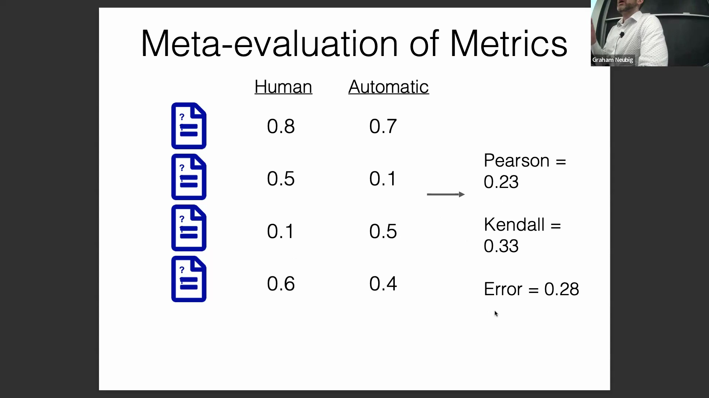
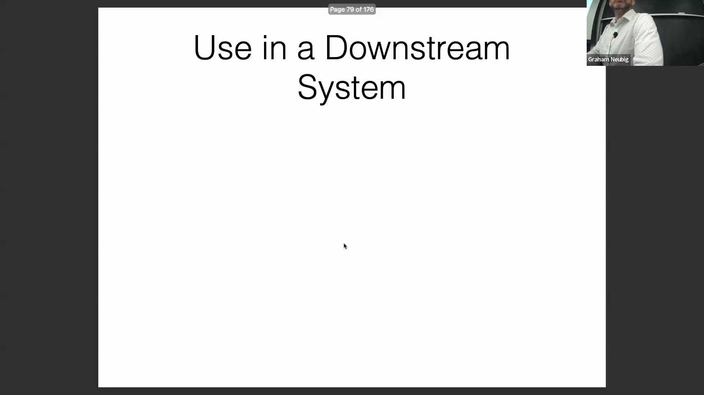
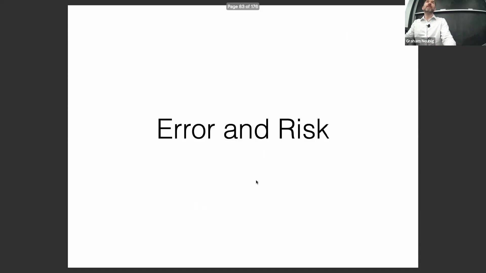
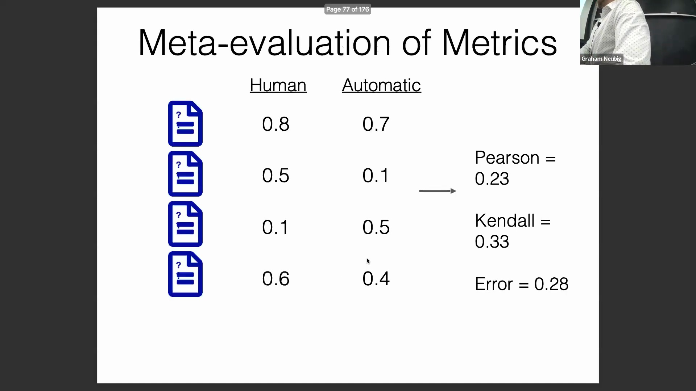
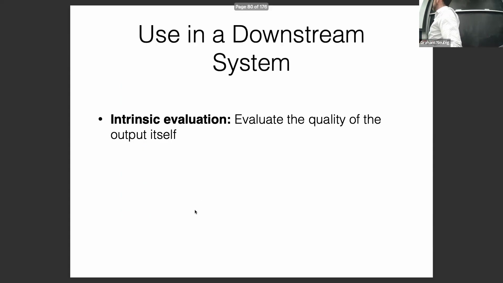
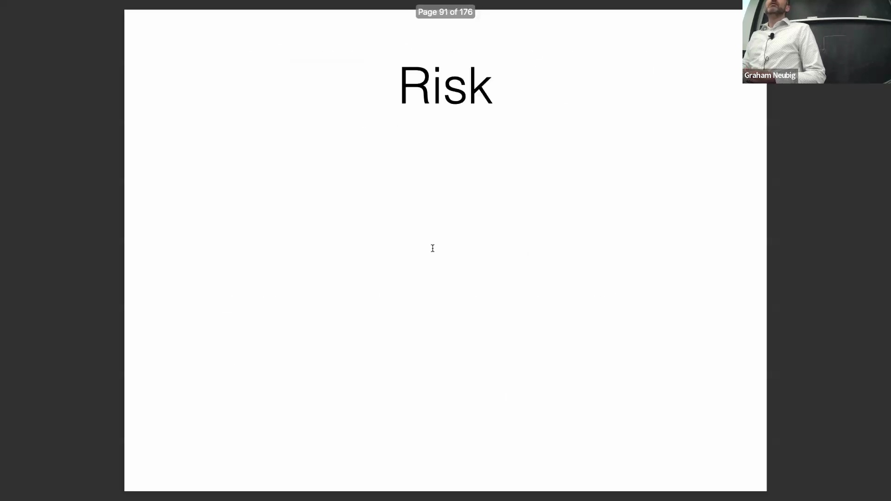

## 元评估与指标验证
为验证自动评估指标(Automatic Evaluation Metrics)的可靠性，研究人员会开展元评估(Meta-evaluation)，将指标的预测输出与人工判断(Human Judgments)进行对比。针对成对偏好数据(Pairwise Preferences)，可计算简单的准确率(Accuracy)；而对于直接评分(Direct Scoring)，则通常测量绝对误差(Absolute Error)。若新指标的提出方未报告此类元评估结果，则应对其可靠性持审慎态度。可靠的验证通常依赖大规模、标准化的数据集，例如WMT机器翻译研讨会(Workshop on Machine Translation)共享任务提供的数据集。这是因为小规模数据集往往缺乏评估指标性能所需的统计功效(Statistical Power)。

## 内在评估与外在评估
评估策略通常可划分为两类：内在评估(Intrinsic Evaluation)与外在评估(Extrinsic Evaluation)。内在评估旨在衡量生成文本本身的固有质量，通常通过人工直接评分(Direct Human Scoring)来实现。外在评估则侧重于衡量模型输出在下游任务(Downstream Tasks)中的实际效用。例如，可将大语言模型(Large Language Model, LLM)生成的摘要输入问答系统(Question-Answering System)并测量答案准确率(Accuracy)；亦可通过评估其对现实世界结果（如招聘决策或医疗诊断）的预测能力来进行验证。尽管外在评估通常能提供清晰、客观的基准真值(Ground Truth)，但其评估路径具有高度间接性：很难明确区分下游性能(Downstream Performance)的下降究竟源于大语言模型摘要质量不佳，还是下游模型本身存在缺陷。因此，业界通常建议将内在评估与外在评估结合使用，以获得更全面的性能画像。

## 人工标注分数的标准化
在汇总人工评估结果时，必须解决标注者间偏差(Annotator Bias)问题（例如，部分评分者习惯性偏严或偏宽）。WMT等框架常用的一种解决方案是Z分数标准化(Z-score Normalization)。该方法将每位标注者的原始分数转换为均值为零、方差为一的分布，从而在跨评分者计算平均值前有效消除个体偏差(Individual Bias)。此外，标注者间分歧(Inter-annotator Disagreement)极大的样本通常会被过滤剔除。因为在人类自身都无法达成共识的情况下，要求评估指标给出公平合理的预测是不切实际的。

## 代码生成领域的评估范式
在代码生成(Code Generation)领域，评估范式高度倾向于采用基于执行结果的外在指标。系统通常依据生成代码能否通过预定义的单元测试(Unit Tests)来进行评判。尽管这种二元的通过/失败(Pass/Fail)信号极具实用性且应用广泛，但它往往忽略了关键的内在质量维度，如代码可读性(Readability)、可维护性(Maintainability)、对编程规范(Programming Guidelines/Style Guides)的遵循程度，以及代码架构的优雅性。因此，全面的代码生成评估策略应在代码执行成功率(Execution Success Rate)与这些常被忽视的定性维度(Qualitative Dimensions)之间取得平衡。

## 基于误差与风险目标的训练
从评估阶段过渡到模型训练(Model Training)，优化过程的核心在于最小化“误差”(Error)，即衡量生成输出的劣质程度（例如计算 `1 - quality_score`）。模型部署的最终目标是最小化系统实际生成的单一输出(Single Output)所对应的误差。然而，直接通过梯度下降(Gradient Descent)优化该误差并不可行，因为文本生成过程涉及 `argmax`（取最大值）或随机采样(Random Sampling)等离散且不可微(Non-differentiable)的操作。为克服这一障碍，训练过程引入了“风险”(Risk，特指最小贝叶斯风险 Minimum Bayes Risk, MBR)概念，用于计算所有可能候选输出的*期望误差*(Expected Error)。通过对潜在输出按其生成概率进行加权，风险函数构建了一个可微的目标函数(Differentiable Objective Function)。这使得基于梯度的优化方法能够在训练期间有效驱动模型，使其输出与目标评估指标实现对齐(Alignment)。
