## 模仿学习与自训练基础
在强化学习(Reinforcement Learning)的语境下，标准的监督最大似然估计(Supervised Maximum Likelihood Estimation, MLE)通常被视作**模仿学习(Imitation Learning)**，即模型通过模仿教师演示(teacher demonstrations)来学习如何执行动作。其直接延伸是**自训练(Self-Training)**，该方法涉及从当前模型自身的分布中进行采样(Sampling)或取最大值(argmax)，随后最大化这些自生成输出的似然(Likelihood)。尽管在缺乏外部质量信号的情况下，这种方法存在放大模型自身错误的风险，但它仍能带来一定程度的准确率提升。如果模型本身的预测在大多数情况下是正确的，那么以自身输出为优化目标——并辅以早停(Early Stopping)等隐式正则化(Implicit Regularization)技术——可以将模型参数引导至更优的方向。
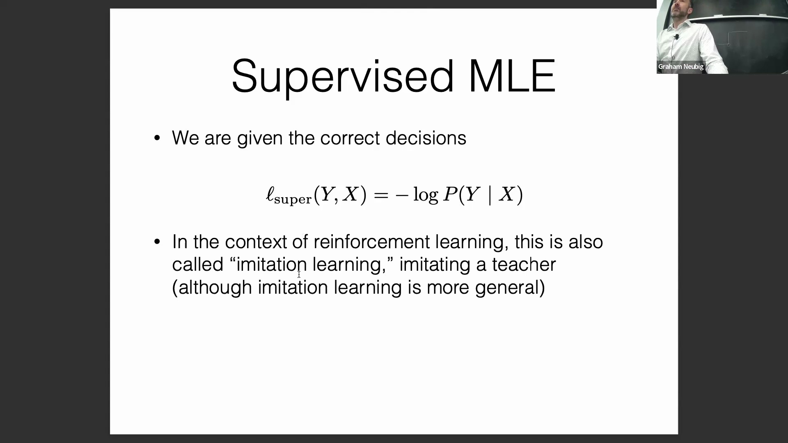

## 通过协同训练与输入噪声增强自训练
为克服纯自训练的局限性，研究人员开发了多种改进策略。**协同训练(Co-Training)**最初由卡内基梅隆大学(Carnegie Mellon University, CMU)提出，该方法利用多个模型进行交叉验证，且仅在模型间达成共识时才将生成的样本纳入训练集，从而进一步提升整体准确率。另一种有效的替代方案是在输入端注入噪声（例如词级 Dropout），使其分布更好地与模型生成输出时的噪声分布相契合。尽管这些方法颇具成效，但它们最终仍被引入显式奖励函数(Explicit Reward Function)的方法所超越。
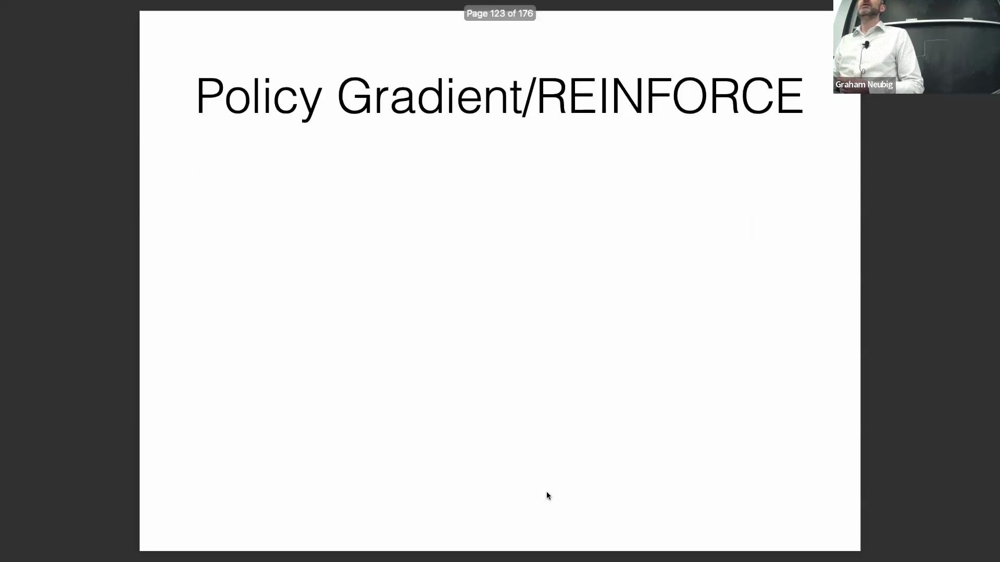

## REINFORCE 算法与策略梯度
将奖励信号整合进训练过程的最直接方法是 **REINFORCE** 算法，这是一种基础的策略梯度(Policy Gradient)技术。REINFORCE 并非盲目地最大化自生成文本的似然，而是利用外部奖励信号(External Reward Signal)对标准损失函数(Loss Function)进行加权缩放。这种修改能够自然地提升高奖励序列的生成概率，同时抑制低奖励输出的出现，从而有效引导模型生成更高质量的内容。
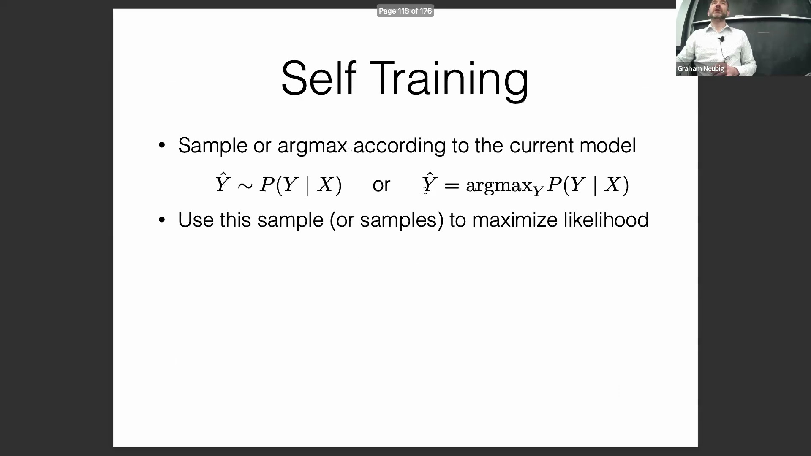

## 与最大似然估计的等价性
此处引出了一个关键的理论问题：在何种条件下，REINFORCE 算法会退化为等价于标准的 MLE？当采用严格的 **0/1 损失函数(0/1 Loss Function)**（即精确匹配奖励(Exact Match Reward)）时，这种等价关系成立。在此设定下，仅当生成序列与目标序列完全匹配时奖励值为 1，否则为 0。然而，REINFORCE 的核心优势在于其高度的灵活性。与单一的精确匹配监督不同，该算法能够轻松兼容连续的奖励分数(Continuous Reward Scores)、部分得分(Partial Scores)以及对多个有效参考输出的加权处理。
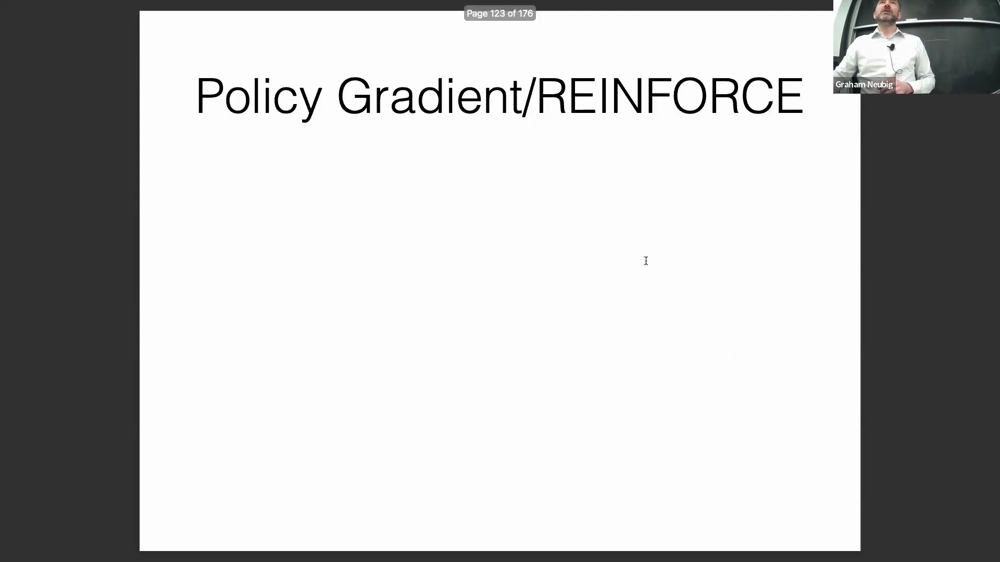
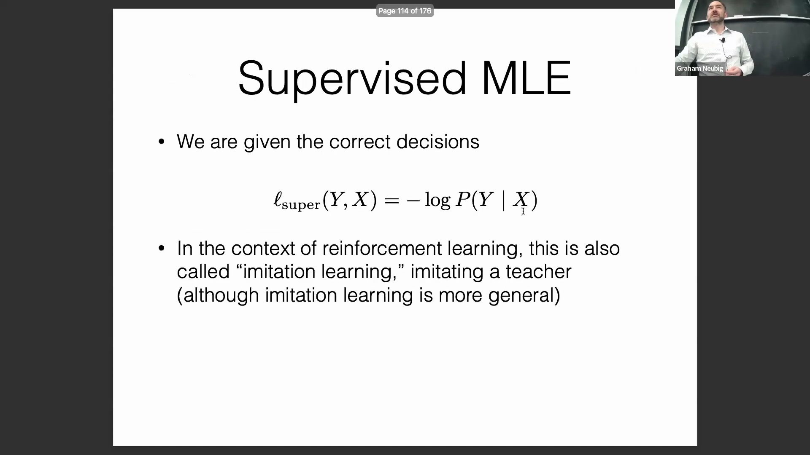
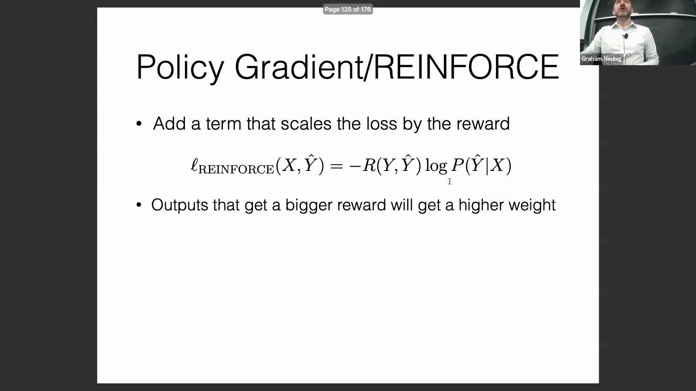

## 序列生成中的信用分配问题
将策略梯度应用于自然语言处理(Natural Language Processing)时面临的一个根本性挑战是**信用分配(Credit Assignment)**：即确定序列中究竟是哪个词元(Token)或具体动作促成了最终获得的奖励。尽管理想情况下可以在每个词元生成后提供即时反馈，但这在实际应用中往往不可行。奖励信号通常只有在完整的生成轨迹(Generation Rollout)结束后才能获取。目前最常见的变通策略是简单地将**最终奖励(Final Reward)平均分配给序列中的每一个词元**，依赖优化算法隐式地完成信用分配。此外，开发者也可采用**衰减奖励(Discounted Reward)**（即引入折扣因子 Discount Factor）机制，使靠近序列末尾的词元获得比早期词元更高的权重，这符合“近期动作对最终结果影响更直接”的直观逻辑。

## 奖励来源与训练稳定性
奖励信号可源自多种渠道：直接的人类反馈(Human Feedback)（如点赞/点踩）、**预训练奖励模型(Pre-trained Reward Model)**的评估打分，或是与策略网络协同优化的奖励模型（如直接偏好优化 Direct Preference Optimization, DPO 等方法）。尽管在数学层面实现基础的 REINFORCE 目标函数十分直观，但强化学习在实际训练中却以极高的不稳定性著称。为实现模型的可靠收敛，通常需要进行细致的超参数调优(Hyperparameter Tuning)，并引入额外的稳定化技术，以防止训练发散或陷入模式崩溃(Mode Collapse)。在早期实践中，指数衰减(Exponential Discounting)曾是标准配置，但现代算法实现通常已对其进行了简化或替代。
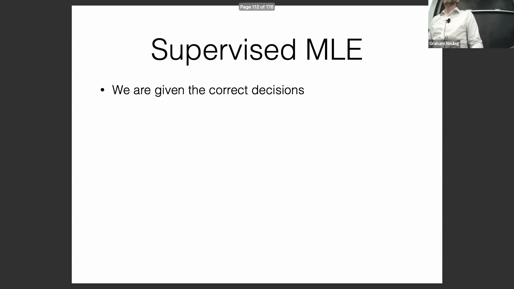
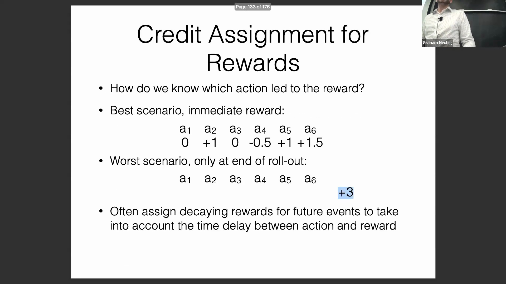
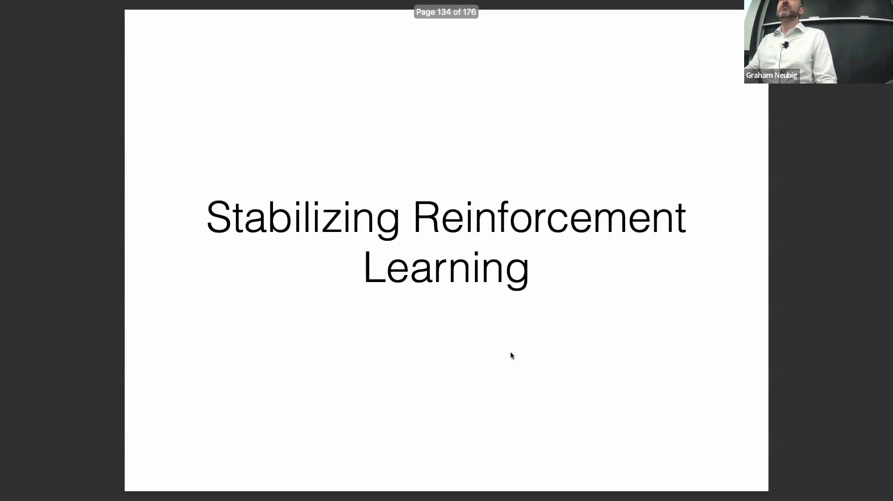
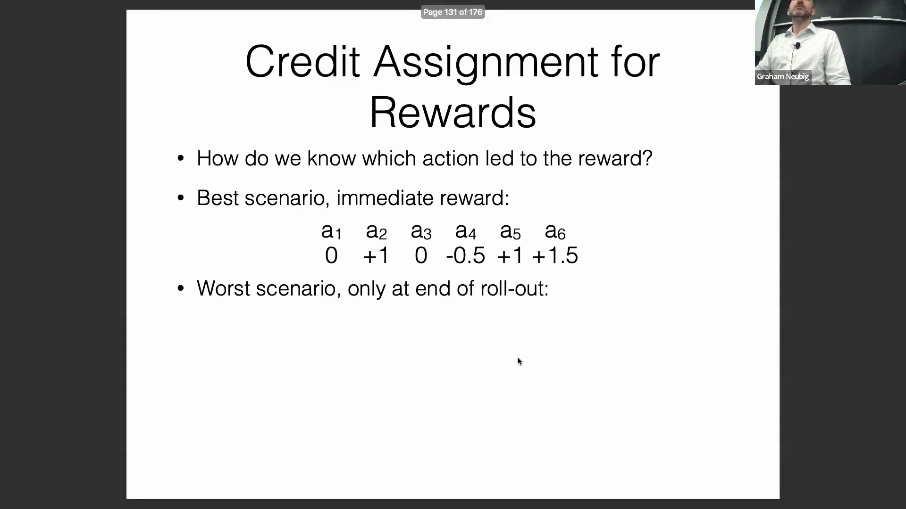
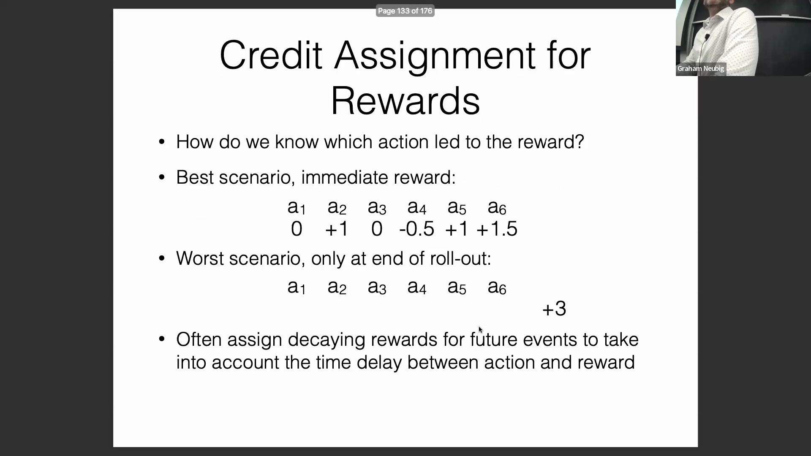