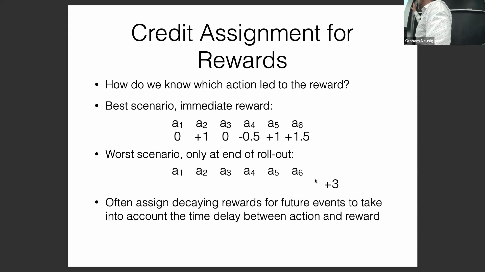
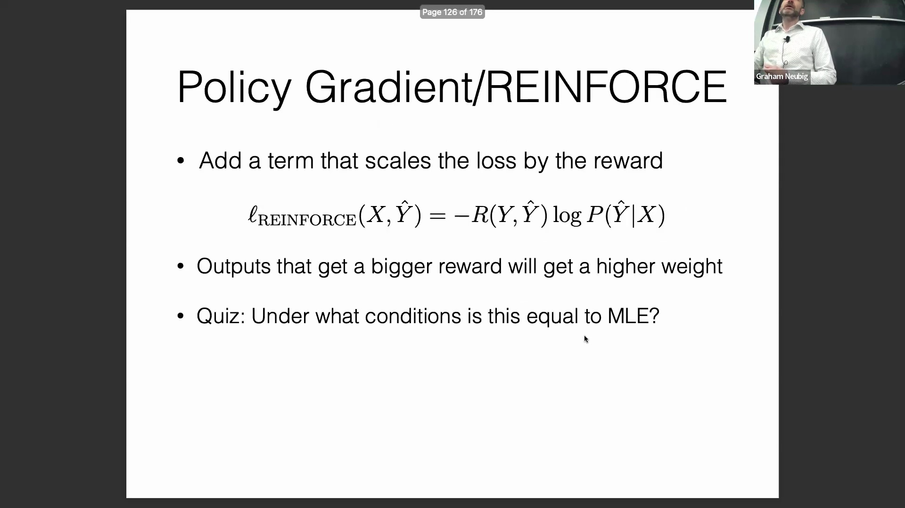
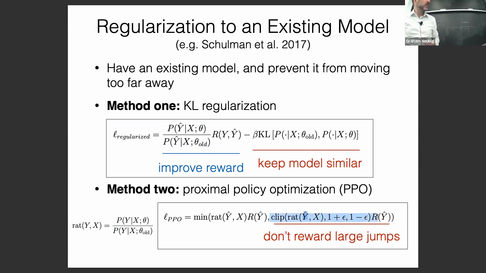
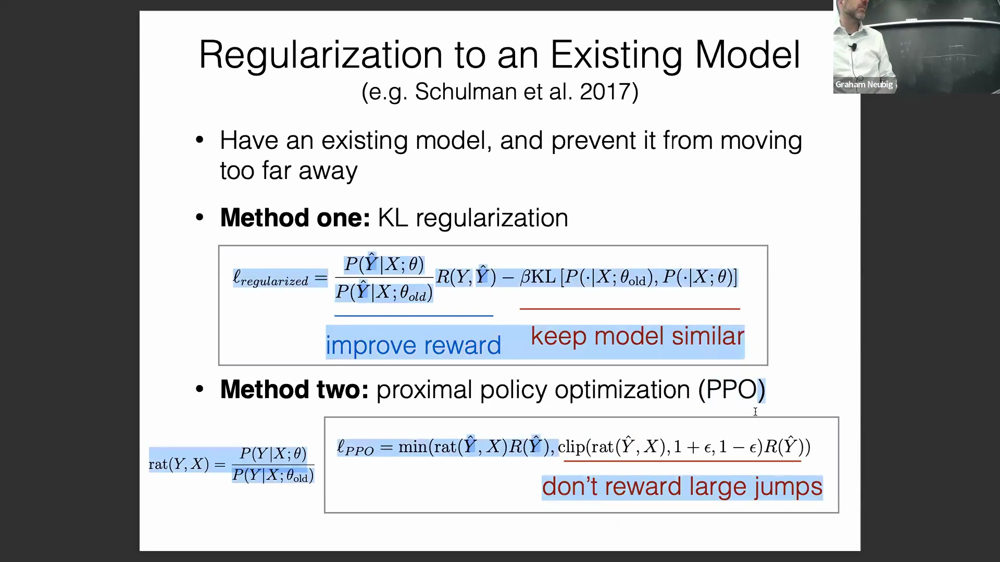
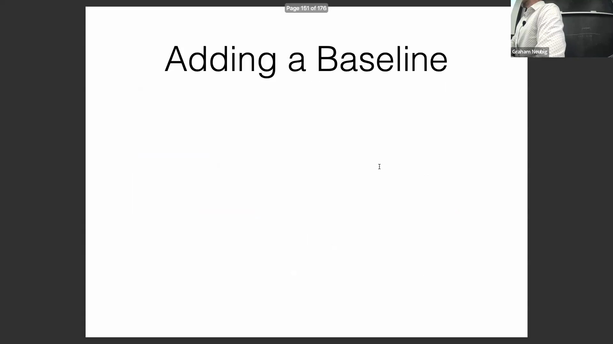
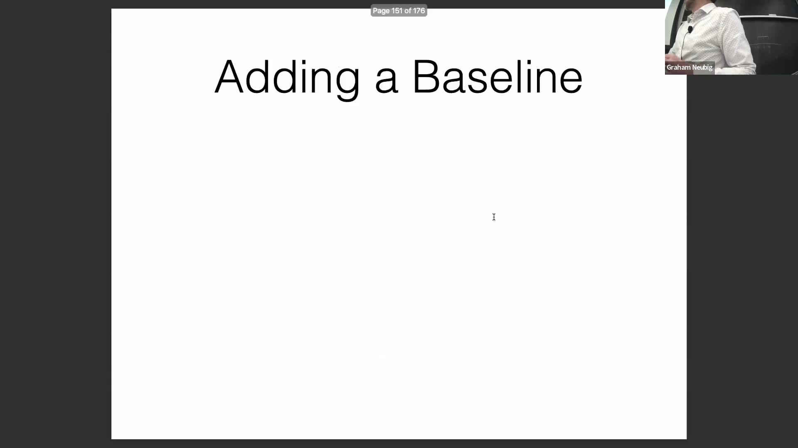
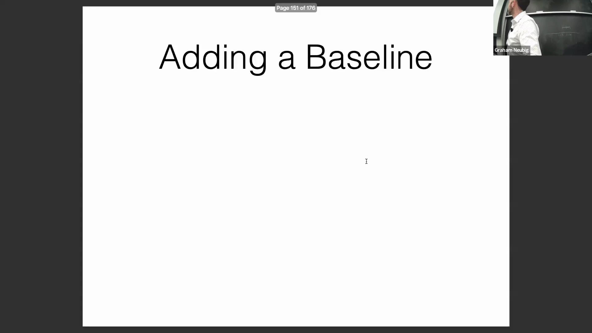

## 对话中的上下文奖励分配
一种常见的实践做法是为当前话语(Utterance)中的所有词元(Token)分配相同的奖励，而对历史对话轮次给予零奖励。不过，具体的实现细节在不同的研究与工程流水线(Pipeline)中可能有所差异。

## 强化学习稳定性的核心挑战
自然语言处理(Natural Language Processing, NLP)中的强化学习面临显著的训练不稳定性，主要原因有二。首先，与最大似然估计(Maximum Likelihood Estimation, MLE)将参考文本与整个理论输出空间进行对比不同，强化学习仅基于单次采样输出进行优化。这会导致高方差(High Variance)，尤其是在庞大的词表空间(Vocabulary Space)中。其次，使用负奖励(Negative Reward)会带来严重风险。尽管惩罚不良输出（例如含有毒性(Toxicity)的文本）是必要的，但无意义序列的组合爆炸(Combinatorial Explosion)问题意味着，过度压低特定输出的权重极易导致模型完全偏离其预训练的语言建模(Language Modeling)基础分布。

## 稳定化策略 1：MLE 预训练
最基础的稳定化策略是在引入强化学习之前，先使用最大似然估计(MLE)进行预训练(Pre-training)。这为模型奠定了坚实的语言生成基线。然而，该方法存在明显局限性：它高度依赖目标领域的监督数据(Supervised Data)。当模型需要探索未知的状态空间(State Space)或处理动态上下文时，该方法往往难以奏效。例如，若客服聊天机器人(Chatbot)需在非检索增强生成(Retrieval-Augmented Generation, RAG)的条件下引用专有产品目录，仅靠 MLE 预训练便显得力不从心。

## 稳定化策略 2：KL 散度正则化
为防止训练过程中的灾难性分布偏移(Catastrophic Distribution Shift)，通常会引入正则化项，约束更新后的模型尽可能贴近参考语言模型(Reference Language Model)。其中主流的方法是 KL 散度正则化(KL Divergence Regularization)。其目标函数(Objective Function)由两部分组成：主项用于最大化高质量序列的奖励，辅助的 KL 正则项则用于惩罚新策略分布与参考模型分布之间的显著偏差。超参数 `beta` 用于控制两者的权衡(Trade-off)，决定了模型在优化外部奖励时，需在多大程度上保留原有的语言生成先验(Language Generation Prior)。

## 稳定化策略 3：近端策略优化（PPO）
**近端策略优化(Proximal Policy Optimization, PPO)** 提供了一种基于截断(Clipping)机制的替代性稳定方案。该算法通过计算给定输出在新旧策略下的概率比(Probability Ratio)来进行优化。通过将该比率约束在特定的信任域(Trust Region)内（具体实现对截断与未截断的目标函数取 `min` 操作），PPO 能够有效限制策略更新步幅，从而避免性能骤降。其核心逻辑在于最大化目标函数：若新策略的表现不及参考基线，或偏离原分布过远，截断机制会自动将优化梯度拉回稳健的原始策略方向。尽管 PPO 曾在业界广泛流行，但近年来的趋势显示，研究正逐渐转向实现更简捷的 KL 散度正则化方法，不过两者目前仍在实际应用中并存。

## 实际实现与工具库
实现上述复杂的强化学习稳定技术无需从零构建。诸如 Hugging Face 的 `trl`（Transformer Reinforcement Learning）等现代开源库，已提供成熟且开箱即用(Out-of-the-box)的 MLE 预训练流程、KL 正则化及 PPO 实现，极大地简化了 NLP 算法研究与工程部署(Engineering Deployment)的复杂度。

## 稳定化策略 4：基线减法（奖励归一化）
管理奖励方差(Reward Variance)的一项关键技术是引入基线(Baseline)。若忽视输入样本的难度差异，原始奖励分数极易产生误导。例如，翻译简单句子可能获得 `0.8` 的奖励，而翻译高度复杂或充满歧义的句子（如经典的“Buffalo buffalo Buffalo buffalo buffalo buffalo Buffalo buffalo”）可能仅得 `0.3`。若缺乏基线校准，模型会错误地惩罚高难度任务。通过从实际奖励中减去期望基线值（`reward - baseline`），算法可计算出相对优势信号(Advantage Signal)。这一机制能够准确捕捉“较低的绝对分数在特定难度下实则代表显著性能提升”的情形，确保优化过程充分考量任务难度差异，从而避免误导性的策略更新(Policy Update)。