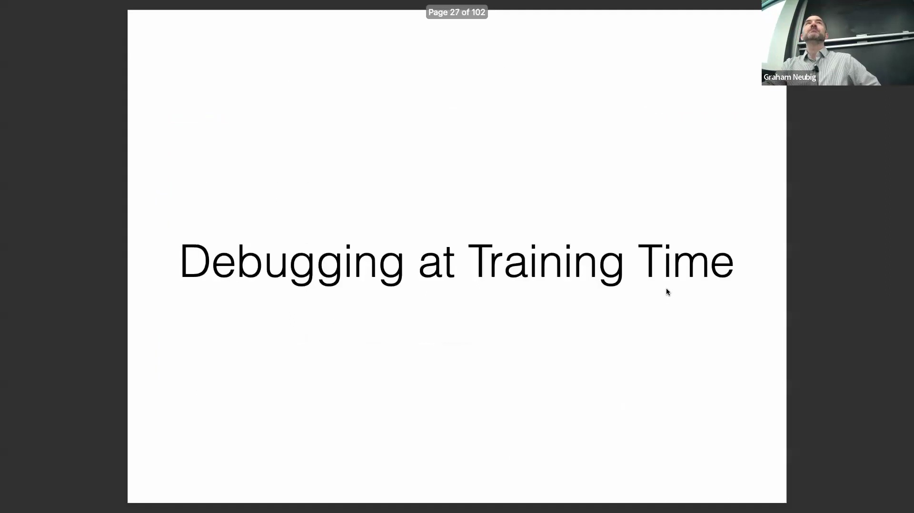
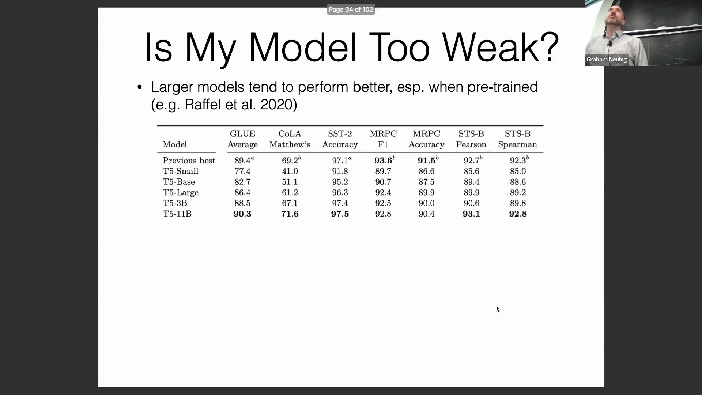

## NLP(Natural Language Processing) 模型的调试与可解释性(Interpretability)简介

本讲座主要聚焦于自然语言处理模型的调试与可解释性，具体探讨如何识别代码实现中的缺陷、底层假设的谬误，以及模型在特定数据切片(Data Slices)上的失效模式(Failure Modes)。讨论涵盖了各类常见的实验陷阱，并概述了诊断与解决这些问题的系统化(Systematic)方法。

## 常见陷阱与分析的三个维度

一个典型场景是：在构建基于神经网络(Neural Network)的 NLP 系统时，代码看似无误，但模型准确率却低下，或产生难以解释的错误。为系统性地解决此类问题，应重点关注以下三个分析维度： 
1. **调试实现(Implementation Debugging)**：识别编码或模型架构设计中的错误。
2. **可操作评估(Actionable Evaluation)**：精准定位反复出现的错误模式(Error Patterns)，并制定针对性的修复方案。
3. **解释预测结果(Prediction Explanation)**：分析模型在单个样本(Sample)上的内部工作机制，以提升性能并确保符合伦理规范（例如，防止基于受保护属性(Protected Attributes)的歧视）。后续讨论将重点聚焦于可操作评估。

## 为何神经网络调试至关重要且充满挑战

调试神经网络至关重要，因为其本质具有不透明性(Opacity)与不可预测性；即便是微小的编码错误也可能导致输出质量急剧下降。此外，系统中的诸多设计选择实际上都扮演着超参数(Hyperparameters)的角色，包括网络架构、批量大小(Batch Size)、优化策略(Optimization Strategy)和学习率(Learning Rate)。与传统机器学习(Machine Learning)算法（如逻辑回归(Logistic Regression)或支持向量机(Support Vector Machine, SVM)）不同，神经网络依赖于随机优化(Stochastic Optimization)，缺乏严格的收敛保证(Convergence Guarantees)。 

因此，损失曲线(Loss Curve)可能会出现波动（例如先下降后上升），这并不一定意味着存在严重缺陷，从而使得区分正常的优化噪声(Optimization Noise)与严重的实现错误变得更为困难。

实现问题的分类与调试策略
为有效排查问题，应将其归类为明确的类型，因为不同类别的问题需要不同的修复策略。**训练期问题(Training-time Issues)**可能源于模型容量(Model Capacity)不足、训练算法次优或直接的代码错误。**测试期问题(Test-time Issues)**通常涉及训练与推理(Inference)过程脱节、搜索算法(Search Algorithm)失效或过拟合(Overfitting，即训练表现优异但测试表现不佳）。另一个关键陷阱是**优化目标不匹配(Optimization Objective Mismatch)**，即模型训练的目标函数与实际评估指标(Evaluation Metrics)不一致。 

最有效的调试策略是按照该列表从上至下依次排查问题，而非同时尝试所有可能性，因为较高层级的问题通常更容易被隔离与解决。

## 通过损失函数诊断训练问题
在排查训练期失败时，主要的诊断工具是训练集上的损失函数(Loss Function)或对数似然(Log-likelihood)，而非过度依赖准确率(Accuracy)指标。需持续监控损失值是否稳步下降并逼近理论最优基线。理想情况下，运行良好的模型其损失应收敛至零。若训练集上的损失值持续居高不下或陷入平台期(Plateau)，则强烈提示存在底层的实现或算法问题。作为一项快速合理性检查(Sanity Check)，如果模型即使在大幅缩小的训练子集(Training Subset)上也无法使损失趋近于零，则代码或数据流水线(Data Pipeline)中极可能存在严重错误。

## 模型容量与规模扩展的益处

若损失曲线停滞不前，可能仅仅是由于模型容量(Model Capacity)不足。大量经验证据一致表明，更大规模的模型（尤其是经过预训练(Pre-training)的模型）能够取得更优异的性能。例如，将 T5 架构的参数量从小规模扩展至 110 亿(11B)，展现了持续的性能提升。反直觉的是，更大规模的模型通常收敛速度更快，或达到同等性能所需的训练步数(Training Steps)更少。神经网络规模扩展(Neural Network Scaling)研究表明，尽管较小模型在训练初期可能进步较快，但较大模型最终会在词元效率(Token Efficiency)和计算效率(Compute Efficiency)两方面全面超越前者。这一现象与“彩票假说(Lottery Ticket Hypothesis)”相吻合：更大的参数空间增加了网络中包含高效子网络(Efficient Subnetworks)的概率，使模型在触及小模型的性能瓶颈（容量上限）之前，能够进行更为稳健的学习。