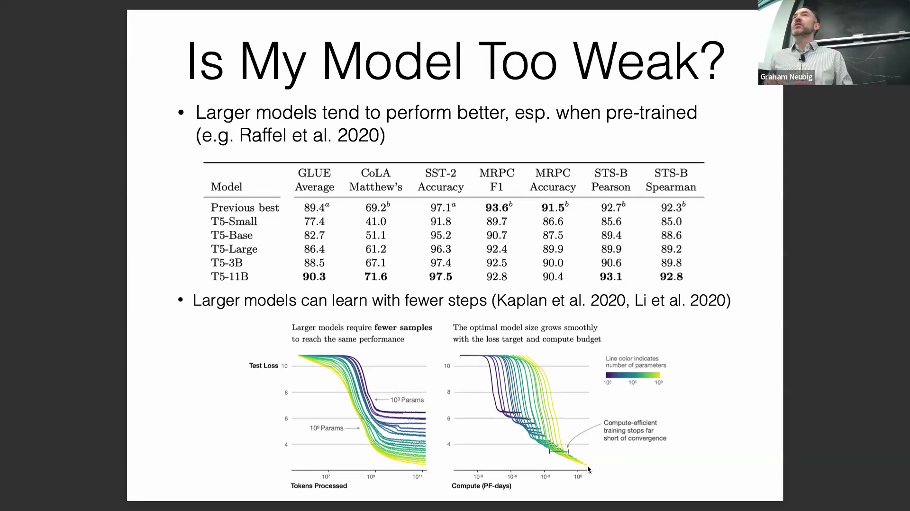
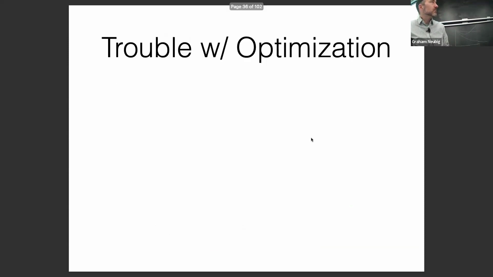
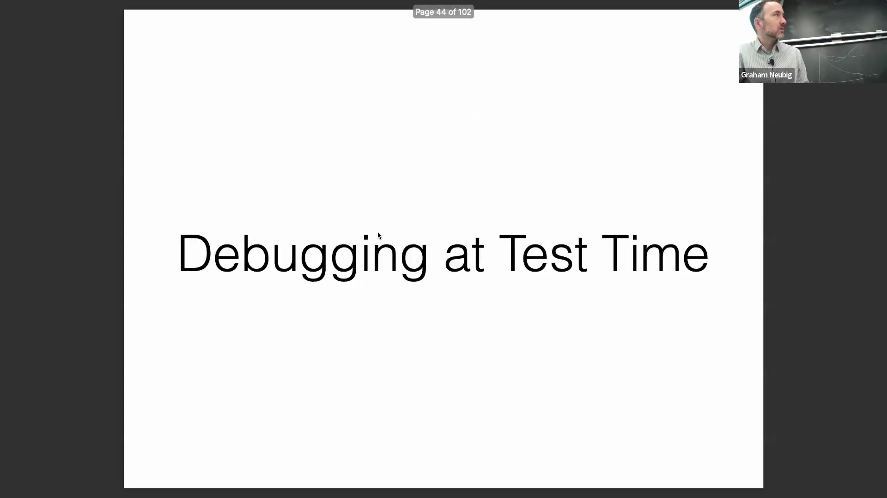
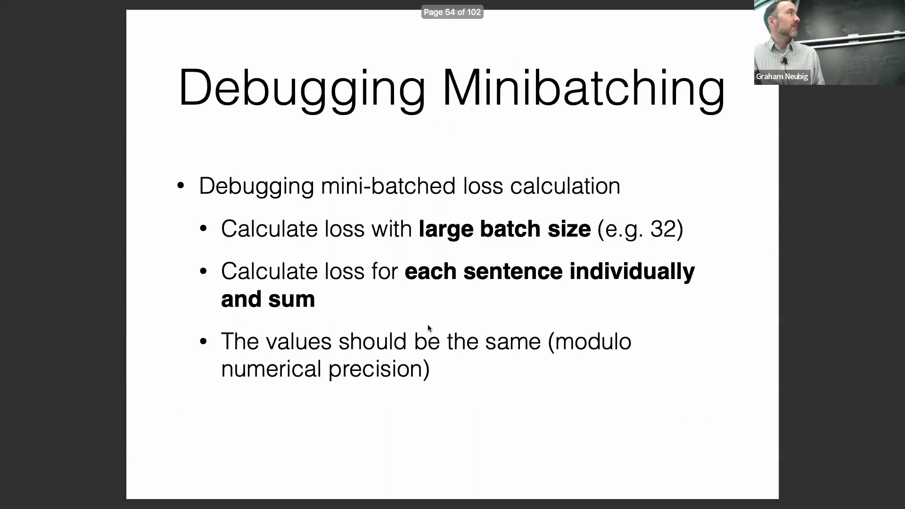
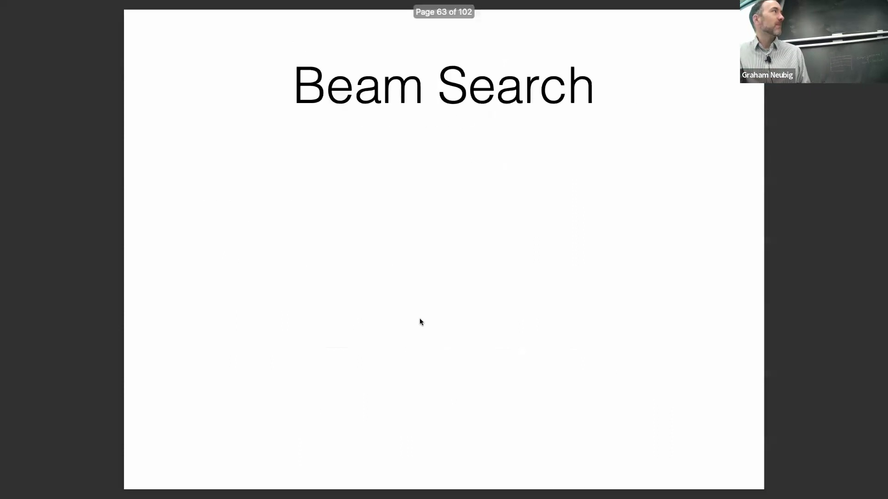

## 模型容量(Model Capacity)与损失曲线(Loss Curve)解读

在计算资源充足的情况下，扩展至更大规模的架构通常能更快地收敛至高质量解(High-quality Solutions)。在分析损失轨迹(Loss Trajectory)时，若数据满足独立同分布(Independent and Identically Distributed, I.I.D.)假设，训练损失(Training Loss)与测试损失(Test Loss)的曲线走势应大致吻合。然而，若损失曲线过早陷入平台期(Plateau)，通常表明模型容量(Model Capacity)不足。在此情况下，升级至更大规模的模型是突破性能瓶颈的必要且有效手段。

## 优化器(Optimizer)选择与训练配置(Training Configuration)
除模型架构规模外，排查训练问题还需细致调整优化超参数(Optimization Hyperparameters)。业界标准做法是选用 Adam 或 AdamW 优化器，并确保学习率(Learning Rate)与同规模模型的现有基线(Baselines)保持一致，这通常需参考相关文献。若模型从零开始训练(Training from Scratch)，正确的参数初始化(Parameter Initialization)（例如，采用与网络规模相匹配的均匀随机初始化）至关重要。此外，保持足够大的小批量大小(Mini-batch Size)有助于降低梯度噪声(Gradient Noise)，并防止训练过程发散(Divergence)。

## 推理期(Inference-time)问题调试与训练-推理不一致(Train-Inference Discrepancy)

推理阶段(Inference Phase)的调试至关重要，尤其是针对脱离 Hugging Face 等标准化库(Standardized Libraries)的自定义实现(Custom Implementations)。常见的错误来源之一是训练(Training)与推理(Inference)流程的不一致，特别是在文本生成(Text Generation)或结构化预测(Structured Prediction)任务中，损失计算(Loss Computation)与预测生成函数往往独立实现。这两者间的逻辑不一致或冗余代码极易引入难以察觉的细微错误。此外，小批量(Mini-batch)训练损失计算与单序列(Single-sequence)或动态批量(Dynamic Batching)推理之间的不匹配也可能导致输出差异，因此必须进行严格验证。

## 小批量处理(Mini-batch Processing)验证与解码算法(Decoding Algorithm)

验证小批量损失计算的一种可靠方法是：对比整个大批量(Batch)数据的总损失，与该批次中每个序列(Sequence)单独计算出的损失之和，两者应严格一致。此项检查能有效捕捉由填充(Padding)、掩码(Masking)或分层编码(Hierarchical Encoding)引发的错误。针对生成算法(Generative Algorithms)，可将解码过程(Decoding Process)（如采样或搜索）中追踪的累积对数概率(Cumulative Log-probabilities)，与损失函数在对应生成序列上的输出进行交叉比对(Cross-validation)，两者的数值必须完全匹配。强烈建议将此类验证封装为单元测试(Unit Tests)，这能有效规避复杂生成流水线(Generation Pipeline)中的多数实现缺陷。

在使用束搜索(Beam Search)等解码算法时，增大束宽(Beam Width)应能持续提升模型的对数似然得分(Log-likelihood Scores)。在不同束宽下进行测试并验证得分的单调递增(Monotonic Increase)，是确保搜索算法实现正确的另一项关键单元测试。

## 优化目标(Optimization Objective)与评估指标(Evaluation Metrics)的不匹配(Mismatch)

一个关键却常被忽视的挑战在于：训练阶段优化的目标函数(Objective Function)（如最大似然估计(Maximum Likelihood Estimation, MLE)）与实际测试时采用的评估指标(Evaluation Metrics)（如准确率(Accuracy)）之间存在脱节。最大似然优化具有固有局限性：它对特定类型的错误缺乏敏感度，且未将解码策略(Decoding Strategy)纳入考量。因此，训练损失持续下降而验证集准确率(Validation Accuracy)反而退化(Degradation)的情况完全可能发生。 

即使在 MNIST 图像分类(Image Classification)这样简单的基准任务中，也能轻易复现这一现象。同步监控损失曲线与准确率曲线至关重要，因为两者间日益扩大的差距凸显了单纯依赖似然最大化(Likelihood Maximization)的局限性，并深刻强调了实现训练目标与下游评估指标对齐(Objective Alignment)的必要性。