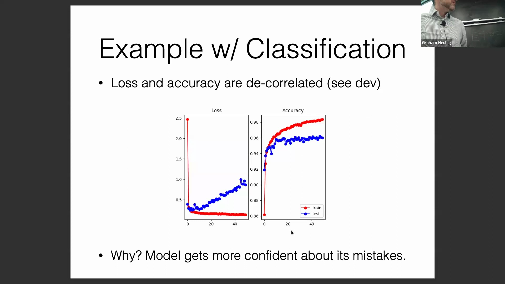
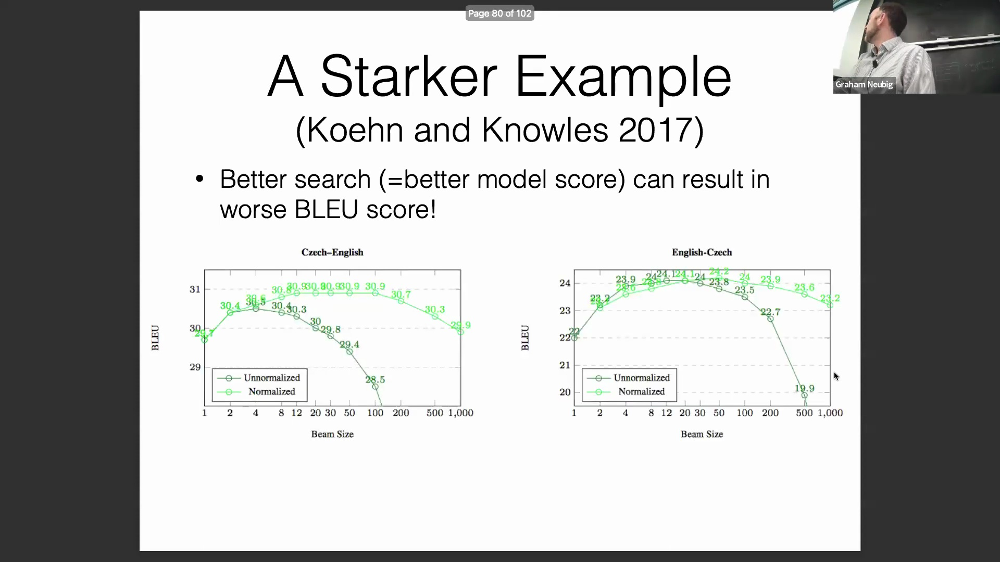
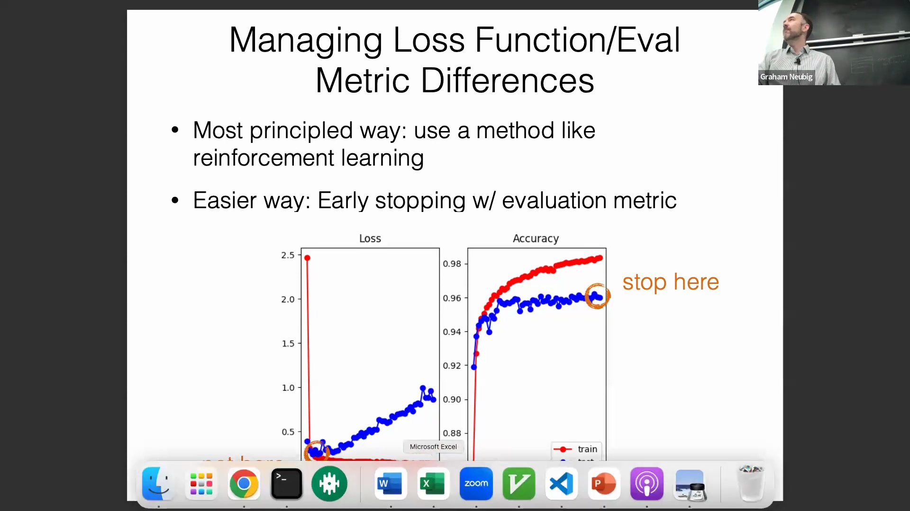
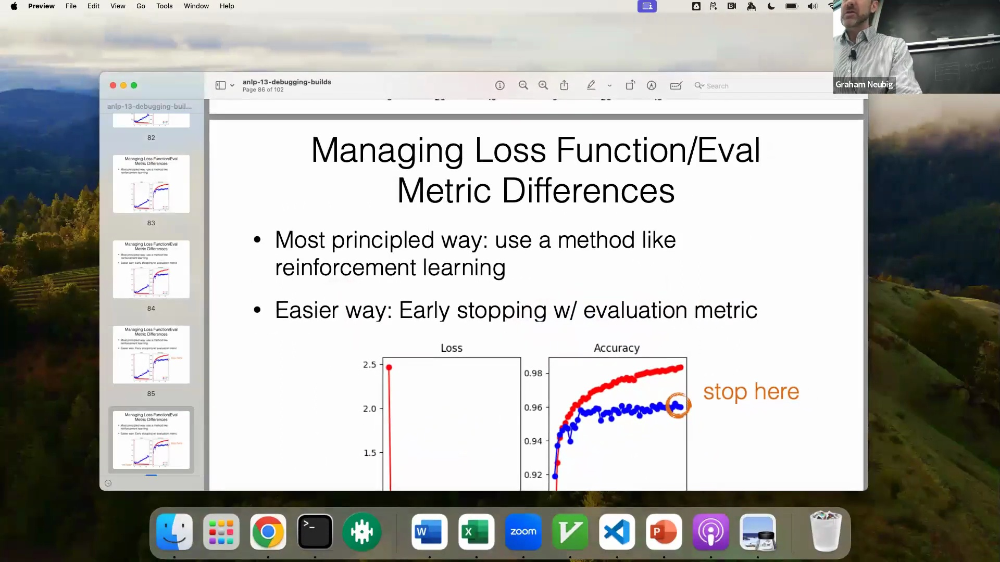
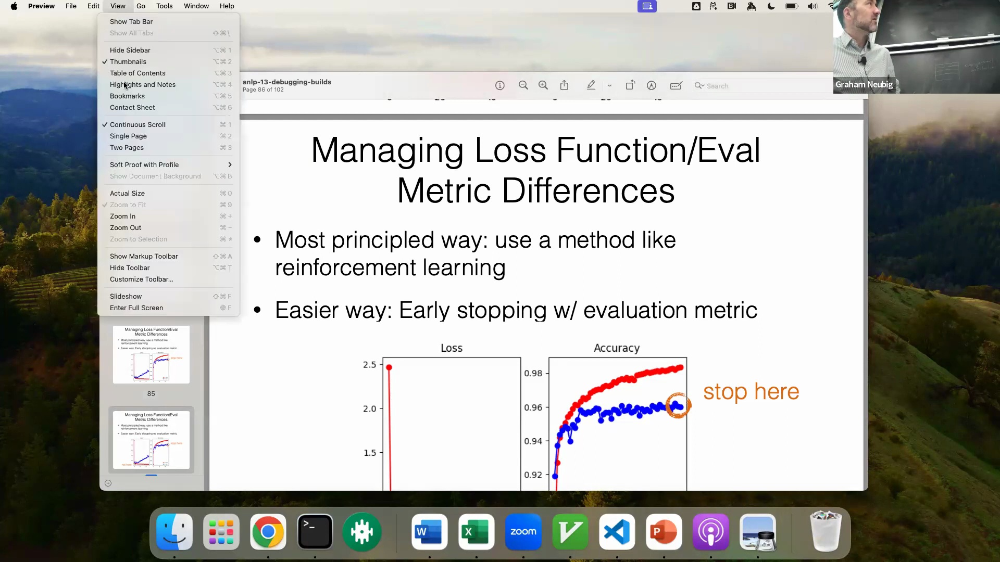
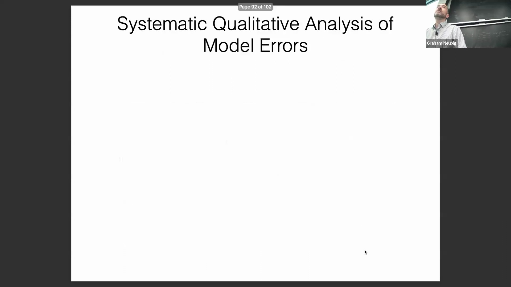

## 损失(Loss)与准确率(Accuracy)的脱节(Mismatch)

训练自然语言处理(NLP)模型时的一个根本性挑战在于：优化目标(Optimization Objective)（如损失或对数似然）与下游评估指标之间存在固有的不匹配(Mismatch)。损失衡量的是模型预测概率与真实标签之间的差异，而准确率则是对预测结果正确与否的二元度量(Binary Metric)。随着训练的进行，模型对其预测的置信度(Confidence)通常会不断提高。然而，对于模型难以处理的困难样本(Hard Examples)，它可能会对*错误*答案产生过度自信(Overconfidence)，导致对数似然(Log-likelihood)降低与损失上升。因此，损失轨迹(Loss Trajectory)与准确率曲线可能会严重背离，这表明单纯最小化损失并不总能转化为核心业务指标的最大化。

## 束搜索(Beam Search)的局限性与输出长度偏差(Length Bias)

这种不匹配在文本生成(Text Generation)任务中尤为显著。在基于最大似然估计(Maximum Likelihood Estimation, MLE)训练的模型中，采用更穷尽的搜索算法（如束搜索）以寻找高分序列(High-scoring Sequences)，往往反而会降低生成质量。历史上的机器翻译(Machine Translation)实验表明，尽管增大束宽(Beam Width)能成功检索出模型内部得分更高的输出，但实际的 BLEU 评分(BLEU Score)却持续下降。这是因为最大似然训练天生具有长度偏差，倾向于生成较短的序列：随着词元(Token)数量的增加，序列的联合概率(Joint Probability)会因连乘效应而不断衰减。由于 BLEU 等指标会对过短的输出施加惩罚(Penalty)，模型对简短序列的偏好直接与评估标准相冲突。尽管引入长度归一化(Length Normalization)（即按每个词元的平均对数似然进行评分）能提供一定缓解，但随着束宽的继续增加，生成性能仍会持续恶化。

## 早停法(Early Stopping)的风险与模型校准(Model Calibration)

为弥合训练目标与评估指标之间的鸿沟，从业者可采用强化学习(Reinforcement Learning)或直接优化评估指标的结构化预测(Structured Prediction)等理论驱动方法。一个更易实施的替代方案是：基于验证集指标(Validation Metrics)而非训练损失来执行早停。然而，在验证准确率达到峰值时中止训练，会引入一个关键风险：模型校准不佳。若在模型于开发集(Dev Set)上取得最高准确率时停止训练，可能会无意中使模型陷入对其错误预测过度自信的状态。这种校准偏差(Miscalibration)（即模型输出的预测概率无法真实反映其实际正确率）将严重阻碍那些依赖可靠置信度估计(Confidence Estimation)的下游应用。

## 多步任务中的“顿悟”(Grokking)与延迟泛化(Delayed Generalization)

可解释性研究(Interpretability Research)中观察到一个引人入胜的现象是“顿悟”，该现象尤其在需要严格多步推理(Multi-step Reasoning)的小型算法数据集(Algorithmic Datasets)上表现明显。在训练过程中，损失值在相当长的时间内持续平稳下降，但验证准确率却顽固地停滞在极低水平。

仅在经历大量训练步数后，模型才会突然实现泛化(Generalization)，致使准确率急剧飙升。这种延迟泛化现象的根源在于：对于依赖顺序逻辑(Sequential Logic)的任务（例如需连续正确执行数十个步骤），评估通常采用严格的二元准确率(Binary Accuracy)指标。

随着训练推进，模型对每个独立步骤的概率性掌握(Probabilistic Mastery)虽在逐步提升，但在所有步骤均正确执行的累积概率(Cumulative Probability)跨越特定有效阈值之前，整体准确率将始终维持为零。

在调试高度依赖推理(Reasoning-dependent)的模型时，深刻理解这一动态过程至关重要。因为模型在损失经历漫长的平稳下降期后，才会迎来可观测的准确率提升。

## 可操作评估(Actionable Evaluation)：定性审查(Qualitative Review)的力量

超越自动化调试(Automated Debugging)，可操作的评估高度依赖于人工审查(Manual Inspection)模型输出，而非仅关注汇总指标(Aggregated Metrics)。定性审查能迅速暴露那些看似细微却影响深远的实现错误(Implementation Bugs)。例如，生成代码中的一个“差一”(Off-by-one)索引错误可能导致输出持续丢失首个词元（如输出“went to the store yesterday”而非“I went...”）。尽管这可能仅使 BLEU 评分下降一两个百分点，但人工目视检查即可迅速定位预处理(Preprocessing)缺陷。人类的模式识别能力(Pattern Recognition)在识别系统性故障模式(Systematic Failure Modes)方面具有无可替代的优势。

通过错误分析(Error Analysis)，从业者能够快速定位模型在特定领域(Domain-specific)的薄弱环节——例如，检索增强生成(Retrieval-Augmented Generation, RAG)系统在科研类查询上持续失效，或在处理特定实体类型(Entity Types)时表现欠佳。这些定性洞察(Qualitative Insights)可直接转化为针对性的改进措施，例如构建垂直领域数据集、优化检索策略(Retrieval Strategy)或迭代提示词工程(Prompt Engineering)架构。