## 系统化错误分类与分析
回顾我在谷歌(Google)早期的实习经历，其中的经验在十多年后依然具有指导意义。一种高效且系统的调试(Debugging)方法在于摒弃随意浏览的方式。相反，开发者应随机抽取约100条模型输出，仔细审查其中的错误，并将其纳入结构化的分类体系(Classification Taxonomy)中，从而识别出最高频的错误类型。 
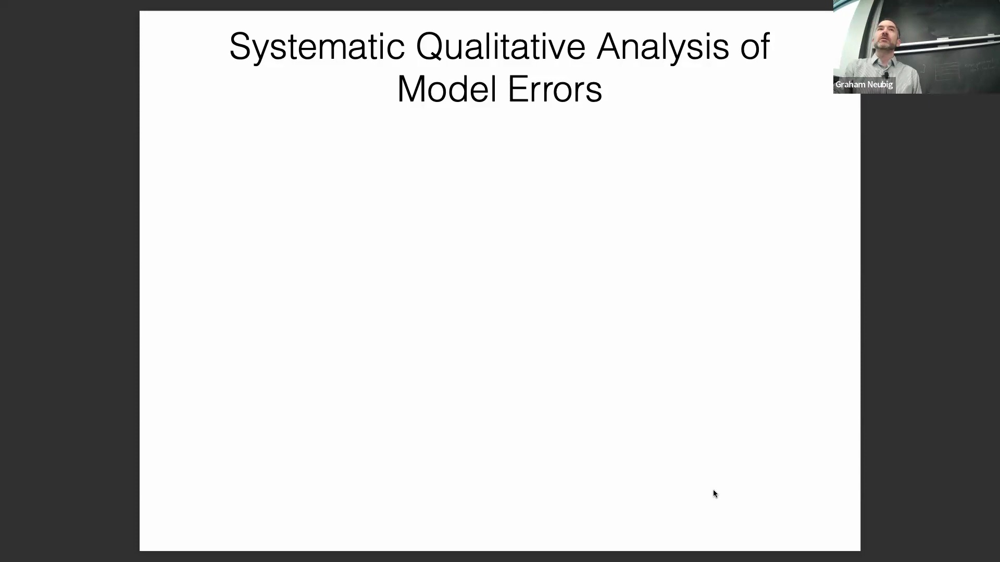
这种方法的一个经典案例来自 Valar 等人，他们将机器翻译(Machine Translation)错误划分为多个层级：词级错误、局部范围错误、长距离错误和短语级错误。 
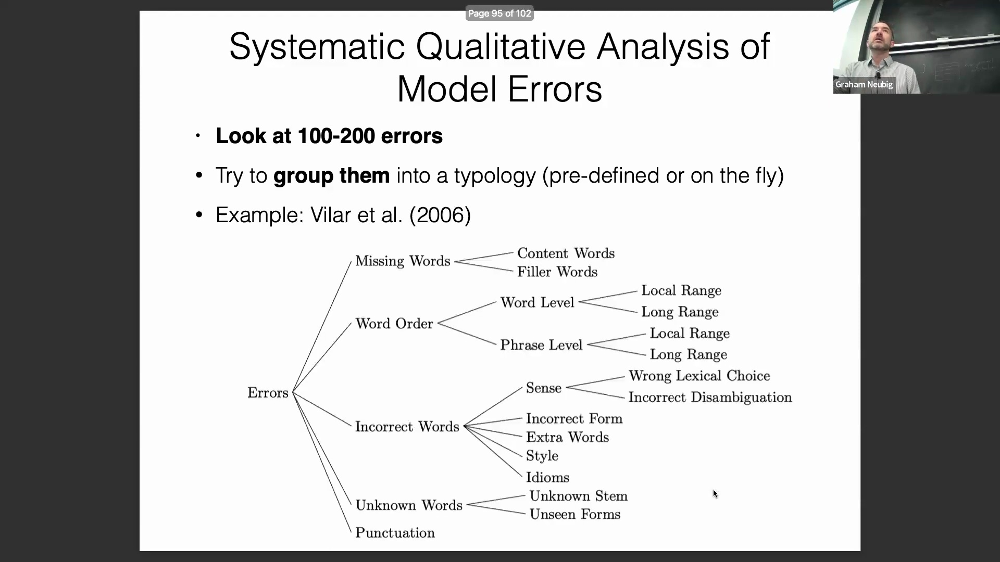
然而，随着模型能力的演进，传统的分类体系往往不再适用于现代系统。
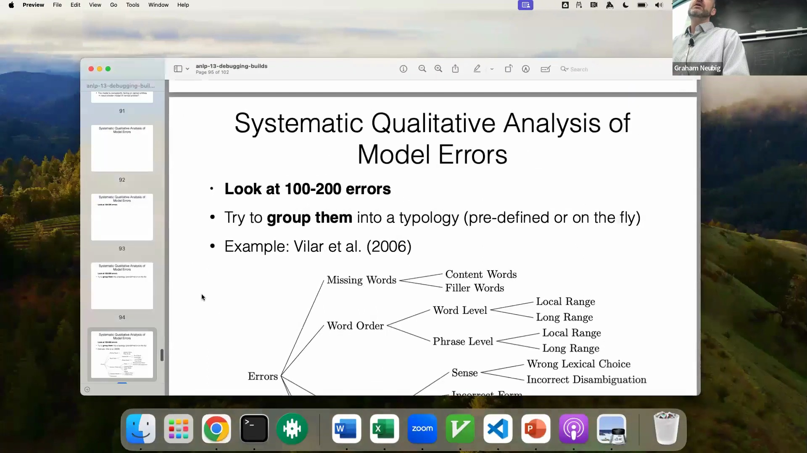

## 分类体系的现代化与性能分析器（Profiler）原则
机器翻译系统已取得显著进步，使得诸如基本词级或局部范围错误等老旧的粗粒度错误分类在很大程度上已过时。如今的分析需要更细的粒度(Granularity)，例如针对命名实体(Named Entity)或其他复杂语言现象中的失败案例进行追踪。 

2020年前后，随着机器翻译质量媲美人工翻译的说法不断涌现，研究人员重新构建了错误分类体系，以反映当下的挑战。这种系统化分类至关重要，因为在小样本中识别出最突出的错误类型，往往能直接指向最有效的优化策略。这反映了一个软件工程(Software Engineering)的核心原则：在未运行性能分析器(Profiler)之前，绝不要优化代码。在机器学习系统中亦是如此——应避免耗费精力去修复那些对整体性能影响甚微的错误。
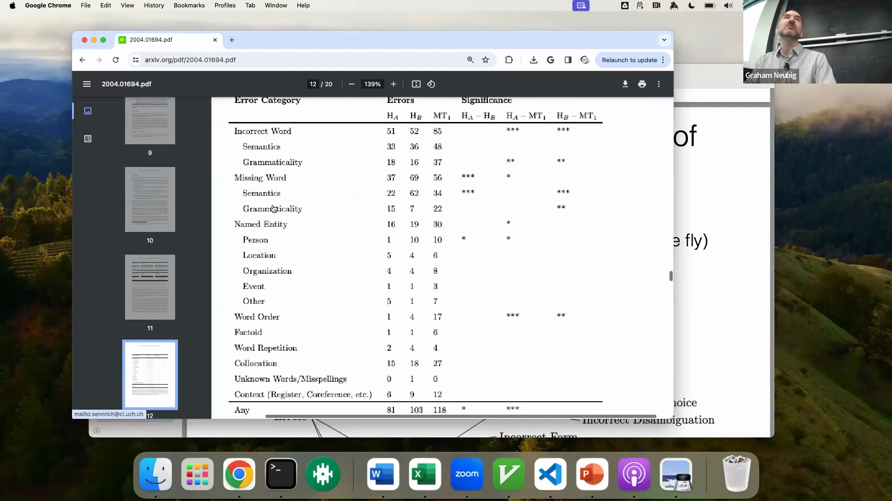

## 定量评估与针对性指标
一旦识别出具体的错误类型，下一步便是进行定量分析(Quantitative Analysis)，以验证干预措施是否真正奏效。如果某项修改旨在提升低频词的质量，你就必须直接测量这些特定词的准确率是否有所提高。 
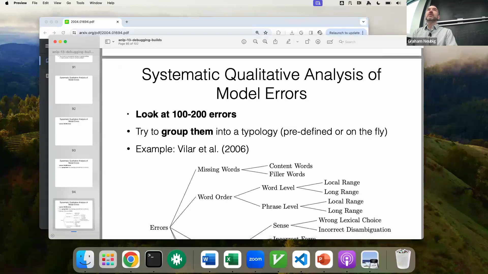
同样地，如果某项改动旨在改善低资源语言(Low-resource Language)的句法(Syntax)，你就应该追踪词序或长距离依赖(Long-distance Dependency)相关的指标。 
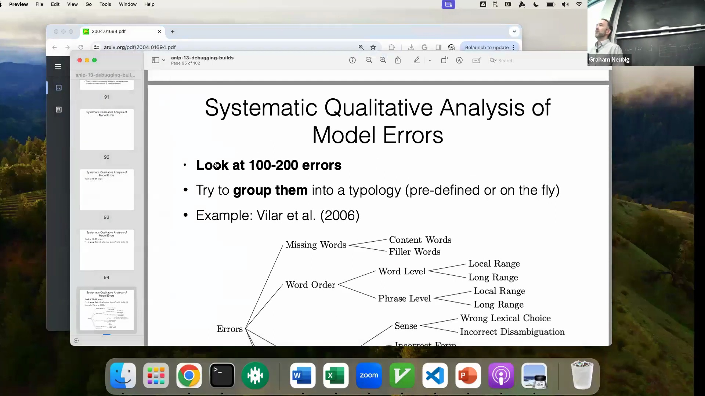
对于专注于搜索算法(Search Algorithm)或生成内容审查(Generation Censorship)的改进，精确测量搜索错误的数量能提供清晰的反馈。 
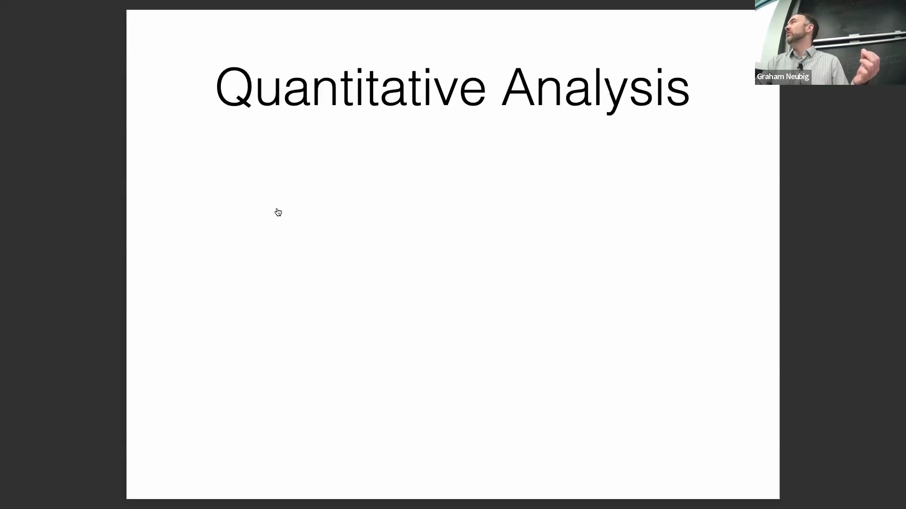
总而言之，针对你计划改进的方向，强烈建议直接测量目标指标，以确认模型性能是否得到实质性提升。
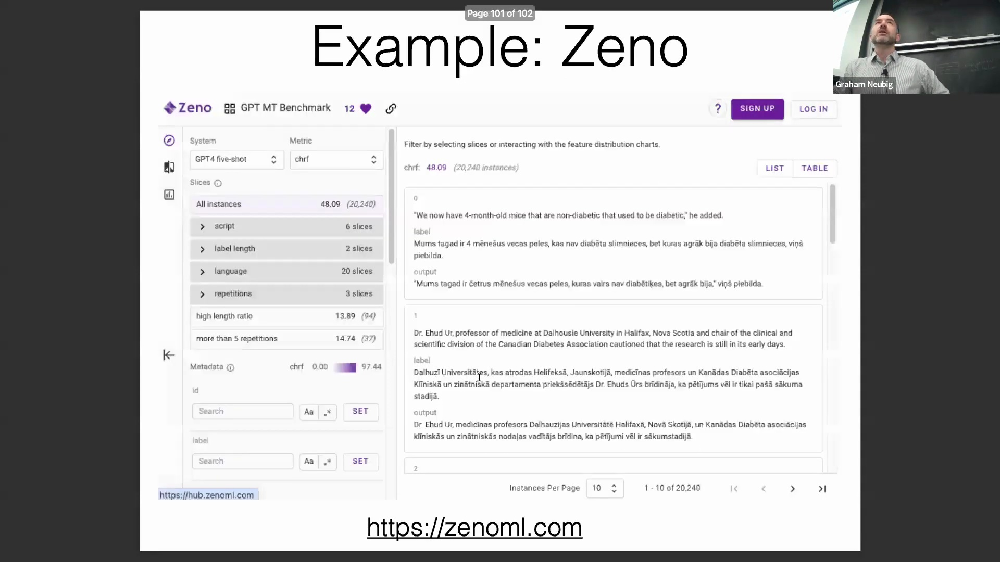

## 调试工具的演进
多年来，执行此类手动与定量分析的流程已实现高度自动化。这一过程最初始于一些基础且临时的脚本(Ad-hoc Scripts)，仅用于生成供人工审阅的 HTML 文件。 
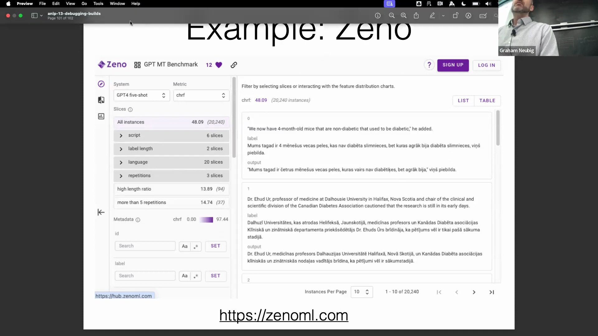
随后演进为更具结构化的平台，例如 `explainerboard`，它引入了排行榜功能以追踪模型性能。 
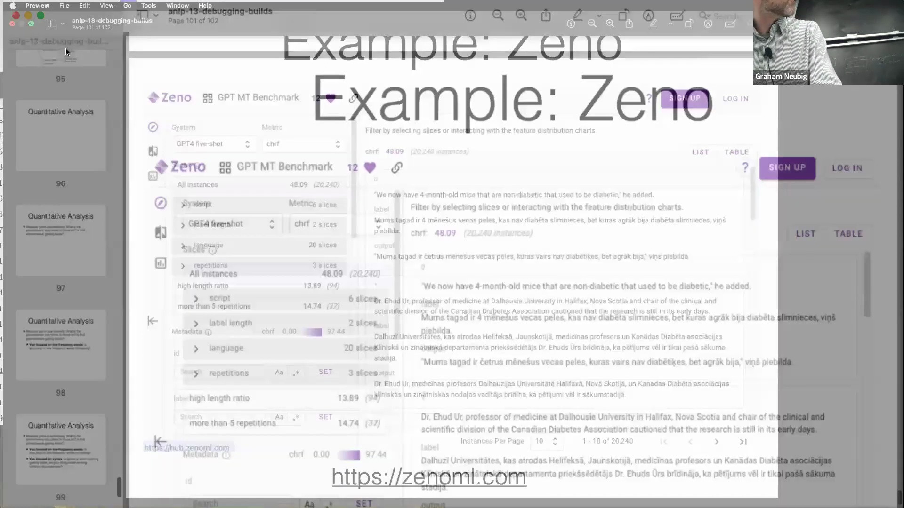
最新的迭代版本是 `Xeno`，这是与 Alex Cabrera 共同开发的一款综合工具包。 

`Xeno` 最初专为机器翻译评估而设计，它提供了一个交互式界面(Interactive Interface)，显著简化了调试工作流(Workflow)。

## 使用 Xeno 进行交互式数据探索
`Xeno` 允许用户在一侧可视化检查数据，同时在另一侧动态过滤示例。你可以快速筛选出特定数据集（如 HouseUp）中的所有翻译样本，或仅过滤出模型准确率低于某一阈值(Threshold)的实例。 

这种交互式过滤使得人工检查高失败率案例变得轻而易举。该工具包还支持自动化可视化(Automated Visualization)，使用户能够生成图表来对比整体性能，或按不同文字系统(Script)细分准确率，以观察哪个模型能更好地处理特定文字。 

并排对比(Side-by-side Comparison)同样直观；你可以过滤出 ChatGPT 表现逊于 GPT-3.5，而后者又落后于 GPT-4 的示例，从而直观地揭示出诸如生成错误字符等失败模式。 

从技术层面来看，`Xeno` 的运行机制是接收包含评估数据和指标值的 pandas DataFrame。 

对在项目中使用此工作流感兴趣的学生，可以期待专门的专题辅导课(Tutorial)，届时将详细讲解其实现方法。

## 关于正则化与损失收敛的问答
在问答环节，一名学生提问：应用正则化(Regularization)是否会导致模型损失(Loss)增加或阻止其收敛(Convergence)至零，以及这是否会影响评估。 
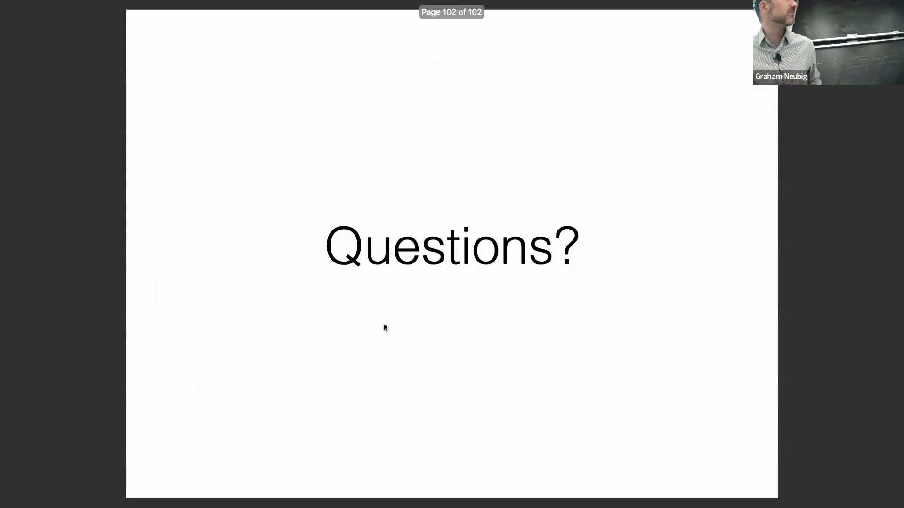
演讲者澄清道，正则化会刻意对较大的权重施加惩罚，这意味着一旦惩罚项生效，从数学上讲就不存在“零损失”的解。 
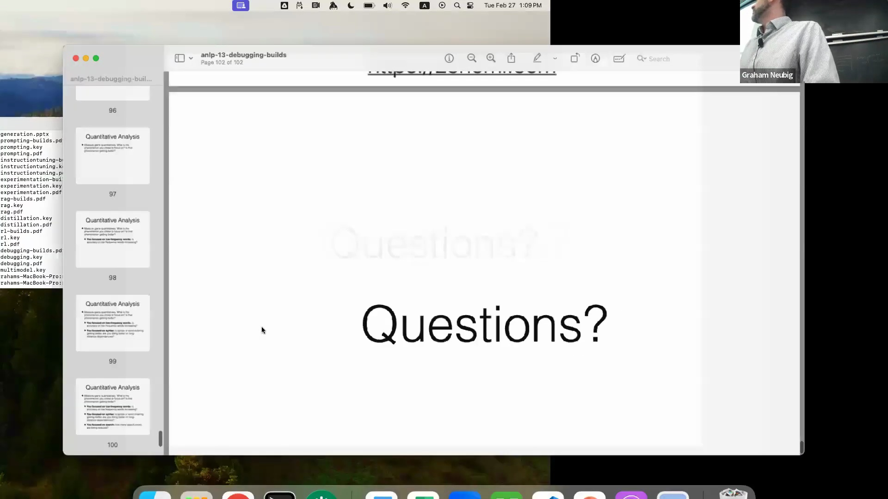
为了拟合数据而将权重偏离零，必然会增加正则化分量，从而使总损失不为零。 

然而，实践者应分别测量损失的各项分量：独立追踪正则化惩罚项与实际的对数似然损失(Log-likelihood Loss)。 

在合理的参数化(Parameterization)设置下，随着训练的进行，核心的对数似然损失仍应呈现趋近于零的趋势。演讲者还指出，在简单实验(Toy Experiments)中使用极小的模型，有时反而会使这些收敛规律更难被观察到。

## 过渡至模型可解释性
随着调试与评估工具环节告一段落，课程转入下一主题。一位一年级博士生兼助教登台，介绍模型可解释性(Model Interpretability)的基础知识，为接下来的讲座部分拉开序幕。
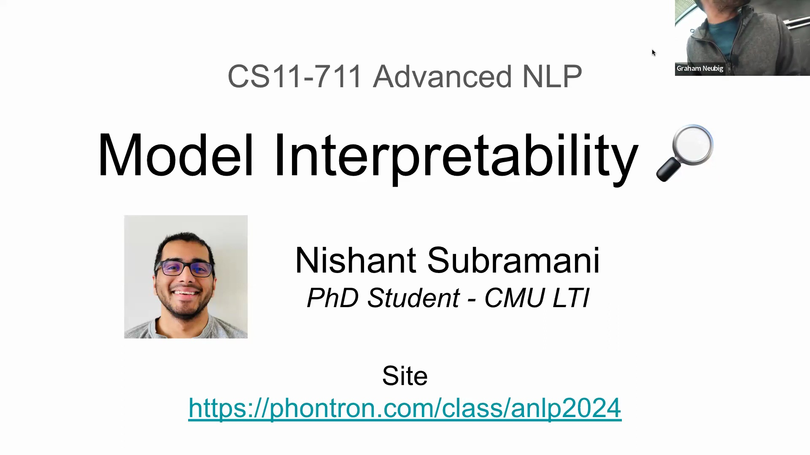