## 简介与核心目标
演讲者概述了本次课程的两大核心目标：首先，使听众认识到研究模型可解释性(Model Interpretability)的根本重要性；其次，激发大家对该主题的真正兴趣，以便后续开展独立的深入探索。演讲者坦言，本次内容仅为一次快速概览，旨在提供一个入门起点，而非对各项技术细节进行穷尽式的深度剖析。

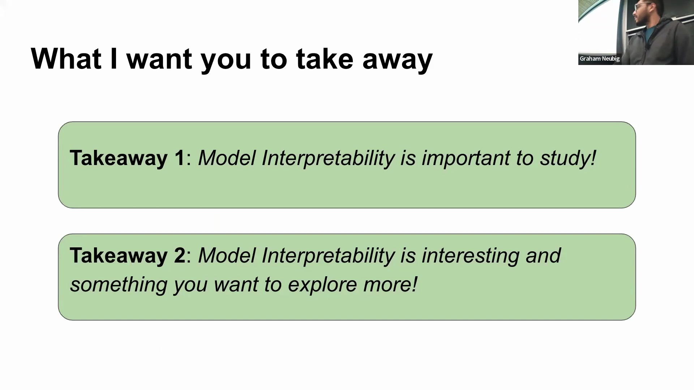

## 人工智能可解释性定义及相关领域
人工智能可解释性(AI Interpretability)旨在研究如何理解 AI 系统的决策过程，并将其内部机制转化为人类可理解的概念。其终极目标是基于这种理解，迭代设计出性能更强且更加透明的系统。该领域与多个相关概念相互交织，构成了一个庞大的研究生态。它与因果推断(Causal Inference)和数据可解释性(Data Interpretability)紧密相连；而“可解释人工智能”(Explainable AI, XAI)则与之并行发展，侧重于为黑盒模型(Black-box Model)提供易于用户理解的解释。

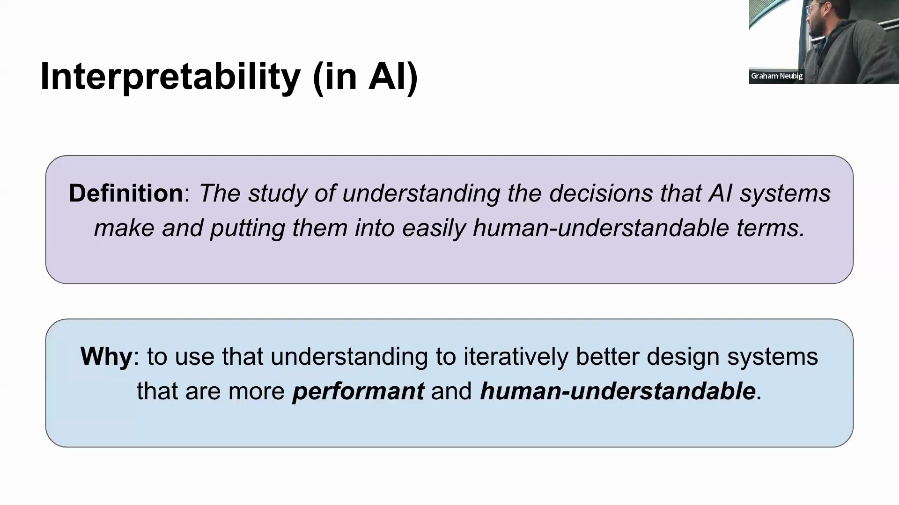
“模型可解释性”(Model Interpretability)更聚焦于网络架构的内部技术细节；而近期备受关注的“机制可解释性”(Mechanistic Interpretability)则是该广阔领域中一个高度专业化且细粒度的研究分支。

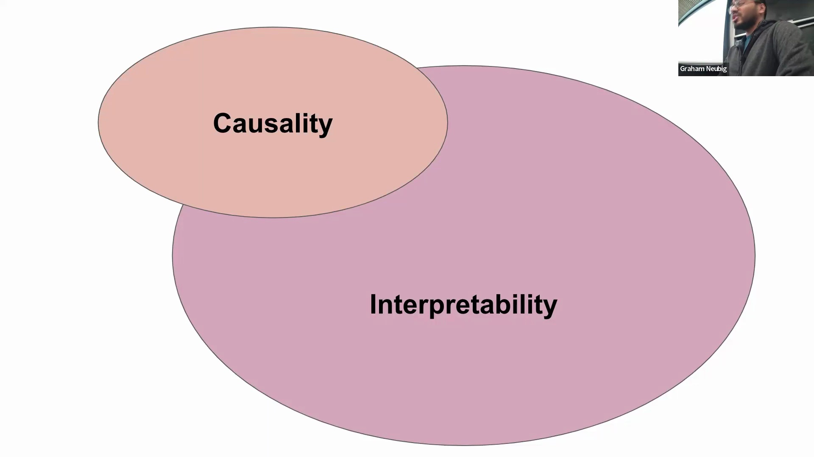
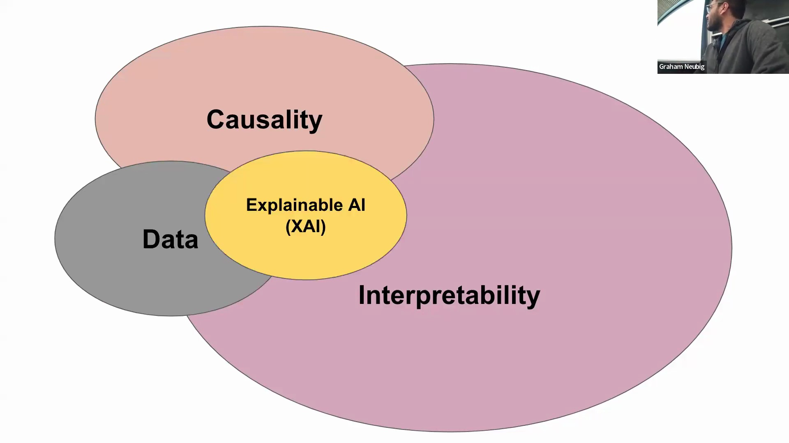
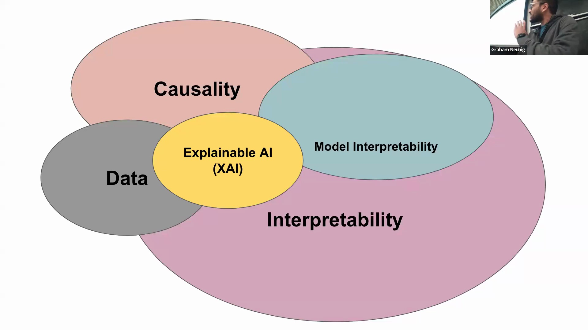
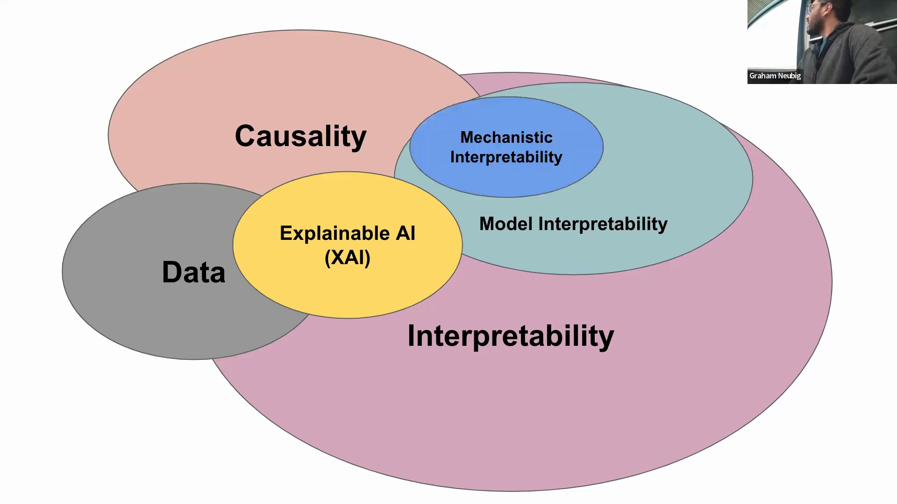

## 复杂度的转变与探针技术的兴起
过去，可解释性并非研究的核心关切点，因为线性回归(Linear Regression)或小型多层感知机(Multilayer Perceptron, MLP)等早期模型的权重矩阵参数较少、结构清晰，便于直接审视。
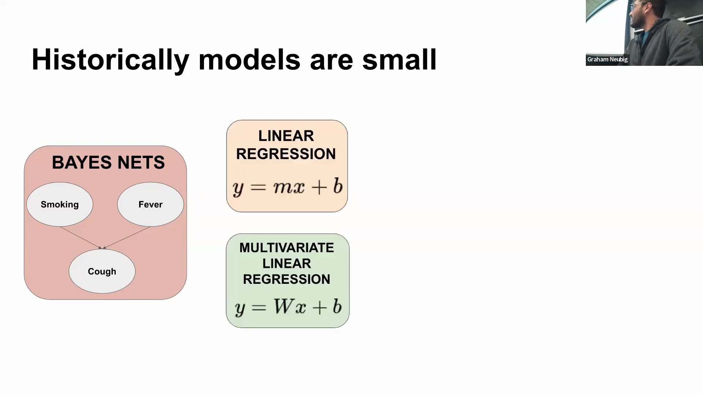
然而，现代模型架构的规模已呈指数级增长。即便是仅含六层的轻量级 Transformer（按当今标准实属微型模型），其参数量也已十分庞大，导致直接检查权重变得几乎不可能，模型本身也极度缺乏可解释性。
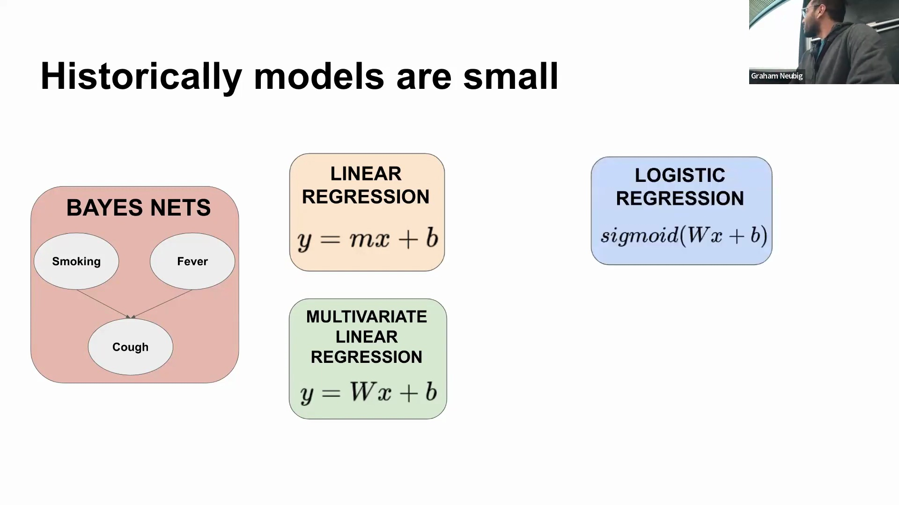
为应对这种“黑盒”不透明性，研究人员约在五年前引入了“探针分析”(Probing)技术。该方法的基本思路是：提取一个大规模预训练模型，在概念上移除其原始输出层，并接上一个小型可训练分类器（通常为 1-2 层的 MLP）。

在此过程中，预训练模型的权重保持冻结(Frozen)，仅训练探针分类器，使其能够从模型固定的内部表示(Internal Representations)中预测特定的语言或语义属性。

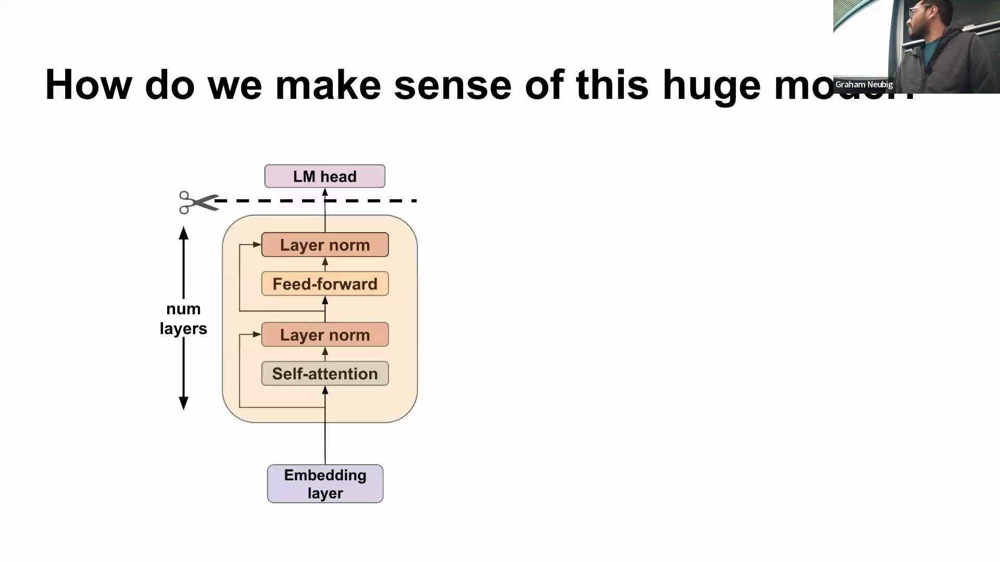

## 探针分析的工作原理与层级特异性发现
2019 年，Tenney 等人提出的“边缘探针”(Edge Probing)显著推进了探针分析框架，使研究人员能够系统地从神经网络的不同层级中提取信息。
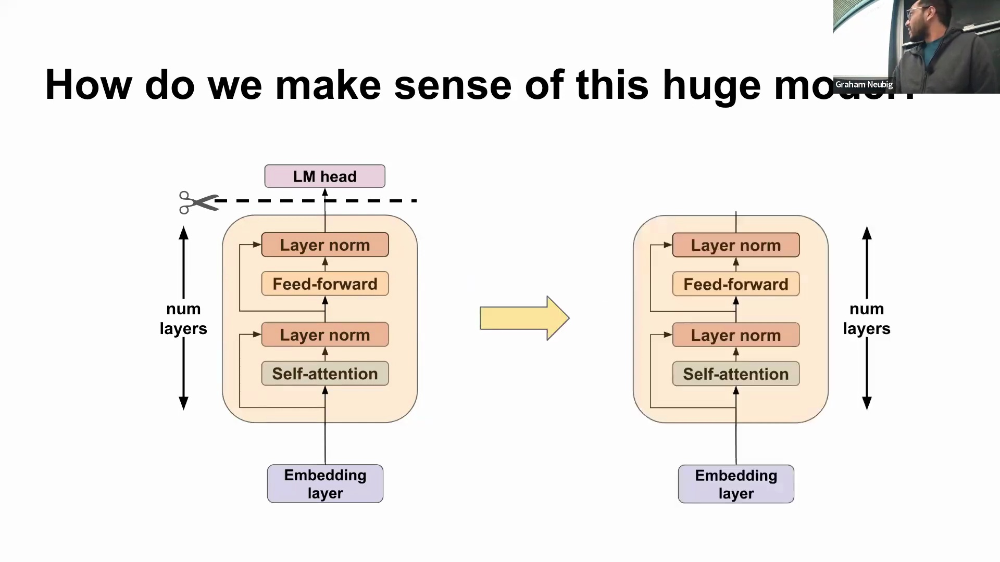
通过将各层的上下文向量(Contextualized Vectors)输入探针，研究人员可以测试模型在词性标注(Part-of-Speech Tagging)（词元级）或文本蕴涵(Textual Entailment)（序列级）等任务上的能力。
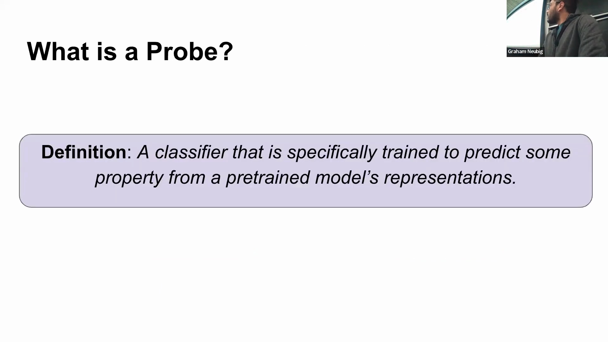
这些研究得出了一个关键结论：表示学习(Representation Learning)具有明显的层次性。靠近输入端的浅层网络擅长捕捉表层、以词元为中心的特征（如句法结构(Syntactic Structure)和短语分块(Chunking)）；而深层网络则逐步编码更抽象、依赖上下文且具有深层语义的关系（如题元角色(Thematic Roles)）。
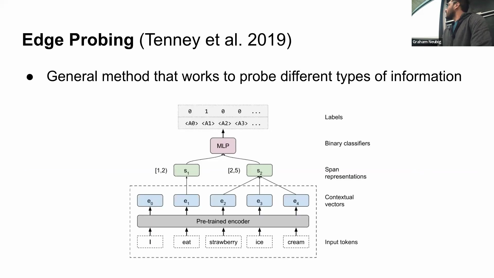
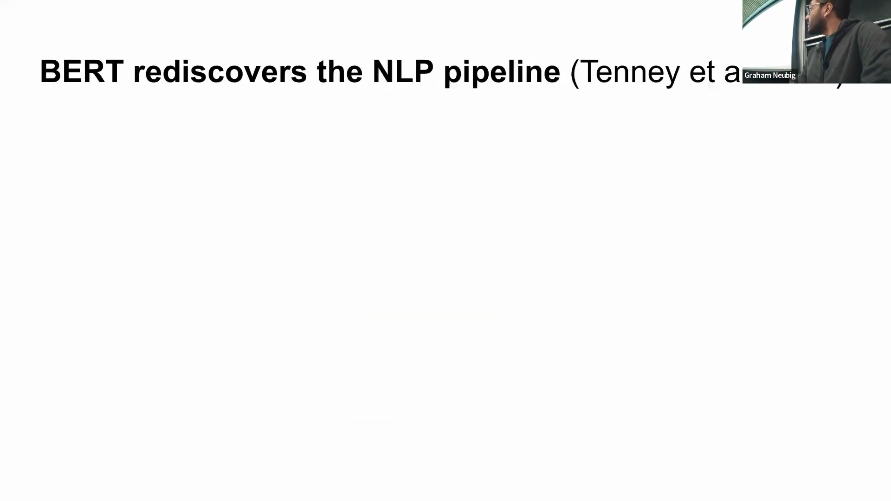

## 传统探针技术的局限性与衰落
尽管探针分析在早期颇具实用价值，但由于存在若干关键局限，该方法已逐渐式微。探针分析的成功并不能确凿证明模型本身“掌握”了某一概念；探针分类器可能仅仅是利用标注数据从头学习了该任务。反之，探针分析的失败也可能归因于探针架构设计不当或超参数调优(Hyperparameter Tuning)不佳，而非基础模型真正缺乏相关信息。

此外，探针分析通常依赖于有限的监督数据集(Supervised Datasets)，这种便利抽样(Convenience Sampling)往往更多地反映了数据集本身的偏差，而非模型的真实能力。最为关键的是，探针只能衡量相关性(Correlation)，无法确立因果关系(Causality)。它缺乏对模型的潜在表示空间(Latent Representation Space)进行干预(Intervention)的能力，因此无法证明特定的内部表示是否真正驱动了模型的决策过程。尽管后续研究尝试控制探针的复杂度，但这些根本性缺陷已促使学术界将研究重心转向更为严谨的因果分析方法。
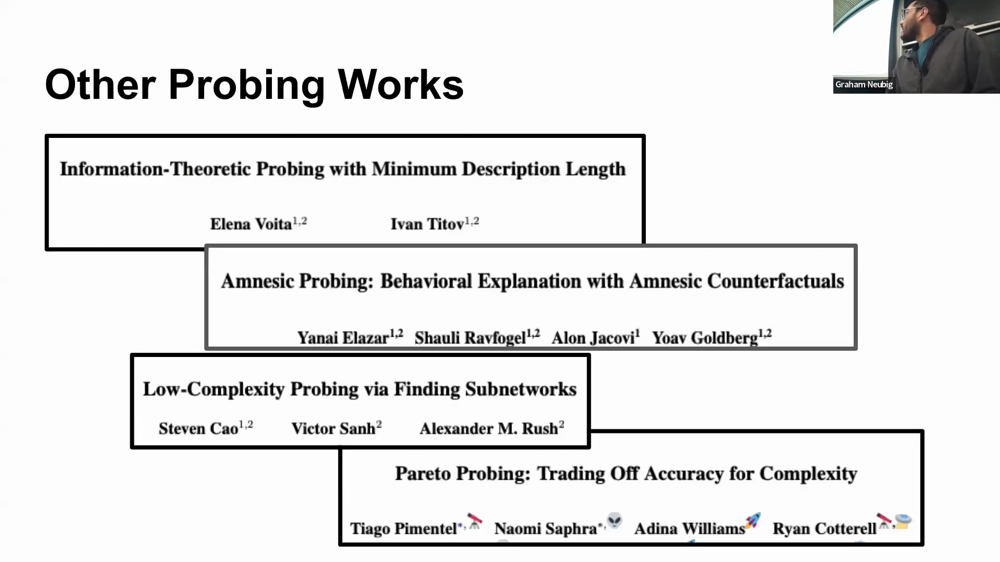

## 定义真正的模型可解释性
在探讨完探针分析的局限性后，本次讲座通过正式定义“模型可解释性”作结。它被定义为对模型内部运行机制（特别是权重与激活状态(Activations)）的严谨研究，旨在将这些技术性洞察转化为人类可理解的概念。
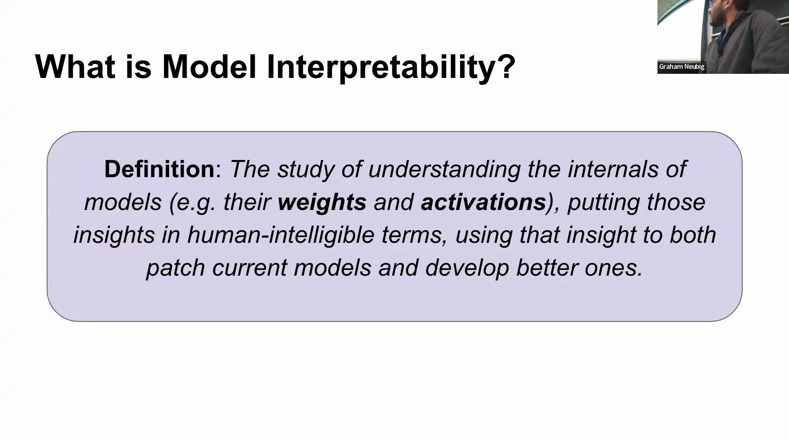
演讲者着重强调，真正的可解释性必须具备“可操作性”(Actionability)：所获得的洞察应能直接用于诊断和修复现有模型，同时为未来构建更稳健系统的架构设计与训练提供指导。如果一项研究无法同时实现实际的调试(Debugging)应用与前瞻性的设计改进，那么它便无法称得上是真正的可解释性。