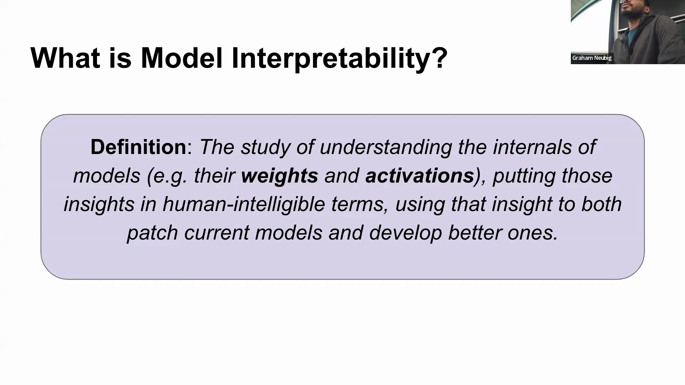
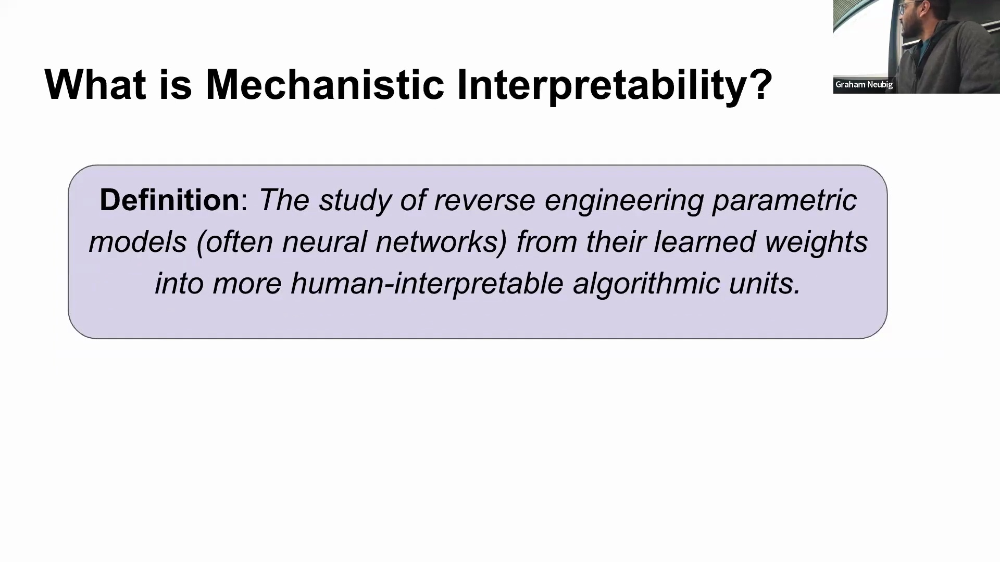
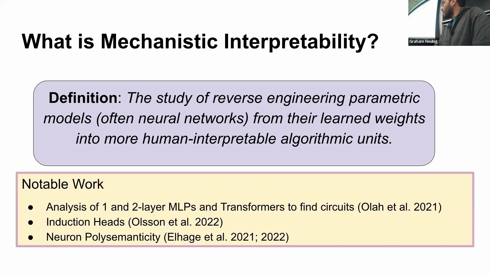
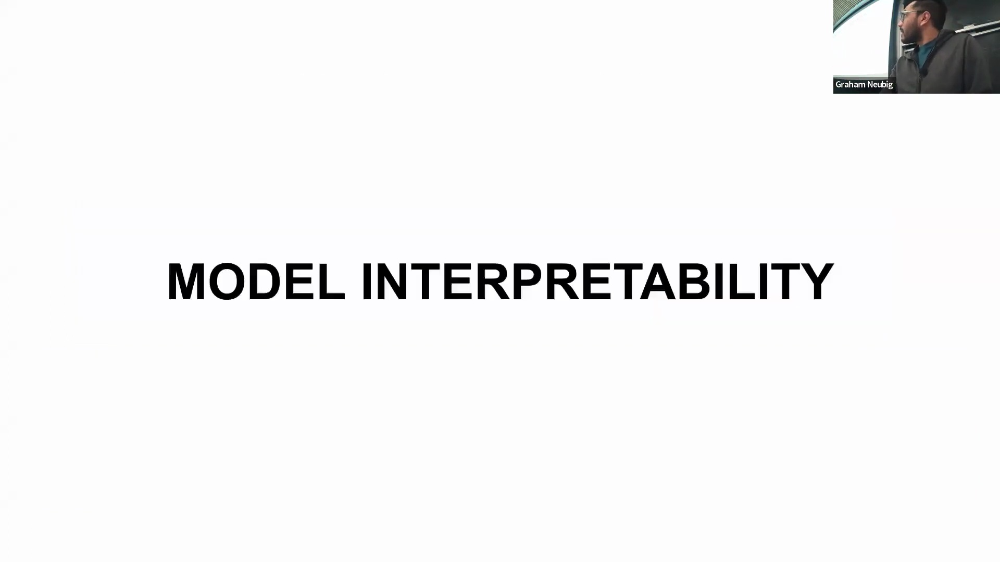
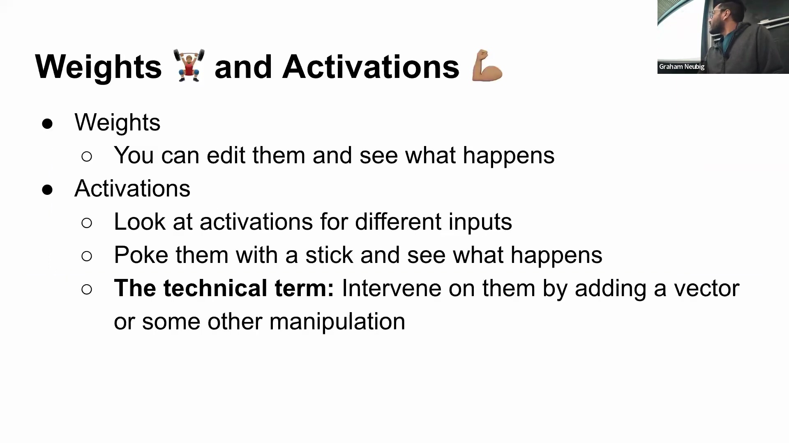
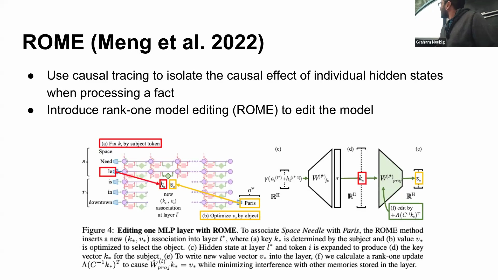

## 机制可解释性定义
讲座转入机制可解释性(Mechanistic Interpretability)的探讨。该领域被定义为模型可解释性的一个专门分支，专注于将参数化模型(Parameterized Models)（通常为神经网络）逆向工程(Reverse Engineering)为人类可理解的算法单元，这些单元通常被称为“电路”(Circuits)。研究模型并非仅出于学术好奇，其核心目标在于具备可操作性(Actionability)：利用这些洞察来修复现有系统，并在未来构建更稳健、更透明的模型。

## 归纳头（Induction Heads）与上下文学习
该领域的基础研究建立在早期长短期记忆网络(LSTM)的研究之上，通过分析小型多层感知机(MLP)和Transformer来绘制内部电路图谱。其中一项里程碑式的发现是“归纳头”(Induction Heads)的概念——这是一种特定的注意力机制(Attention Mechanism)，使模型能够执行上下文学习(In-Context Learning)。当提供提示词(Prompts)或少样本示例(Few-shot Examples)时，这些注意力头能够有效从直接上下文中复制或识别所需的词元(Token)模式，使模型无需更新底层权重即可生成准确的续写内容。

## 多义性（Polysemanticity）的挑战
研究发现的另一个关键现象是多义性(Polysemanticity)，即激活空间(Activation Space)中的单个神经元会同时编码多个不同的特征。随着模型处理海量数据批次，它们会将丰富的高维信息压缩到受限的隐藏维度(Hidden Dimensions)中。这种架构瓶颈迫使神经元对重叠或冗余的特征进行交织编码(Multiplexing)，从而产生线性依赖(Linear Dependence)，使得分离单一概念变得极为困难。鉴于嵌入矩阵(Embedding Matrix)的非方阵特性，这种特征压缩似乎是现代模型架构的结构性必然结果。

## Transformer 与替代架构的对比
在问答环节中，演讲者澄清指出，尽管早期的机制研究主要聚焦于GPT模型，但近期的研究已成功在基于Llama的架构中复现了这些现象，表明它们是语言模型的通用原理。初步比较表明，在形成归纳头及维持精确的复制机制方面，Transformer相较于循环神经网络(RNN)或状态空间模型(State Space Models, SSMs)（如Mamba）具有独特的架构优势。深入理解Transformer如何实现这种卓越的信息保持能力，将直接为下一代非Transformer架构的设计提供关键参考。

## 对权重与激活值的干预
从理论映射转向实际干预，讲座探讨了研究人员如何直接操控模型的权重(Weights)和激活值(Activations)。这一过程被通俗地称为“用棍子戳模型”(Poking Models with a Stick)，具体操作包括向潜在空间(Latent Space)添加向量或施加变换，以观察下游行为的改变。该领域的一项主要实际应用是模型编辑(Model Editing)，其目标是在无需全面微调(Fine-tuning)或损害模型其他通用能力的情况下，以外科手术般的精度精准更新模型对特定事实的知识。

## 定向模型编辑与因果追踪
模型编辑的理想状态是实现精准定位。例如，在更新模型以反映某位教授从卡内基梅隆大学(CMU)转至斯坦福大学时，不应无意中改变其对其他教职员工或地理事实的认知。为实现这一目标，研究人员采用“因果追踪”(Causal Tracing)技术来精确定位负责存储特定信息的隐藏状态(Hidden States)。通过系统性地扰动输入并追踪前向传播(Forward Pass)过程，研究人员能够分离出驱动特定输出的因果路径(Causal Pathways)。

一旦识别出相关状态，便会将闭式解(Closed-form Solution)应用于权重矩阵。以将“太空针塔”(Space Needle)的关联地点从西雅图更改为巴黎为例，编辑操作将实体与位置视为键值对(Key-Value Pairs)。权重通过数学方法进行调整，以重定向模型针对该特定键的输出，从而在理论上保留所有其他无关知识。

## 模型编辑的局限性与批判
尽管这些编辑技术背后的数学原理十分优雅，但演讲者对其在实际应用中的可靠性持高度谨慎态度。因果追踪阶段的计算成本高昂，需要执行大量连续的前向传播。更为关键的是，实现完全局部化(Localized)的编辑仍极具挑战；修改单一事实往往会无意中破坏模型的其他能力、引入意外偏差，或引发连锁推理失败(Cascading Reasoning Failures)。因此，尽管模型编辑代表了可解释性与工程学的迷人交汇点，但其可扩展性(Scalability)与安全性(Safety)仍是当前学术界活跃且尚未完全解决的研究挑战。