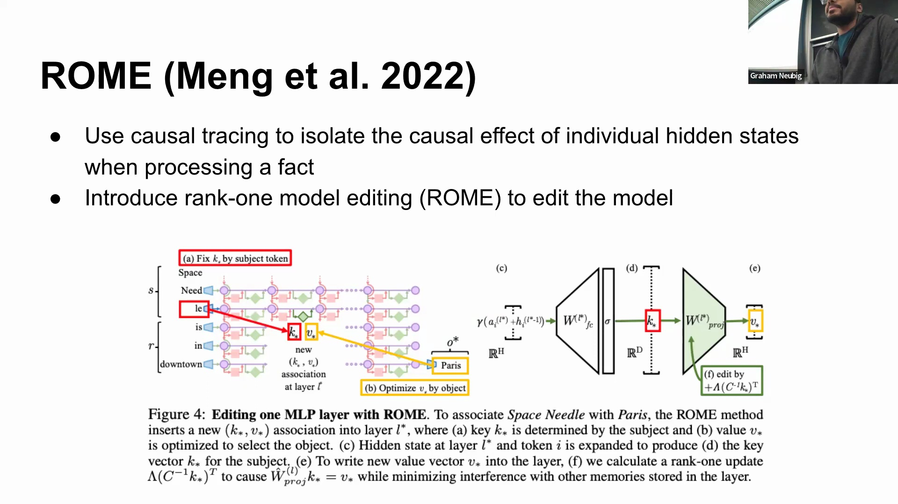
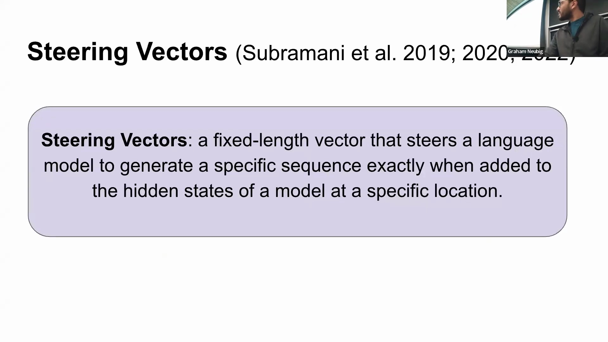
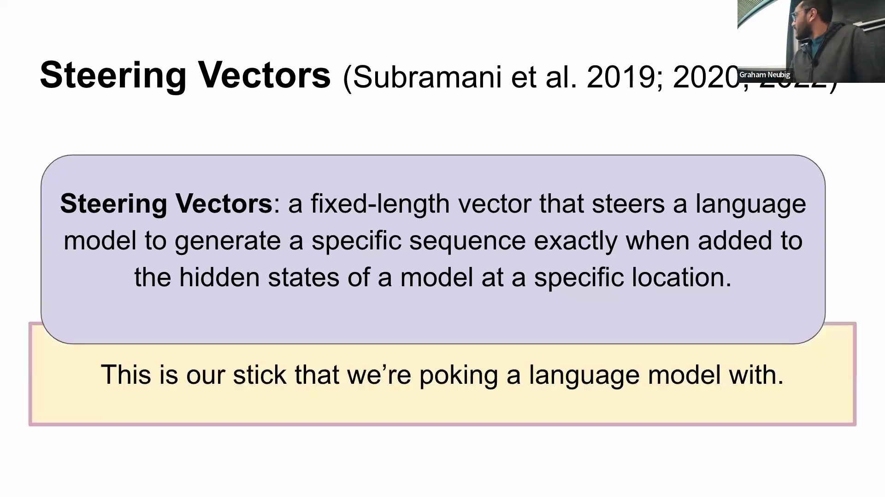
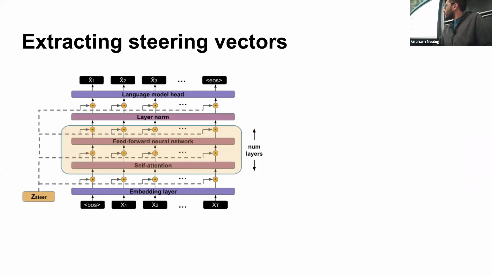
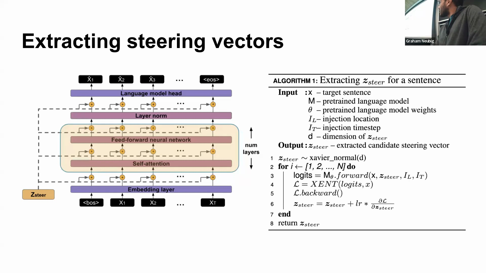
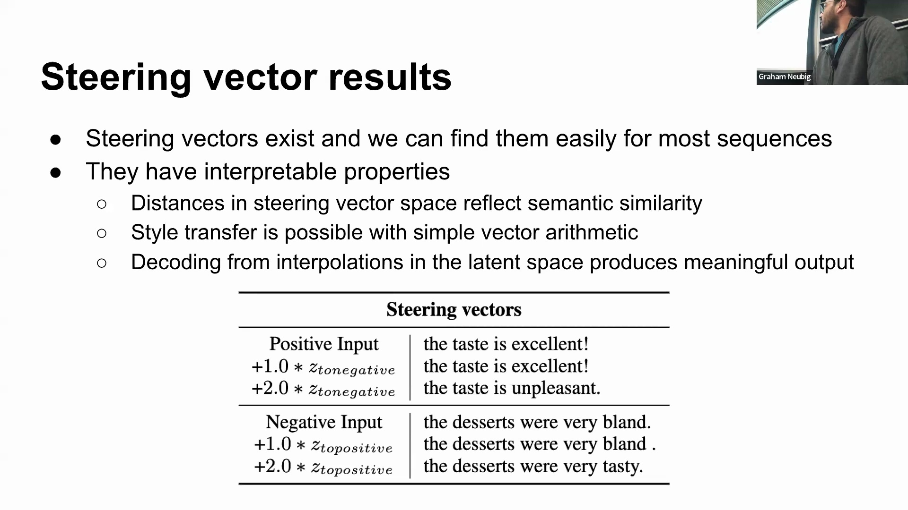

## 干预与模型中的信息冗余
神经网络中的定向干预(Targeted Intervention)具有高度的上下文依赖性。针对不同的输入示例，通常需要在不同的网络层和位置施加干预，才能达到预期效果。在大型架构中，信息往往在多条路径间高度冗余(Information Redundancy)。因此，单次强烈的干预或许足以扰乱整个网络中的上下文特征，但精准定位仍具挑战；若操作不够精细，则可能如同“用大锤砸模型”一般，破坏其他无关的表征(Representations)。

## 引导向量（Steering Vectors）的定义
讲座随后转向一种专门基于激活值的干预方法，即引导向量(Steering Vectors)。它被定义为维度固定的连续向量(Continuous Vector)，当在特定位置注入模型的隐藏状态(Hidden States)时，会迫使语言模型生成预设的目标序列。与传统的软提示(Soft Prompts)或基于权重的模型编辑(Weight-based Model Editing)不同，引导向量经过专门优化，仅映射至特定的输出序列，充当精准“拨动”模型潜在空间(Latent Space)的控制柄。

## 优化与提取过程
其提取过程十分直观：引导向量首先通过小幅度随机值初始化，随后在底层语言模型权重完全冻结(Frozen)的条件下，进行多轮迭代优化。通过在关键位置（通常是初始时间步(Timestep)和中间隐藏层）注入该向量，模型的生成过程会逐渐被“引导”至目标输出。优化收敛后，仅需将序列起始符(Start-of-Sequence Token)与优化后的引导向量一同输入，模型即可通过贪心解码(Greedy Decoding)自主生成完整的目标序列。

## 与软提示相比的效率优势
该方法与传统的软提示形成鲜明对比，后者通常依赖较长的序列长度或较大的提示维度，才能有效引导模型行为。引导向量的序列维度仅为 1，其特征维度则与模型的隐藏维度(Hidden Dimension)严格匹配。这一设计将提示信号高效压缩为单个连续向量，在保持对生成过程精准控制的同时，大幅降低了计算与参数开销。

## 语义特性与向量空间行为
研究表明，引导向量可被稳定提取，适用于大多数序列（含模型训练时未见过的序列），且在处理高概率文本时效率最高。该优化过程极为强大，甚至能强制模型生成随机或低概率序列，实质上扮演了“推土机”的角色，覆盖(Override)了模型原有的概率分布。关键在于，生成的向量空间展现出高度的可解释性：引导向量间的几何距离紧密对应语义相似度，其表现始终优于传统探针任务(Probing Tasks)中使用的基线表征（如均值池化隐藏状态(Mean-Pooled Hidden States)）。

## 基于向量算术的风格迁移
引导向量最具吸引力的应用之一，便是仅通过简单的线性代数(Linear Algebra)运算即可实现风格迁移(Style Transfer)。由于提取出的向量分布于结构规整且连续的空间中，对其进行插值(Interpolation)操作能够生成语义连贯、风格融合的文本，而非无意义的乱码。此外，基础的向量算术运算可实现精确的风格控制。通过对不同情感样本的引导向量取平均（例如分别计算 100 个正面句子与 100 个负面句子的向量均值），研究人员可运用直观的向量运算（如叠加负面概念向量并减去正面概念向量），从而无缝反转或调整生成文本的情感倾向(Sentiment Polarity)。
