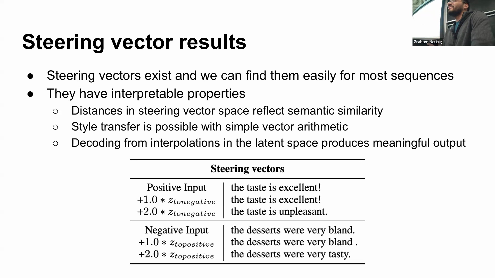
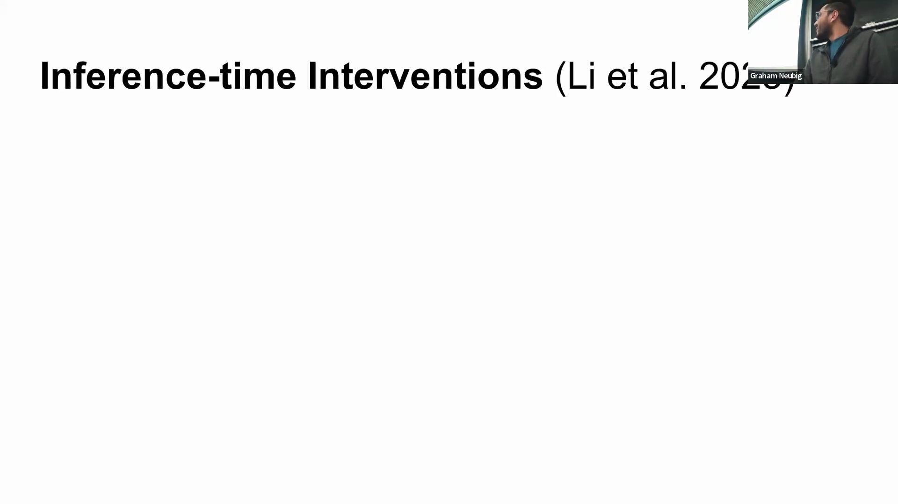
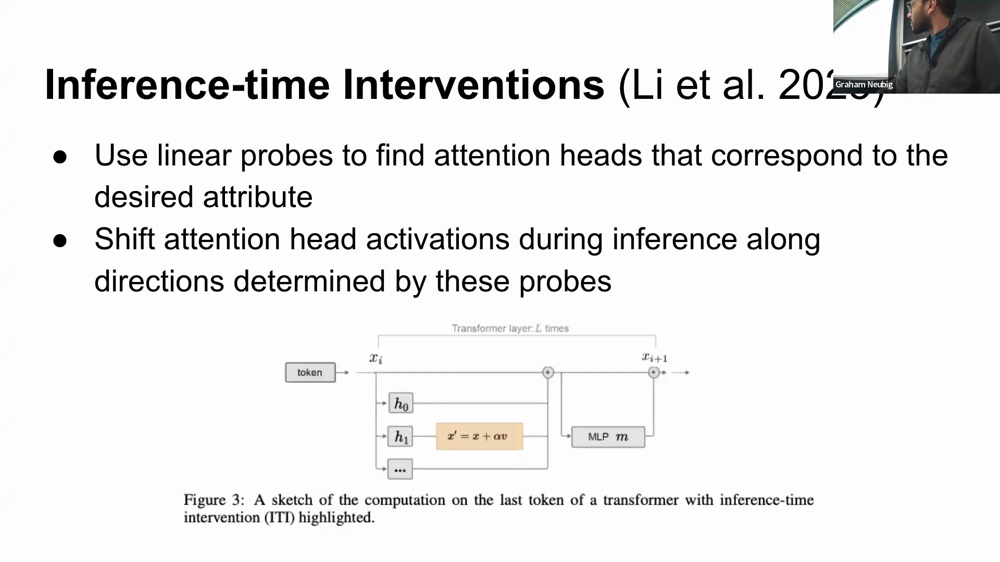
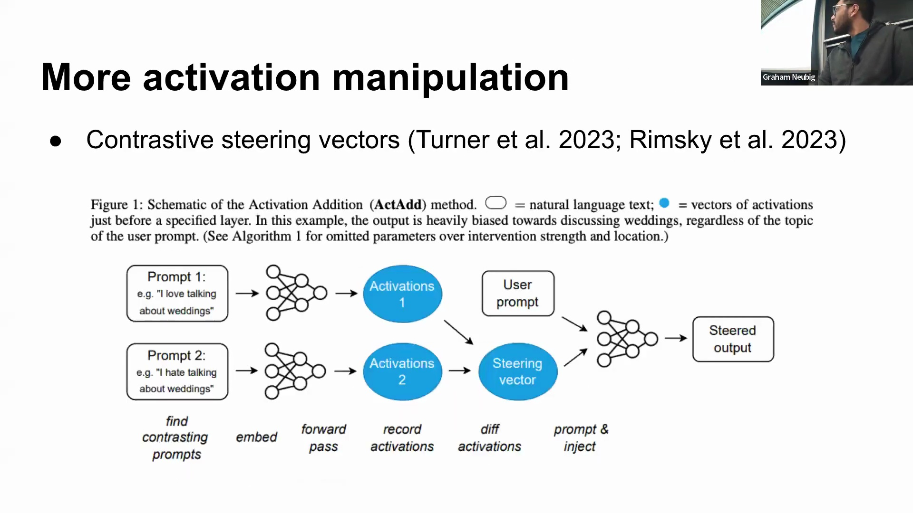
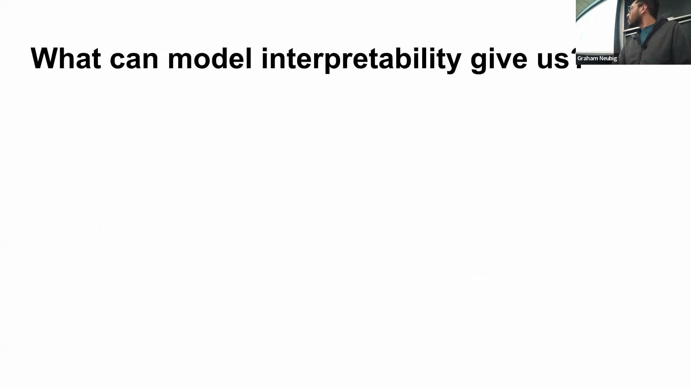
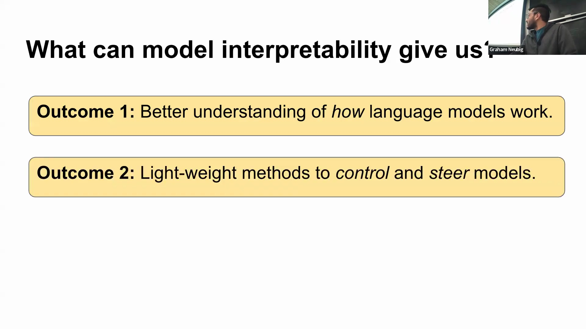
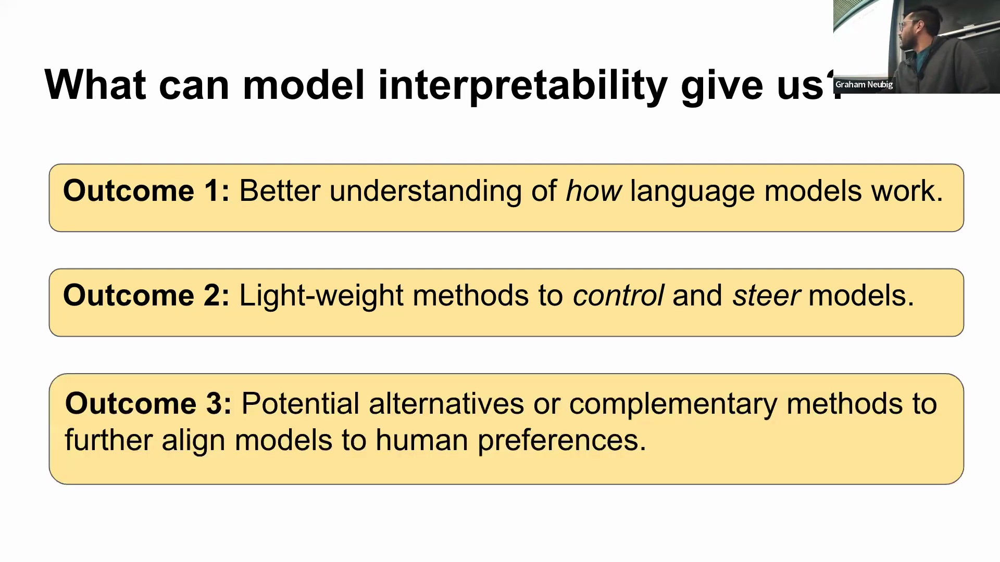
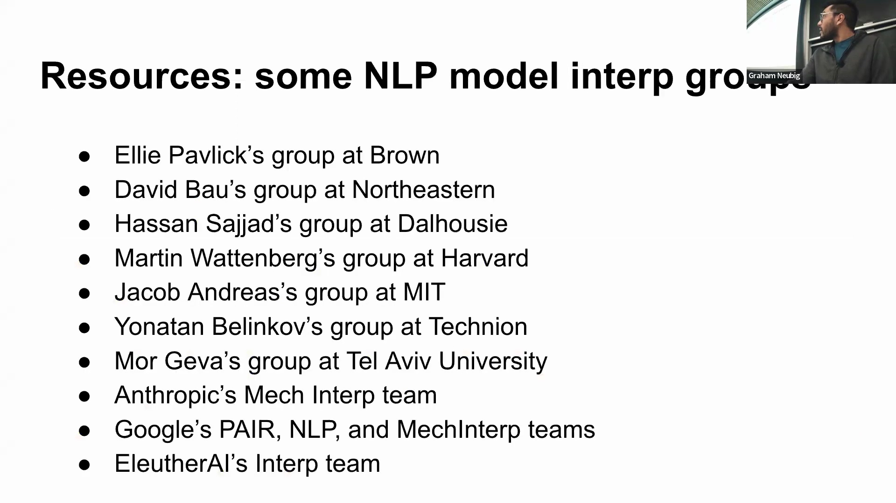

## 向量运算与语义风格迁移
通过对提取的引导向量(Steering Vectors)执行简单的线性代数(Linear Algebra)运算，研究人员能够实现精确的风格迁移(Style Transfer)与情感反转(Sentiment Reversal)。例如，将“正面味觉”向量减去“正面情感”向量，即可成功促使模型输出转变为“味道令人不悦”，反向操作同样有效。这表明引导向量空间具备优良的几何与语义结构，能够支持有意义的概念操作(Concept Manipulation)，而非生成随机噪声。

## 幅度约束与稳定球
尽管向量运算功能强大，但干预的幅度(Magnitude)至关重要。每个成功提取的引导向量周围都存在一个 n 维“稳定球(Stability Sphere)”，在该范围内模型能够可靠地解码出目标序列。然而，注入幅度过大的向量会将模型推入未曾探索的激活状态(Activation States)，使其表现得如同未经训练的随机网络，并生成重复的乱码。经验测试表明，适度的缩放因子(Scaling Factor)（约 2 至 5 倍）可维持模型稳定，而过强的干预则会迅速破坏其连贯生成(Coherent Generation)的能力。

## 通过注意力探针引导模型走向真实性
近期的研究进展已将类似的激活干预(Activation Intervention)技术应用于提升模型输出的可靠性。通过在特定的注意力头(Attention Heads)上训练线性探针(Linear Probes)，以识别表征“真实”与“虚假”的潜在方向，研究人员能够在推理阶段(Inference Stage)有效引导模型输出。具体而言，该操作沿垂直于所学超平面(Hyperplane)的方向，将激活值向“真实”一侧平移。关键在于，并非所有注意力头的贡献均等；许多头的探针准确率有限，仅充当噪声干扰，这证实了仅部分注意力头专门负责编码特定属性。仅针对相关注意力头实施定向干预，才能取得最有效且稳定的结果。

## 用于保留上下文的对比引导
一种更为精细的方法——对比引导(Contrastive Steering)——旨在解决全局概念向量操纵(Global Concept Vector Manipulation)的局限性。该方法不再针对孤立概念提取单一向量，而是生成两个在特定方向上产生分化的差异化提示状态(Divergent Prompt States)。通过计算这两种表示之间的差值，研究人员可推导出对比向量(Contrastive Vector)，从而在严格保留原始上下文的前提下偏移模型的输出分布。该方法对检索增强生成(Retrieval-Augmented Generation, RAG)和动态提示(Dynamic Prompting)尤为宝贵，因其能够实现精确的实例级控制(Instance-level Control)，效果优于更宽泛的基于属性的引导(Attribute-based Steering)技术。

## 结语与可解释性的未来
模型可解释性(Model Interpretability)为揭开语言模型内部架构的神秘面纱提供了一条清晰路径，阐明了其高效运作的内在机制以及实现轻量级控制(Lightweight Control)的方法。随着人工智能系统(AI Systems)触达更广泛的用户群体，开发可靠的引导(Steering)方法已变得至关重要。鉴于人类反馈强化学习(Reinforcement Learning from Human Feedback, RLHF)等传统对齐技术(Alignment Techniques)计算成本高昂，可解释性研究有望提供成本更低、数据效率更高(Data-Efficient)的替代或补充方案，通过挖掘现有模型结构来实现更优的模型对齐。在工业界应用前景尚待进一步验证的当下，学术界在开拓此类科学方法方面肩负着至关重要的使命。

## 资源与新兴研究图景
近年来，该领域经历了爆发式增长，其中机制可解释性(Mechanistic Interpretability)尤为突出。我们强烈鼓励有意投身于此的研究人员与学生深入探索日益丰富的学术文献，并积极与致力于绘制神经电路图谱(Neural Circuit Mapping)的顶尖研究团队展开合作。作为一个快速演进的研究领域，它已成为人工智能安全(AI Safety)与模型架构设计(Model Architecture Design)中最令人振奋的前沿阵地之一，为深化理论认知与实现创新的模型控制提供了广阔空间。

