## AWS 额度与 GPU 环境准备
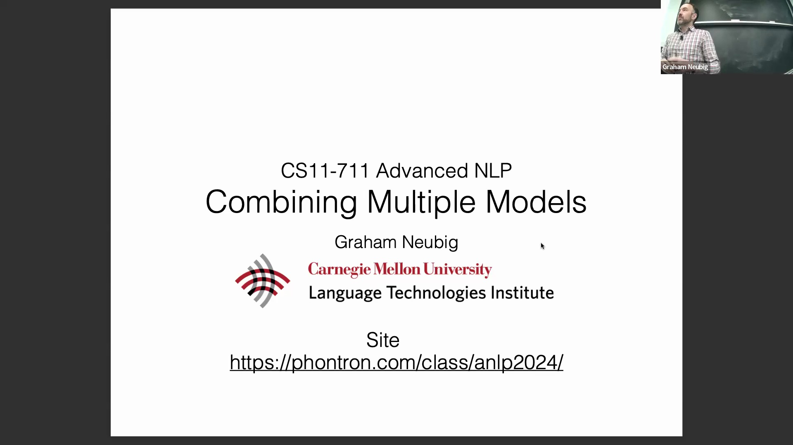
课程首先通报了关于 AWS 额度(AWS Credits)的管理更新。尽管发放流程近期才启动且略有延迟，但额度预计很快便会到账。在此期间，强烈建议立即着手配置 GPU 实例(GPU Instances)（例如 P2 实例(P2 Instances)）。由于申请 GPU 配额提升(Quota Increase)通常需要额外的审核与处理时间，尽早通过 AWS 控制台(AWS Console)启动实例可有效避免后续遇到资源瓶颈。在妥善完成这些环境准备工作后，讲座将正式进入核心技术内容。

## 模型多样性与组合适用性概览
本主题主要探讨如何组合多个模型，这是一种能稳步提升模型精度的可靠技术。要理解这一点，首先必须认识到现有模型(Model)庞大的生态系统(Model Ecosystem)，其源于以下几个关键因素：多样的模型架构(Model Architectures)、不同的随机初始化(Random Initialization)方式、各异的预训练数据集(Pre-training Datasets)以及众多的微调策略(Fine-tuning Strategies)。由此衍生出复杂的模型家族谱系（例如 Llama 2、Mistral 及其指令微调(Instruction-tuned)变体）。在进行模型组合时，具体技术的选择很大程度上取决于模型间的相似度。部分方法适用于完全不同的架构，而另一些方法则严格要求模型具备相同的初始化状态或训练轨迹(Training Trajectory)。
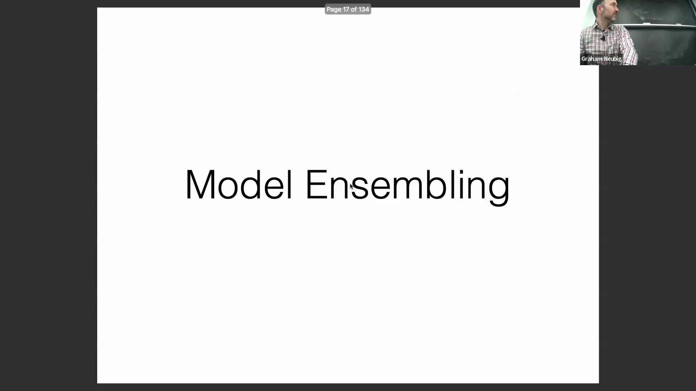

## 模型集成简介
首先介绍的核心技术是模型集成(Model Ensembling)，这是一种在解码过程(Decoding Process)中融合多个模型预测结果的通用方法。在生成过程中，每个模型独立计算其解码器状态(Decoder States)并输出词元(Token)预测，随后这些独立输出将被聚合，以确定最终的序列输出(Sequence Output)。这就引出了一个关键问题：为何要依赖多个模型，而非直接部署表现最优的单一模型？答案在于，在误差缓解(Error Mitigation)方面，集体预测相比单一模型具有根本性优势。
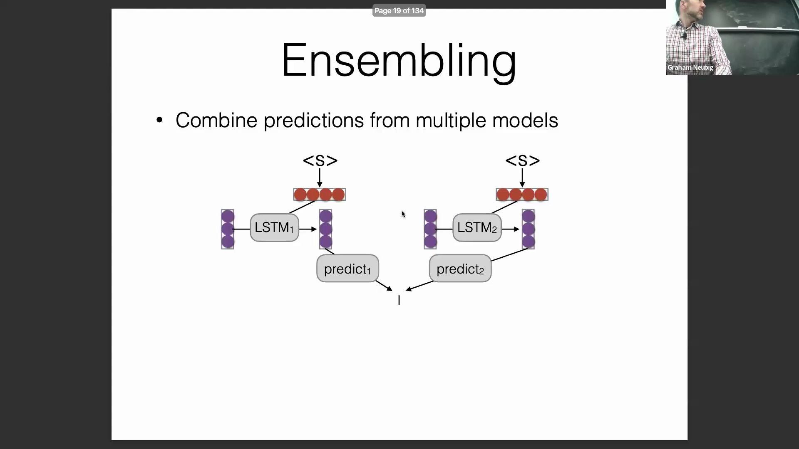

## 集成的优势与误差平滑
集成技术具有多项关键优势：它能有效降低单一模型的偏差(Bias)，契合处理不确定性(Uncertainty)的贝叶斯视角(Bayesian Perspective)，并能充分利用模型间的互补优势(Complementary Strengths)。其核心原理在于，不同模型产生的误差往往是不相关的(Uncorrelated)，而它们的正确预测则具有高度一致性。通过对概率分布(Probability Distributions)进行平均，各模型特有的错误能够相互抵消，从而显著提升选中正确输出的概率。这种平滑效应(Smoothing Effect)极为稳健，即便对来自不同训练检查点(Training Checkpoints)的模型进行集成，也能持续带来性能增益。在实践中，模型集成是提升性能最可靠的方法之一，几乎总能带来可量化的精度提升。
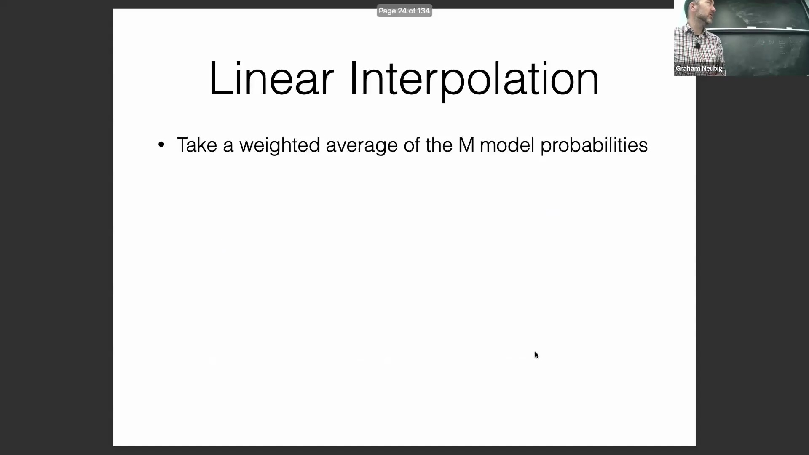

## 用于模型组合的线性插值
模型组合主要有两种主流方法，各自适用于不同的应用场景。首先介绍的是线性插值(Linear Interpolation)。从数学角度而言，该技术涉及对参与模型的输出概率(Output Probabilities)计算加权平均值(Weighted Average)。这种直接的聚合策略(Aggregation Strategy)是融合预测的基础手段，也为后续更复杂的组合技术奠定了理论基础。

---

## 线性插值与混合权重
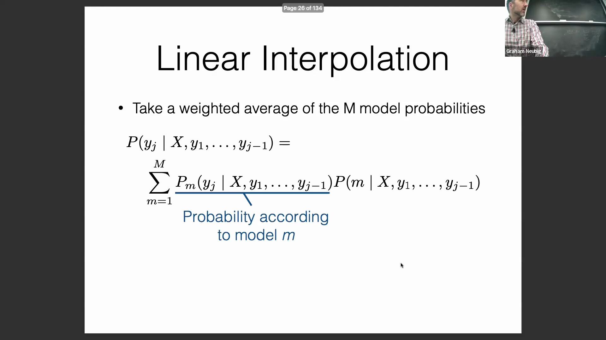
模型组合(Model Combination)的基础依赖于贝叶斯公式(Bayes' Theorem)：$P(w_t) = \sum_m P(w_t|M_m) P(M_m)$。其中，$P(w_t|M_m)$ 表示模型 $M_m$ 生成的下一词元(Token)概率，而 $P(M_m)$ 表示在给定时间步(Time Step)选择该特定模型的概率。定义 $P(M_m)$ 最直接的方法是采用固定混合权重(Fixed Mixing Weights)。这些权重为预定义数值，取值范围在0到1之间且总和为1，从而允许在所有时间步上对模型输出进行静态插值(Static Interpolation)。

## 动态权重建模与实现
相较于依赖静态权重，模型选择概率 $P(M_m)$ 可根据当前上下文(Context)进行动态学习(Dynamic Learning)。这使得系统能够为最适合特定预测任务的模型分配更高的概率。该方法具备极高的工程实用性(Engineering Practicality)：开发者可预先计算每个基模型(Base Model)在各时间步的词元概率。因此，权重模型(Weight Model)可独立进行训练，无需在训练阶段将庞大的基模型加载至内存(Memory)中。

## 对数线性插值与重归一化
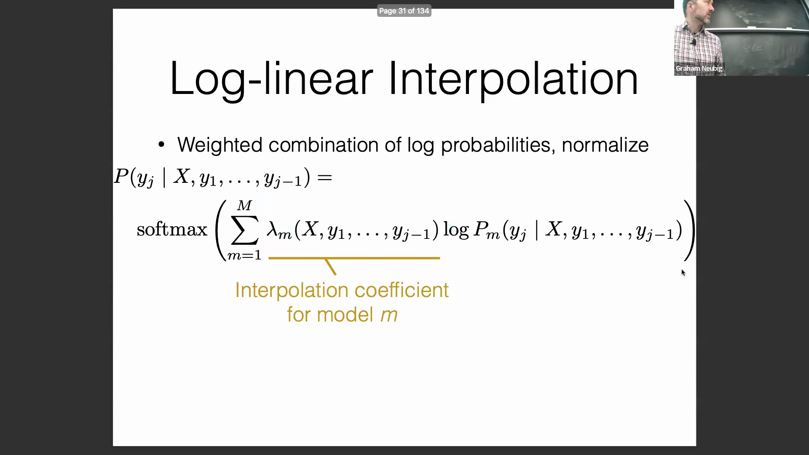
作为线性概率组合(Linear Probability Combination)的替代方案，对数线性插值(Log-linear Interpolation)首先聚合各模型的对数概率(Log-probabilities)，随后将其转换回有效的概率分布(Probability Distribution)。由于在对数空间(Log-space)内对数值求和会破坏概率的归一化约束（数值总和不再自动为1），因此必须严格执行 Softmax 重归一化(Softmax Renormalization) 步骤。尽管该过程在 PyTorch 等框架(Frameworks)中计算实现十分直接，但它对维持数学上严谨的概率分布至关重要。此处的插值系数(Interpolation Coefficients)同样可设置为固定常数或通过动态学习获得。

## 有限数据下的高效调优
学习动态插值系数具有极高的数据效率(Data Efficiency)。由于权重模型仅需在少量候选模型（例如对5个选项进行 Softmax 计算）上预测概率分布，而非在庞大的词表(Vocabulary)上进行预测，因此其自由度(Degrees of Freedom)极低。这使得仅需少量样本即可有效优化系数，甚至可将其配置为上下文无关(Context-independent)的静态参数。例如，当将一个1.3B参数的医疗领域语言模型(Medical Domain Language Model)与一个70B参数的通用英语语言模型(General-purpose English Language Model)结合时，系统能够快速学习：在遇到专业术语(Domain-specific Terminology)时提升医疗模型的权重，而在处理标准语法时依赖通用大模型。这种机制使其在训练数据有限的领域适应(Domain Adaptation)场景中表现尤为出色。
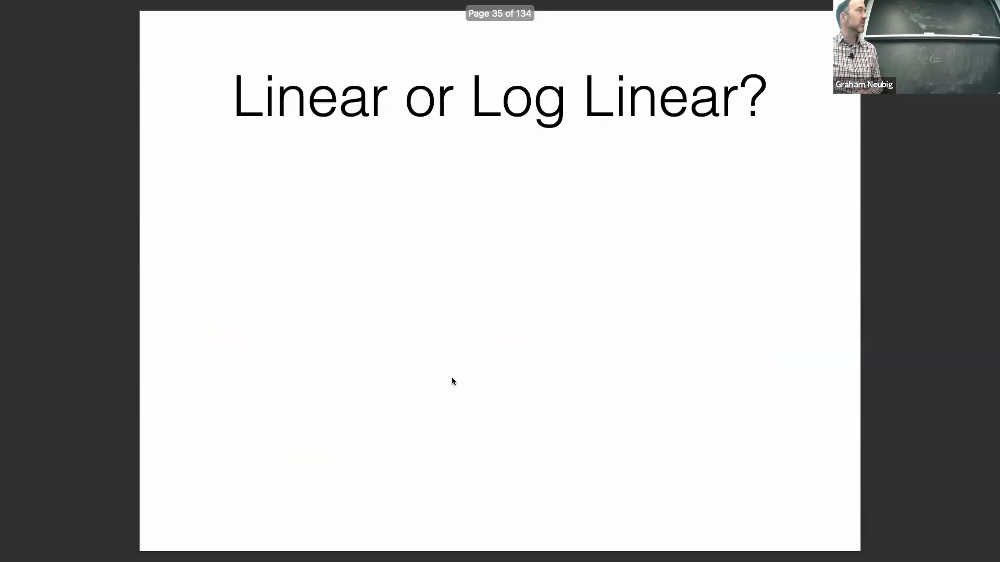
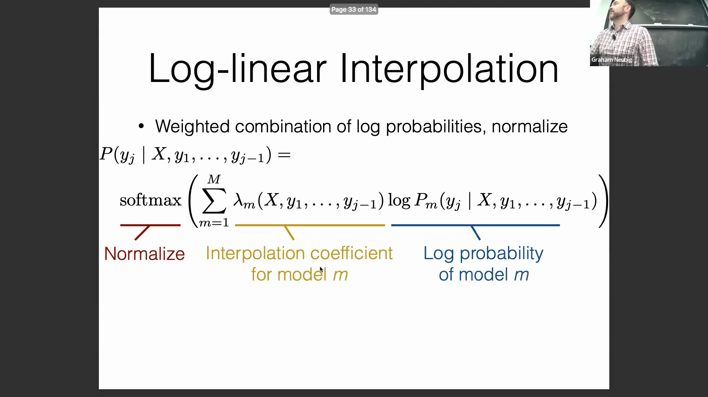

## 线性与对数线性：逻辑“或”与“与”
线性插值与对数线性插值的选择可从逻辑门(Logical Gates)的视角进行理解。线性插值的行为类似于逻辑“或”(OR)运算：只要任一模型对某词元赋予高概率，融合后的得分便会维持在较高水平。该特性在捕捉模型多样性、提升通用模型可能忽略的罕见词汇，或安全处理词表不匹配(Vocabulary Mismatch)的模型（避免陷入零概率陷阱(Zero-probability Trap)）时具有显著优势。相反，对数线性插值的行为类似于逻辑“与”(AND)运算，要求所有模型达成共识(Consensus)方可赋予高分。该特性在约束输出空间(Output Space)或实现安全过滤器(Safety Filters)时尤为有效。例如，通过确保任一模型的强烈负向信号(Negative Signals)能大幅拉低组合概率，从而有效拦截有害语言(Harmful Language)的生成。
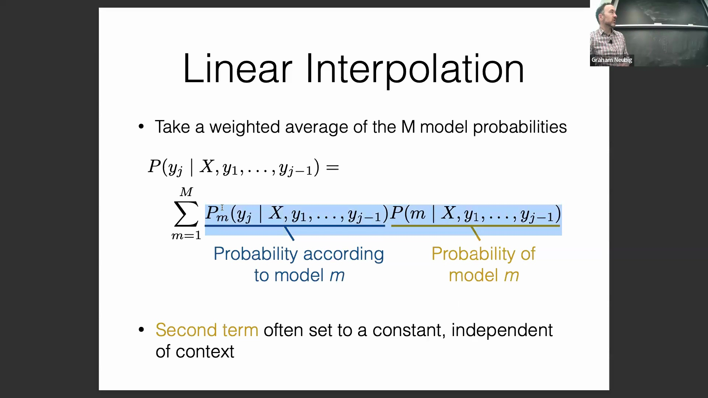
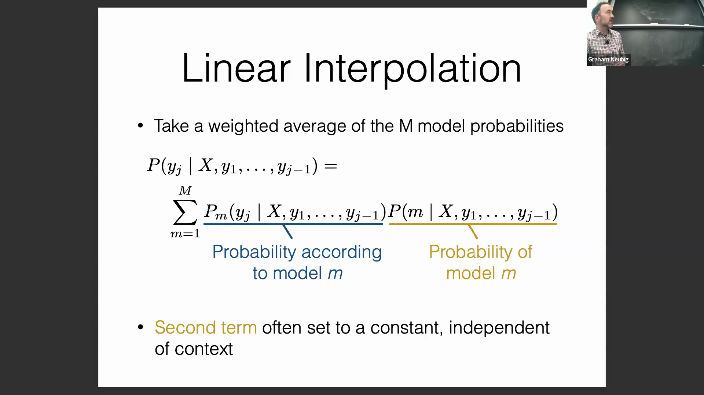
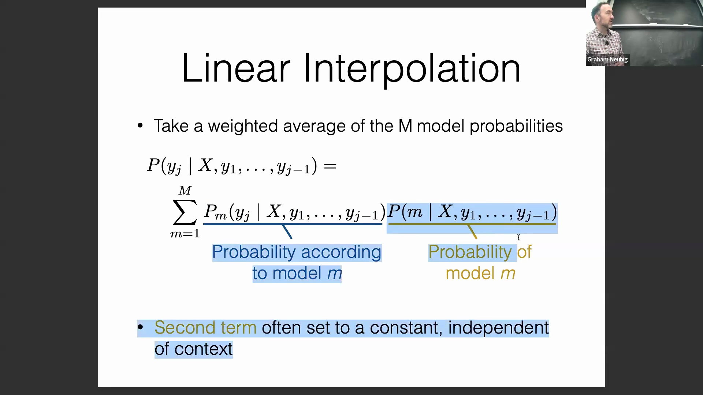

---

## 处理零概率与词表不匹配问题
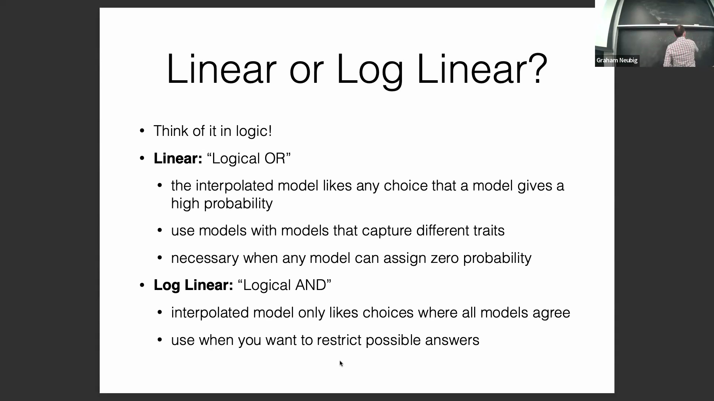
在模型组合(Model Combination)过程中，为某些词元(Token)分配零概率(Zero Probability)会带来显著的评估挑战(Evaluation Challenges)，因为这实际上会阻止模型在解码时选择这些词元。若两个模型拥有完全不同的词表(Vocabulary)，协调它们的输出将变得极其复杂。然而，线性插值(Linear Interpolation)提供了一种实用的变通方案：通过仅聚焦于重叠词表(Overlapping Vocabulary)，系统可安全忽略不匹配的词元。在此配置下，即便某一模型对词表外(Out-Of-Vocabulary, OOV)词元分配了零概率，另一模型仍可提供有效的概率分布(Probability Distribution)，从而防止组合输出失效。尽管具备此灵活性，整合词表差异巨大的模型仍需在架构层面进行审慎考量。

## 误差相关性对集成的影响
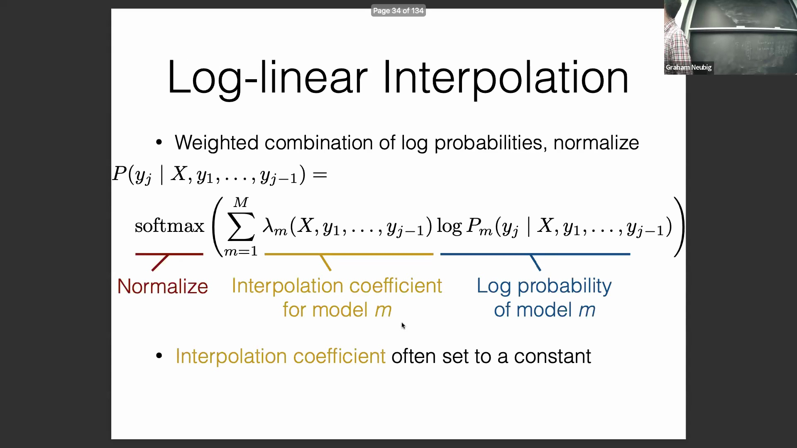

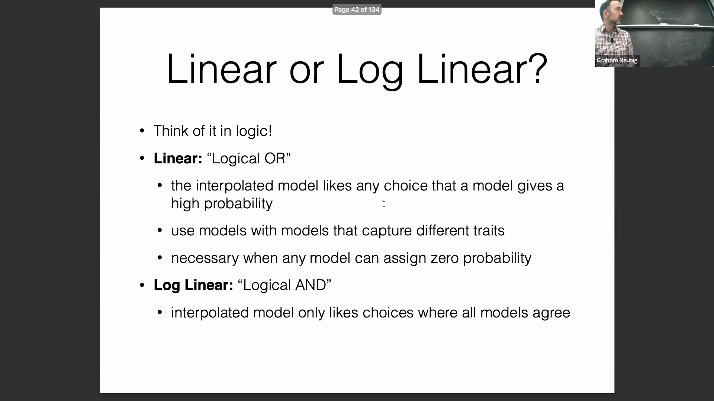
模型集成(Model Ensembling)带来的性能增益在很大程度上依赖于一个核心假设：即各模型的误差(Error)是不相关的(Uncorrelated)。若误差完全相关(Perfectly Correlated)——例如复制同一模型并重复运行两次——集成将无法带来任何改进，但通常也不会损害原有性能。尽管理论上可构造降低准确率(Accuracy)的干预手段，但在关于训练数据分布(Training Data Distribution)与模型行为的合理假设下，组合多个预测器(Predictors)始终能为整体性能提供稳健的提升。

## 带负权重的对数线性插值
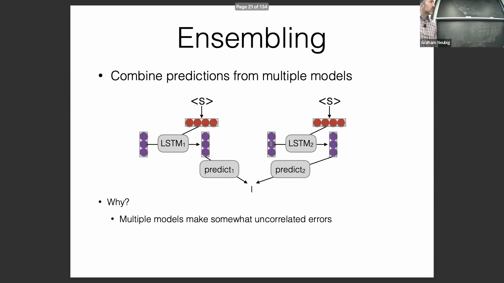
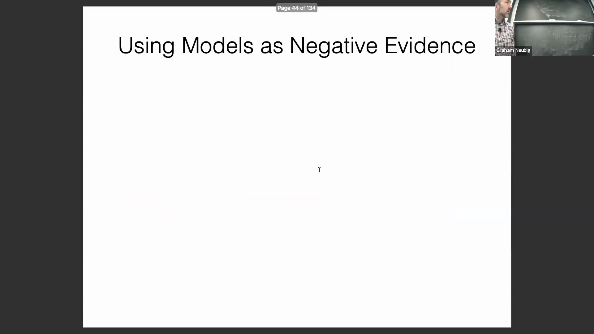
对数线性插值(Log-linear Interpolation)的一个高效扩展在于支持负插值系数(Negative Interpolation Coefficients)。与严格要求权重为正且总和为1的标准线性组合(Standard Linear Combination)不同，对数线性插值在对数空间(Log-space)中运作，天然允许系数为负。这使得特定模型能够充当“负向证据”(Negative Evidence)，主动抑制其他模型分配的预测概率。该技术自21世纪00年代中期起便已成功应用于机器翻译(Machine Translation)研究。通常，其集成架构围绕一个核心模型(Core Model)、一个正向模型(Positive Model，用于提升期望输出)以及一个负向模型(Negative Model，用于抑制非期望模式)来构建。

## 实际应用：领域适应与安全过滤
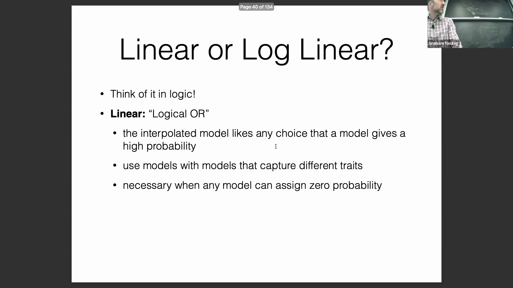
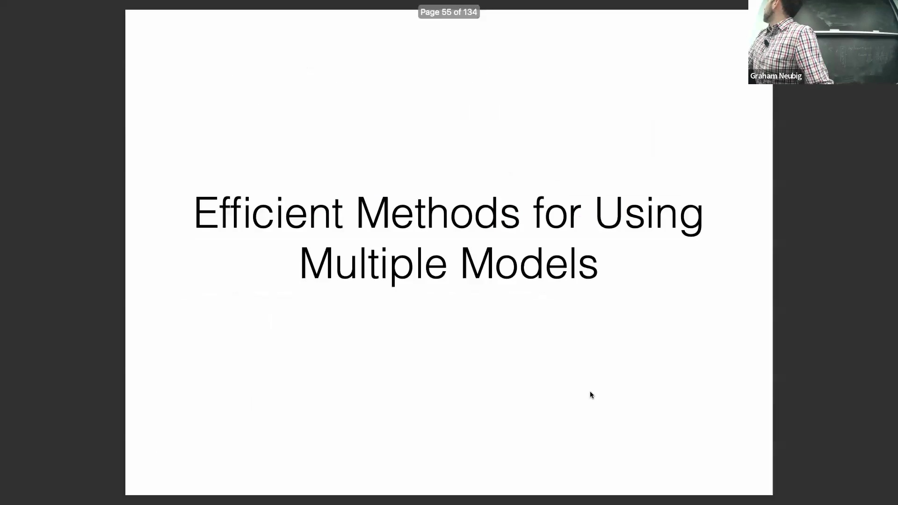
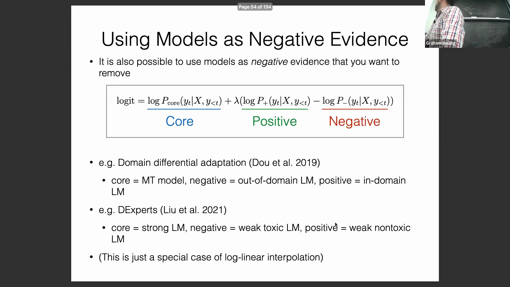
负权重在领域适应(Domain Adaptation)与内容审核(Content Moderation)等实际场景中表现尤为出色。在机器翻译中，当特定领域的平行语料(Parallel Corpora)稀缺时（例如医疗文本相较于通用新闻），可将核心翻译模型与正向的领域内(In-domain)语言模型及负向的领域外(Out-of-domain)语言模型相结合。通过在数学运算上减去领域外概率并叠加领域内概率，系统无需经历昂贵的重新训练(Retraining)过程即可快速适应新语境。类似地，DExperts框架将此方法应用于安全性控制(Safety Control)：将一个强大的基础模型(Base Model)与在有毒文本(Toxic Text)上训练的负向模型，以及在清洁文本(Clean Text)上训练的正向模型进行配对。负权重会主动抑制有害语言(Harmful Language)的生成，从而有效地对文本生成流水线(Generation Pipeline)进行“去毒化”(Detoxification)。

## 生成模型多样性：Dropout 与 Bagging
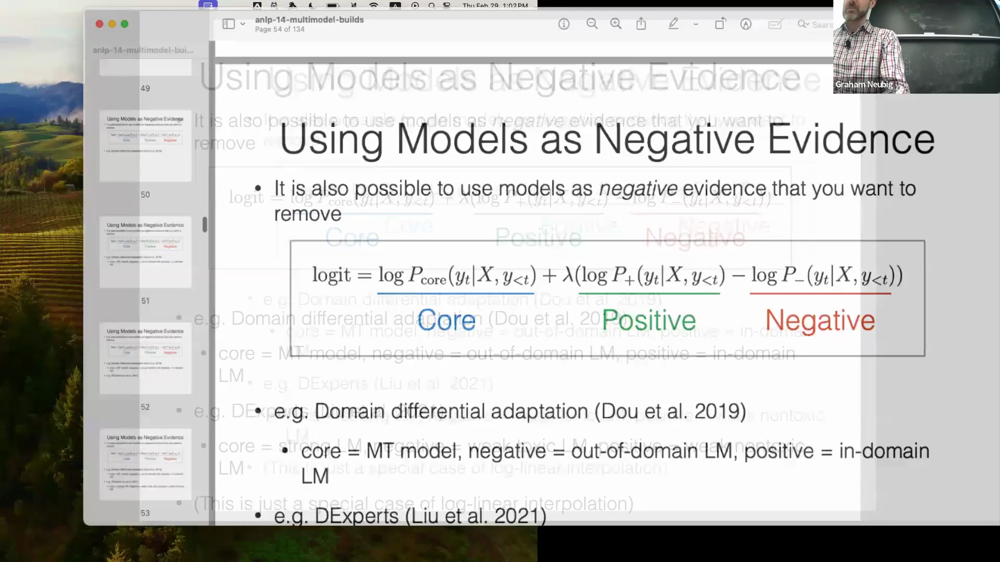
除了训练完全独立的网络架构(Network Architectures)外，还可从现有网络中高效生成多个模型变体(Model Variants)。Dropout 传统上作为一种在训练期间随机停用节点的正则化技术(Regularization Technique)，在推理阶段(Inference Phase)同样可被重新利用。通过在生成过程中重复应用 Dropout，单个网络实质上便转化为一个由不同子网络(Subnetworks)构成的集成，其预测结果会被动态聚合——这一理念恰恰是当初提出 Dropout 的理论动机所在。另一项基础技术是 Bagging（Bootstrap Aggregating，自助聚合法），该方法通过对训练数据集(Training Dataset)进行有放回重采样(Sampling with Replacement)，构建多个规模一致的数据子集。在每个自助子集(Bootstrap Subset)上独立训练模型，自然会衍生出具备多样性的预测器(Predictors)，这些预测器在组合使用时往往能发挥极佳效果。

---

## 基于 Bagging 与检查点的多样化模型生成
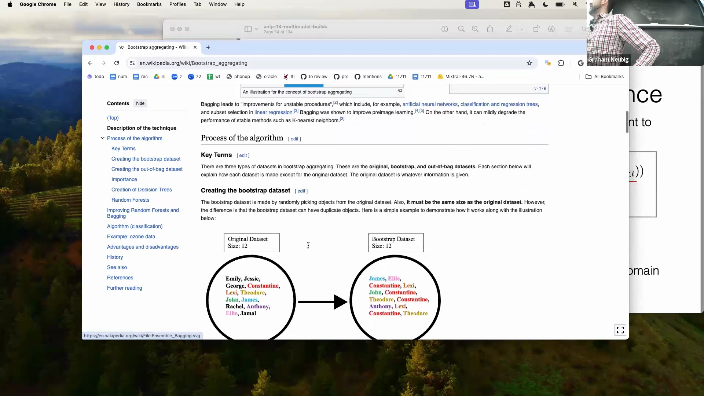
在传统集成技术(Ensembling Techniques)的基础上，Bagging（自助聚合法(Bootstrap Aggregating)）与利用训练检查点(Training Checkpoints)等方法提供了一条高效途径，无需设计全新架构即可生成多个模型变体(Model Variants)。Bagging 涉及对训练数据集(Training Dataset)进行有放回的重采样(Sampling with Replacement)以训练独立模型，确保每个模型接触到略微不同的数据分布(Data Distribution)。同样，保存并融合来自不同训练检查点的模型参数，也能提供多样化的预测视角(Predictive Perspectives)。这些方法通过平滑各模型的个体差异来有效提升整体鲁棒性(Robustness)，因为每个变体在训练过程中能够捕捉到不同的数据模式(Data Patterns)，或以不同方式应对噪声(Noise)。

## 传统集成的计算瓶颈
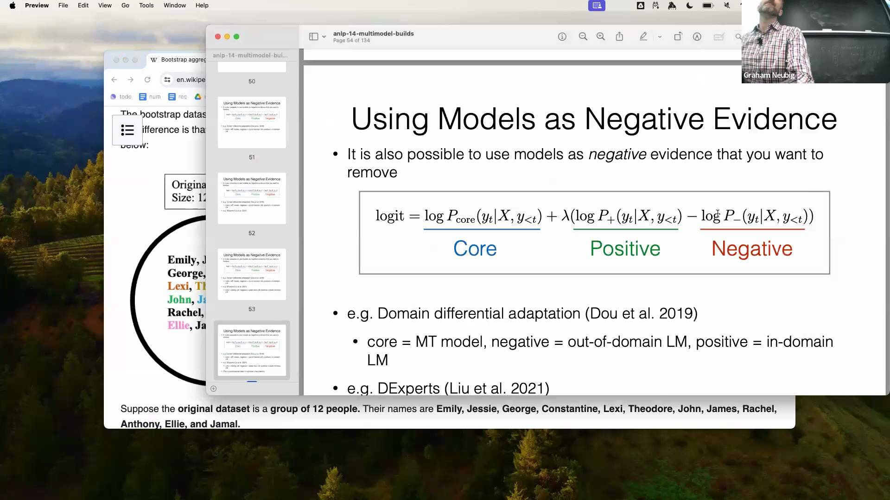
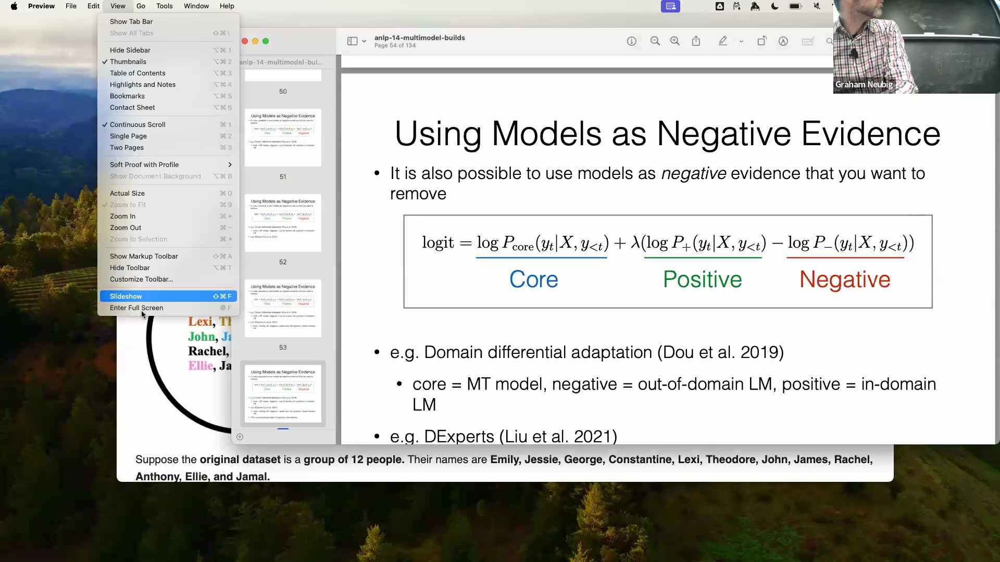
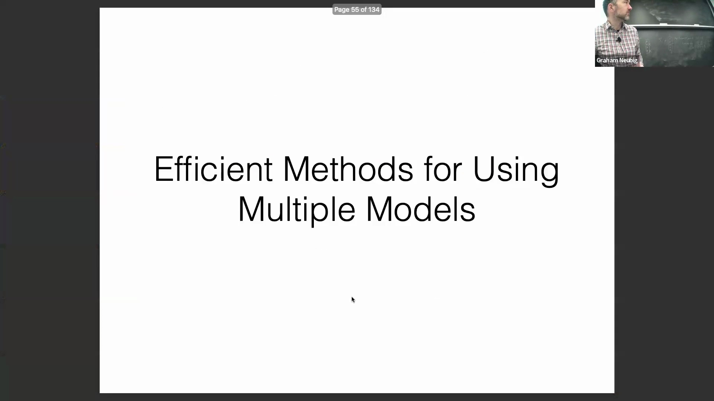
尽管标准集成(Standard Ensembling)能带来精度提升，但由于其推理成本(Inference Cost)随模型数量呈线性增长，在实际部署中面临重大挑战。在推理阶段(Inference Phase)同时运行多个模型会大幅增加计算开销(Computational Overhead)与显存需求(Memory Requirements)，通常需要额外的 GPU 基础设施，并使服务部署(Service Deployment)变得更为复杂。这使得传统的运行时集成(Runtime Ensembling)在许多生产环境(Production Environments)中变得不切实际。因此，研究重点逐渐转向探索既能保留集成带来的性能增益(Performance Gains)，又能维持单一模型计算占用(Computational Footprint)与内存效率(Memory Efficiency)的解决方案。

## 参数平均的前提条件：置换不变性
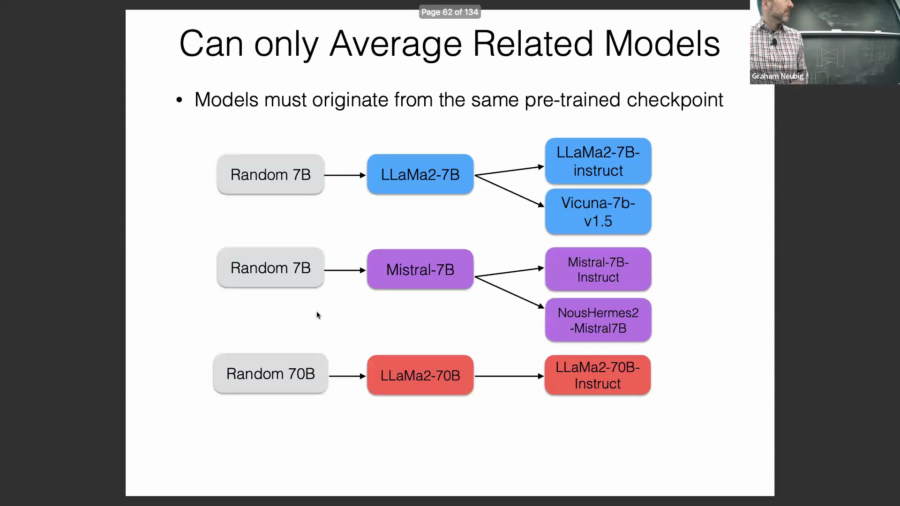
解决这一瓶颈最直接的方法是参数平均(Parameter Averaging)，即直接将多个模型的权重(Weights)合并至统一的网络架构中。然而，该技术限制极大：它仅在模型具备完全相同的网络架构(Network Architecture)，且使用了完全相同的随机初始化(Random Initialization)时才有效。神经网络存在置换对称性(Permutation Symmetry)特性，这意味着采用相同架构但不同初始化的模型虽能学习到功能等效的表示(Functionally Equivalent Representations)，但其内部神经元的权重映射会被随机打乱。若直接对不同初始化模型的参数进行平均，会在数学上导致对应神经元(Neurons)发生错位(Misalignment)，从而生成一个毫无意义且性能严重退化(Performance Degradation)的模型。因此，严格来说，参数平均仅适用于源自同一预训练权重(Pre-trained Weights)或相同初始化状态的模型。

## 实际应用：检查点平均与微调模型合并
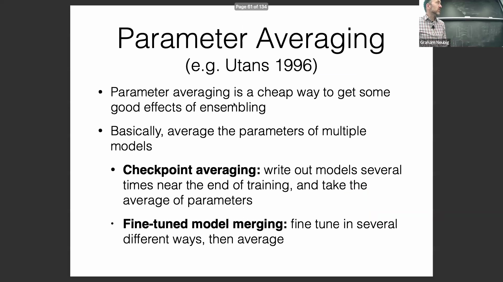
鉴于上述限制，参数平均在以下两个主要场景中仍极具应用价值。首先，对单次训练过程中的多个检查点(Checkpoints)进行平均，可有效抑制随机梯度下降(Stochastic Gradient Descent, SGD)固有的随机噪声(Random Noise)，从而在不增加额外计算开销的前提下，获得更稳定、精度更高的最终模型。其次，该技术适用于微调模型合并(Fine-tuned Model Merging)，即组合多个共享相同基础权重(Base Weights)的指令微调变体(Instruction-tuned Variants)（例如 Llama 2 7B 的不同垂直领域版本）。这使得从业者(Practitioners)能够融合模型的不同能力，或平滑特定微调过程中产生的过拟合偏差(Overfitting Bias)。尽管该技术在理论上可应用于安全对齐(Safety Alignment)，但操作时必须极为谨慎。将经过深度安全微调的模型与原始基础模型进行平均，可能会削弱其安全保护约束(Safety Constraints)，并导致生成处于中间态且可靠性较低的输出。

## 高级平均策略：均匀平均与贪婪选择
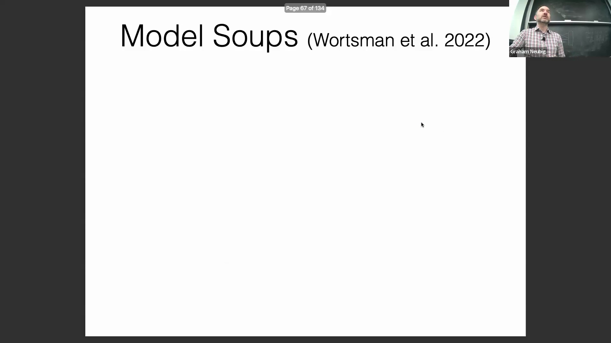
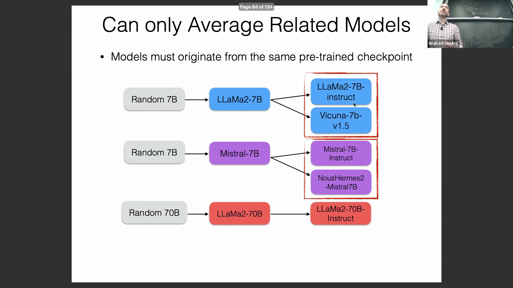
近期研究，尤其是《Model Soups》（模型汤）论文，对面向现代大语言模型(Large Language Models, LLMs)的参数平均技术进行了系统化形式化与扩展。该研究对比了两种核心策略：均匀平均(Uniform Averaging，即所有候选模型赋予相等权重)与更具选择性的贪婪平均方法(Greedy Averaging)。贪婪方法会迭代地将候选模型逐一加入“模型汤”中，并评估每次添加是否能在独立验证集(Independent Validation Set)上提升整体性能。若某模型的加入无法提升组合性能，则将其剔除。这种选择性集成(Selective Ensembling)机制确保仅保留能带来正向增益的微调变体，其效果始终优于简单的均匀平均，从而最大化了最终合并模型的性能与效率。

---

## 贪婪平均与均匀平均的性能对比
关于模型融合(Model Merging)的研究，尤其是《Model Soups》（模型汤）一文的发现，凸显了不同平均策略之间显著的性能差异。贪婪平均策略(Greedy Averaging)（即选择性纳入能提升验证得分(Validation Score)的模型）在 ImageNet 等目标数据集上，其表现始终优于单一最优模型(Single Best Model)与均匀平均(Uniform Averaging)。相反，均匀平均在训练分布(Training Distribution)上的准确率通常略低，但在面对存在分布偏移(Distribution Shift)的评估数据集时，却展现出更强的鲁棒性(Robustness)。这揭示了一个根本性权衡(Fundamental Trade-off)：贪婪优化旨在最大化分布内准确率(In-Distribution Accuracy)，而均匀平均则有效增强了模型在不同数据环境中的泛化能力(Generalization Capability)。
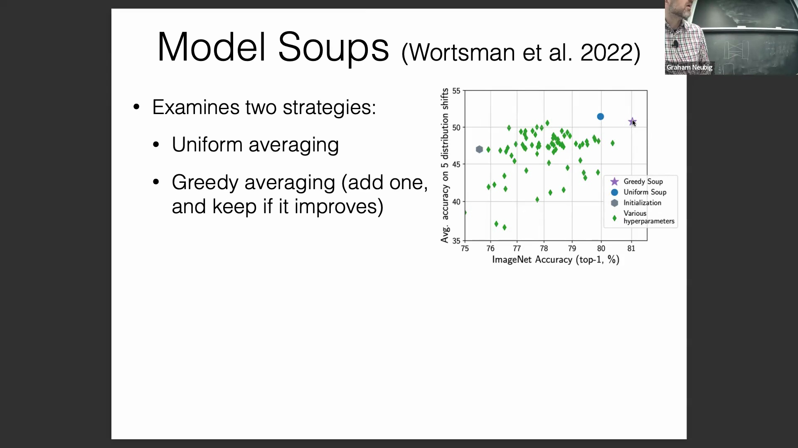

## 参数平均与集成的权衡
尽管参数平均(Parameter Averaging)的性能与传统集成(Traditional Ensembling)高度相关，但其在绝对准确率上很少能超越后者。参数平均的核心优势在于计算效率(Computational Efficiency)，它能提供更精简的推理过程(Inference Process)，且无需承担同时运行多个模型所带来的显存(Memory)与运行时(Runtime)开销。然而，这种效率提升是有前提的；在部分场景下，合并参数反而可能导致性能逊于保持模型独立运行。值得注意的是，相关实验通常采用源自同一预训练初始化(Pre-training Initialization)的模型，从而有效规避了置换不变性(Permutation Invariance)引发的参数错位问题。尽管存在这种结构对齐(Structural Alignment)，参数平均本质上仍是传统集成的一种近似(Approximation)实现，仍需经过严格验证以避免准确率出现显著下滑。
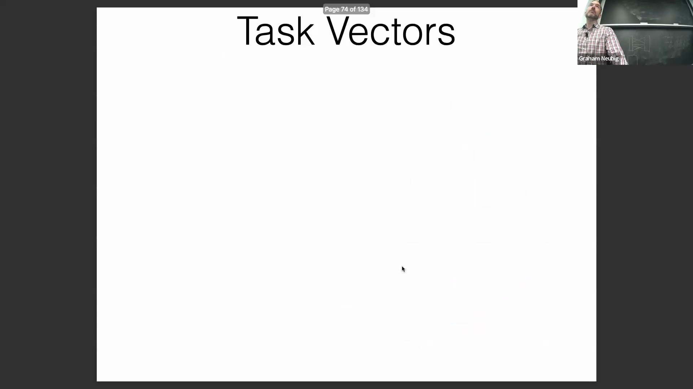

## 在 Transformer 架构中的适用性
尽管基础的模型融合实验最初是基于卷积神经网络(Convolutional Neural Networks, CNN)的视觉模型展开的，但上述原理同样能高效迁移至现代 Transformer 架构。尽管理论上曾有担忧认为 Transformer 的特征表征(Feature Representations)可能高度集中于潜在空间(Latent Space)，但参数融合在大型语言模型(Large Language Models, LLMs)上的应用已被证实极为成功，Hugging Face 排行榜(Leaderboard)上持续霸榜的融合模型便是有力佐证。虽然标准平均(Standard Averaging)在实践中已表现出色，但开发专门针对 Transformer 参数空间(Parameter Space)独特几何特性(Geometric Properties)的融合算法仍具巨大潜力，这无疑是未来研究中一个极具前景的方向。
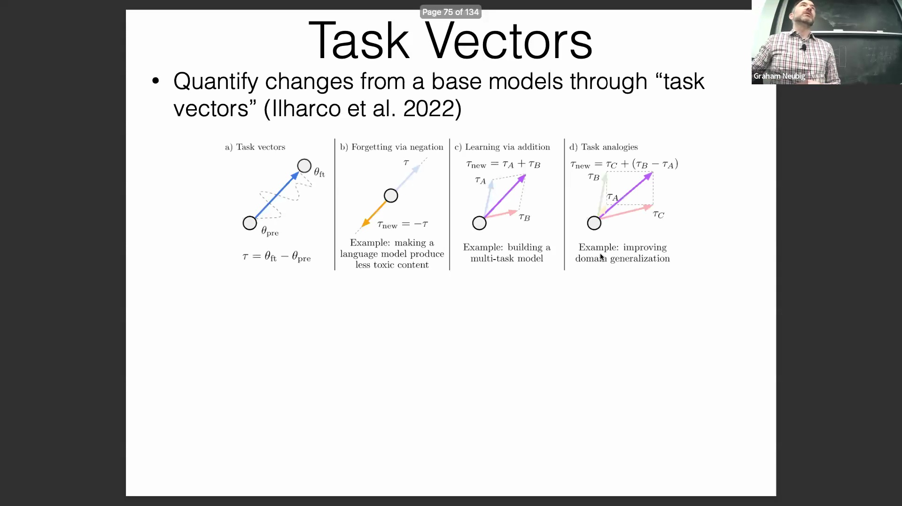

## 任务向量：定义与属性相减
超越简单的参数平均，“任务向量”(Task Vectors)的概念为模型操控(Model Manipulation)提供了一种更精细、且在数学上更具灵活性的方法。任务向量被定义为微调模型参数(Fine-tuned Model Parameters)与其原始预训练基础模型参数(Pre-trained Base Parameters)之间的差值。这种差分表示(Differential Representation)支持强大的代数运算(Algebraic Operations)，例如可针对性地剔除不良模型行为(Undesirable Model Behaviors)。例如，若模型表现出有害内容生成倾向或存在隐私泄露(Privacy Leakage)风险，通过减去对应的任务向量，可有效中和(Neutralize)这些特定能力，从而实现精确的模型编辑(Precise Model Editing)，而无需执行完整的重新训练(Retraining)或进行架构修改。

## 多任务组合与冲突消解
任务向量还通过实现多个专业领域模型(Specialized Models)的策略性组合(Strategic Combination)，有力推动了先进的多任务学习(Multi-task Learning)。通过对不同的任务向量进行相加或平均，从业者(Practitioners)能够合成具备多目标处理能力的新模型。该过程面临的核心挑战是方向冲突(Direction Conflict)，即不同的任务向量试图将参数空间(Parameter Space)推向截然相反的方向。先进的融合算法通过识别发生强烈冲突的参数分量，并计算出一个能化解冲突张力(Conflict Tension)的统一向量来解决此问题。这种冲突感知方法(Conflict-aware Approach)的效果始终优于简单平均，能够确保融合后的模型在所有预期任务上同步维持或提升性能。
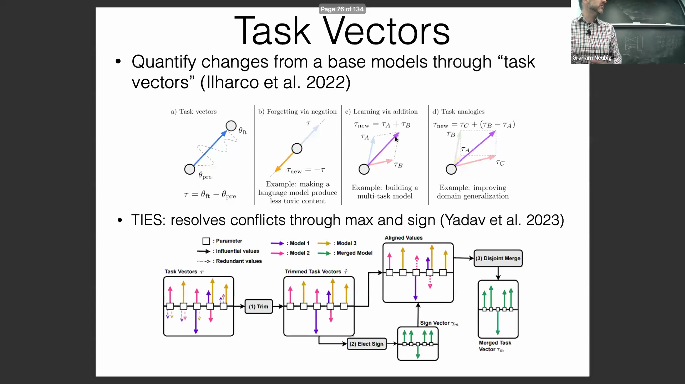

---

## 元学习：原理与初始化优化
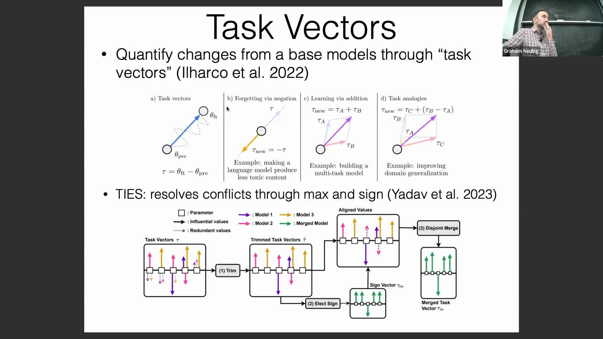
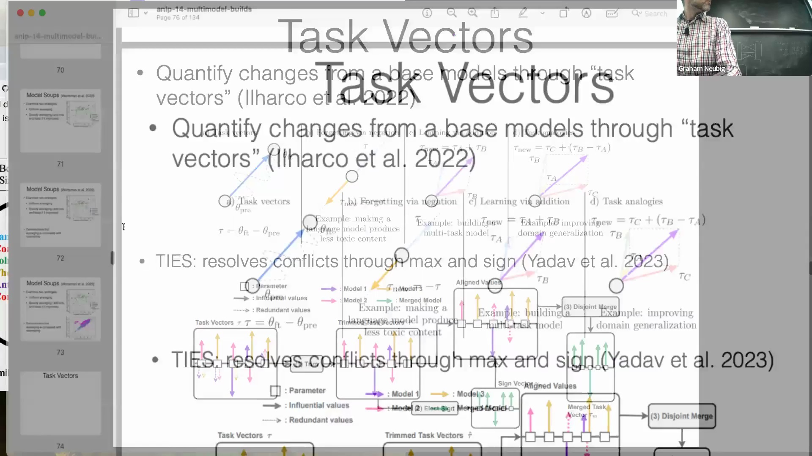
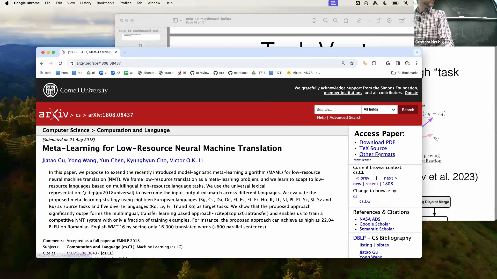
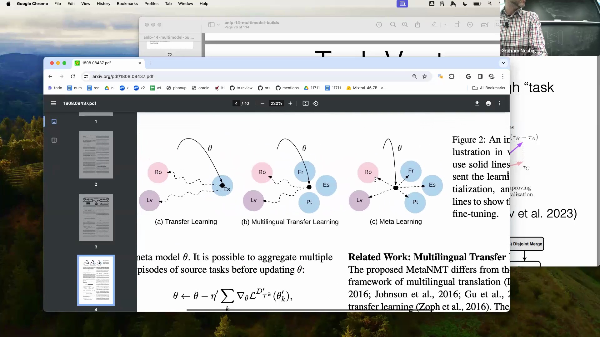
元学习(Meta-learning)专注于优化模型的初始参数(Initial Parameters)，使其能够在面对新颖且未见过的任务(Novel Tasks)时，实现快速且高效的微调(Fine-tuning)。与标准的迁移学习(Transfer Learning)（将单一源任务(Source Task)适配至目标任务(Target Task)）或多任务学习(Multi-task Learning)（在多个任务上联合训练）不同，元学习旨在寻找到一个泛化能力极强的通用初始化状态(Universal Initialization)。该方法通常采用双层优化机制(Bi-level Optimization)：首先在特定任务上执行内环更新(Inner-loop Update)以调整模型参数，随后基于该更新结果计算梯度，执行外环优化(Outer-loop Optimization)以反向修正初始权重。这一过程塑造了一个天然有利于模型快速适应(Rapid Adaptation)的参数空间(Parameter Space)。尽管前文提及的任务向量(Task Vectors)也以类似方式操控模型参数，但它们通常是事后通过代数运算推导生成的，而非通过这种显式的双层梯度优化(Explicit Bi-level Gradient Optimization)过程学习得出。

## 受元学习启发的文档问答预训练

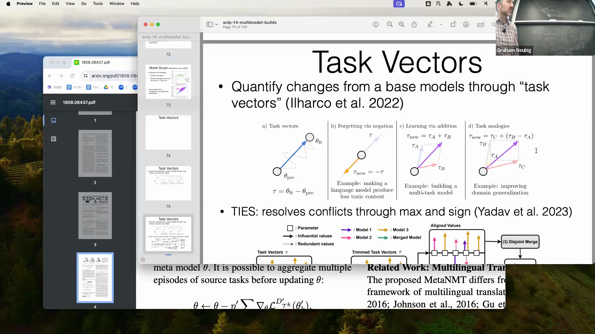
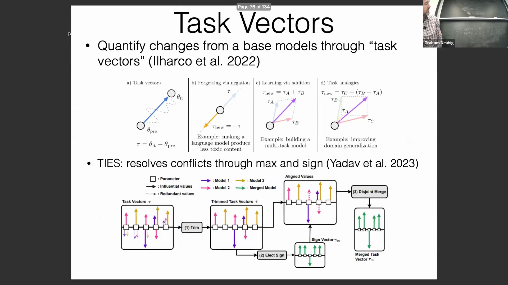
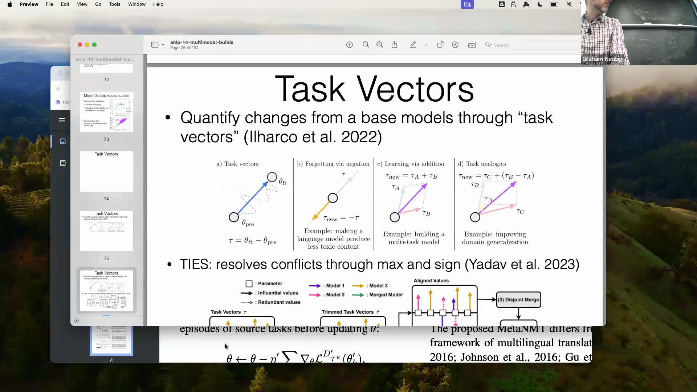

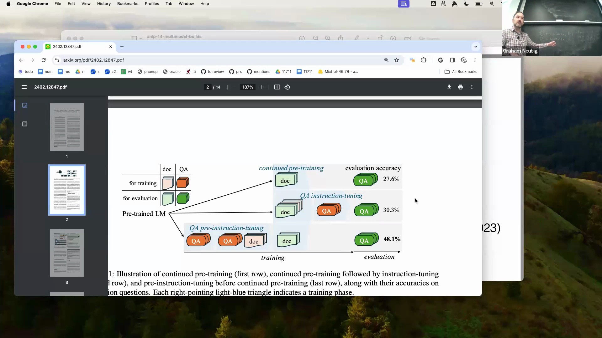
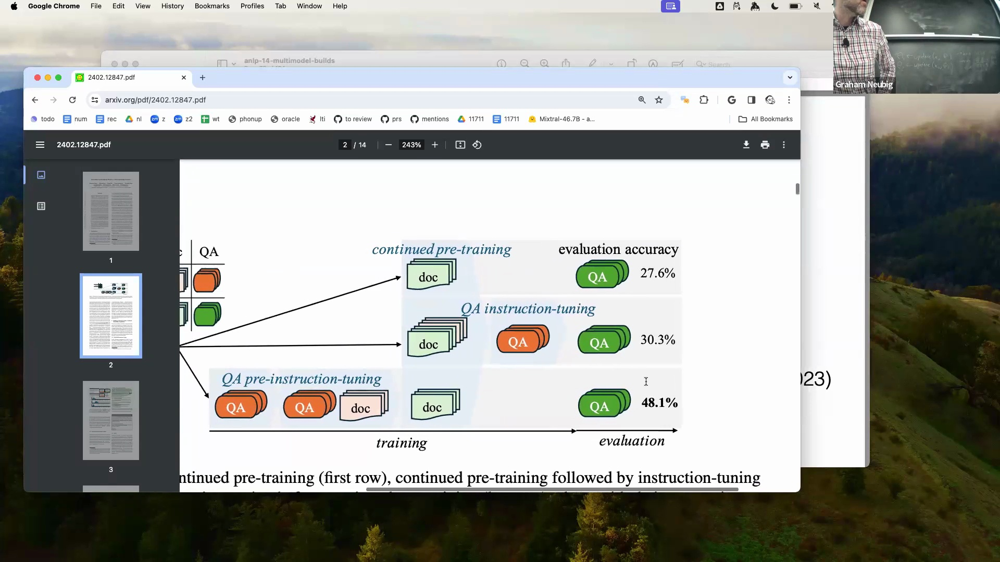
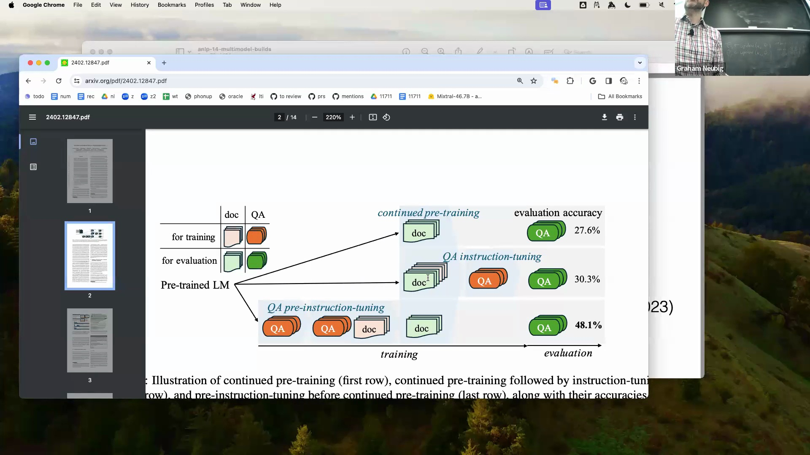
对于大规模模型而言，执行完整的元学习往往因涉及二阶导数计算(Second-order Derivative Computation)而带来难以承受的计算开销(Computational Overhead)。然而，其核心理念(Core Principles)可以通过更高效的策略进行复现。近期研究提出了一种两阶段策略(Two-stage Strategy)：首先，在通用领域(General Domains)（如维基百科）的文档与问答对(Question-Answer Pairs)上进行预训练(Pre-training)，以赋予模型基础的文本抽取(Text Extraction)与逻辑推理(Logical Reasoning)能力；随后，在特定的目标领域(Target Domains)（如医疗文献）上执行微调。该方法通过战略性地调整模型参数，使模型在第二阶段能够迅速掌握针对新文档进行问答(Question Answering)的技巧，从而在避免高昂计算成本的前提下，有效获得了元学习所具备的快速适应优势。

## 实用融合工具库与集成蒸馏

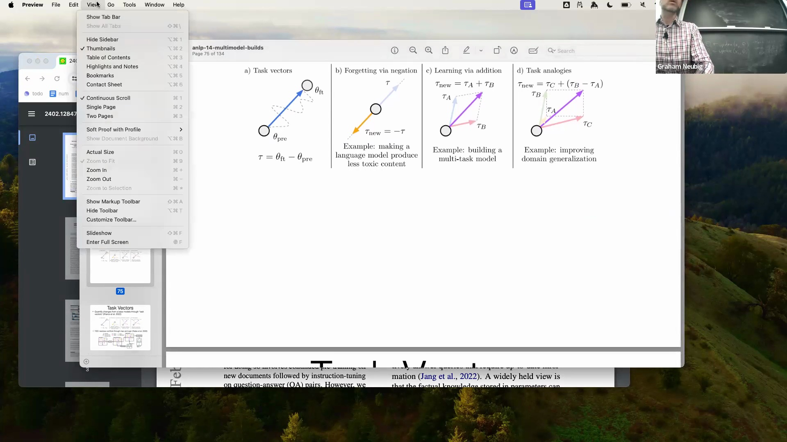
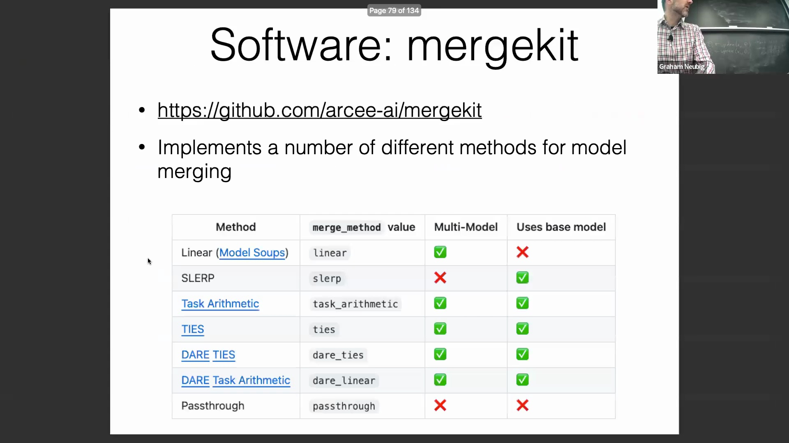

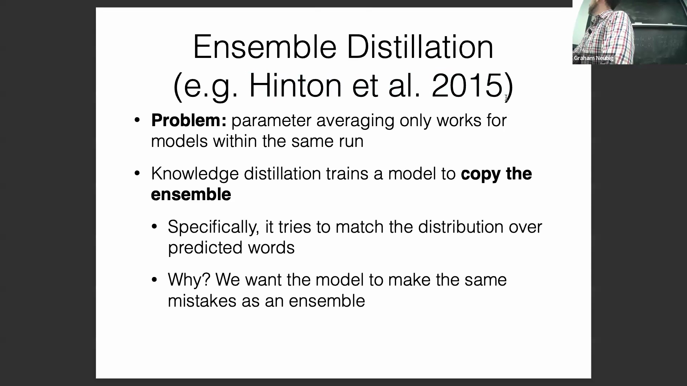
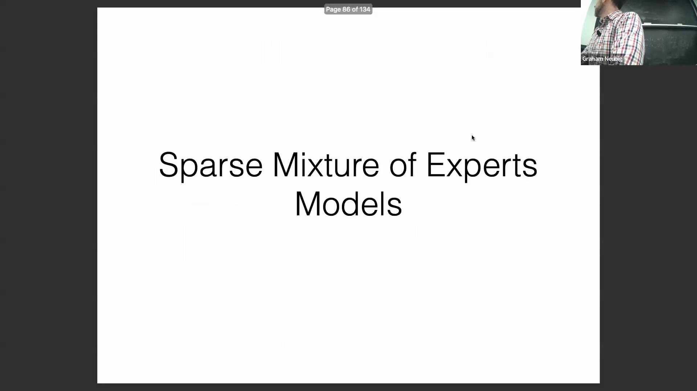
对于工程实践者(Practitioners)而言，`mergekit` 等开源工具库(Open-source Toolkits)已大幅简化了这些高级融合技术的部署流程。该工具库全面支持线性插值(Linear Interpolation)、任务算术(Task Arithmetic)以及冲突消解(Conflict Resolution)等多种模型融合策略(Model Merging Strategies)。除直接的参数融合(Parameter Merging)外，知识蒸馏(Knowledge Distillation)为整合集成模型(Ensemble Models)提供了一种极具潜力的替代方案。相较于参数平均(Parameter Averaging)对模型架构(Architectures)和初始化状态(Initialization States)的严格要求，蒸馏技术通过训练单一的学生模型(Student Model)来拟合多模型集成的完整输出概率分布(Output Probability Distribution)。这使得学生模型能够有效继承集成系统的精准预测能力(Predictive Capabilities)，并学习其隐含的误差模式(Error Patterns)。值得注意的是，Hinton 等人于 2015 年提出的开创性蒸馏论文正是受此目标启发：旨在将庞大的集成模型压缩(Compress)为单一、高效且易于部署的网络架构。

## 稀疏混合专家模型（MoE）简介
讲座随后深入探讨了稀疏混合专家(Sparse Mixture of Experts, MoE)架构，该技术已成为 GPT-4 和 Mixtral 等现代超大规模模型(State-of-the-art Large-scale Models)的核心组件。MoE 架构通过引入稀疏计算(Sparse Computation)机制，实现了海量参数规模，同时避免了计算开销的成比例增长。该技术的核心依赖于稀疏运算的数学特性：任何涉及零标量(Zero Scalars)或零张量(Zero Tensors)的乘法运算结果均为零，这使得系统能够直接跳过不必要的计算路径。这种稀疏性(Sparsity)在模型的不同层级得以实现：从在矩阵乘法(Matrix Multiplication)中对特定特征维度进行掩码(Masking)，到对完整的专家网络进行门控路由(Gated Routing)。这使得模型能够针对任意给定输入，动态激活(Dynamically Activate)且仅激活最相关的少数专家子网络(Expert Subnetworks)，从而实现高效推理。

---

## GPU 级稀疏性与计算效率
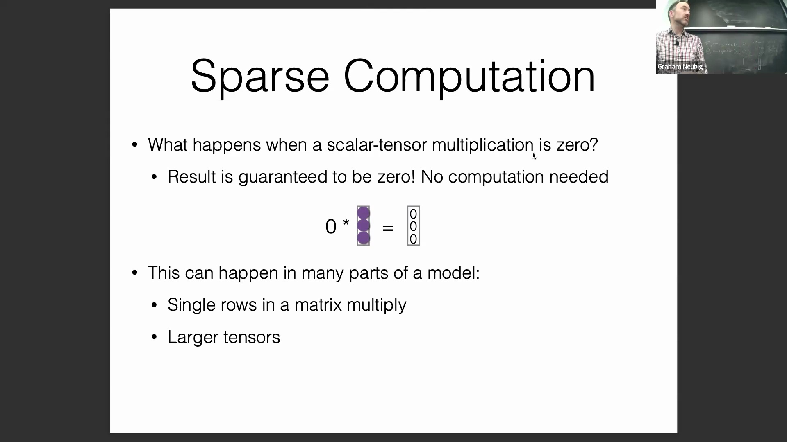
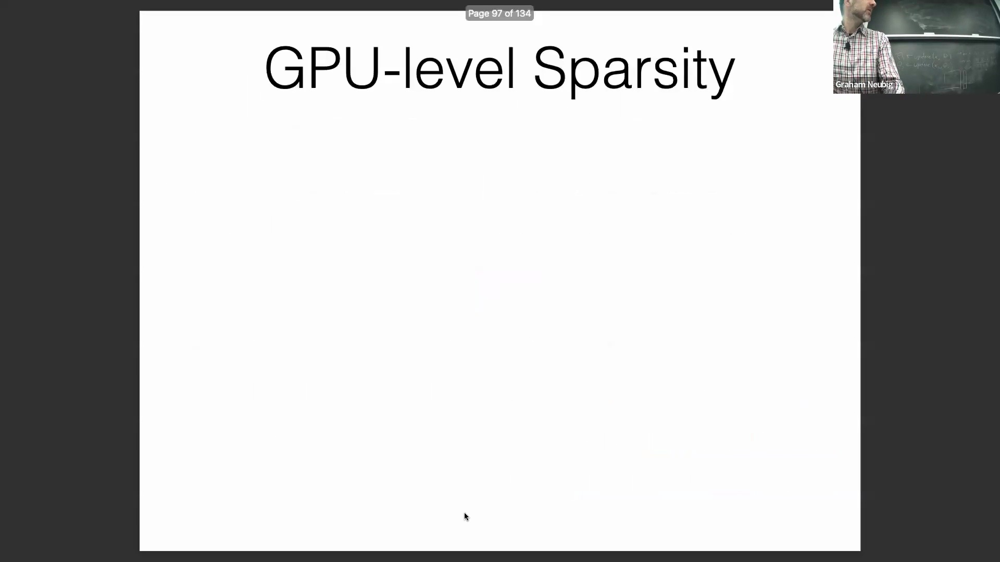
现代软硬件生态系统正越来越多地利用稀疏性(Sparsity)来优化神经网络计算(Neural Network Computation)。在 NVIDIA 的底层架构支持与 CuSPARSE 等稀疏计算库(Sparse Computing Libraries)（已深度集成至 PyTorch）的辅助下，GPU 硬件能够自动检测并跳过零值运算(Zero-value Operations)。例如，在 ReLU 激活函数(ReLU Activation Function)执行后的向量-矩阵乘法(Vector-Matrix Multiplication)中，若输入向量仅有少数元素被激活，GPU 将直接绕过对非激活权重对应的计算路径。这一优化原则同样适用于模型集成(Model Ensembling)：若训练优化过程将某模型的集成权重(Ensemble Weight)或门控概率(Gating Probability)降至零，该模型即可在推理阶段(Inference Phase)被完全剪枝，从而显著降低计算开销与显存占用(Memory Footprint)。

## 稀疏门控混合专家（MoE）架构
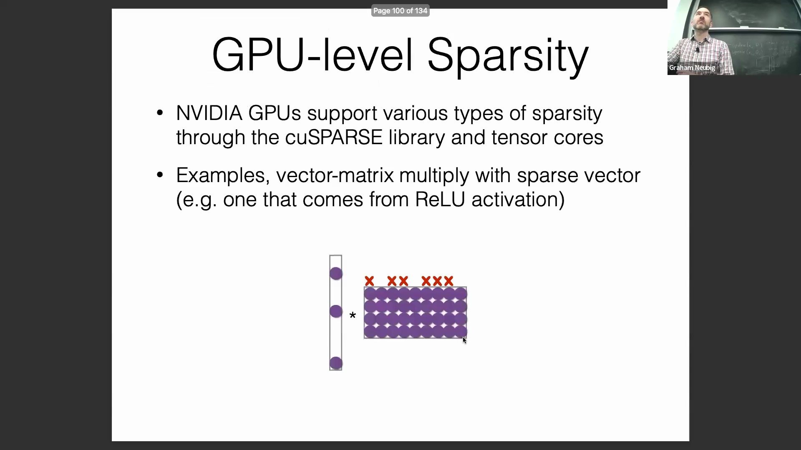
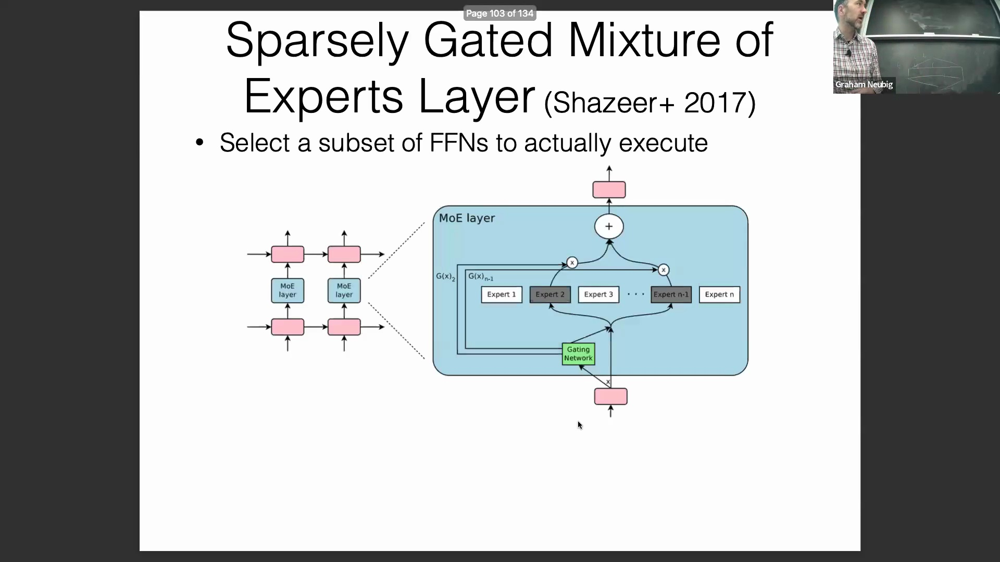
计算稀疏性最典型的应用是稀疏门控混合专家(Sparse Gated Mixture of Experts, MoE)层，该技术已被 Mixtral 和 GPT-4 等大规模模型广泛采用。在标准 Transformer 架构中，前馈网络(Feed-Forward Network, FFN)通常参数量庞大且计算成本高昂。MoE 架构通过一组“专家”子网络(Expert Subnetworks)与一个轻量级门控机制(Gating Mechanism)取代了传统的单体 FFN 模块。门控网络(Gating Network)负责为每个专家计算路由权重(Routing Weights)，但其核心设计目标是引入稀疏性，即对大多数专家赋予零权重。通过应用 Top-K 选择(Top-K Selection)操作并辅以 Softmax 归一化，系统仅激活与当前输入最相关的少数专家（例如从 8 个专家中激活 2 个）。该架构实现简洁，通常仅需数行 PyTorch 代码即可将该层的计算负载(Computational Load)降低四倍甚至更多。

## 实现挑战与批处理优化
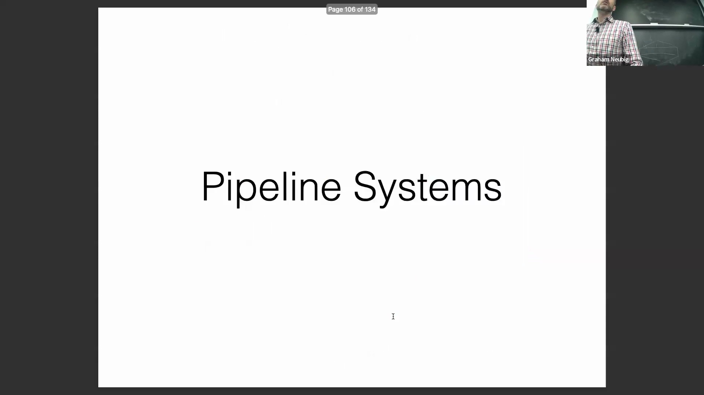
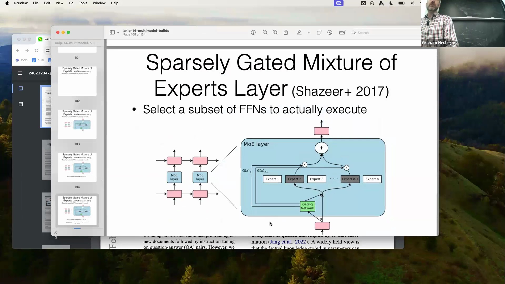
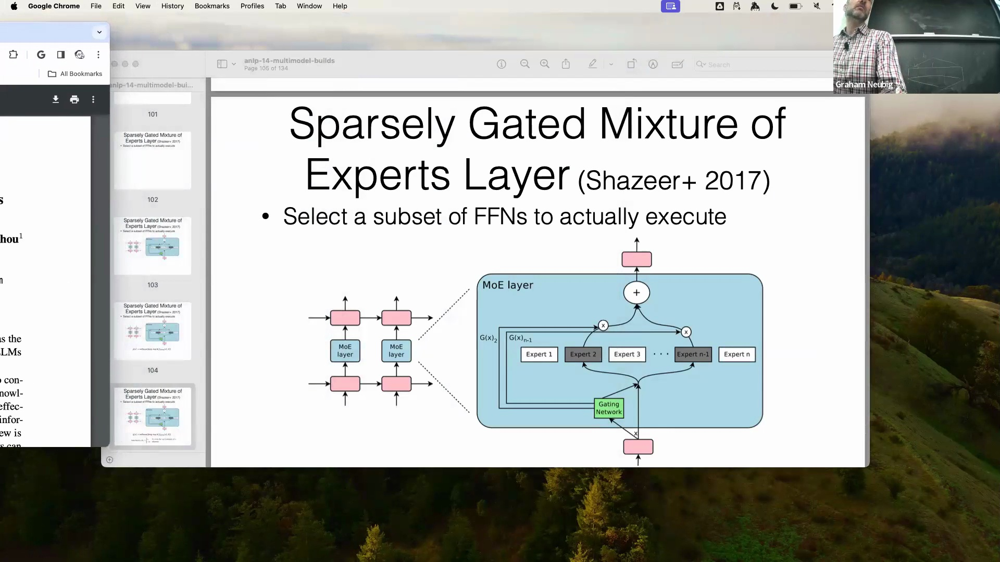

尽管 MoE 的理论逻辑相对直观，但在大规模场景(Large-scale Scenarios)下高效部署却面临严峻的工程挑战。核心难点在于批处理(Batch Processing)：同一批次(Batch)中的不同词元(Token)往往会激活不同的专家子网络，从而引发非连续内存访问(Irregular Memory Access Patterns)与设备同步瓶颈(Synchronization Bottlenecks)。对于参数量较小的模型，路由与数据重组的开销常因显存带宽(Memory Bandwidth)限制而抵消性能收益；但对于大型计算密集型(Compute-bound)模型，其带来的计算节省(Computational Savings)则极为显著。克服这些瓶颈高度依赖定制化的 GPU 算子内核(GPU Kernels)优化与高效的动态路由策略(Dynamic Routing Strategies)。值得注意的是，此类前沿工程细节正通过 AI 开源社区与技术论坛快速迭代共享，其更新速度往往快于传统学术论文的发表周期。

## 级联流水线系统与可解释性
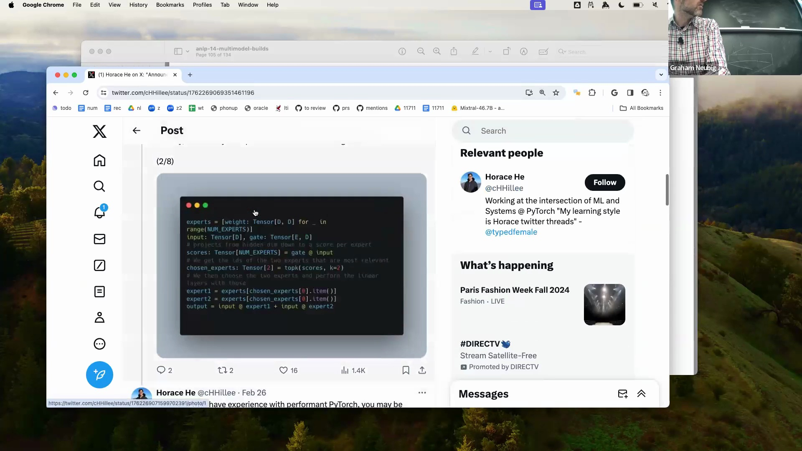

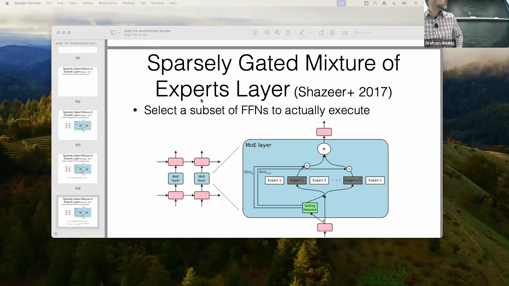
除模型内部的稀疏性设计外，系统级架构(System-level Architecture)也常采用流水线(Pipeline)或级联(Cascaded)系统，即前一模型的输出直接作为后一模型的输入。经典案例如语音翻译(Speech Translation)，传统方案通常将自动语音识别(Automatic Speech Recognition, ASR)模型与机器翻译(Machine Translation, MT)模型串联。尽管端到端架构(End-to-End Architecture)日益普及，但级联系统仍在多项指标上保持优势：各子任务可独立利用更丰富的垂直领域数据、各阶段的优化目标(Optimization Objectives)更为明确，且系统具备更强的可解释性(Interpretability)。开发者与用户可直接验证中间输出(Intermediate Outputs)（例如校验 ASR 的转录准确性），这使得错误溯源(Error Attribution)与系统调试(System Debugging)过程更为透明高效。

## 堆叠架构
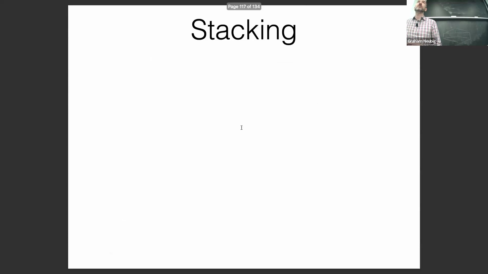
与之密切相关但范式不同的架构是“堆叠”(Stacking)。与严格依赖顺序数据流(Sequential Data Flow)的级联系统不同，堆叠允许多个模型采用不同模态(Modality)或推理策略并行处理同一任务，随后以更高维度的方式融合其输出。仍以语音翻译为例，堆叠系统可同时运行 ASR 模型生成中间文本，并将原始音频直接输入至端到端语音翻译模型。通过融合中间文本表征(Intermediate Text Representations)与直接的跨模态预测(Cross-modal Predictions)，堆叠技术突破了固定串行流水线(Fixed Sequential Pipelines)的局限，能够更灵活地整合多模型的互补优势(Complementary Strengths)。

---

## 用于多模态集成的堆叠架构
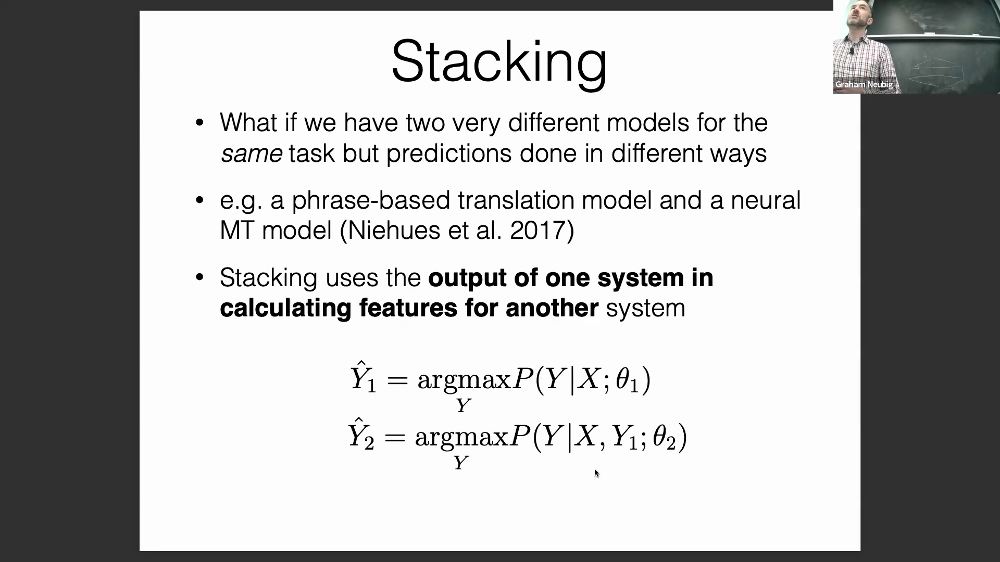
突破传统刚性顺序流水线(Sequential Pipelines)的局限，“堆叠”(Stacking)架构使模型能够并行融合多种数据模态(Data Modalities)或中间表征(Intermediate Representations)。在堆叠式语音翻译(Stacked Speech Translation)系统中，翻译模型同时接收原始音频(Raw Audio)与转录文本(Transcribed Text)作为输入，以生成目标语言输出。该架构提供了一种内置的交叉验证机制(Cross-validation Mechanism)，使系统能够通过比对音频与文本模态来有效捕获识别错误(Recognition Errors)。此外，它能够有效恢复在纯文本转换过程中丢失的韵律特征(Prosodic Features)或副语言信息(Paralinguistic Information)。例如，相同的转录文本“I read the book”可能对应不同的时态（如过去式或现在时），但堆叠模型可利用音频线索(Audio Cues)在翻译前精准消除歧义(Disambiguation)，从而确定其真实语义。

## 迭代优化与扩散范式
迭代优化(Iterative Optimization)通过将模型输出递归地反馈至自身(Recursive Feedback)，实现生成质量的逐步提升。早期的神经网络实现（如推敲网络(Deliberation Networks)）通常结合强化学习(Reinforcement Learning)生成初始草稿，随后通过多轮迭代进行精细化润色。该迭代范式在概念上与现代扩散模型(Diffusion Models)高度契合，后者从纯高斯噪声(Pure Gaussian Noise)出发，通过逐步去噪(Denoising)过程生成连贯的高质量输出。尽管扩散模型训练稳定且在图像生成领域占据主导地位，但受限于自回归语言模型(Autoregressive Language Models)的显著成功，其在文本生成领域的应用仍相对有限；不过，非自回归文本扩散(Non-autoregressive Text Diffusion)依然是当前活跃的研究前沿(Active Research Frontier)。

## Self-Refine：反馈驱动的生成
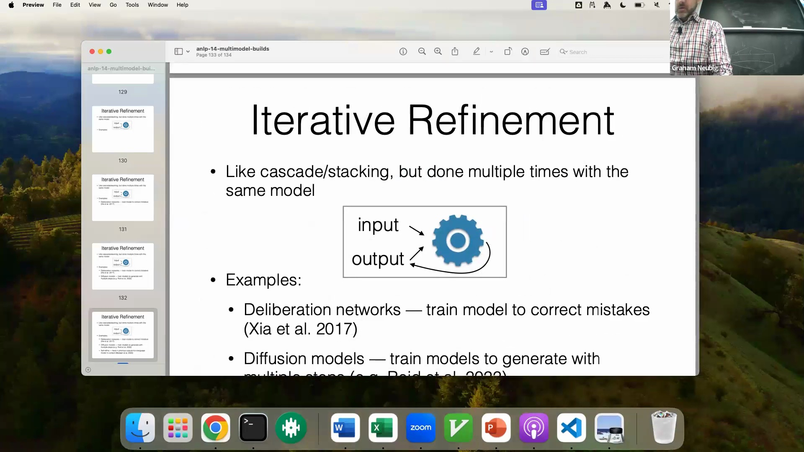
迭代优化在现代大模型中的一个典型实现是 Self-Refine 框架。在该流程中，大语言模型(Large Language Models, LLMs)首先生成初始输出，随后通过生成结构化反馈(Structured Feedback)（如指出逻辑漏洞或代码缺陷）对结果进行自我审查(Self-Review)。随后，模型综合原始输出与自我生成的批评意见(Self-generated Critiques)生成修订版本，并循环此过程直至满足预设的质量标准。该方法在创意写作(Creative Writing)、代码生成(Code Generation)等多元化任务中均展现出显著成效。
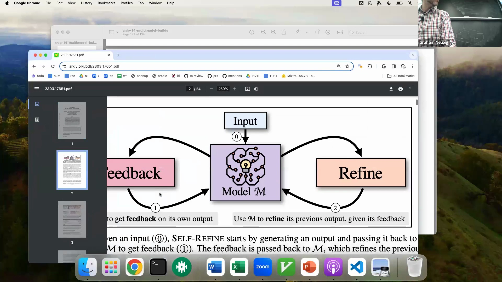
然而，该方法存在一项关键前提：自我优化(Self-optimization)高度依赖基础模型具备极强的基线能力(Baseline Capability)。唯有处于当前技术前沿(State-of-the-Art, SOTA)的模型才具备充分的逻辑推理(Logical Reasoning)与自我纠错(Self-correction)能力，以稳定执行该迭代循环。能力较弱的模型通常难以准确诊断自身缺陷，往往导致多次迭代后性能停滞甚至出现模型退化(Model Degradation)。
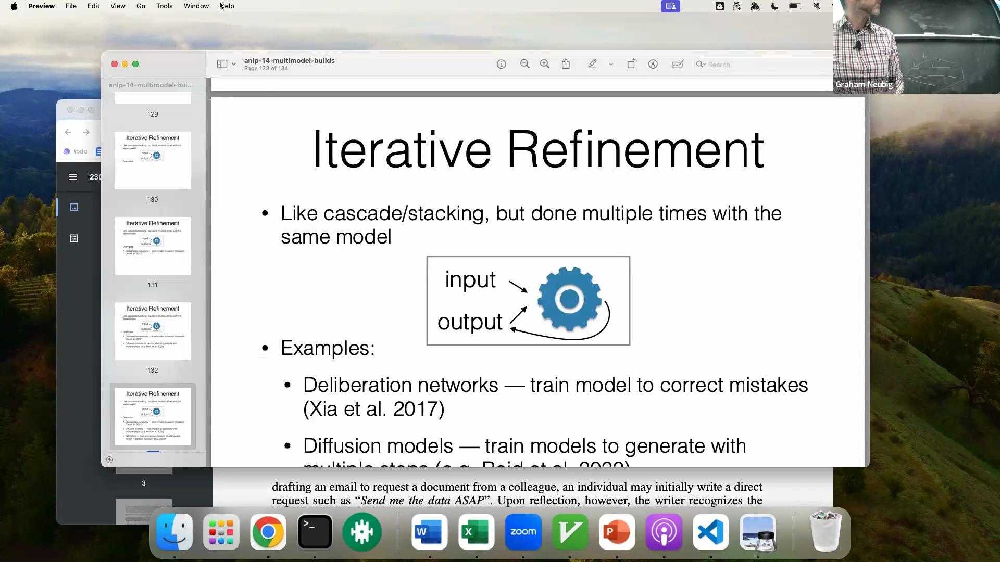
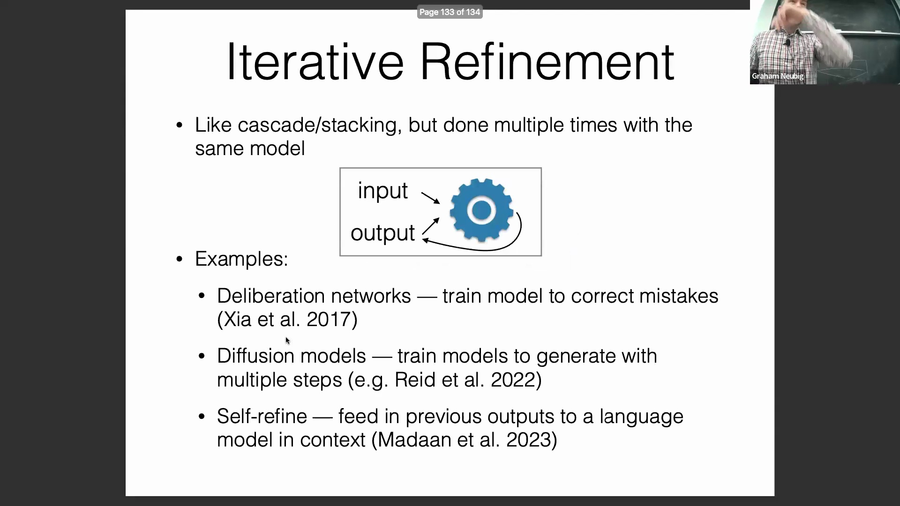

## 权衡：堆叠系统与级联系统
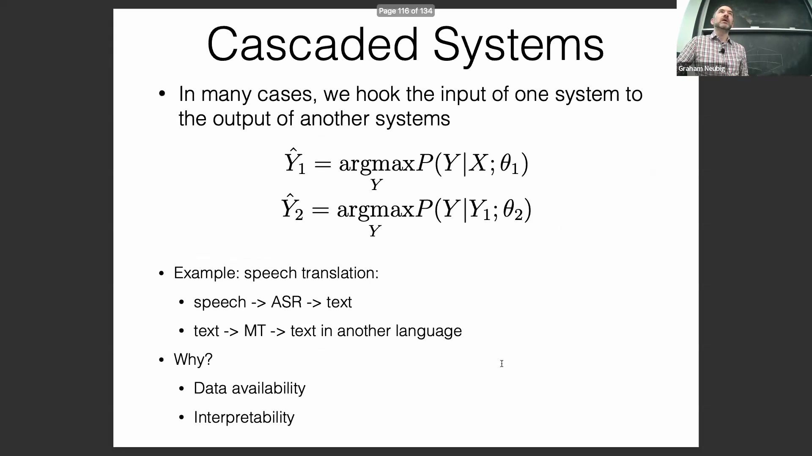
尽管堆叠架构在防止信息丢失(Information Loss)方面具备显著优势，但级联系统(Cascaded Systems)依然被广泛采用，主要归因于两大因素：数据可用性(Data Availability)与实现复杂度(Implementation Complexity)。训练堆叠模型通常依赖严格对齐的多模态数据集(Strictly Aligned Multimodal Datasets)。若缺乏此类数据，工程实践者(Practitioners)往往需合成缺失模态或依赖预生成输出，这将引入高昂的计算开销(Computational Overhead)。相比之下，级联架构允许开发者针对各子任务(Sub-tasks)独立优化并部署专用的现成模型(Off-the-shelf Models)。因此，在数据稀缺或工程资源受限时，级联往往是更为务实(Pragmatic)的工程选择。尽管如此，在数据规模与算力资源(Data Scale and Compute Resources)充足的前提下，堆叠架构仍是性能最优的推荐方案。
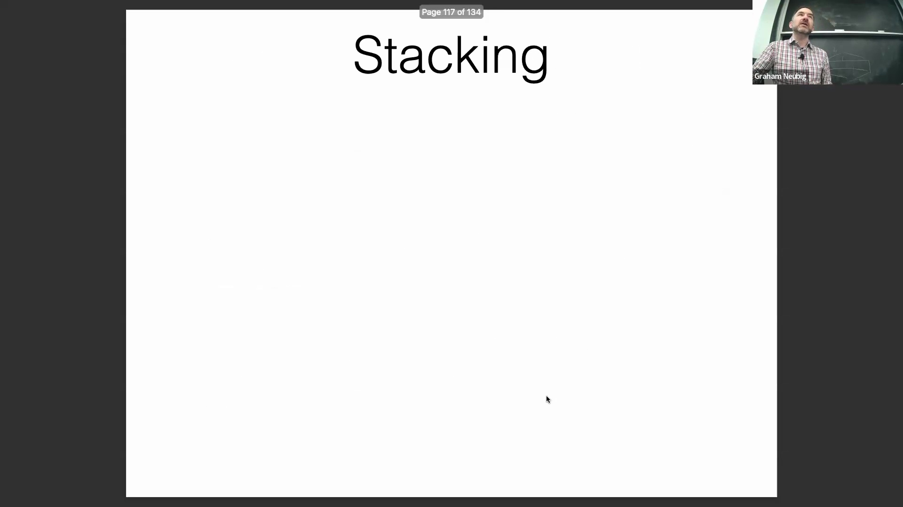

## 评估贡献度及与 Boosting 的对比
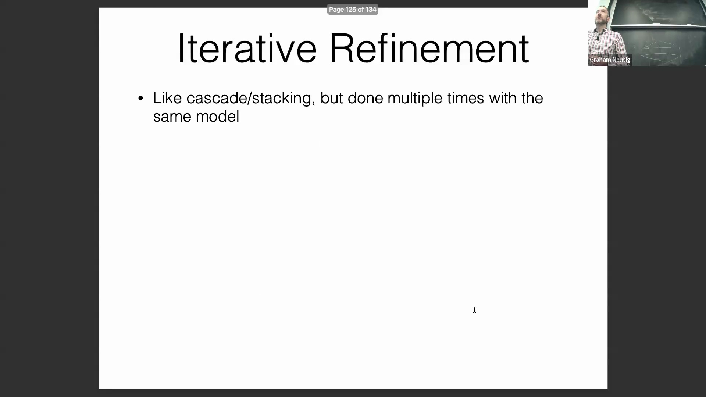
评估集成系统中各模型的个体贡献(Individual Contribution)，最直观的方法是分析学习到的插值权重(Interpolation Weights)。这些权重系数直接量化了推理阶段(Inference Phase)系统对各模型预测结果的依赖程度。此外，也可采用消融实验(Ablation Studies)，通过测量添加或移除特定模型组件时整体准确率(Overall Accuracy)的变化量来量化其实际影响。对比迭代优化与传统 Boosting（提升法），两者在作用粒度与适用范围上存在显著差异。Boosting 通常作用于单一的标量分类输出(Scalar Classification Outputs)，通过调整弱分类器(Weak Classifiers)的权重分布来优化整体概率分布。相比之下，迭代优化直接作用于高度复杂的结构化输出(Structured Outputs)（如完整文本段落或代码库），要求模型主动进行内容重写(Content Rewriting)与结构重构(Structural Refactoring)，而非仅仅是对概率质量(Probability Mass)进行重新分配。
