## 现代大语言模型生态导览
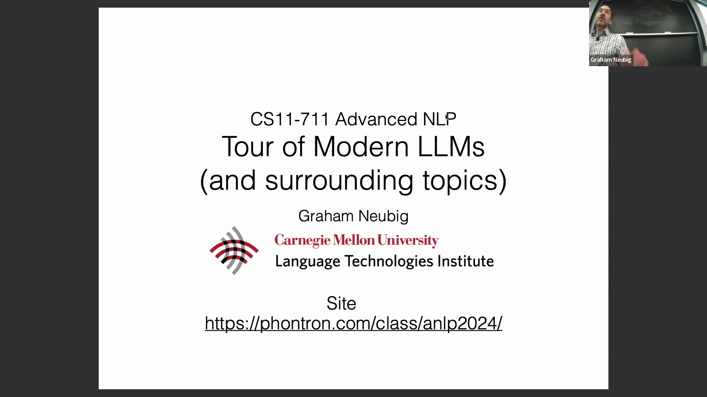
本节首先对现代大语言模型(Large Language Model, LLM)生态进行全面导览。鉴于目前市面上模型数量庞大，本次讨论将聚焦于那些因特定优势而脱颖而出的模型：训练流程完全公开透明的模型、业界最先进(State-of-the-Art, SOTA)的系统、性能最强且支持下载的开放权重(Open-Weight)模型、采用专用架构(Specialized Architecture)的模型，以及顶级的闭源(Closed-Source)模型。讨论的重点将置于模型透明度与开放权重发布机制上，旨在帮助听众深入理解日常使用的 AI 工具背后的核心基础组件。
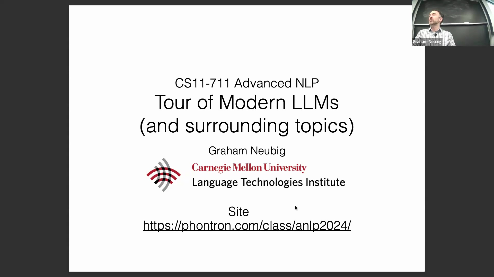

## 核心组件：架构、数据与训练

理解 Llama 2 或 Mistral 等模型的核心可归纳为三大支柱：模型架构(Model Architecture)、训练数据(Training Data)以及训练方法(Training Methodology)。近期行业内的讨论表明，在现代人工智能(Artificial Intelligence, AI)领域，数据的重要性已显著超越架构设计。尽管这一观点颇具合理性——因为当今大多数模型均基于高度相似的架构，却能展现出截然不同的性能与准确率(Accuracy)——但这并未完全削弱架构本身的关键作用。
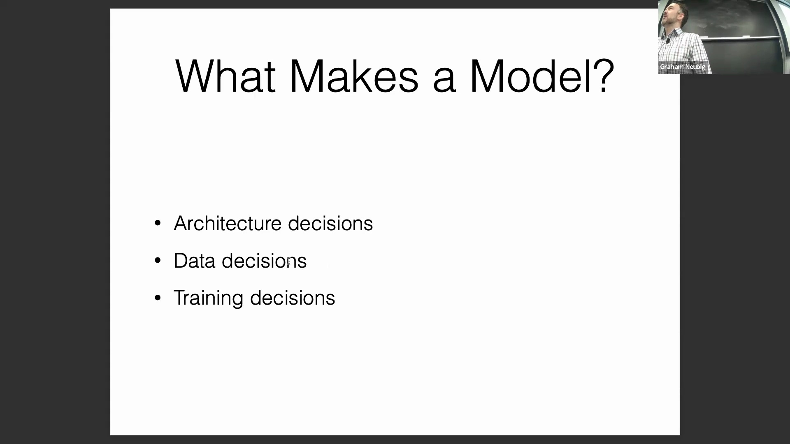
当前的主流架构是历经近十年持续迭代与优化的成果。若无这些经过深度打磨的基础，长短期记忆网络(Long Short-Term Memory, LSTM)等早期架构根本无法支撑如今的大规模训练范式(Large-Scale Training Paradigms)。此外，架构选型直接决定了计算吞吐量与训练效率，这使得架构成为 LLM 开发中至关重要（尽管技术栈已相对成熟）的一环。
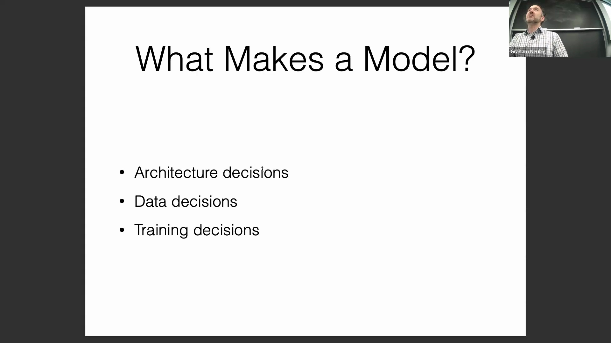

## 开放与封闭访问范式
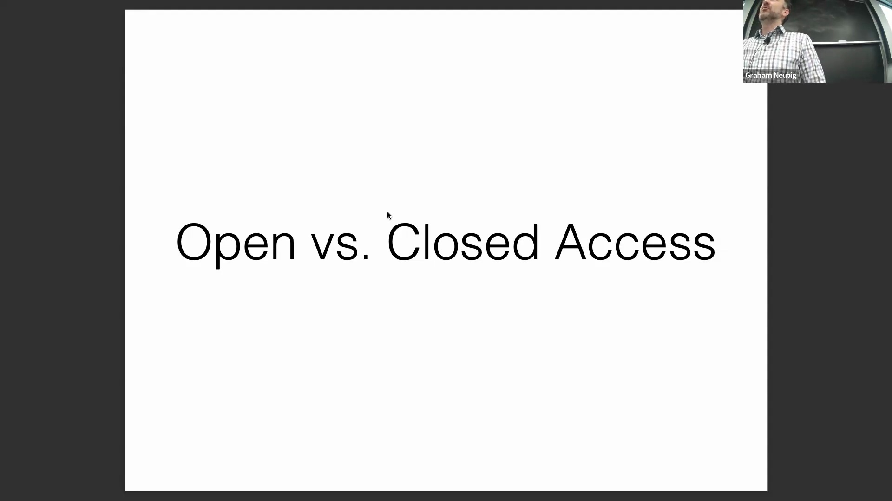
深入理解 AI 生态系统，首先需要厘清开放访问(Open Access)与封闭访问(Closed Access)的界限。开放性在多个维度上呈现为一个连续统(Continuum)：模型权重(Model Weights)、推理代码(Inference Code)、训练方法或训练数据集(Training Dataset)究竟是完全公开可获取、仅提供技术文档描述，还是处于完全保密状态。托管于 Hugging Face 等平台的模型常被归类为“开放权重(Open Weights)”模型，这通常指其权重文件与推理脚本可供公开下载，但底层的训练代码与训练数据仍处于封闭状态。
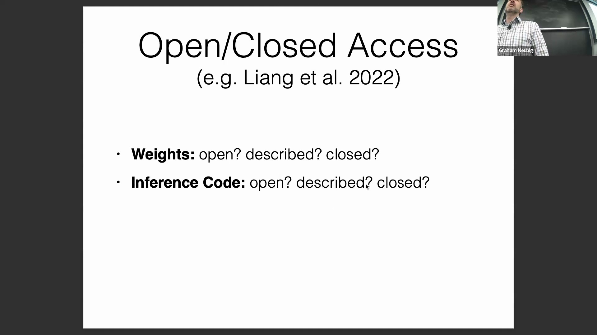
与之形成鲜明对比的是 GPT-4 等完全闭源(Closed-Source)的模型，外界几乎无法获取其训练流程的任何详细信息。对于需要评估并将模型集成至自身研发工作流(Workflow)中的研究人员与开发者而言，准确识别这些不同层级的透明度至关重要。
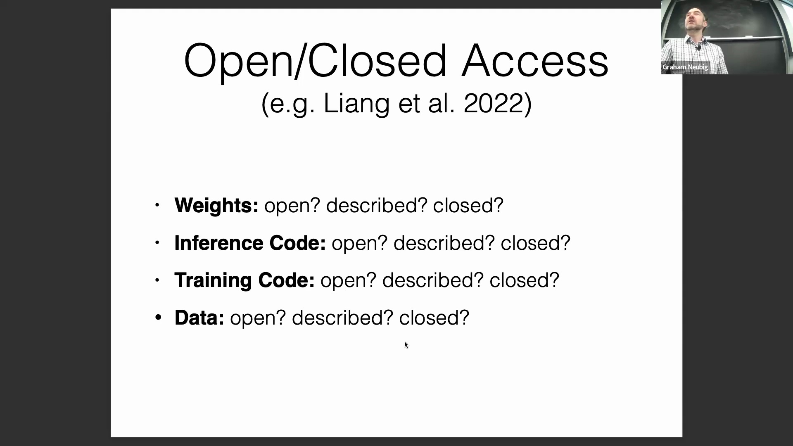

## AI 软件中的许可协议与开放程度
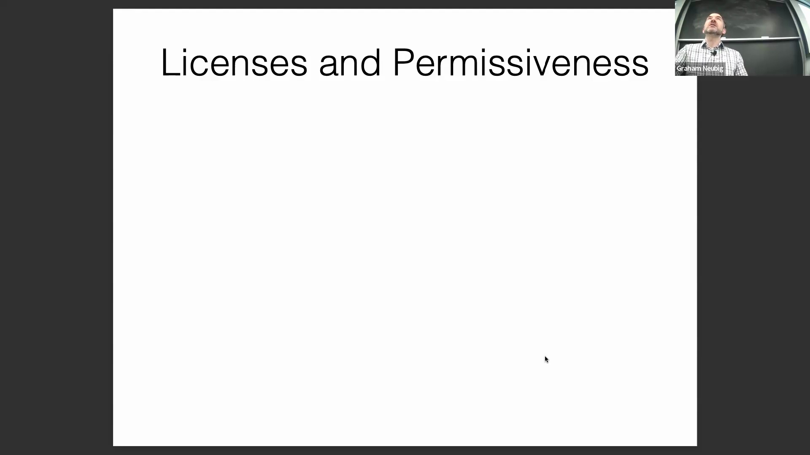
许可协议(License Agreement)界定了 AI 模型与软件在使用、修改及再分发方面的法律边界。充分理解这些协议对于学术研究与商业部署均具有关键意义。开放程度最高的许可类别包括公共领域(Public Domain)与知识共享零协议(Creative Commons Zero, CC0)，此类许可几乎不施加任何限制。使用者可自由下载、修改和再分发相关材料，且无需提供署名(Attribution)。该类别同时涵盖版权保护期已届满的作品（通常为作者逝世后 70 年）以及美国政府雇员职务创作的材料。
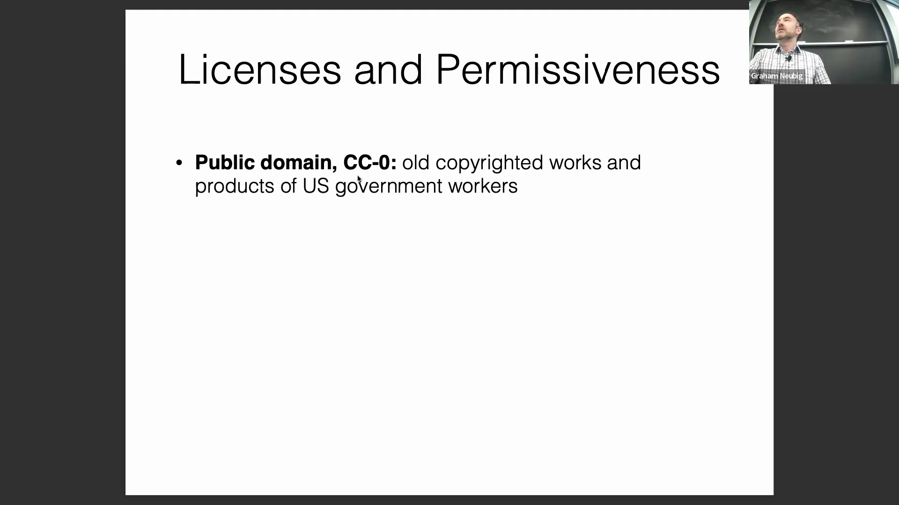
近期正式进入公共领域的米老鼠(Mickey Mouse)与小熊维尼(Winnie-the-Pooh)便是 CC0 无限制特性的典型例证，其版权开放后已被迅速改编为恐怖片等非传统媒介作品。开放程度次之的是 MIT 许可证(MIT License)与 BSD 许可证(BSD License)，它们同样具备高度开放性，但要求保留原始版权声明。其灵活性在 Apple 的 macOS 操作系统中得到了充分体现，该系统正是基于对早期 BSD 代码进行分叉(Fork)与闭源商业化改造而构建的。
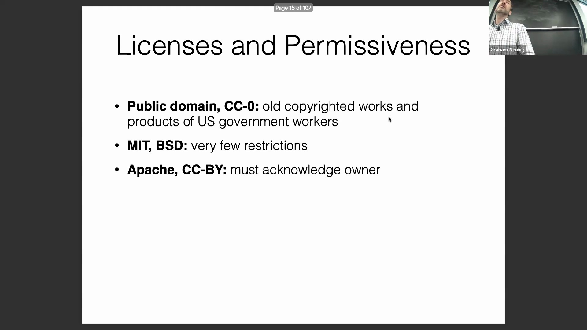
Apache 许可证(Apache License)与 CC BY 许可证(CC BY License)则要求使用者必须对原始创作者进行规范署名。值得注意的是，Apache 许可证内置了一项专利反制条款(Patent Retaliation Clause)：若用户就知识产权问题对许可方提起诉讼，其使用许可证将被自动终止。这一机制在大型科技企业之间促成了一种隐性的专利休战(Patent Truce)，由于各家公司广泛依赖彼此基于 Apache 许可证开发的软件，从而有效抑制了知识产权诉讼的爆发。
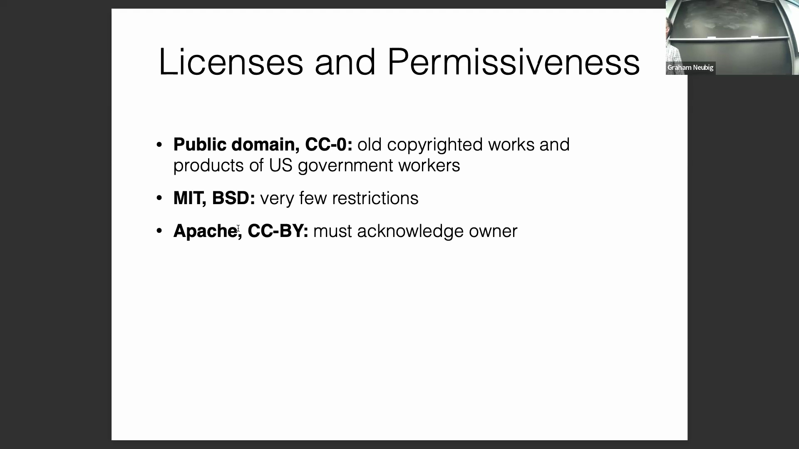
最后是 Copyleft（著佐权, Copyleft）许可证，例如 GNU 通用公共许可证(GNU General Public License, GPL) 与 CC BY-SA 许可证。此类许可规定，任何衍生作品都必须以完全相同的开放许可证进行发布。该要求往往令商业企业对采用 GPL 软件持谨慎态度，因为一旦将其整合至专有软件系统(Proprietary Systems)中，法律将强制要求企业公开整个项目的源代码(Source Code)，这与闭源商业策略存在直接冲突。

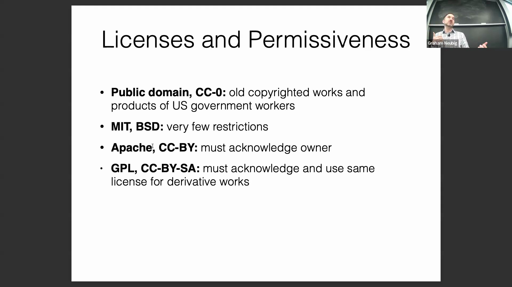

---

## 软件与数据许可协议及非商业限制

本节首先明确了软件许可(Software License)与数据许可(Data License)之间的核心区别。尽管 MIT、BSD、Apache 和 GNU通用公共许可证(GNU General Public License, GPL)等主要用于规范软件代码，但知识共享(Creative Commons, CC)许可证体系则是专为数据与多媒体内容设计的。例如，维基百科(Wikipedia)采用 CC BY-SA 许可，要求任何衍生作品(Derivative Works)必须采用相同的开放许可条款。讲座随后探讨了非商业性许可(Non-Commercial Licenses)，并明确指出：若对使用范围施加限制（例如禁止商业或军事用途），该资产将不再符合开源促进会(Open Source Initiative, OSI)对“开源”(Open Source)的严格定义。真正的开源协议必须允许在任何领域内自由、无限制地使用。

## 自定义模型许可证与“无许可证”的影响

除标准许可协议外，Meta 和 Hugging Face 等大型机构为其模型引入了自定义许可框架(Custom License Frameworks)，例如 Llama 许可证(Llama License)。该许可证包含若干关键限制条款：禁止利用该模型训练其他独立的大语言模型、禁止用于军事用途，且若产品或服务的月活跃用户(Monthly Active Users, MAU)超过 3 亿，则需获得 Meta 的特别授权。此类许可架构在战略上旨在防止 Google 或 X（原 Twitter）等主要竞争对手无偿利用该模型进行商业竞争。相反，若将代码上传至 GitHub 时未附加任何明确的许可协议，则默认适用 GitHub 的服务条款(Terms of Service, ToS)。这在法律上严格限制他人对该代码的下载、使用或集成。强烈建议研究人员采用 MIT 或 BSD 等宽松型许可证(Permissive Licenses)，以最大程度地提升研究成果的学术影响力与可复现性(Reproducibility)。

## 版权现状与合理使用原则

互联网上的绝大多数文本均受“保留所有权利”(All Rights Reserved)版权保护，这意味着任何使用行为均须事先获得明确授权。这一现状使得美国版权法中特有的“合理使用”(Fair Use)原则显得尤为关键。该原则允许在特定条件下有限度地使用受版权保护的材料：引用篇幅须控制在合理范围内，使用行为不得实质性损害原作品的商业价值，且非商业用途（如学术研究）通常比商业应用享有更宽泛的适用空间。例如，在教科书中适度引用片段通常符合规范，但若出于替代原作品的目的而重新出版整本受版权保护的书籍，则直接违反合理使用原则。

## AI 训练中的合理使用与持续的法律纠纷
AI 模型训练(AI Model Training)的合法性在很大程度上依赖于其符合“合理使用”原则这一核心论点。支持者主张训练过程具有“转换性”(Transformative Use)：模型并非直接复制原始材料，而是通过提取特征、综合与重组数据来生成全新内容，从而未实质性替代原始数据集的市场价值。然而，这一法律解释在司法实践中正面临激烈争议。《纽约时报》(The New York Times) 目前已对 OpenAI 和微软提起民事诉讼，指控 GPT-4 能够逐字再现其受版权保护的文章并分流网络流量，从而实质性损害其订阅与广告收入。同样，部分软件开发者亦对 GitHub Copilot 提起集体诉讼，指控其未经授权使用并整合了受版权保护的源代码。演讲者指出，即便是学术演示文稿(Academic Presentations)在引用外部图片时亦需援引合理使用原则，这凸显了该原则在 AI 时代虽被广泛应用，但在法律边界上仍充满不确定性与争议。

## 限制模型访问的动机
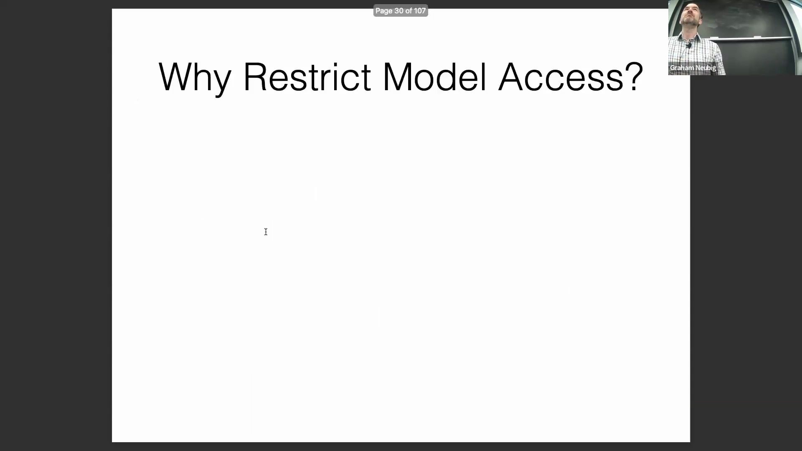
机构限制公众访问其最先进(State-of-the-Art, SOTA)模型主要出于三大动因。首先是商业可行性(Commercial Viability)，这促使 OpenAI、Google 和 Anthropic 等公司通过专有应用程序接口(Proprietary API)对模型进行商业化变现。其次是安全考量(Safety Concerns)；向公众完全开放能力极强的模型可能助长恶意行为(Malicious Activities)，例如生成深度伪造(Deepfake)内容、实施复杂的网络钓鱼(Phishing)攻击或协助开展大规模网络诈骗。第三是法律责任(Legal Liability)因素。鉴于训练数据集的版权状态尚存法律争议，公司通常选择保密其数据来源或训练方法(Training Methodology)，以最大限度规避潜在的知识产权诉讼风险。

## 应对法律灰色地带与转向开放模型
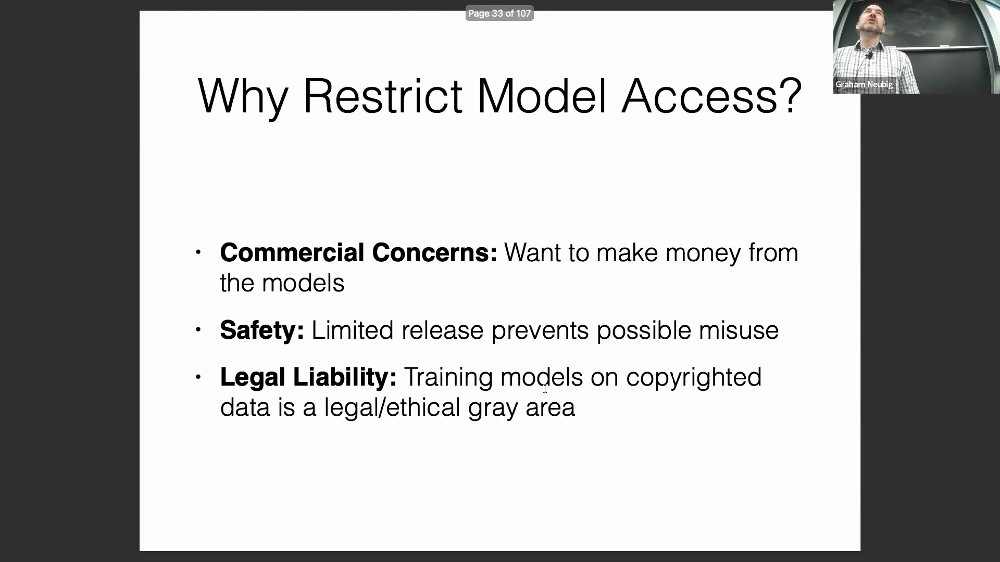
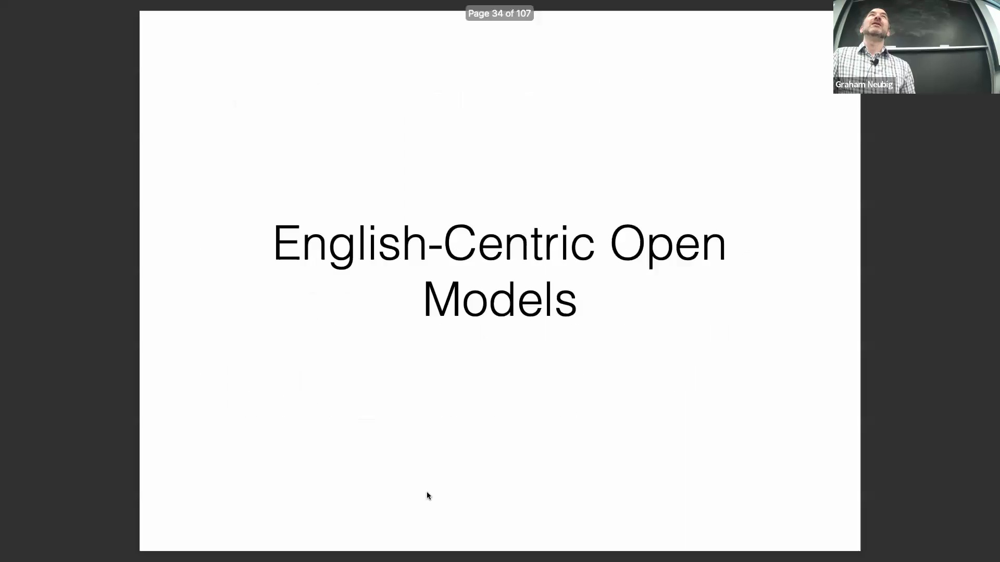
当前的 AI 领域在很大程度上仍处于广阔的法律灰色地带(Legal Gray Area)中。无论是初创企业还是成熟科技公司在集成 AI 技术时，都必须高度重视许可协议的细微条款差异与潜在的版权风险(Copyright Risks)。尽管行业领军企业已成功驾驭这些不确定性并实现业务的快速扩张，但广大开发者仍应保持审慎态度，并严格遵循透明的许可合规实践(License Compliance Practices)。在建立对现代 AI 相关法律与伦理框架的基础认知后，本节讨论将正式转向对开放权重模型(Open-Weight Models)及其底层技术特性的深入探讨。

---

## 模型选择与开源透明度简介
本演讲概述了五种不同大语言模型(Large Language Models, LLMs)的筛选过程，重点优先考虑前两种——Pythia 和 OLMo，因为它们完全开源且具备高度的可复现性。这种透明度使研究人员能够全面了解构建高性能模型所需的训练数据、流程以及规模扩展(Scaling)因素。Pythia 因公开了多种模型规模(Model Sizes)及中间检查点(Checkpoints)而脱颖而出，成为目前文档记录最详尽、可复现性最高的模型之一。

## 开放权重模型与多语言能力
除了完全开源的模型外，演讲还探讨了“开放权重”(Open Weights)模型，这类模型仅公开模型权重，但保留训练数据和代码。Llama 2 被强调为目前应用最广泛且经过大量安全微调(Safety Fine-tuning)的选项。Mistral 和 Mixtral 因其卓越的计算效率(Computational Efficiency)与推理(Inference)速度而备受赞誉；Qwen 则凭借针对性优化的训练语料库展现出强大的多语言性能(Multilingual Capabilities)，尤其在英语和中文方面表现突出。这些模型代表了介于闭源专有 API(Proprietary APIs) 与完全开源研究框架之间的实用折中方案。

## Pythia：架构标准与检查点可用性
Pythia 由 EleutherAI 开发，该组织是一家专注于基础研究的开源人工智能机构，以公开训练代码、数据集和评估基准(Evaluation Benchmarks)而闻名。其核心使命是系统性地研究模型训练动态(Model Training Dynamics)与规模扩展定律(Scaling Laws)。为此，EleutherAI 发布了八种不同规模(Model Sizes)的模型（参数量从 7000 万至 120 亿不等）。在总计 3000 亿词元(Tokens)的训练过程中，每种规模均保存了 154 个中间检查点(Checkpoints)。这种高频率的检查点记录使研究人员能够精确追踪不同规模模型在训练过程中知识习得(Knowledge Acquisition)的动态变化。

在架构方面，Pythia 遵循了当前几乎所有现代大语言模型共用的行业标准 Transformer 架构(Transformer Architecture)。常见特性包括前置层归一化(Pre-layer Normalization)、旋转位置编码(RoPE, Rotary Positional Embeddings)以及 SwiGLU 激活函数(SwiGLU Activation Function)。模型规模的扩展主要通过增加网络层数(Layers)与隐藏层维度(Hidden Dimension)来实现。尽管核心架构一致，但 Pythia 与其他主流模型在某些细节上仍存在细微差异，例如上下文长度(Context Length)（Pythia 为 2K，而 Llama 2 为 4K）、偏置项(Bias)的保留与否，以及归一化技术（Pythia 采用参数化层归一化(Parameterized Layer Normalization)，而 RMSNorm 正逐渐成为行业主流）。

## 训练超参数与 The Pile 数据集构成
训练配置揭示了研究团队经过深思熟虑的设计选择(Deliberate Design Choices)。以 Pythia 的 70 亿参数模型为例，其学习率(Learning Rate)设定为 1.2e-4（约为 Llama 的一半），批次大小(Batch Size)为 200 万词元(Tokens)（相比之下 Llama 2 为 400 万）。此外，研究人员还在 2070 亿词元的去重数据集上进行了对比训练，以量化数据冗余(Data Redundancy)对训练效率(Training Efficiency)的具体影响。

其主要训练语料库为“The Pile”，这是一个具有里程碑意义的开源数据集(Open Dataset)，总容量约 800 GB（折合 3000 亿词元(Tokens)）。该数据集汇集了极其多元化的数据来源：学术论文（PubMed、arXiv）、法律文本（FreeLaw、美国专利）、通用网页抓取数据(Web Crawls)、Stack Exchange 问答、维基百科(Wikipedia)、书籍文献、代码仓库(Code Repositories)以及对话语料库(Dialogue Corpora)。

## 关于学习动态与偏见缓解的研究发现
Pythia 公开的检查点使研究人员能够对模型的记忆机制(Memory Mechanisms)与学习曲线(Learning Curves)进行严谨分析。实验数据表明，在达到性能饱和点(Performance Saturation)之前，较大规模的模型通常展现出更快的学习速率。在训练初期，28 亿参数模型的表现与 120 亿参数模型相当；但随着训练进程的推进，较大规模模型在事实记忆与召回能力(Fact Memorization and Recall)上展现出显著优势。由于所有检查点与数据加载器(Data Loaders)均对外公开，研究人员能够精确追踪在任意给定训练步骤中，具体哪些数据样本对模型行为(Model Behavior)产生了影响。

此外，开放框架允许直接实施数据干预(Data Intervention)，以有效缓解算法偏见(Algorithmic Bias)。通过在训练集中人工平衡男性与女性代词的分布，研究人员成功证明，可借此引导模型生成性别偏见(Gender Bias)显著降低的内容。这些特性充分凸显了完全可复现的模型在机制可解释性(Mechanistic Interpretability)与伦理 AI 研究(Ethical AI Research)领域的巨大价值。

## OLMo：非营利背景与科学目标
演讲随后转向 OLMo 模型，该模型由 AI2（艾伦人工智能研究所，Allen Institute for AI）近期发布。文中探讨的这两款完全开源模型均源自非营利组织(Non-profit Organizations)。相较于商业机构，这类组织面临的商业授权限制较少，且更致力于推动开放科学(Open Science)的发展。OLMo 的核心目标是提供前沿的性能表现，并配套发布完整的文档资料，涵盖开放权重(Open Weights)、训练数据、代码库以及指令微调(Instruction-tuned)变体，旨在最大限度地提升研究可复现性(Reproducibility)并促进开源社区协作。

---

## OLMo 架构与训练规格
OLMo 采用了一种独特的架构设计——无参数层归一化(Non-parametric Layer Normalization)，该设计完全移除了可学习参数，这与当前更常见的 RMS 归一化(RMSNorm)有所不同。该模型在高达 2.46 万亿词元(Tokens)的数据集上进行了训练，远超 Pythia 的 3000 亿词元，反映出其经历了更长且计算强度更高的训练周期。训练配置采用了 3e-4 的标准学习率(Learning Rate)与 400 万词元的批次大小(Batch Size)，符合现代大语言模型(Large Language Models, LLMs)的行业惯例。

## Dolma 数据集与透明处理流程
OLMo 的训练语料库 Dolma 由 AI2（艾伦人工智能研究所）构建，包含高达 3 万亿词元(Tokens)的完全开放数据集(Open Dataset)供公众下载。OLMo 的一个显著特征是其彻底透明的数据处理流程(Data Processing Pipeline)，该流程详细公开了语言过滤(Language Filtering)、质量筛选(Quality Filtering)、内容安全过滤、数据去重(Deduplication)、多源数据混合(Data Mixture)以及分词(Tokenization)等关键环节。与闭源模型开发商不同，AI2 开源了完整的工作流(Workflow)，为研究人员提供了一份罕见且具备高度可复现性(Reproducibility)的大规模数据准备蓝图。

## 数据集构成与竞争性能
Dolma 汇聚了高度多元化且以英语为主的数据来源，涵盖 Common Crawl（2.2 万亿词元）、代码数据集 The Stack（4000 亿词元）、C4、Reddit、STEM 领域学术论文、书籍文献以及维基百科(Wikipedia)。在标准化基准测试(Standardized Benchmarks)中，OLMo 取得了 70.5 的优异平均分，与 Falcon（70.3）和 MPT（69.8）等同级别模型持平甚至实现超越，并显著优于 Pythia（63）。这一性能差距有力地证明，在更大规模且经过精细清洗的语料库上实施规模扩展(Scaling)，能够直接转化为模型能力(Model Capabilities)的实质性提升。

## 规模扩展效应与学习率策略
对各个训练里程碑(Training Milestones)的评估表明，当训练数据量从 5000 亿词元扩展至 2.5 万亿词元时，模型性能呈现持续上升趋势，这证明更长的训练周期带来了实质性的能力提升，而非过拟合(Overfitting)。这一结论得到了严格数据去重(Deduplication)策略的支持，该策略主动将潜在的测试数据从训练池中剔除，以防止数据泄露(Data Leakage)。此外，OLMo 采用了标准的学习率调度策略(Learning Rate Scheduler)：包含一个预热(Warmup)阶段，随后进行衰减，最终收敛至一个下限值（通常为初始学习率的十分之一）。这种稳定化技术能有效避免训练后期的梯度震荡，是长周期训练(Long-horizon Training)中至关重要的超参数(Hyperparameters)设计。

## Llama 2：开放安全性与生产就绪能力
由 Meta 开发的 Llama 2 被广泛视为当前最具竞争力的开放权重(Open Weights)大语言模型之一，提供基础预训练版(Base Model)与指令微调聊天版(Instruction-tuned Chat Model)。其核心优势在于卓越的安全对齐(Safety Alignment)能力，使其成为对风险控制要求极高的面向终端用户部署(End-user Deployment)场景中的首选方案。尽管 Mistral 等替代模型在某些原始基准测试(Raw Benchmarks)中得分略高，但 Llama 2 内置的严格安全防护机制能有效拦截不良或有害输出(Harmful Outputs)，从而为商业与公共级应用提供了更高的系统可靠性。

## 数据来源与轮次（Epoch）管理策略
与完全开源的模型不同，Llama 2 的确切训练数据仍属于专有(Proprietary)性质，但 Meta 披露其主要依赖公开数据源，并有针对性地采用过采样策略(Upsampling)提升事实性内容的比重。对前代 Llama 1 训练机制的分析显示，模型对维基百科、PDF 文档及书籍进行了大量过采样（最高达到 2.4 个训练轮次 Epochs），而 GitHub 等代码仓库(Code Repositories)的数据则被降采样(Downsampling)至 0.6 个轮次。采用非整数轮次反映了现代大模型训练的最佳实践：模型检查点(Checkpoints)按固定的计算步数(Steps)进行保存，而非严格受限于完整的轮次边界。这种做法不仅优化了计算效率(Computational Efficiency)，也为灵活扩展训练数据规模提供了便利。

## 安全对齐与奖励建模
为规避潜在的舆论风险并确保产品安全部署，Meta 在安全对齐训练上投入了巨额计算资源。该流程高度依赖大规模人类偏好数据(Human Preference Data)的采集，以进行奖励建模(Reward Modeling)，即通过人工标注或启发式算法(Heuristic Algorithms)对模型生成的多个候选输出进行显式排序(Explicit Ranking)。该训练管线整合了多个成熟的高质量数据集，包括 Anthropic 的 Helpful/Harmless 系列、OpenAI 的 WebGPT 与 Stack Exchange 偏好对(Preference Pairs)数据，以及斯坦福大学的人类偏好数据集(Stanford Human Preferences Dataset)。这些数据集提供了至关重要的监督信号(Supervisory Signals)，使模型能够通过对齐微调(Alignment Fine-tuning)，持续生成有益(Helpful)且无害(Harmless)的文本内容。

---

## 偏好数据收集与斯坦福 SHP 数据集
对齐过程(Alignment Process)高度依赖高质量的偏好数据(Preference Data)。斯坦福人类偏好数据集(Stanford Human Preferences Dataset, SHP)通过分析 Reddit 社区交互，提供了一种巧妙且自然的数据获取方法。该数据集专门筛选出“后发布回复获得超过先发布回复点赞”的对话实例。在默认情况下，早期发布的帖子通常会积累更多点赞，若后发回复能够反超，则表明其具备更高的内在质量与实用性。这种方法无需依赖人工标注，即可为训练偏好模型(Preference Model)提供强有力的监督信号。

## Meta 的迭代式安全数据流水线
除了利用公开基准测试(Public Benchmarks)，Meta 还收集了大量专有(Proprietary)内部数据用于微调(Fine-tuning) Llama 2。该流程具有高度迭代性(Iterative Nature)：初始模型版本部署于用户交互环境后，专门的“红队”(Red Teaming)测试人员会积极尝试突破模型限制，诱导其生成有害或不安全的内容。源自这些对抗性交互(Adversarial Interactions)的偏好数据被持续采集，并反馈至后续模型版本的训练中。随着每次迭代不断优化，“红队”攻击的难度逐渐增加，但这种闭环流程确保了模型安全边界(Safety Boundaries)的稳步拓展，使其输出更契合人类价值观与期望。

## 奖励建模：区分有益与安全的输出
训练一个奖励模型(Reward Model)，使其能够从两个同样流畅的语言模型输出中准确预测人类偏好，是一项极具挑战性的任务。目前公开可用的奖励模型（如 Open-Assistant 提供的模型）在 Anthropic 的“有益/无害”(Helpful/Harmless) 数据集等标准化基准上的准确率仅约为 67%–68%。当在 Meta 的内部专有数据上进行评估时，由于优选回复与未优选回复之间的差异极为微妙，分类难度进一步增加。为了解决模型实用性与安全风险之间固有的权衡(Trade-off)问题，Meta 开发了双奖励模型架构(Dual Reward Model Architecture)：一个专门用于评估内容的“有益性”(Helpfulness)，另一个则专注于评估“安全性”(Safety)。这种分离式设计有效规避了常见的对齐陷阱(Alignment Pitfall)，即防止模型陷入“过度保守导致功能受限”或“高度灵活但缺乏安全约束”的两难境地。

## 扩展奖励模型与增量式 RLHF 训练
奖励建模的性能在很大程度上取决于评判模型本身的容量(Model Capacity)。Meta 的研究证明，700 亿参数规模的奖励模型显著优于较小规模的变体，这证实了捕捉细微的人类偏好差异需要庞大的模型容量。该训练流程遵循增量式基于人类反馈的强化学习(Incremental Reinforcement Learning from Human Feedback, RLHF)范式：首先从监督微调(Supervised Fine-Tuning, SFT)基线模型出发，随后利用规模逐步扩充的数据集与能力不断增强的奖励模型，开展多轮强化学习(Reinforcement Learning)。迭代评估曲线显示，“有益性”与“安全性”指标均实现了显著且持续的优化，最终发布的模型版本成功在这些多维目标之间达成了有效平衡。

## 面向稳健对话与系统消息遵循的训练
对话式 AI(Conversational AI)面临的一项关键挑战是确保模型在长程交互(Long-horizon Interactions)中能够始终如一地遵循系统提示(System Prompt)中预设的指令。例如，当系统要求“仅使用表情符号回复”时，模型必须在任意长度的对话中持续遵守该约束，而未经专门训练的标准模型往往难以自发维持这种一致性。为攻克这一难题，Meta 采用了一种合成数据生成策略(Synthetic Data Generation Pipeline)。研究人员向现有模型注入严格的系统级规则（如“保持礼貌”、“用五岁儿童能理解的语言解释”或“仅使用表情符号”），并在此基础上构造多轮用户查询对话。在多轮交互中，系统提示始终固定于上下文窗口(Context Window)的起始位置，从而使模型学会生成严格遵循既定约束的回复。在该合成数据集上进行针对性训练，显著增强了模型在长对话场景中坚守并执行系统级指令(System-level Instructions)的鲁棒性。

## Mistral 与 Mixtral：架构创新与多语言侧重
将视线转向 Mistral AI 的产品线，Mistral 与 Mixtral 模型引入了显著的架构创新，核心聚焦于推理速度(Inference Speed)与计算效率(Computational Efficiency)的提升。与训练数据中英语占比高达约 85%、主要侧重英语能力的 Llama 系列不同，Mistral 在语料中深度融合了更广泛的欧洲语言，从而显著强化了其多语言处理能力(Multilingual Capabilities)。尽管完整的训练配置尚未完全公开，但这些模型凭借分组查询注意力(Grouped-Query Attention, GQA)与混合专家架构(Mixture of Experts, MoE)等关键技术脱颖而出，在保持基准测试(Benchmarks)性能不妥协的前提下，大幅提升了推理吞吐量(Throughput)与参数效率(Parameter Efficiency)。

## 滑动窗口注意力机制
Mistral 架构的一项核心创新是引入了滑动窗口注意力(Sliding Window Attention)机制。传统的全局注意力机制(Global Attention)需要计算序列中所有历史词元(Token)的关联，随着上下文长度(Context Length)的增加，其二次方计算复杂度将变得难以承受。相比之下，滑动窗口注意力将每个词元的注意力范围严格限制在一个固定大小的局部窗口内（Mistral 设定为 4,096 个词元）。随着信息在连续的 Transformer 层(Transformer Layers)中向前传播，这种局部感受野(Receptive Field)会逐层叠加与扩展，使模型能够有效捕捉并访问序列中更久远的依赖关系。该设计在几乎不增加额外训练成本或计算开销(Computational Overhead)的前提下（因为单步注意力计算复杂度保持线性恒定），显著延展了模型的有效上下文处理能力。

---

## Mistral 与 Mixtral：混合专家架构与扩展上下文
Mixtral 采用混合专家(Mixture of Experts, MoE)架构，性能强劲，在众多基准测试(Benchmarks)中表现常优于 Llama 系列模型。得益于其 450 亿(45B)参数的精炼规模，其部署与推理(Inference)速度显著快于 Llama 70B。在架构设计上，该模型继承了标志性的滑动窗口注意力(Sliding Window Attention)机制。尽管基础窗口大小设定为 4,096 个词元(Tokens)，但借助基于块的处理策略(Block-based Processing)，其有效可访问的上下文长度(Context Length)被成功扩展至 8,192 个词元。通过使每个词元聚焦于相邻的前序窗口，并在连续的 Transformer 层(Transformer Layers)中逐层传播表征，模型得以高效捕获长程依赖关系(Long-range Dependencies)，同时成功规避了传统全局注意力机制(Global Attention)所引发的二次方计算复杂度(Quadratic Computational Complexity)开销。

## Qwen：多语言设计与词表扩展
由阿里巴巴研发的 Qwen 是一款性能卓越的多语言基础模型(Multilingual Foundation Model)，在英语与中文任务上表现尤为突出，同时在更广泛的语种中也保持了强劲的竞争力。其架构设计的关键差异化特征在于词表(Vocabulary)的大幅扩容——词元(Tokens)数量增至 15 万，远超 Llama 的 3.2 万。这一扩展对实现高效的跨语言处理(Cross-lingual Processing)至关重要。在底层架构方面，Qwen 基本遵循标准 Transformer 设计，仅引入了注意力偏置(Attention Biases)等细微调整；其卓越的性能提升主要归功于严谨的数据工程(Data Engineering)实践，以及专门针对多语言输入优化的训练策略(Training Strategies)。

## 分词器效率与跨语言碎片化
分词策略(Tokenization Strategy)对多语言模型的运行效率具有深远影响。子词分词器(Subword Tokenizer)在处理低频语言字符时，往往会将其拆解为更小的单元，这不仅会大幅增加计算成本(Computational Cost)，还会削弱语义的连贯性。对比分析显示，相较于 XLM-R 等成熟的多语言基线模型(Multilingual Baseline Models)，Llama 的分词器在泰语、希伯来语、阿拉伯语、韩语、日语及中文等语种上，会将其切分为数量显著更多的片段；以泰语为例，Llama 产生的分词数量高达 XLM-R 的 3.7 倍。相比之下，Qwen 的分词器效率与 XLM-R 高度吻合，能够有效保留完整的语义单元，从而避免了文本的过度碎片化(Over-fragmentation)。这种优化的分词设计同样适用于代码数据的完整保留，使得 Qwen 能够更高效地处理多语言文本与编程代码数据。

## 专用代码模型与排行榜领先地位
除通用大语言模型外，当前 AI 生态中还涌现出大量针对特定领域高度优化的专用模型(Domain-specific Models)。尽管现代通用大语言模型普遍已引入代码数据以强化逻辑推理(Logical Reasoning)能力并满足广泛的工业级应用需求，但仍有一批模型专为编程任务(Programming Tasks)而设计。其中，StarCoder2 延续了类似 Pythia 的完全开源与高可复现性(Fully Open-source and Highly Reproducible)研究范式；Meta 推出的 Code Llama 实现了对 Llama 架构的稳健适配(Robust Adaptation)；而 DeepSeek Coder 则在多项编程基准测试(Programming Benchmarks)中持续保持领先。这三款模型均代表了当前最先进的代码生成能力(State-of-the-art Code Generation Capabilities)，关于其底层架构的更深层次技术评估(Advanced Technical Evaluation)将留待后续专业课程中详细展开。

## 数学推理与开放研究模型
标准大语言模型在处理复杂数学推理(Complex Mathematical Reasoning)任务时往往面临显著瓶颈，这促使研究团队开发出专门针对数学数据集、符号演算(Symbolic Computation)及结构化问题求解(Structured Problem-solving)格式进行训练的专用架构。EleutherAI 为此领域贡献了 Lemma 模型，该模型完全开源，并透明公开了全部训练数据、流程细节与中间检查点(Model Checkpoints)。这种对可复现性(Reproducibility)的坚定承诺，与更广泛的开放科学探索方向高度契合。其核心目的在于深入探究：如何通过目标导向的数据构建(Goal-oriented Data Curation)、领域专用分词器(Domain-specific Tokenizer)以及严谨的训练策略(Training Strategies)，系统性地克服通用大语言模型在数学与逻辑推演领域的固有局限(Inherent Limitations)。

---

## 专用数学模型：Lemma 与 DeepSeek
讨论首先聚焦于专注于数学推理(Mathematical Reasoning)的高度专用模型。由 EleutherAI 开发的 Lemma 被定位为一个完全开源且透明的数学模型，卡内基梅隆大学(CMU)的 Sean Welleck 也为其做出了重要贡献。另一款备受瞩目的模型是 DeepSeek 的数学专用模型，其性能已可与 GPT-4 相媲美。DeepSeek 通过训练专用分类器从海量互联网数据中识别并提取数学相关内容，并结合 ProofWiki 等高质量黄金标准数据集(Gold-standard Datasets)进行训练。尽管基于正确性验证的基于人类反馈的强化学习(Reinforcement Learning from Human Feedback, RLHF)等先进技术可能发挥了作用，但其核心优势仍在于精心构建的领域特定数据(Domain-specific Data)与针对性的训练策略。
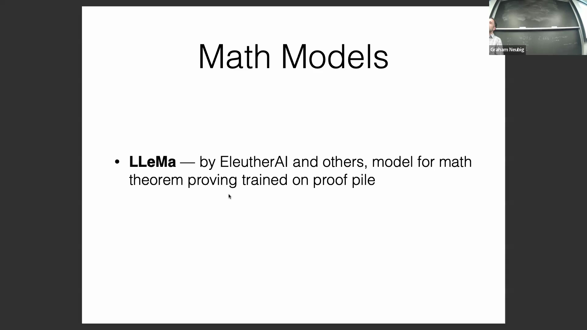

## Galactica：多模态科学与公众反响
转向科学应用领域，Meta 的 Galactica 被介绍为一款专为科学研究设计的雄心勃勃的多模态模型(Multimodal Model)。尽管其发布时遭遇了巨大的公众反弹与公关危机——这在很大程度上是因为早期大语言模型(LLMs)的幻觉问题(Hallucination)在被建议用于辅助撰写学术论文时被暴露出来——但演讲者仍为其技术价值进行了辩护。Galactica 旨在处理多种科学模态，涵盖原始文本、LaTeX 公式、代码，以及分子式、蛋白质结构(如胶原蛋白)和 DNA 序列等复杂结构表征(Complex Structural Representations)。即便其首次发布的时机欠佳，它在生物与化学数据建模方面的创新方法，仍为未来领域专用 AI(Domain-specific AI)的发展提供了宝贵的蓝图。
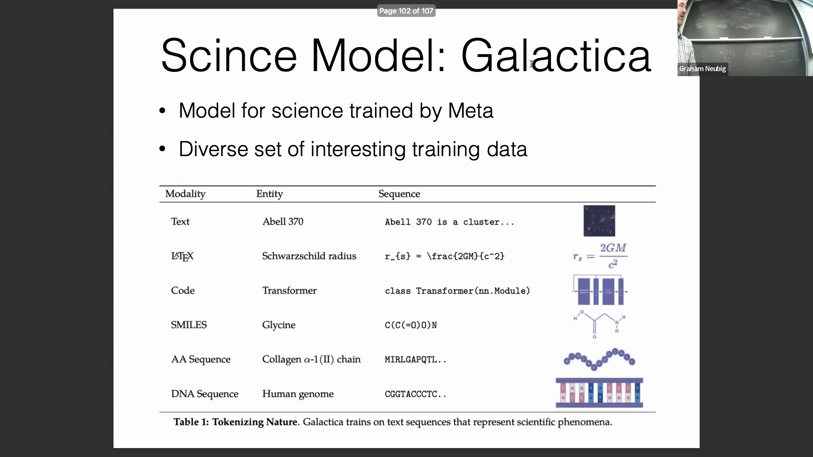
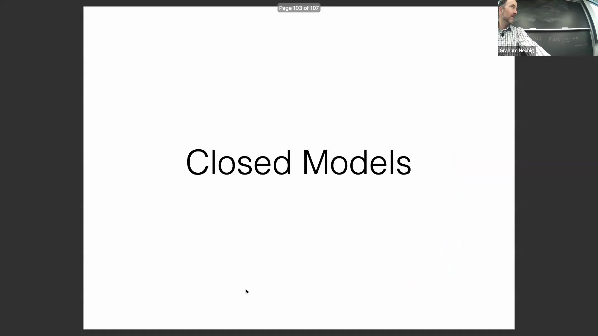

## 闭源模型：透明度限制与 GPT-4 的主导地位
讲座随后转向闭源模型(Closed-source Models)，在此类模型中，训练方法与数据构成在很大程度上仍不透明。相关公司通常仅公开评估基准(Evaluation Benchmarks)与安全/红队测试报告(Red-teaming Reports)，而非详细的架构或训练细节。在此背景下，GPT-4 依然是通用推理(General Reasoning)与实际应用(Utility)方面的事实行业标准。作为 ChatGPT Plus 版本的底层驱动模型，它针对对话交互(Conversational Interactions)进行了深度优化，并已演进为原生支持图像输入，同时能够通过强大的函数调用(Function-calling)接口执行外部操作。
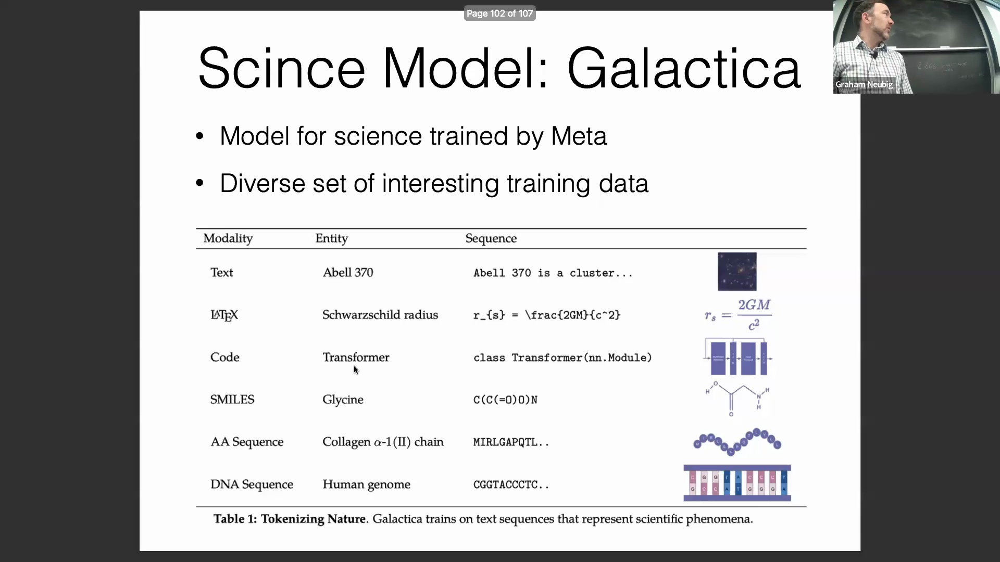
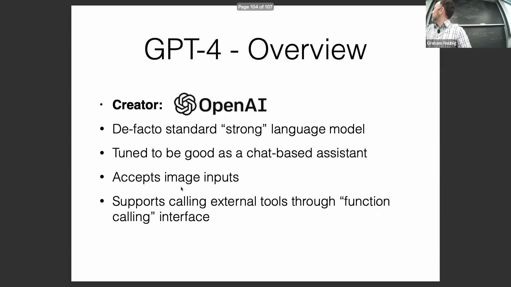

## 多模态能力与工具集成
实际演示展示了 GPT-4 在文本生成之外的多样化能力。其多模态视觉理解能力(Multimodal Vision Capabilities)允许用户直接输入视觉数据，例如直接粘贴研究论文中的表格，模型即可瞬间将其转换为结构化的 JSON 格式(Structured JSON Format)。此外，GPT-4 还能与 DALL-E 3 等生成式工具无缝集成以创建自定义图像，并可按需编写、执行和可视化代码——例如自动生成 Python 脚本，将提供的数值数据绘制为直方图。这些功能凸显了现代大语言模型如何作为核心编排中枢(Central Orchestrator)，将逻辑推理、多模态感知与外部工具执行(External Tool Execution)无缝融合。
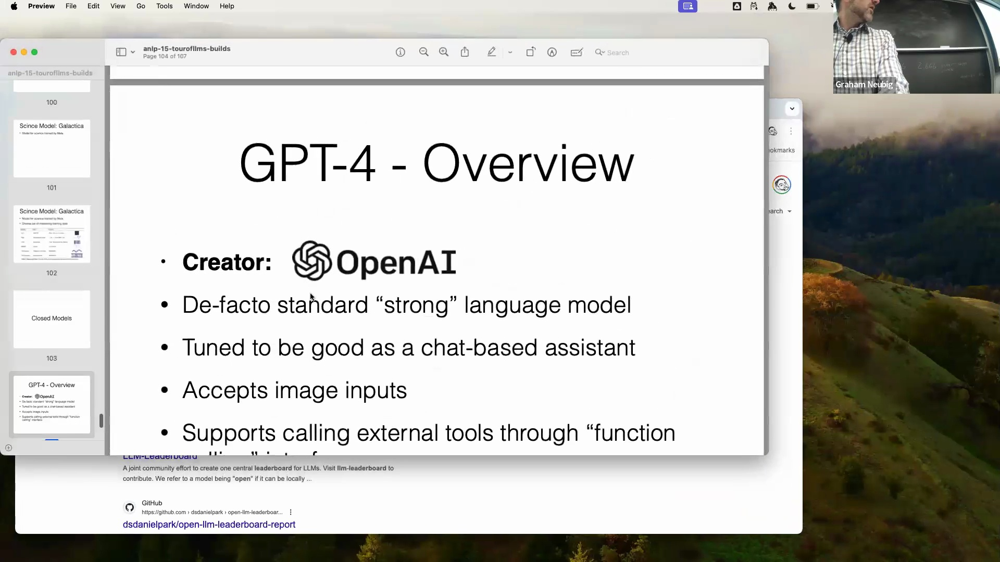
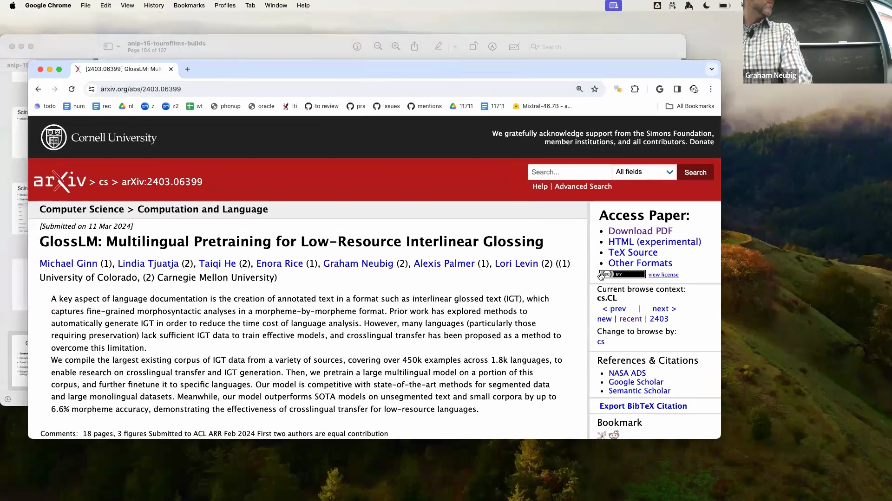
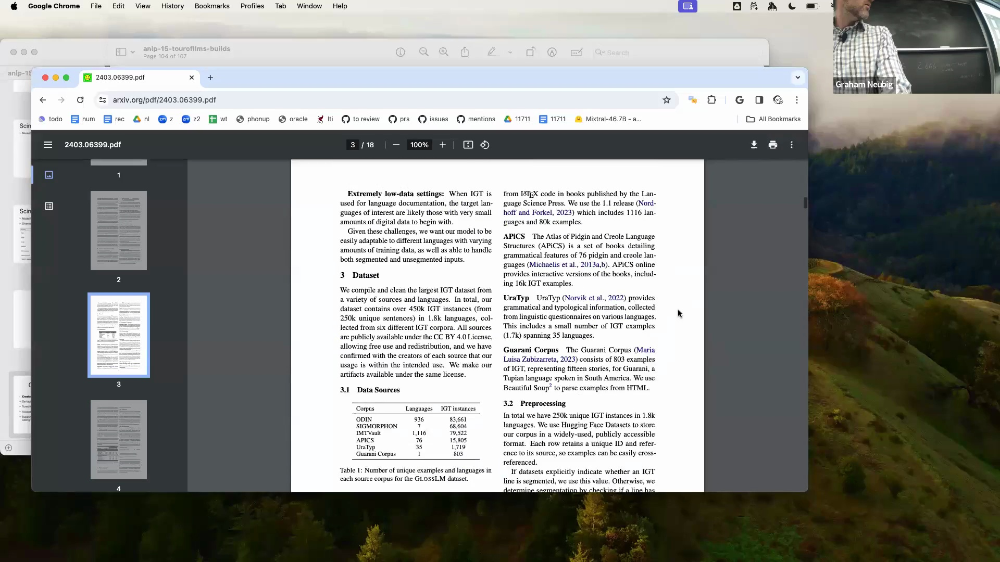
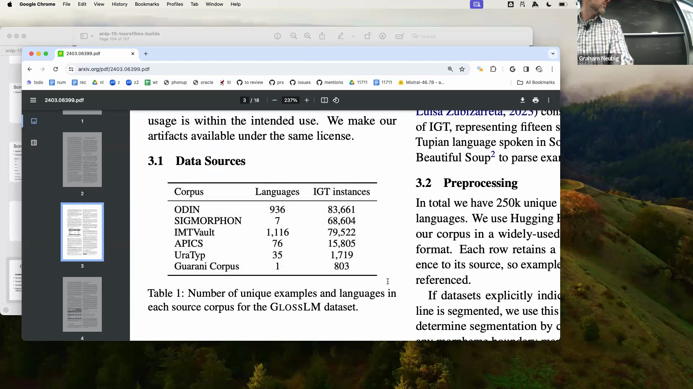
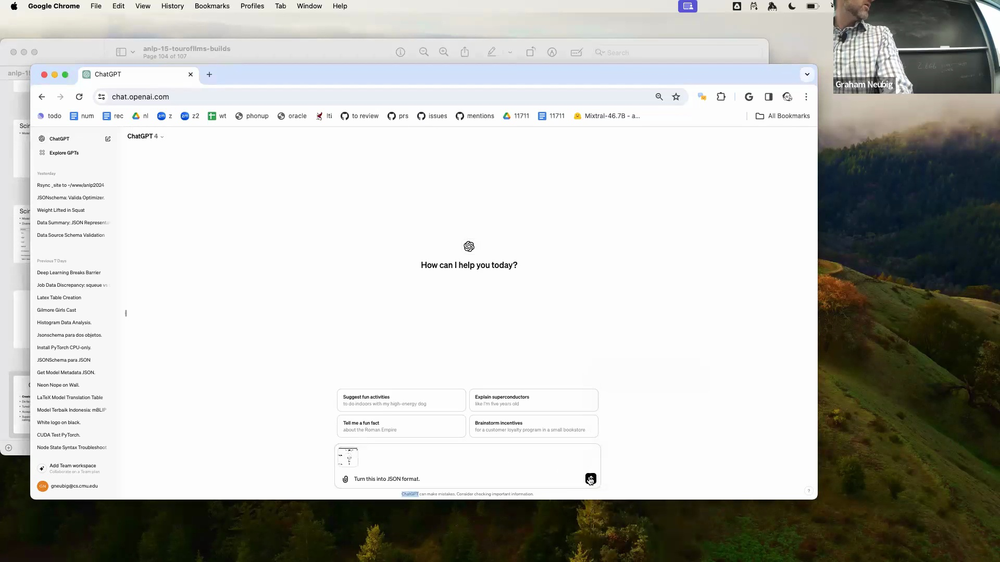
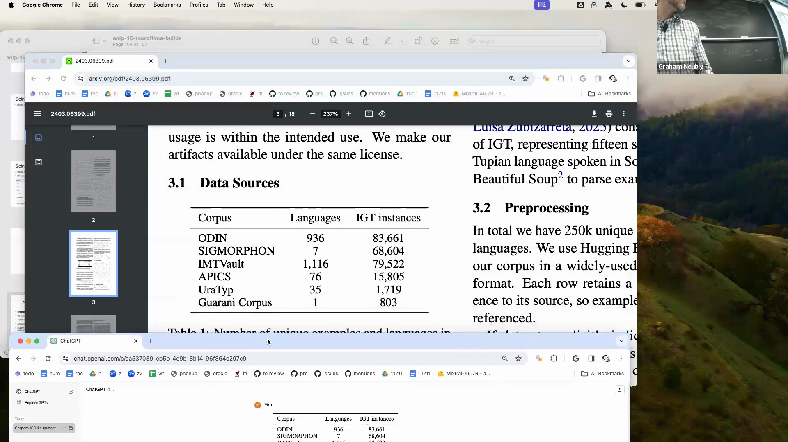

## 深度学习的演进：视觉处理与工具调用
在提及一篇引发广泛争议、声称“深度学习正遭遇瓶颈”的文章时，演讲者巧妙地利用 GPT-4 生成了一张“深度学习突破砖墙”的图像。该演示旨在阐明现代 AI 架构中一个关键的技术分野：多模态视觉处理与工具调用(Tool Calling)。在分析用户上传的图像时，模型会将视觉数据直接编码(Encode)至其词元流(Token Stream)中进行内部处理；相反，在生成新图像时，大语言模型则充当智能体(Agent)，构思精确的文本描述，并通过 API 调用外部图像生成模型（如 DALL-E 3）。这种双重能力——内部多模态理解与外部工具调度(Tool Orchestration)的深度结合——正定义着当前大语言模型发展的前沿范式(Cutting-edge Paradigm)。
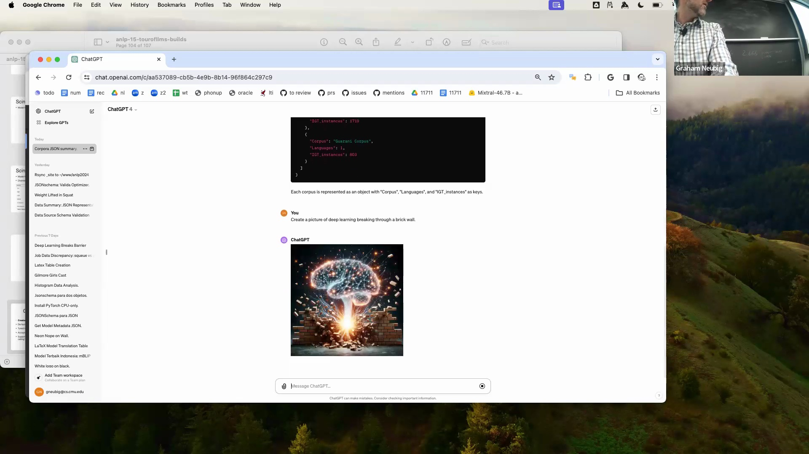
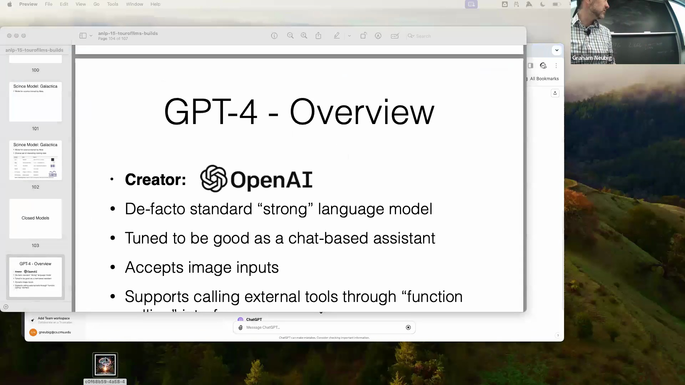
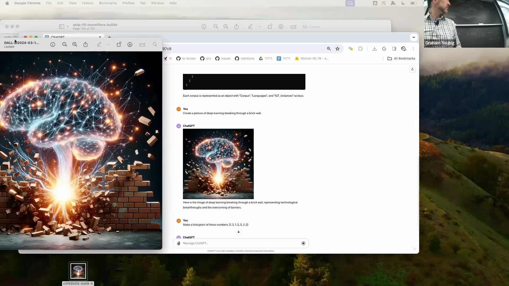

---

## 闭源模型竞争对手与多模态能力
讲座从 GPT-4 的工具调用(Function Calling)演示，自然过渡到其在闭源专有领域的主要竞争对手：Google 的 Gemini 与 Anthropic 的 Claude。Gemini 推出了 Pro 和 Ultra 版本，其核心差异化优势在于超大的上下文窗口(Context Window)（最高支持 100 万词元(Tokens)），以及卓越的原生视频理解与图像生成能力。同样，Claude 3 提供了 20 万词元的上下文窗口与出色的多模态图像处理能力，使其在推理准确性(Reasoning Accuracy)与实际效用(Utility)方面成为 GPT-4 的直接竞品。这些模型的演进凸显出整个行业正快速向海量上下文处理(Massive Context Processing)与无缝跨模态交互(Cross-modal Interaction)方向迈进。

## 弥合差距：开源模型与并排评估工具
当前人工智能(Artificial Intelligence, AI)发展的核心焦点之一，是弥合透明开放权重(Open Weights)模型与高度优化的闭源系统之间的性能差距。为在日益碎片化的模型生态中简化评估流程，“God Mode”等多模型并行聊天界面工具应运而生。此类工具允许用户向多个模型同时输入相同的提示词(Prompts)，从而即时提供在推理深度、格式遵循能力与响应速度方面的并排定性对比(Side-by-side Qualitative Comparison)。对于需在决定集成特定应用程序接口(Application Programming Interface, API)前评估模型实际对话行为(Conversational Behavior)的研究人员与开发者而言，强烈推荐采用这种交互式评估方法。

## 对基准测试方法的批判性分析
演讲者强烈警告业界勿盲目采信已发布的基准测试(Benchmarks)数据表格，并以 Google 的 Gemini 论文为例，指出其中存在的方法学差异(Methodological Discrepancies)会严重扭曲评估结果。对比评估常受困于提示工程策略的不一致。例如，对新模型采用“32 次生成择优采样”(Best-of-32 Sampling)策略，却直接将其与竞争对手的单次生成(Single-generation)基线进行对比。此外，对比所用的基线分数(Baseline Scores)往往直接引用自过时的学术论文，而非反映当前在线 API 部署的实际性能。此类不一致性会人为夸大模型的性能提升(Performance Gains)，进而掩盖真实的行业竞争格局。

## 应对 API 漂移与标准化评估框架
除提示策略不一致外，闭源模型的 API 还会经历持续且未公开记录的静默更新(Silent Updates)，从而迅速改变模型的性能基线。例如，独立测试显示，GPT-3.5 Turbo 在 HumanEval 基准(Benchmark)上的得分，在最初发布的研究论文与后续 API 部署之间跃升了近 30 分，在同等测试条件下，其表现甚至偶尔超越更新的模型。此外，现代模型内置的严格安全过滤机制(Safety Filtering Mechanisms)可能会拦截标准化的评估提示(Evaluation Prompts)，迫使研究人员采取规避策略，进一步增加了公平对比的复杂度。鉴于上述变量，最可靠的评估策略是将定性的人工测评与严格的自动化评估框架(Automated Evaluation Framework)相结合。EleutherAI Evaluation Harness 等开源工具为模型提供了可复现的多任务基准测试(Multi-task Benchmarks)，确保架构与技术选型由实证数据(Empirical Data)驱动，而非受制于营销宣传指标。

