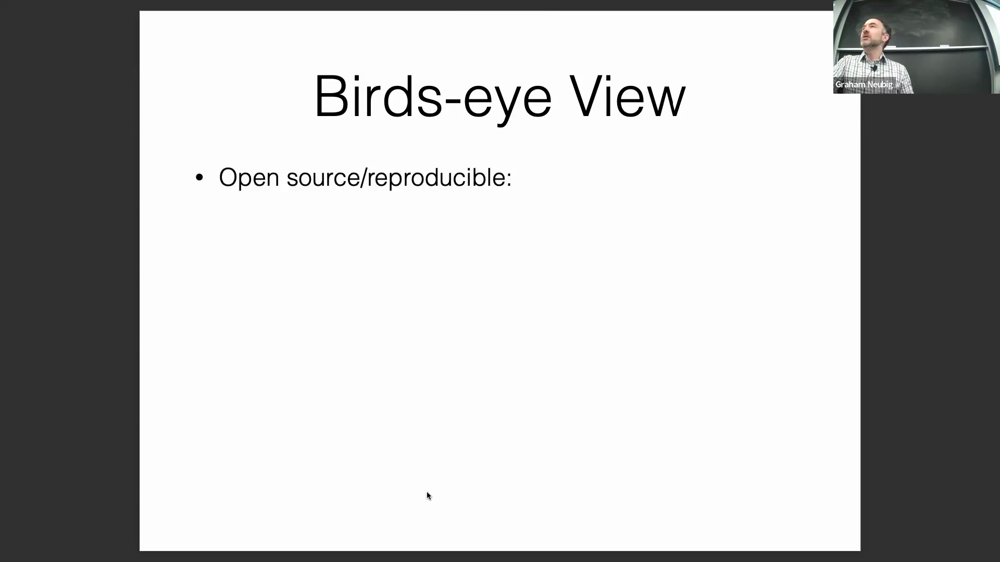
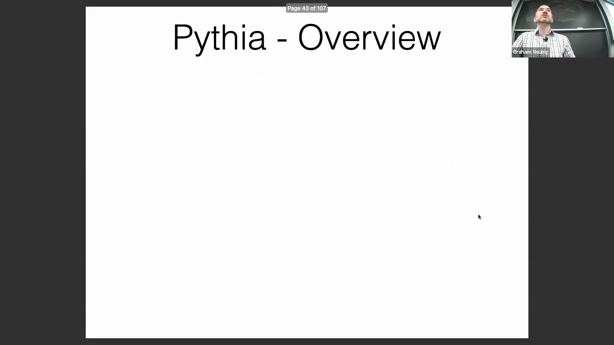
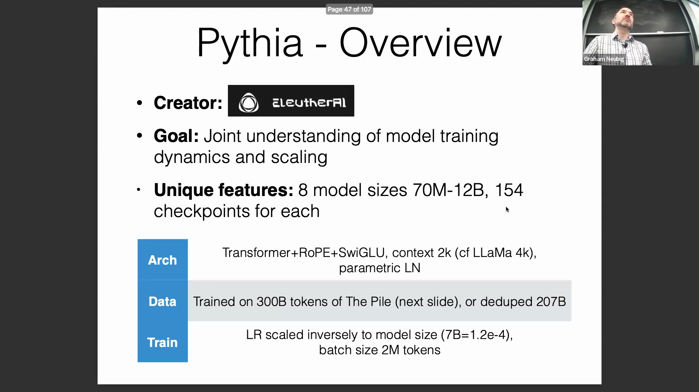
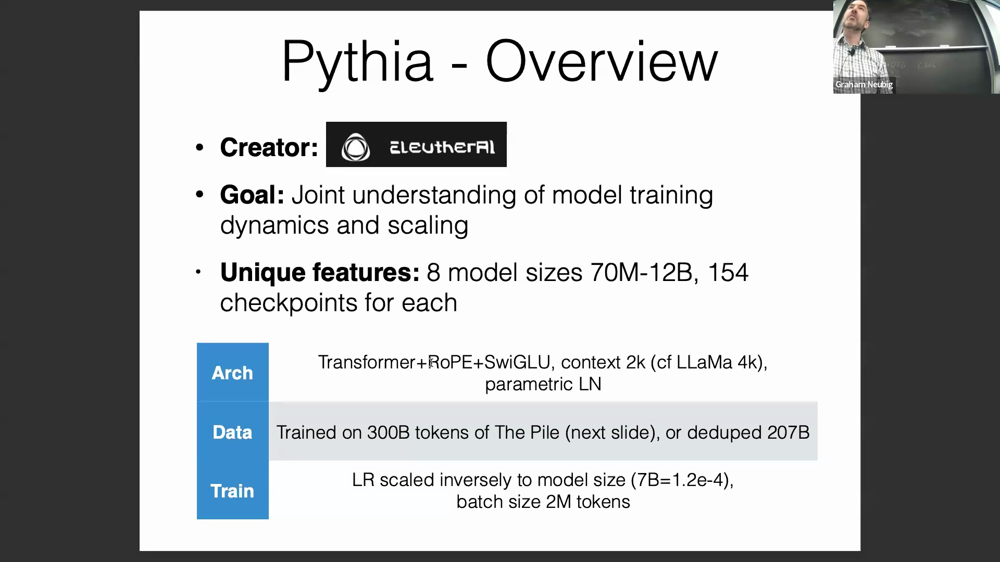
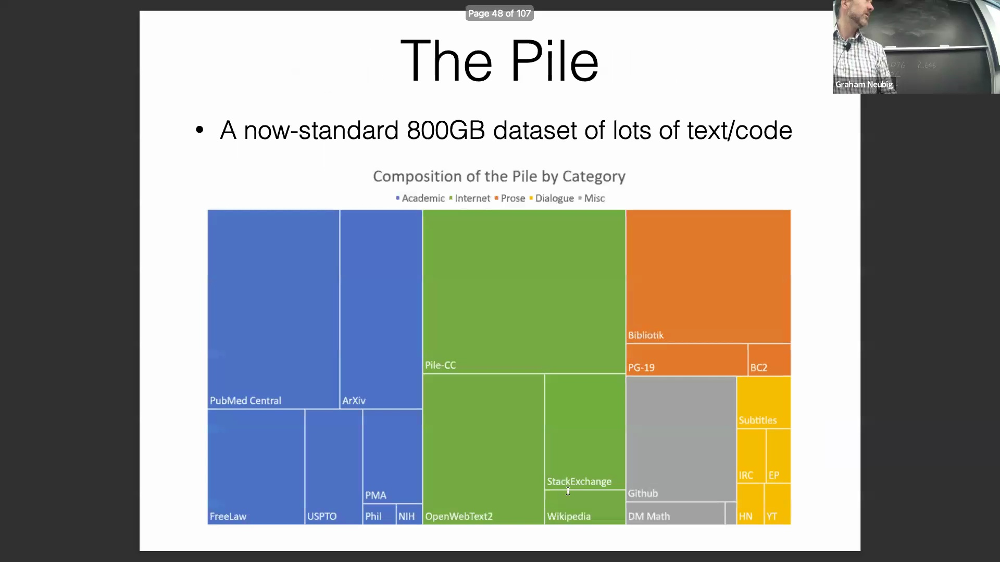
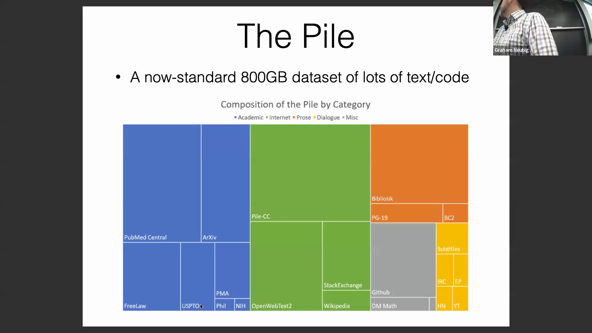
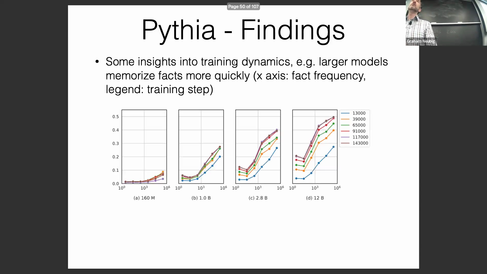
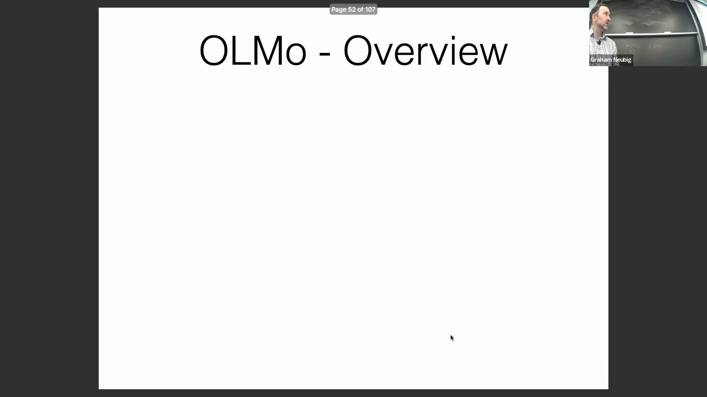
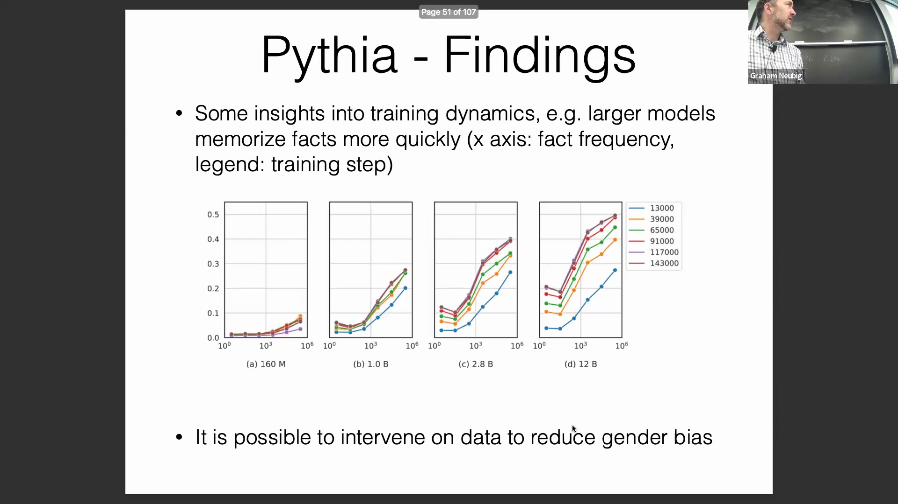
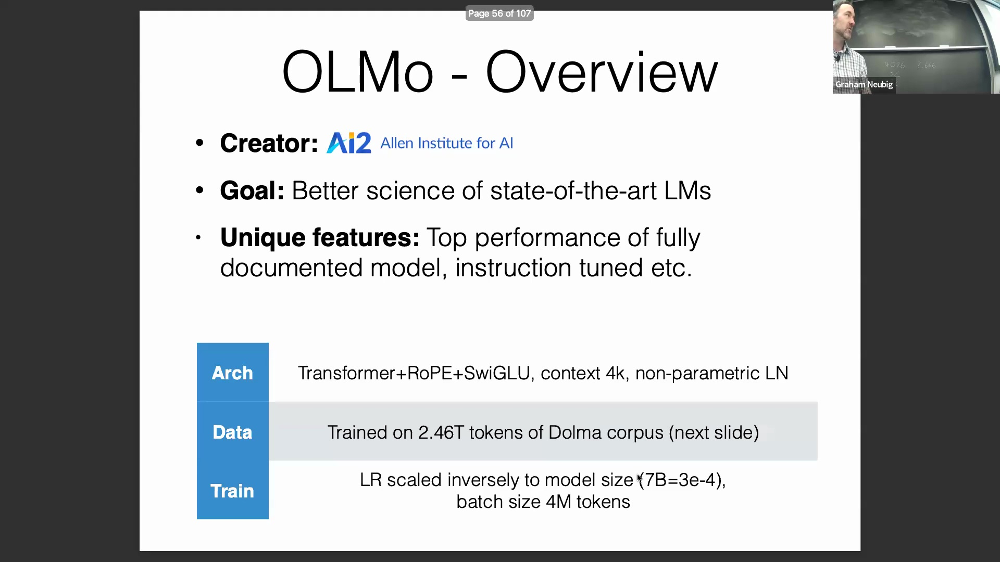

## 模型选择与开源透明度简介
本演讲概述了五种不同大语言模型(Large Language Models, LLMs)的筛选过程，重点优先考虑前两种——Pythia 和 OLMo，因为它们完全开源且具备高度的可复现性。这种透明度使研究人员能够全面了解构建高性能模型所需的训练数据、流程以及规模扩展(Scaling)因素。Pythia 因公开了多种模型规模(Model Sizes)及中间检查点(Checkpoints)而脱颖而出，成为目前文档记录最详尽、可复现性最高的模型之一。

## 开放权重模型与多语言能力
除了完全开源的模型外，演讲还探讨了“开放权重”(Open Weights)模型，这类模型仅公开模型权重，但保留训练数据和代码。Llama 2 被强调为目前应用最广泛且经过大量安全微调(Safety Fine-tuning)的选项。Mistral 和 Mixtral 因其卓越的计算效率(Computational Efficiency)与推理(Inference)速度而备受赞誉；Qwen 则凭借针对性优化的训练语料库展现出强大的多语言性能(Multilingual Capabilities)，尤其在英语和中文方面表现突出。这些模型代表了介于闭源专有 API(Proprietary APIs) 与完全开源研究框架之间的实用折中方案。

## Pythia：架构标准与检查点可用性
Pythia 由 EleutherAI 开发，该组织是一家专注于基础研究的开源人工智能机构，以公开训练代码、数据集和评估基准(Evaluation Benchmarks)而闻名。其核心使命是系统性地研究模型训练动态(Model Training Dynamics)与规模扩展定律(Scaling Laws)。为此，EleutherAI 发布了八种不同规模(Model Sizes)的模型（参数量从 7000 万至 120 亿不等）。在总计 3000 亿词元(Tokens)的训练过程中，每种规模均保存了 154 个中间检查点(Checkpoints)。这种高频率的检查点记录使研究人员能够精确追踪不同规模模型在训练过程中知识习得(Knowledge Acquisition)的动态变化。

在架构方面，Pythia 遵循了当前几乎所有现代大语言模型共用的行业标准 Transformer 架构(Transformer Architecture)。常见特性包括前置层归一化(Pre-layer Normalization)、旋转位置编码(RoPE, Rotary Positional Embeddings)以及 SwiGLU 激活函数(SwiGLU Activation Function)。模型规模的扩展主要通过增加网络层数(Layers)与隐藏层维度(Hidden Dimension)来实现。尽管核心架构一致，但 Pythia 与其他主流模型在某些细节上仍存在细微差异，例如上下文长度(Context Length)（Pythia 为 2K，而 Llama 2 为 4K）、偏置项(Bias)的保留与否，以及归一化技术（Pythia 采用参数化层归一化(Parameterized Layer Normalization)，而 RMSNorm 正逐渐成为行业主流）。

## 训练超参数与 The Pile 数据集构成
训练配置揭示了研究团队经过深思熟虑的设计选择(Deliberate Design Choices)。以 Pythia 的 70 亿参数模型为例，其学习率(Learning Rate)设定为 1.2e-4（约为 Llama 的一半），批次大小(Batch Size)为 200 万词元(Tokens)（相比之下 Llama 2 为 400 万）。此外，研究人员还在 2070 亿词元的去重数据集上进行了对比训练，以量化数据冗余(Data Redundancy)对训练效率(Training Efficiency)的具体影响。

其主要训练语料库为“The Pile”，这是一个具有里程碑意义的开源数据集(Open Dataset)，总容量约 800 GB（折合 3000 亿词元(Tokens)）。该数据集汇集了极其多元化的数据来源：学术论文（PubMed、arXiv）、法律文本（FreeLaw、美国专利）、通用网页抓取数据(Web Crawls)、Stack Exchange 问答、维基百科(Wikipedia)、书籍文献、代码仓库(Code Repositories)以及对话语料库(Dialogue Corpora)。

## 关于学习动态与偏见缓解的研究发现
Pythia 公开的检查点使研究人员能够对模型的记忆机制(Memory Mechanisms)与学习曲线(Learning Curves)进行严谨分析。实验数据表明，在达到性能饱和点(Performance Saturation)之前，较大规模的模型通常展现出更快的学习速率。在训练初期，28 亿参数模型的表现与 120 亿参数模型相当；但随着训练进程的推进，较大规模模型在事实记忆与召回能力(Fact Memorization and Recall)上展现出显著优势。由于所有检查点与数据加载器(Data Loaders)均对外公开，研究人员能够精确追踪在任意给定训练步骤中，具体哪些数据样本对模型行为(Model Behavior)产生了影响。

此外，开放框架允许直接实施数据干预(Data Intervention)，以有效缓解算法偏见(Algorithmic Bias)。通过在训练集中人工平衡男性与女性代词的分布，研究人员成功证明，可借此引导模型生成性别偏见(Gender Bias)显著降低的内容。这些特性充分凸显了完全可复现的模型在机制可解释性(Mechanistic Interpretability)与伦理 AI 研究(Ethical AI Research)领域的巨大价值。

## OLMo：非营利背景与科学目标
演讲随后转向 OLMo 模型，该模型由 AI2（艾伦人工智能研究所，Allen Institute for AI）近期发布。文中探讨的这两款完全开源模型均源自非营利组织(Non-profit Organizations)。相较于商业机构，这类组织面临的商业授权限制较少，且更致力于推动开放科学(Open Science)的发展。OLMo 的核心目标是提供前沿的性能表现，并配套发布完整的文档资料，涵盖开放权重(Open Weights)、训练数据、代码库以及指令微调(Instruction-tuned)变体，旨在最大限度地提升研究可复现性(Reproducibility)并促进开源社区协作。

