## OLMo 架构与训练规格
OLMo 采用了一种独特的架构设计——无参数层归一化(Non-parametric Layer Normalization)，该设计完全移除了可学习参数，这与当前更常见的 RMS 归一化(RMSNorm)有所不同。该模型在高达 2.46 万亿词元(Tokens)的数据集上进行了训练，远超 Pythia 的 3000 亿词元，反映出其经历了更长且计算强度更高的训练周期。训练配置采用了 3e-4 的标准学习率(Learning Rate)与 400 万词元的批次大小(Batch Size)，符合现代大语言模型(Large Language Models, LLMs)的行业惯例。
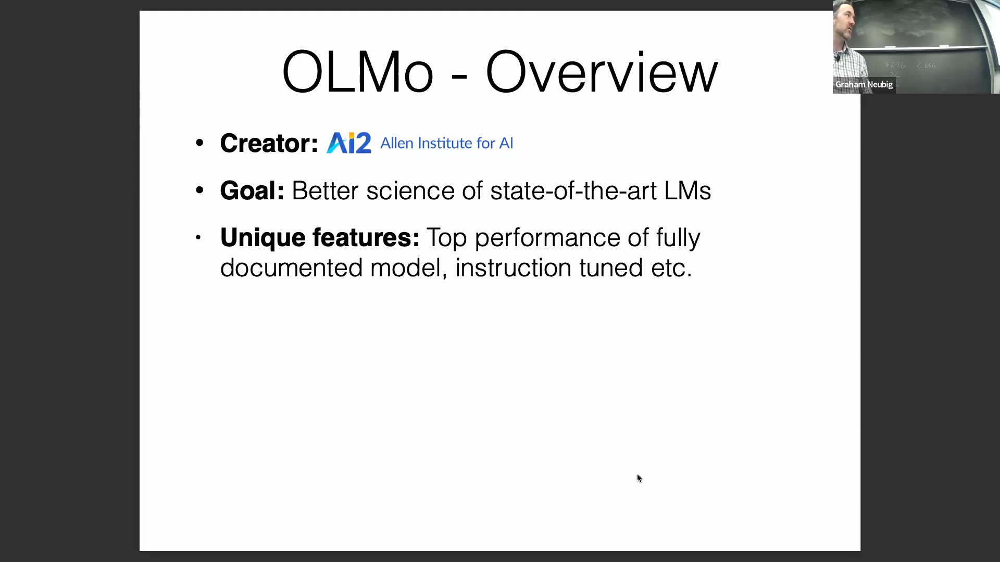

## Dolma 数据集与透明处理流程
OLMo 的训练语料库 Dolma 由 AI2（艾伦人工智能研究所）构建，包含高达 3 万亿词元(Tokens)的完全开放数据集(Open Dataset)供公众下载。OLMo 的一个显著特征是其彻底透明的数据处理流程(Data Processing Pipeline)，该流程详细公开了语言过滤(Language Filtering)、质量筛选(Quality Filtering)、内容安全过滤、数据去重(Deduplication)、多源数据混合(Data Mixture)以及分词(Tokenization)等关键环节。与闭源模型开发商不同，AI2 开源了完整的工作流(Workflow)，为研究人员提供了一份罕见且具备高度可复现性(Reproducibility)的大规模数据准备蓝图。
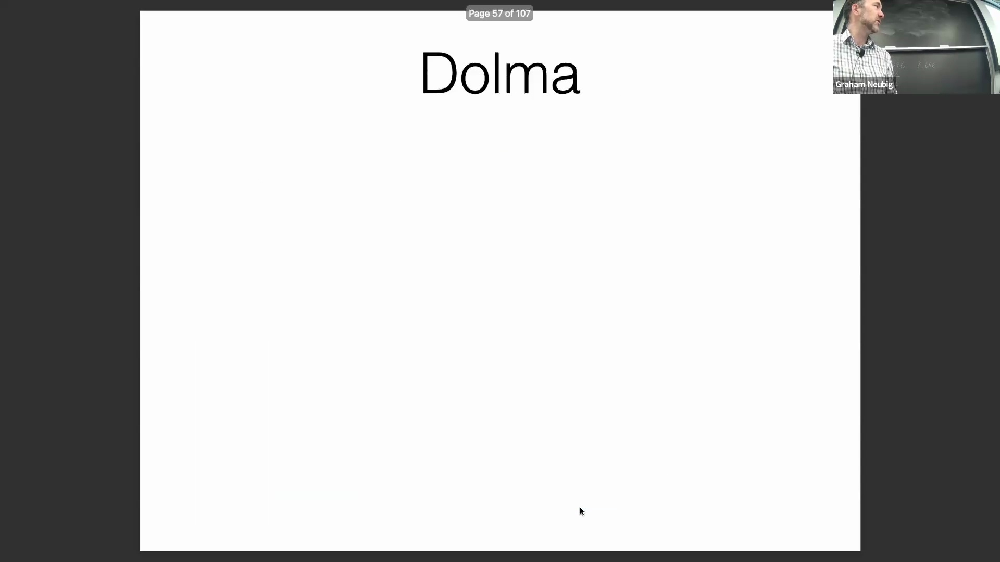
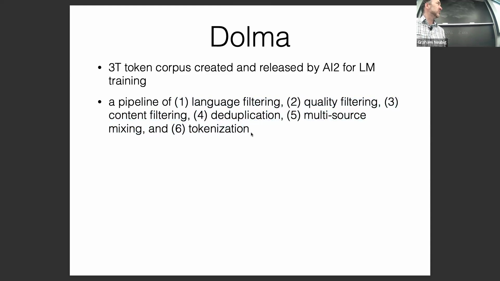

## 数据集构成与竞争性能
Dolma 汇聚了高度多元化且以英语为主的数据来源，涵盖 Common Crawl（2.2 万亿词元）、代码数据集 The Stack（4000 亿词元）、C4、Reddit、STEM 领域学术论文、书籍文献以及维基百科(Wikipedia)。在标准化基准测试(Standardized Benchmarks)中，OLMo 取得了 70.5 的优异平均分，与 Falcon（70.3）和 MPT（69.8）等同级别模型持平甚至实现超越，并显著优于 Pythia（63）。这一性能差距有力地证明，在更大规模且经过精细清洗的语料库上实施规模扩展(Scaling)，能够直接转化为模型能力(Model Capabilities)的实质性提升。
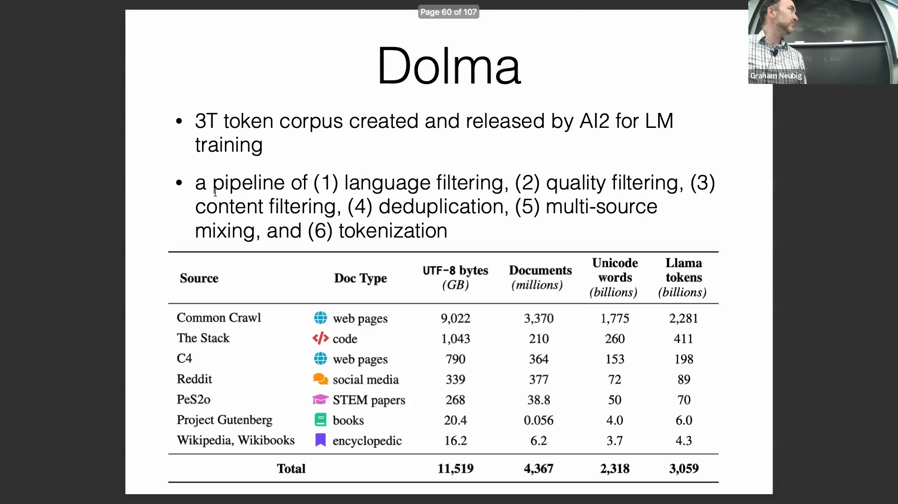
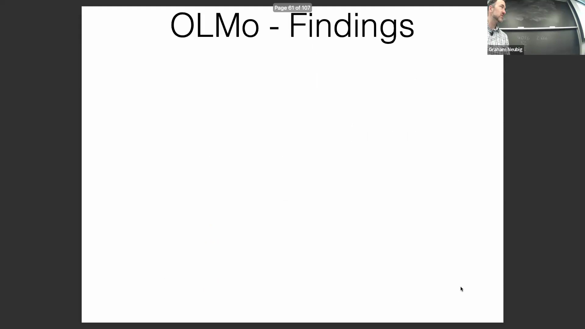

## 规模扩展效应与学习率策略
对各个训练里程碑(Training Milestones)的评估表明，当训练数据量从 5000 亿词元扩展至 2.5 万亿词元时，模型性能呈现持续上升趋势，这证明更长的训练周期带来了实质性的能力提升，而非过拟合(Overfitting)。这一结论得到了严格数据去重(Deduplication)策略的支持，该策略主动将潜在的测试数据从训练池中剔除，以防止数据泄露(Data Leakage)。此外，OLMo 采用了标准的学习率调度策略(Learning Rate Scheduler)：包含一个预热(Warmup)阶段，随后进行衰减，最终收敛至一个下限值（通常为初始学习率的十分之一）。这种稳定化技术能有效避免训练后期的梯度震荡，是长周期训练(Long-horizon Training)中至关重要的超参数(Hyperparameters)设计。
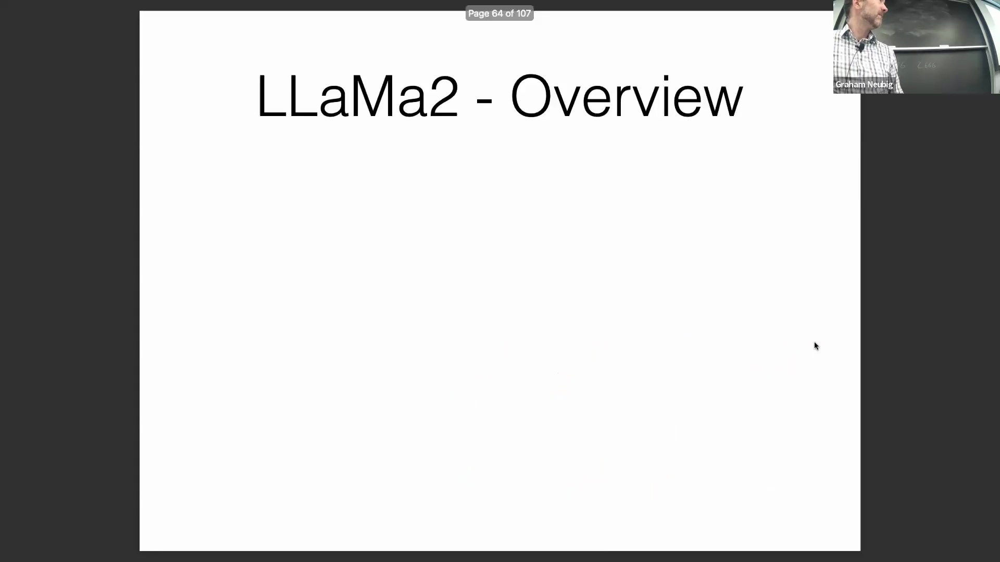
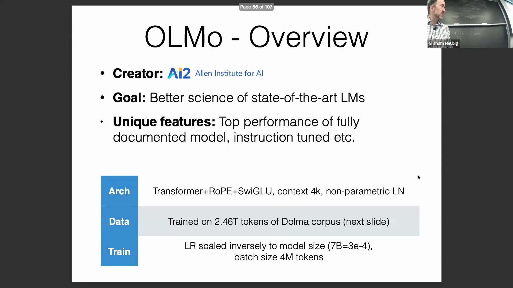
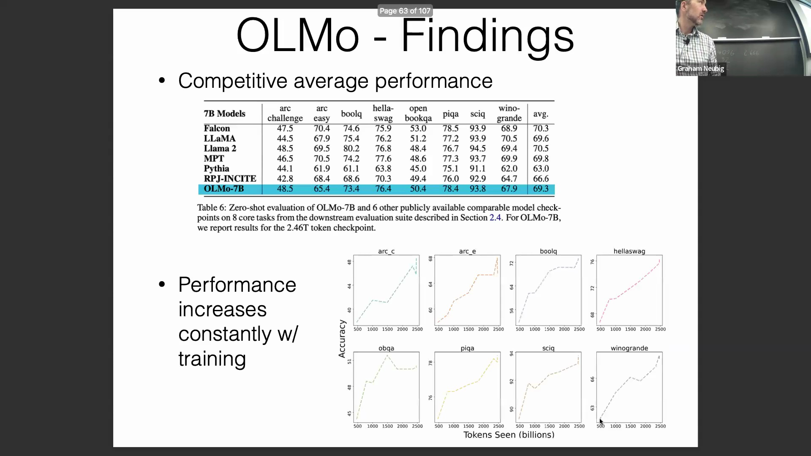

## Llama 2：开放安全性与生产就绪能力
由 Meta 开发的 Llama 2 被广泛视为当前最具竞争力的开放权重(Open Weights)大语言模型之一，提供基础预训练版(Base Model)与指令微调聊天版(Instruction-tuned Chat Model)。其核心优势在于卓越的安全对齐(Safety Alignment)能力，使其成为对风险控制要求极高的面向终端用户部署(End-user Deployment)场景中的首选方案。尽管 Mistral 等替代模型在某些原始基准测试(Raw Benchmarks)中得分略高，但 Llama 2 内置的严格安全防护机制能有效拦截不良或有害输出(Harmful Outputs)，从而为商业与公共级应用提供了更高的系统可靠性。
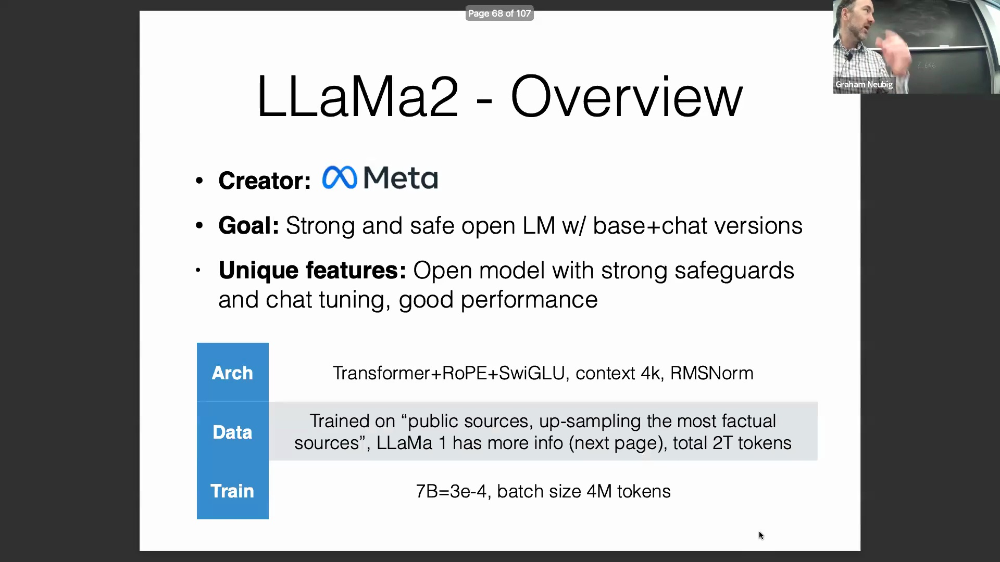

## 数据来源与轮次（Epoch）管理策略
与完全开源的模型不同，Llama 2 的确切训练数据仍属于专有(Proprietary)性质，但 Meta 披露其主要依赖公开数据源，并有针对性地采用过采样策略(Upsampling)提升事实性内容的比重。对前代 Llama 1 训练机制的分析显示，模型对维基百科、PDF 文档及书籍进行了大量过采样（最高达到 2.4 个训练轮次 Epochs），而 GitHub 等代码仓库(Code Repositories)的数据则被降采样(Downsampling)至 0.6 个轮次。采用非整数轮次反映了现代大模型训练的最佳实践：模型检查点(Checkpoints)按固定的计算步数(Steps)进行保存，而非严格受限于完整的轮次边界。这种做法不仅优化了计算效率(Computational Efficiency)，也为灵活扩展训练数据规模提供了便利。
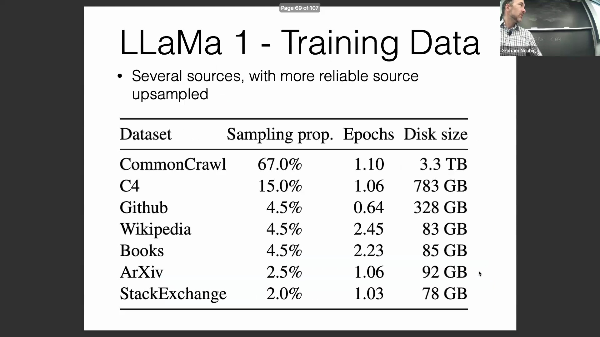
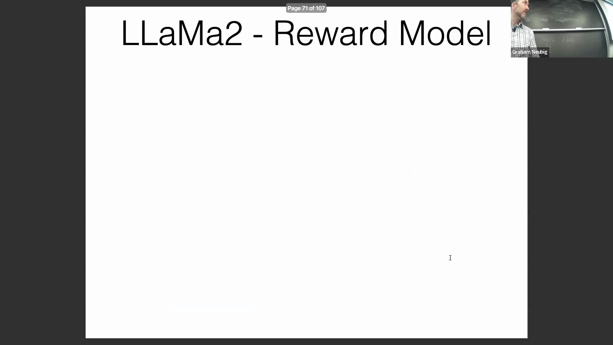

## 安全对齐与奖励建模
为规避潜在的舆论风险并确保产品安全部署，Meta 在安全对齐训练上投入了巨额计算资源。该流程高度依赖大规模人类偏好数据(Human Preference Data)的采集，以进行奖励建模(Reward Modeling)，即通过人工标注或启发式算法(Heuristic Algorithms)对模型生成的多个候选输出进行显式排序(Explicit Ranking)。该训练管线整合了多个成熟的高质量数据集，包括 Anthropic 的 Helpful/Harmless 系列、OpenAI 的 WebGPT 与 Stack Exchange 偏好对(Preference Pairs)数据，以及斯坦福大学的人类偏好数据集(Stanford Human Preferences Dataset)。这些数据集提供了至关重要的监督信号(Supervisory Signals)，使模型能够通过对齐微调(Alignment Fine-tuning)，持续生成有益(Helpful)且无害(Harmless)的文本内容。
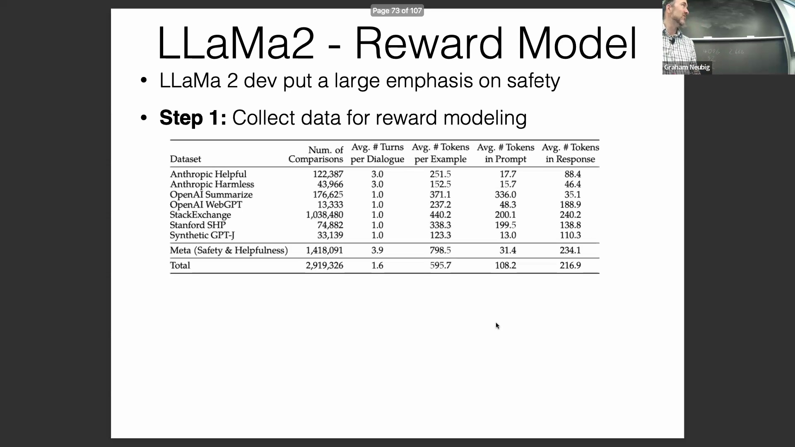