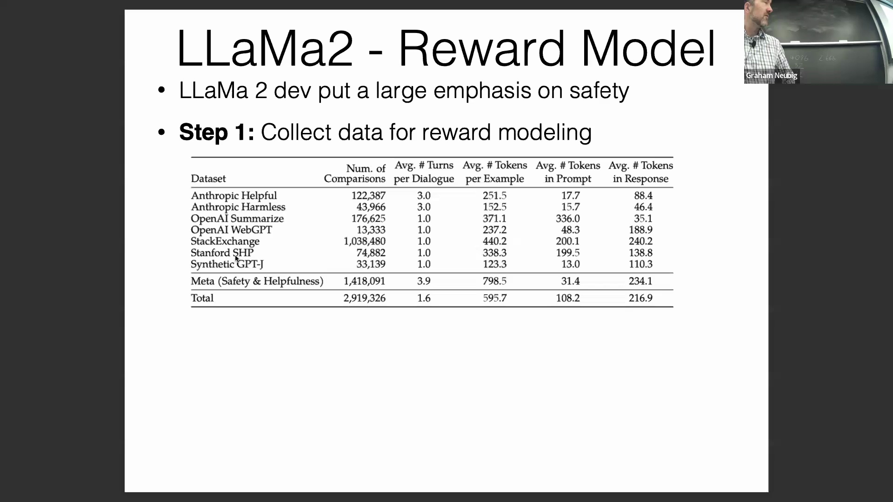
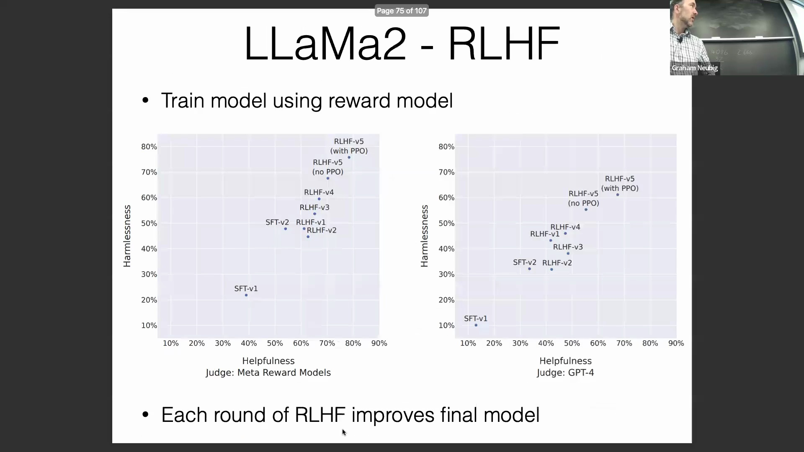
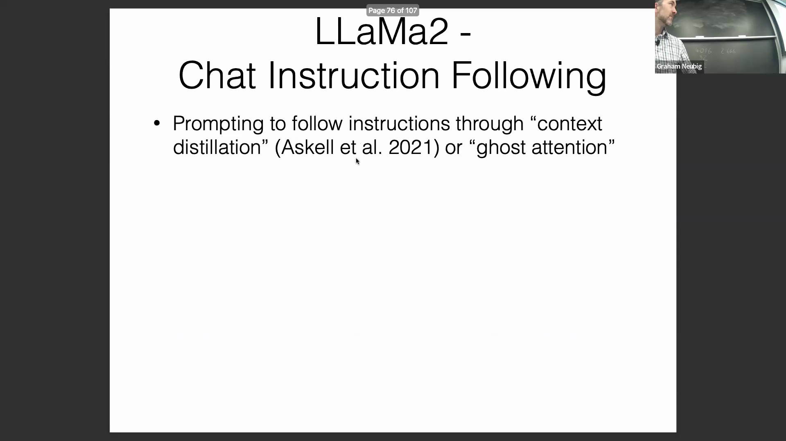
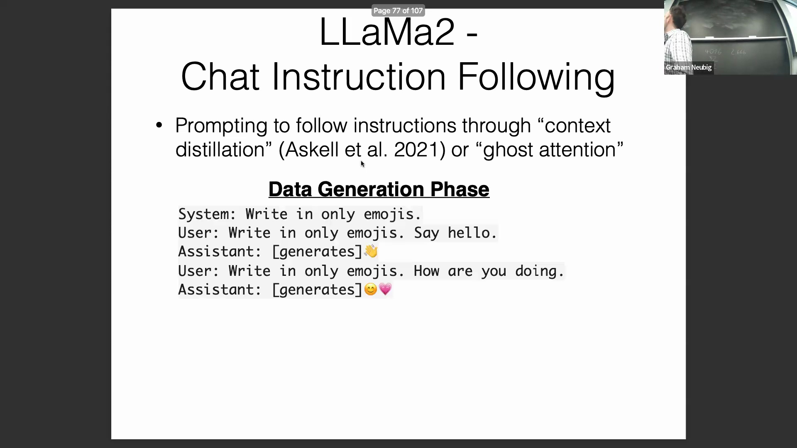
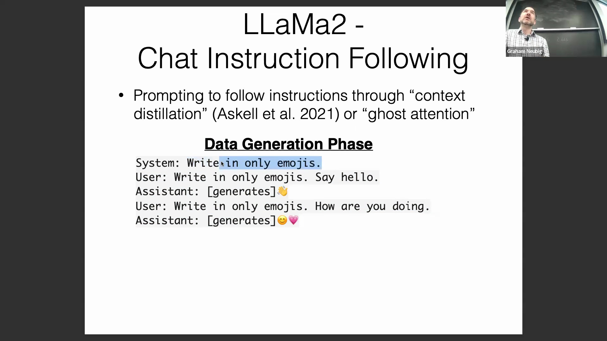
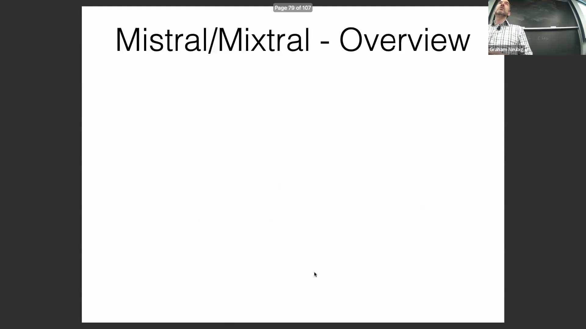
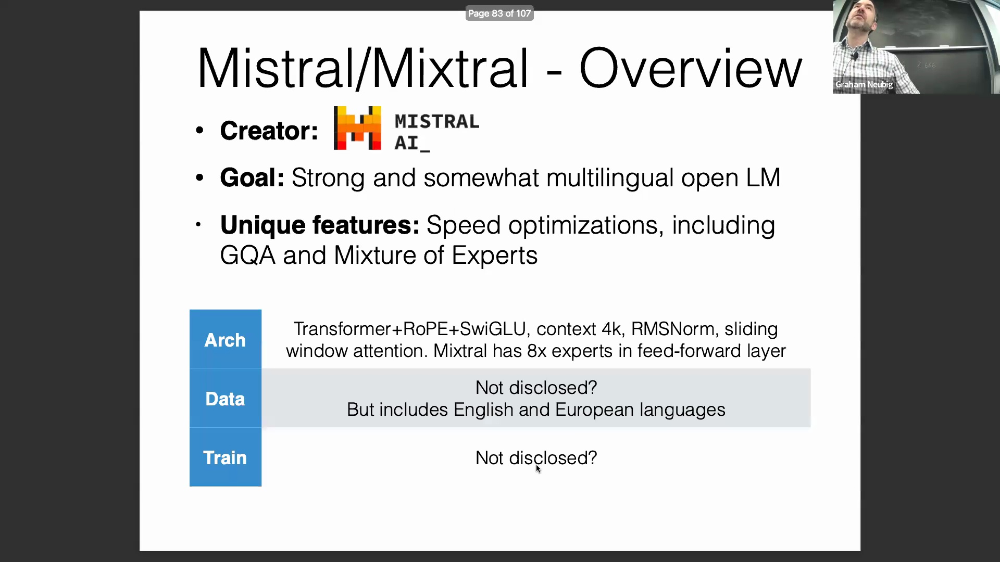
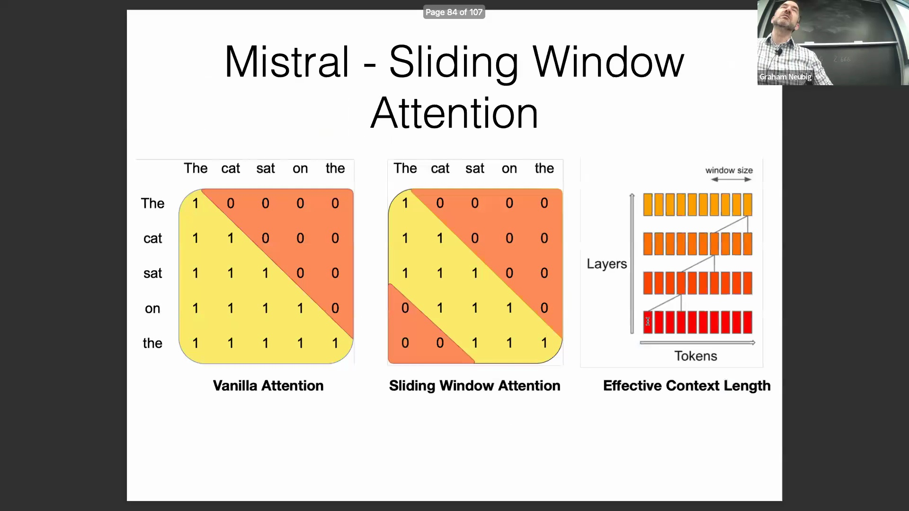
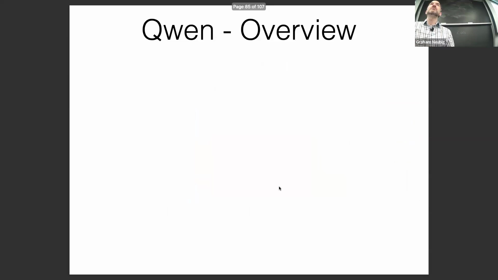

## 偏好数据收集与斯坦福 SHP 数据集
对齐过程(Alignment Process)高度依赖高质量的偏好数据(Preference Data)。斯坦福人类偏好数据集(Stanford Human Preferences Dataset, SHP)通过分析 Reddit 社区交互，提供了一种巧妙且自然的数据获取方法。该数据集专门筛选出“后发布回复获得超过先发布回复点赞”的对话实例。在默认情况下，早期发布的帖子通常会积累更多点赞，若后发回复能够反超，则表明其具备更高的内在质量与实用性。这种方法无需依赖人工标注，即可为训练偏好模型(Preference Model)提供强有力的监督信号。

## Meta 的迭代式安全数据流水线
除了利用公开基准测试(Public Benchmarks)，Meta 还收集了大量专有(Proprietary)内部数据用于微调(Fine-tuning) Llama 2。该流程具有高度迭代性(Iterative Nature)：初始模型版本部署于用户交互环境后，专门的“红队”(Red Teaming)测试人员会积极尝试突破模型限制，诱导其生成有害或不安全的内容。源自这些对抗性交互(Adversarial Interactions)的偏好数据被持续采集，并反馈至后续模型版本的训练中。随着每次迭代不断优化，“红队”攻击的难度逐渐增加，但这种闭环流程确保了模型安全边界(Safety Boundaries)的稳步拓展，使其输出更契合人类价值观与期望。

## 奖励建模：区分有益与安全的输出
训练一个奖励模型(Reward Model)，使其能够从两个同样流畅的语言模型输出中准确预测人类偏好，是一项极具挑战性的任务。目前公开可用的奖励模型（如 Open-Assistant 提供的模型）在 Anthropic 的“有益/无害”(Helpful/Harmless) 数据集等标准化基准上的准确率仅约为 67%–68%。当在 Meta 的内部专有数据上进行评估时，由于优选回复与未优选回复之间的差异极为微妙，分类难度进一步增加。为了解决模型实用性与安全风险之间固有的权衡(Trade-off)问题，Meta 开发了双奖励模型架构(Dual Reward Model Architecture)：一个专门用于评估内容的“有益性”(Helpfulness)，另一个则专注于评估“安全性”(Safety)。这种分离式设计有效规避了常见的对齐陷阱(Alignment Pitfall)，即防止模型陷入“过度保守导致功能受限”或“高度灵活但缺乏安全约束”的两难境地。

## 扩展奖励模型与增量式 RLHF 训练
奖励建模的性能在很大程度上取决于评判模型本身的容量(Model Capacity)。Meta 的研究证明，700 亿参数规模的奖励模型显著优于较小规模的变体，这证实了捕捉细微的人类偏好差异需要庞大的模型容量。该训练流程遵循增量式基于人类反馈的强化学习(Incremental Reinforcement Learning from Human Feedback, RLHF)范式：首先从监督微调(Supervised Fine-Tuning, SFT)基线模型出发，随后利用规模逐步扩充的数据集与能力不断增强的奖励模型，开展多轮强化学习(Reinforcement Learning)。迭代评估曲线显示，“有益性”与“安全性”指标均实现了显著且持续的优化，最终发布的模型版本成功在这些多维目标之间达成了有效平衡。

## 面向稳健对话与系统消息遵循的训练
对话式 AI(Conversational AI)面临的一项关键挑战是确保模型在长程交互(Long-horizon Interactions)中能够始终如一地遵循系统提示(System Prompt)中预设的指令。例如，当系统要求“仅使用表情符号回复”时，模型必须在任意长度的对话中持续遵守该约束，而未经专门训练的标准模型往往难以自发维持这种一致性。为攻克这一难题，Meta 采用了一种合成数据生成策略(Synthetic Data Generation Pipeline)。研究人员向现有模型注入严格的系统级规则（如“保持礼貌”、“用五岁儿童能理解的语言解释”或“仅使用表情符号”），并在此基础上构造多轮用户查询对话。在多轮交互中，系统提示始终固定于上下文窗口(Context Window)的起始位置，从而使模型学会生成严格遵循既定约束的回复。在该合成数据集上进行针对性训练，显著增强了模型在长对话场景中坚守并执行系统级指令(System-level Instructions)的鲁棒性。

## Mistral 与 Mixtral：架构创新与多语言侧重
将视线转向 Mistral AI 的产品线，Mistral 与 Mixtral 模型引入了显著的架构创新，核心聚焦于推理速度(Inference Speed)与计算效率(Computational Efficiency)的提升。与训练数据中英语占比高达约 85%、主要侧重英语能力的 Llama 系列不同，Mistral 在语料中深度融合了更广泛的欧洲语言，从而显著强化了其多语言处理能力(Multilingual Capabilities)。尽管完整的训练配置尚未完全公开，但这些模型凭借分组查询注意力(Grouped-Query Attention, GQA)与混合专家架构(Mixture of Experts, MoE)等关键技术脱颖而出，在保持基准测试(Benchmarks)性能不妥协的前提下，大幅提升了推理吞吐量(Throughput)与参数效率(Parameter Efficiency)。

## 滑动窗口注意力机制
Mistral 架构的一项核心创新是引入了滑动窗口注意力(Sliding Window Attention)机制。传统的全局注意力机制(Global Attention)需要计算序列中所有历史词元(Token)的关联，随着上下文长度(Context Length)的增加，其二次方计算复杂度将变得难以承受。相比之下，滑动窗口注意力将每个词元的注意力范围严格限制在一个固定大小的局部窗口内（Mistral 设定为 4,096 个词元）。随着信息在连续的 Transformer 层(Transformer Layers)中向前传播，这种局部感受野(Receptive Field)会逐层叠加与扩展，使模型能够有效捕捉并访问序列中更久远的依赖关系。该设计在几乎不增加额外训练成本或计算开销(Computational Overhead)的前提下（因为单步注意力计算复杂度保持线性恒定），显著延展了模型的有效上下文处理能力。

