## Mistral 与 Mixtral：混合专家架构与扩展上下文
Mixtral 采用混合专家(Mixture of Experts, MoE)架构，性能强劲，在众多基准测试(Benchmarks)中表现常优于 Llama 系列模型。得益于其 450 亿(45B)参数的精炼规模，其部署与推理(Inference)速度显著快于 Llama 70B。在架构设计上，该模型继承了标志性的滑动窗口注意力(Sliding Window Attention)机制。尽管基础窗口大小设定为 4,096 个词元(Tokens)，但借助基于块的处理策略(Block-based Processing)，其有效可访问的上下文长度(Context Length)被成功扩展至 8,192 个词元。通过使每个词元聚焦于相邻的前序窗口，并在连续的 Transformer 层(Transformer Layers)中逐层传播表征，模型得以高效捕获长程依赖关系(Long-range Dependencies)，同时成功规避了传统全局注意力机制(Global Attention)所引发的二次方计算复杂度(Quadratic Computational Complexity)开销。
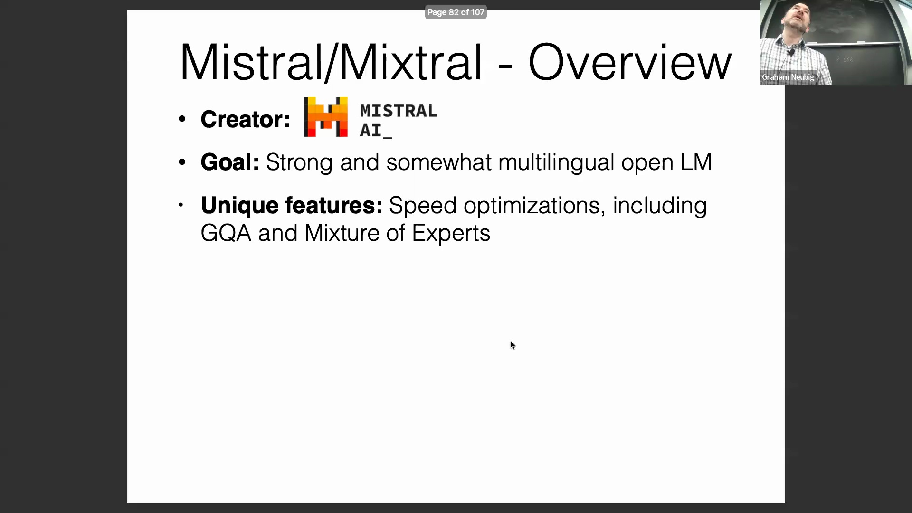
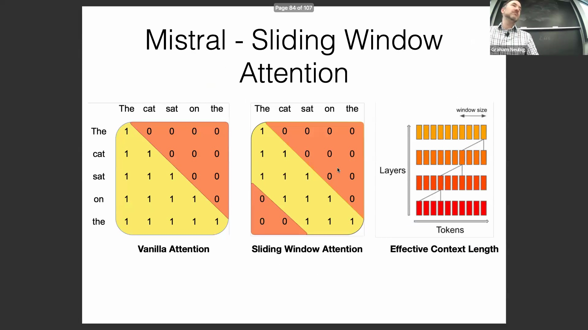

## Qwen：多语言设计与词表扩展
由阿里巴巴研发的 Qwen 是一款性能卓越的多语言基础模型(Multilingual Foundation Model)，在英语与中文任务上表现尤为突出，同时在更广泛的语种中也保持了强劲的竞争力。其架构设计的关键差异化特征在于词表(Vocabulary)的大幅扩容——词元(Tokens)数量增至 15 万，远超 Llama 的 3.2 万。这一扩展对实现高效的跨语言处理(Cross-lingual Processing)至关重要。在底层架构方面，Qwen 基本遵循标准 Transformer 设计，仅引入了注意力偏置(Attention Biases)等细微调整；其卓越的性能提升主要归功于严谨的数据工程(Data Engineering)实践，以及专门针对多语言输入优化的训练策略(Training Strategies)。

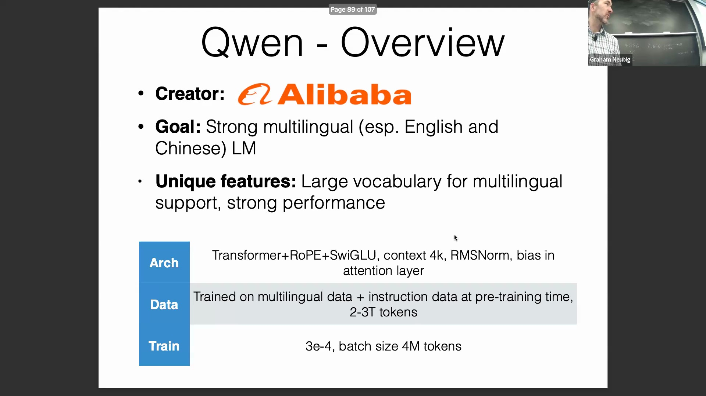

## 分词器效率与跨语言碎片化
分词策略(Tokenization Strategy)对多语言模型的运行效率具有深远影响。子词分词器(Subword Tokenizer)在处理低频语言字符时，往往会将其拆解为更小的单元，这不仅会大幅增加计算成本(Computational Cost)，还会削弱语义的连贯性。对比分析显示，相较于 XLM-R 等成熟的多语言基线模型(Multilingual Baseline Models)，Llama 的分词器在泰语、希伯来语、阿拉伯语、韩语、日语及中文等语种上，会将其切分为数量显著更多的片段；以泰语为例，Llama 产生的分词数量高达 XLM-R 的 3.7 倍。相比之下，Qwen 的分词器效率与 XLM-R 高度吻合，能够有效保留完整的语义单元，从而避免了文本的过度碎片化(Over-fragmentation)。这种优化的分词设计同样适用于代码数据的完整保留，使得 Qwen 能够更高效地处理多语言文本与编程代码数据。
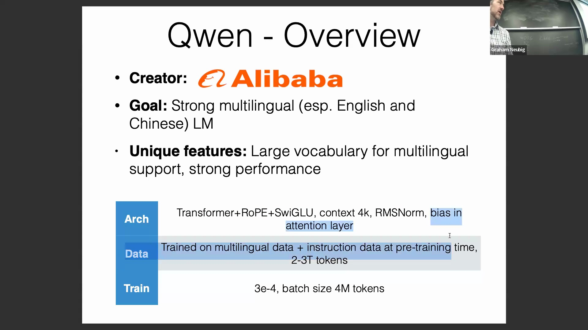
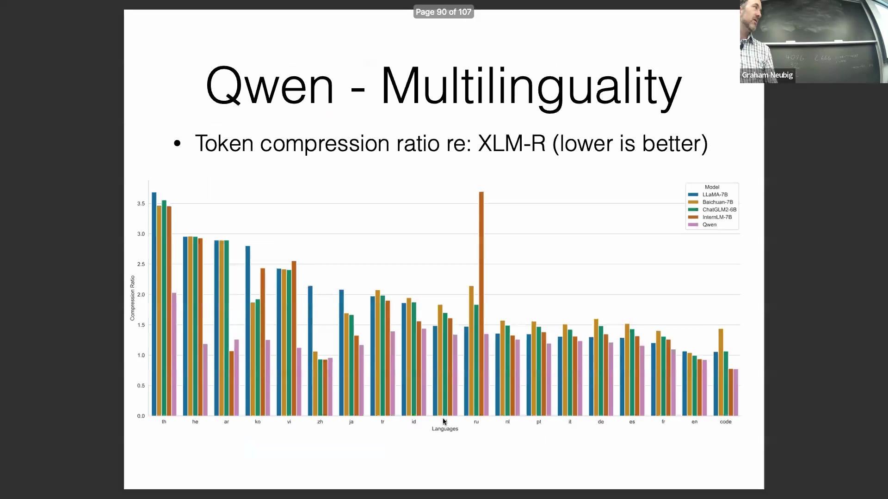
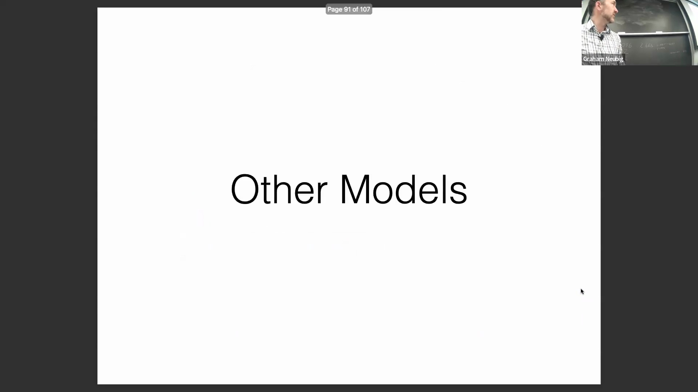

## 专用代码模型与排行榜领先地位
除通用大语言模型外，当前 AI 生态中还涌现出大量针对特定领域高度优化的专用模型(Domain-specific Models)。尽管现代通用大语言模型普遍已引入代码数据以强化逻辑推理(Logical Reasoning)能力并满足广泛的工业级应用需求，但仍有一批模型专为编程任务(Programming Tasks)而设计。其中，StarCoder2 延续了类似 Pythia 的完全开源与高可复现性(Fully Open-source and Highly Reproducible)研究范式；Meta 推出的 Code Llama 实现了对 Llama 架构的稳健适配(Robust Adaptation)；而 DeepSeek Coder 则在多项编程基准测试(Programming Benchmarks)中持续保持领先。这三款模型均代表了当前最先进的代码生成能力(State-of-the-art Code Generation Capabilities)，关于其底层架构的更深层次技术评估(Advanced Technical Evaluation)将留待后续专业课程中详细展开。
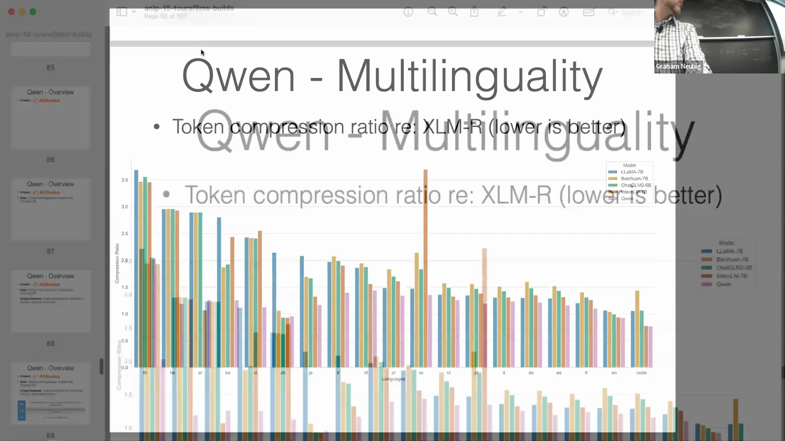
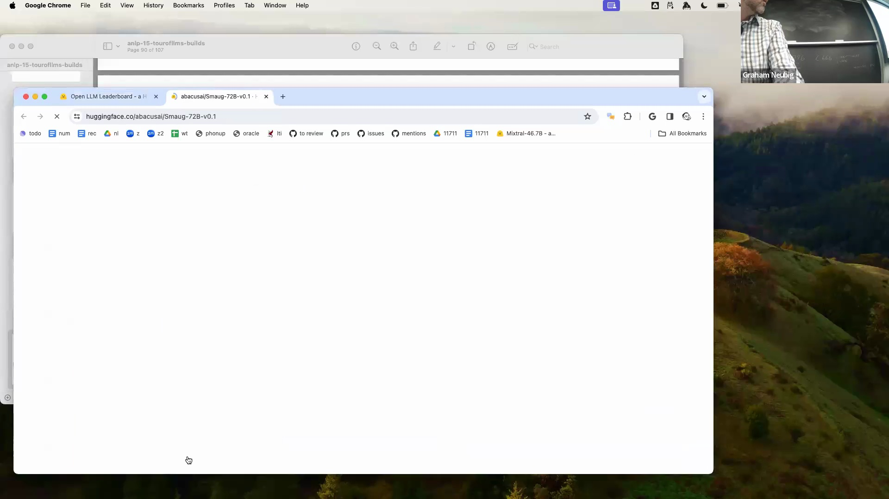
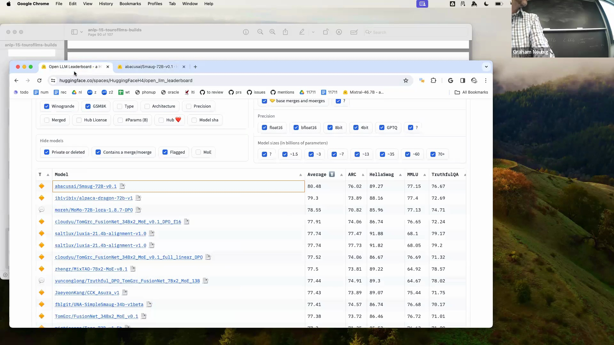
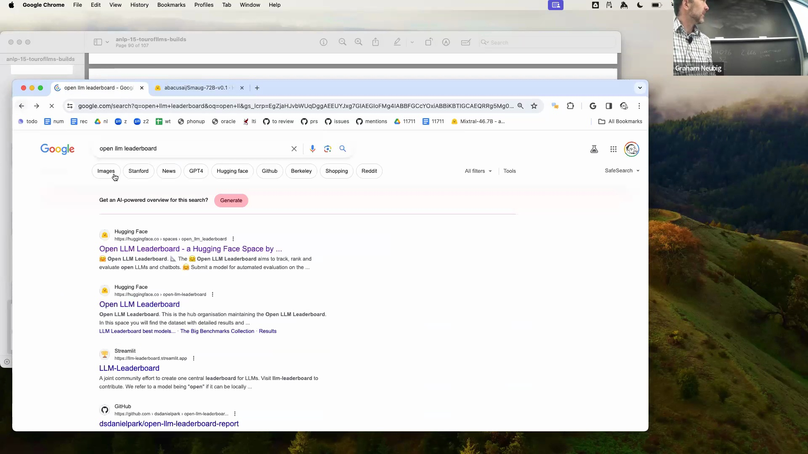
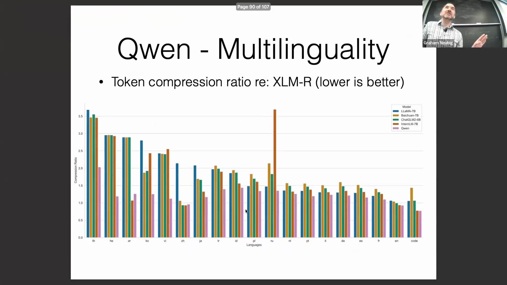

## 数学推理与开放研究模型
标准大语言模型在处理复杂数学推理(Complex Mathematical Reasoning)任务时往往面临显著瓶颈，这促使研究团队开发出专门针对数学数据集、符号演算(Symbolic Computation)及结构化问题求解(Structured Problem-solving)格式进行训练的专用架构。EleutherAI 为此领域贡献了 Lemma 模型，该模型完全开源，并透明公开了全部训练数据、流程细节与中间检查点(Model Checkpoints)。这种对可复现性(Reproducibility)的坚定承诺，与更广泛的开放科学探索方向高度契合。其核心目的在于深入探究：如何通过目标导向的数据构建(Goal-oriented Data Curation)、领域专用分词器(Domain-specific Tokenizer)以及严谨的训练策略(Training Strategies)，系统性地克服通用大语言模型在数学与逻辑推演领域的固有局限(Inherent Limitations)。
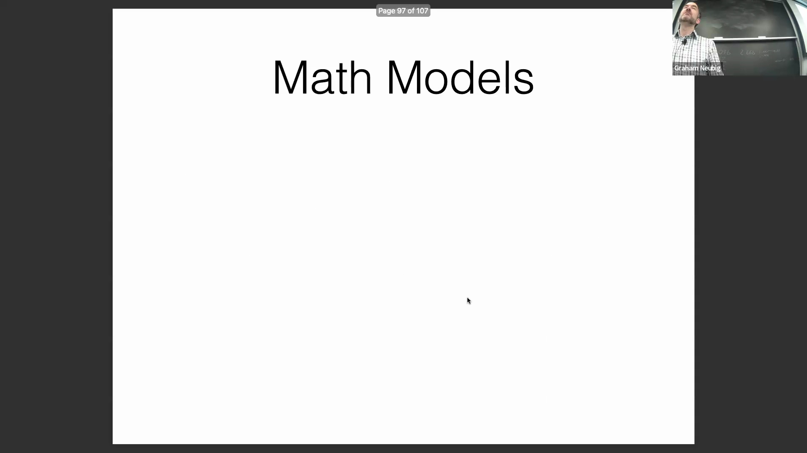