## 闭源模型竞争对手与多模态能力
讲座从 GPT-4 的工具调用(Function Calling)演示，自然过渡到其在闭源专有领域的主要竞争对手：Google 的 Gemini 与 Anthropic 的 Claude。Gemini 推出了 Pro 和 Ultra 版本，其核心差异化优势在于超大的上下文窗口(Context Window)（最高支持 100 万词元(Tokens)），以及卓越的原生视频理解与图像生成能力。同样，Claude 3 提供了 20 万词元的上下文窗口与出色的多模态图像处理能力，使其在推理准确性(Reasoning Accuracy)与实际效用(Utility)方面成为 GPT-4 的直接竞品。这些模型的演进凸显出整个行业正快速向海量上下文处理(Massive Context Processing)与无缝跨模态交互(Cross-modal Interaction)方向迈进。
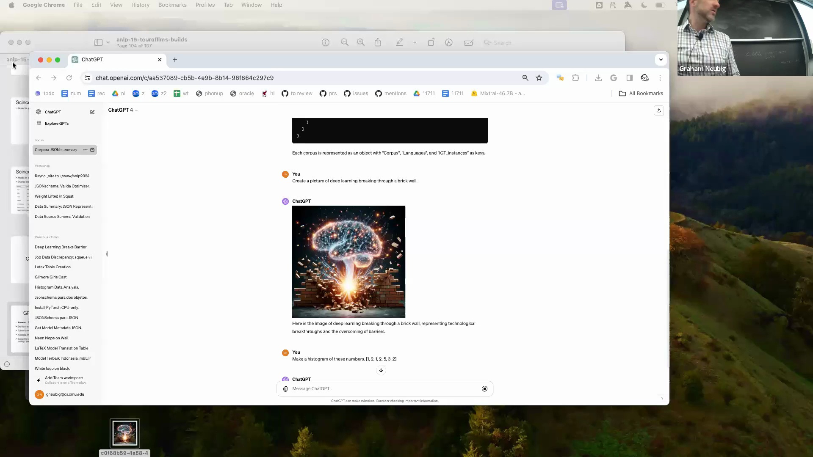
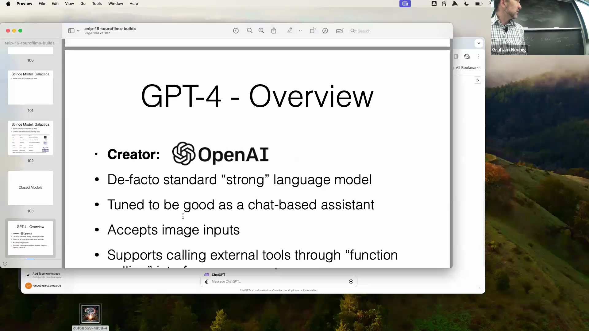
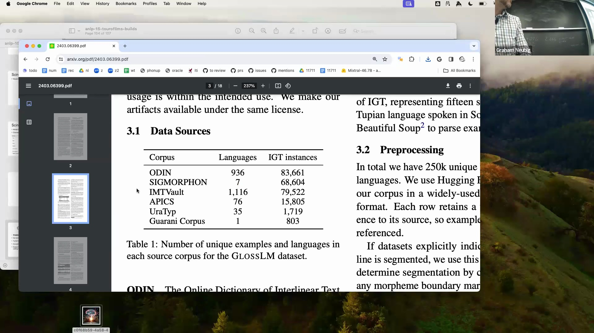
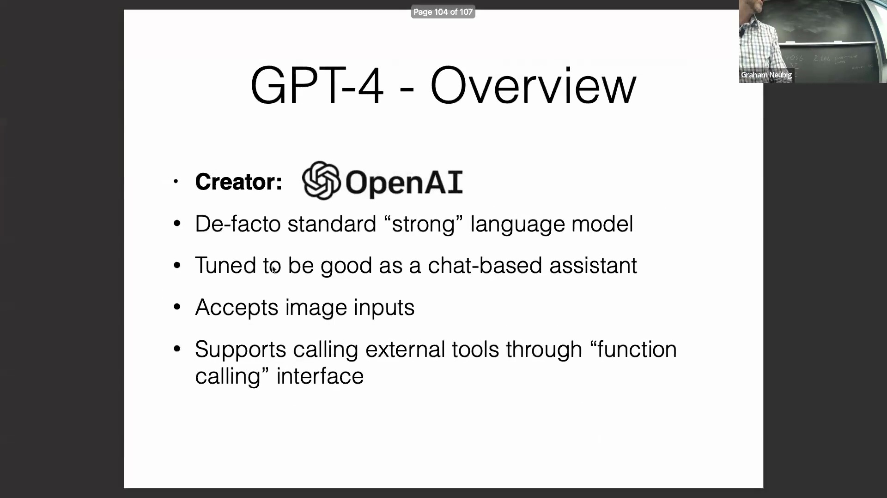

## 弥合差距：开源模型与并排评估工具
当前人工智能(Artificial Intelligence, AI)发展的核心焦点之一，是弥合透明开放权重(Open Weights)模型与高度优化的闭源系统之间的性能差距。为在日益碎片化的模型生态中简化评估流程，“God Mode”等多模型并行聊天界面工具应运而生。此类工具允许用户向多个模型同时输入相同的提示词(Prompts)，从而即时提供在推理深度、格式遵循能力与响应速度方面的并排定性对比(Side-by-side Qualitative Comparison)。对于需在决定集成特定应用程序接口(Application Programming Interface, API)前评估模型实际对话行为(Conversational Behavior)的研究人员与开发者而言，强烈推荐采用这种交互式评估方法。
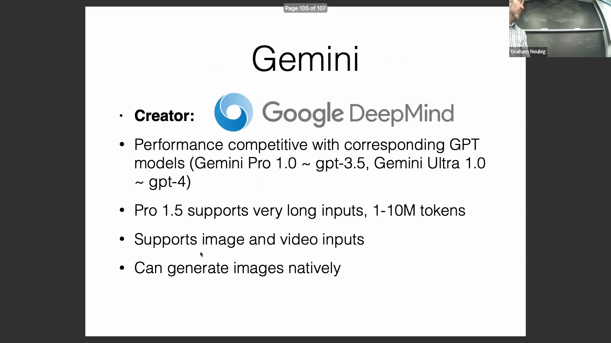

## 对基准测试方法的批判性分析
演讲者强烈警告业界勿盲目采信已发布的基准测试(Benchmarks)数据表格，并以 Google 的 Gemini 论文为例，指出其中存在的方法学差异(Methodological Discrepancies)会严重扭曲评估结果。对比评估常受困于提示工程策略的不一致。例如，对新模型采用“32 次生成择优采样”(Best-of-32 Sampling)策略，却直接将其与竞争对手的单次生成(Single-generation)基线进行对比。此外，对比所用的基线分数(Baseline Scores)往往直接引用自过时的学术论文，而非反映当前在线 API 部署的实际性能。此类不一致性会人为夸大模型的性能提升(Performance Gains)，进而掩盖真实的行业竞争格局。

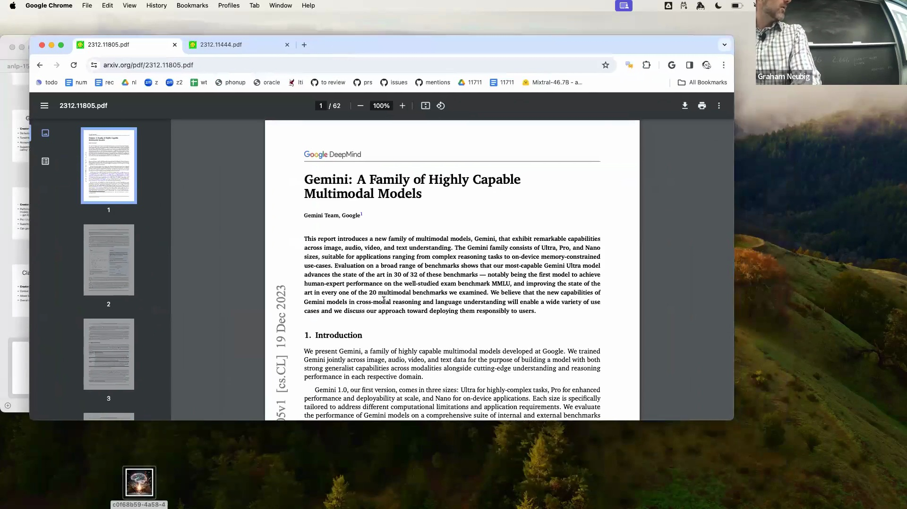
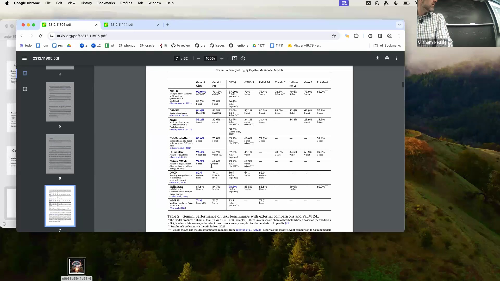
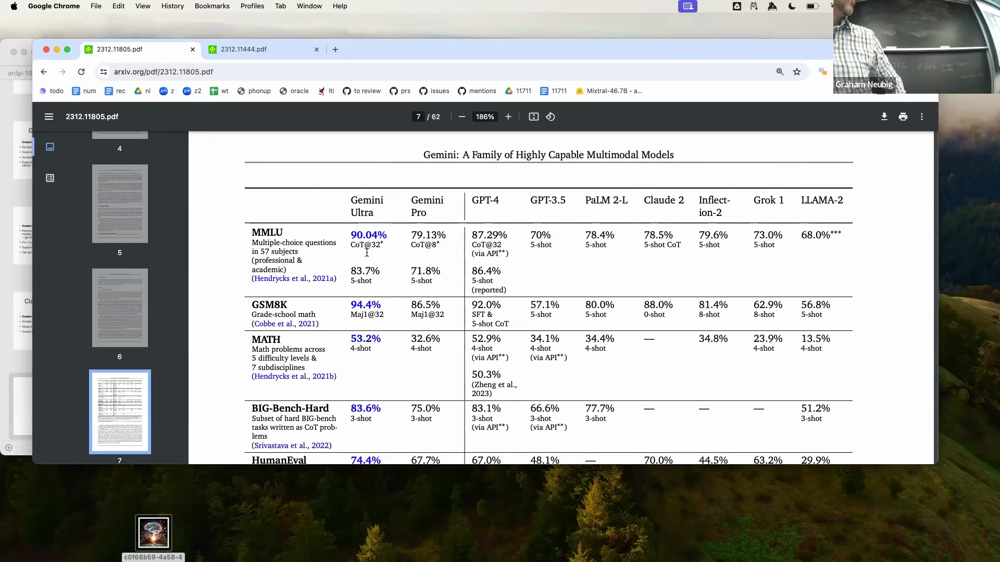

## 应对 API 漂移与标准化评估框架
除提示策略不一致外，闭源模型的 API 还会经历持续且未公开记录的静默更新(Silent Updates)，从而迅速改变模型的性能基线。例如，独立测试显示，GPT-3.5 Turbo 在 HumanEval 基准(Benchmark)上的得分，在最初发布的研究论文与后续 API 部署之间跃升了近 30 分，在同等测试条件下，其表现甚至偶尔超越更新的模型。此外，现代模型内置的严格安全过滤机制(Safety Filtering Mechanisms)可能会拦截标准化的评估提示(Evaluation Prompts)，迫使研究人员采取规避策略，进一步增加了公平对比的复杂度。鉴于上述变量，最可靠的评估策略是将定性的人工测评与严格的自动化评估框架(Automated Evaluation Framework)相结合。EleutherAI Evaluation Harness 等开源工具为模型提供了可复现的多任务基准测试(Multi-task Benchmarks)，确保架构与技术选型由实证数据(Empirical Data)驱动，而非受制于营销宣传指标。
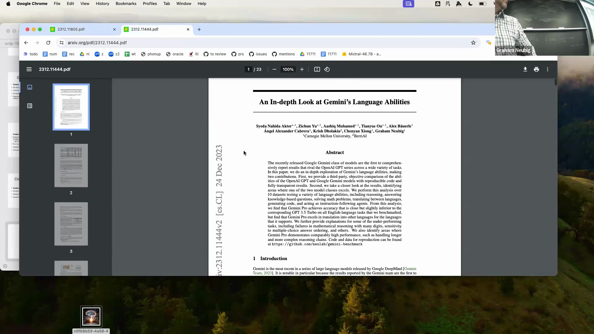
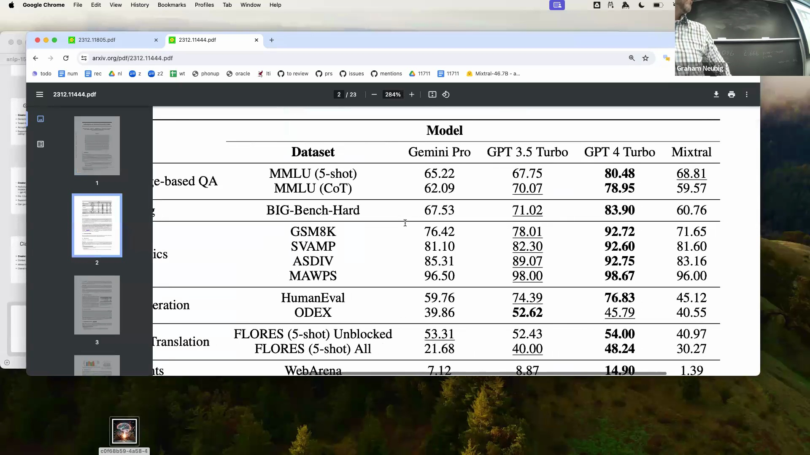
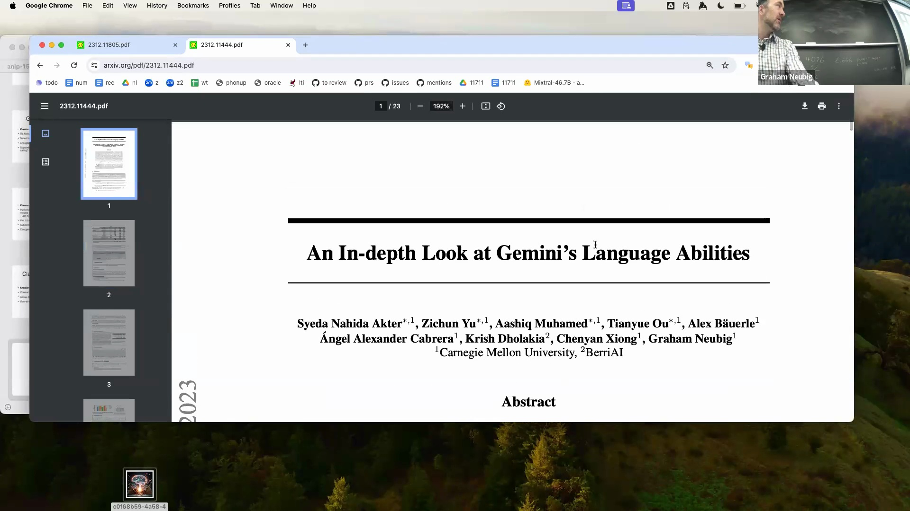
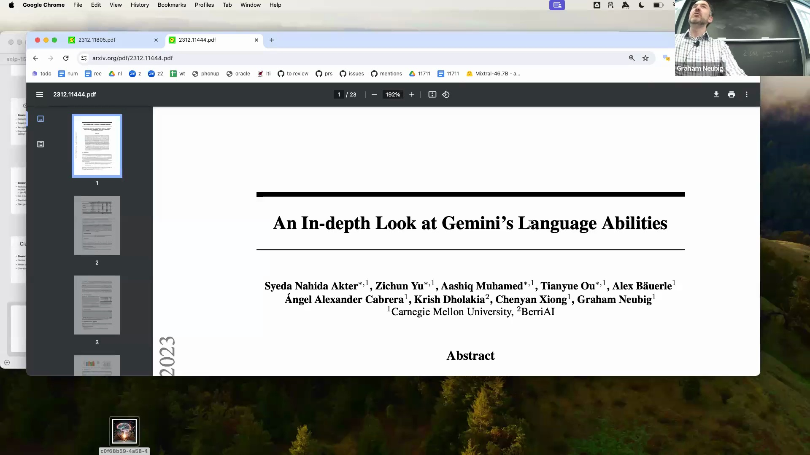
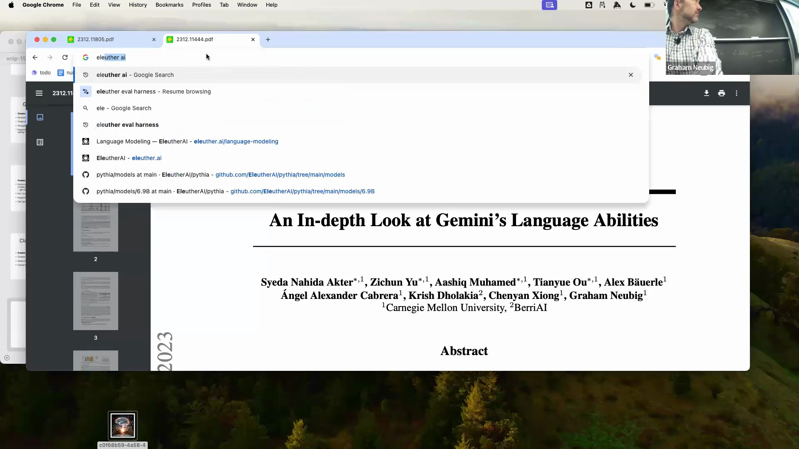

