## 课程介绍与主题概述
那么，我们正式开始吧。今天我将讲解代码生成(Code Generation)。这是我长期深耕的研究课题，我个人对此抱有极大的热情。如今，该技术已具备极高的实用价值，这令人振奋。因此，我将分享该领域当前的基础知识与前沿进展。
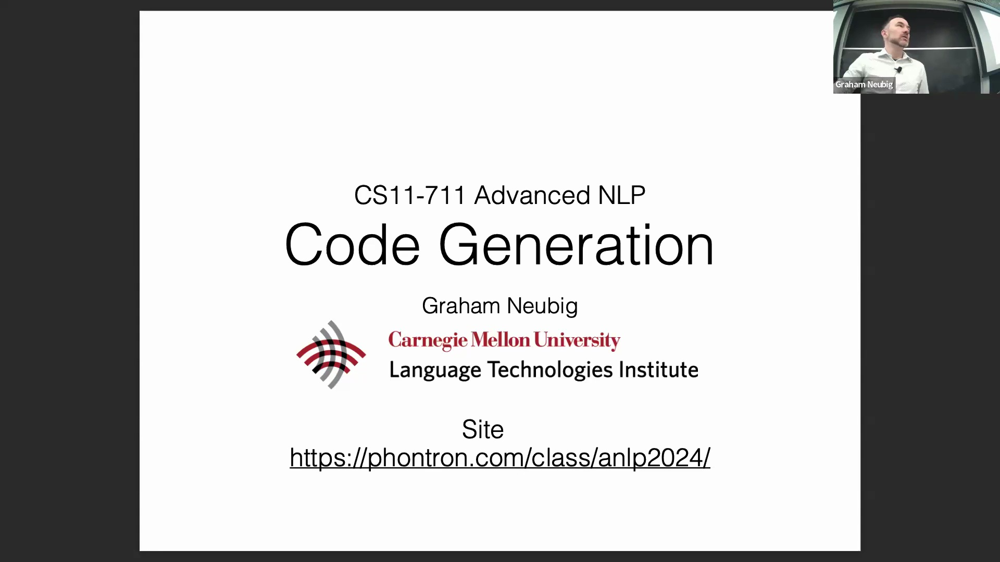

## 课程结构与任务特定框架
在深入探讨代码生成之前，我想先作简要说明：在后续约四节课程中，我将围绕具体任务展开讲解。而在此之前的课程，我主要侧重于通用理论，未过多涉及特定任务。我知道，大家未必对接下来讲座中涉及的四个任务都感兴趣，但我会全面覆盖不同任务的关键维度。即使你对本次讲解的任务不感兴趣，也希望能将本讲座采用的分析框架迁移至你自身关注的任务中。

具体而言，我将围绕以下几个核心问题展开：任务目标是什么？任务如何执行？其重要性体现在哪里？我们可以使用哪些数据集进行模型的训练或测试？评估指标有哪些？以及如何从人工与自动两个维度评估模型表现？最后是模型与架构，即我们采用的具体解决方案。

## 代码生成：目标与动机
关于代码生成，首先我来概述其核心目标。简而言之，该任务旨在生成可执行代码，作为程序员与计算机交互的接口。实现这一目标的方式多种多样。我们为何要致力于此？首先，软件工程(Software Engineering)至关重要，而代码生成能够显著提升软件开发效率。如今，该技术已具备极高的实用性，相信在座各位可能已在使用各类代码生成工具来优化工作流。若你尚未尝试，我强烈建议体验一下，它确实极具价值。此外，它还能实现让模型调用外部工具等功能。即便你不专注于软件开发领域，这些能力同样大有裨益。不过，关于工具调用的细节，我计划在后续讲解 LMAGen 时再深入展开，本次将不再赘述。

此外，我补充一点（后续课程也会详细讲解）：即便你本人不编写代码，使用代码数据进行模型训练也已被证实能有效提升模型性能，尤其是在攻克复杂的多步推理(Multi-step Reasoning)任务方面。这也是值得大家关注代码数据的另一重原因。本次讲座，我将主要聚焦于第一点（加速开发），其余两点将在后续课程中详细探讨。

## 代码生成的输入规范
具体到该任务，模型的输入是对目标功能的规范说明，输出则是生成的代码。那么，在编写程序前，你会如何描述待实现的功能？开发者通常能提供哪些规范？例如，函数的输入与输出是什么？（同学回答）是的，补充一下，更准确地说是函数的输入与输出类型。以 Python 为例，这对应着类型注解(Type Annotations)。这一点非常好，虽然未列在我的清单中，但确实切中要害。还有其他方面吗？（同学回答）是的，还包括复杂度要求与约束条件(Complexity Requirements and Constraints)，这点也在我的清单上，非常准确。那么，有没有更直观的输入形式呢？

例如，“我想做一个支持披萨订购功能的网页界面。”这是一种典型的自然语言描述。
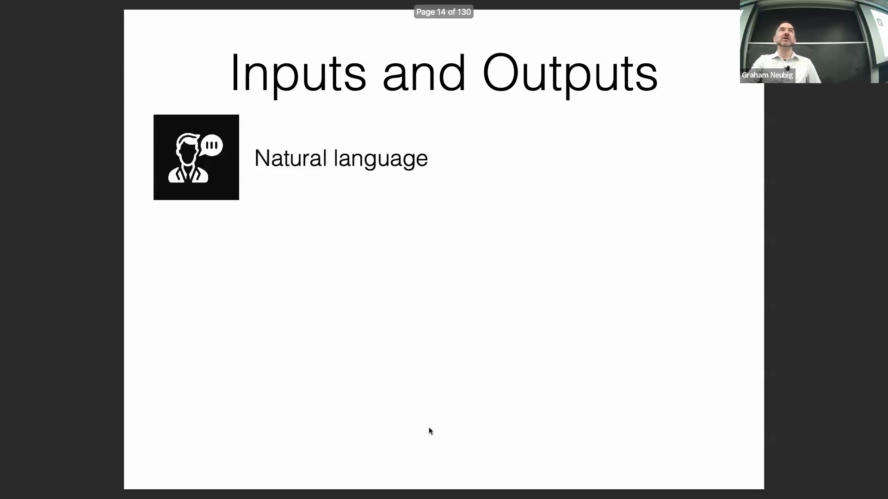
还有其他想法吗？（同学回答）是的，“这是我现有的代码，这是我期望修改后的样子。”没错。这在重构或扩展现有程序时尤为常见，也正是我清单上的下一项。非常棒的见解。还有其他形式吗？例如多模态输入(Multimodal Input)：我可能会说“我需要一个披萨订购应用”，并附上一张界面草图，图中包含用户名输入框、设置按钮、菜单展示区以及支付方式选择等。人类程序员在日常开发中也会采用这种模式。直到近期，我们才真正具备让模型有效处理此类多模态输入的能力。没错，这正好对应我清单中的第四点。

此外，输入输出还可以采用其他形式，例如以单元测试(Unit Tests)的形式提供：“给定此输入，期望得到此输出。”这些方法在人类程序员与代码生成模型中均被广泛采用。
我个人尤为推崇另外两种规范：其一是类型注解，它是日常编码中的标准实践，而代码生成模型尤为擅长利用类型信息进行推理；其二是约束条件，例如对执行效率的硬性要求，或指定必须依赖的第三方库。这些均可作为补充规范输入给模型。
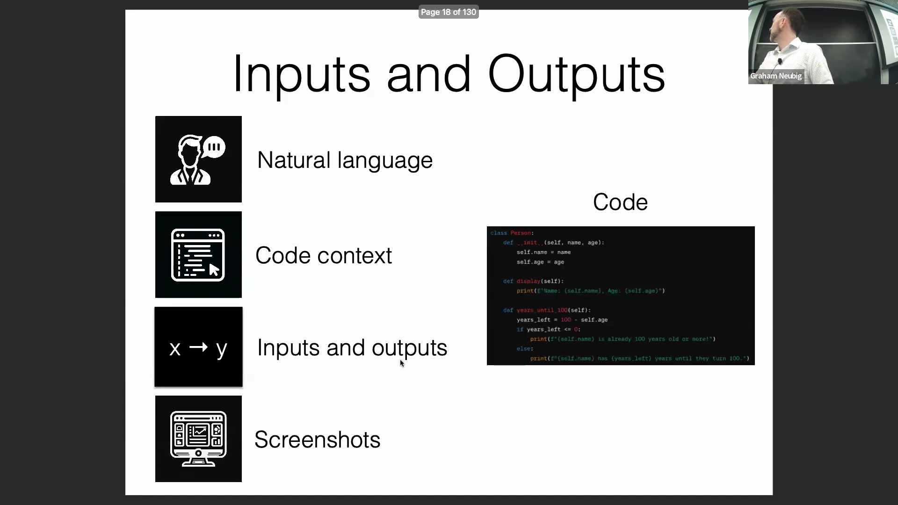
（注：幻灯片虽未单独列出，但）自然语言描述(Natural Language Description)本身即可作为独立输入，模型将据此输出目标代码。

## 观众使用情况与编程辅助工具
现场有多少人正在使用 GitHub Copilot？比例大概是多少？看起来约有一半。除了 GitHub 系列，还有多少人使用其他编程辅助工具？例如 GPT-4？GPT-4 确实也可作为编程辅助工具，但我此处更倾向于指代深度集成在集成开发环境(Integrated Development Environment, IDE)中的工具。还有人使用其他工具吗？比如 Cursor？看来目前无人使用。还有 Collab AI 等。是的，可见此类工具目前种类繁多。我个人主要使用 Copilot，尚未尝试 Cursor。但我确实频繁使用 GPT-4，稍后我将演示我是如何将其应用于不同场景的。
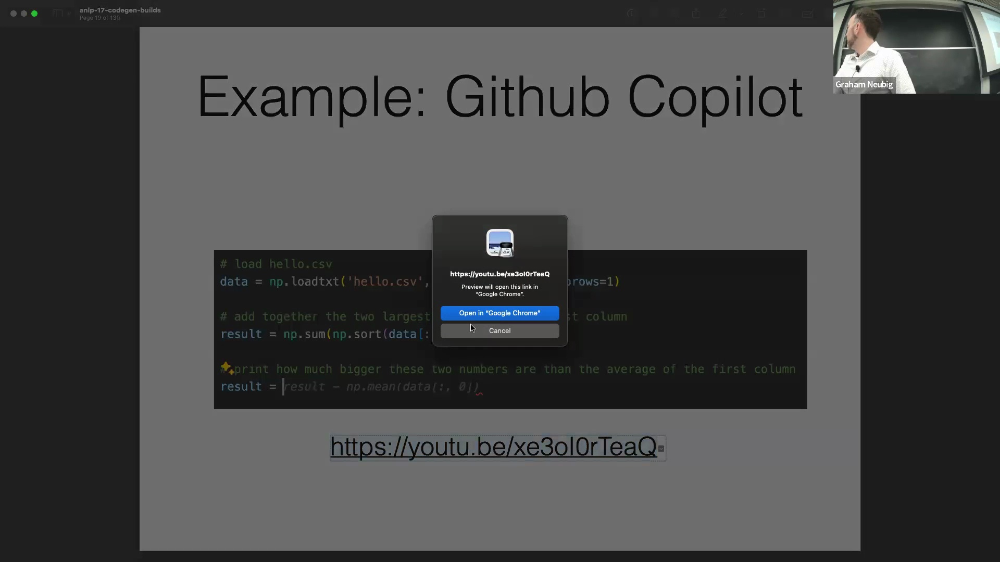

## 实际演示：GitHub Copilot
若你尚未体验过 Copilot，希望这段演示视频能正常播放。我刚录制了一段简短的操作视频……看来视频无法播放。不过没关系，其核心逻辑很简单：你只需输入提示，模型便会自动补全代码。以此处为例，实际上代码并非由我逐行编写，我仅添加了注释，模型便自动生成了完整逻辑。需要说明的是，我并未对生成代码进行严格验证，若存在潜在错误，责任在我。但就我的测试而言，该代码可正常运行。另外补充一点，使用 CMU 邮箱账户可免费开通 Copilot。若你希望零成本体验该工具，这无疑是个绝佳机会。
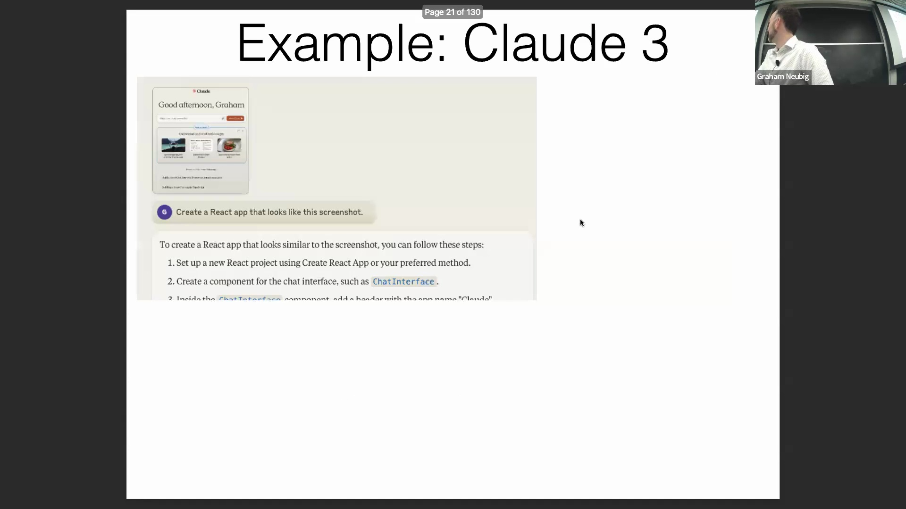

## 实际演示：多模态模型与迭代开发
另一个典型案例涉及 GPT-4 或近期的 Claude 3 等大语言模型(Large Language Model, LLM)。它们能够胜任多种复杂任务。如前所述，我们曾提及截图输入。我将一张界面截图输入 Claude，并要求其生成一个可还原该界面的 React 应用。随后，模型返回了一长段代码文本。
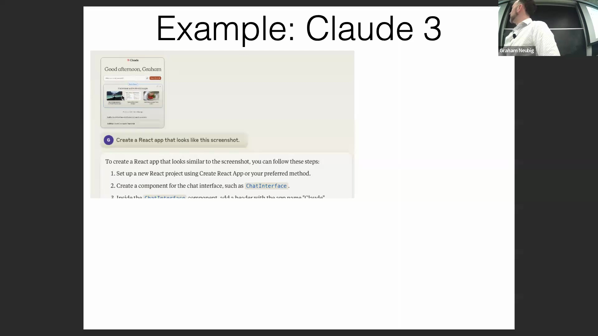
接着，模型开始构建页面容器。在此过程中，它实际上跳过了部分样式细节。这主要是因为大语言模型通常被配置了最大输出长度限制。若要求模型生成耗时极长的完整项目，持续编译并输出超长文本将带来极高的算力与推理成本。因此，服务商通常会将单次输出限制在约一千个词元(Token)左右。
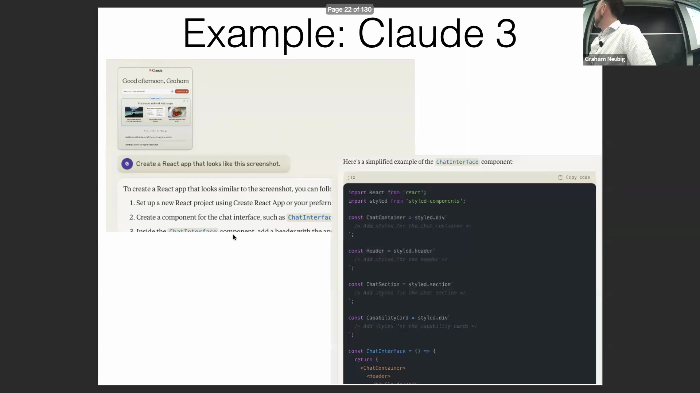
因此，模型实际上无法一次性生成整个完整项目。但通过迭代式引导(Iterative Prompting)，例如指示“先实现这部分，接着处理那部分，再补充剩余模块”，我们便能逐步构建出相当出色的应用。接下来，我尝试为大家展示一个具体示例。由于我具备一定的……
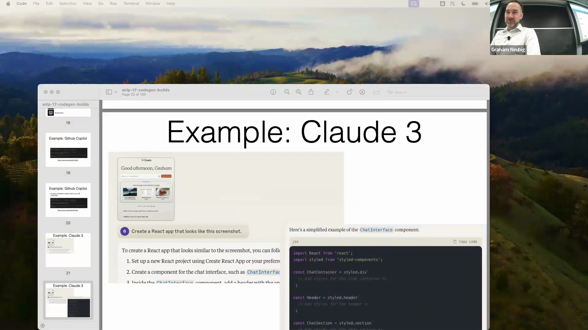

---

## AI辅助前端开发体验

演讲者分享了近期参与开发一款开源辅助编码应用的经验。尽管演讲者仅掌握基础的 React(React) 知识，但在构建该应用时高度依赖 AI 模型(AI Models)。最初的提示词(Prompt)非常直接：创建一个包含左侧聊天窗口(Chat Window)与右侧三个面板——终端(Terminal)、规划器(Planner)和代码编辑器(Code Editor)的布局。 
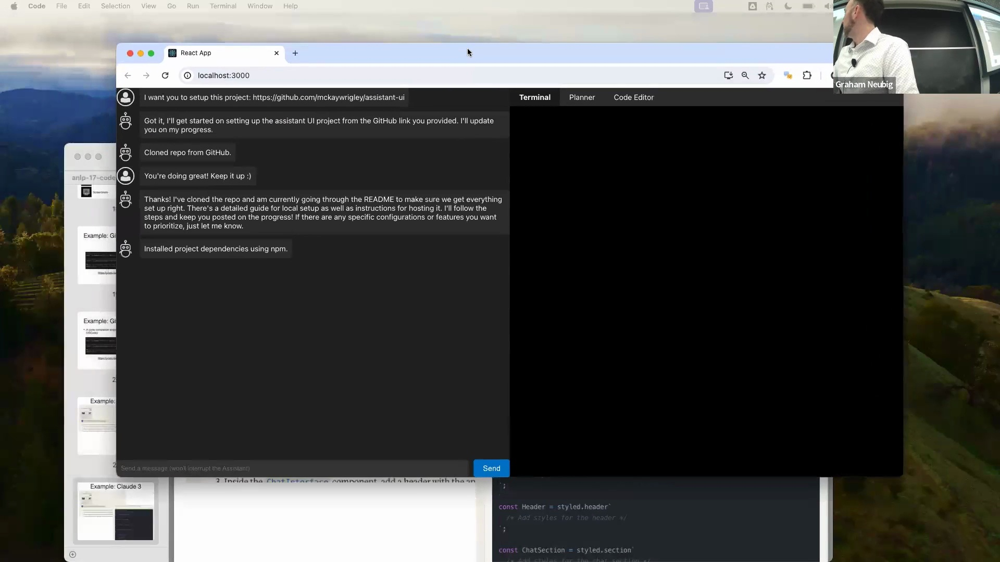
AI 生成的初始版本略显粗糙，因此演讲者要求进行一些基础的用户界面(User Interface, UI)调整，例如将背景改为黑色，并更新层叠样式表(CSS)文件以添加用于区分用户和机器人的图标。 
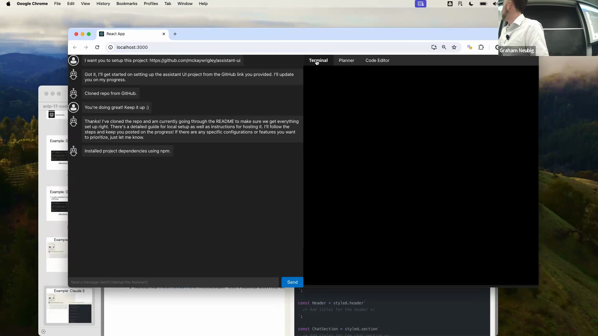
值得注意的是，演讲者亲自编写的代码仅占约 1%，但 AI 成功完成了这些结构与样式任务。这表明，即便是不擅长前端(Frontend)开发的程序员也能快速生成可用的界面；当然，专业的前端工程师自然能够打造出更为精致的设计。
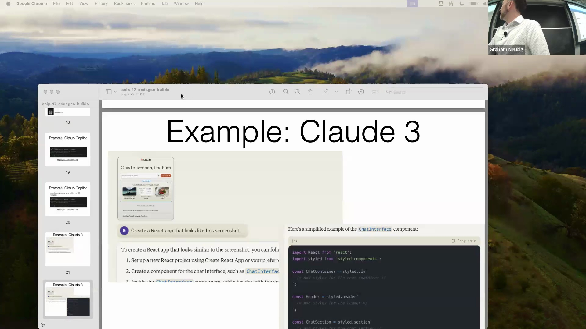
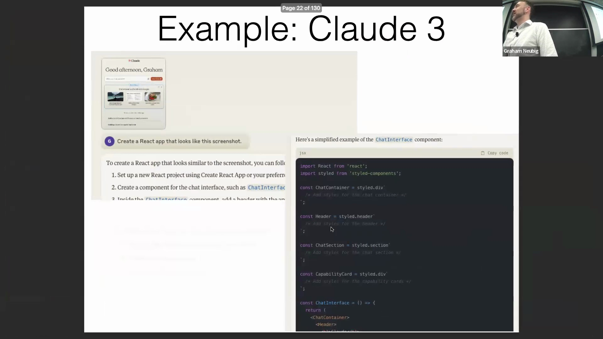

## 工具对比：GitHub Copilot 与大语言模型
演讲者强调，GitHub Copilot 与 Claude 或 GPT-4 等大语言模型(Large Language Models, LLMs)有着截然不同的应用场景。GitHub Copilot 针对代码补全(Code Completion)进行了优化，擅长处理简短且熟悉的任务，能够有效预测开发者即将输入的下一行代码。 
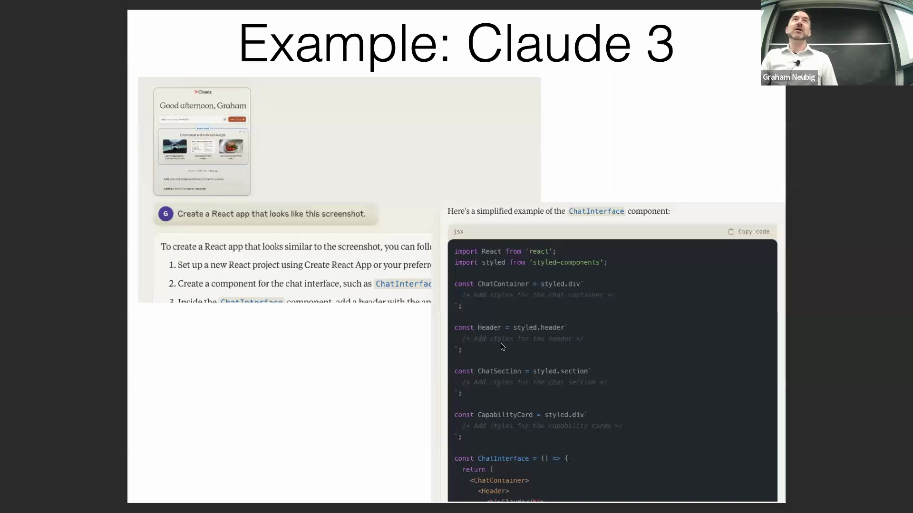
相比之下，大语言模型更适合长篇幅的代码生成，例如构建完整的类(Class)或整个 Web 应用程序(Web Application)。当开发者使用熟悉的编程语言、需要进行细粒度控制并快速填充代码时，Copilot 表现高效。反之，在使用不熟悉的语言进行编程时，大语言模型则更具优势，因为它们能够从零开始起草具备完整功能的程序。 
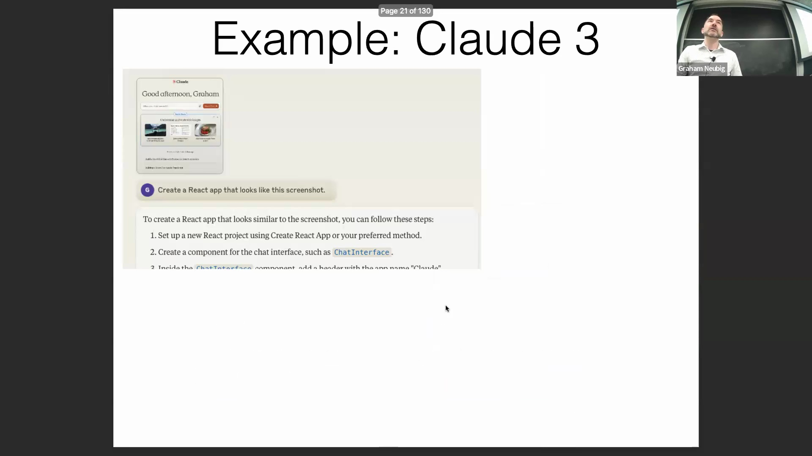
此外，Copilot 需要极低的延迟(Latency)以匹配人类打字与思考的速度。而在交互式使用的大语言模型中，延迟则相对不那么关键；开发者可以输入提示词生成一个 Web 应用后暂时离开，待返回时即可查看完整生成的结果，整个过程不会造成工作流中断。
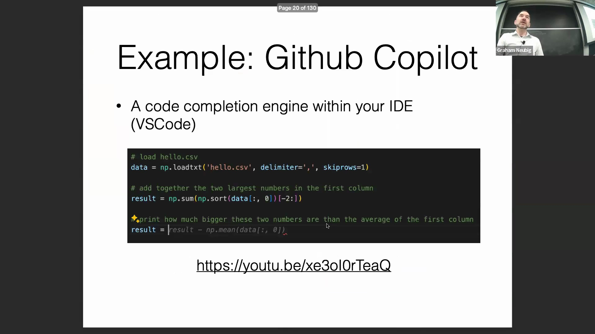

## 调试能力与开发者问答
在回答有关代码调试(Code Debugging)的问题时，演讲者指出团队尚未针对该用例对 Copilot 进行大量测试，并且在实践中更倾向于使用 Claude 或 GPT-4 等大语言模型。 
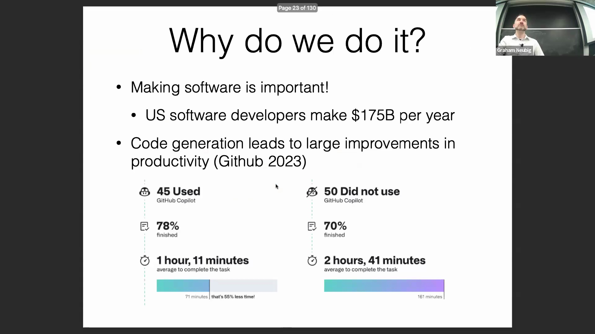
这种偏好源于底层架构设计：Copilot 采用了为速度优化的较小规模模型(Small Models)，这在一定程度上限制了其深度推理(Deep Reasoning)能力。代码调试通常需要对代码库(Codebase)进行全面、整体的理解。虽然 Copilot 足以应付基础的代码修复，但在处理复杂缺陷(Bugs)或涉及多个文件的跨模块问题时可能会力不从心。演讲者建议可以尝试使用该工具，但对于需要全局理解的复杂任务，仍推荐依赖参数量更大、能力更强的模型。
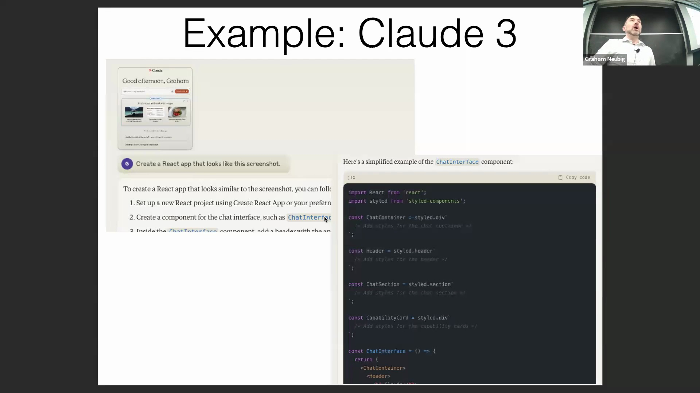

## 生产力提升与代码生成的经济价值
演讲者引用了一项 GitHub 的研究报告，以解释代码生成(Code Generation)技术为何引发广泛关注。软件开发是一项高价值产业，开发者群体的年总收入高达约 1750 亿美元，凸显了其巨大的经济影响力，因此加速开发流程将带来极高的投资回报。该研究将开发者随机分为使用 Copilot 与未使用两组，并分配相同的编程任务。结果显示，使用 Copilot 的开发者任务完成率提升了 8%，所耗时间仅为对照组的 40%（即节省了 55% 的时间）。对于 AI 辅助编程(AI-Assisted Programming)而言，这种生产力的大幅提升既令人瞩目也在意料之中。此外，这类工具在生成文档字符串(Docstrings)方面表现高效，能够显著简化技术文档的编写流程。
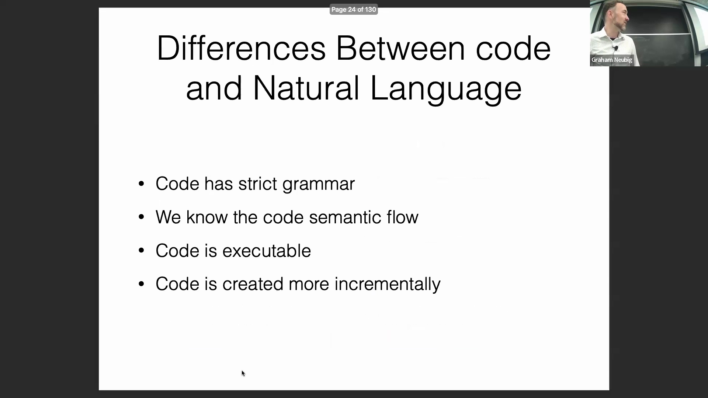

## 代码与自然语言的根本区别
代码与自然语言(Natural Language)之间的几项关键差异直接影响了 AI 编程模型的设计范式。首先，代码遵循严格的语法规则(Syntax Rules)；微小的语法错误通常会导致程序崩溃(Crash)，因此代码必须具备自然语言所不要求的高精确度。其次，代码具有明确的语义流(Semantic Flow)，变量与数据结构在程序执行期间会以可预测、可追踪的方式进行交互。第三，代码具备天然的可执行性(Executability)，开发者与模型均可直接运行代码并观察其输出结果，这与静态文本截然不同。最后，代码具有高度的迭代性(Iterativity)；在软件开发生命周期中，代码会经历持续的修改、重构(Refactoring)与版本控制(Version Control)，而自然文本通常只需起草一次，后续修改相对较少。
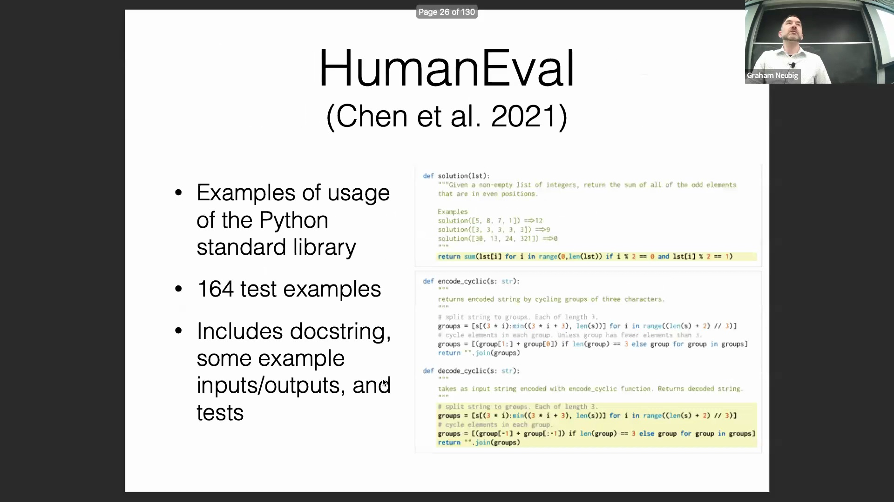

## 基准数据集：HumanEval 概述
讨论随后转向评估任务与数据集，重点聚焦于广受认可的 HumanEval 基准测试(Benchmark)。演讲者指出，尽管该数据集结构设计良好，但目前已存在过度使用的情况，且业界已有更贴近真实开发场景的数据集。HumanEval 涵盖了从易到难的 Python 标准库任务，形式上类似于 LeetCode 编程题。例如，其中一道提示词要求“对列表中偶数索引位置的奇数求和”，这需要模型具备条件过滤与索引逻辑处理能力。然而，该数据集仅包含 164 个样本，且未涉及外部第三方库(External Libraries)，导致其与实际开发工作流存在一定脱节。尽管存在上述局限性，HumanEval 仍是当前业界标准的评估基准。数据集中的每个条目均包含函数文档字符串、输入/输出示例以及自动化单元测试(Automated Unit Tests)，用于严格验证生成代码的正确性。

## 评估指标：理解 Pass@k
评估代码生成系统的核心标准指标是 `pass@k`。其基本原理是为给定的提示词生成 `k` 个候选解决方案(Candidate Solutions)，并验证其中是否至少有一个能够通过预设的单元测试。其中，`pass@1` 衡量的是单次生成输出即为正确的概率。而 `pass@5` 等指标同样具有重要意义：生成多个候选方案不仅便于人类开发者审查并挑选出最优解，还支持自动化流水线预定义测试用例、生成多个备选方案，并仅部署通过全部测试的代码。这种方法凸显了业界希望通过多样本生成技术来提升代码可靠性与质量的趋势，尽管 `pass@k` 的具体数学计算涉及一定的统计学细节。
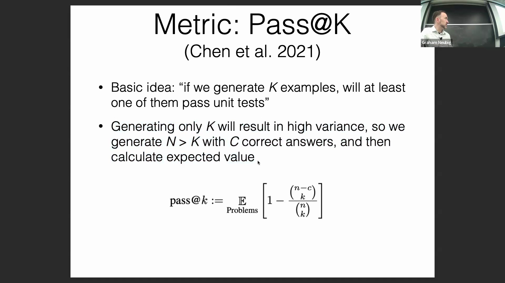

---

## 理解 pass@k 计算与标准基准
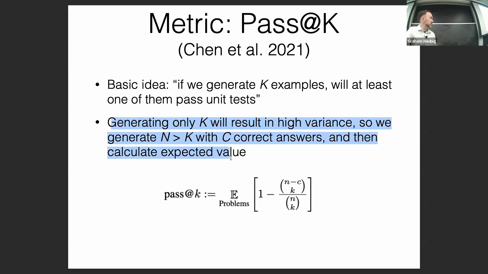
仅使用单次采样输出(Single Sample Output)评估代码生成(Code Generation)会引入较高的方差(Variance)，使得结果的可靠性难以衡量。为解决这一问题，系统通常会生成多个输出（例如 10 个或 200 个样本(Samples)），并利用组合数学(Combinatorics)计算至少有一个解决方案通过测试的期望案例数。 
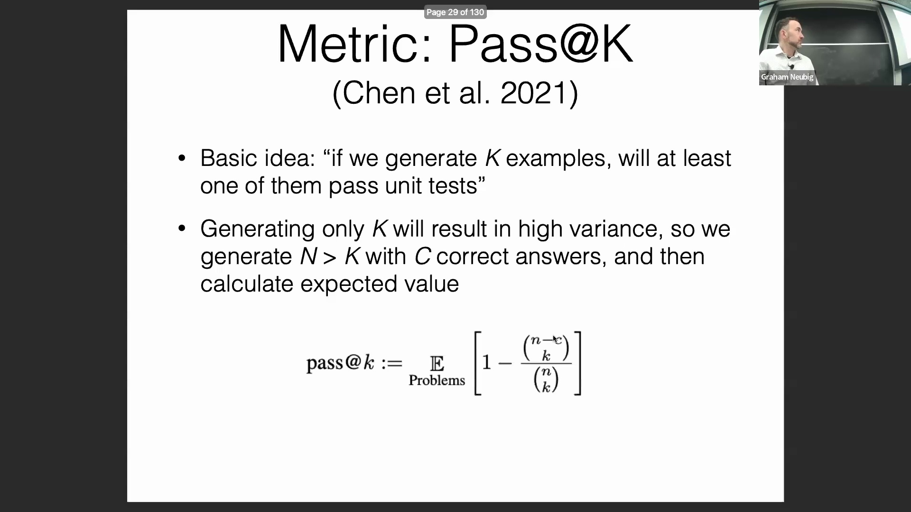
`pass@k` 指标对此进行了形式化定义(Formalized Definition)：将 `k` 视为生成样本的总数，`c` 视为其中正确解决方案的数量，并据此计算成功概率。 
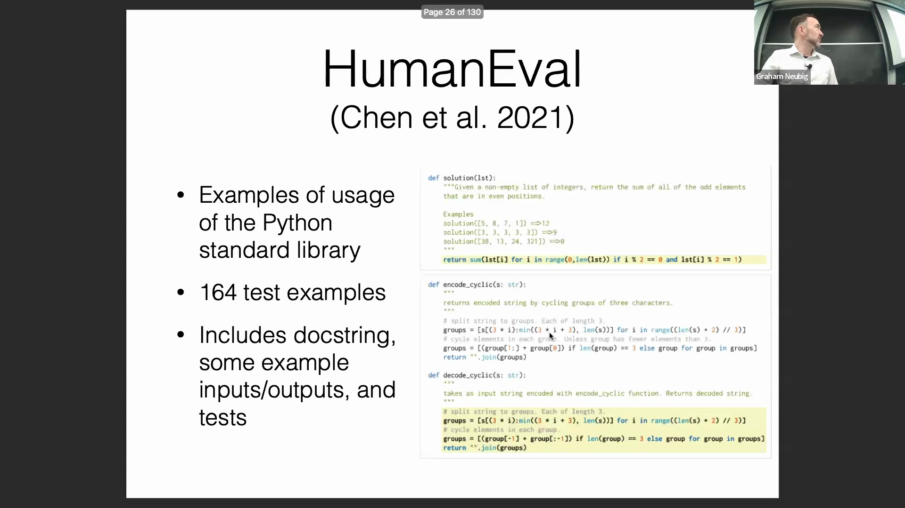
该方法已成为该领域高度标准化的基准测试(Benchmark)，被持续用于评估新发布的大语言模型(Large Language Models, LLMs)并横向比较其代码生成能力。
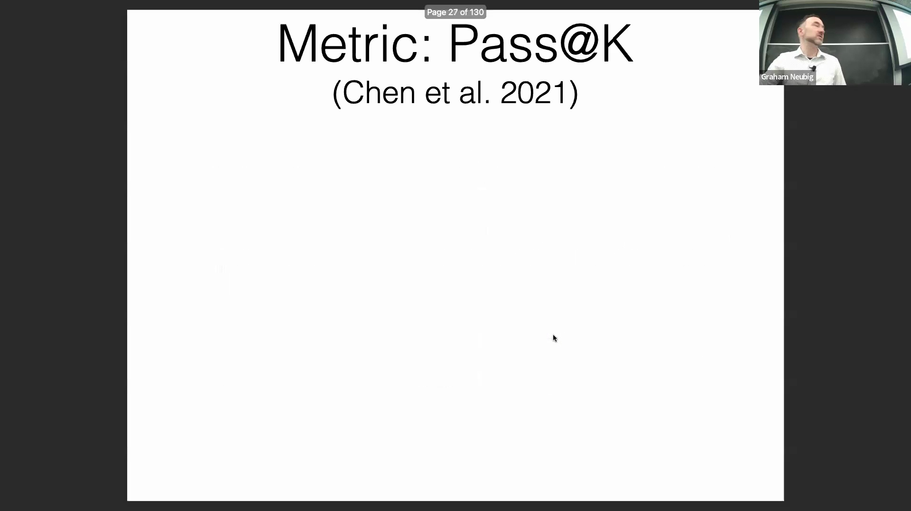

## 大语言模型为何擅长代码生成
大语言模型在代码生成方面表现出色，并非源于其固有的架构优势(Architectural Advantages)，而是因为它们在预训练阶段(Pre-training Phase)被有针对性地输入了海量代码语料(Code Corpus)。这一设计选择主要受两个因素驱动：首先，代码生成是一项核心的实际应用场景，对于现代大语言模型而言具有显著的商业与实践价值；其次，大量研究表明，使用代码进行训练能显著提升模型的通用推理能力(General Reasoning Capabilities)与逻辑水平。像“The Pile”这样的数据集(Dataset)充分反映了这一优先级，其中代码数据几乎占据了训练语料的一半。归根结底，模型在编程任务上的熟练度，直接归功于预训练阶段对代码数据的大规模、针对性训练。

## 扩展评估范围：Conala 与 Odets 数据集
为了克服 HumanEval 等基准测试范围狭窄的局限性，研究人员引入了 Conala 及其基于执行的变体(Execution-based Variant) Odets 等数据集。这些数据集通过抓取并人工整理 Stack Overflow 上的问答对(Q&A Pairs)构建而成，从而能够覆盖更广泛的编程领域与第三方库(Third-party Libraries)。 
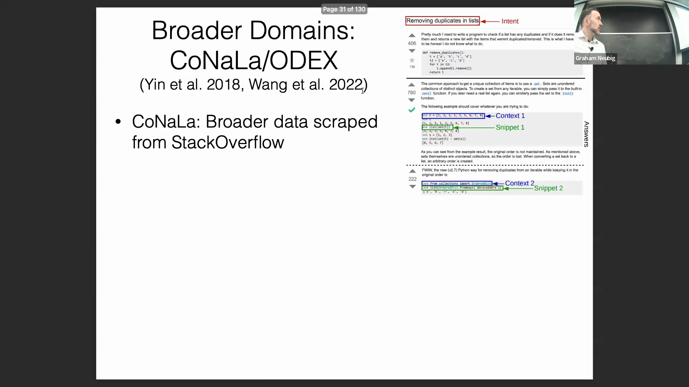
由于数据源自活跃的开发者社区帖子，其库分布(Library Distribution)自然映射了现实世界的使用习惯，大量涵盖了 pandas、NumPy 和 scikit-learn 等主流工具库。 
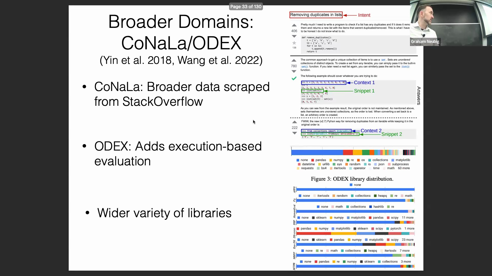
相比之下，HumanEval 几乎完全依赖 Python 标准库(Python Standard Library)，且不涉及任何外部依赖。因此，Odets 能够更真实、更具代表性地评估人工智能(AI)模型在处理实际开发者查询(Developer Queries)时的表现。

## 基于执行的评估的局限性
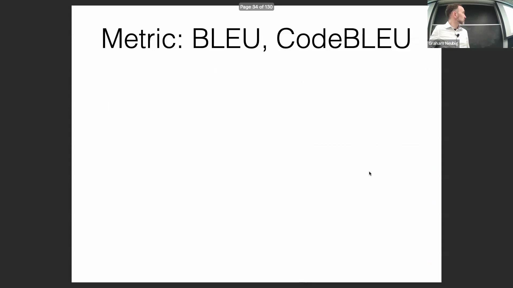
尽管基于执行的评估(Execution-based Evaluation)功能强大，但也带来了显著的工程挑战。首先，为真实场景中的程序生成可靠的单元测试(Unit Tests)通常十分困难，尤其是针对可视化库或服务器端框架(Server-side Frameworks)。例如，自动验证 matplotlib 生成的条形图是否正确渲染(Rendering)，或确认运行中的 Django 服务器状态，都需要设计复杂且高度依赖特定环境的验证逻辑。其次，基于执行的指标完全忽略了代码风格(Code Style)与可维护性(Maintainability)。模型可能会生成极其冗长或结构混乱的“面条代码(Spaghetti Code)”，虽然在技术上能通过所有单元测试，但远未达到工业级专业标准。这些缺陷凸显了引入互补性非执行评估方法(Non-execution Evaluation Methods)的必要性。

## 语法感知指标：BLEU 与 CodeBLEU
传统的文本重叠指标（如 BLEU）主要计算生成代码与人工编写的参考代码之间的 n-gram 相似度(n-gram Similarity)，但无法有效捕捉底层的编程逻辑。为解决这一问题，CodeBLEU 应运而生，旨在融入对代码结构与语义的深度理解。 
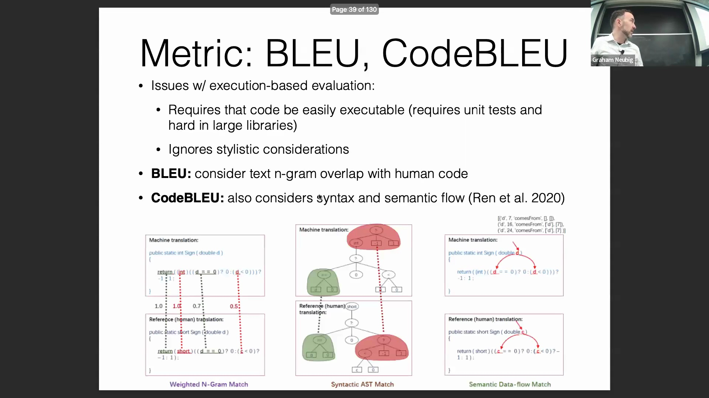
CodeBLEU 不仅评估表面字符串的重合度，还进一步考察抽象语法树(Abstract Syntax Tree, AST)的对齐情况以及语义数据流图(Semantic Data Flow Graph)的相似度。得益于内置的 AST 解析库，在 Python 等语言中提取这些语法树结构非常便捷。 
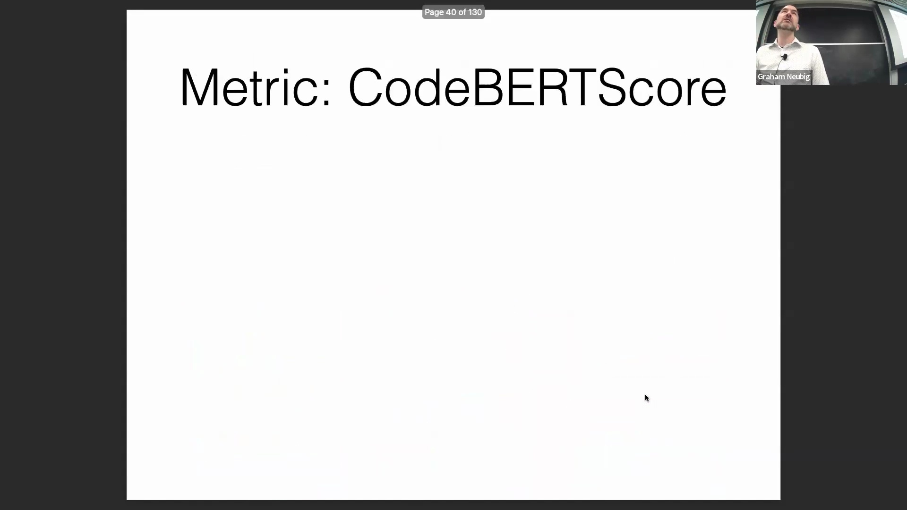
然而，一个关键的局限性依然存在：两个功能完全相同但语法结构或写法不同的实现，仍可能获得较低的评分。因此，业界通常建议将执行测试(Execution Testing)与结构指标(Structural Metrics)结合使用，以实现更全面、客观的模型评估。

## 基于嵌入的评估：Code-BERTScore
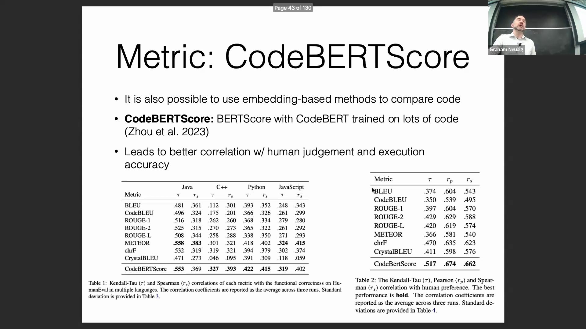
在编写单元测试成本过高或难以落地的场景中，基于嵌入的指标(Embedding-based Metrics)（如 Code-BERTScore）提供了一种稳健的替代方案。该指标由卡内基梅隆大学(Carnegie Mellon University, CMU)研发，通过计算生成代码与参考解决方案的词元嵌入(Token Embeddings)之间的余弦相似度(Cosine Similarity)来进行量化评估。借助 `code-bert`（在海量代码语料上继续进行预训练(Continued Pre-training)的 BERT 模型），该指标能够捕捉远比表层字符串匹配更深层的语义关系(Semantic Relationships)。研究表明，Code-BERTScore 与代码执行准确率(Execution Accuracy)以及人类对代码正确性的主观判断具有更强的相关性。此外，它对变量重命名等表层文本修改具有更强的鲁棒性(Robustness)，这使其在代码无法直接执行的场景下，成为评估代码质量的高效代理指标(Proxy Metric)。

---

## 代码训练模型中的表征学习

经过专门针对代码的训练，语言模型会形成与通用模型截然不同的语义表征(Semantic Representations)。例如，在编程语境中，变量 `i` 和 `j` 被普遍用作循环迭代器(Loop Iterators)，这促使模型为它们学习到高度相似的嵌入表示(Embedding Representations)。然而，标准语言模型(Standard Language Models)会将 `i` 解释为人称代词(Personal Pronouns)，将 `j` 解释为专有名词(Proper Nouns)，从而生成差异巨大的内部表征。这表明，在代码语料上进行持续预训练(Continued Pre-training)，对于使模型的内部推理逻辑与编程惯例(Programming Conventions)保持一致至关重要。

## 数据科学 Notebook 中的代码生成
除传统的集成开发环境(Integrated Development Environment, IDE)外，数据科学笔记本(Data Science Notebooks)（如 Jupyter 或 Google Colab）为增量式(Incremental)、具备上下文感知(Context-Aware)的代码生成提供了独特的开发环境。谷歌的一项研究探讨了这一开发范式，即模型根据当前活动笔记本中的自然语言提示(Natural Language Prompts)，按单元格(Cell)逐块生成代码。该评估设置旨在检验模型处理增量式开发、跨单元格维持变量状态(Variable States)，以及动态适应项目上下文(Project Context)的能力，高度契合真实世界的数据科学工作流(Data Science Workflow)。

## 基准评估中的数据泄露挑战
评估代码生成模型(Code Generation Models)的一个主要陷阱是训练数据污染(Training Data Contamination)。当模型在基于网络抓取(Web Scraping)的笔记本数据上进行测试时，其高分往往仅表明这些测试样本可能已存在于其训练语料中。然而，当使用专门为该项研究全新构建的笔记本进行测试时，几乎所有模型的性能均出现断崖式下跌。这一鲜明对比表明，亮眼的基准测试成绩往往反映的是模型的死记硬背能力(Memorization)，而非真正的逻辑推理与问题解决能力，凸显了构建干净、无数据泄露的测试集(Clean, Leakage-free Test Sets)的迫切需求。

## 时间截止线与基准可靠性
LiveCodeBench 等近期项目通过严格追踪编程问题的发布日期与模型训练截止时间(Training Cutoff Date)的先后关系，直接应对数据泄露难题。结果显示存在显著的性能断崖(Performance Cliff)：模型对截止日期前发布的问题表现优异，但对截止日后的问题表现则大幅滑坡。通过将 HumanEval 得分与 LiveCodeBench 性能进行交叉关联分析发现，在 HumanEval 上得分异常畸高的模型，极有可能受益于受污染的训练数据。此类时间序列分析(Temporal Analysis)已成为区分模型真实推理能力与基准过拟合(Benchmark Overfitting)的关键诊断工具，该现象在数学推理(Mathematical Reasoning)评估中同样存在。

## SWE-bench：现实世界的软件工程任务
在迈向生产级评估(Production-grade Evaluation)的过程中，SWE-bench 直接采用真实的 GitHub 问题(GitHub Issues)与完整的开源代码仓库(Code Repositories)作为输入。模型需生成完整的拉取请求(Pull Request)以修复缺陷或实现新功能，随后由项目原有的单元测试进行自动化验证。该基准测试对模型的长上下文理解(Long-context Understanding)能力及针对完整代码库进行精准代码修改(Code Modification)的能力提出了极高要求。目前该基准上的最先进(State-of-the-Art, SOTA)模型解决率仅约为 14%，这表明复杂的软件工程问题仍是 AI 亟待攻克的难关。此外，运行 SWE-bench 的计算成本(Computational Cost)极高，因为每次评估均需经历克隆、环境配置及完整代码仓库的编译执行流程。

## 设计转代码与多模态网页生成
Design-to-Code 数据集通过要求模型将网页截图或 UI 设计稿转换为可运行的 HTML、CSS 与 JavaScript 代码，来评估其多模态理解与生成能力(Multimodal Capabilities)。该评估体系结合了高层视觉嵌入相似度(Visual Embedding Similarity)与底层 UI 元素召回率(Element Recall Rate)，旨在确保生成页面不仅在视觉风格上高度还原，且完整包含所有必需的 UI 组件(UI Components)。尽管 Claude 3 或 GPT-4 等闭源模型(Closed-source Models)已取得一定进展，但其输出稳定性仍显不足，尤其在准确召回与精确定位嵌套 DOM 元素(Nested DOM Elements)方面表现欠佳。该基准测试充分暴露了当前多模态模型在精确、结构化代码合成(Structured Code Synthesis)方面的技术瓶颈。

## 迭代优化的必要性
单次生成(One-shot Generation)之所以困难，尤其在网页设计等视觉驱动领域，根本原因在于任务本身的复杂性。即便是经验丰富的资深开发者，也极少能在首次尝试中直接输出完美且完全可运行的代码。AI 模型同样受限于此，因为它们缺乏实时的视觉反馈循环(Visual Feedback Loop)来即时修正偏差。成功的实践通常依赖于交互式、多轮对话(Interactive, Multi-turn)的工作流：模型生成初始代码后，接收开发者的针对性修正指令（如“将背景色由白改为黑”），进而迭代优化输出结果。将代码生成视为一种对话式、持续迭代的优化过程(Iterative Process)，而非孤立的单次预测任务，能显著提升其在实际开发中的实用价值。

## 核心生成方法与参数调优
AI 辅助编程(AI-Assisted Programming)的核心基础，依赖于在海量代码语料(Code Corpus)上进行广泛预训练的语言模型。在部署此类模型时，参数调优(Parameter Tuning)至关重要：强烈建议降低温度参数(Temperature)，以有效抑制语法幻觉(Syntax Hallucinations)，从而生成更具确定性(Deterministic)与可靠性的代码。此外，对于深度集成至 IDE 的辅助工具（如 GitHub Copilot）而言，代码填充(Code Infilling)是一项关键能力。该功能使模型能够基于前后文语境精准预测并补全缺失的代码片段，从而在现有代码库中无缝衔接函数体、逻辑控制块与代码结构模板。

---

## 基于掩码语言模型的代码填充
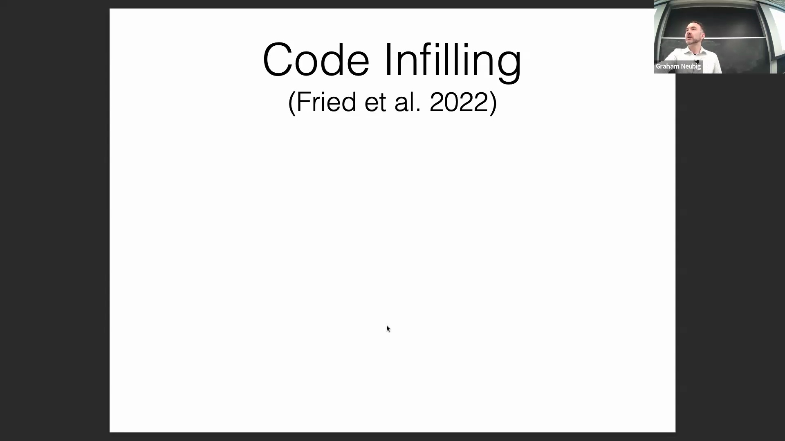
集成于集成开发环境(Integrated Development Environment, IDE)的编码助手，其一项基础能力是“代码填充(Code Infilling)”，即允许模型在现有代码上下文之间生成缺失的片段。该技术源于 Daniel Fried 等人的研究，它使标准的从左到右自回归语言模型(Autoregressive Language Models)能够有效处理双向依赖关系(Bidirectional Dependencies)。
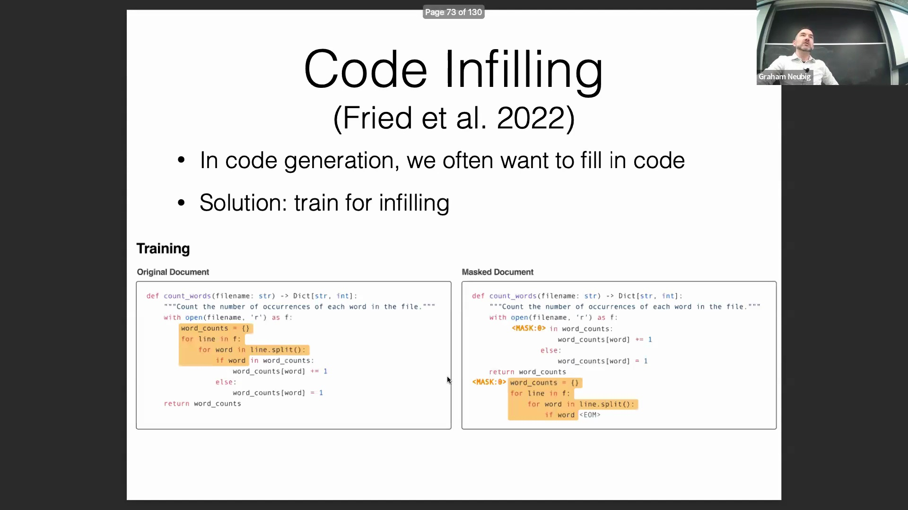
该方法的核心机制是在代码序列的光标位置插入特殊的掩码标记(Mask Tokens)。模型以光标前后的文本作为条件上下文，并将掩码片段重排至输入序列的末尾，以便进行自回归生成。这一机制使得无缝插入代码行、条件语句或完整代码块成为可能，构成了现代编码工具（如 GitHub Copilot）背后的核心架构技术。

## GitHub Copilot 中的高级提示词工程
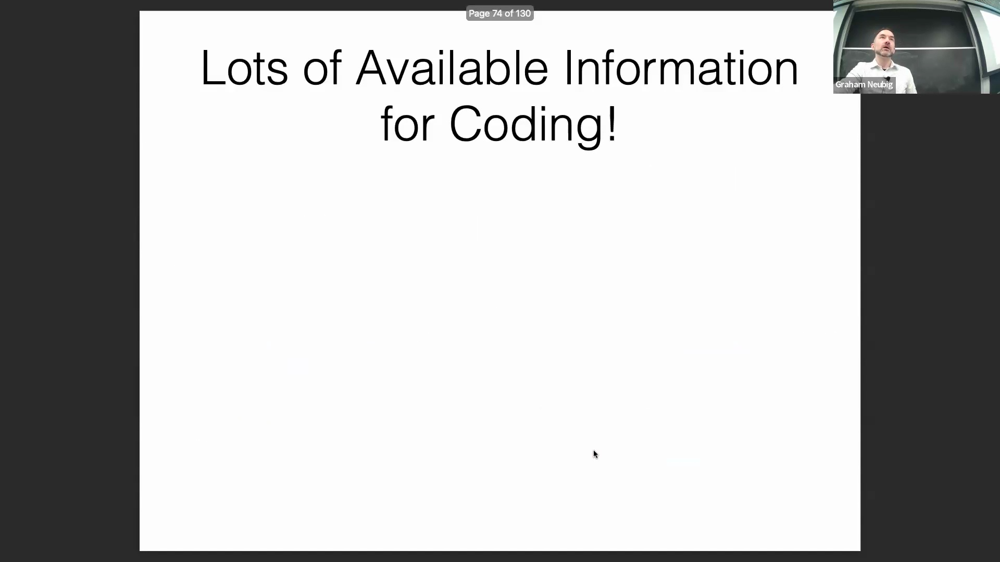
代码助手在实际开发中的表现，很大程度上取决于复杂的提示词工程(Prompt Engineering)。通过对 GitHub Copilot 的 JavaScript 扩展进行逆向工程(Reverse Engineering)，研究人员发现该系统会系统性地聚合远超当前编辑窗口范围的上下文信息。
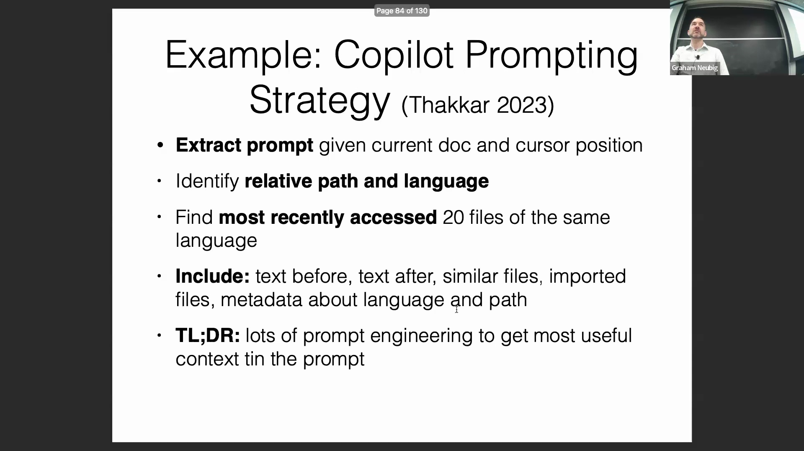
Copilot 的提示词构建流水线(Processing Pipeline)会提取光标前后的代码文本，识别文件的相对路径(Relative Path)与编程语言，并追踪所有已打开的编辑器标签页中、同种语言下最近访问的 20 个文件。
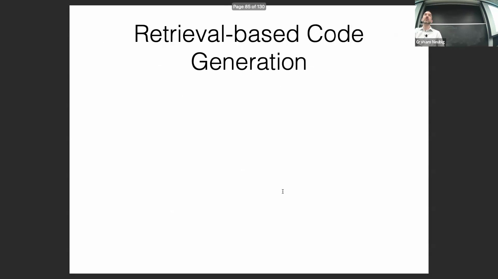
最终发送至推理服务器(Inference Server)的请求载荷(Request Payload)智能融合了本地代码上下文、近期打开文件中的相关代码片段、已导入的模块定义(Module Definitions)以及语言特定的元数据。这种全面的上下文封装(Context Encapsulation)确保模型能够获取所有必要信号，从而生成语法准确且语义连贯的代码补全(Code Completion)建议。

## 面向代码的检索增强生成
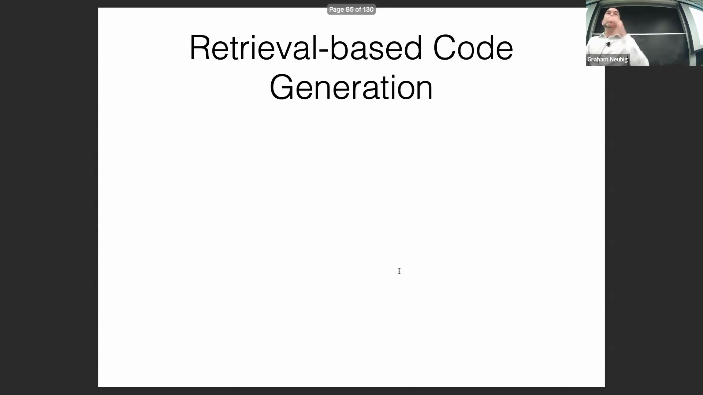
检索增强生成(Retrieval-Augmented Generation, RAG)技术通过将外部知识直接注入提示词，显著增强了代码模型的能力。在处理具有独特内部编码风格且预训练阶段未曾见过的大型私有代码库(Private Code Repositories)时，该技术尤为关键。通过从在线仓库或内部服务器检索并附加历史相似代码片段，模型能够使其输出严格遵循既定的组织编码规范(Organizational Coding Standards)。
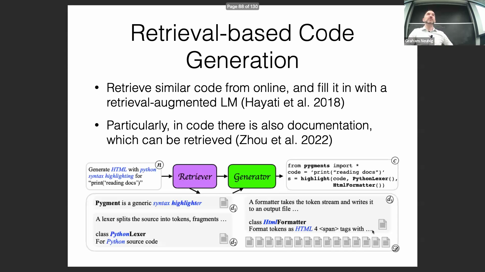
另一项关键应用是“文档提示(Document Prompting)”，它有效解决了模型为快速迭代的第三方库生成过时(Outdated)代码的常见问题。通过动态检索最新的官方文档并将其附加至提示词中，模型能够精准调用全新的应用程序接口(Application Programming Interface, API)与语法结构，从而在处理陌生或近期更新的依赖项(Dependencies)时，大幅降低兼容性错误与模型幻觉(Hallucinations)的发生率。

## 执行反馈与输出一致性
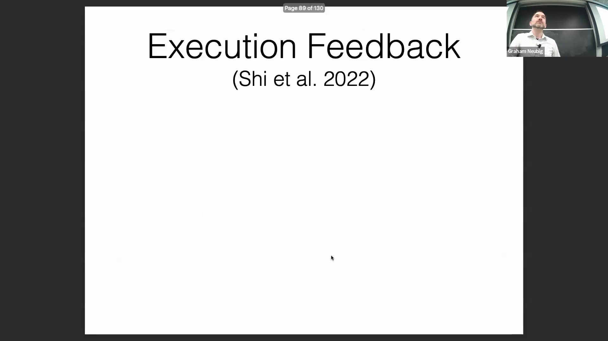
在缺乏预设单元测试的场景下，执行反馈(Execution Feedback)提供了一种强大的自我验证(Self-verification)机制。该范式要求针对同一任务生成多个多样化的代码样本，并逐一执行以观察其运行时行为(Runtime Behavior)与输出结果。
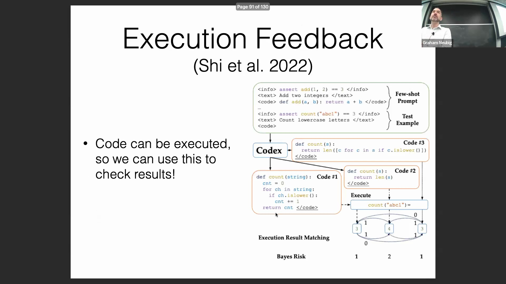
若生成的程序中有相当比例输出重叠或高度相似的结果，则强烈表明该解决方案具备正确性。在缺乏完全匹配输出时，为甄选最优结果，评估框架会引入最小贝叶斯风险(Minimum Bayes Risk, MBR)等指标，以筛选出在所有生成变体中预期错误率最低的程序。该方法巧妙利用了代码执行的确定性特性(Deterministic Nature)，从而自动过滤掉逻辑错误或产生幻觉的实现方案。

## 错误驱动的修正与交互范式
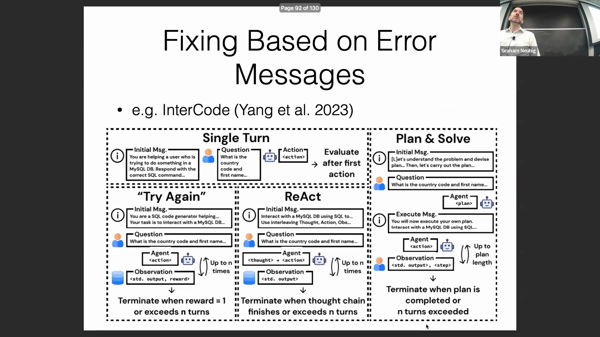
迭代开发(Iterative Development)中的一项高效策略，是将运行时错误信息(Runtime Error Messages)直接反馈给大语言模型(Large Language Models, LLMs)。在初次代码生成失败后，系统会自动捕获编译器(Compiler)或解释器(Interpreter)抛出的错误日志，并将其作为条件上下文输入下一次生成请求，使模型能够诊断问题并自主修复自身产生的缺陷。
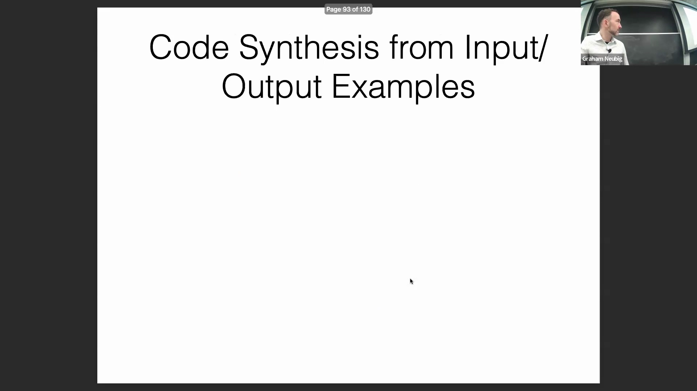
InterCode 等研究框架进一步将该理念扩展为多轮交互环境(Multi-turn Interactive Environment)。除基础的错误修正外，此类系统还支持高层任务规划(Task Planning)、逐步代码执行与对话式优化。这成功将静态的代码生成工具转变为动态的、具备智能体特征(Agent-like)的编程助手，使其能够与人类开发者协同调试(Collaborative Debugging)、持续迭代，共同攻克复杂的软件工程挑战。

---

## 基于输入/输出示例的程序合成
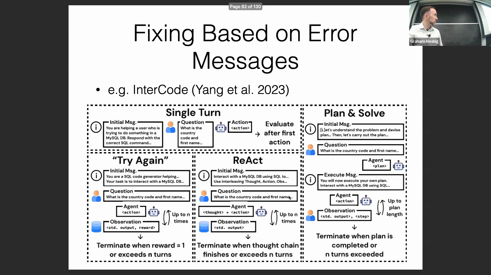
从历史发展来看，程序合成(Program Synthesis)技术早于自然语言到代码的生成(Natural Language to Code Generation)，其核心焦点是根据输入-输出(Input-Output, I/O)示例对直接推断出潜在的目标程序。该范式一个极为成功的商业应用是 Microsoft Excel 的“快速填充”(Flash Fill)功能。用户只需提供一两个期望的转换示例（例如，从全名中提取首字母），系统便会自动推导出背后的隐式程序(Implicit Program)，并将该模式批量应用于整列数据。尽管该方法在电子表格自动化(Spreadsheet Automation)中得到了广泛应用，但传统上其能力局限于正则表达式(Regular Expressions)或结构化查询语言(SQL)等特定领域语言(Domain-Specific Languages, DSLs)。若缺乏自然语言规范(Natural Language Specifications)的约束，通用代码合成的搜索空间(Search Space)将变得极其庞大，因此必须依赖受限的执行环境才能获得可靠的结果。该领域的基础性研究包括《Interpret》相关论文以及麻省理工学院(MIT) Joshua Tenenbaum 团队的大量开创性工作。

## 先驱代码模型：CodeX 与 GitHub Copilot
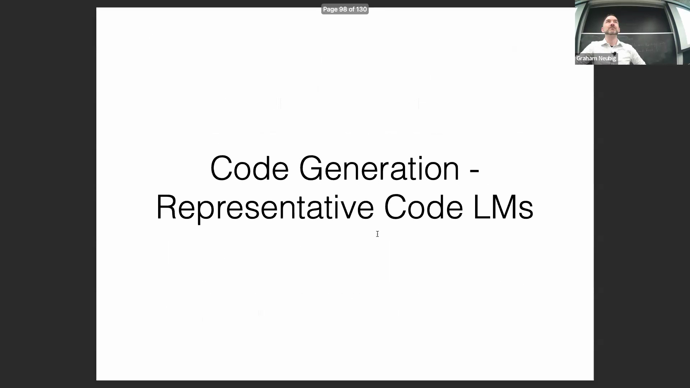
现代代码生成(Code Generation)时代因 CodeX 模型的诞生而取得重大突破。该模型由 OpenAI 开发，通过在海量 GitHub 代码仓库(Code Repositories)上对 GPT-3 进行持续预训练(Continued Pre-training)而成。CodeX 正是 GitHub Copilot 背后的底层基础引擎(Foundational Engine)。值得注意的是，尽管存在如 `code-davinci` 等参数量更大的变体，但 Copilot 在早期阶段一直依赖于更小、推理速度更快的 `code-cushman` 模型。这一架构选择主要源于工程实际限制：实时的 IDE 自动补全(IDE Auto-completion)要求极低的延迟(Latency)，若在数百万活跃用户的每次击键(Keystroke)时都调用庞大模型进行推理，其计算成本将高得令人望而却步。通过结合模型缓存(Model Caching)、优化的提示词工程(Prompt Engineering)与精简的模型架构，Copilot 能够在不牺牲核心功能的前提下，提供响应迅速且具备高成本效益的代码补全服务。

## StarCoder2：架构、训练与透明度

由 BigScience 倡议组织（由 Hugging Face 与 ServiceNow 联合发起）开发的 StarCoder2 模型，以其在训练数据(Training Data)和训练方法论(Training Methodology)上的完全透明度而脱颖而出。该模型采用类 LLaMA(LLaMA-style Architecture) 架构，提供 30亿(3B)、70亿(7B) 和 150亿(15B) 参数量的模型变体，并通过重新配置旋转位置嵌入(Rotary Positional Embeddings, RoPE)参数，成功实现了更长的上下文窗口(Context Window)。模型的训练语料库(Training Corpus)高度多样化，不仅涵盖原始源代码、GitHub 问题(Issues)、拉取请求(Pull Requests)、Jupyter/Kaggle 笔记本，还包括技术文档，甚至引入了 LLVM 编译器的中间表示(Intermediate Representation, IR)。为增强模型的鲁棒性(Robustness)与 IDE 兼容性，训练过程中采用了多项关键技术：以 50% 的概率注入仓库名或文件名等元数据标签(Metadata Tags)，以训练模型理解条件上下文(Conditional Context)；同时大量采用代码填充(Code Infilling)目标函数，使其掌握双向代码补全能力。由于高质量代码数据的总体规模相较于自然语言语料相对有限，StarCoder2 在训练期间经历了 4 到 5 个训练轮次(Training Epochs)，这远多于标准大语言模型的单轮预训练周期。

## 数据集构建：The Stack v2 与许可证管理
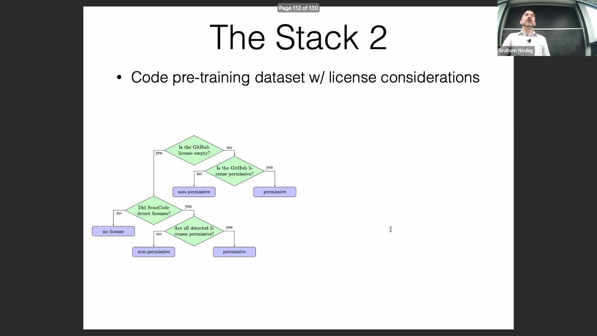
StarCoder2 开发的基石是 The Stack v2 数据集。这是一个经过严格筛选的预训练数据集，旨在直接应对 AI 模型训练中普遍面临的版权(Copyright)与软件许可证(Software Licensing)合规问题。数据构建者并未盲目抓取代码仓库，而是实施了严格的数据过滤流程(Data Filtering Pipeline)，优先纳入采用宽松开源许可证(Permissive Open-source Licenses)的代码数据。通过交叉比对 GitHub 提供的许可证元数据(License Metadata)，并结合自动化许可证检测技术，该数据集在维持庞大规模的同时，严格确保了法律合规性(Legal Compliance)。
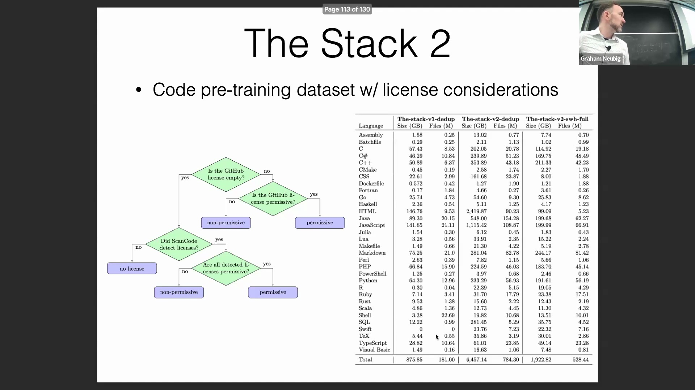
最终的数据集分布精准映射了现实世界的开发生态系统(Development Ecosystem)。尽管 Java、PHP、Markdown 和 Python 等主流编程语言在语料库中占据主导地位，但数据集同样保留了包括 Rust 在内的专业领域及新兴语言(New Programming Languages)的宝贵长尾数据(Long-tail Data)。 
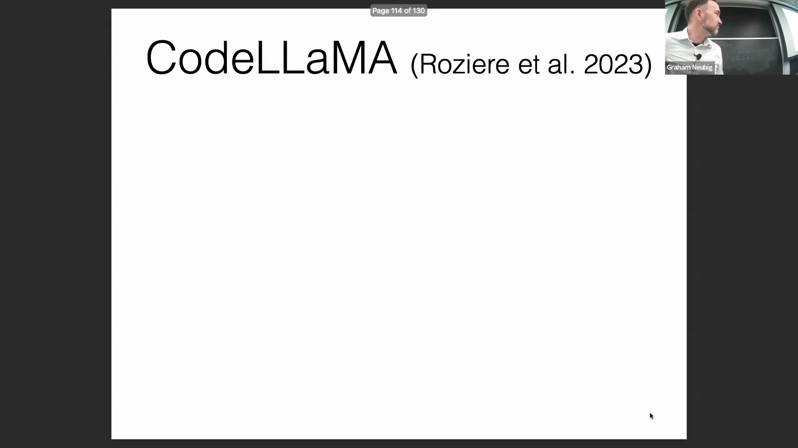
这种均衡的数据构成使模型既能胜任主流的企业级开发(Enterprise Development)任务，又能熟练掌握处理特定领域或采用现代语法特性(Modern Syntax Features)的编程语言。

## 新兴竞争者与不断演进的格局
自 StarCoder2 发布以来，代码生成领域持续快速扩张，涌现出众多极具竞争力的开放权重模型(Open-weight Models)。在 StarCoder2 发布前夕推出的 CodeLlama 迅速确立了其作为强劲替代方案(Strong Alternative)的市场地位，在代码补全(Code Completion)与指令遵循(Instruction Following)任务中均展现出卓越性能。这些技术进展，连同 DeepSeek Coder 等更新的模型架构，清晰地勾勒出该领域的演进轨迹：行业正朝着透明度更高、合法合规且高度专业化的代码大语言模型(Code LLMs)方向迈进。这些前沿模型正日益弥合通用人工智能(Artificial General Intelligence, AGI)与专业软件工程工作流(Professional Software Engineering Workflows)之间的鸿沟。

---

## Meta 的 Code Llama：架构与训练策略

本文介绍的模型由 Meta 开发，其底层架构与 Llama 2 基本一致。该模型以 Llama 2 为基座进行继续预训练(Continued Pre-training)，并针对代码生成(Code Generation)任务进行了大量定制化改进。值得注意的是，该模型支持更长的输入上下文(Input Context)，并扩展了最大生成长度，这些均是面向代码的大语言模型常见的标准优化手段。

其训练方法遵循多数据集渐进式训练流程(Multi-stage Progressive Training Pipeline)。首先，模型在约 5000 亿个去重(Deduplicated)的代码词元(Token)以及专为代码任务合成的指令数据(Synthetic Instruction Data)上进行训练。随后，模型在 200 亿个词元上进行了长上下文微调(Long Context Fine-tuning)，最后通过指令微调(Instruction Fine-tuning)进一步提升了模型的响应能力与实用性。

## 专属 Python 变体与基准测试优化

Meta 还发布了该模型的 Python 专属版本(Python-specific Variant)。推出此专版并非因为 Python 本身更为重要，而是因为目前绝大多数代码评测基准(Evaluation Benchmarks)均采用 Python 编写。这一现象主要源于设计这些基准的机器学习(Machine Learning)研究人员通常更偏好使用 Python。因此，Meta 专门优化了一个版本，使其在这些基准数据集上表现卓越。对于主要使用 Python 的开发者而言，鉴于其在该语言上的优异表现，强烈推荐尝试 Code Llama Python 版本。

## DeepSeek Coder：数据构成与库集成

最后重点介绍的模型是 DeepSeek Coder，它是目前业界最强的代码模型之一，在各类代码基准测试中的平均表现均名列前茅。其训练数据构成大致为：87% 的源代码(Source Code)、10% 的英文文本（包含 Markdown 和 Stack Exchange 数据）以及 3% 的中文文本，这一比例也反映了该模型出自中国公司的背景。

除了常规的预处理(Pre-processing)流程外，DeepSeek Coder 还引入了一项独特的训练策略，即结合代码仓库的依赖关系(Repository-level Dependencies)。研究团队爬取了各类开源库的依赖图谱(Dependency Graph)，提取出被直接引用的文件，并将其纳入训练数据集。这种方法在模型生成代码需要准确调用和引用外部依赖库(External Dependencies)时，具有显著优势。

## 架构、性能对比与评估注意事项

在架构方面，DeepSeek Coder 采用了标准的类 Llama(Llama-like)设计，提供 1.3B、6.7B 和 33B 三种参数规模(Parameter Scale)的版本，并支持张量并行(Tensor Parallelism)与分布式计算(Distributed Computing)。该模型在高达 2 万亿词元的庞大规模语料库上完成训练。正如 StarCoder 2 论文中所述，在横向对比这些模型时，它们的整体性能较为接近。DeepSeek Coder 更擅长标准的编程任务，而 StarCoder 则在数据科学(Data Science)场景（尤其是 Jupyter Notebook 环境）中表现出更强的能力。尽管这些开源模型已具备极高的性能，但在处理极其复杂的任务时，仍与 GPT-4 等闭源商业模型存在差距。不过，得益于其开源(Open-source)特性，开发者可以对其进行微调(Fine-tuning)和定制化部署。

关于 DeepSeek Coder，一个值得注意的问题是基准测试评估中可能存在的数据污染(Data Contamination)。该模型在 HumanEval 等数据集上取得的优异成绩，部分原因可能在于其训练数据与测试集存在高度相似性。因此，在解读这些评测分数时需保持审慎。尽管如此，即使在 LCB(LiveCodeBench)等较新且模型大概率未接触过的数据集上，DeepSeek 依然表现出极强的竞争力，这充分印证了其扎实的底层能力。

## 问答环节：在生成过程中强制施加语法约束

在问答环节中，有观众提问：如何在解码(Decoding)阶段直接对输出的语法施加硬性约束，而不是单纯依赖模型的概率分布(Probability Distribution)？由于代码生成对语法规范要求极高，确保生成的代码语法正确至关重要。讲者回应指出，虽然“后处理过滤”(Post-processing Filtering)（即生成多个候选结果并剔除语法错误的样本）操作简单，但在解码过程中实时施加约束则复杂得多。这需要一个增量式语法解析器(Incremental Syntax Parser)，以便在生成过程中即时剪枝(Prune)无效的假设路径(Hypothesis Paths)。该方案的可行性高度依赖于具体的编程语言：对于某些语言实现起来相对容易，而对于另一些语言则难度极大。

## 用于受限 JSON 与代码生成的工具

目前，受限生成(Constrained Generation)的一个主要应用场景是生成 JSON 格式(JSON Format)输出，这类输出常被直接解析并用于下游任务(Downstream Tasks)。为了解决这一问题，业界已涌现出多个专用工具库，允许开发者在模型解码阶段直接强制实施结构化规则。

强烈推荐使用 `outlines` 库。该库能够通过加权有限状态自动机(Weighted Finite State Automaton, WFSA)无缝集成语法约束，从而有效拦截任何违反预设语法的生成内容。另一个广受欢迎的替代方案是 `guidance`，它同样提供了强大的约束机制，但上手门槛（学习曲线(Learning Curve)）相对略高一些。

对于希望实现结构化输出受限生成的开发者，强烈建议尝试 `outlines` 或 `guidance`。这两个工具均提供了灵活的框架来约束输出结构，确保生成的代码或数据严格遵循所需的语法规则，而不再完全依赖概率采样(Probabilistic Sampling)。本次分享最后在讲者的交流邀请中圆满结束，讲者也展现了其深厚的研究背景以及对后续提问的开放态度。