## 代码训练模型中的表征学习
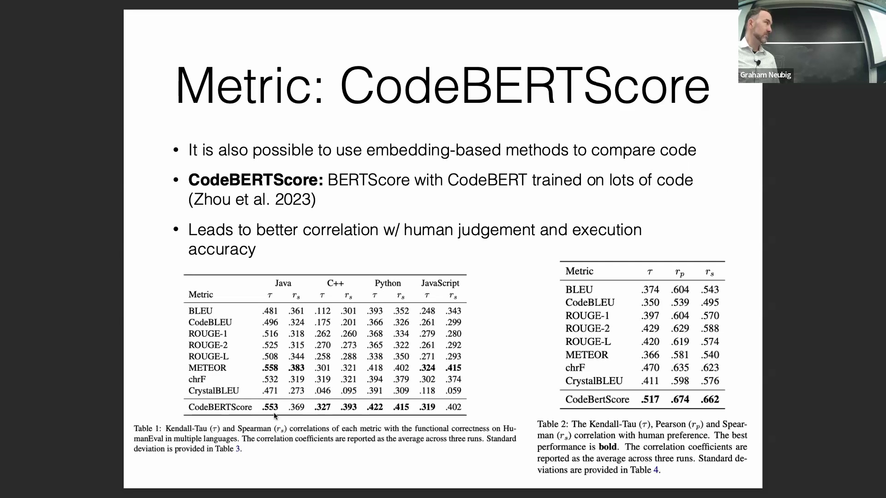
经过专门针对代码的训练，语言模型会形成与通用模型截然不同的语义表征(Semantic Representations)。例如，在编程语境中，变量 `i` 和 `j` 被普遍用作循环迭代器(Loop Iterators)，这促使模型为它们学习到高度相似的嵌入表示(Embedding Representations)。然而，标准语言模型(Standard Language Models)会将 `i` 解释为人称代词(Personal Pronouns)，将 `j` 解释为专有名词(Proper Nouns)，从而生成差异巨大的内部表征。这表明，在代码语料上进行持续预训练(Continued Pre-training)，对于使模型的内部推理逻辑与编程惯例(Programming Conventions)保持一致至关重要。
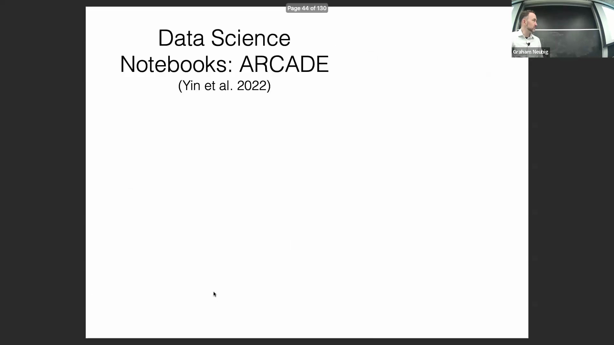

## 数据科学 Notebook 中的代码生成
除传统的集成开发环境(Integrated Development Environment, IDE)外，数据科学笔记本(Data Science Notebooks)（如 Jupyter 或 Google Colab）为增量式(Incremental)、具备上下文感知(Context-Aware)的代码生成提供了独特的开发环境。谷歌的一项研究探讨了这一开发范式，即模型根据当前活动笔记本中的自然语言提示(Natural Language Prompts)，按单元格(Cell)逐块生成代码。该评估设置旨在检验模型处理增量式开发、跨单元格维持变量状态(Variable States)，以及动态适应项目上下文(Project Context)的能力，高度契合真实世界的数据科学工作流(Data Science Workflow)。
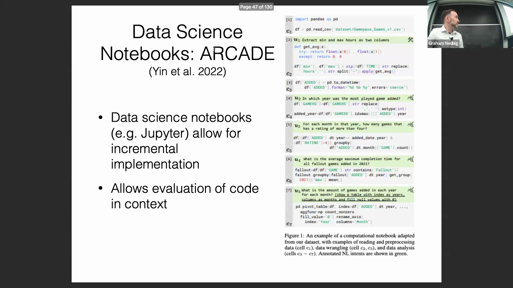

## 基准评估中的数据泄露挑战
评估代码生成模型(Code Generation Models)的一个主要陷阱是训练数据污染(Training Data Contamination)。当模型在基于网络抓取(Web Scraping)的笔记本数据上进行测试时，其高分往往仅表明这些测试样本可能已存在于其训练语料中。然而，当使用专门为该项研究全新构建的笔记本进行测试时，几乎所有模型的性能均出现断崖式下跌。这一鲜明对比表明，亮眼的基准测试成绩往往反映的是模型的死记硬背能力(Memorization)，而非真正的逻辑推理与问题解决能力，凸显了构建干净、无数据泄露的测试集(Clean, Leakage-free Test Sets)的迫切需求。
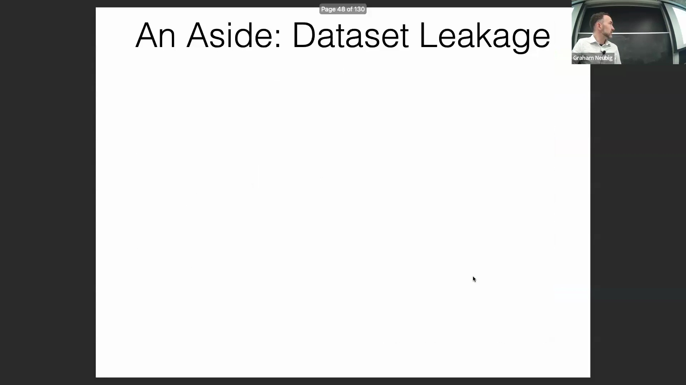

## 时间截止线与基准可靠性
LiveCodeBench 等近期项目通过严格追踪编程问题的发布日期与模型训练截止时间(Training Cutoff Date)的先后关系，直接应对数据泄露难题。结果显示存在显著的性能断崖(Performance Cliff)：模型对截止日期前发布的问题表现优异，但对截止日后的问题表现则大幅滑坡。通过将 HumanEval 得分与 LiveCodeBench 性能进行交叉关联分析发现，在 HumanEval 上得分异常畸高的模型，极有可能受益于受污染的训练数据。此类时间序列分析(Temporal Analysis)已成为区分模型真实推理能力与基准过拟合(Benchmark Overfitting)的关键诊断工具，该现象在数学推理(Mathematical Reasoning)评估中同样存在。
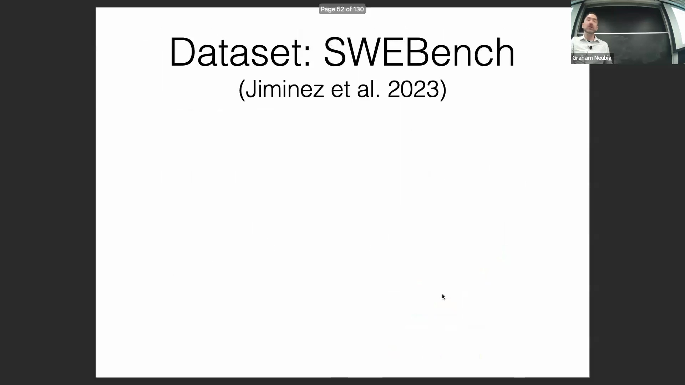

## SWE-bench：现实世界的软件工程任务
在迈向生产级评估(Production-grade Evaluation)的过程中，SWE-bench 直接采用真实的 GitHub 问题(GitHub Issues)与完整的开源代码仓库(Code Repositories)作为输入。模型需生成完整的拉取请求(Pull Request)以修复缺陷或实现新功能，随后由项目原有的单元测试进行自动化验证。该基准测试对模型的长上下文理解(Long-context Understanding)能力及针对完整代码库进行精准代码修改(Code Modification)的能力提出了极高要求。目前该基准上的最先进(State-of-the-Art, SOTA)模型解决率仅约为 14%，这表明复杂的软件工程问题仍是 AI 亟待攻克的难关。此外，运行 SWE-bench 的计算成本(Computational Cost)极高，因为每次评估均需经历克隆、环境配置及完整代码仓库的编译执行流程。
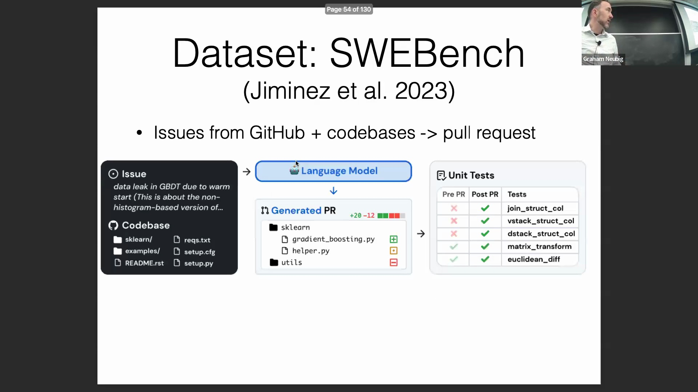

## 设计转代码与多模态网页生成
Design-to-Code 数据集通过要求模型将网页截图或 UI 设计稿转换为可运行的 HTML、CSS 与 JavaScript 代码，来评估其多模态理解与生成能力(Multimodal Capabilities)。该评估体系结合了高层视觉嵌入相似度(Visual Embedding Similarity)与底层 UI 元素召回率(Element Recall Rate)，旨在确保生成页面不仅在视觉风格上高度还原，且完整包含所有必需的 UI 组件(UI Components)。尽管 Claude 3 或 GPT-4 等闭源模型(Closed-source Models)已取得一定进展，但其输出稳定性仍显不足，尤其在准确召回与精确定位嵌套 DOM 元素(Nested DOM Elements)方面表现欠佳。该基准测试充分暴露了当前多模态模型在精确、结构化代码合成(Structured Code Synthesis)方面的技术瓶颈。
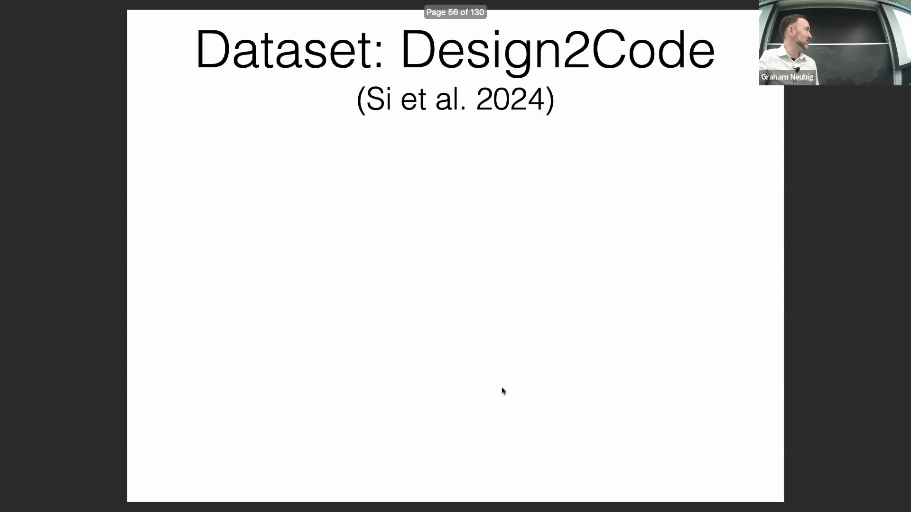
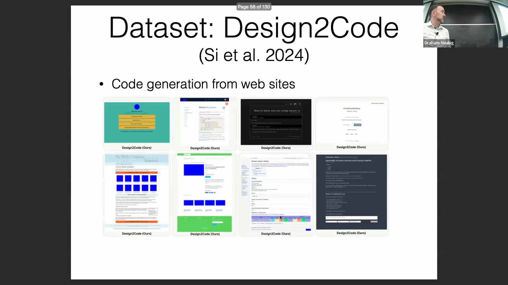
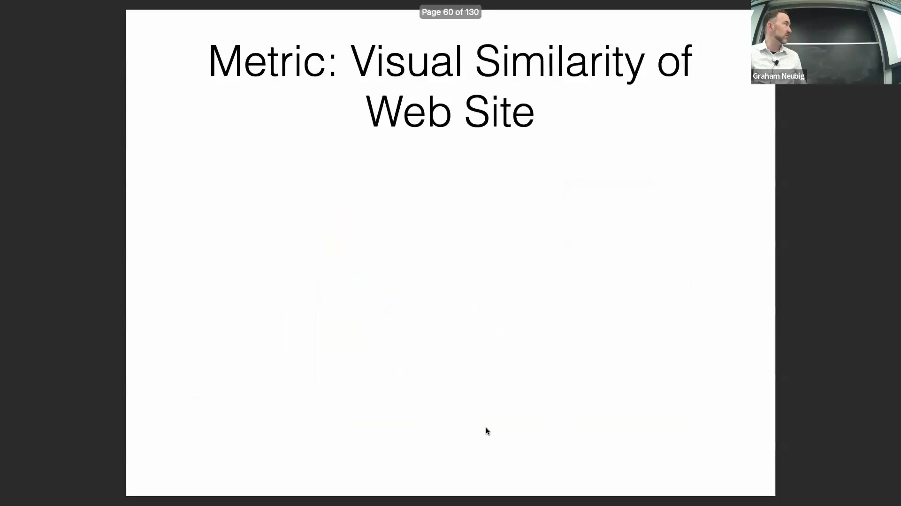

## 迭代优化的必要性
单次生成(One-shot Generation)之所以困难，尤其在网页设计等视觉驱动领域，根本原因在于任务本身的复杂性。即便是经验丰富的资深开发者，也极少能在首次尝试中直接输出完美且完全可运行的代码。AI 模型同样受限于此，因为它们缺乏实时的视觉反馈循环(Visual Feedback Loop)来即时修正偏差。成功的实践通常依赖于交互式、多轮对话(Interactive, Multi-turn)的工作流：模型生成初始代码后，接收开发者的针对性修正指令（如“将背景色由白改为黑”），进而迭代优化输出结果。将代码生成视为一种对话式、持续迭代的优化过程(Iterative Process)，而非孤立的单次预测任务，能显著提升其在实际开发中的实用价值。
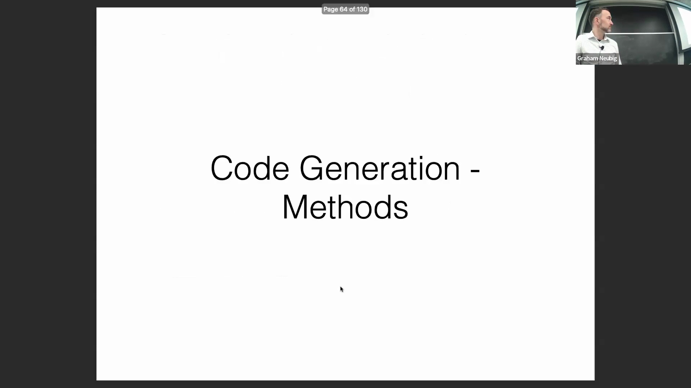
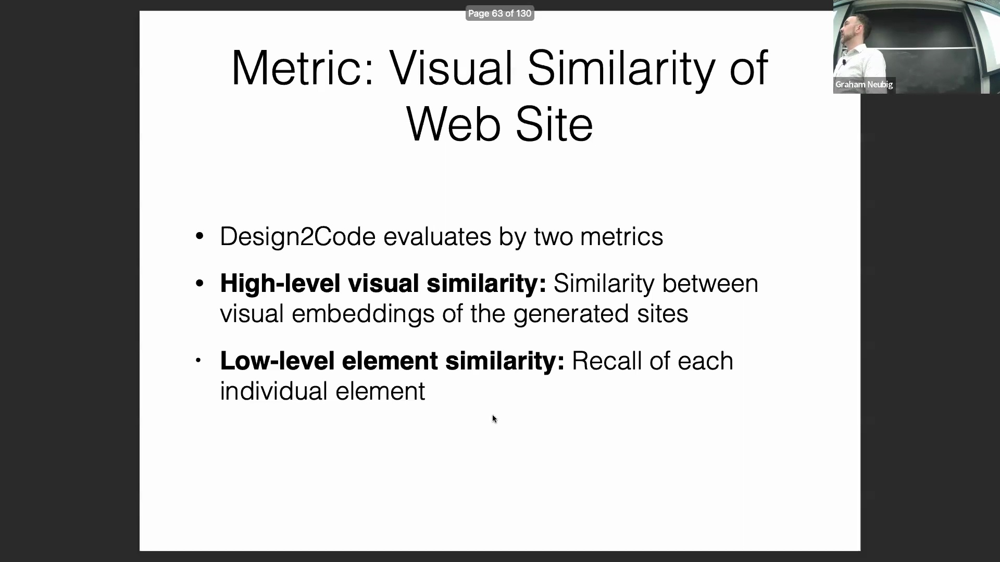

## 核心生成方法与参数调优
AI 辅助编程(AI-Assisted Programming)的核心基础，依赖于在海量代码语料(Code Corpus)上进行广泛预训练的语言模型。在部署此类模型时，参数调优(Parameter Tuning)至关重要：强烈建议降低温度参数(Temperature)，以有效抑制语法幻觉(Syntax Hallucinations)，从而生成更具确定性(Deterministic)与可靠性的代码。此外，对于深度集成至 IDE 的辅助工具（如 GitHub Copilot）而言，代码填充(Code Infilling)是一项关键能力。该功能使模型能够基于前后文语境精准预测并补全缺失的代码片段，从而在现有代码库中无缝衔接函数体、逻辑控制块与代码结构模板。