## Meta 的 Code Llama：架构与训练策略
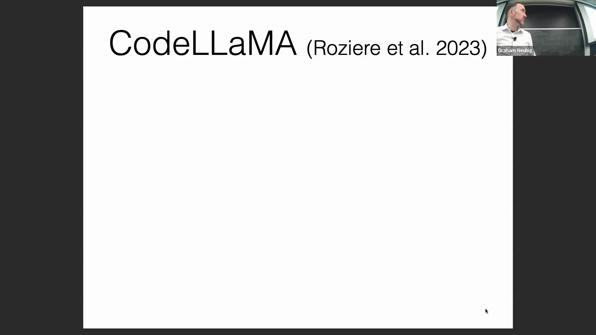
本文介绍的模型由 Meta 开发，其底层架构与 Llama 2 基本一致。该模型以 Llama 2 为基座进行继续预训练(Continued Pre-training)，并针对代码生成(Code Generation)任务进行了大量定制化改进。值得注意的是，该模型支持更长的输入上下文(Input Context)，并扩展了最大生成长度，这些均是面向代码的大语言模型常见的标准优化手段。

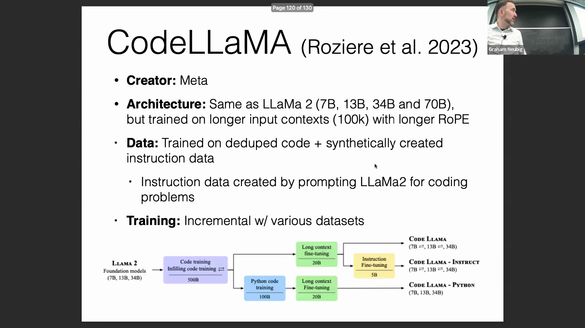
其训练方法遵循多数据集渐进式训练流程(Multi-stage Progressive Training Pipeline)。首先，模型在约 5000 亿个去重(Deduplicated)的代码词元(Token)以及专为代码任务合成的指令数据(Synthetic Instruction Data)上进行训练。随后，模型在 200 亿个词元上进行了长上下文微调(Long Context Fine-tuning)，最后通过指令微调(Instruction Fine-tuning)进一步提升了模型的响应能力与实用性。

## 专属 Python 变体与基准测试优化
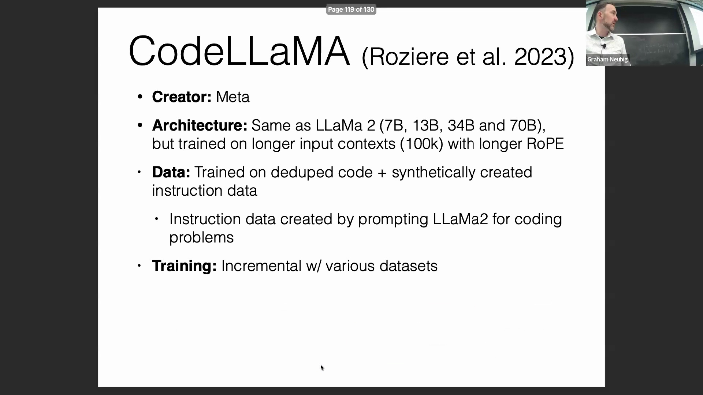
Meta 还发布了该模型的 Python 专属版本(Python-specific Variant)。推出此专版并非因为 Python 本身更为重要，而是因为目前绝大多数代码评测基准(Evaluation Benchmarks)均采用 Python 编写。这一现象主要源于设计这些基准的机器学习(Machine Learning)研究人员通常更偏好使用 Python。因此，Meta 专门优化了一个版本，使其在这些基准数据集上表现卓越。对于主要使用 Python 的开发者而言，鉴于其在该语言上的优异表现，强烈推荐尝试 Code Llama Python 版本。

## DeepSeek Coder：数据构成与库集成
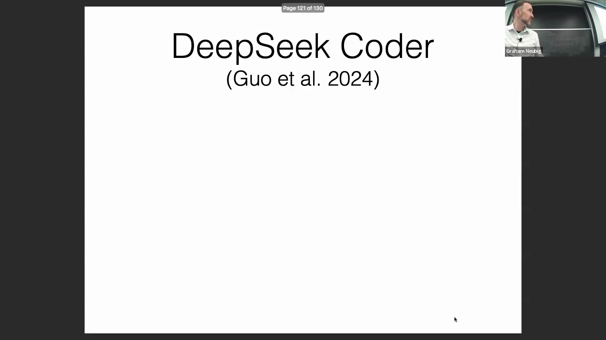
最后重点介绍的模型是 DeepSeek Coder，它是目前业界最强的代码模型之一，在各类代码基准测试中的平均表现均名列前茅。其训练数据构成大致为：87% 的源代码(Source Code)、10% 的英文文本（包含 Markdown 和 Stack Exchange 数据）以及 3% 的中文文本，这一比例也反映了该模型出自中国公司的背景。

除了常规的预处理(Pre-processing)流程外，DeepSeek Coder 还引入了一项独特的训练策略，即结合代码仓库的依赖关系(Repository-level Dependencies)。研究团队爬取了各类开源库的依赖图谱(Dependency Graph)，提取出被直接引用的文件，并将其纳入训练数据集。这种方法在模型生成代码需要准确调用和引用外部依赖库(External Dependencies)时，具有显著优势。

## 架构、性能对比与评估注意事项
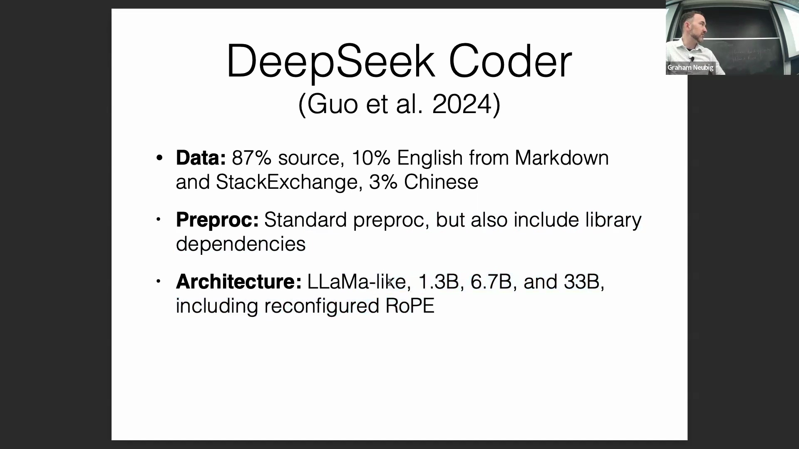
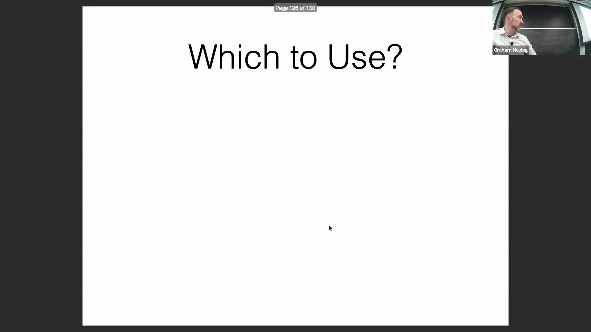
在架构方面，DeepSeek Coder 采用了标准的类 Llama(Llama-like)设计，提供 1.3B、6.7B 和 33B 三种参数规模(Parameter Scale)的版本，并支持张量并行(Tensor Parallelism)与分布式计算(Distributed Computing)。该模型在高达 2 万亿词元的庞大规模语料库上完成训练。正如 StarCoder 2 论文中所述，在横向对比这些模型时，它们的整体性能较为接近。DeepSeek Coder 更擅长标准的编程任务，而 StarCoder 则在数据科学(Data Science)场景（尤其是 Jupyter Notebook 环境）中表现出更强的能力。尽管这些开源模型已具备极高的性能，但在处理极其复杂的任务时，仍与 GPT-4 等闭源商业模型存在差距。不过，得益于其开源(Open-source)特性，开发者可以对其进行微调(Fine-tuning)和定制化部署。

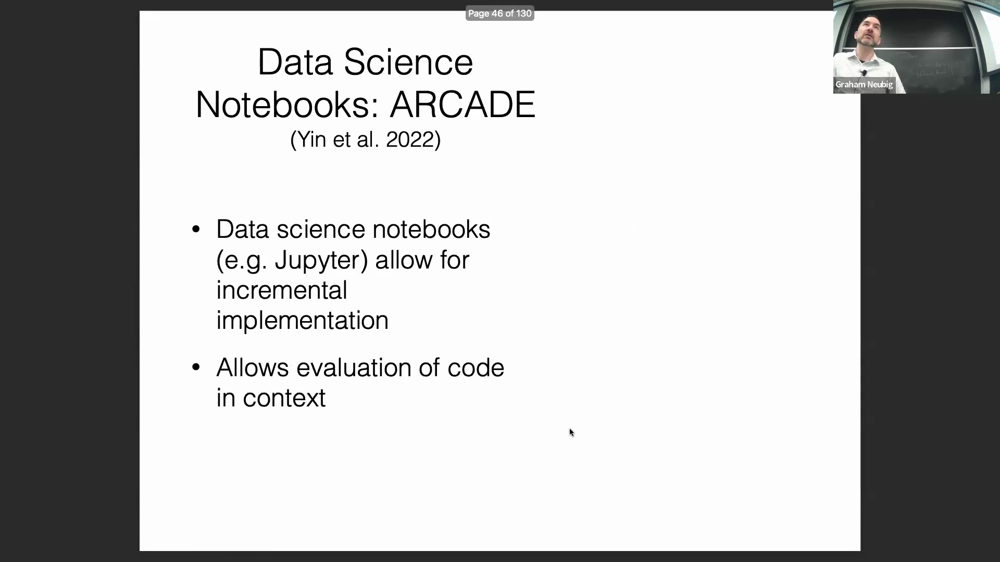
关于 DeepSeek Coder，一个值得注意的问题是基准测试评估中可能存在的数据污染(Data Contamination)。该模型在 HumanEval 等数据集上取得的优异成绩，部分原因可能在于其训练数据与测试集存在高度相似性。因此，在解读这些评测分数时需保持审慎。尽管如此，即使在 LCB(LiveCodeBench)等较新且模型大概率未接触过的数据集上，DeepSeek 依然表现出极强的竞争力，这充分印证了其扎实的底层能力。

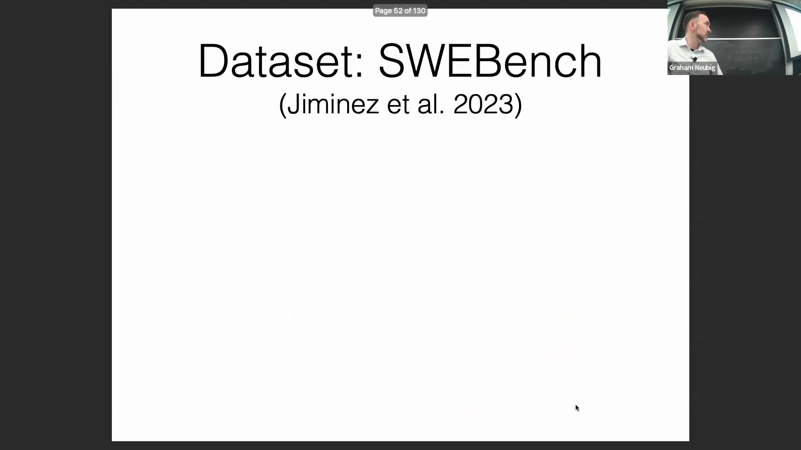

## 问答环节：在生成过程中强制施加语法约束
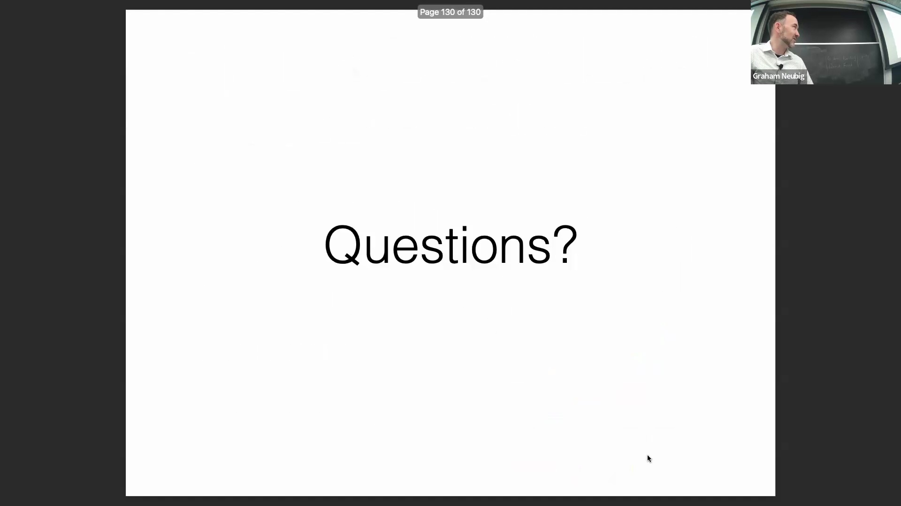
在问答环节中，有观众提问：如何在解码(Decoding)阶段直接对输出的语法施加硬性约束，而不是单纯依赖模型的概率分布(Probability Distribution)？由于代码生成对语法规范要求极高，确保生成的代码语法正确至关重要。讲者回应指出，虽然“后处理过滤”(Post-processing Filtering)（即生成多个候选结果并剔除语法错误的样本）操作简单，但在解码过程中实时施加约束则复杂得多。这需要一个增量式语法解析器(Incremental Syntax Parser)，以便在生成过程中即时剪枝(Prune)无效的假设路径(Hypothesis Paths)。该方案的可行性高度依赖于具体的编程语言：对于某些语言实现起来相对容易，而对于另一些语言则难度极大。

## 用于受限 JSON 与代码生成的工具
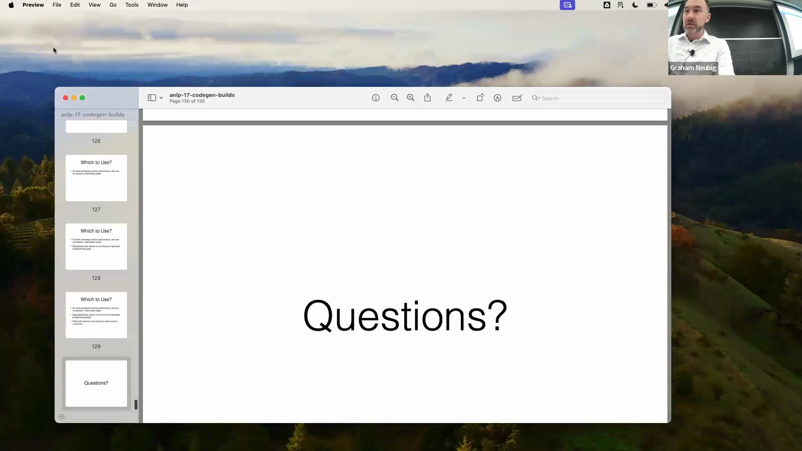
目前，受限生成(Constrained Generation)的一个主要应用场景是生成 JSON 格式(JSON Format)输出，这类输出常被直接解析并用于下游任务(Downstream Tasks)。为了解决这一问题，业界已涌现出多个专用工具库，允许开发者在模型解码阶段直接强制实施结构化规则。

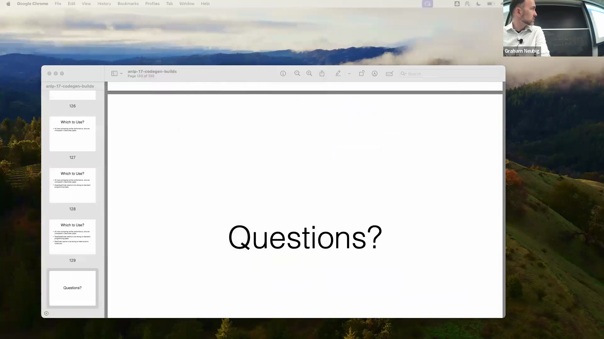
强烈推荐使用 `outlines` 库。该库能够通过加权有限状态自动机(Weighted Finite State Automaton, WFSA)无缝集成语法约束，从而有效拦截任何违反预设语法的生成内容。另一个广受欢迎的替代方案是 `guidance`，它同样提供了强大的约束机制，但上手门槛（学习曲线(Learning Curve)）相对略高一些。

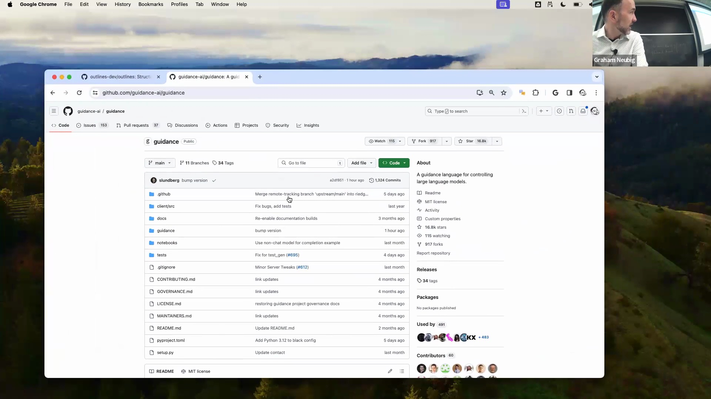
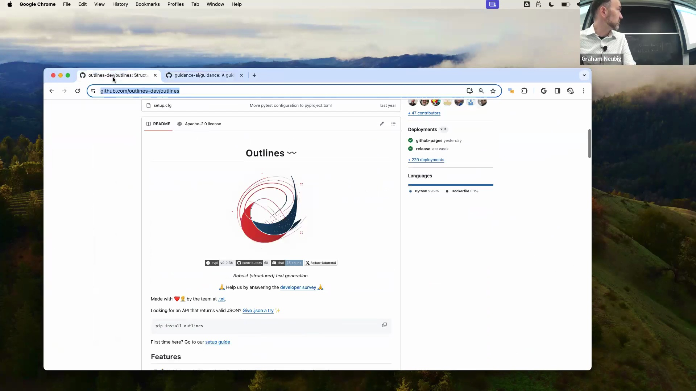
对于希望实现结构化输出受限生成的开发者，强烈建议尝试 `outlines` 或 `guidance`。这两个工具均提供了灵活的框架来约束输出结构，确保生成的代码或数据严格遵循所需的语法规则，而不再完全依赖概率采样(Probabilistic Sampling)。本次分享最后在讲者的交流邀请中圆满结束，讲者也展现了其深厚的研究背景以及对后续提问的开放态度。