## 知识库简介
本讲座引入了从知识库中学习（Learning from Knowledge Bases）的主题，标志着讨论重心从此前对语言模型（Language Models）和神经网络（Neural Networks）的探讨，有意识地发生了转变。本部分将探索不同的信息源与相对独立的算法，为理解结构化数据如何融入机器学习流水线（Machine Learning Pipeline）提供了全新视角。
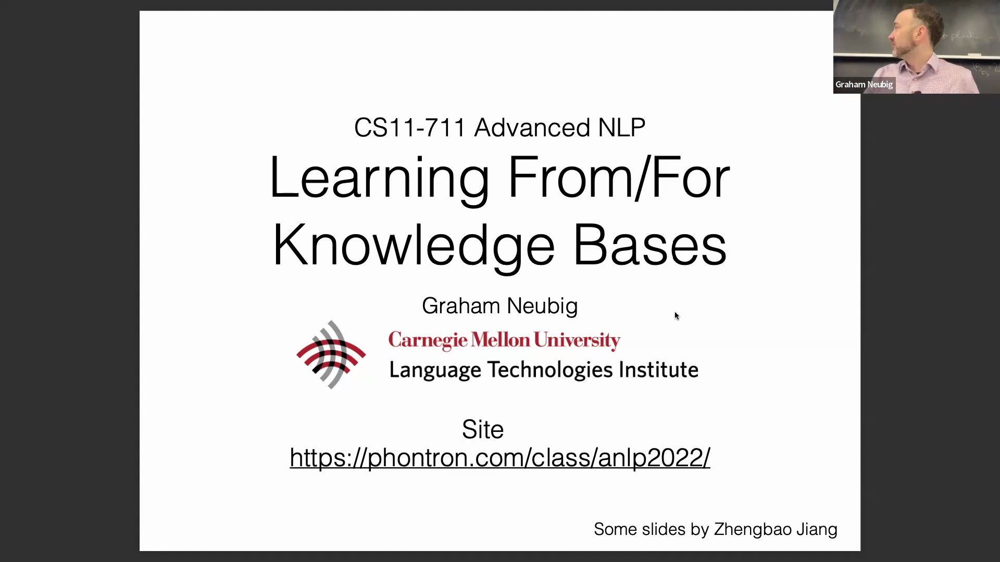

## 知识库的定义与核心研究问题
知识库（Knowledge Base）本质上是结构化的信息数据库。其中最常见的形式是由实体（Entity，即图中的节点）和关系（Relation，即连接节点的边）构成的关系型知识库（Relational Knowledge Base）。本部分的讨论主要围绕三个核心研究问题展开：如何利用神经网络（Neural Network）方法学习并扩充此类知识库？如何从知识库中提取信息并进行学习，以改进神经网络模型？以及如何有效利用结构化知识来解答复杂问题？
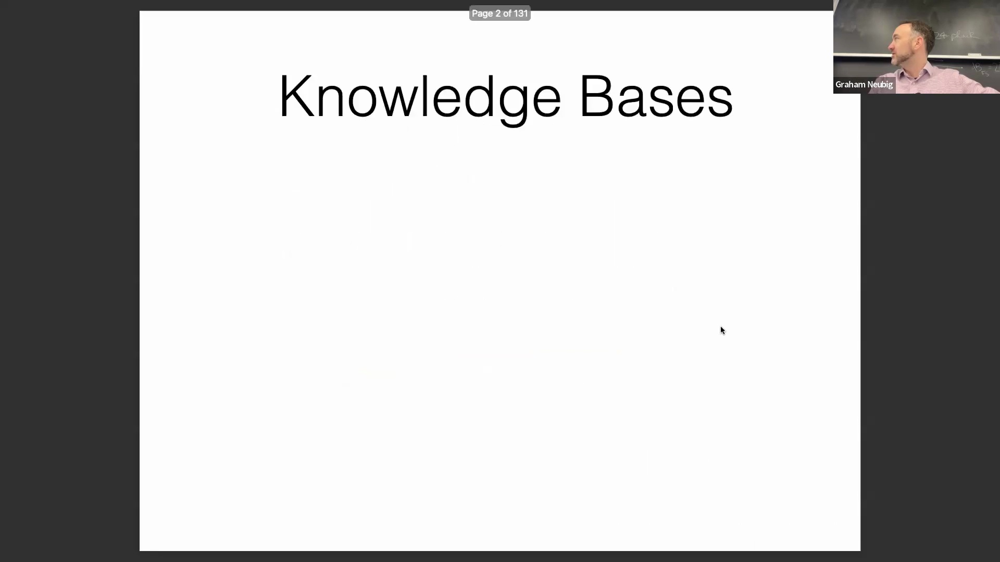

## 经典知识库：WordNet
讲座回顾了知识库的历史演变，首先从经典案例 WordNet 切入。WordNet 是一个大型词汇数据库，其中每个节点代表一个“同义词集”（Synset，即一组同义词），涵盖名词、动词和形容词。它建立了诸如“是一种”（Is-a，例如：掀背车是一种汽车）和“部分属于”（Part-of，例如：车轮是汽车的一部分）等层级关系，并严格区分了类型（Type）与实例（Instance）。动词间的关系按具体程度进行组织，而形容词间的关系则侧重于反义关系。历史上，WordNet 在自然语言处理（Natural Language Processing, NLP）领域发挥了重要作用，例如可通过遍历其层级结构，识别文本中某一概念的所有语义变体。
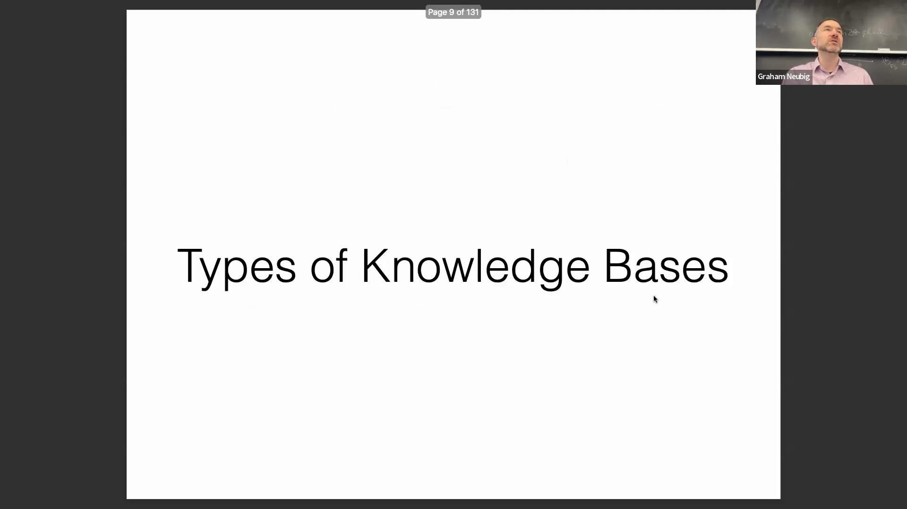
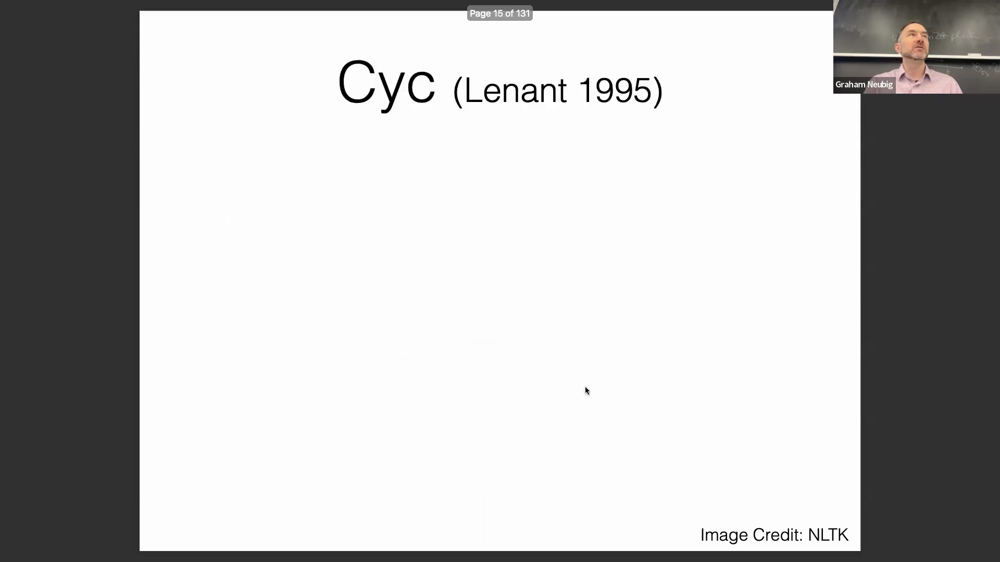

## 人工构建的衰落与现代替代方案
尽管 WordNet 具有奠基性作用，但其在现代 NLP 中的应用已逐渐减少。如今，稠密嵌入空间（Dense Embedding Space）和大型语言模型（Large Language Model, LLM）等技术能够以更高效率、更大规模的方式实现类似的语义匹配。讲座还强调了历史上人工构建常识库（Commonsense Knowledge Base）所面临的挑战：此类项目曾试图在数十年间，通过人工手动编码海量的人类知识。事实证明，此类项目的规模过于庞大，难以在实际中落地；由于人工成本无法实现规模化扩展，最终难以构建出全面且实用的系统。
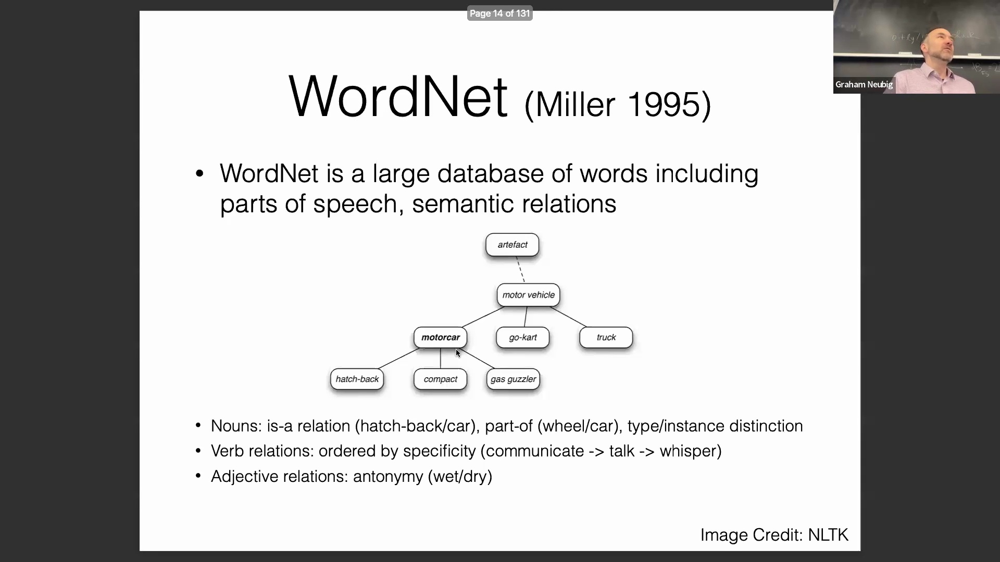
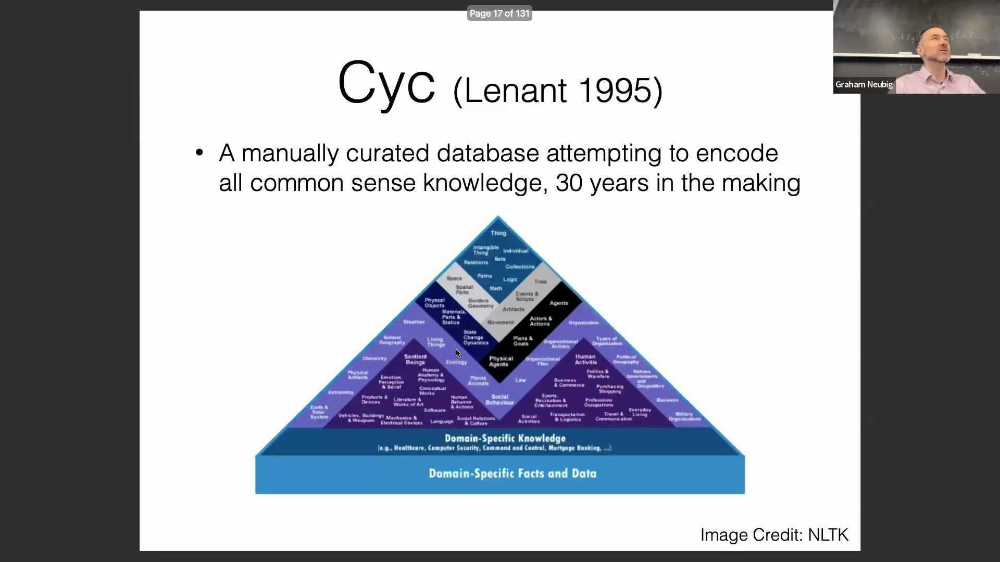
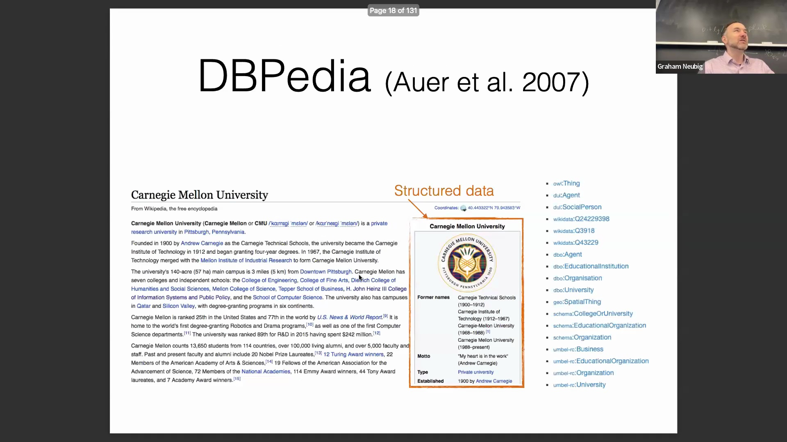

## DBpedia：利用维基百科的人工构建数据
DBpedia 的出现标志着一个重要的范式转变（Paradigm Shift）。它不再依赖专门团队为机器手动编码规则，而是直接从维基百科（Wikipedia）中提取结构化数据。该方法充分利用了志愿者在创建维基百科内容时所投入的大量人力。由于贡献者本是为人类读者撰写内容，他们会自然而然地将信息整理为结构化格式，例如实体类型、格言（Motto）和成立日期等。这种由内在动机驱动的模式成功构建了一个高度可扩展且实用的数据库，涵盖了全球众多知名实体，且无需专门投入大量人工进行维护。
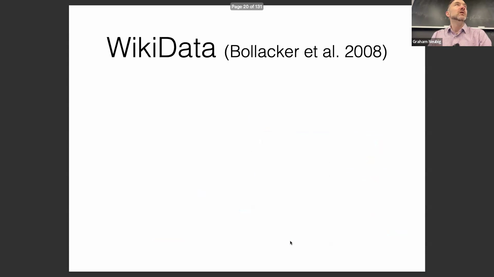

## Wikidata：大规模、互联与多语言图谱
在此基础上，Wikidata 已成为目前应用最广泛的现代知识库。尽管名称中带有“Wiki”，但它并不严格局限于维基百科；它还整合并提取了大量外部数据源的信息。Wikidata 的特点在于其构建了一个超大规模、高度互联且支持多语言的结构化数据库。它支持由社区驱动的持续更新，并为实体维护着丰富且相互关联的属性集。这一点在历史人物与当代人物全面且机器可读（Machine-Readable）的条目中得到了充分体现。
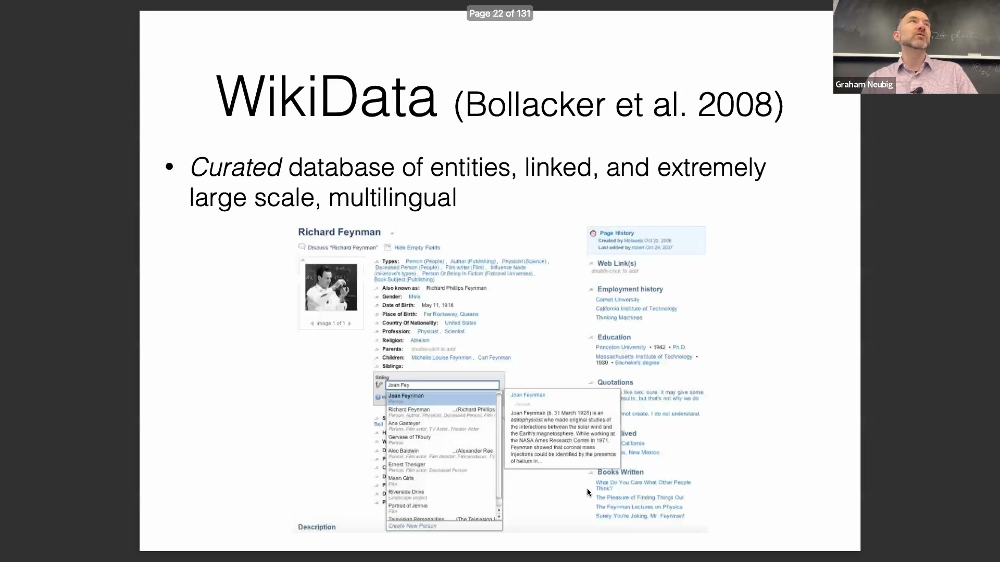

## 互动演示：在 Wikidata 中探索实体
为展示 Wikidata 的实际功能，演讲者根据观众建议进行了一次实时搜索，查询实体为“mamba”。查询结果指向“MAMBA”，即法国国家科学研究中心（CNRS）内一个专注于数学生物学（Mathematical Biology）的研究团队。该演示直观展示了现代知识库如何将现实世界中的概念表示为相互关联的图节点（Graph Node）。用户可以无缝浏览研究方向、机构隶属关系和领导职务等属性，充分展现了当代知识图谱（Knowledge Graph）的动态实用性、结构化特性以及实时可访问性。
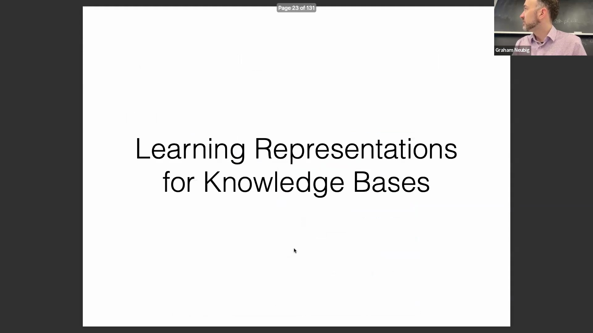
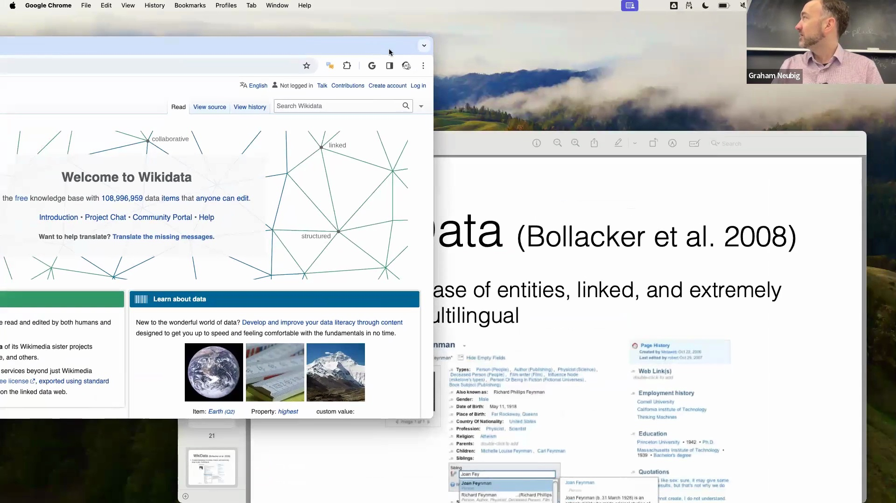
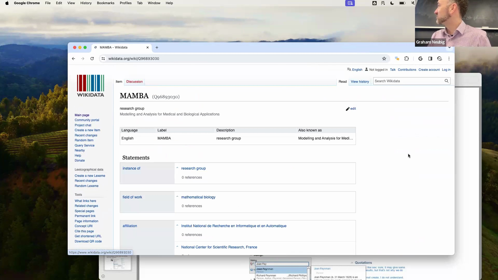