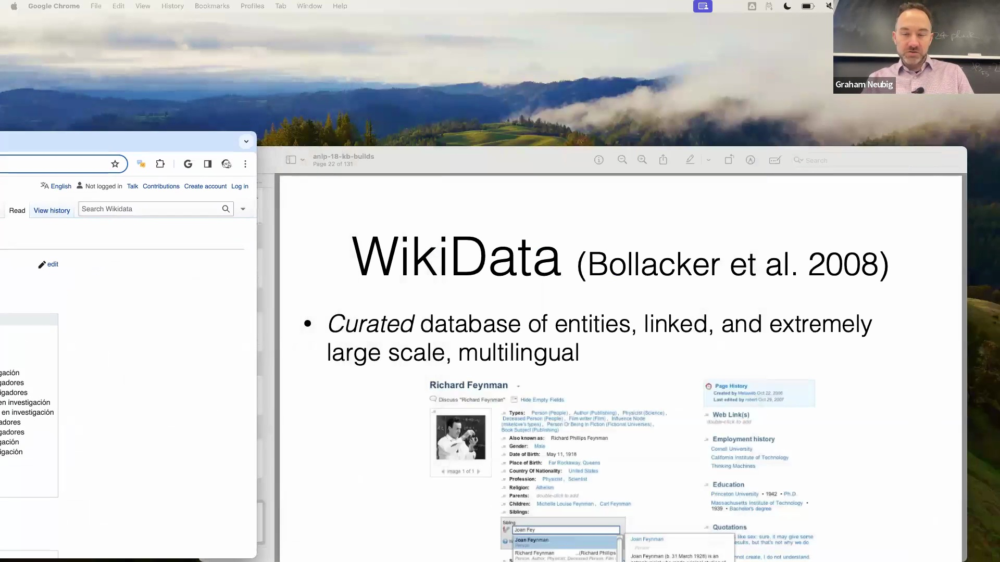
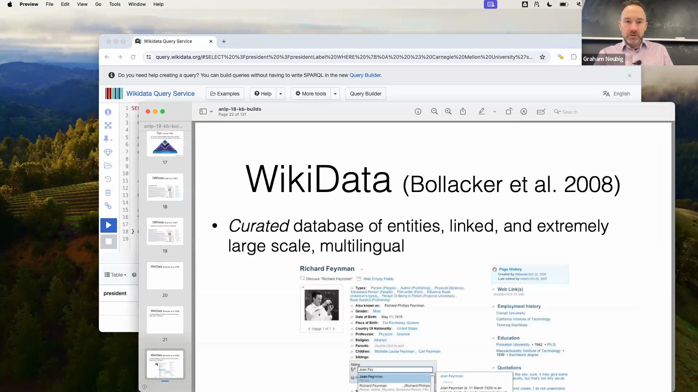
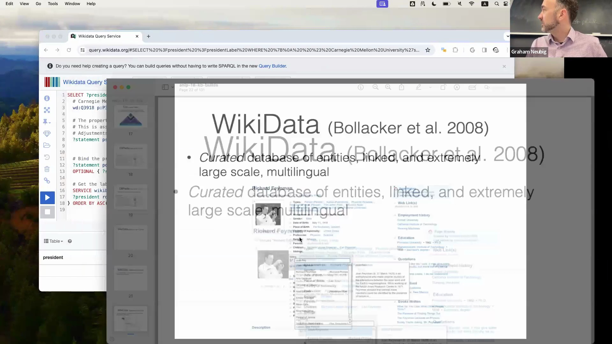
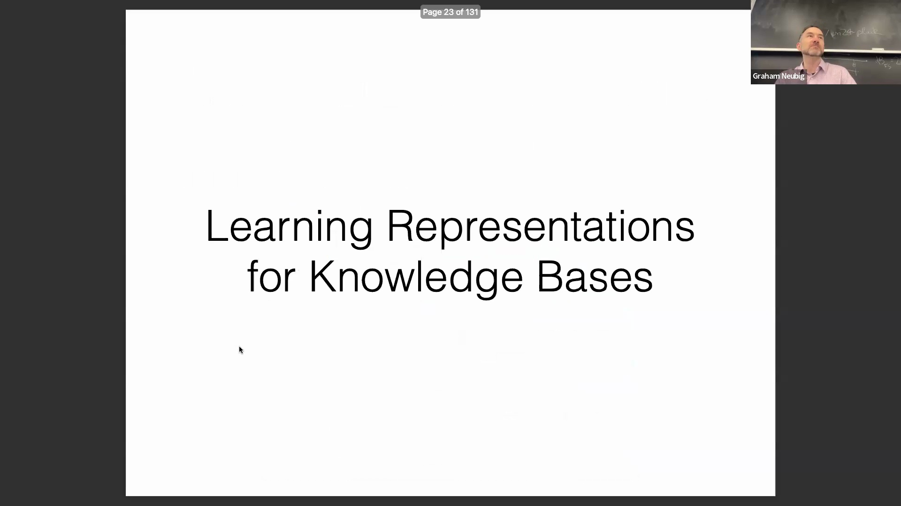

## 探索 Wikidata 图结构
讨论进一步深入探讨了现代知识图谱(Knowledge Graph)的组织方式。实体(Entity)充当节点(Node)，连接它们的边(Edge)则明确标注了关系类型(Relation Type，例如“是……的实例”)，这些边将具体实体链接至更广泛的类别节点。像 Wikidata 这类平台的一个显著特征是其强大的多语言支持(Multilingual Support)；每个实体和关系均被映射至数十种语言，从而实现无缝的跨语言查询(Cross-lingual Query)与全球范围内的可访问性。该数据库的覆盖粒度极为精细，甚至延伸至小型学术机构或个人实体。例如，通过聚合数学谱系项目(Mathematics Genealogy Project)等历史数据集，系统能够保存并关联详尽的学术谱系(Academic Genealogy)，包括博士毕业院校与导师网络。这充分展示了结构化知识库如何持续从各类长期存在的数据源中摄取(Ingest)数据并构建互联。

## 使用 SPARQL 查询知识库
为使这些结构化数据库发挥实际效用，业界采用了专门的查询语言。SPARQL 是查询知识图谱的标准接口，其功能类似于传统关系型数据库(Relational Database)中的 SQL。它允许用户沿图边进行遍历，根据特定谓词(Predicate)过滤节点，并施加时间或类别约束(Constraint)。尽管编写语法正确的 SPARQL 查询具有一定挑战性（即便是 AI 辅助工具也常遇瓶颈），但掌握该语言将赋予用户精确且确定性(Deterministic)的数据检索能力，这是系统化知识提取(Knowledge Extraction)的基石。

## 结构化查询相较于语言模型的优势
引入知识库的一个核心动机在于其在处理复杂聚合(Complex Aggregation)与逻辑过滤(Logical Filtering)任务时的高可靠性。生成式语言模型(Generative Language Model)在处理需要精确枚举(Precise Enumeration)、空间推理(Spatial Reasoning)或多跳过滤(Multi-hop Filtering)的查询时往往表现欠佳，例如“列出所有出生在密西西比河以东的美国总统”。当大语言模型(Large Language Model, LLM)被要求生成大量精确数据时，常出现计数错误、地理边界误判或产生幻觉(Hallucination)。相比之下，正确构建的 SPARQL 查询能够以确定性方式遍历图结构，应用精确过滤器，并返回高保真(High-fidelity)且可验证的结果，从而避免了概率性文本生成(Probabilistic Text Generation)中固有的推理不一致(Reasoning Inconsistency)问题。

## 解决知识库的不完整性问题
尽管知识库规模庞大，但其本质上仍存在不完整性(Incompleteness)。以历史数据集 Freebase 为例，它表现出严重的稀疏性(Sparsity)，超过 70% 的人物实体缺失出生日期等基本属性(Property)。虽然知名人物通常拥有详尽记录，但长尾实体(Long-tail Entity)或涉及隐私的实体不可避免地面临数据覆盖不足的问题。这一结构性缺陷推动了自动化关系抽取(Relation Extraction)领域的深入研究，相关模型通过扫描非结构化文本(Unstructured Text)来识别、验证并补全缺失的图边。该方法对于扩充通用知识库(General-purpose Knowledge Base)，以及构建传统众包(Crowdsourcing)难以全面覆盖的高度专业化领域特定图谱(Domain-specific Knowledge Graph)至关重要。

## 知识图谱的嵌入表示学习
为实现结构化数据与神经网络的融合，研究人员致力于为知识图谱组件学习稠密向量表示(Dense Vector Representation)。借鉴 Word2Vec 的核心洞见（即向量空间运算可捕捉语义关系，如性别或单复数变化），现代嵌入技术旨在将图三元组(Graph Triplet)映射至连续向量空间(Continuous Vector Space)中。一种广泛采用的方法将关系建模为加法几何变换(Additive Geometric Transformation)：头实体(Head Entity)的向量加上关系向量(Relation Vector)，应近似等于尾实体(Tail Entity)的向量。此类模型采用基于间隔的铰链损失(Margin-based Hinge Loss)进行训练，通过最小化有效三元组(Valid Triplet)间的距离来优化嵌入空间，同时将破坏的(Broken)或错误三元组推离至更远处。

## 用于关系预测的早期神经网络架构
知识图谱嵌入(Knowledge Graph Embedding)技术的发展，历来是众多顶尖人工智能(AI)研究者的重要试验场。早期方法逐渐超越了简单的向量加法，引入了多层感知机(Multilayer Perceptron, MLP)和基于张量分解(Tensor Decomposition)的模型等神经网络架构。这些方法利用专用矩阵或多维张量，以捕捉实体对与关系类型之间复杂的非线性交互(Non-linear Interaction)。通过学习参数化变换(Parameterized Transformation)而非仅依赖固定的几何平移，这些早期神经模型显著提升了链接预测(Link Prediction)的准确性，并为将符号知识(Symbolic Knowledge)与深度学习流水线(Deep Learning Pipeline)相融合奠定了坚实基础。