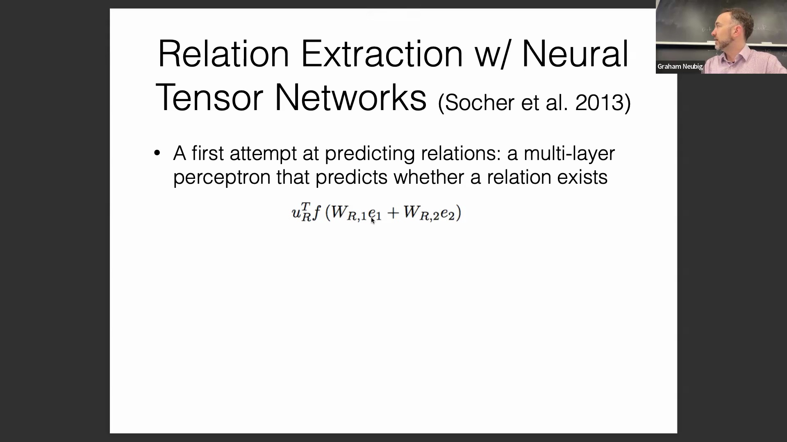
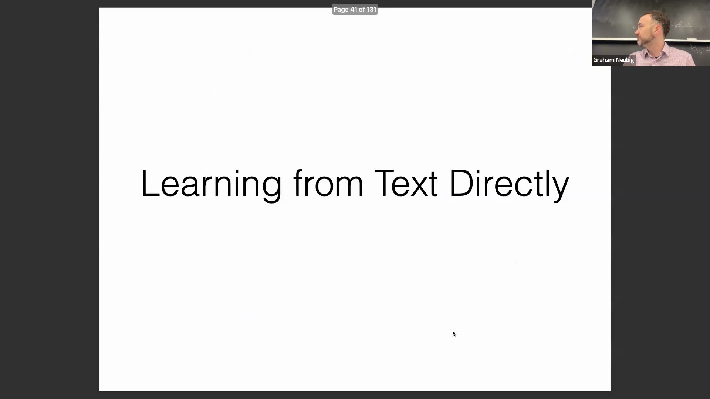
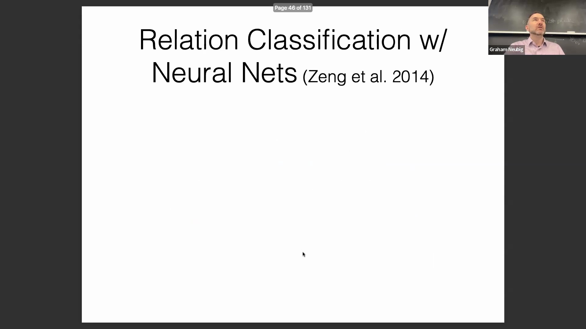
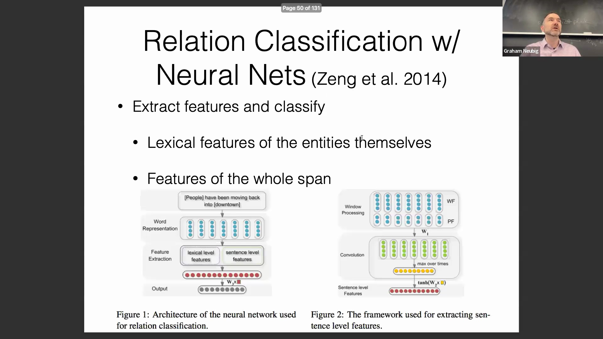
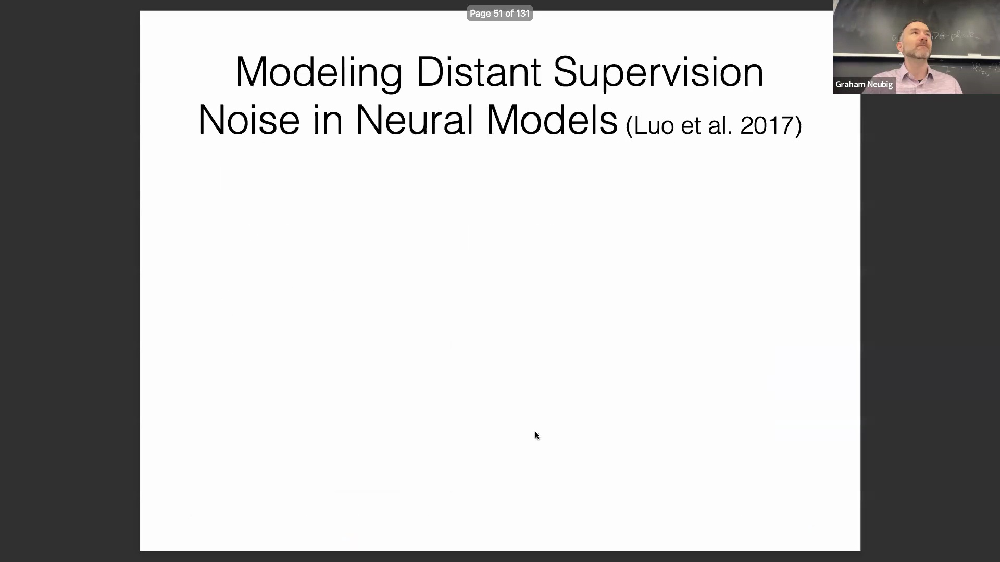
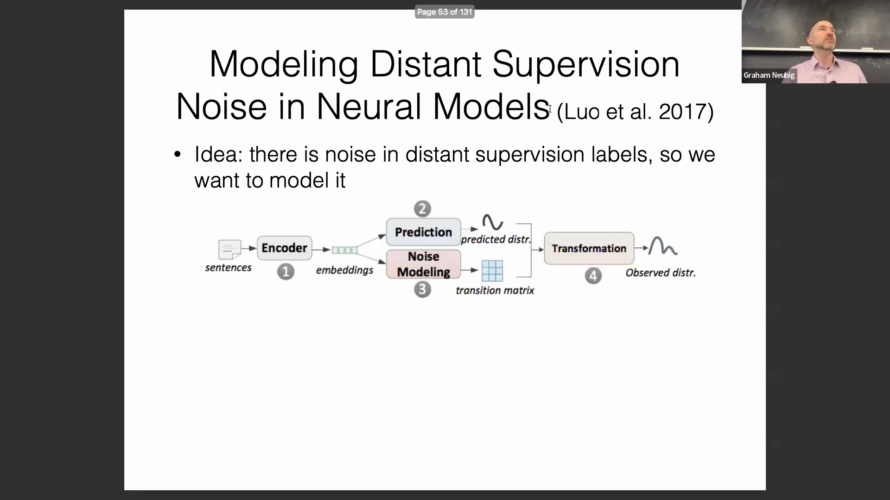
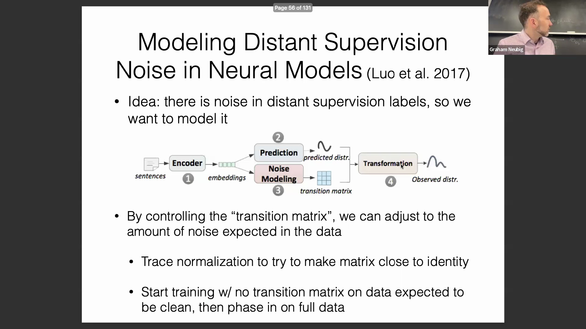
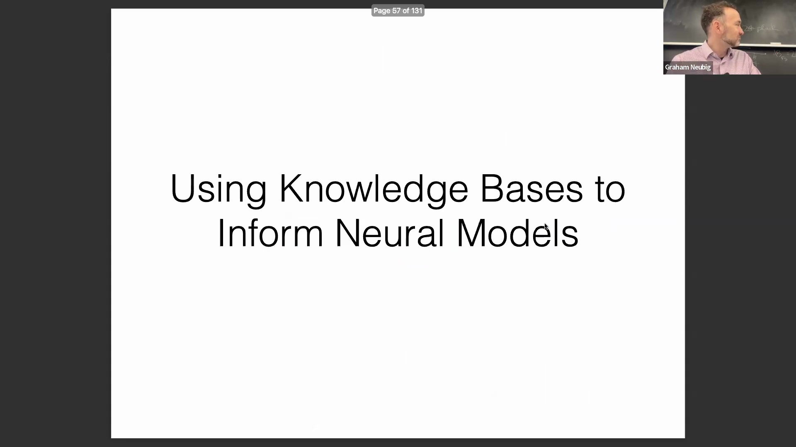

## 预测关系的神经网络架构
预测实体间关系的早期方法采用神经网络，通过关系两侧的专用矩阵对实体嵌入(Entity Embedding)进行处理。将处理后的嵌入输入非线性层(Non-linear Layer)，并将最终输出向量经 sigmoid 函数(sigmoid function)激活后，模型即可估算特定关系存在的概率。该领域的一项显著进展是神经张量网络(Neural Tensor Network, NTN)，它引入了双线性特征提取器(Bilinear Feature Extractor)来计算变换后嵌入之间的点积(Dot Product)。尽管该架构与注意力机制(Attention Mechanism)存在相似之处，且将双线性特征与标准多层感知机(Multilayer Perceptron, MLP)相结合，但实践证明其参数规模过于庞大。因此，该领域逐渐转向更简单高效的模型，主要依赖实体表示之间的线性投影(Linear Projection)。

## 用于自动生成数据的远程监督
关系抽取(Relation Extraction)领域的一个关键发展是远程监督(Distant Supervision)的引入，这是一种极具影响力的大规模合成训练数据(Synthetic Training Data)生成技术。该方法通过将现有知识库三元组(Knowledge Base Triplet)与非结构化文本(Unstructured Text)进行对齐，自动将任何同时提及两个目标实体的句子标记为该关系的正例(Positive Example)。例如，若知识库中记录 Steven Spielberg 是《拯救大兵瑞恩》的导演，则任何同时包含这两个实体的句子都会被自动赋予相应标签。这种方法本质上能以极低成本构建海量数据集，在无需人工标注(Human Annotation)的情况下，实现了结构化知识与自然语言处理的无缝对接。

## 可扩展性挑战与轻量级分类
尽管远程监督十分实用，但它也引入了显著的标签噪声(Label Noise)，因为文本中的实体共现(Entity Co-occurrence)并不能保证存在精确的语义关系（例如，需区分一般隶属关系与具体的导演职务）。此外，若为执行关系抽取而在整个互联网上运行大语言模型(Large Language Model, LLM)，其计算成本将难以承受。为解决这一问题，研究人员开发了轻量级、基于特征的神经分类器(Lightweight, Feature-based Neural Classifier)。现代实现通常借助 RoBERTa 或 Mistral 等高效模型，从实体跨度(Entity Span)的边界提取上下文嵌入(Contextual Embedding)。这些词元级(Token-level)表示随后被拼接(Concatenate)，并输入至一个简单的多层感知机(Multilayer Perceptron, MLP)中以预测关系类型，从而为庞大的生成式模型(Generative Model)提供了一种高度可扩展且经济高效的替代方案。

## 使用转移矩阵建模噪声标签
一个关键的研究方向专注于显式建模(Explicit Modeling)并缓解远程监督数据集中固有的噪声。一种有效的策略采用双数据集策略(Dual-dataset Strategy)：结合一个小规模人工构建的高质量数据集与一个大规模自动生成的噪声标签集。该模型引入了一个专门的噪声建模层，其中包含一个可学习的转移矩阵(Transition Matrix)。该矩阵对分类器的预测概率进行变换，通过校正初始概率分布(Probability Distribution)来修正系统性的标注错误(Annotation Error)。通过学习噪声如何扭曲真实的标签分布(Label Distribution)，模型能够动态调整训练信号(Training Signal)，从而在监督信号不完美的情况下依然保持强鲁棒性(Robustness)。

## 迹归一化与更广泛的适用性
为防止转移矩阵对噪声过拟合(Overfitting)或退化为任意变换，研究中引入了迹归一化(Trace Normalization)技术。这种正则化方法(Regularization Method)约束矩阵尽可能接近单位矩阵(Identity Matrix)（即恒等映射(Identity Mapping)），体现了这样一种先验假设(Prior Assumption)：尽管标注可能存在噪声，但大多数预测结果本身应当是正确的。优化过程在迹归一化约束与标准损失最小化(Loss Minimization)之间寻求平衡，从而有效平滑输出分布(Output Distribution)。这一噪声建模框架的应用远不止于关系抽取，它为任何依赖大规模、标注不完美(Imperfectly Labeled)数据集的机器学习任务，提供了一种通用范式(General Paradigm)。

## 总结与向知识增强模型的过渡
对知识库构建与关系抽取的探索，揭示了该领域从复杂的神经张量网络(Neural Tensor Network)向更精简的嵌入方法(Embedding Method)的演进，同时也凸显了远程监督在连接结构化数据与非结构化文本方面的关键作用。通过开发轻量级分类器与先进的噪声缓解技术(Noise Mitigation Technique)，研究人员已建立起用于大规模抽取关系知识(Relational Knowledge)的稳健流水线(Robust Pipeline)。随着这些构建和扩充知识库的基础方法日益成熟，研究重心自然转向下一个关键阶段：如何利用这些结构化知识库来直接指导、约束并增强神经语言模型(Neural Language Model)，即向知识增强模型(Knowledge-enhanced Model)的过渡。
