## 利用现有词典改进嵌入(Embedding)
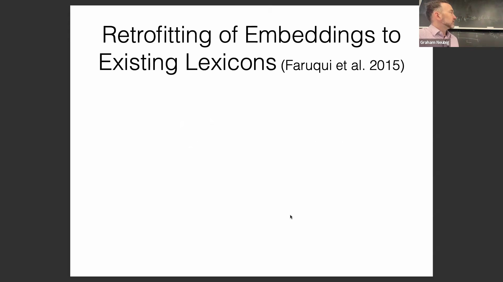
提升语言表示(Language Representation)的第一种方法涉及利用外部词典(External Lexicon)或知识图谱(Knowledge Graph)对现有嵌入进行修正。该技术通常应用于 Word2Vec 等非上下文嵌入(Non-contextual Embedding)，并采用具有双重目标的后处理变换(Post-processing Transformation)。其中的正则化项(Regularization Term)确保更新后的嵌入与原始初始值保持相近，同时拉近语义邻居(Semantic Neighbor)（如通过 WordNet 识别的同义词）之间的距离，并推远反义词之间的距离，从而在整合词汇知识(Lexical Knowledge)与保留原始嵌入空间(Embedding Space)之间实现平衡。

## 实体链接(Entity Linking)与处理多种实体表述形式
该方法可扩展至现代神经网络(Neural Network)模型和知识图谱嵌入(Knowledge Graph Embedding)，以处理现实世界中的实体变体(Entity Variant)。例如，指代“乔·拜登”的同一人物在文档中可能以多种形式出现（如 Joseph Biden、Joseph R. Biden、第46任总统等）。 
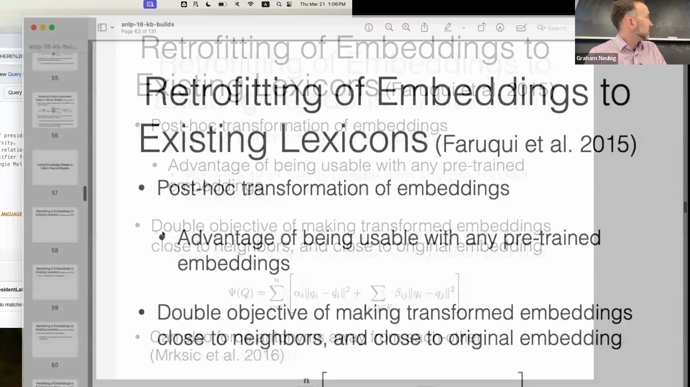

通过执行实体链接并识别这些变体字符串(Variant String)，可以显式地引导模型将同一实体的所有实例映射至更相近的嵌入表示(Embedding Representation)中。这减少了不必要的语义区分(Semantic Distinction)，并显著提升了问答(Question Answering)等下游任务(Downstream Task)的性能。

## 跨度嵌入(Span Embedding)与共指消解(Coreference Resolution)
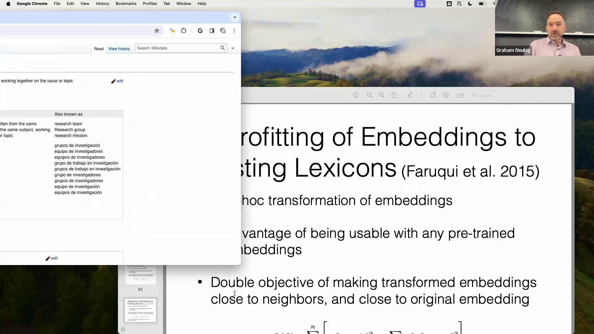

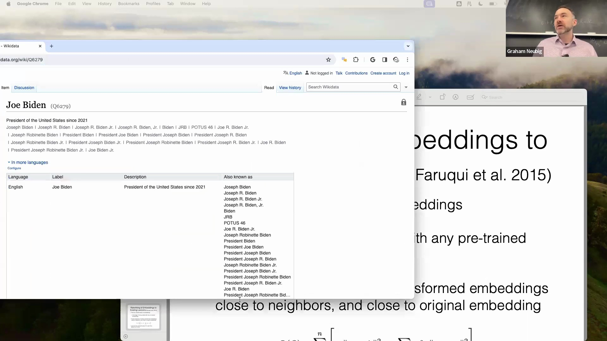
当模型遇到缺乏单一预训练嵌入(Pre-trained Embedding)的多词实体(Multi-word Entity)或短语时，会面临一个常见挑战。 
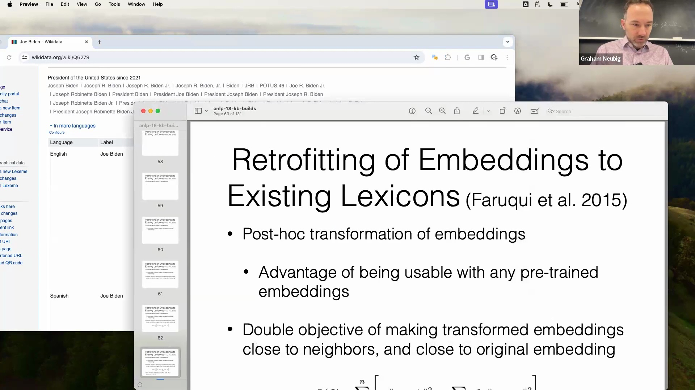
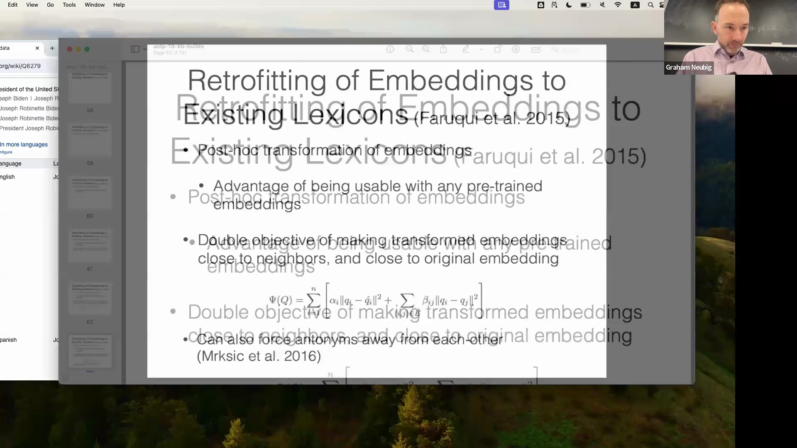

解决方案在于共指消解和显式的跨度(Span)建模。共指消解用于识别不同的文本跨度何时指向同一个底层实体(Underlying Entity)（例如，识别出“乔·拜登”和后文的“拜登”指向同一个人）。 

为了生成鲁棒性(Robust)强的跨度嵌入，一种广泛采用的方法是从任意给定的词元(Token)跨度中提取三个向量：起始边界(Start Boundary)的嵌入、结束边界(End Boundary)的嵌入，以及跨度内所有词元的平均嵌入(Mean Embedding)。 
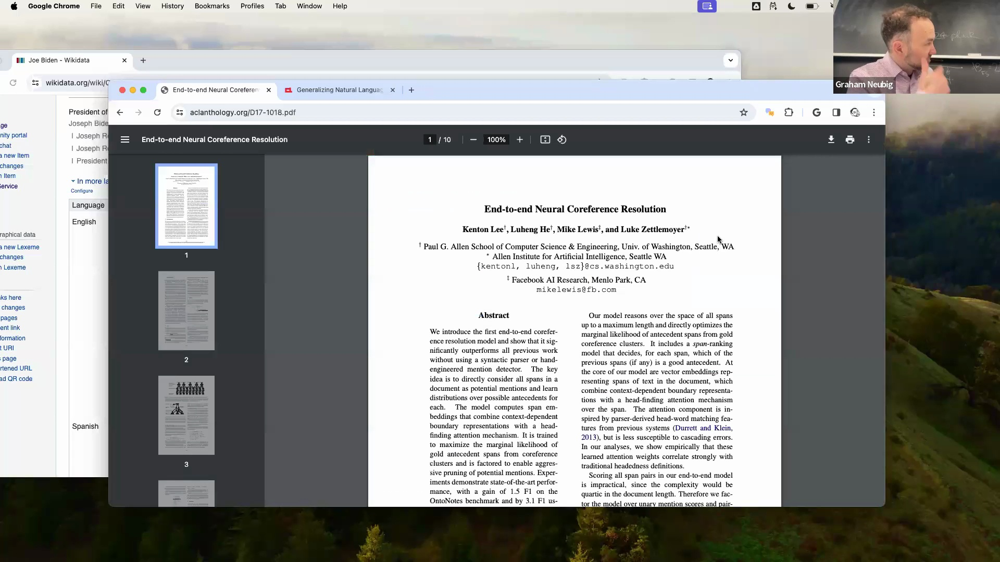
这三个表示经过拼接(Concatenation)后，通过一个神经变换层(Neural Transformation Layer)，从而生成统一的、具备上下文感知能力(Context-aware)的跨度嵌入。

## 跨度建模(Span Modeling)的应用

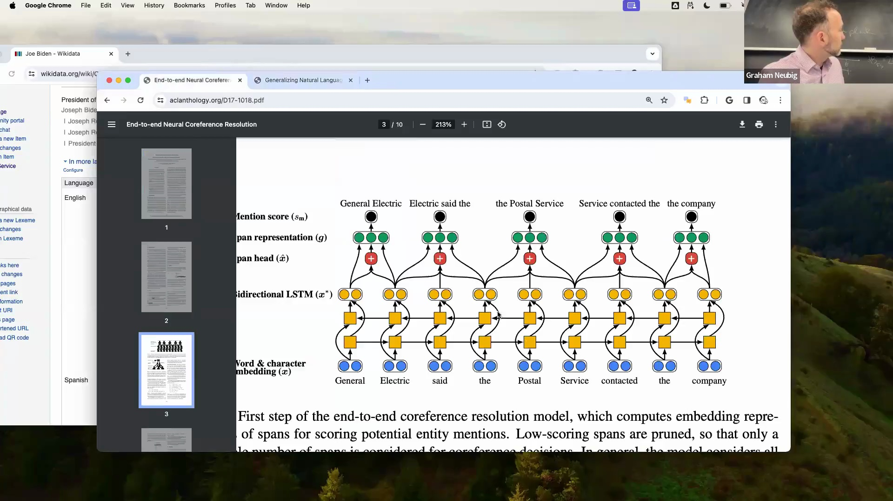
生成后，这些跨度嵌入可用于多种自然语言处理(NLP)任务。它们既可用于查询外部知识库(External Knowledge Base)，也可将成对的跨度嵌入输入分类器(Classifier)，以预测它们是否对应同一实体，从而判定共指关系(Coreference Relation)。 

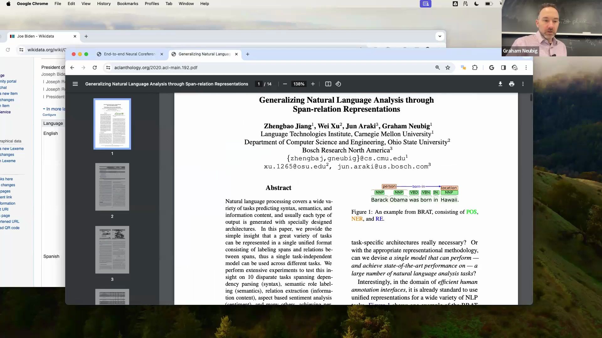
这种对跨度及其相互关系进行建模的统一框架，为解决包括词性标注(Part-of-Speech Tagging)、命名实体识别(Named Entity Recognition, NER)和关系抽取(Relation Extraction)在内的多样化任务，提供了多功能的主干架构(Backbone Architecture)。

## 向语言模型(Language Model)注入知识
另一个关键领域是将结构化知识(Structured Knowledge)直接集成到语言模型中。一种直观的方法是，从知识图谱中检索相关事实，并通过提示(Prompting)技术将其注入模型。 
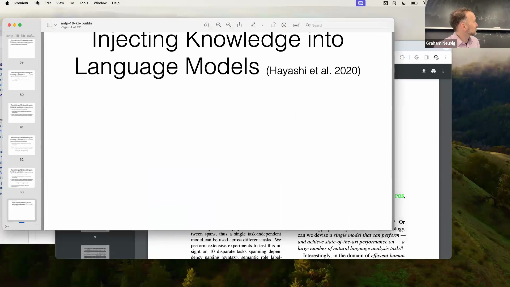
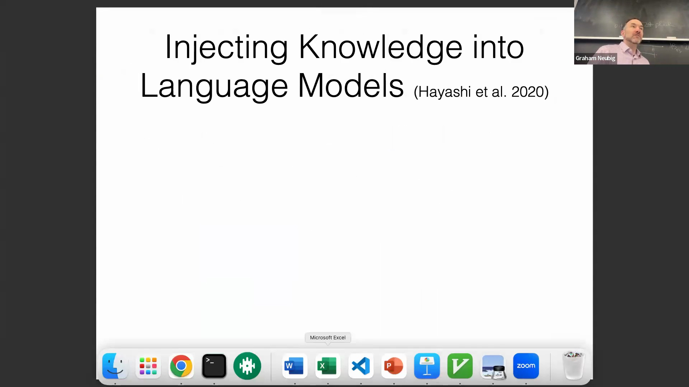
然而，提示方法在处理低频或长尾实体(Long-tail Entity)时往往表现不佳，因为模型难以从学习不足的表示中进行有效泛化(Generalization)。为克服这一局限，研究人员提出生成结构化的占位符(Placeholder)，而非直接输出原始文本。模型不再直接预测单词，而是输出诸如 `[birth name]` 或 `[family name]` 之类的语义标签。 
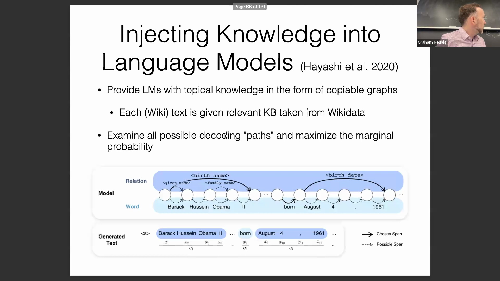

## 模板化生成(Templated Generation)与训练目标(Training Objective)
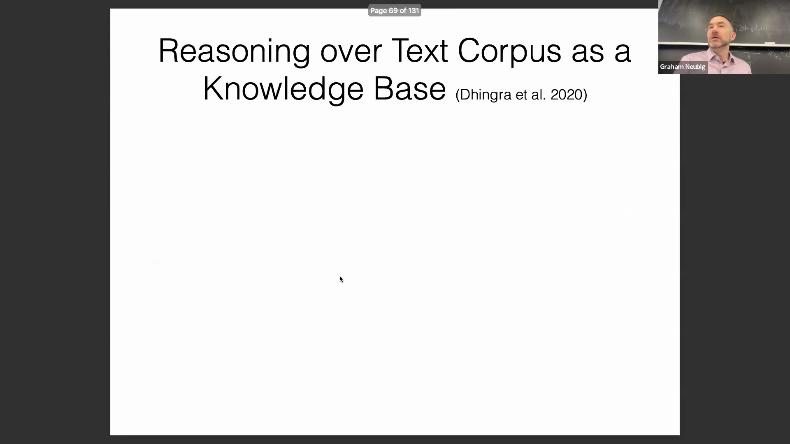
在模型预测出这些占位符后，一个后处理系统(Post-processing System)会利用知识库中经过验证的数据对其进行填充。例如，在起草人物简介时，模型可以稳定地预测出如 `[birth name], born [birth date]` 之类的固定模板结构。由于这些模式具有高度一致性，该方法能够生成基于事实的高置信度(High-confidence)输出，从而显著缓解模型幻觉(Model Hallucination)问题。训练过程中的主要挑战在于设计目标函数(Objective Function)，即确定何时以及如何替换特定的文本跨度。通过对各种可能的替换策略进行边缘化处理(Marginalization)，该问题得到了有效解决，从而使模型能够学习最优的模板利用方式。