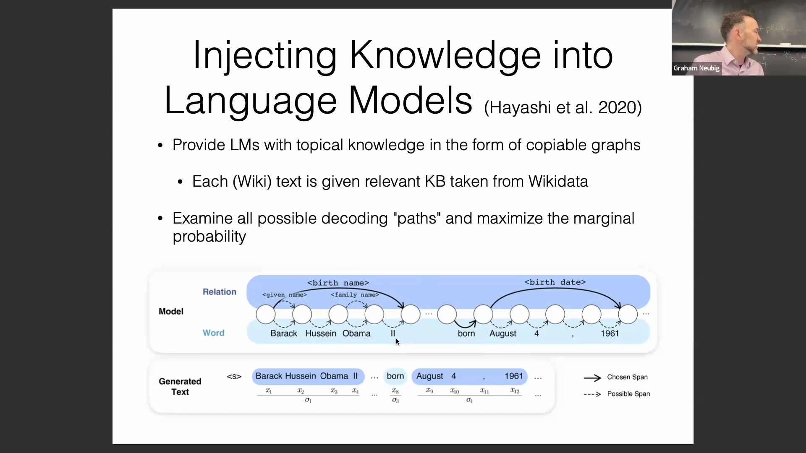
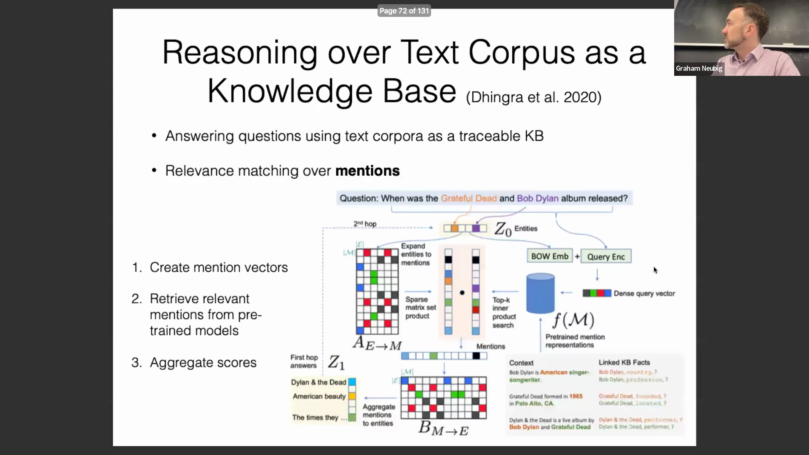
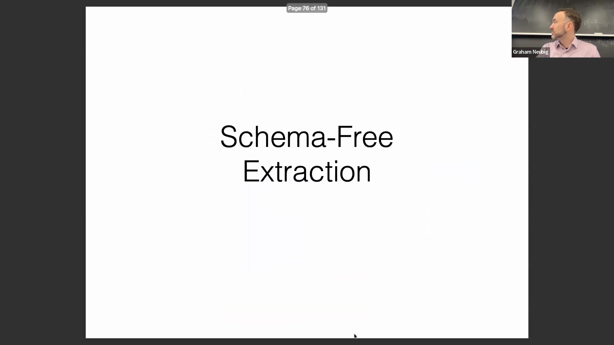
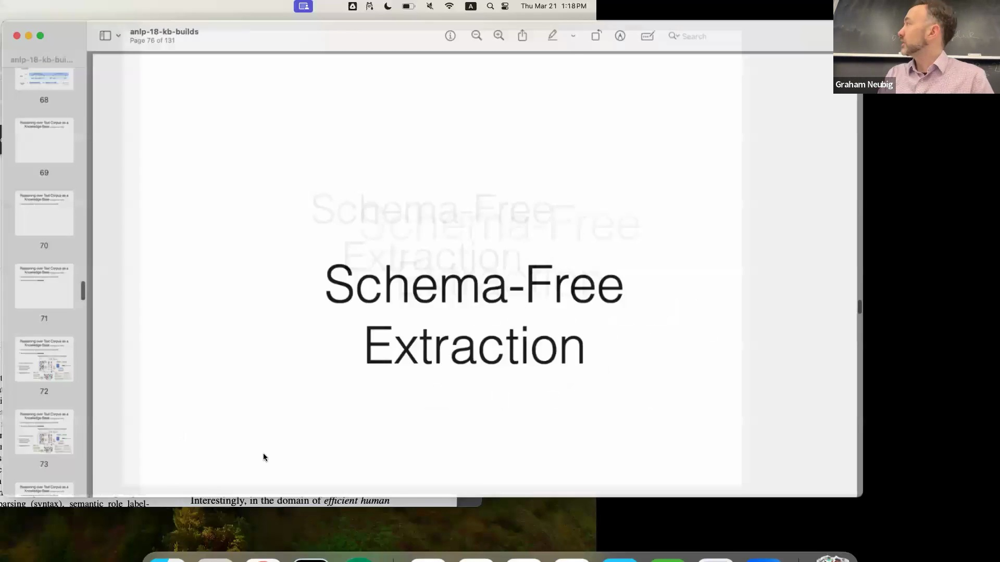
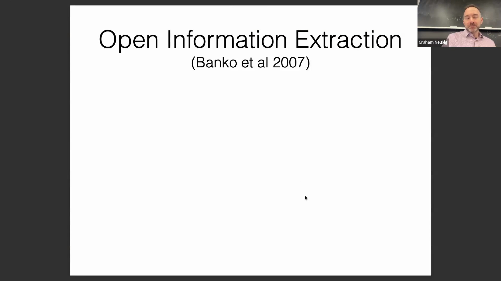
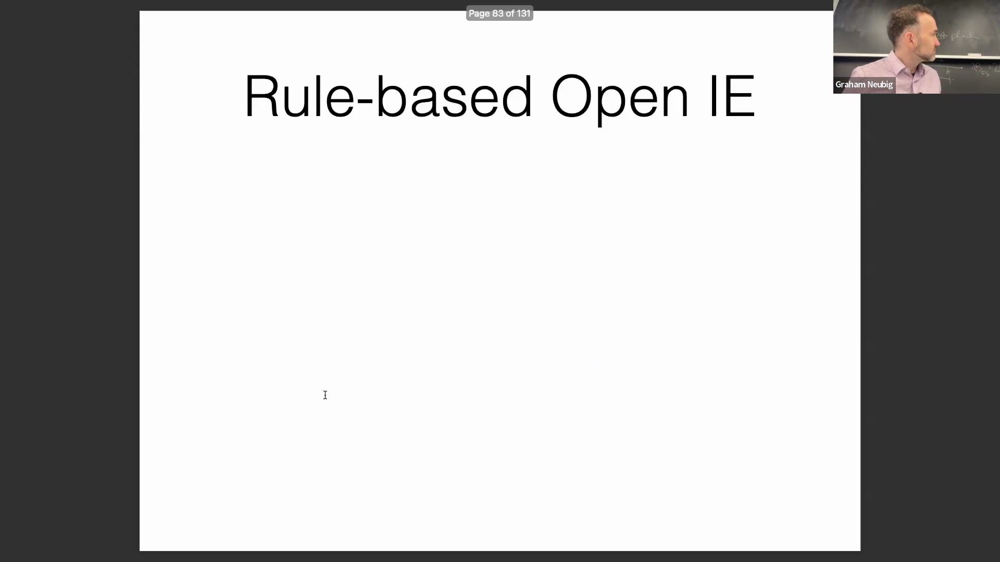
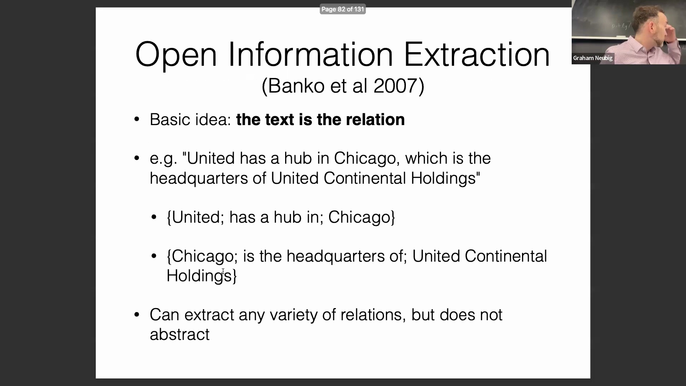
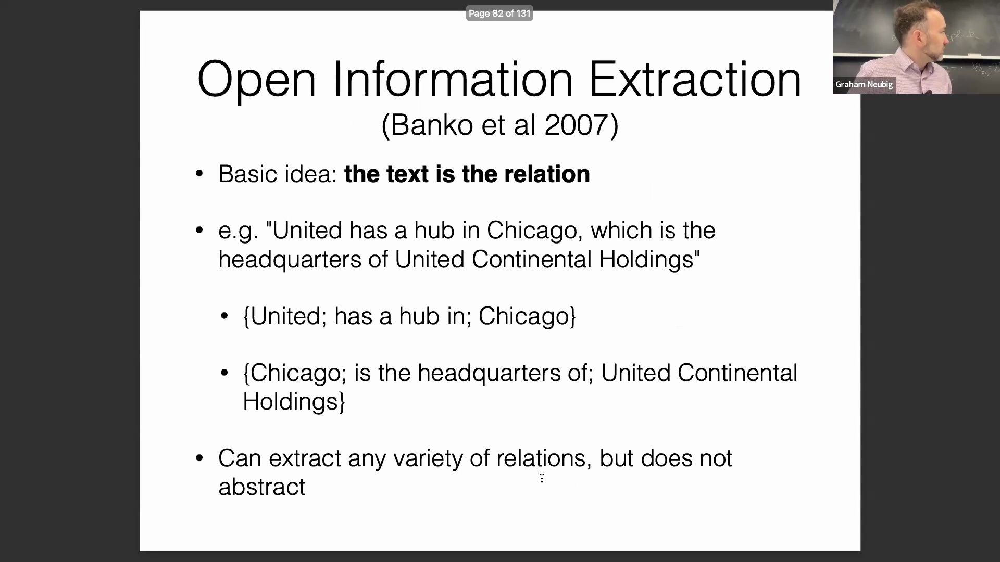
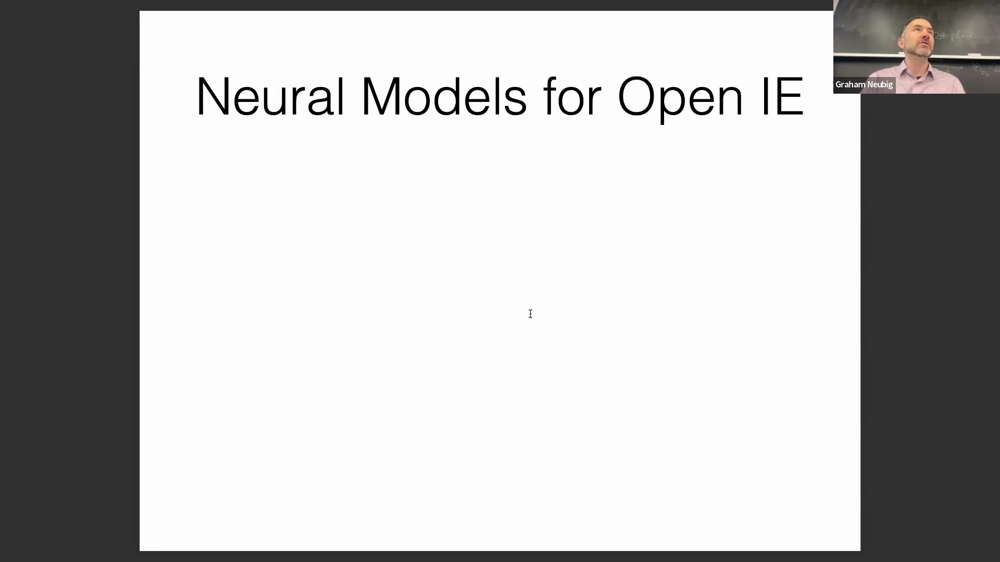

## 将文本语料库作为可追溯知识库进行推理

现代自然语言处理(Natural Language Processing, NLP)和检索增强生成(Retrieval-Augmented Generation, RAG)系统面临的一个长期挑战是：如何以传统应用于结构化知识库(Structured Knowledge Base)的精度，对非结构化文本语料库(Unstructured Text Corpus)进行推理。一种有效的方法通过对实体提及(Entity Mention)进行相关性匹配，将大型文本集合视为可追溯的知识存储库。该方法构建“提及向量”(Mention Vector)，以聚合特定实体在整个语料库中的所有出现实例。通过预训练模型为所有提及生成稠密嵌入(Dense Embedding)，系统能够高效检索上下文证据(Contextual Evidence)。

该检索机制依赖于专门优化的稠密查询向量(Dense Query Vector)，用于精准定位能够解答复杂问题的提及。例如，查询“《感恩至死》乐队与鲍勃·迪伦的专辑何时发行？”会被编码为特定实体的嵌入表示。模型经过训练，能够将这些查询向量与语料库嵌入进行匹配，优先返回包含最相关事实信息的句子，从而有效解答实体-关系查询(Entity-Relation Query)。

## 通过弱监督训练稠密检索模型
训练此类稠密检索(Dense Retrieval)架构需要海量标注数据，在实际应用中通常通过弱监督(Weak Supervision)技术来实现。借助现有的大规模知识图谱(Knowledge Graph)，研究人员无需人工标注即可自动生成监督信号(Supervision Signal)。例如，给定已知三元组(Triple)“史蒂文·斯皮尔伯格执导了《拯救大兵瑞恩》”，可通过程序自动生成基于模板的问题（如“谁执导了《拯救大兵瑞恩》？”）。随后，模型在训练过程中会提升语料库（如维基百科）中目标实体与关系自然共现的句子嵌入权重。这使得合成生成的查询(Synthetically Generated Query)能够与其潜在的文本答案(Textual Answer)对齐，为知识增强的检索系统(Knowledge-Enhanced Retrieval System)提供了一种高度可扩展的训练范式(Training Paradigm)。

## 固定模式的局限性与无模式抽取

传统知识图谱（如 Wikidata）基于固定的预定义模式(Predefined Schema)运行。所有可能的关系（如“属于……的实例”(Instance Of)、“国籍”(Nationality)、“签名”(Signature)等）均由数据库策展人(Database Curator)事先设定。尽管这些静态模式在通用知识方面较为全面，但难以覆盖高度专业化、技术性强或快速发展的新兴领域。

随着应用向垂直领域(Domain-Specific Application)扩展，预先定义所有必需的实体或关系变得越来越不切实际。例如，针对大语言模型(Large Language Model, LLM)的技术属性“位置嵌入变体”极不可能出现在通用知识库中。这一局限性催生了无模式(Schema-free)抽取技术，其旨在从原始文本中联合发现(Jointly Discover)底层关系结构，并同步提取目标信息。

## 开放信息抽取（OpenIE）

在无模式抽取技术中，最主流的范式是开放信息抽取(Open Information Extraction, OpenIE)。OpenIE 不将文本映射到预定义本体(Predefined Ontology)，而是直接将实体之间的字面文本跨度(Literal Text Span)视为关系本身。例如，从“United has a hub in Chicago”中抽取的关系即为字面表述“has a hub in”。虽然该方法在无模式约束下能够捕捉细粒度的语言变化，但缺乏语义抽象(Semantic Abstraction)能力。同一事实的不同句法表述（如“Chicago is the headquarters of United Continental Holdings”）会被视为完全不同的关系，这使得跨文档的知识规范化(Knowledge Normalization)与聚合变得十分困难。

## 大规模基于规则与基于序列的抽取

为了在 Web 规模(Web-scale)上执行 OpenIE，基于规则的系统（如 TextRunner 和 Reverb）历来作为高效的基线(Baseline)。这些系统利用句法解析器(Syntactic Parser)强制执行语法约束，例如要求关系必须包含动词谓语(Verbal Predicate)，且实体必须是结构完整的名词短语(Noun Phrase)。由于基于规则的抽取计算成本低廉，且能保持较高的精确率(Precision)与召回率(Recall)，它在处理海量语料库时依然极具实用价值。后续研究将这些基于规则系统的高质量输出作为弱监督信号，用于训练速度更快、效率更高的序列到序列(Sequence-to-Sequence, seq2seq)神经模型，以更高效地复现信息抽取流程。

## 启发式验证与向神经模型的转变

OpenIE 面临的一个关键挑战是 Web 规模数据固有的噪声问题，抽取出的事实可能存在事实性错误(Factual Error)或语境误导(Contextual Misleading)。为缓解这一问题，系统采用启发式证据聚合(Heuristic Evidence Aggregation)与基于频率的过滤策略(Frequency-based Filtering)。其核心假设基于统计学原理：如果在大型语料库中极少观察到两个常见实体之间的特定关系，则该关系极可能是错误的；反之，频繁共现的模式则被视为可靠。这些启发式方法能有效剔除模型幻觉(Model Hallucination)或虚假抽取结果，提升整体的事实可靠性。

尽管启发式验证颇具价值，但其本质存在局限性，且高度依赖浅层统计信号。这推动了近期研究向能够捕捉更深层语义关系的神经 OpenIE 架构(Neural OpenIE Architecture)转型。然而，当前的主要瓶颈仍在于获取高质量、大规模的训练数据。学界正持续探索先进的弱监督、自训练(Self-training)与多跳推理(Multi-hop Reasoning)技术以弥合这一差距，推动信息抽取超越僵化的句法规则，迈向更鲁棒(Robust)且具备上下文感知能力(Context-aware)的新阶段。