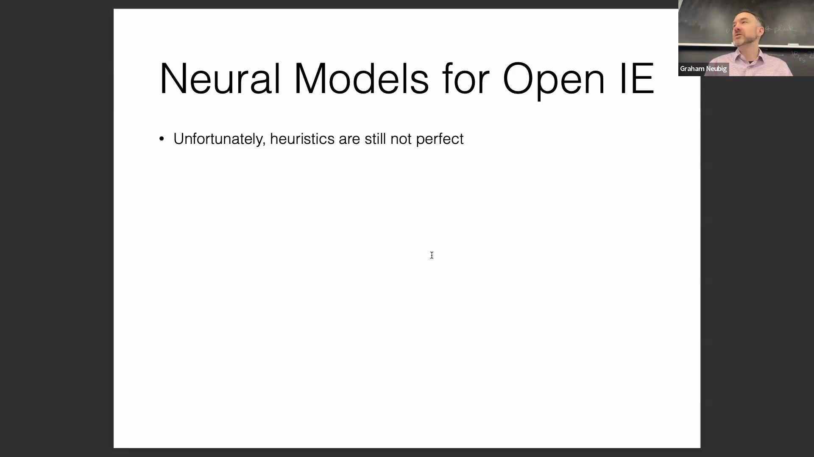
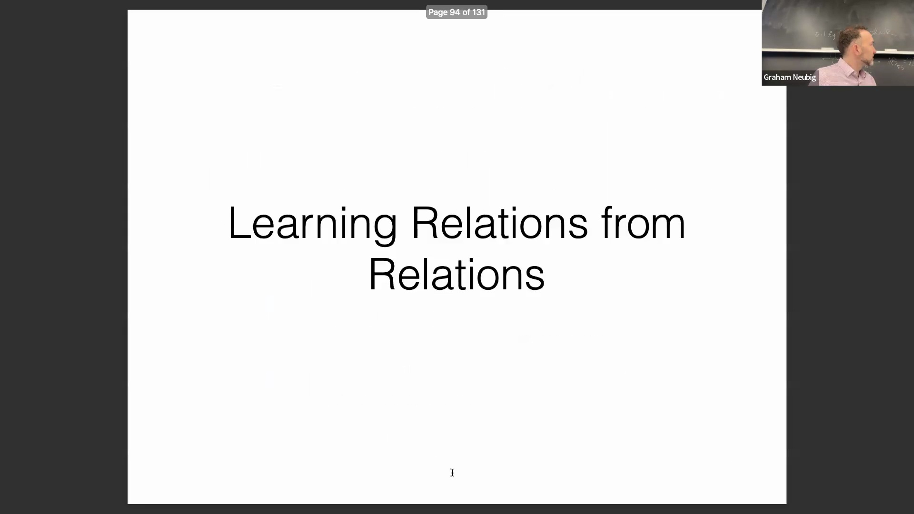
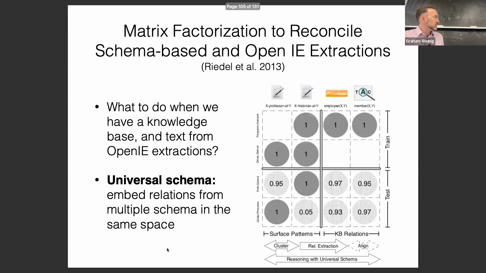
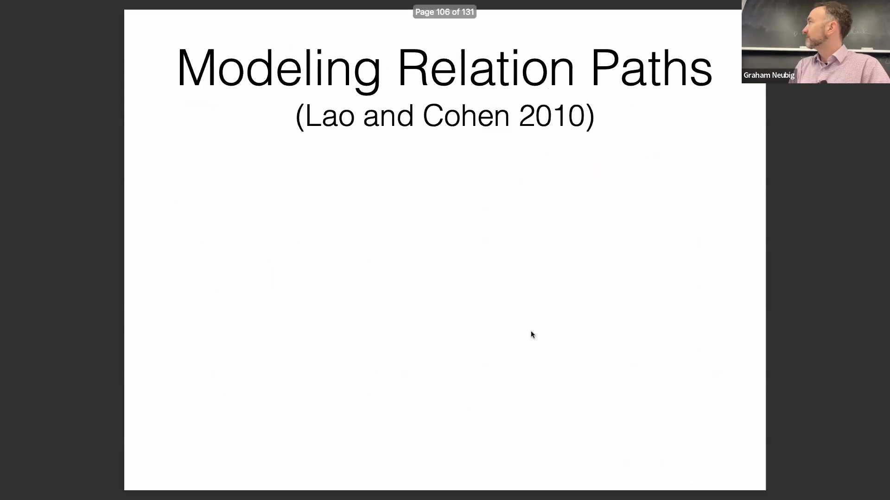
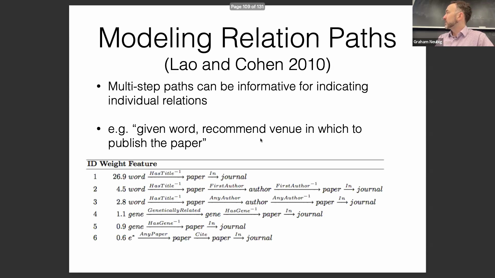
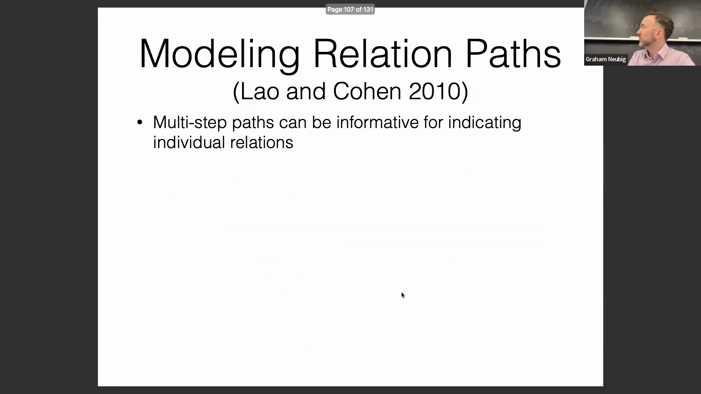
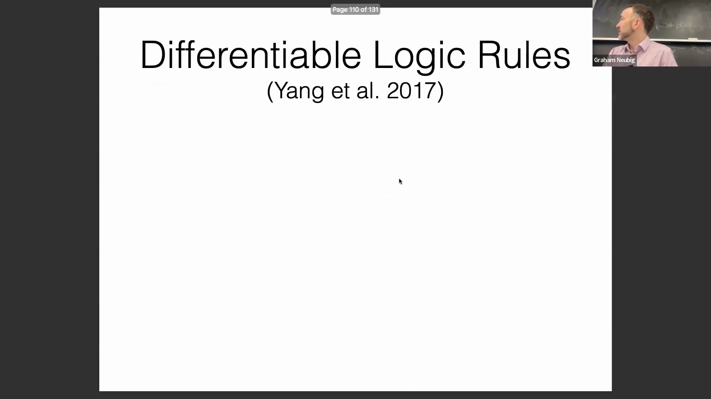
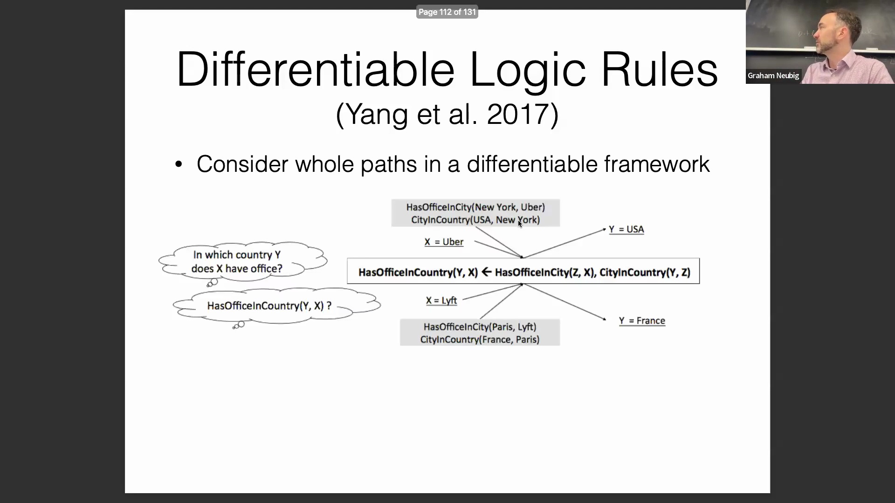

## 通过众包简化关系抽取(Relation Extraction)

传统上，由于标注界面(Annotation Interface)的复杂性，获取高质量的关系抽取训练数据一直充满挑战。要求众包标注员(Crowdsourced Annotator)手动选择头实体(Head Entity)、关系跨度(Relation Span)和尾实体(Tail Entity)通常需要大量的前期培训，且容易导致标注结果不一致。一种更有效的方法是将任务转化为简单、直观的问题。与其进行复杂的跨度选择，不如直接向标注员提出诸如“谁完成了某事？”的直接问题，或提示他们识别句子中的语义角色(Semantic Role)。这种简化显著降低了标注员的认知负荷(Cognitive Load)，从而能够快速构建大规模数据集，用于训练鲁棒的(Robust)监督式序列模型(Supervised Sequence Model)。

## 用于链接预测(Link Prediction)的张量分解(Tensor Factorization)

为了克服开放信息抽取(Open Information Extraction, OpenIE)缺乏抽象能力的问题，研究人员利用张量分解技术挖掘了知识图谱(Knowledge Graph)的内在结构。该方法将关系数据建模为三维张量(3D Tensor)，其中三个轴分别代表左实体(Left Entity)、右实体(Right Entity)和关系类型。已知事实标记为1，缺失或未验证的事实标记为0。通过对该张量进行低秩近似(Low-Rank Approximation)，模型能够最小化重构误差(Reconstruction Error)，从而有效地填补知识空白。原本标记为0但重构值接近1的条目，将被预测为潜在关系。这种数学方法使系统能够推断缺失的链接，并在不同关系间实现泛化(Generalization)，而无需完全依赖表层的文本模式。

## 用于多源知识集成的通用模式(Universal Schema)

基于张量推理，通用模式的概念将来自多个结构化知识库(Structured Knowledge Base)（如 Freebase、Wikidata、TAC KBP）的关系与非结构化的 OpenIE 抽取结果整合到一个共享嵌入空间(Shared Embedding Space)中。这一统一框架使模型既能利用知识图谱中高质量、人工整理(Curated)的数据，又能同时受益于从网络(Web)抽取的海量关系数据。通过对所有模式下的已知正负样本(Positive and Negative Samples)进行训练，模型能够预测那些在结构化数据库中缺乏条目的实体的关系存在性；在此情况下，模型将转而依赖来自 OpenIE 的文本证据。关键在于，这些预测可以追溯回原始源句子，从而实现人在回路(Human-in-the-Loop)的验证，并确保事实的可靠性。

## 多跳推理(Multi-hop Reasoning)与关系路径建模(Relational Path Modeling)

超越单一关系归纳，先进的知识推理专注于对多跳关系路径进行建模，以推断复杂的依赖关系。例如，为了给一篇论文推荐发表渠道，系统可以遍历诸如 `Keyword → Paper → Journal` 或 `Keyword → Paper → Author → Paper → Journal` 的路径。这些多步路径提供了极具表达力(Expressiveness)且富含上下文的信号，这是单一的成对关系(Pairwise Relation)所无法捕捉的。通过扩展并聚合这些路径，系统将其输入预测模型以识别高概率关系，从而有效利用知识图谱的传递性(Transitivity)与组合性(Compositionality)特征。

近期的进展使这种基于路径的推理实现了完全的端到端(End-to-End)可训练与可微分(Differentiable)，从而摆脱了僵化且脆弱的演绎逻辑规则(Deductive Logical Rules)。该框架并未强制要求绝对的真值条件(Truth Condition)，而是采用了一种概率化方法(Probabilistic Approach)：逻辑路径仅增加关系存在的可能性，而非绝对保证其成立。例如，一名学生“在 CMU 就读”这一事实与“从 CMU 毕业”高度相关，但仍存在例外情况。通过将逻辑约束松弛(Relaxation)为可微操作，模型能够学会稳健地权衡多条关系路径，从而有效处理现实世界中的噪声与反例。
