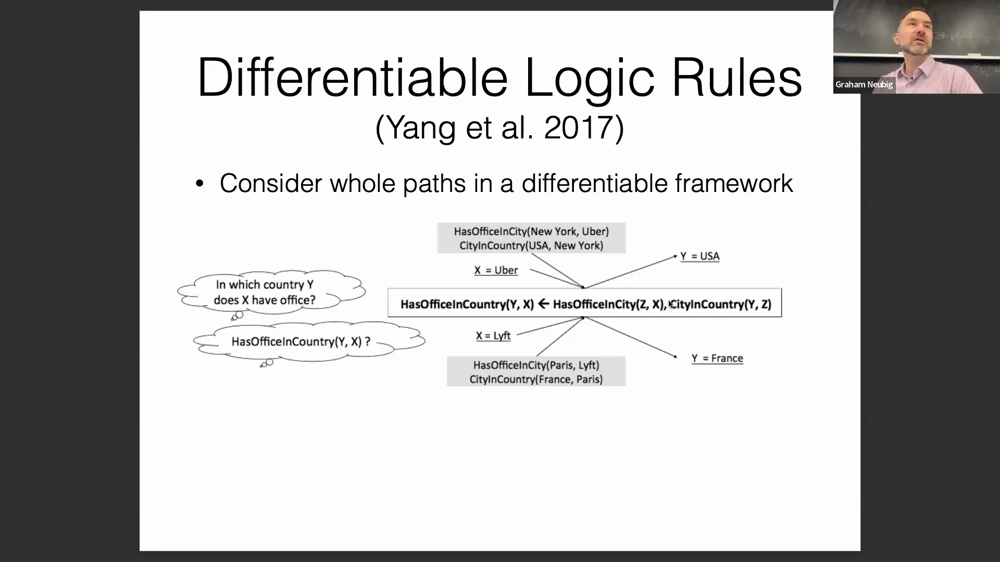
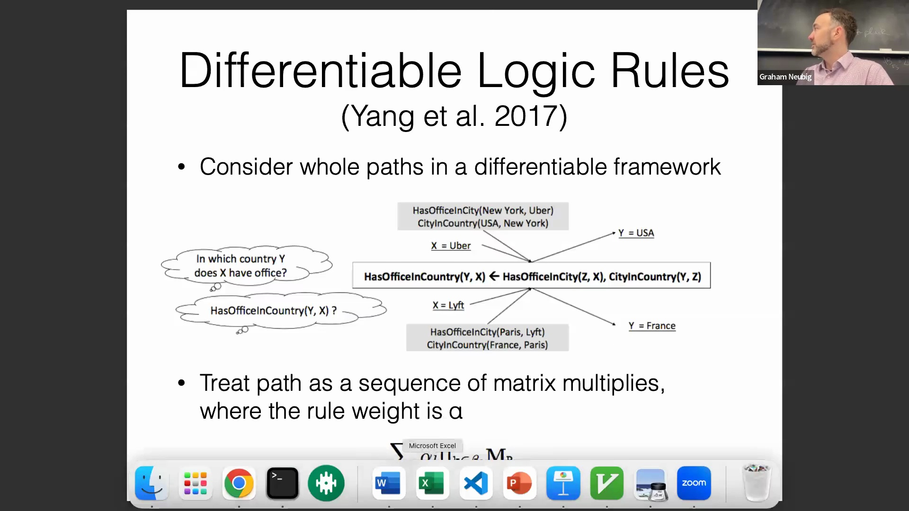
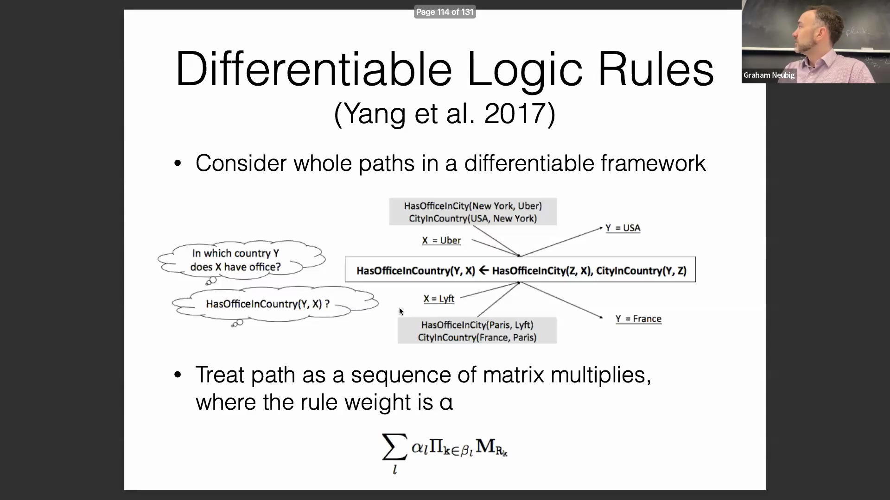
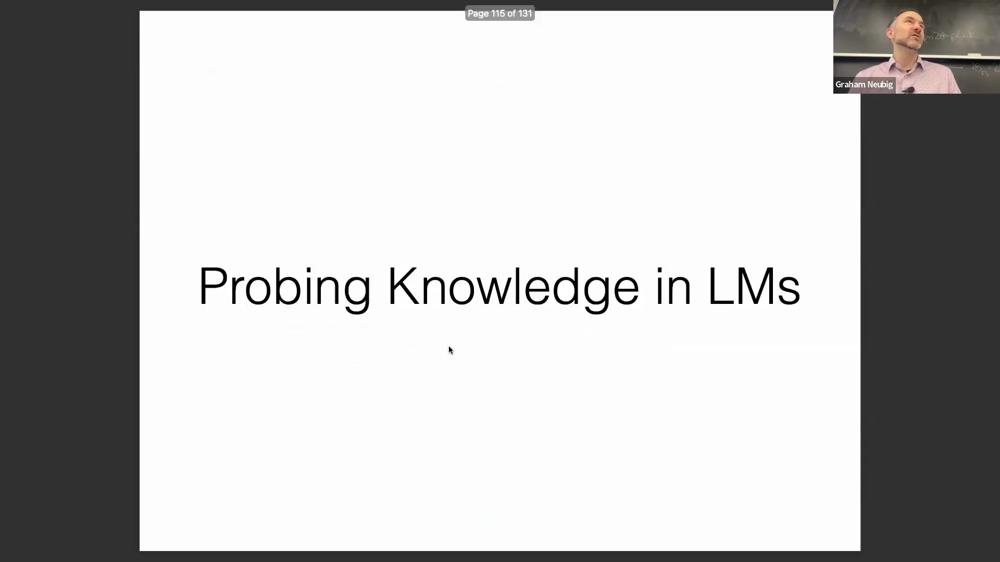
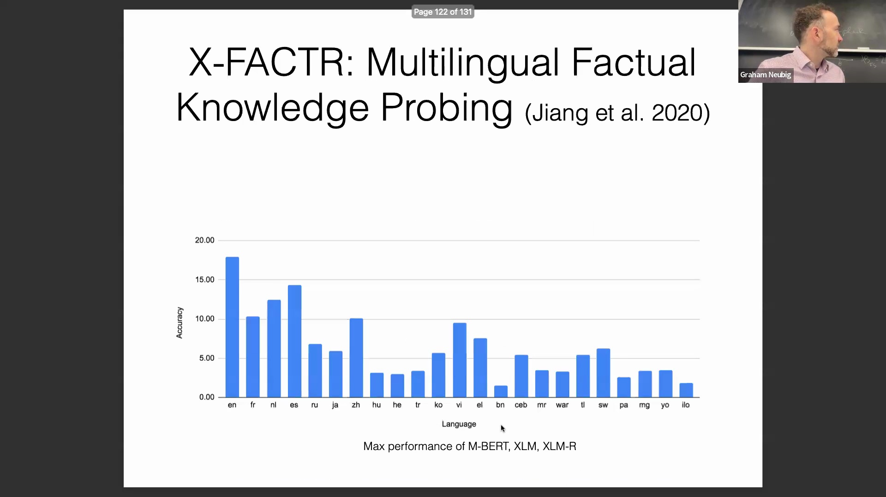
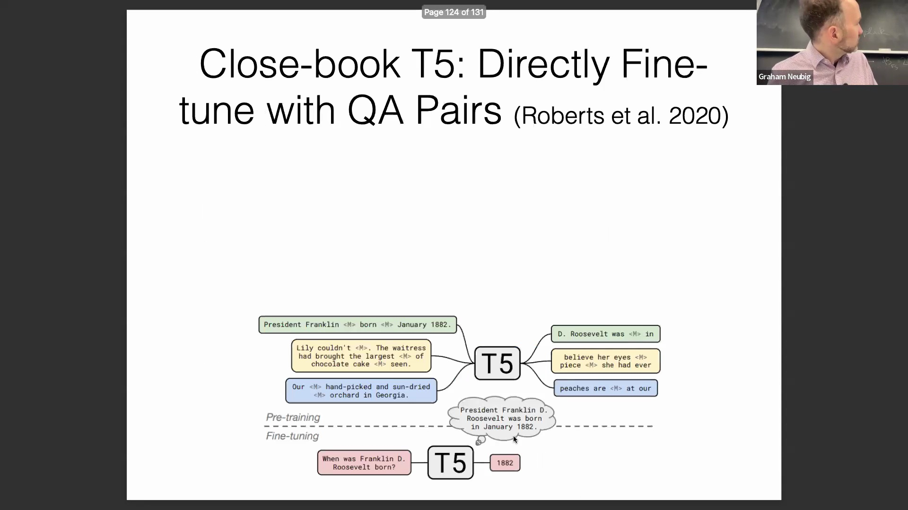
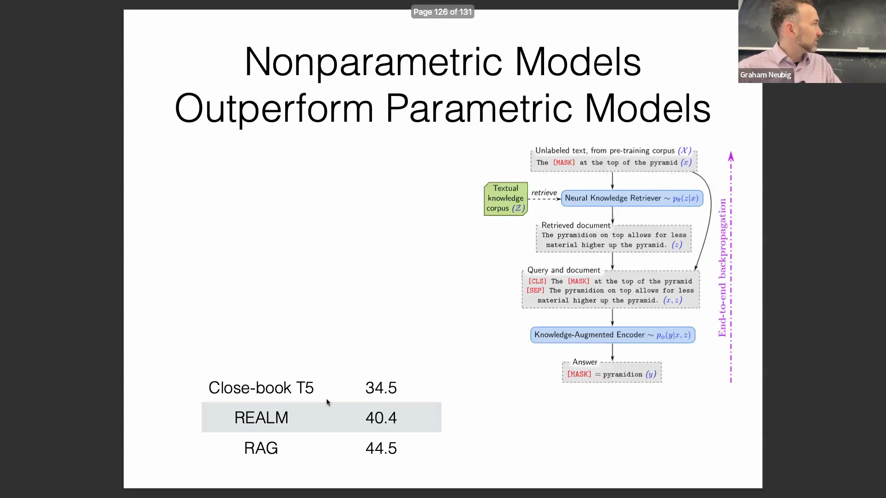
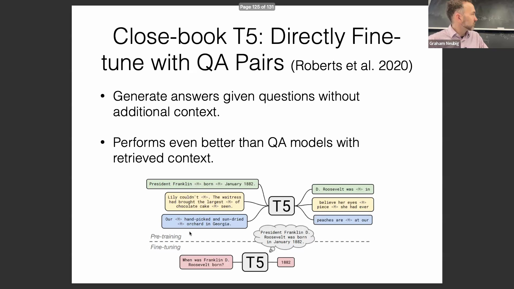
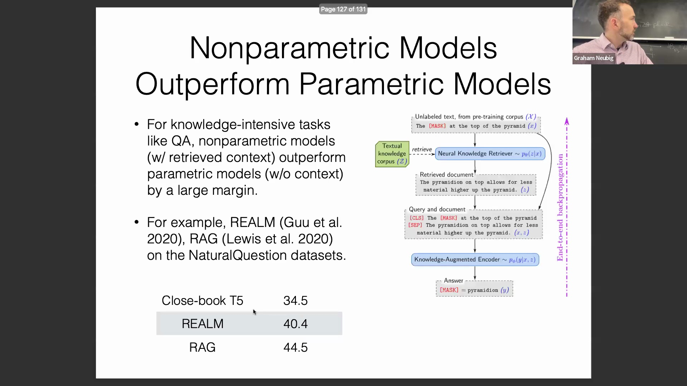

## 逻辑规则与结构化知识图谱
在基于知识推理(Knowledge-based Reasoning)中，某些路径具有高度的概率性。例如，当某人就读于特定大学时，其学习计算机科学(Computer Science)的可能性远大于医学。然而，逻辑规则极少绝对严格，例外情况总是存在。为了对此进行建模，研究人员将每条推理路径视为一系列带有相关规则权重的矩阵乘法(Matrix Multiplication)。这种数学方法最终能够预测给定的逻辑规则是否成立。从历史上看，该方法主要在结构化知识空间与知识图谱(Knowledge Graphs)中进行开发与测试。

## 将可微逻辑应用于语言模型
目前，直接将可微逻辑(Differentiable Logic)规则应用于语言模型的研究仍较为有限。这主要是因为文本的非结构化特性导致数据对齐困难，且实现复杂度显著较高。尽管面临这些挑战，该研究方向依然极具吸引力。许多语言模型在稳健推理(Robust Reasoning)方面仍存在不足，如何提升其逻辑能力仍是人工智能(Artificial Intelligence)领域的一个开放性难题。借鉴早期在结构化领域取得成功的方法，并将其适配至非结构化的语言模型空间，为技术演进提供了一条充满希望的路径。

## 探测语言模型中的内部知识
近期研究的一个主要焦点是探测(Probing)语言模型内部究竟存储了哪些知识。通过利用全面的知识库，研究人员可以系统地评估模型对特定事实的实际“掌握”程度。传统的问答(Question Answering)系统与检索增强生成(Retrieval-Augmented Generation, RAG)模型通常依赖维基百科文章等外部资源来回答问题。现代研究的一个关键转变在于提出如下问题：在不使用RAG或外部检索的情况下，我们能否准确判断哪些知识是原生编码在模型参数中的？我们又能在多大程度上可靠地提取它们？

## LAMA 基准测试与基于提示词的评估
应对这一挑战的一篇奠基性论文引入了LAMA(Language Model Analysis)基准测试。该研究将结构化数据库查询（如SQL或SPARQL）与大语言模型的自然语言提示词(Prompt)进行对比，实质上开创了早期基于提示词的评估范式。该方法使用诸如“但丁出生于[MASK]”的模板，并让掩码语言模型(Masked Language Model, MLM)预测正确的客体(Object)（例如“佛罗伦萨”）。通过将知识库条目作为标准答案，研究人员测试了这些信息能否从神经网络中被成功还原。针对41种关系（例如“X成立于Y”）采用人工编写的提示词进行测试，ELMo、Transformer-XL和BERT Base等早期模型的准确率最高仅为31%，从而为内部知识探测确立了基准。

## 多语言知识与检索二分法
一项后续研究将此基准扩展至多种语言，揭示了一个有趣的现象：模型内部编码的知识与其实际检索知识的能力之间存在显著差异。研究人员利用多语言知识库，以不同语言提出了相同的事实性问题。结果显示，在非英语、低资源(Low-resource)或语言类型距离较远的语种上，模型性能显著下降。即使忽略输出语言的差异，仅以答案正确与否作为评分标准，模型的表现依然不理想。鉴于模型能够可靠地用英语作答，这表明它们本质上“知晓”该事实。其他语言上的性能差距表明，瓶颈在于检索机制而非知识储备不足，这引出了关于如何改进跨语言信息获取(Cross-lingual Information Retrieval)的重要问题。

## 角色设定提示与性能波动
关于提示词框架如何影响知识检索的研究也探讨了角色设定(Role-playing)的作用。添加诸如“我是一位老人”、“我是一位年轻女性”或提及特定背景等上下文，会大幅改变模型准确回答问题的能力。这凸显了一个反直觉的现实：模型虽具备底层知识，但提示的框架在很大程度上决定了输出的成败。这种现象具有两面性：尽管误导性的角色设定会降低性能，但策略性的提示则能有效提升表现。例如，在代码生成(Code Generation)任务中，附加类似“我已仔细检查，所有单元测试均已通过”的“魔法提示词(Magic Prompts)”，能将准确率提高数个百分点。本质上，引导模型进入正确的“状态”或上下文，能够直接优化其推理与检索能力。

## 面向知识任务的微调
除提示词工程(Prompt Engineering)外，提升知识检索能力的另一种直接方法是针对性微调(Fine-tuning)。研究表明，在合成生成的基于知识的问答数据上微调语言模型，能显著提升其回答与结构化知识库相关查询的能力。通过在训练过程中让模型接触格式化的问答对，其内部用于检索和表述事实信息的路径将变得更加可靠与准确。

## 模型参数内的多跳推理
最后一个讨论领域聚焦于直接在语言模型参数内部进行的多跳推理(Multi-hop Reasoning)。传统的多跳推理通常涉及遍历外部知识库中的显式推理链，而最新研究则测试语言模型能否在内部串联多个事实以回答复杂查询。例如，给定类似“国家 → 美国 → 总统 → 出生日期”的推理链，该研究评估了模型在不依赖外部参考的情况下推导这些概念步骤的能力。这一研究方向对于深入理解现代神经网络架构中结构化推理的整合深度与可访问性至关重要。
