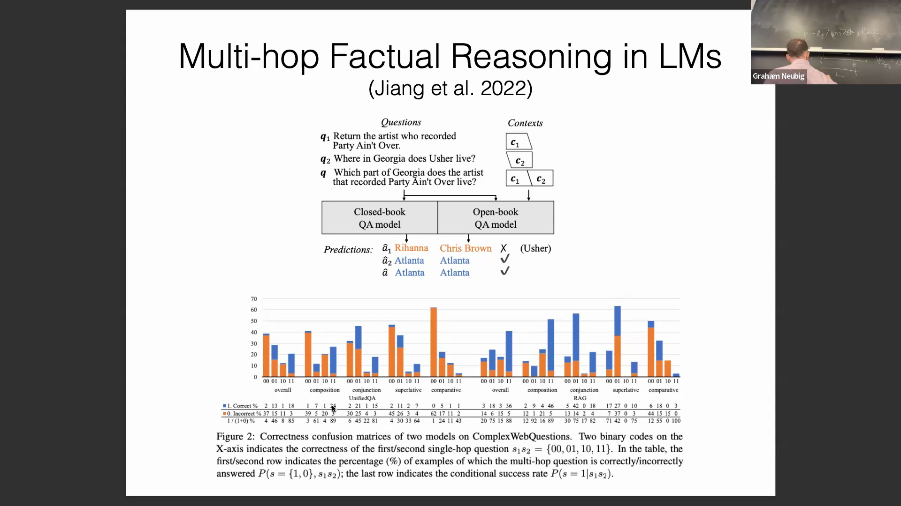
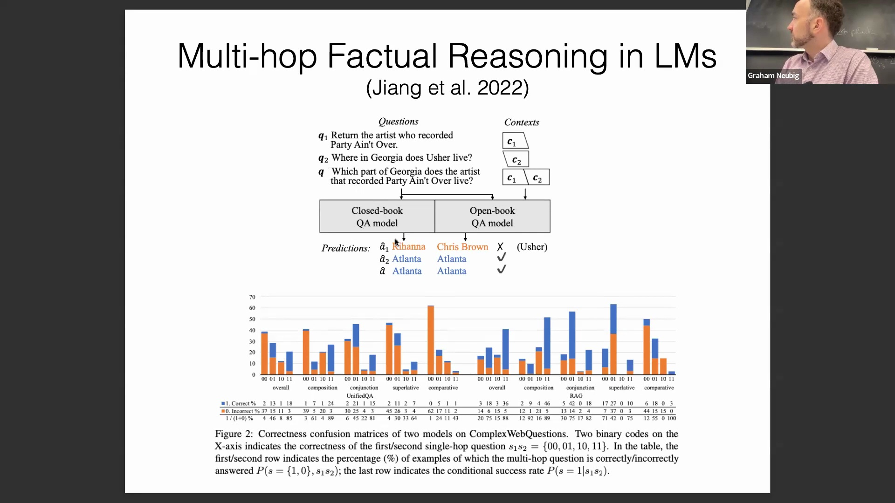

## 从知识库构建多跳问题
研究人员可通过遍历结构化知识库(Structured Knowledge Base)中的关系路径，系统地生成多跳问题(Multi-hop Questions)。利用预定义模板(Pre-defined Templates)，研究者可将单一的事实查询无缝组合为复合问题(Composite Questions)。例如，第一个子问题(Sub-question)用于识别录制某首特定歌曲的艺术家，第二个子问题则询问该艺术家的居住地。这些问题可被整合为一个复杂的多跳提示词(Multi-hop Prompt)：*“录制《[歌曲]》的艺术家居住在佐治亚州的哪个地区？”* 这种结构化方法提供了一个受控环境(Controlled Environment)，用于测试模型如何处理层级化信息(Hierarchical Information)。

## 评估多跳推理的预期表现
为评估语言模型(Language Model)的能力，研究人员测量了模型在单个子问题及最终复合问题上的表现。在将模型视为完美知识处理器(Knowledge Processor)的理想场景下，成功回答复合问题应严格依赖于对两个前置子问题的正确解答。若模型掌握两部分的答案，理应能推导出复合答案；若任一环节出错，最终输出自然应为错误。这为推理链(Reasoning Chain)的预期行为确立了一个清晰的基准(Baseline)。

## 第二跳的不成比例影响
令人惊讶的是，跨多种问题类型的实验结果彻底推翻了理想模型的假设。模型正确解答复合问题的能力并非同时取决于两个子问题的答案，而是与它在*第二跳(Second Hop)*子问题上的成功率高度相关。第一子问题的准确率与最终结果之间几乎不存在统计学意义上的关联。本质上，模型似乎主要依赖最后一步推理(Reasoning Step)的上下文、结构或答案来推导正确的复合答案，而非遵循严格的顺序逻辑推理(Sequential Logical Reasoning)。

## 理解推理瓶颈
这一现象与实际推理过程中的局限性相符。若第二个子问题要求生成冗长列表（例如*“所有美国总统”*），直接求解将异常困难。相反，若第二问针对的是如首都城市这类特定单一事实，即便第一步的推理仍显模糊，模型也可能正确推断或猜测出答案。最后一跳的难度与答案空间(Answer Space)不成比例地决定了整体成功率。这表明语言模型并非总是执行僵化的逐步逻辑链接，而是高度依赖最终查询的上下文线索(Contextual Clues)。

## 作为结构化探测工具的知识库
尽管存在上述推理反常现象，知识库依然是系统评估语言模型实际知识储备、推理能力及其逻辑边界(Logical Boundaries)的宝贵资源。借助结构化数据，研究人员可设计高度受控的实验，以严谨且可复现的方式探测(Probing)语言模型的能力、记忆检索(Memory Retrieval)与推理逻辑。至此，关于现代语言模型中知识整合(Knowledge Integration)与推理评估(Reasoning Evaluation)的探讨暂告一段落。