## 简介与词袋模型基础
本讲座主要探讨词表示(Word Representation)与文本分类(Text Classification)，它们是学习更高级自然语言处理(Natural Language Processing, NLP)概念的重要基础。课程首先回顾了词袋模型(Bag-of-Words, BoW)，在该模型中，每个词都被编码为一个独热向量(One-Hot Vector)。这些向量被聚合为词频向量(Word Frequency Vector)，与学习到的权重(Learned Weights)相乘后，生成用于二分类(Binary Classification)或多分类任务(Multi-class Classification)的得分。在此框架下，特征完全基于词汇本身的标识，缺乏上下文感知能力(Context Awareness)。

## 应对词袋模型局限性的现代解决方案
尽管词袋模型简单高效，但它存在一些关键局限性：难以有效处理词形变化(Inflectional Morphology)与复合词(Compound Words)、忽略了词汇间的语义相似性(Semantic Similarity)、缺乏特征交互(Feature Interaction)能力，并且完全忽略了句法结构(Syntactic Structure)。构建基于规则的系统(Rule-based Systems)来解决这些问题既复杂又低效。为克服这些挑战，现代自然语言处理采用了针对性的解决方案：采用子词(Subword)或基于字符的模型(Character-based Models)处理词形变化，利用词嵌入(Word Embeddings)捕捉语义相似性，通过神经网络(Neural Networks)自动学习特征组合，并采用基于序列的模型(Sequence-based Models)以保留句法结构。

## 子词分词与词汇表压缩
子词建模(Subword Modeling)是当代语言模型(Language Models)（包括最先进架构(State-of-the-Art, SOTA)）的基石。其核心目标是将低频或复杂词汇拆分为更小且富有语义的子词标记(Subword Tokens)。例如，“companies”可能会被分词为“compan”和“ies”，而“expanding”则变为“expand”和“ing”。该策略具有两大主要优势：它使模型能够泛化至各类词形变化与未登录词(Out-of-Vocabulary, OOV)，同时大幅缩减词汇表规模，从而降低模型参数量与计算开销(Computational Overhead)。

尽管英语单词的理论形态数量可达数百万（受词形变化、俚语、拼写错误以及齐夫定律(Zipf's Law)分布的影响），子词分词技术(Subword Tokenization)仍能有效地将这一近乎无限的空间压缩为约 60,000 个实用词元，从而确保模型训练的高效性与可扩展性(Scalability)。

## 字符级建模的局限性
子词分词的一种替代方案是字符级(Character-level)或字节级(Byte-level)建模，即将每个独立的字符视为离散标记(Discrete Tokens)。然而，这种方法带来了显著的实际挑战。首先，它会生成极长的输入序列(Input Sequences)，增加神经网络的处理负担并消耗大量内存资源。其次，字符级表示(Character-level Representations)本质上缺乏语义表达能力；“字符袋”(Bag-of-Characters)模型无法有效捕捉高层语义或情感倾向（例如，模型难以仅凭分散的字母组合直接捕捉“good”一词所蕴含的积极情感）。因此，原始字符建模通常不适用于需要深层语义理解的任务。

## 分词策略的权衡
高效的分词策略需在模型表达能力与数据稀疏性(Data Sparsity)之间取得平衡。若将完整句子或长短语视为单一标记，会引发严重的稀疏性问题；由于相同序列在训练语料中极少重复出现，模型将难以有效学习。反之，粒度过于精细的标记又难以捕捉有意义的语义信息。子词模型(Subword Models)成功地在二者之间取得了平衡：其构建的词元既具备足够的出现频率以确保稳定学习，又保留了足够的长度以承载上下文与形态信息。这种优化的表示方法为高级序列建模(Advanced Sequence Modeling)奠定了坚实基础，相关内容将在后续课程中深入探讨。

---

## 序列建模与子词分词预览
随着我们进入序列建模(Sequence Modeling)阶段，模型将开始捕捉词与标记之间的相邻关系。即使单个子词单元(Subword Units)自身的表达能力有限，它们的序列组合也能有效编码上下文与语义。在深入探讨序列架构(Sequence Architectures)之前，我们必须首先建立一种统一的方法，用于生成介于原始字符和完整单词之间的子词标记(Subword Tokens)。在该领域，两种主流算法占据主导地位。
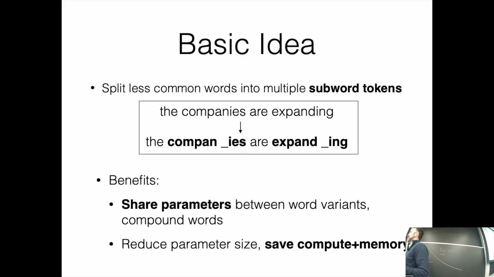

## 字节对编码（BPE）机制
第一种也是最简单的方法是字节对编码(Byte Pair Encoding, BPE)。该方法非常直观，通常仅需约十行代码即可实现。BPE 首先将训练语料中的所有单词拆分为单个字符，并附加专用的词尾符号(End-of-Word Symbol)。随后，算法扫描语料库以统计相邻字符对的频率。系统会识别出频率最高的字符对（例如，在 "newest" 和 "wildest" 等词中频繁出现的 "e" 和 "s"），并将它们合并为一个新的单一标记("es")。这种贪婪合并(Greedy Merging)过程将迭代重复进行。
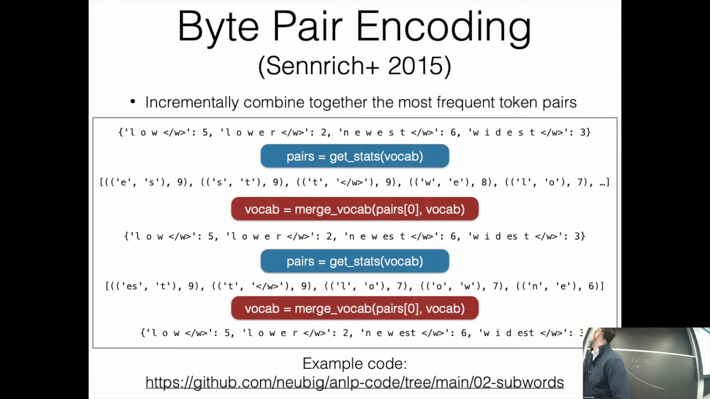
经过数千次迭代，BPE 能够自然发现诸如后缀("es" 或 "ing")等具有实际意义的形态单元(Morphological Units)。通过设定目标词汇表大小(Vocabulary Size)（例如 60,000），算法会持续执行合并操作，直至达到该预设限制。从概念上讲，BPE 的运行机制类似于数据压缩中使用的霍夫曼编码(Huffman Coding)，它能在严格控制词汇表规模的同时，高效压缩高频出现的语言模式。

## 用于分词的一元语言模型
BPE 的另一种替代方案是采用一元语言模型(Unigram Language Model)。该方法将分词(Tokenization)视为一个概率优化问题。它假设序列中的标记是相互独立生成的，并将整个语料库的联合概率计算为各个标记概率的乘积。其核心目标是筛选出一个固定大小的词汇表，以最大化语料库的似然(Likelihood)。
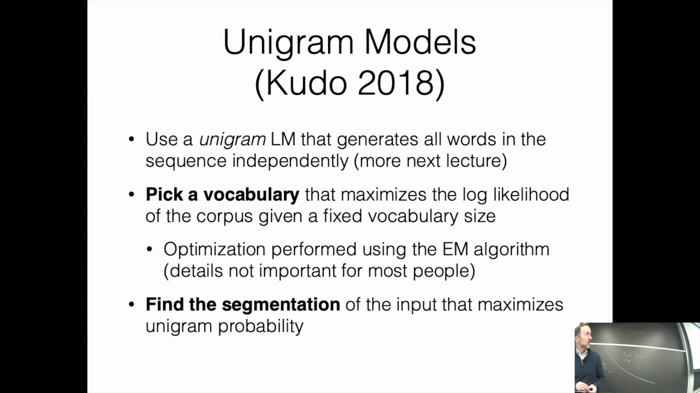
该优化过程通常通过期望最大化(Expectation-Maximization, EM)算法实现：首先估计各标记的概率，保留高概率标记，并迭代剪枝(Iterative Pruning)低概率候选词，直至达到目标词汇表规模。尽管独立性假设忽略了词序信息，但它使得词汇选择与文本分词均可通过高效的动态规划(Dynamic Programming)算法来完成。模型训练完成后，新文本将依据最大化一元概率(Unigram Probability)的原则进行分词。

## 基于 SentencePiece 的实际应用
在实际工程开发中，开发者极少从头实现这些算法，而是高度依赖 `SentencePiece` 库。用户仅需执行训练命令，并指定词汇表大小、字符覆盖率阈值(Character Coverage Threshold)以及模型类型（BPE 或 Unigram）等参数即可。该库能够无缝处理复杂的分词逻辑以及编码(Encoding)与解码(Decoding)流程。尽管 BPE 与 Unigram 模型通常表现相近，但词汇表规模仍是最关键的超参数(Hyperparameter)。较小的词汇表可提升计算效率，但会牺牲语义表达能力；较大的词汇表虽能捕捉更细腻的语义特征，却会占用更多内存并拖慢处理速度。对于纯英语应用，60,000 至 80,000 的词汇量被广泛视为最佳实践。

## 多语言挑战与词汇表权衡
子词分词(Subword Tokenization)在多语言环境中面临显著挑战。由于算法天然倾向于优先合并高频字符串，主流语言往往会占据词汇表的大部分容量。在多语言混合语料库中（例如 50% 英语、30% 其他拉丁语系语言、10% 中文，以及西里尔字母、日语或缅甸语等占比较低），低资源语言(Low-Resource Languages)将处于劣势。其文本往往被过度切分为极短且低效的字符序列，导致生成的标记序列(Token Sequences)过长，进而削弱模型性能。为缓解这种不平衡，从业者通常需实施专门的词汇分配策略或加权方案，以确保各语言均能获得公平的特征表征。尽管面临上述挑战，该领域依然是现代自然语言处理流程中持续优化的重点方向。

---

## 管理多语言数据不平衡
为了解决多语言语料库(Multilingual Corpora)中的词汇分布不均问题，一种常见的应对策略是主动调整训练数据的分布。英语等主流语言会被有意降采样(Downsampling)，而低资源语言(Low-Resource Languages)则会被升采样(Upsampling)。这种数据重平衡(Data Rebalancing)确保了分词算法能够为低频语言分配充足的词汇表配额(Vocabulary Quota)，防止其文本被过度切分为低效的字符级序列(Character-level Sequences)，进而避免模型性能受损。
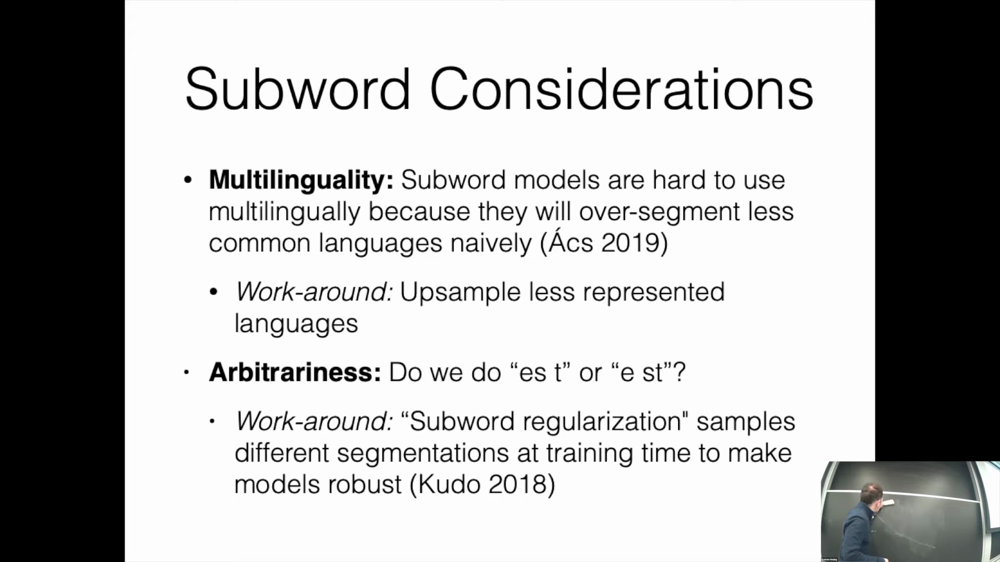

## 应对分词任意性与模型可扩展性
BPE 等子词算法(Subword Algorithms)有时会产生不稳定的分词边界，尤其是在频率相近的字符对相互竞争时。为了缓解这种任意性并提升模型的鲁棒性(Robustness)，研究人员通常会采用子词正则化(Subword Regularization)技术。该技术在训练过程中会对多种合理的分词方案进行采样，而非依赖单一的确定性切分(Deterministic Tokenization)。该功能已在广泛使用的 `SentencePiece` 库中原生实现。此外，当需要将已训练的分词器(Tokenizers)扩展至新语言时，一元模型(Unigram Models)的概率特性使得词汇表插值(Vocabulary Interpolation)变得十分直接。另一种实现跨语言迁移(Cross-lingual Transfer)的方法是冻结预训练模型(Pre-trained Models)的主体参数，仅针对新增语言学习全新的词元嵌入(Token Embeddings)。

## 子词与字节级分词的普及应用
子词分词(Subword Tokenization)已成为几乎所有现代自然语言处理(NLP)架构的基础预处理步骤(Preprocessing Step)。尽管早期实现主要侧重于字符级切分，但以 Llama 和 GPT 为代表的当前最先进(State-of-the-Art, SOTA)模型现已普遍采用字节级分词(Byte-level Tokenization)。基于字节的方法将原始字节流(Byte Stream)直接视为离散标记(Discrete Tokens)，从而彻底规避了 Unicode 编码(Unicode Encoding)带来的复杂性。这使得模型能够无缝、统一地处理各类书写系统、Emoji 表情符号及特殊字符，且无需依赖特定语言的显式预处理规则(Explicit Preprocessing Rules)。

## 从稀疏向量到连续嵌入
本讲内容从离散标记化(Discrete Tokenization)过渡到连续词表示(Continuous Word Representations)，标志着语言模型处理文本信息方式的根本性转变。在传统方法中，词汇被编码为稀疏的独热向量(Sparse One-Hot Vectors)，其中仅有一个维度被激活，以对应特定的词表项(Vocabulary Items)。现代方法则用稠密的连续嵌入向量(Dense Continuous Embeddings)取代了这一方式。在连续词袋模型(Continuous Bag-of-Words, CBOW)中，各个词元的嵌入向量会被聚合，并与可学习的权重矩阵(Learnable Weight Matrices)相乘。这使得模型能够捕捉丰富的分布式表示(Distributed Representations)，而不再局限于孤立的离散类别标识。
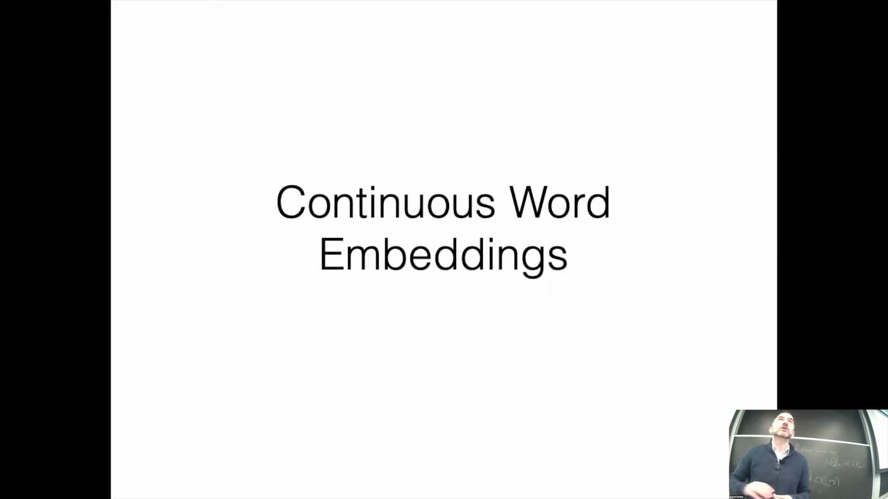
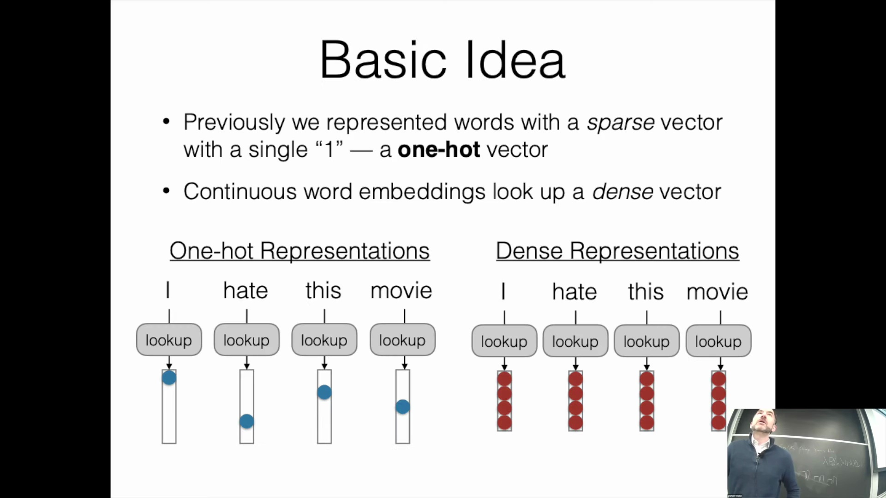

## 嵌入空间中的几何直觉与特征表示
连续嵌入(Continuous Embeddings)的核心目标是构建特定的向量空间结构(Vector Space Structure)，使语义或句法相似的词汇在几何空间中彼此邻近。稠密向量中的每一个维度都可视为潜在的隐特征(Latent Features)，有望捕捉到有生性(Animacy)、词性(Part-of-Speech)或情感极性(Sentiment Polarity)等语言学属性。例如，在假设的二维投影(Two-Dimensional Projection)中，某一坐标轴可能用于区分“有生”与“无生”，而与之正交(Orthogonal)的另一坐标轴则编码“积极”与“消极”的情感倾向。这种空间布局使得向量运算(Vector Operations)能够自然映射复杂的语言关系，从而为神经网络(Neural Networks)中的高级语义推理(Advanced Semantic Reasoning)奠定了坚实的数学基础。
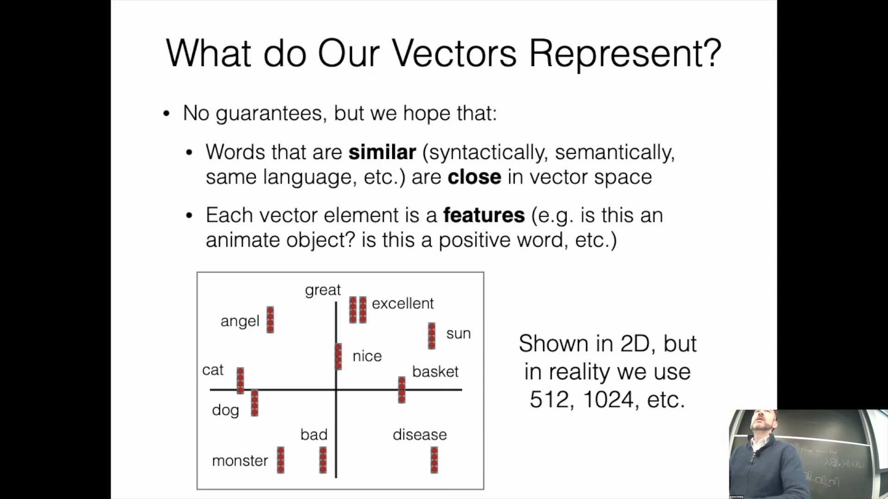

---

## 连续词嵌入的学习目标
训练连续词嵌入(Continuous Word Embeddings)的根本目标是将稀疏的、类别型(Categorical)的词表示转化为能够捕捉语言意义的稠密向量(Dense Vectors)。一个训练良好的嵌入空间(Embedding Space)应满足两个关键属性：首先，具有相似语义或句法特征(Semantic or Syntactic Features)的词在向量空间(Vector Space)中必须彼此靠近；其次，这些向量的各个维度理想情况下应对应有意义的语言学特征，如有生性(Animacy)、情感极性(Sentiment Polarity)或语法结构。尽管这些潜在特征(Latent Features)未必总能被人类明确解释，但向量空间的几何结构对于实现高级语义推理(Advanced Semantic Reasoning)和泛化能力(Generalization Capability)至关重要。
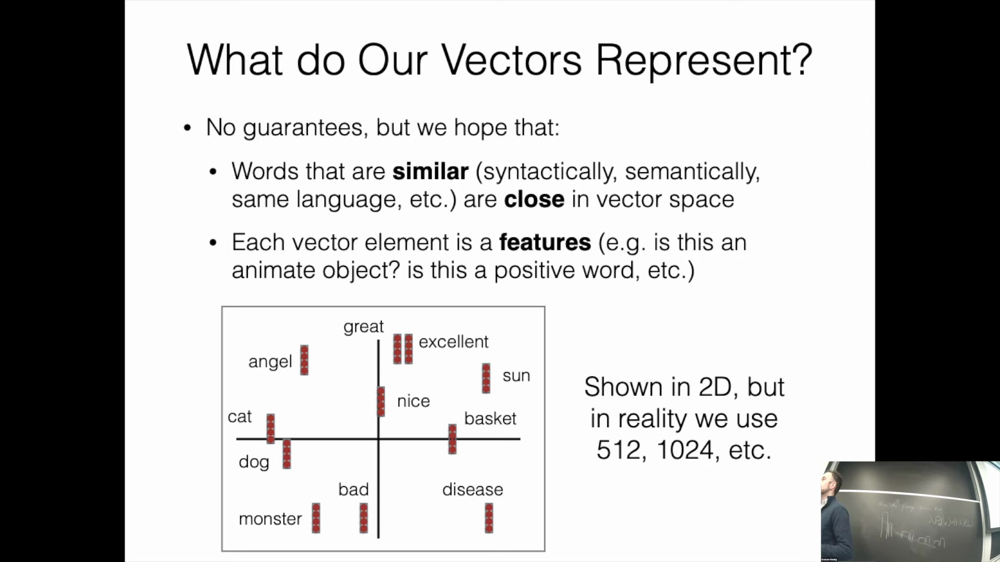

## 嵌入查找操作：索引 vs. 矩阵乘法
在实际的深度学习框架(Deep Learning Frameworks)中，获取词嵌入(Word Embeddings)在计算上通常被优化为直接从大型参数矩阵(Parameter Matrix)中进行索引查找的操作。然而，这种索引查找在数学上等价于将嵌入矩阵(Embedding Matrix)与表示目标词索引的独热向量(One-Hot Vector)相乘。理解这种等价性能够为模型赋予强大的建模能力。例如，若生成模型输出的是潜在下一个词的软分布(Soft Distribution)（即概率分布），而非单一的离散标记(Discrete Token)，那么将嵌入矩阵与该软分布相乘将得到一个期望嵌入向量(Expected Embedding Vector)。这使得模型能够综合多个候选词的语义信息，从而实现更为灵活的概率推理(Probabilistic Reasoning)。
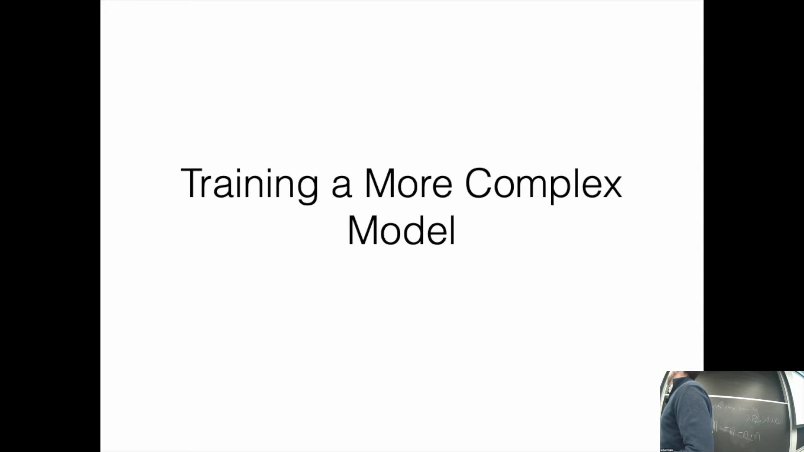
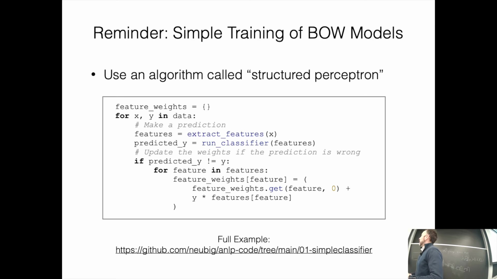

## 转向梯度下降进行模型训练
尽管简单的线性分类器(Linear Classifiers)可采用结构化感知机算法(Structured Perceptron Algorithm)等启发式更新规则(Heuristic Update Rules)进行训练，但复杂的现代神经网络架构则需要系统化的优化框架(Optimization Frameworks)。深度学习模型(Deep Learning Models)主要通过梯度下降法(Gradient Descent)进行训练。该过程首先定义一个可微的损失函数(Differentiable Loss Function)以量化预测值与真实标签之间的差异，随后计算该损失相对于所有可训练参数(Trainable Parameters)（含嵌入权重(Embedding Weights)）的梯度(Gradients)，并沿最小化整体损失的方向迭代更新这些参数。
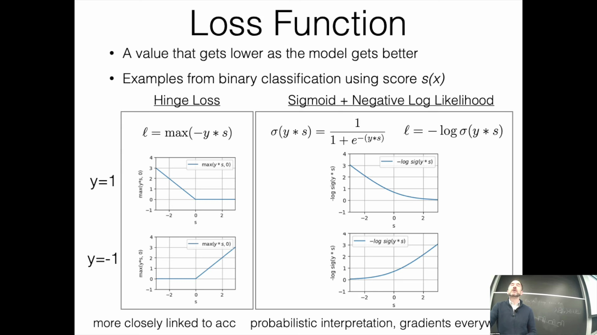

## 二分类损失：铰链损失
在二分类任务(Binary Classification Tasks)中，通常采用两种主流损失函数(Loss Functions)。第一种是铰链损失(Hinge Loss)，其定义为 0 与真实标签和模型预测得分乘积之间的最大值。从几何特性来看，铰链损失函数是非平滑且分段线性(Piecewise Linear)的。当模型预测正确且置信度(Confidence)达到预设边界时，该损失值恰好为零，这使得模型在达到理想分类边界后能有效停止参数更新。随着预测误差的增大，损失值呈线性增长，从而以与分类准确率(Accuracy)高度一致的方式直接惩罚误分类样本。

## 二分类损失：Sigmoid 与负对数似然
第二种主流方法将 Sigmoid 激活函数(Sigmoid Activation Function)与负对数似然损失(Negative Log-Likelihood Loss, NLL)相结合。Sigmoid 函数将模型的原始得分(Logits)映射为介于 0 到 1 之间的平滑连续概率值。对该概率取负对数可构建一条平滑的凸损失曲线(Convex Loss Curve)，该曲线渐近逼近于零但永不为零。与铰链损失不同，Sigmoid 结合 NLL 的公式为模型置信度提供了直接的概率解释(Probabilistic Interpretation)，这对于下游决策、分类阈值(Threshold)调整以及 ROC-AUC(Receiver Operating Characteristic - Area Under Curve)等性能指标的评估具有极高价值。

## 梯度行为与优化动态
损失函数的选择从根本上决定了训练过程中的梯度传播(Gradient Flow)与优化动态(Optimization Dynamics)。铰链损失虽与分类准确率紧密相关，但一旦样本预测正确，其梯度即降为零，这可能导致模型学习过程过早停滞。相反，Sigmoid 结合 NLL 损失在整个定义域内均保持非零梯度(Non-zero Gradients)，且梯度幅值与预测误差(Prediction Error)成正比。这一特性确保了更为平滑、稳定的优化过程(Optimization Process)，并能持续微调模型的置信度估计。在以铰链损失对词袋模型(Bag-of-Words Model)进行梯度解析推导时，参数更新规则可简化为：仅当样本违反间隔约束(Margin Violation)时才调整权重。这充分凸显了损失函数的数学形式如何直接驱动嵌入向量(Embedding Vectors)与分类参数(Classification Parameters)的迭代修正。
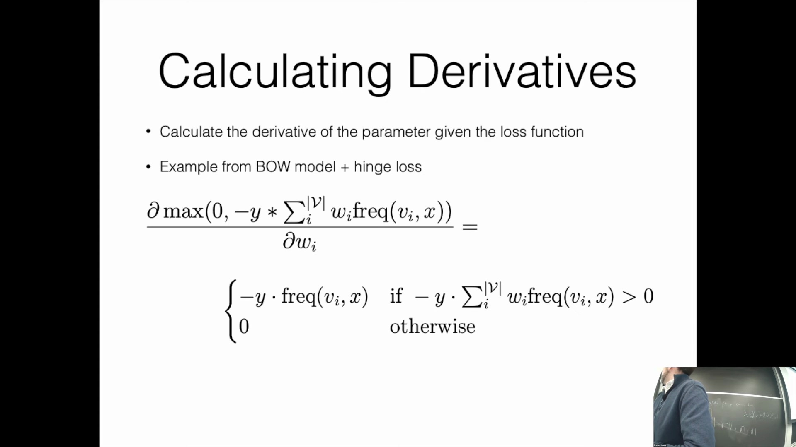
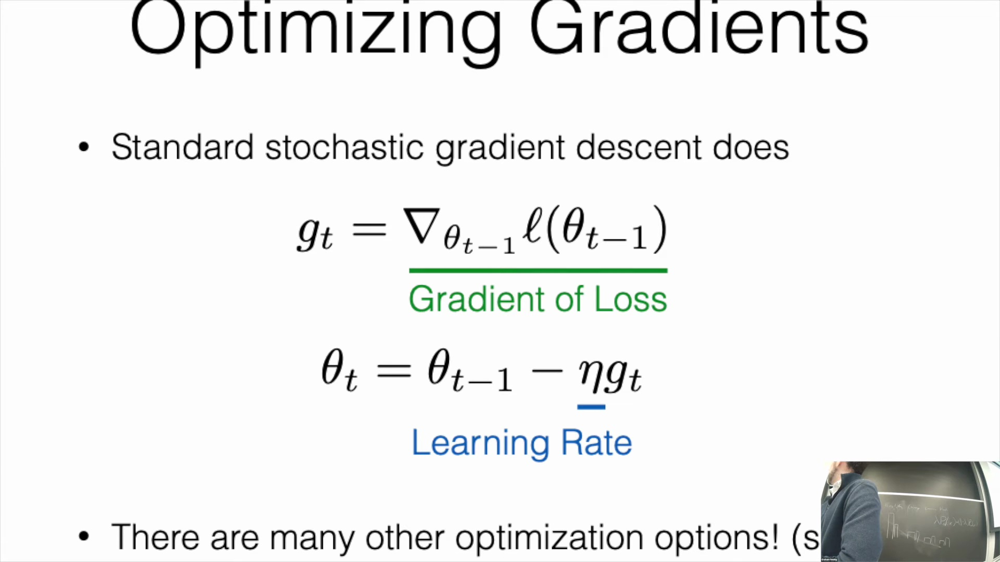

---

## 标准梯度下降优化
在进行梯度优化(Gradient Optimization)时，我们通常依赖于标准随机梯度下降(Stochastic Gradient Descent, SGD)，它仍是此类模型最基础的优化算法(Optimization Algorithm)。该过程涉及计算损失函数(Loss Function)相对于模型参数(Model Parameters)（通常表示为 $W$ 或 $\theta$）的梯度，可将其记为 $G$。为更新参数，我们将权重的当前值减去学习率(Learning Rate)与计算所得梯度的乘积。

## 确定损失函数与学习率
尽管存在诸多高级优化选项（如 Adam(Adaptive Moment Estimation)，后续将详细介绍），但理解基础更新规则(Update Rule)至关重要。通过审视算法结构，我们可以推断出其所采用的具体损失函数与学习率。该实现依赖于一个用于判断预测是否匹配的 `if` 语句。若预测标签与真实标签不匹配，权重将沿真实标签方向按学习率进行更新。这一逻辑表明，该算法使用了**铰链损失(Hinge Loss)**，且**学习率为 1**。这种条件更新机制直接对应于铰链损失的梯度(Gradient)：仅当样本未满足正确分类的间隔条件时，参数才会被更新。由此可见，即便是一个简单的 Python 实现，其本质也在复现随机梯度下降的过程。

## 组合特征的挑战
线性模型(Linear Model)的简洁性是其显著优势，但其能力主要受限于词袋模型(Bag-of-Words Model)或基于基础特征的架构。在处理组合特征(Compositional Features)时，其关键缺陷便显露出来。例如，诸如“don't hate（不讨厌）”和“don't love（不爱）”的短语，无法仅通过简单累加单个词的权重来准确建模。词元(Token)之间的语义交互(Semantic Interaction)至关重要。在线性框架中，否定词与情感词的结合极易导致预测偏差，模型无法捕捉“don't”如何从根本上扭转其后动词的语义。简单的特征相加无法解决此类上下文交互问题，这凸显了引入更复杂建模方法的必要性。

## 引入神经网络以实现特征交互
为克服线性特征组合的局限性，我们转向神经网络(Neural Network)。该架构首先为每个词检索稠密词嵌入(Dense Embeddings)。我们并不直接利用这些嵌入进行预测，而是将其输入至一系列线性变换(Linear Transformation)与非线性激活函数(Non-linear Activation Function)中。这种多层结构使模型能够自动学习复杂的组合特征。与连续词袋模型(Continuous Bag-of-Words, CBOW)不同（后者在聚合词嵌入时未考虑特征间的交互），神经网络能够在连续的层级中显式地学习不同特征之间的相互关系。

## 深度连续词袋模型
通过将词嵌入输入至多个网络层，模型得以学习复杂的特征组合。例如，第二层中的某个神经元可能仅在同时检测到负面情感特征（如特征 1 对“hate”等词产生响应）与否定特征（如特征 5 对“don't”或“not”等词产生响应）时才会被激活。这使得模型能够通过识别特定语言模式的共现(Co-occurrence)，准确解析“don't despise（不鄙视）”或“not hate（不讨厌）”等蕴含细微语义差别的短语。该架构被称为深度 CBOW 模型(Deep CBOW Model)，于 2015 年前后受到广泛关注。研究表明，即便是结构相对简单的深度网络(Deep Network)，也能在文本分类任务中表现优异，因为它们能够有效共享词表示(Word Representation)，并在深层网络中提取具有意义的交互特征。

## 为什么神经网络对复杂模型至关重要
随着网络架构因多重矩阵乘法(Matrix Multiplication)与非线性激活而日益复杂，手动计算损失函数与梯度已不再可行。尽管对于简单的铰链损失模型而言，手工推导导数尚属可行，但对于深层多层网络而言，此举既低效又易出错。这种计算需求直接推动了现代深度学习框架的广泛应用。尽管早期的深度学习模型在概念上受到生物神经元(Biological Neuron)（即达到电位阈值时产生脉冲）的启发，但其底层本质是计算图(Computational Graph)，而非严格的生物仿真。

## 深度学习中的计算图
在自然语言处理(Natural Language Processing, NLP)中，模型被组织为计算图，其中每个节点代表一个张量(Tensor)：标量(Scalar)、向量(Vector)、矩阵(Matrix)或更高维度的数组。节点同时表示对输入施加数学运算后的输出结果。连接这些节点的边(Edge)既代表函数参数，也表征数据依赖关系。在有向无环图(Directed Acyclic Graph, DAG)结构中，每个节点不仅负责计算自身的输出值，还会计算其相对于输入的梯度，从而高效实现自动微分(Automatic Differentiation)与反向传播(Backpropagation)。图中的运算函数可以是一元(Unary)、二元(Binary)或更为复杂的形式。关键在于，同一个数学运算可通过多种高效的计算图配置来表达。

---

## 优化计算图表达式
在实现神经网络(Neural Network)时，必须认识到多种计算图(Computational Graph)结构能够表达完全相同的数学函数。例如，形如 $x^T A x$ 的表达式既可以构建为包含多个中间节点(Intermediate Node)的大型图，也可以构建为更为紧凑的图。这一选择直接影响实际实现效率：图结构过大会显著增加内存开销，且运行速度通常较慢。现代深度学习框架(Deep Learning Framework)提供了高度优化的算子(Operator)，能够将多个数学运算步骤融合至单个图节点中。充分利用这些内置操作对提升计算效率至关重要，尤其是在实现多头注意力(Multi-Head Attention)等复杂机制时。

## 隐藏的计算成本与变量标签
除基本表达式外，引入常数(Constant)可将这些图扩展为多项式结构。然而，在框架设计中，一个至关重要的概念是：变量名(Variable Name)仅仅是计算图中节点的标签。在代码中声明一个高层变量(High-level Variable)时，往往会触发一连串隐藏的底层操作(Low-level Operation)。这些底层步骤中的每一步均会消耗内存与计算时间。对于追求高效实现的开发者而言，深刻理解这种抽象机制(Abstract Mechanism)至关重要，否则极易引发不必要的资源浪费。

## 核心算法：前向传播与反向传播
神经网络的实现依赖于四大核心算法：计算图构建、前向传播(Forward Propagation)、反向传播(Backpropagation)以及参数更新(Parameter Update)。前向传播按照拓扑序(Topological Order)处理节点，一旦节点的所有输入依赖(Input Dependency)得到满足，便立即计算其数值，该过程甚至支持并行执行。随后，反向传播沿逆拓扑序(Reverse Topological Order)遍历计算图，以计算各节点相对于最终损失(Loss)的导数。最后，通过参数更新算法（如随机梯度下降(Stochastic Gradient Descent, SGD)）来调整模型权重。对于内存密集型(Memory-Intensive)的自然语言处理(NLP)模型而言，严格把控这些步骤至关重要；意外的计算冗余或生成庞大的中间张量(Intermediate Tensor)状态会迅速耗尽内存，导致训练中断。

## 框架对比：PyTorch 与 JAX
在当前的自然语言处理领域，PyTorch 与 JAX 是两大主流框架，均拥有雄厚的企业工程团队支持。PyTorch 依然是行业标准（尤其在学术研究领域），其采用动态图机制(Dynamic Graph Mechanism)，计算图会在运行时针对每个输入即时构建与执行，从而提供了极高的灵活性。相比之下，JAX 更倾向于静态计算图(Static Computational Graph)的定义与预编译，优先追求运行速度与极致优化。JAX 的应用程序接口(Application Programming Interface, API)高度契合 NumPy，并大幅简化了高级张量操作(Tensor Operation)，例如可轻松实现模型在多 GPU 上的并行拆分(Parallel Partitioning)以进行大规模训练。尽管目前两者已相互借鉴诸多特性，但 PyTorch 凭借其最为繁荣的生态系统(Ecosystem)，仍是业界首选的默认框架；而 JAX 则更契合追求极致性能与函数式编程范式(Functional Programming Paradigm)的开发者。

## 实际实现与代码结构
本课程提供了基于 PyTorch 的简化示例，涵盖词袋模型(Bag-of-Words, BoW)、连续词袋模型(Continuous Bag-of-Words, CBOW)以及深度 CBOW 模型(Deep CBOW Model)。这些代码以清晰易懂为首要目标，而非追求工业级(Industrial-Grade)性能。相关实现通常位于 `model.py` 文件中，其中的 `forward` 方法负责定义前向计算流程(Forward Computation Flow)。例如，基础模型会加载词嵌入(Word Embedding)，将其与偏置项(Bias Term)相加后输出预测得分。更复杂的模型变体则在嵌入查找(Embedding Lookup)与最终评分之间引入了线性层(Linear Layer)与非线性变换(Non-linear Transformation)。这些代码结构高度还原了课程讲解的理论架构，为实际开发提供了直观的起点。在后续的习题课(Recitation)中，我们将通过动手实践(Hands-on Practice)深入掌握这些模型及其特征处理技巧(Feature Processing Techniques)。

---

## Adam 优化器与动量机制
Adam(Adaptive Moment Estimation) 优化器已成为自然语言处理(Natural Language Processing, NLP)领域训练神经网络(Neural Network)的标准选择。与基础的随机梯度下降(Stochastic Gradient Descent, SGD)直接应用当前梯度进行更新（易导致各训练步更新剧烈波动）不同，Adam 引入了历史梯度的指数移动平均(Exponential Moving Average)来构建动量(Momentum)项。该动量项由超参数(Hyperparameter) $\beta_1$ 控制，通过对过往梯度进行加权衰减来平滑优化轨迹(Optimization Trajectory)。此策略确保了参数更新随时间推移更加平稳，避免了模型对每个小批量(Mini-batch)数据中的梯度噪声产生过度反应。

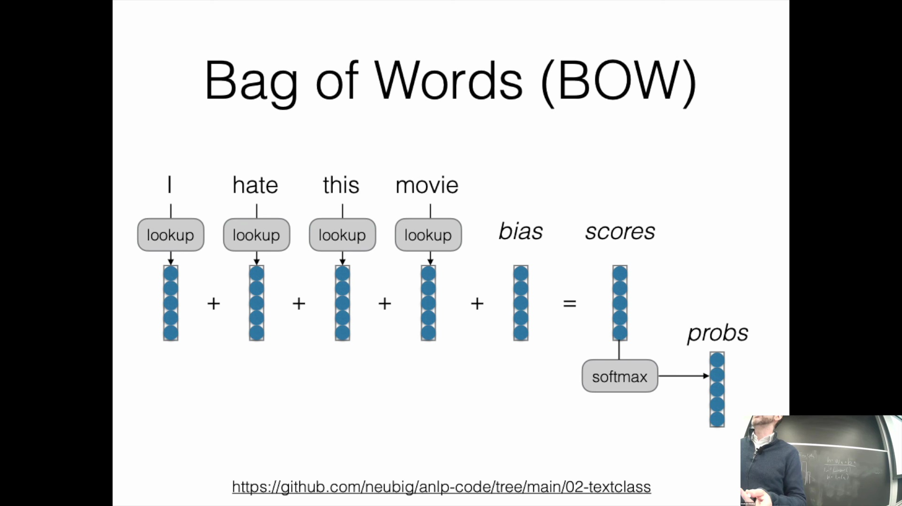

## 基于梯度方差的自适应更新
Adam 的另一核心组件是对梯度二阶矩(Second Moment, 即梯度的平方)的追踪。在包含大型词嵌入矩阵(Word Embedding Matrix)的模型中，高频词元(Token)通常会产生较大且稳定的梯度，而低频词元则往往对应稀疏且微小的梯度更新。通过维护梯度平方的指数移动平均，Adam 能够为每个参数独立计算自适应学习率(Adaptive Learning Rate)。具体而言，梯度幅度较大（二阶矩较高）的参数会按比例获得较小的更新步长，而梯度较小的参数则会获得相对较大的更新。这种自适应缩放机制(Adaptive Scaling Mechanism)确保了稀有特征(Rare Features)依然能够有效学习。此外，Adam 还引入了偏差校正(Bias Correction)项，用于在训练初期动量与二阶矩估计尚未充分收敛时，稳定参数更新过程。

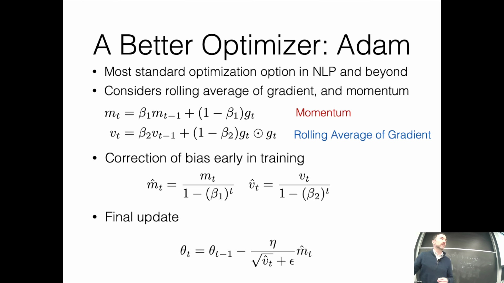

## 学习率预热与衰减调度
除 Adam 的内部优化机制外，现代 Transformer(Transformer Architecture) 的训练高度依赖于动态学习率调度策略(Learning Rate Scheduling)。典型的调度策略通常以极低的学习率起步（即学习率预热/Learning Rate Warmup），随后逐步提升至峰值，并在训练后期应用平滑的学习率衰减(Learning Rate Decay)。Transformer 对初始阶段的高学习率极为敏感，若起始值过大，极易导致模型训练不稳定甚至梯度发散(Gradient Divergence)。预热阶段有助于模型在优化初期平稳建立特征表征，而随后的衰减阶段则能有效防止模型权重在接近收敛点(Convergence Point)时发生剧烈振荡，从而在训练末期实现更高的泛化准确率。

 *(注：此处原图链接缺失，已按上下文格式保留占位结构)*

## 基于 PCA 的线性降维
词嵌入(Word Embedding)通常存在于高维空间(High-Dimensional Space)（例如 512 或 1024 维），这使得人类难以直接对其进行直观解读。主成分分析(Principal Component Analysis, PCA)等降维技术(Dimensionality Reduction Technique)能够将这些高维向量投影(Project)至二维或三维空间，以便于可视化(Visualization)。作为一种线性降维方法，PCA 曾经典地揭示了早期词向量模型中的语义关系往往表现为一致的几何向量偏移，例如“国家”与其“首都”之间的语义方向。然而，面对现代深度学习模型生成的高容量表征(High-Capacity Representation)，线性投影往往难以有效捕捉数据中复杂的非线性聚类结构(Non-linear Clustering Structure)。

## 基于 t-SNE 的非线性嵌入可视化
为克服 PCA 的局限性，t-SNE(t-Distributed Stochastic Neighbor Embedding) 被广泛应用于非线性降维(Non-linear Dimensionality Reduction)。与 PCA 的全局线性投影不同，t-SNE 专注于保留数据的局部邻域结构(Local Neighborhood Structure)，确保原始高维空间中距离相近的样本点，在降维后的可视化平面中依然保持紧密相邻。当应用于 MNIST 手写数字等数据集时，t-SNE 能够在完全无监督（即不使用数据标签）的转换过程中，自发地形成紧凑且类别边界清晰的聚类簇(Cluster)。数据标签仅在最终可视化阶段用于颜色编码(Color Coding)，这充分印证了 t-SNE 在揭示高维数据内在流形结构(Intrinsic Manifold Structure)方面的强大能力。

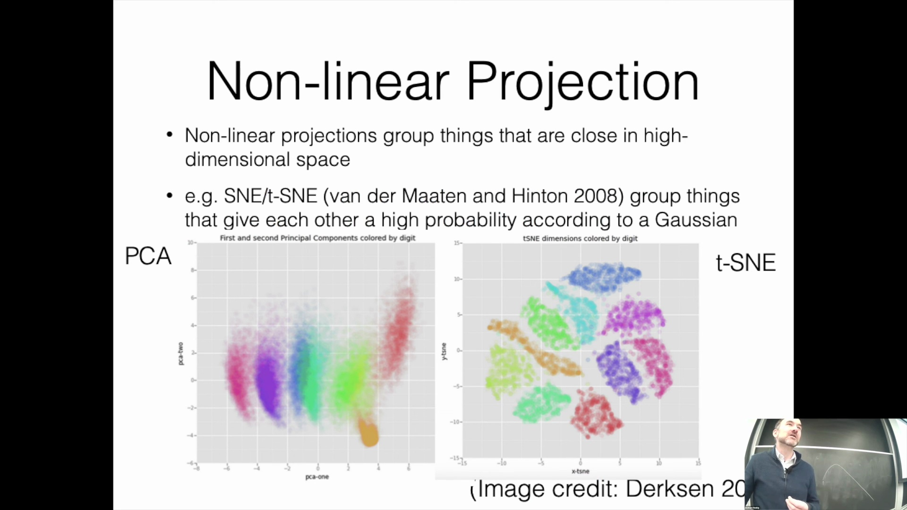

## t-SNE 的超参数敏感性与解读注意事项
尽管功能强大，t-SNE 在实际应用中需谨慎对待，因其对超参数(Hyperparameter)高度敏感，尤其是困惑度(Perplexity)与优化迭代次数(Optimization Iterations)。微调这些参数设置可能会显著改变最终的可视化结果，甚至生成形态迥异的聚类簇或误导性的人为假象(Artifacts)。例如，将 t-SNE 应用于简单的线性可分数据时，算法可能会扭曲出复杂的几何形状（如类似 DNA 双螺旋的图案或彼此孤立的数据团块），而这些形态往往无法真实反映底层的数据分布。因此，尽管 t-SNE 极适用于探索局部邻域关系(Local Proximity)，但在解读其呈现的全局结构(Global Structure)与特定拓扑形状时必须保持审慎，因为这些视觉特征在很大程度上受算法参数配置的驱动，而非完全由数据本身的几何特性所决定。

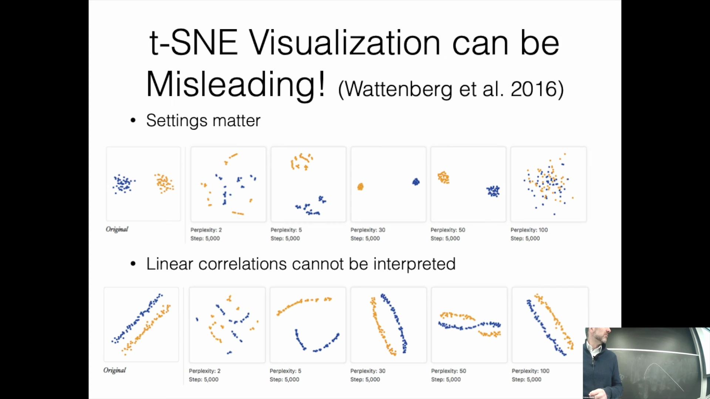

---

## t-SNE 在保留线性相关性方面的局限性
需注意的是，t-SNE(t-Distributed Stochastic Neighbor Embedding) 算法并不保证保留数据的全局线性相关性(Global Linear Correlation)。若原始高维空间(High-Dimensional Space)中存在清晰的线性关系或几何相关性(Geometric Correlation)，应用 t-SNE 可能会将其扭曲，这意味着这些直观的模式可能无法在最终的可视化(Visualization)结果中准确呈现。这凸显了谨慎解读 t-SNE 输出结果的重要性，因为该算法的优化目标优先侧重于保留局部邻域关系(Local Neighborhood Relationship)，而非维持精确的全局线性结构。

## 总结与下期内容预告
本讲内容至此结束。展望后续安排，下一节课将专门聚焦于**语言建模(Language Modeling)**。尽管序列模型(Sequence Model)将在课程后期进行深入探讨，但紧接的讲座将重点剖析语言模型如何预测与生成文本，该主题将直接依托于本次课程所讲授的词嵌入(Word Embedding)与优化算法(Optimization Algorithm)基础。感谢各位的参与，期待在下一次课程中与大家继续探讨。