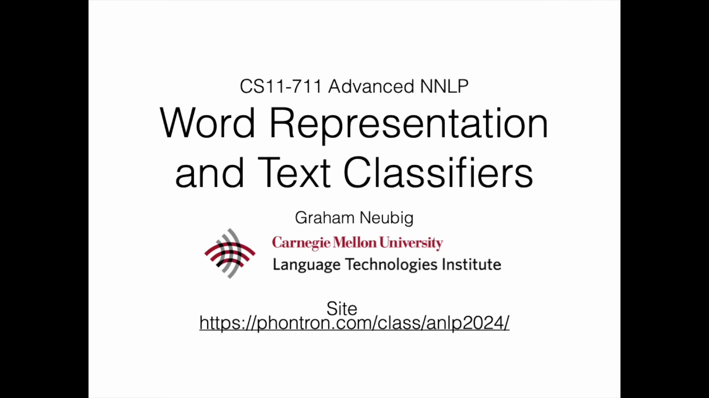
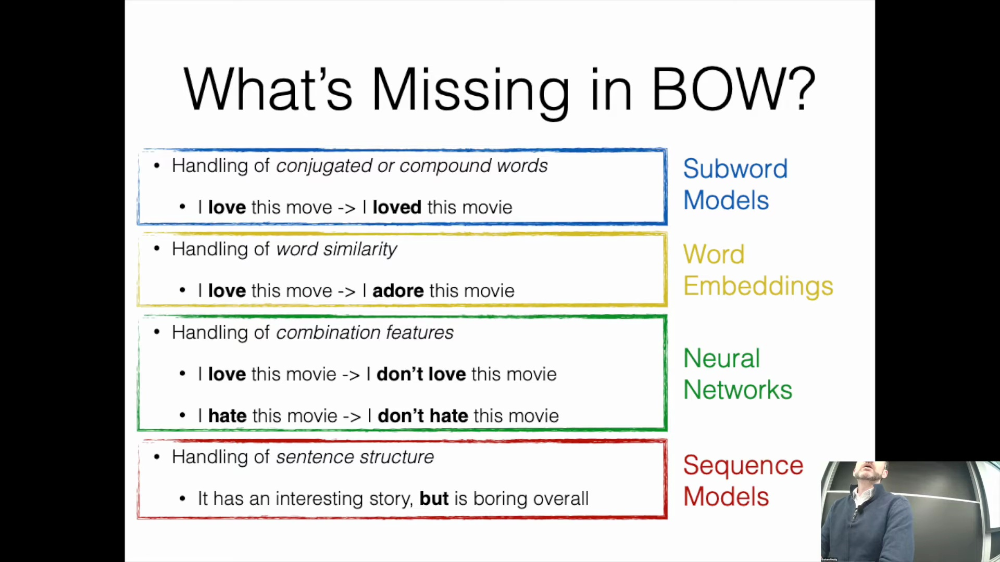
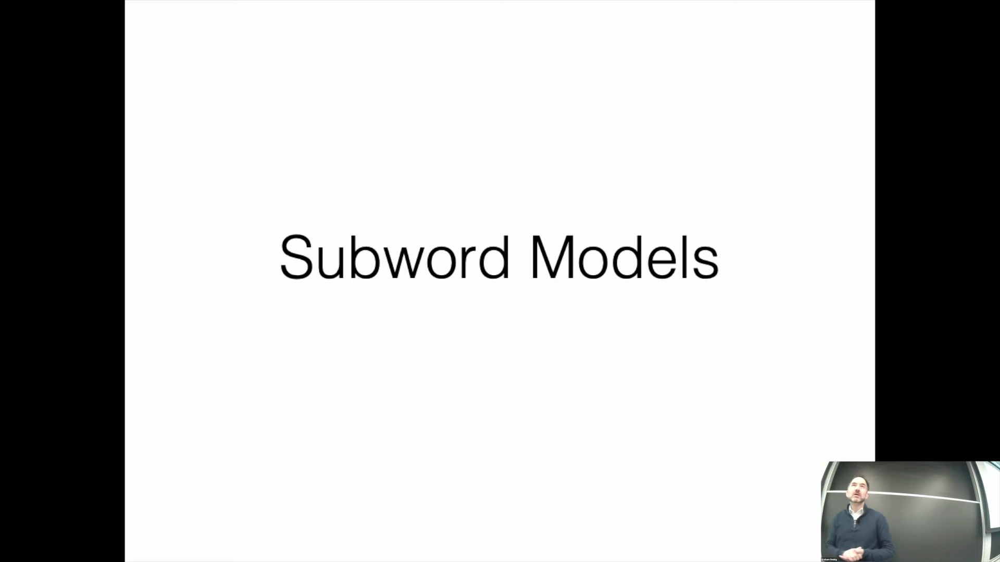
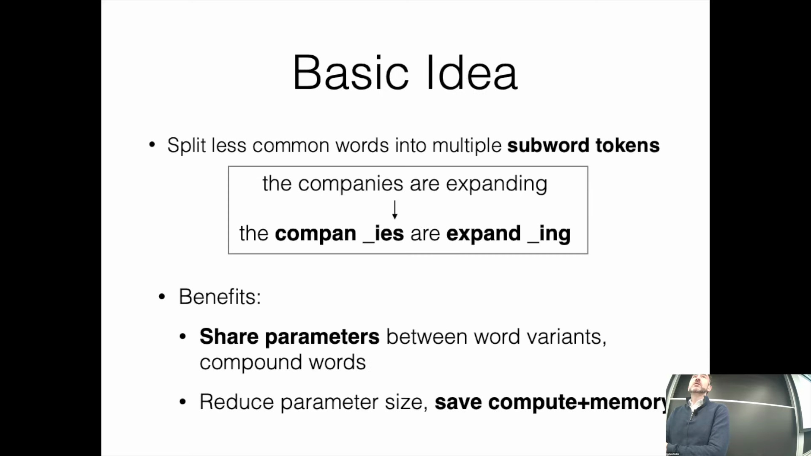

## 简介与词袋模型基础
本讲座主要探讨词表示(Word Representation)与文本分类(Text Classification)，它们是学习更高级自然语言处理(Natural Language Processing, NLP)概念的重要基础。课程首先回顾了词袋模型(Bag-of-Words, BoW)，在该模型中，每个词都被编码为一个独热向量(One-Hot Vector)。这些向量被聚合为词频向量(Word Frequency Vector)，与学习到的权重(Learned Weights)相乘后，生成用于二分类(Binary Classification)或多分类任务(Multi-class Classification)的得分。在此框架下，特征完全基于词汇本身的标识，缺乏上下文感知能力(Context Awareness)。

## 应对词袋模型局限性的现代解决方案
尽管词袋模型简单高效，但它存在一些关键局限性：难以有效处理词形变化(Inflectional Morphology)与复合词(Compound Words)、忽略了词汇间的语义相似性(Semantic Similarity)、缺乏特征交互(Feature Interaction)能力，并且完全忽略了句法结构(Syntactic Structure)。构建基于规则的系统(Rule-based Systems)来解决这些问题既复杂又低效。为克服这些挑战，现代自然语言处理采用了针对性的解决方案：采用子词(Subword)或基于字符的模型(Character-based Models)处理词形变化，利用词嵌入(Word Embeddings)捕捉语义相似性，通过神经网络(Neural Networks)自动学习特征组合，并采用基于序列的模型(Sequence-based Models)以保留句法结构。

## 子词分词与词汇表压缩
子词建模(Subword Modeling)是当代语言模型(Language Models)（包括最先进架构(State-of-the-Art, SOTA)）的基石。其核心目标是将低频或复杂词汇拆分为更小且富有语义的子词标记(Subword Tokens)。例如，“companies”可能会被分词为“compan”和“ies”，而“expanding”则变为“expand”和“ing”。该策略具有两大主要优势：它使模型能够泛化至各类词形变化与未登录词(Out-of-Vocabulary, OOV)，同时大幅缩减词汇表规模，从而降低模型参数量与计算开销(Computational Overhead)。

尽管英语单词的理论形态数量可达数百万（受词形变化、俚语、拼写错误以及齐夫定律(Zipf's Law)分布的影响），子词分词技术(Subword Tokenization)仍能有效地将这一近乎无限的空间压缩为约 60,000 个实用词元，从而确保模型训练的高效性与可扩展性(Scalability)。

## 字符级建模的局限性
子词分词的一种替代方案是字符级(Character-level)或字节级(Byte-level)建模，即将每个独立的字符视为离散标记(Discrete Tokens)。然而，这种方法带来了显著的实际挑战。首先，它会生成极长的输入序列(Input Sequences)，增加神经网络的处理负担并消耗大量内存资源。其次，字符级表示(Character-level Representations)本质上缺乏语义表达能力；“字符袋”(Bag-of-Characters)模型无法有效捕捉高层语义或情感倾向（例如，模型难以仅凭分散的字母组合直接捕捉“good”一词所蕴含的积极情感）。因此，原始字符建模通常不适用于需要深层语义理解的任务。

## 分词策略的权衡
高效的分词策略需在模型表达能力与数据稀疏性(Data Sparsity)之间取得平衡。若将完整句子或长短语视为单一标记，会引发严重的稀疏性问题；由于相同序列在训练语料中极少重复出现，模型将难以有效学习。反之，粒度过于精细的标记又难以捕捉有意义的语义信息。子词模型(Subword Models)成功地在二者之间取得了平衡：其构建的词元既具备足够的出现频率以确保稳定学习，又保留了足够的长度以承载上下文与形态信息。这种优化的表示方法为高级序列建模(Advanced Sequence Modeling)奠定了坚实基础，相关内容将在后续课程中深入探讨。