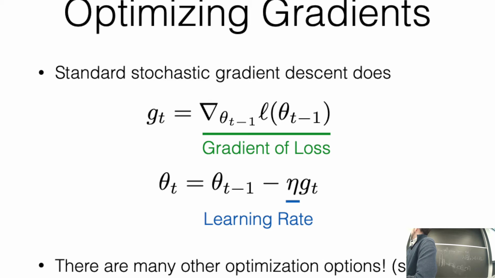
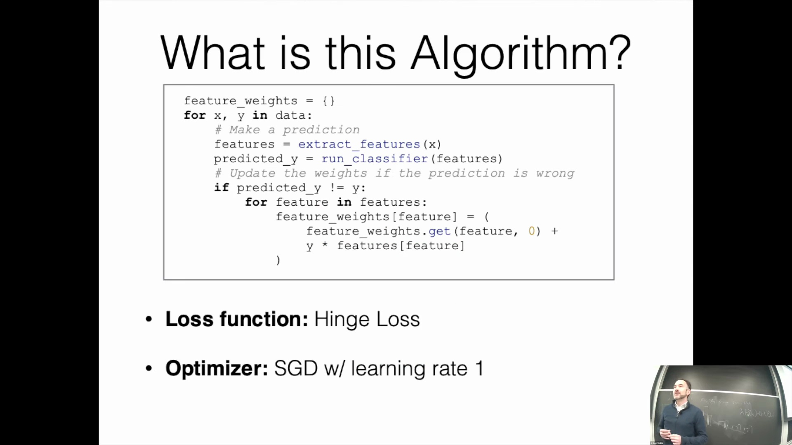
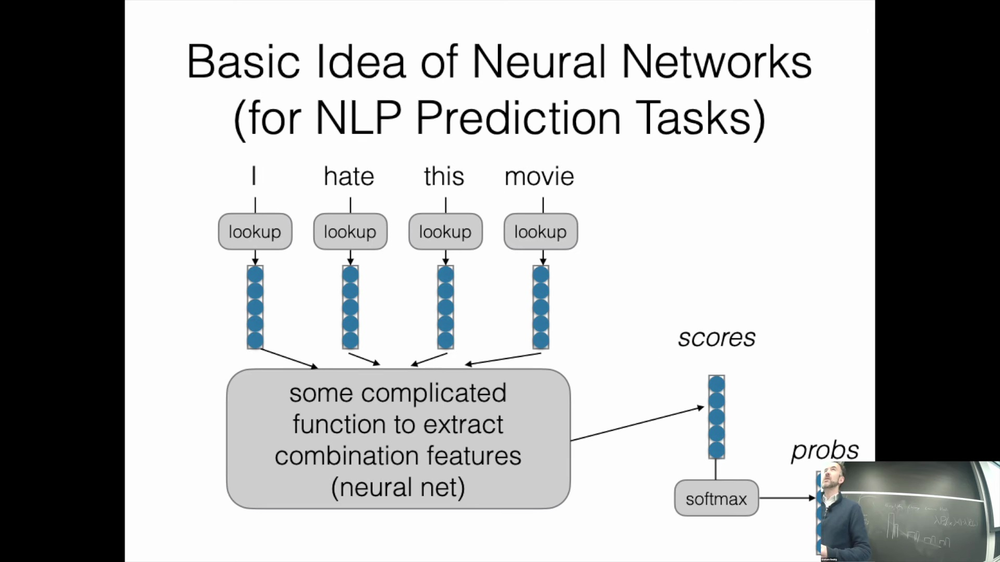
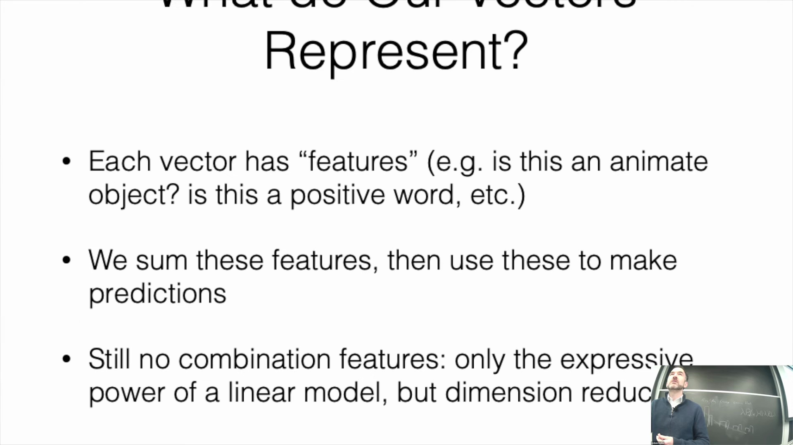
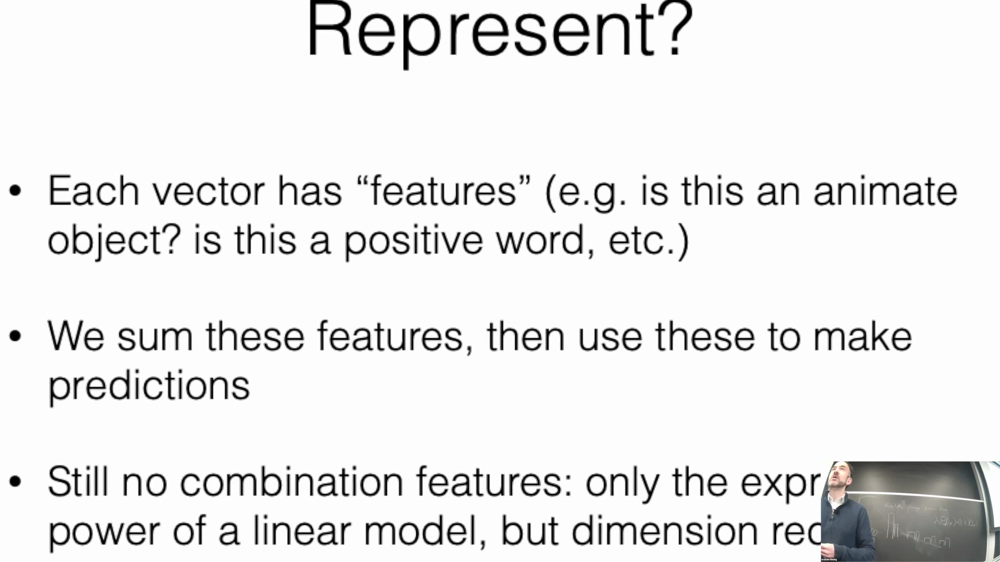
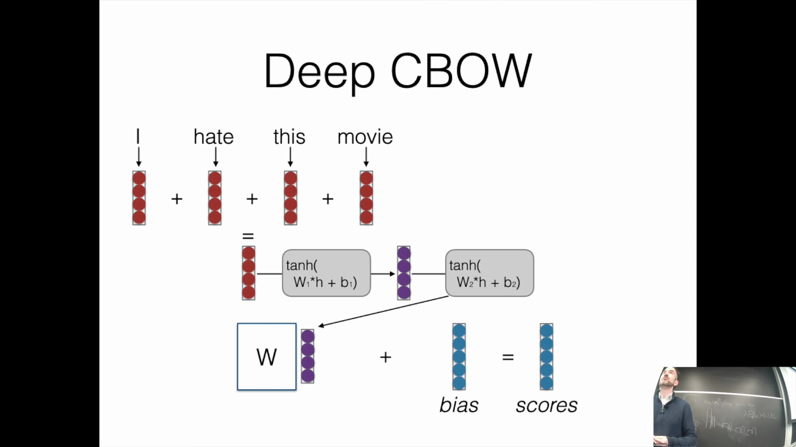
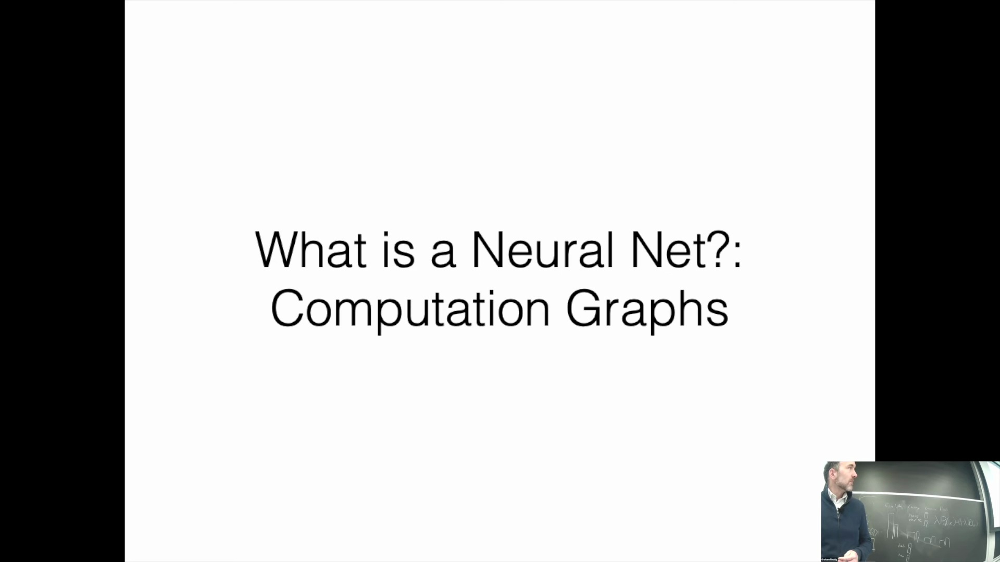
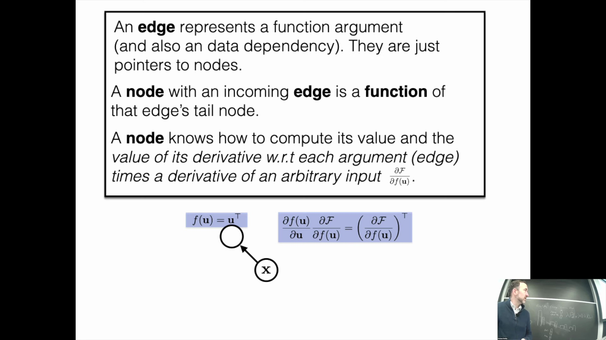
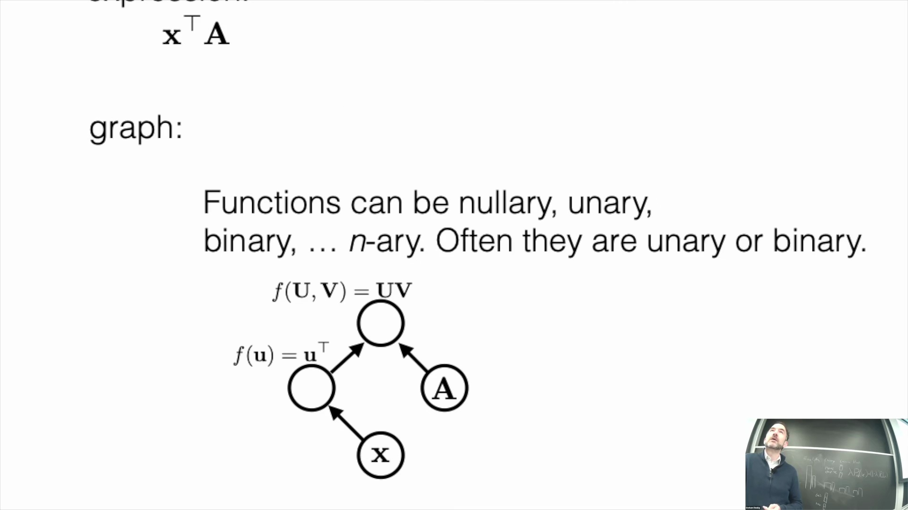
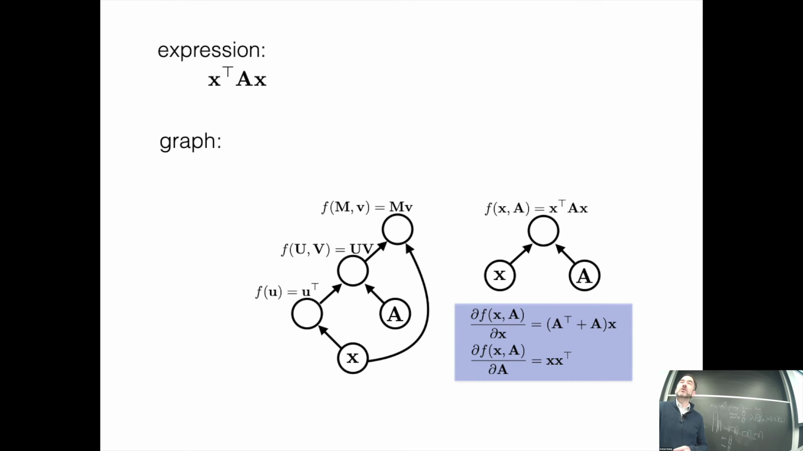

## 标准梯度下降优化
在进行梯度优化(Gradient Optimization)时，我们通常依赖于标准随机梯度下降(Stochastic Gradient Descent, SGD)，它仍是此类模型最基础的优化算法(Optimization Algorithm)。该过程涉及计算损失函数(Loss Function)相对于模型参数(Model Parameters)（通常表示为 $W$ 或 $\theta$）的梯度，可将其记为 $G$。为更新参数，我们将权重的当前值减去学习率(Learning Rate)与计算所得梯度的乘积。

## 确定损失函数与学习率
尽管存在诸多高级优化选项（如 Adam(Adaptive Moment Estimation)，后续将详细介绍），但理解基础更新规则(Update Rule)至关重要。通过审视算法结构，我们可以推断出其所采用的具体损失函数与学习率。该实现依赖于一个用于判断预测是否匹配的 `if` 语句。若预测标签与真实标签不匹配，权重将沿真实标签方向按学习率进行更新。这一逻辑表明，该算法使用了**铰链损失(Hinge Loss)**，且**学习率为 1**。这种条件更新机制直接对应于铰链损失的梯度(Gradient)：仅当样本未满足正确分类的间隔条件时，参数才会被更新。由此可见，即便是一个简单的 Python 实现，其本质也在复现随机梯度下降的过程。

## 组合特征的挑战
线性模型(Linear Model)的简洁性是其显著优势，但其能力主要受限于词袋模型(Bag-of-Words Model)或基于基础特征的架构。在处理组合特征(Compositional Features)时，其关键缺陷便显露出来。例如，诸如“don't hate（不讨厌）”和“don't love（不爱）”的短语，无法仅通过简单累加单个词的权重来准确建模。词元(Token)之间的语义交互(Semantic Interaction)至关重要。在线性框架中，否定词与情感词的结合极易导致预测偏差，模型无法捕捉“don't”如何从根本上扭转其后动词的语义。简单的特征相加无法解决此类上下文交互问题，这凸显了引入更复杂建模方法的必要性。

## 引入神经网络以实现特征交互
为克服线性特征组合的局限性，我们转向神经网络(Neural Network)。该架构首先为每个词检索稠密词嵌入(Dense Embeddings)。我们并不直接利用这些嵌入进行预测，而是将其输入至一系列线性变换(Linear Transformation)与非线性激活函数(Non-linear Activation Function)中。这种多层结构使模型能够自动学习复杂的组合特征。与连续词袋模型(Continuous Bag-of-Words, CBOW)不同（后者在聚合词嵌入时未考虑特征间的交互），神经网络能够在连续的层级中显式地学习不同特征之间的相互关系。

## 深度连续词袋模型
通过将词嵌入输入至多个网络层，模型得以学习复杂的特征组合。例如，第二层中的某个神经元可能仅在同时检测到负面情感特征（如特征 1 对“hate”等词产生响应）与否定特征（如特征 5 对“don't”或“not”等词产生响应）时才会被激活。这使得模型能够通过识别特定语言模式的共现(Co-occurrence)，准确解析“don't despise（不鄙视）”或“not hate（不讨厌）”等蕴含细微语义差别的短语。该架构被称为深度 CBOW 模型(Deep CBOW Model)，于 2015 年前后受到广泛关注。研究表明，即便是结构相对简单的深度网络(Deep Network)，也能在文本分类任务中表现优异，因为它们能够有效共享词表示(Word Representation)，并在深层网络中提取具有意义的交互特征。

## 为什么神经网络对复杂模型至关重要
随着网络架构因多重矩阵乘法(Matrix Multiplication)与非线性激活而日益复杂，手动计算损失函数与梯度已不再可行。尽管对于简单的铰链损失模型而言，手工推导导数尚属可行，但对于深层多层网络而言，此举既低效又易出错。这种计算需求直接推动了现代深度学习框架的广泛应用。尽管早期的深度学习模型在概念上受到生物神经元(Biological Neuron)（即达到电位阈值时产生脉冲）的启发，但其底层本质是计算图(Computational Graph)，而非严格的生物仿真。

## 深度学习中的计算图
在自然语言处理(Natural Language Processing, NLP)中，模型被组织为计算图，其中每个节点代表一个张量(Tensor)：标量(Scalar)、向量(Vector)、矩阵(Matrix)或更高维度的数组。节点同时表示对输入施加数学运算后的输出结果。连接这些节点的边(Edge)既代表函数参数，也表征数据依赖关系。在有向无环图(Directed Acyclic Graph, DAG)结构中，每个节点不仅负责计算自身的输出值，还会计算其相对于输入的梯度，从而高效实现自动微分(Automatic Differentiation)与反向传播(Backpropagation)。图中的运算函数可以是一元(Unary)、二元(Binary)或更为复杂的形式。关键在于，同一个数学运算可通过多种高效的计算图配置来表达。

